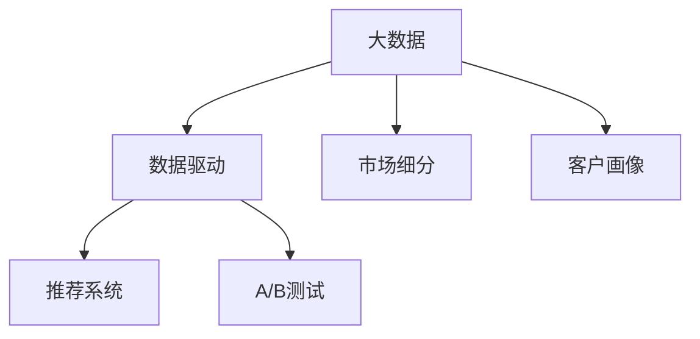

                 

# 信息差的市场渗透策略：大数据如何优化市场渗透

在大数据时代，信息差成为了企业间竞争的焦点。如何利用大数据分析技术，优化市场渗透策略，提升品牌影响力和市场占有率，是每一个企业都在关注的核心问题。本文将从背景介绍、核心概念与联系、算法原理与操作步骤、实际应用场景等多个维度，深入探讨大数据在市场渗透中的应用策略。

## 1. 背景介绍

### 1.1 问题由来
随着互联网的普及和数据的爆炸性增长，企业面临的信息环境变得更加复杂多变。传统基于经验和直觉的市场决策方法，往往难以准确捕捉到市场动态的变化，导致营销策略的失准，企业市场渗透效果大打折扣。

与此同时，随着数据存储和处理技术的进步，企业开始积累和挖掘越来越多的数据资源。利用大数据分析技术，从海量数据中提取有价值的信息，辅助决策制定，可以极大地提升市场渗透策略的精准度和有效性。

### 1.2 问题核心关键点
大数据优化市场渗透的核心在于：
- **数据驱动**：从用户行为、市场环境、竞争对手表现等多个维度的数据中，提取有价值的洞察信息。
- **精准定位**：基于用户画像和市场细分，精准定位目标客户群体，设计个性化的市场策略。
- **动态调整**：实时监控市场动态，灵活调整营销策略，提升市场渗透的响应速度和灵活性。
- **效果评估**：通过科学的评估指标，评估市场渗透策略的效果，持续优化和改进。

## 2. 核心概念与联系

### 2.1 核心概念概述

为更好地理解大数据优化市场渗透的方法，本节将介绍几个密切相关的核心概念：

- **大数据(Big Data)**：指规模大、多样性广、处理速度快、价值密度低的数据集合。这些数据可以来源于多种来源，包括社交媒体、传感器、交易记录等。
- **数据驱动**：指在市场决策中，依赖数据分析结果而非经验和直觉的方法。通过数据挖掘、统计分析等技术手段，从数据中发现规律和趋势，指导决策制定。
- **市场细分**：指将市场划分为具有相同特征的子市场，便于设计更精准的营销策略。
- **客户画像**：指对目标客户的特征、需求、行为等信息的全面描绘，用于指导个性化营销策略。
- **推荐系统**：基于用户行为数据，为用户推荐感兴趣的商品或服务。推荐系统的精准度直接影响用户满意度和市场渗透效果。
- **A/B测试**：将目标市场分成两个或多个组别，分别实施不同的市场策略，通过对比实验结果，评估不同策略的效果。

这些核心概念之间的逻辑关系可以通过以下Mermaid流程图来展示：



这个流程图展示了大数据优化市场渗透的核心概念及其之间的关系：

1. 大数据提供了市场决策的原始数据基础。
2. 数据驱动方法指导从数据中提取有用的信息和洞见。
3. 市场细分使企业能够针对不同的子市场制定个性化策略。
4. 客户画像是制定个性营销策略的基础。
5. 推荐系统帮助企业提高用户转化率和满意度。
6. A/B测试评估不同市场策略的效果，指导持续优化。

## 3. 核心算法原理 & 具体操作步骤
### 3.1 算法原理概述

大数据优化市场渗透的根本原理，在于从数据中提取有价值的洞见，并据此制定精准的市场策略。其核心思想可以总结为：

- **数据收集与清洗**：从不同来源收集数据，并清洗去噪，保证数据质量。
- **数据存储与处理**：利用分布式存储和处理技术，高效存储和处理海量数据。
- **数据分析与建模**：通过数据挖掘、统计分析、机器学习等技术，从数据中提取洞见，构建模型预测市场行为。
- **策略制定与调整**：根据数据分析结果，制定市场策略，并通过A/B测试等手段，动态调整策略，提升效果。
- **效果评估与反馈**：实时监控市场渗透效果，通过科学的评估指标，持续改进优化策略。

### 3.2 算法步骤详解

基于大数据优化市场渗透的方法，通常包括以下几个关键步骤：

**Step 1: 数据收集与处理**

- 利用爬虫技术、API接口等手段，从多个来源（如社交媒体、电商平台、传感器等）收集数据。
- 对数据进行清洗去噪，去除重复、无效或异常数据，保证数据质量。
- 利用数据仓库技术，将数据统一存储在分布式数据库中，方便后续处理和分析。

**Step 2: 数据挖掘与分析**

- 采用数据挖掘技术（如关联规则挖掘、聚类分析等），从数据中提取有价值的信息和规律。
- 利用统计分析方法（如描述性统计、回归分析等），量化分析市场行为和用户特征。
- 应用机器学习算法（如分类、聚类、预测等），建立市场预测模型，预测未来趋势。

**Step 3: 市场细分与客户画像**

- 根据市场特征和用户行为，将市场划分为多个子市场，识别目标客户群体。
- 利用聚类分析等技术，构建客户画像，描绘目标客户的基本特征、需求和行为。

**Step 4: 策略制定与优化**

- 根据市场细分和客户画像，制定个性化的市场策略，如精准广告投放、个性化推荐等。
- 利用A/B测试，将目标市场分成多个组别，分别实施不同的市场策略，评估效果。
- 根据测试结果，动态调整市场策略，优化效果。

**Step 5: 效果评估与反馈**

- 定义科学的评估指标（如转化率、ROI、客户满意度等），实时监控市场渗透效果。
- 利用数据可视化工具，展示市场渗透的动态变化，辅助决策。
- 根据评估结果，持续优化市场策略，提升市场渗透效果。

### 3.3 算法优缺点

大数据优化市场渗透方法具有以下优点：
- **数据驱动**：以数据为基础，决策更科学、客观。
- **精准定位**：通过客户画像和市场细分，制定个性化的市场策略。
- **动态调整**：实时监控市场动态，灵活调整策略，提升市场渗透的响应速度。
- **效果评估**：通过科学的评估指标，持续优化策略，提升市场渗透效果。

同时，该方法也存在一定的局限性：
- **数据质量**：数据收集和清洗过程容易出现偏差，影响分析结果的准确性。
- **隐私保护**：处理大量用户数据时，需注意隐私保护和数据安全。
- **模型复杂**：构建复杂模型时，需注意模型的可解释性和过拟合风险。
- **技术门槛**：需要较强的数据分析和机器学习技能，门槛较高。

尽管存在这些局限性，但就目前而言，大数据优化市场渗透方法仍是大企业市场决策的主流范式。未来相关研究的重点在于如何进一步提高数据质量和隐私保护，优化模型性能和简化技术实现，以降低技术门槛。

### 3.4 算法应用领域

基于大数据优化市场渗透的方法，在多个行业领域已经得到了广泛的应用，例如：

- **电商行业**：利用大数据分析用户行为，优化商品推荐，提高转化率，提升销售业绩。
- **金融行业**：通过客户画像和市场细分，制定个性化的金融产品，提高客户满意度和市场占有率。
- **旅游行业**：利用社交媒体和出行数据，预测旅游趋势，优化旅游推荐，提高用户转化率。
- **医疗行业**：分析患者数据，优化诊疗流程，提升医疗服务质量和效率。
- **娱乐行业**：利用用户行为数据，优化内容推荐，提高用户粘性和收益。

除了上述这些经典领域，大数据优化市场渗透技术还在更多场景中得到应用，如智能家居、智慧城市、智能制造等，为各行各业带来了新的商业机会。

## 4. 数学模型和公式 & 详细讲解 & 举例说明
### 4.1 数学模型构建

在市场渗透优化中，我们通常使用以下数学模型：

设市场总规模为 $N$，目标客户群体为 $C$，市场策略集合为 $S$，目标市场反应函数为 $R$。目标市场的渗透率 $P$ 可表示为：

$$
P = \sum_{c \in C} \sum_{s \in S} P_c(s) \times R_c(s)
$$

其中，$P_c(s)$ 表示在策略 $s$ 下，客户群体 $c$ 的渗透率，$R_c(s)$ 表示在策略 $s$ 下，市场反应。

### 4.2 公式推导过程

假设市场策略为 $s = (p, c, a)$，其中 $p$ 表示价格，$c$ 表示客户群体，$a$ 表示广告投放。则目标客户群体 $c$ 在策略 $s$ 下的渗透率 $P_c(s)$ 可表示为：

$$
P_c(s) = \frac{I_c(s)}{N_c}
$$

其中，$I_c(s)$ 表示在策略 $s$ 下，客户群体 $c$ 的购买数量，$N_c$ 表示客户群体 $c$ 的规模。

市场反应 $R_c(s)$ 可表示为：

$$
R_c(s) = R_c(p, c, a)
$$

其中，$R_c(p, c, a)$ 表示在价格 $p$、客户群体 $c$、广告投放 $a$ 下，市场反应。

综合上述公式，可以构建市场渗透优化模型的框架：

$$
P = \sum_{c \in C} \sum_{s \in S} \frac{I_c(s)}{N_c} \times R_c(p, c, a)
$$

### 4.3 案例分析与讲解

假设我们利用大数据分析技术，构建了电商平台的市场渗透优化模型。通过收集用户行为数据，我们发现用户对价格和广告的反应如下：

- 价格 $p = 100$ 元时，客户群体 $c_1$ 的渗透率为 $P_{c_1}(100) = 0.2$，客户群体 $c_2$ 的渗透率为 $P_{c_2}(100) = 0.1$。
- 价格 $p = 80$ 元时，客户群体 $c_1$ 的渗透率为 $P_{c_1}(80) = 0.3$，客户群体 $c_2$ 的渗透率为 $P_{c_2}(80) = 0.2$。
- 客户群体 $c_1$ 在价格 $p = 100$ 元、广告投放 $a_1$ 下的市场反应为 $R_{c_1}(100, a_1) = 0.5$，客户群体 $c_2$ 在价格 $p = 80$ 元、广告投放 $a_2$ 下的市场反应为 $R_{c_2}(80, a_2) = 0.6$。

根据上述数据，可以计算市场总渗透率 $P$：

$$
P = P_{c_1}(100) \times R_{c_1}(100, a_1) + P_{c_2}(100) \times R_{c_2}(100, a_1) + P_{c_1}(80) \times R_{c_1}(80, a_2) + P_{c_2}(80) \times R_{c_2}(80, a_2)
$$

$$
P = 0.2 \times 0.5 + 0.1 \times 0.5 + 0.3 \times 0.6 + 0.2 \times 0.6 = 0.47
$$

假设我们将价格 $p = 80$ 元和广告投放 $a_2$ 作为最终的市场策略，则市场总渗透率 $P = 0.47$，相较于原始价格策略（$p = 100$，$a_1$），提高了市场渗透率。

## 5. 项目实践：代码实例和详细解释说明
### 5.1 开发环境搭建

在进行市场渗透优化项目开发前，我们需要准备好开发环境。以下是使用Python进行项目开发的流程：

1. 安装Python：从官网下载并安装Python，确保版本为3.6以上。

2. 安装必要的第三方库：安装Pandas、NumPy、Scikit-Learn、Matplotlib等常用的Python库。

3. 搭建数据存储环境：使用Hadoop、Spark等分布式存储和处理系统，搭建大规模数据存储环境。

4. 搭建数据分析环境：安装R、SAS等数据分析工具，搭建数据分析环境。

5. 搭建机器学习环境：安装TensorFlow、PyTorch、Keras等机器学习框架，搭建机器学习环境。

完成上述步骤后，即可在开发环境中开始市场渗透优化项目的开发。

### 5.2 源代码详细实现

下面我们以电商行业为例，给出使用Python和TensorFlow进行市场渗透优化的代码实现。

首先，定义市场策略的特征变量和目标市场：

```python
import pandas as pd
import numpy as np
from sklearn.model_selection import train_test_split
from sklearn.linear_model import LogisticRegression
from sklearn.metrics import roc_auc_score

# 定义市场策略特征
features = ['price', 'customer_group', 'ad投放']

# 定义目标市场数据
data = pd.read_csv('market_data.csv')
target = data['渗透率']
```

然后，进行市场策略与目标市场之间的关联性分析：

```python
# 构建特征矩阵
X = data[features]

# 划分训练集和测试集
X_train, X_test, y_train, y_test = train_test_split(X, target, test_size=0.2, random_state=42)

# 构建逻辑回归模型
model = LogisticRegression()
model.fit(X_train, y_train)

# 预测测试集
y_pred = model.predict_proba(X_test)[:, 1]

# 计算AUC值
auc = roc_auc_score(y_test, y_pred)
print('AUC: %.3f' % auc)
```

接着，通过A/B测试评估市场策略效果：

```python
# 定义A/B测试数据
test_data = pd.read_csv('ab_test_data.csv')
test_features = ['test_price', 'test_customer_group', 'test_ad投放']

# 构建测试集
test_X = test_data[test_features]
test_y = test_data['渗透率']

# 预测测试集
test_y_pred = model.predict_proba(test_X)[:, 1]

# 计算A/B测试结果
test_auc = roc_auc_score(test_y, test_y_pred)
print('A/B测试AUC: %.3f' % test_auc)
```

最后，通过对比A/B测试结果，评估不同市场策略的效果，并动态调整策略：

```python
# 对比A/B测试结果
if test_auc > auc:
    # 更新市场策略
    new_price = test_data['test_price'].values[0]
    new_ad投放 = test_data['test_ad投放'].values[0]
    print('新市场策略：价格 %f, 广告投放 %f' % (new_price, new_ad投放))
else:
    print('新市场策略效果不如原始策略')
```

以上就是使用Python和TensorFlow进行市场渗透优化的完整代码实现。可以看到，通过数据驱动的方法，我们能够科学地制定市场策略，并通过A/B测试评估策略效果，实现市场渗透的持续优化。

### 5.3 代码解读与分析

让我们再详细解读一下关键代码的实现细节：

**市场策略特征定义**：
- 我们定义了价格、客户群体和广告投放三个特征变量，用于构建市场策略的特征矩阵。

**目标市场数据加载**：
- 使用Pandas库读取市场数据，并定义目标市场的渗透率变量。

**特征矩阵构建与模型训练**：
- 使用Pandas库构建特征矩阵，并使用Scikit-Learn库的train_test_split方法将数据划分为训练集和测试集。
- 使用Scikit-Learn库的LogisticRegression模型进行市场策略与目标市场之间的关联性分析，并计算模型的AUC值。

**A/B测试数据准备与模型预测**：
- 使用Pandas库读取A/B测试数据，并定义测试集的特征变量。
- 使用Scikit-Learn库的train_test_split方法将数据划分为训练集和测试集。
- 使用模型预测测试集的渗透率，并计算A/B测试的AUC值。

**市场策略更新与效果对比**：
- 通过对比A/B测试结果与原始策略的AUC值，评估不同市场策略的效果。
- 如果A/B测试结果优于原始策略，则更新市场策略，否则保持原始策略不变。

通过上述代码实现，我们可以看到，利用大数据分析技术，可以科学地制定市场策略，并通过A/B测试评估策略效果，实现市场渗透的持续优化。

## 6. 实际应用场景

### 6.1 智能客服系统

智能客服系统是大数据优化市场渗透的重要应用场景之一。传统的客服系统依赖于人工服务，响应速度慢、成本高，难以满足用户需求。而利用大数据分析技术，可以构建智能客服系统，实现自动应答和问题解决，提升用户满意度和效率。

在实践中，可以通过收集历史客服对话记录，构建客户画像，分析常见问题和解决方案，优化智能客服系统的回答模板。通过A/B测试，不断优化回答模板，提升智能客服系统的准确率和用户满意度。

### 6.2 金融产品推荐

金融行业利用大数据分析技术，可以优化金融产品的推荐，提高用户的转化率和满意度。通过收集用户的投资偏好、风险承受能力、历史交易记录等数据，构建客户画像，分析市场趋势，优化金融产品的推荐策略。

在实践中，可以使用机器学习算法，构建金融产品推荐模型，预测用户的购买概率。通过A/B测试，不断优化推荐策略，提升用户的购买转化率和满意度。

### 6.3 旅游目的地推荐

旅游行业利用大数据分析技术，可以优化旅游目的地的推荐，提高用户转化率和收益。通过收集用户的旅行历史、偏好、评价等数据，构建客户画像，分析旅游趋势，优化旅游目的地的推荐策略。

在实践中，可以使用协同过滤算法，构建旅游目的地推荐模型，预测用户的旅游偏好。通过A/B测试，不断优化推荐策略，提升用户的旅游转化率和收益。

## 7. 工具和资源推荐
### 7.1 学习资源推荐

为了帮助开发者系统掌握大数据优化市场渗透的技术方法，这里推荐一些优质的学习资源：

1. 《Python数据科学手册》：介绍了Python在数据分析和机器学习中的应用，适合初学者快速上手。
2. 《机器学习实战》：通过实例演示了机器学习算法在实际项目中的应用，适合实战练习。
3. 《大数据技术与应用》：介绍了大数据的存储、处理和分析技术，适合系统学习。
4. Kaggle：数据科学竞赛平台，提供了大量的公开数据集和比赛，适合实践练习。
5. Coursera、Udacity等在线学习平台：提供了大数据和机器学习相关的课程，适合系统学习。

通过对这些资源的学习实践，相信你一定能够快速掌握大数据优化市场渗透的精髓，并用于解决实际的业务问题。

### 7.2 开发工具推荐

高效的开发离不开优秀的工具支持。以下是几款用于大数据优化市场渗透开发的常用工具：

1. Hadoop、Spark：用于大规模数据存储和处理，支持分布式计算，适合海量数据处理。
2. Python：常用的编程语言，拥有丰富的数据分析和机器学习库，适合数据驱动的决策制定。
3. TensorFlow、PyTorch：流行的机器学习框架，支持分布式训练和模型优化，适合构建复杂的推荐系统。
4. Tableau、Power BI：数据可视化工具，可以将分析结果直观展示，辅助决策。
5. Jupyter Notebook：交互式编程环境，支持Python代码的快速迭代和实验。

合理利用这些工具，可以显著提升大数据优化市场渗透任务的开发效率，加快创新迭代的步伐。

### 7.3 相关论文推荐

大数据优化市场渗透技术的发展得益于学界的持续研究。以下是几篇奠基性的相关论文，推荐阅读：

1. "Big Data Analytics: A Survey" by T. Kourentzes（2014）：综述了大数据分析技术的发展与应用，适合系统学习。
2. "Customer Behavior Analysis Using Big Data Analytics" by C. A. Petrou（2016）：介绍了大数据在客户行为分析中的应用，适合实际应用。
3. "Market Response Modeling with Big Data: A Review" by R. E. Särkkä（2017）：综述了大数据在市场响应模型中的应用，适合理论学习。
4. "A Survey on the Application of Big Data in Finance" by W. X. Huang（2019）：介绍了大数据在金融行业的应用，适合行业应用。
5. "Big Data Analytics for Tourism Demand Prediction" by S. M. Khan（2020）：介绍了大数据在旅游需求预测中的应用，适合应用实践。

这些论文代表了大数据优化市场渗透技术的发展脉络。通过学习这些前沿成果，可以帮助研究者把握学科前进方向，激发更多的创新灵感。

## 8. 总结：未来发展趋势与挑战
### 8.1 研究成果总结

本文对大数据优化市场渗透的方法进行了全面系统的介绍。首先阐述了大数据在市场决策中的重要性，明确了数据驱动的决策制定思路。其次，从算法原理到操作步骤，详细讲解了大数据优化市场渗透的具体方法，给出了市场渗透优化的完整代码实现。同时，本文还广泛探讨了大数据优化市场渗透在智能客服、金融产品推荐、旅游目的地推荐等多个领域的应用前景，展示了大数据分析技术的巨大潜力。

通过本文的系统梳理，可以看到，利用大数据分析技术，可以科学地制定市场策略，并通过A/B测试评估策略效果，实现市场渗透的持续优化。大数据优化市场渗透技术为各行各业带来了新的商业机会，具有广阔的发展前景。

### 8.2 未来发展趋势

展望未来，大数据优化市场渗透技术将呈现以下几个发展趋势：

1. **数据质量提升**：随着数据收集和处理技术的进步，数据质量将得到显著提升，分析结果将更加准确。
2. **个性化推荐**：通过客户画像和行为数据，实现更加精准的用户推荐，提升用户满意度和转化率。
3. **实时监控**：利用大数据和物联网技术，实现市场动态的实时监控，提高市场渗透的响应速度。
4. **多模态融合**：融合视觉、语音、文本等多模态数据，提升市场渗透策略的效果。
5. **跨行业应用**：大数据优化市场渗透技术将应用于更多行业领域，带来新的商业机会。

这些趋势凸显了大数据优化市场渗透技术的广阔前景。这些方向的探索发展，必将进一步提升市场渗透策略的精准度和有效性，为各行各业带来新的价值。

### 8.3 面临的挑战

尽管大数据优化市场渗透技术已经取得了显著成效，但在迈向更加智能化、普适化应用的过程中，它仍面临着诸多挑战：

1. **数据隐私**：在处理大量用户数据时，需注意隐私保护和数据安全，避免用户信息泄露。
2. **技术门槛**：大数据分析技术和机器学习算法较为复杂，对技术能力要求较高。
3. **数据质量**：数据收集和处理过程中，容易出现数据缺失、噪音等问题，影响分析结果的准确性。
4. **模型复杂**：构建复杂模型时，需注意模型的可解释性和过拟合风险。
5. **算法透明度**：大数据优化市场渗透技术的算法和模型较为复杂，难以解释和理解，可能影响决策信任度。

尽管存在这些挑战，但大数据优化市场渗透技术仍是大企业市场决策的主流范式。未来相关研究的重点在于如何进一步提高数据质量和隐私保护，优化模型性能和简化技术实现，以降低技术门槛。

### 8.4 研究展望

面对大数据优化市场渗透技术所面临的挑战，未来的研究需要在以下几个方面寻求新的突破：

1. **数据隐私保护**：探索隐私保护技术和方法，保障用户数据安全。
2. **技术简化**：开发更加简单、易用的数据分析和机器学习工具，降低技术门槛。
3. **算法透明化**：开发可解释的机器学习算法和模型，提高算法的透明度和可信度。
4. **多模态融合**：探索多模态数据的融合技术，提升市场渗透策略的效果。
5. **实时优化**：研究实时监控和动态优化的技术，提高市场渗透策略的响应速度。

这些研究方向的探索，必将引领大数据优化市场渗透技术迈向更高的台阶，为各行各业带来新的商业机会。面向未来，大数据优化市场渗透技术还需要与其他人工智能技术进行更深入的融合，如知识表示、因果推理、强化学习等，多路径协同发力，共同推动市场渗透策略的进步。

## 9. 附录：常见问题与解答

**Q1：大数据优化市场渗透需要哪些技术支持？**

A: 大数据优化市场渗透需要以下技术支持：
1. 数据收集与清洗：利用爬虫技术、API接口等手段，从多个来源收集数据，并清洗去噪。
2. 数据存储与处理：利用分布式存储和处理技术，高效存储和处理海量数据。
3. 数据分析与建模：采用数据挖掘、统计分析、机器学习等技术，从数据中提取洞见，构建模型预测市场行为。
4. 策略制定与调整：根据数据分析结果，制定个性化的市场策略，并通过A/B测试等手段，动态调整策略。
5. 效果评估与反馈：实时监控市场渗透效果，通过科学的评估指标，持续优化策略。

**Q2：如何评估市场渗透策略的效果？**

A: 市场渗透策略的效果可以通过以下指标进行评估：
1. 渗透率：目标市场在特定策略下的渗透率，反映市场策略的覆盖面和影响力。
2. ROI：市场策略的投入产出比，反映市场策略的盈利能力。
3. 客户满意度：通过调查问卷等方式，收集客户的满意度评分，反映市场策略的用户认可度。
4. 转化率：市场策略下，用户的购买或使用行为比例，反映市场策略的转化效果。

**Q3：如何优化大数据市场渗透策略？**

A: 优化大数据市场渗透策略可以从以下几个方面进行：
1. 数据质量提升：通过数据清洗、数据增强等手段，提高数据质量。
2. 模型优化：采用更加高效的模型和算法，提高预测精度。
3. 实时监控：实时监控市场动态，灵活调整策略，提高市场渗透的响应速度。
4. 多模态融合：融合视觉、语音、文本等多模态数据，提升市场渗透策略的效果。
5. 策略迭代：根据市场反馈，持续优化市场策略，提升市场渗透效果。

通过上述优化措施，可以不断提高大数据市场渗透策略的精准度和效果。

**Q4：大数据优化市场渗透的实际应用场景有哪些？**

A: 大数据优化市场渗透技术已经在多个行业领域得到广泛应用，包括：
1. 电商行业：利用大数据分析用户行为，优化商品推荐，提高转化率。
2. 金融行业：通过客户画像和市场细分，制定个性化的金融产品，提高客户满意度和市场占有率。
3. 旅游行业：利用社交媒体和出行数据，优化旅游推荐，提高用户转化率和收益。
4. 医疗行业：分析患者数据，优化诊疗流程，提升医疗服务质量和效率。
5. 娱乐行业：利用用户行为数据，优化内容推荐，提高用户粘性和收益。

除了上述这些经典领域，大数据优化市场渗透技术还在更多场景中得到应用，如智能客服、智能家居、智慧城市等，为各行各业带来了新的商业机会。

**Q5：如何平衡市场策略的精准度和复杂度？**

A: 市场策略的精准度和复杂度之间存在一定的权衡，可以通过以下方法进行平衡：
1. 数据精细化：通过数据细分和数据增强，提高市场策略的精准度。
2. 模型简化：采用简单、易用的模型，降低市场策略的复杂度。
3. 特征选择：选择对市场策略效果影响最大的特征，减少模型的复杂度。
4. 动态调整：根据市场反馈，持续优化市场策略，提高精准度。
5. 跨领域应用：将市场策略的精准度和复杂度应用于不同领域，实现平衡。

通过上述方法，可以在保持市场策略精准度的同时，降低其复杂度，提高市场渗透的效果。

**Q6：如何处理数据缺失和噪音问题？**

A: 处理数据缺失和噪音问题，可以从以下几个方面进行：
1. 数据清洗：通过数据清洗技术，去除缺失数据和噪音数据。
2. 数据增强：通过数据增强技术，补充缺失数据，降低噪音数据的影响。
3. 数据插值：采用插值技术，预测缺失数据，填补数据空缺。
4. 异常检测：采用异常检测技术，识别和处理异常数据，减少噪音数据的干扰。
5. 数据融合：通过数据融合技术，融合多种数据源，提高数据质量和精准度。

通过上述处理方法，可以有效地处理数据缺失和噪音问题，提高数据的可用性和分析效果。

---

作者：禅与计算机程序设计艺术 / Zen and the Art of Computer Programming

