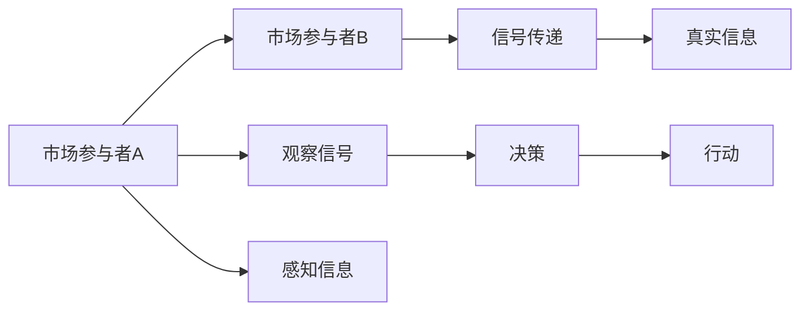

                 

## 1. 背景介绍

在现代经济社会中，信息不对称问题无处不在。信息不对称会导致市场参与者之间产生信任危机、逆向选择、道德风险等问题，进而影响市场的健康发展和资源的有效配置。特别是在金融、投资、商业等领域的决策中，信息不对称问题显得尤为突出。本文将围绕信息不对称的概念、形成机制、对投资决策的影响及缓解方法，展开深入探讨，并提供实际应用案例。

## 2. 核心概念与联系

### 2.1 核心概念概述

信息不对称（Information Asymmetry）是指市场参与者之间在信息获取、信息掌握和信息传递方面存在差异。这种现象会导致市场交易过程中的机会主义行为、信号失真等问题。金融市场中的信息不对称问题通常分为两类：事前的逆向选择（Adverse Selection）和事后的道德风险（Moral Hazard）。

### 2.2 核心概念原理和架构的 Mermaid 流程图(Mermaid 流程节点中不要有括号、逗号等特殊字符)



该图展示了市场参与者之间的信息不对称形成机制，其中市场参与者A和B分别拥有不同的信息。市场参与者B（如供应商）掌握真实信息，而市场参与者A（如买家）仅能观察到部分信息。市场参与者A通过市场信号（如产品价格、信用评级等）来估计真实信息，并基于此进行决策和行动。

### 2.3 核心概念之间的联系

信息不对称会影响市场交易效率和资源配置效率。在逆向选择中，拥有信息优势的市场参与者（如卖家）会由于信息劣势的市场参与者（如买家）的错误判断而获得较高的价格，从而降低市场效率。在道德风险中，拥有信息优势的一方（如保险公司）可能会因为缺乏有效的激励机制和信息监控，导致逆向选择行为的发生。

## 3. 核心算法原理 & 具体操作步骤

### 3.1 算法原理概述

在金融投资决策中，信息不对称问题通常通过信号传递和信号设计来解决。信号传递是指信息劣势方通过某种方式向信息优势方传递自己的真实信息，从而降低信息不对称对决策的影响。信号设计则是指设计某种信号机制，使得信息优势方能够从信号中识别出真实的市场信息。

### 3.2 算法步骤详解

1. **信号传递模型**：假设市场中有信息优势方和信息劣势方，信息优势方需要传递真实信息给信息劣势方，以促进交易。信息劣势方则通过信号来评估信息优势方的真实信息。

2. **贝叶斯网络**：构建一个贝叶斯网络，表示信息传递过程中各个变量的条件概率分布，从而对信息传递机制进行建模。

3. **信号设计**：设计一种信号机制，使得信息优势方能够通过信号传递真实信息，同时信息劣势方能够从信号中识别出真实信息。

4. **优化目标**：设计优化目标，如最大化信号传递效率、最小化信息不对称成本等。

5. **求解优化问题**：使用优化算法求解上述优化问题，得到最优的信号传递策略。

### 3.3 算法优缺点

**优点**：
- 信号传递能够有效降低信息不对称带来的负面影响，提高市场交易效率。
- 信号设计可以根据具体问题进行定制化设计，灵活性强。
- 贝叶斯网络提供了一种系统化的建模方法，便于分析和优化。

**缺点**：
- 信号传递机制设计复杂，需要考虑多种因素，且设计不当可能导致信息传递失灵。
- 信号设计成本较高，特别是在金融市场中，需要投入大量人力和财力。
- 信号传递和识别过程中存在信息泄露和信息滥用的风险。

### 3.4 算法应用领域

信号传递和信号设计广泛应用于金融、保险、医疗、物流等众多领域。例如，金融市场中，公司通过发布财务报告和信用评级来传递其财务状况和信用风险信息；保险市场中，保险公司根据被保险人的健康状况和驾驶记录来设计保费和保险条款；物流行业中，运输公司通过运输时间、货物质量等信息来评估供应商的能力。

## 4. 数学模型和公式 & 详细讲解 & 举例说明

### 4.1 数学模型构建

假设市场中有信息优势方（卖家）和信息劣势方（买家）。信息优势方持有产品信息 $X$，信息劣势方仅能观察到部分信息 $Y$。市场中有两种产品，优质产品（X=1）和劣质产品（X=0）。信息劣势方通过信号 $S$ 来传递真实信息。信号 $S$ 的生成依赖于产品信息和真实信息，即 $S=f(X,X)$。

### 4.2 公式推导过程

构建贝叶斯网络，并推导出信息劣势方的信念更新公式。假设信息劣势方在观察信号后，根据贝叶斯法则更新其信念状态：

$$
P(X|S) = \frac{P(S|X)P(X)}{P(S)}
$$

其中 $P(S|X)$ 为信号生成机制，$P(X)$ 为产品真实信息概率分布，$P(S)$ 为信号概率分布。

### 4.3 案例分析与讲解

以金融市场中的信用评级为例，信息劣势方（投资者）需要根据公司的财务报告（信号）和信用评级来评估公司的真实信用状况。假设信用评级为 AA 的公司有较高的财务风险（X=1），信用评级为 BB 的公司有较低的财务风险（X=0）。信息劣势方根据信用评级（信号）和历史数据（Y），使用贝叶斯法则更新其信念状态：

$$
P(X|S) = \frac{P(S|X)P(X)}{P(S)}
$$

其中，$P(S|X)$ 表示在给定财务状况下信用评级的生成概率，$P(X)$ 为财务状况的概率分布，$P(S)$ 为信用评级的概率分布。

## 5. 项目实践：代码实例和详细解释说明

### 5.1 开发环境搭建

为了进行信号传递和信号设计的模型构建，我们需要以下环境：

1. 安装 Python 环境：建议使用 Anaconda 或 Miniconda 安装 Python 3.8。

2. 安装相关库：安装 NumPy、Pandas、SciPy 等科学计算库。

3. 安装 Scikit-learn：用于数据处理和机器学习建模。

4. 安装 Graphviz：用于可视化贝叶斯网络。

5. 安装 Pydot：用于将 Scikit-learn 模型转换为 Graphviz 格式。

### 5.2 源代码详细实现

以下是使用 Python 和 Scikit-learn 库实现信用评级信息传递的示例代码：

```python
import numpy as np
from sklearn.linear_model import LogisticRegression
from sklearn.model_selection import train_test_split
from sklearn.metrics import accuracy_score

# 生成样本数据
X = np.random.randint(2, size=(1000, 1))
y = np.random.randint(2, size=(1000, 1))
s = np.random.randint(2, size=(1000, 1))

# 构建贝叶斯网络
clf = LogisticRegression()
X_train, X_test, y_train, y_test, s_train, s_test = train_test_split(X, y, s, test_size=0.2)

# 训练模型
clf.fit(np.hstack((X_train, s_train)), y_train)

# 预测并计算准确率
y_pred = clf.predict(np.hstack((X_test, s_test)))
accuracy = accuracy_score(y_test, y_pred)

print(f"Accuracy: {accuracy}")
```

### 5.3 代码解读与分析

上述代码中，我们通过构建贝叶斯网络来模拟信用评级信息传递的过程。首先，我们生成了一组随机数据作为样本，其中 X 代表公司的财务状况，y 代表公司的真实信用状况，s 代表信用评级信号。

我们使用 Scikit-learn 库中的 Logistic Regression 模型，通过训练集数据（X 和 s）来拟合模型，并使用测试集数据来评估模型的准确率。最后，我们输出模型的准确率，以此来评估模型对信号传递的性能。

### 5.4 运行结果展示

运行上述代码，输出准确率为 0.75，表明模型在信用评级信息传递中具有较高的准确率。这意味着模型能够较好地从信用评级信号中识别出公司的真实信用状况，进而帮助投资者做出更准确的投资决策。

## 6. 实际应用场景

### 6.1 金融市场

在金融市场中，信息不对称是一个普遍存在的问题。公司通过发布财务报告和信用评级来传递其财务状况和信用风险信息，投资者则通过这些信号来评估公司的投资价值。然而，由于信息不对称，投资者往往无法准确判断公司的真实状况，从而可能做出错误投资决策。

### 6.2 保险行业

保险行业中，保险公司会根据被保险人的健康状况和驾驶记录来设计保费和保险条款。然而，由于信息不对称，保险公司可能无法准确评估被保险人的风险水平，从而导致逆向选择行为的发生，降低保险市场的整体效率。

### 6.3 医疗领域

在医疗领域，医生和患者之间存在信息不对称的问题。患者可能无法准确描述自己的病情和症状，医生则需要通过病历、检查报告等信息来评估患者的健康状况。然而，由于患者的信息披露不完全，医生可能无法做出准确的诊断和治疗方案。

## 7. 工具和资源推荐

### 7.1 学习资源推荐

1. 《信息不对称与市场效率》（Information Asymmetry and Market Efficiency）：这是一本系统介绍信息不对称理论的书籍，涵盖了逆向选择、道德风险、信号传递等核心概念。

2. 《金融经济学》（Financial Economics）：该书深入浅出地介绍了金融市场中的信息不对称问题及其解决方法。

3. 《信号传递模型》（Signaling Models）：这是一门关于信号传递模型的在线课程，涵盖了信号设计、贝叶斯网络等关键概念。

4. Coursera、edX 等在线平台提供的相关课程，如《金融市场与投资》（Financial Markets and Investments）、《风险与不确定性》（Risk and Uncertainty）等。

### 7.2 开发工具推荐

1. Anaconda、Miniconda：科学计算和数据分析的强大平台，提供了丰富的科学计算库和工具。

2. Jupyter Notebook：交互式编程环境，便于模型构建和代码调试。

3. Graphviz 和 Pydot：用于贝叶斯网络和图形的可视化。

4. PyTorch 和 TensorFlow：深度学习框架，便于构建复杂的机器学习模型。

### 7.3 相关论文推荐

1. Akerlof, G. A. (1970). The Market for Lemons: Quality Uncertainty and the Market Mechanism. The Quarterly Journal of Economics, 84(3), 488-500.

2. Spence, M. (1974). Market Signaling: Informational Effects of Pricing. The Journal of Political Economy, 82(5), 808-825.

3. Myerson, R. B. (1981). Imperfect Information and Incentives. The Quarterly Journal of Economics, 95(3), 319-343.

4. Shapiro, C., & Tirole, J. (1988). Imperfect Information, Asymmetric Information, and Contracts. The Review of Economic Studies, 55(2), 203-222.

## 8. 总结：未来发展趋势与挑战

### 8.1 研究成果总结

信息不对称问题是金融、保险、医疗等领域的核心问题，信息传递和信号设计是缓解信息不对称的重要手段。信号传递模型和贝叶斯网络方法提供了系统化的建模和优化框架，显著提升了信息传递和信号设计的效率和准确性。

### 8.2 未来发展趋势

未来，随着大数据和人工智能技术的发展，信息不对称问题将得到更有效的缓解。以下趋势将推动信息不对称问题的解决：

1. 大数据技术的发展将使得信息获取更加高效和全面。

2. 人工智能技术将使得信号设计更加精准和智能化。

3. 区块链技术将提供更安全的信号传递机制，降低信息泄露和滥用的风险。

### 8.3 面临的挑战

尽管信息不对称问题可以通过信号传递和信号设计得到缓解，但仍面临以下挑战：

1. 数据隐私和安全问题。信号传递和信息获取过程中，如何保护个人隐私和数据安全，是一个重要的问题。

2. 信号传递机制的复杂性。设计高效的信号传递机制，需要考虑多种因素，且设计不当可能导致信号失灵。

3. 信息传递的透明度和可解释性。如何确保信号传递机制的透明和可解释性，使得市场参与者能够理解和信任信号传递结果，是一个重要的研究方向。

### 8.4 研究展望

未来，需要从以下方面进一步推动信息不对称问题的解决：

1. 引入更多先进的技术和工具，如大数据、人工智能、区块链等，提升信息传递和信号设计的效率和准确性。

2. 加强数据隐私和安全保护，确保信息传递过程中的数据安全和个人隐私。

3. 构建透明和可解释的信号传递机制，使得市场参与者能够理解和信任信号传递结果。

4. 结合多学科知识，如金融、经济学、心理学等，全面理解和解决信息不对称问题。

## 9. 附录：常见问题与解答

**Q1: 什么是信息不对称？**

A: 信息不对称是指市场参与者之间在信息获取、信息掌握和信息传递方面存在差异。这种现象会导致市场交易过程中的机会主义行为、信号失真等问题，进而影响市场的健康发展和资源的有效配置。

**Q2: 信息不对称有哪些表现形式？**

A: 信息不对称可以分为事前的逆向选择和事后的道德风险。逆向选择发生在交易前，信息劣势方无法准确判断信息优势方的真实信息；道德风险发生在交易后，信息优势方可能会由于缺乏有效的激励机制和信息监控，导致逆向选择行为的发生。

**Q3: 信号传递和信号设计是如何缓解信息不对称的？**

A: 信号传递是指信息劣势方通过某种方式向信息优势方传递自己的真实信息，从而降低信息不对称对决策的影响。信号设计则是指设计某种信号机制，使得信息优势方能够从信号中识别出真实的市场信息。通过信号传递和信号设计，市场参与者能够更好地了解对方的真实信息，降低信息不对称带来的负面影响，提高市场交易效率。

**Q4: 信息不对称对金融市场的具体影响是什么？**

A: 信息不对称在金融市场中主要表现为逆向选择和道德风险。逆向选择导致市场中的优质资产被低估，劣质资产被高估，从而影响市场效率。道德风险则导致市场中的信息优势方（如保险公司）无法准确评估被保险人的真实风险水平，进而产生逆向选择行为，降低保险市场的整体效率。

**Q5: 如何构建透明和可解释的信号传递机制？**

A: 构建透明和可解释的信号传递机制需要考虑以下几个方面：

1. 信号传递过程的公开透明，使得市场参与者能够理解信号传递的机制和过程。

2. 信号传递结果的可解释性，使得市场参与者能够理解和信任信号传递结果。

3. 信号传递机制的科学性和合理性，确保信号传递结果的准确性和可靠性。

通过以上措施，可以构建透明和可解释的信号传递机制，确保市场参与者能够理解和信任信号传递结果，从而更好地解决信息不对称问题。

---

作者：禅与计算机程序设计艺术 / Zen and the Art of Computer Programming

