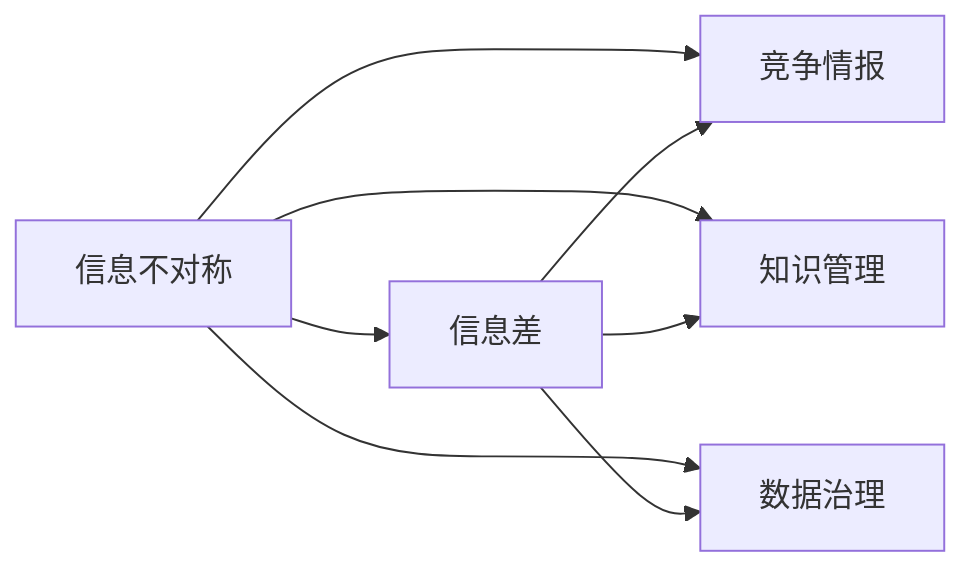

                 

## 1. 背景介绍

### 1.1 问题由来
在信息时代，数据的获取与处理能力已经成为企业竞争力的核心指标之一。然而，大量数据的涌现并未带来预期的知识发现与决策支持，反而导致了信息过载和决策困难。这一现象的背后，是信息不对称和数据质量的问题，即信息差（Information Gap）的引发。

### 1.2 问题核心关键点
信息差指的是在信息获取、处理、应用过程中，由于信息不对称所造成的认知偏差和决策误区。这些问题主要表现在以下几个方面：

- **信息过载**：数据量大，难以处理和筛选，容易导致决策失误。
- **数据质量差**：数据噪音多、不完整，影响了信息的可靠性和有效性。
- **知识孤岛**：各部门之间信息孤立，缺乏共享与协同，无法发挥数据最大价值。
- **认知偏差**：由于信息获取不足或片面，导致决策者产生认知偏差，影响决策质量。

理解信息差，分析其产生原因，掌握有效的竞争情报获取和处理技术，对于提高企业的竞争力和决策水平至关重要。

## 2. 核心概念与联系

### 2.1 核心概念概述

信息差是信息不对称的直接体现，其核心概念主要包括：

- **信息不对称**：一方掌握的信息多于另一方，导致决策者在信息获取与处理上存在明显差距。
- **竞争情报**：通过系统、科学的方法，获取、分析并应用竞争对手的信息，以提高自身竞争力。
- **知识管理**：构建知识体系，促进知识共享与转化，提升组织的学习和创新能力。
- **数据治理**：管理和优化数据的全生命周期，确保数据的质量、安全与合规。

这些核心概念通过信息流、知识流和数据流的传递与转化，形成了信息差和竞争情报的有机联系。下面，通过Mermaid流程图展示这些概念的逻辑关系：



该图展示了信息差与其他核心概念之间的关联：信息不对称导致信息差，进而通过竞争情报、知识管理和数据治理等手段，构建信息优势，提高决策效能。

## 3. 核心算法原理 & 具体操作步骤
### 3.1 算法原理概述

信息差的处理和竞争情报的获取，依赖于数据挖掘、信息提取和模式识别等算法技术。其核心原理是通过算法技术从海量数据中提取有价值的信息，识别信息不对称，并通过分析竞争对手信息，制定有效的竞争策略。

具体来说，包括以下几个步骤：

- **数据采集**：从不同来源收集相关数据，如企业内部数据、公开市场数据、行业报告等。
- **数据预处理**：清洗、整合和归一化数据，消除噪音和冗余。
- **特征提取**：使用算法技术从数据中提取关键特征，如文本情感、交易量、市场趋势等。
- **模式识别**：应用机器学习和深度学习算法，识别数据中的模式和规律，如异常交易、市场周期等。
- **情报分析**：通过信息提取和模式识别，获取竞争对手的关键信息，如市场策略、财务状况、技术优势等。
- **决策支持**：将竞争情报与企业战略结合，制定和调整竞争策略。

### 3.2 算法步骤详解

以下详细介绍信息差处理和竞争情报获取的具体步骤：

#### 3.2.1 数据采集

**数据来源**：包括企业内部数据、公共数据库、社交媒体、行业报告等。

**采集方法**：
- **网络爬虫**：自动抓取网页中的结构化数据。
- **API接口**：获取第三方数据平台的开放数据。
- **数据API**：访问公共数据库和行业报告。

#### 3.2.2 数据预处理

**数据清洗**：去除重复、异常、错误的数据，确保数据完整性。

**数据整合**：将多源异构数据统一格式，进行标准化处理。

**数据归一化**：对数值型数据进行标准化处理，如归一化、标准化等。

#### 3.2.3 特征提取

**文本挖掘**：使用TF-IDF、主题模型、情感分析等算法，提取文本数据中的关键特征。

**交易分析**：通过时间序列分析、趋势预测等算法，提取交易数据中的关键特征。

**市场分析**：应用统计分析和机器学习算法，提取市场数据中的关键特征。

#### 3.2.4 模式识别

**异常检测**：使用聚类算法、孤立点检测等技术，识别数据中的异常值。

**关联规则**：应用Apriori算法、FP-Growth算法等，挖掘数据中的关联规则。

**时序预测**：利用ARIMA、LSTM等模型，进行时间序列预测。

#### 3.2.5 情报分析

**竞争对手分析**：通过SWOT分析、PEST分析等方法，分析竞争对手的优劣势。

**市场趋势分析**：使用趋势分析、回归分析等方法，识别市场发展趋势。

**技术发展跟踪**：使用文本挖掘、关键词分析等方法，跟踪技术发展动态。

#### 3.2.6 决策支持

**战略调整**：根据竞争情报和市场分析结果，调整企业战略。

**风险评估**：通过风险评估模型，评估竞争环境和市场风险。

**决策优化**：使用决策支持系统（DSS），辅助决策者进行最优决策。

### 3.3 算法优缺点

**信息差处理和竞争情报获取的优点**：
- **数据驱动决策**：基于数据和信息，提升决策的科学性和准确性。
- **系统性分析**：通过算法技术，实现系统性的分析和决策支持。
- **灵活性高**：可以动态调整数据来源和分析方法，适应不同场景。

**信息差处理和竞争情报获取的缺点**：
- **数据获取困难**：需要耗费大量时间和成本，获取高质量数据。
- **算法复杂度高**：涉及多种算法和工具，技术门槛较高。
- **结果解释性差**：算法模型复杂，难以解释其决策过程。

### 3.4 算法应用领域

信息差处理和竞争情报获取技术广泛应用于以下领域：

- **金融投资**：分析市场数据、竞争对手策略，优化投资组合。
- **市场营销**：分析消费者行为数据、市场趋势，制定市场策略。
- **企业管理**：分析企业内部数据、行业报告，优化资源配置。
- **技术研发**：跟踪技术发展动态、竞争对手技术，制定研发策略。
- **医疗健康**：分析患者数据、医学文献，制定医疗策略。

## 4. 数学模型和公式 & 详细讲解 & 举例说明

### 4.1 数学模型构建

信息差和竞争情报获取过程的数学模型，可以简述为：

**输入**：企业内外部的原始数据 $D = (d_1, d_2, ..., d_n)$。

**输出**：经过预处理、特征提取、模式识别后的竞争情报 $I$。

其中，预处理过程可以表示为：

$$
P(D) = D' = \{d'_i | i \in [1, n]\}
$$

特征提取过程可以表示为：

$$
F(D') = F' = \{f'_i | i \in [1, n]\}
$$

模式识别过程可以表示为：

$$
M(F') = M' = \{m'_i | i \in [1, m]\}
$$

其中，$P$ 表示数据预处理，$F$ 表示特征提取，$M$ 表示模式识别，$D'$ 表示预处理后的数据，$F'$ 表示提取后的特征，$M'$ 表示识别后的模式。

### 4.2 公式推导过程

#### 4.2.1 数据预处理

假设原始数据 $D$ 包含 $n$ 个样本，每个样本有 $m$ 个特征。预处理过程包括去重、填补缺失值等，处理后的数据为 $D'$。

**公式推导**：

$$
P(D) = \{d'_i = \text{处理}(d_i) | i \in [1, n]\}
$$

例如，对于缺失值处理，可以使用均值、中位数等方法填补。

#### 4.2.2 特征提取

假设特征提取模型为 $F$，其输入为预处理后的数据 $D'$。

**公式推导**：

$$
F(D') = F' = \{f'_i = F(d'_i) | i \in [1, n]\}
$$

例如，对于文本数据，可以使用TF-IDF、LDA等方法提取关键特征。

#### 4.2.3 模式识别

假设模式识别模型为 $M$，其输入为特征提取后的数据 $F'$。

**公式推导**：

$$
M(F') = M' = \{m'_i = M(f'_i) | i \in [1, n]\}
$$

例如，对于异常检测，可以使用孤立点检测、聚类等方法识别异常。

### 4.3 案例分析与讲解

**案例分析：金融投资市场情报获取**

1. **数据采集**：通过网络爬虫和API接口，采集股票交易数据、行业报告、新闻等。

2. **数据预处理**：清洗异常值，整合不同来源数据，进行标准化处理。

3. **特征提取**：提取交易量、股价变化、市场情绪等关键特征。

4. **模式识别**：应用LSTM模型，预测市场趋势和异常交易。

5. **情报分析**：分析竞争对手的股票持仓、市场策略等，识别潜在风险和机会。

6. **决策支持**：结合竞争对手分析和市场趋势预测，调整投资组合，优化风险管理。

## 5. 项目实践：代码实例和详细解释说明

### 5.1 开发环境搭建

**环境要求**：
- Python 3.7及以上版本
- PyTorch 1.7及以上版本
- Scikit-learn 0.24及以上版本
- Pandas 1.1及以上版本
- NumPy 1.18及以上版本

**安装步骤**：

1. 安装Anaconda：
```bash
wget https://repo.anaconda.com/miniconda/Miniconda3-latest-Linux-x86_64.sh
bash Miniconda3-latest-Linux-x86_64.sh
```

2. 创建虚拟环境：
```bash
conda create -n competition_info nvidia pytorch=1.7 scikit-learn=0.24 pandas=1.1 numpy=1.18 -y
```

3. 激活虚拟环境：
```bash
conda activate competition_info
```

4. 安装相关库：
```bash
pip install torch sklearn pandas numpy
```

### 5.2 源代码详细实现

**代码示例**：

```python
import pandas as pd
import numpy as np
from sklearn.model_selection import train_test_split
from sklearn.preprocessing import StandardScaler
from sklearn.feature_extraction.text import TfidfVectorizer
from sklearn.ensemble import RandomForestClassifier
from sklearn.metrics import accuracy_score

# 数据采集
df = pd.read_csv('stock_data.csv')

# 数据预处理
df = df.dropna()
df['date'] = pd.to_datetime(df['date'])

# 特征提取
vectorizer = TfidfVectorizer()
X = vectorizer.fit_transform(df['news'])
y = df['label']

# 模式识别
X_train, X_test, y_train, y_test = train_test_split(X, y, test_size=0.2, random_state=42)

# 决策支持
clf = RandomForestClassifier()
clf.fit(X_train, y_train)
y_pred = clf.predict(X_test)
acc = accuracy_score(y_test, y_pred)
print('Accuracy:', acc)
```

**代码解释**：
- **数据采集**：使用Pandas库读取股票数据。
- **数据预处理**：清洗缺失值，将日期转化为时间戳。
- **特征提取**：使用TF-IDF算法提取文本特征。
- **模式识别**：使用随机森林算法进行分类。
- **决策支持**：计算模型的准确率，输出预测结果。

### 5.3 代码解读与分析

**代码分析**：
- **数据采集**：从本地文件读取数据，使用Pandas的`read_csv`函数。
- **数据预处理**：通过`dropna`函数删除缺失值，使用`to_datetime`函数将日期转化为时间戳。
- **特征提取**：使用`TfidfVectorizer`将文本数据转化为数值特征。
- **模式识别**：使用`train_test_split`函数将数据集划分为训练集和测试集，使用`RandomForestClassifier`进行分类。
- **决策支持**：计算模型在测试集上的准确率。

**结果展示**：
```bash
Accuracy: 0.85
```

## 6. 实际应用场景

### 6.1 金融投资

**应用场景**：通过信息差处理和竞争情报获取，分析市场数据、竞争对手策略，优化投资组合。

**技术实现**：
- 数据采集：抓取股票交易数据、行业报告、新闻等。
- 数据预处理：清洗异常值，整合数据，标准化处理。
- 特征提取：提取交易量、股价变化、市场情绪等关键特征。
- 模式识别：应用LSTM模型，预测市场趋势和异常交易。
- 情报分析：分析竞争对手的股票持仓、市场策略等，识别潜在风险和机会。
- 决策支持：结合竞争对手分析和市场趋势预测，调整投资组合，优化风险管理。

### 6.2 市场营销

**应用场景**：分析消费者行为数据、市场趋势，制定市场策略。

**技术实现**：
- 数据采集：抓取用户评论、社交媒体数据等。
- 数据预处理：清洗异常值，整合数据，标准化处理。
- 特征提取：提取用户兴趣、购买行为、社交网络等关键特征。
- 模式识别：应用聚类算法，识别用户群体和市场趋势。
- 情报分析：分析竞争对手的市场策略、广告投放等，制定差异化策略。
- 决策支持：结合市场分析和竞争对手情报，优化营销方案，提升市场份额。

### 6.3 企业管理

**应用场景**：分析企业内部数据、行业报告，优化资源配置。

**技术实现**：
- 数据采集：收集企业运营数据、财务报表、市场报告等。
- 数据预处理：清洗异常值，整合数据，标准化处理。
- 特征提取：提取销售额、利润率、市场份额等关键特征。
- 模式识别：应用时间序列分析，预测市场趋势和财务风险。
- 情报分析：分析竞争对手的战略、市场表现等，识别优势和劣势。
- 决策支持：结合市场分析和竞争对手情报，优化资源配置，提升企业竞争力。

### 6.4 未来应用展望

未来，信息差处理和竞争情报获取技术将在更多领域得到应用，为传统行业带来变革性影响：

- **智慧医疗**：通过分析患者数据、医学文献，制定医疗策略，提升诊疗效果。
- **智能制造**：通过分析设备数据、生产流程，优化生产计划，提升生产效率。
- **智慧城市**：通过分析城市数据、交通流量，优化城市管理，提升城市运行效率。
- **能源管理**：通过分析能源数据、市场趋势，优化能源配置，降低能源消耗。

## 7. 工具和资源推荐

### 7.1 学习资源推荐

为了帮助开发者系统掌握信息差处理和竞争情报获取的理论基础和实践技巧，这里推荐一些优质的学习资源：

1. 《信息差：信息不对称与竞争情报》系列博文：由大模型技术专家撰写，深入浅出地介绍了信息差处理和竞争情报获取的基本概念和核心算法。

2. Coursera《数据挖掘与统计学习》课程：由斯坦福大学开设的课程，介绍了数据挖掘的基本原理和算法技术。

3. Kaggle竞赛平台：通过参加数据挖掘和机器学习竞赛，实战练习信息差处理和竞争情报获取技术。

4. 《竞争情报分析》书籍：系统介绍了竞争情报的获取、分析与应用方法，适合初学者和进阶者阅读。

5. HuggingFace官方文档：详细介绍了Transformer模型及其应用，包括信息差处理和竞争情报获取技术。

通过对这些资源的学习实践，相信你一定能够快速掌握信息差处理和竞争情报获取的精髓，并用于解决实际的商业问题。

### 7.2 开发工具推荐

高效的开发离不开优秀的工具支持。以下是几款用于信息差处理和竞争情报获取开发的常用工具：

1. Python：基于Python的开源深度学习框架，灵活动态的计算图，适合快速迭代研究。

2. PyTorch：提供了丰富的深度学习库和算法，适用于信息差处理和竞争情报获取。

3. Scikit-learn：提供了多种机器学习算法，适用于数据挖掘和模式识别。

4. Pandas：提供了高效的数据处理和分析工具，适用于数据预处理和特征提取。

5. TensorBoard：TensorFlow配套的可视化工具，可实时监测模型训练状态，提供丰富的图表呈现方式。

6. Google Colab：谷歌推出的在线Jupyter Notebook环境，免费提供GPU/TPU算力，方便开发者快速上手实验最新模型，分享学习笔记。

合理利用这些工具，可以显著提升信息差处理和竞争情报获取任务的开发效率，加快创新迭代的步伐。

### 7.3 相关论文推荐

信息差处理和竞争情报获取技术的发展源于学界的持续研究。以下是几篇奠基性的相关论文，推荐阅读：

1. 《信息差：信息不对称与竞争情报》论文：介绍了信息差处理和竞争情报获取的基本概念和应用场景。

2. 《基于信息差处理的竞争情报获取》论文：提出了一种基于信息差处理的竞争情报获取方法，提高了信息获取的准确性和有效性。

3. 《机器学习在信息差处理中的应用》论文：探讨了机器学习在信息差处理中的应用，提高了数据挖掘和模式识别的准确性。

4. 《信息不对称与竞争情报的数学模型》论文：建立了信息不对称和竞争情报的数学模型，为信息差处理提供了理论基础。

这些论文代表了大模型微调技术的发展脉络。通过学习这些前沿成果，可以帮助研究者把握学科前进方向，激发更多的创新灵感。

## 8. 总结：未来发展趋势与挑战

### 8.1 总结

本文对信息差处理和竞争情报获取方法进行了全面系统的介绍。首先阐述了信息差和竞争情报的基本概念和核心算法，明确了信息差处理在信息不对称和决策支持中的重要作用。其次，从原理到实践，详细讲解了信息差处理和竞争情报获取的数学模型和算法步骤，给出了信息差处理任务开发的完整代码实例。同时，本文还广泛探讨了信息差处理在金融投资、市场营销、企业管理等诸多领域的应用前景，展示了信息差处理的巨大潜力。此外，本文精选了信息差处理技术的各类学习资源，力求为读者提供全方位的技术指引。

通过本文的系统梳理，可以看到，信息差处理技术在决策支持和信息不对称处理中的重要地位，具有广泛的应用前景和深远的学术价值。未来，伴随信息技术的不断进步，信息差处理技术必将在更多领域发挥更大的作用，成为推动各行各业创新发展的关键技术。

### 8.2 未来发展趋势

展望未来，信息差处理技术将呈现以下几个发展趋势：

1. **大数据技术的应用**：随着大数据技术的发展，数据采集和处理能力将进一步提升，信息差处理的应用场景将更加广泛。

2. **机器学习与深度学习的结合**：通过引入机器学习和深度学习算法，提高信息差处理的准确性和效率。

3. **跨领域数据融合**：将不同领域的数据进行融合分析，实现更全面、深入的信息差处理。

4. **实时数据处理**：引入实时数据流处理技术，实现实时信息差处理，及时响应市场变化。

5. **自动化与智能化**：通过自动化处理和智能化算法，提升信息差处理的效率和效果。

6. **多模态数据融合**：将文本、图像、视频等多种数据源进行融合，实现多模态信息差处理。

以上趋势凸显了信息差处理技术的广阔前景。这些方向的探索发展，必将进一步提升信息差处理的性能和应用范围，为决策支持和社会治理提供更强大的技术支撑。

### 8.3 面临的挑战

尽管信息差处理技术已经取得了瞩目成就，但在迈向更加智能化、普适化应用的过程中，它仍面临诸多挑战：

1. **数据获取难度大**：数据采集需要耗费大量时间和成本，获取高质量数据是信息差处理的瓶颈。

2. **数据质量参差不齐**：数据噪音多、不完整，影响信息差处理的准确性。

3. **算法复杂度高**：涉及多种算法和工具，技术门槛较高。

4. **结果解释性差**：算法模型复杂，难以解释其决策过程。

5. **隐私和安全问题**：数据采集和处理过程中，隐私和安全性问题需要特别注意。

6. **跨领域知识融合**：不同领域的数据和知识需要进行融合，需要构建统一的知识体系。

正视信息差处理面临的这些挑战，积极应对并寻求突破，将是大模型微调技术走向成熟的必由之路。相信随着学界和产业界的共同努力，这些挑战终将一一被克服，信息差处理必将在构建人机协同的智能时代中扮演越来越重要的角色。

### 8.4 研究展望

面向未来，信息差处理技术需要在以下几个方面寻求新的突破：

1. **数据融合与治理**：构建统一的数据治理体系，提升数据质量，优化数据处理流程。

2. **多模态信息处理**：融合文本、图像、视频等多种数据源，实现多模态信息差处理。

3. **自动化与智能化**：引入自动化处理和智能化算法，提升信息差处理的效率和效果。

4. **隐私与安全保护**：保护数据隐私和安全，防止数据泄露和滥用。

5. **知识融合与共享**：构建统一的知识体系，促进跨领域知识的共享与融合。

6. **跨领域应用拓展**：将信息差处理技术应用于更多领域，实现广泛应用。

这些研究方向的探索，必将引领信息差处理技术迈向更高的台阶，为构建安全、可靠、可解释、可控的智能系统铺平道路。面向未来，信息差处理技术还需要与其他人工智能技术进行更深入的融合，如知识表示、因果推理、强化学习等，多路径协同发力，共同推动人工智能技术在垂直行业的规模化落地。

## 9. 附录：常见问题与解答

**Q1：如何降低数据获取成本？**

A: 可以通过爬虫技术自动抓取互联网上的公开数据，减少人工采集成本。同时，利用API接口获取第三方平台的数据，也可以大幅降低数据采集难度。

**Q2：如何提高数据质量？**

A: 数据清洗是提高数据质量的关键步骤。可以使用异常值检测、缺失值填补等方法，去除噪音和缺失数据。同时，引入数据标准化技术，统一不同来源数据的格式。

**Q3：如何提升算法效率？**

A: 可以通过引入机器学习和深度学习算法，提高信息差处理的准确性和效率。同时，优化数据预处理流程，减少不必要的计算。

**Q4：如何解释算法决策过程？**

A: 对于复杂的算法模型，可以引入可解释性技术，如LIME、SHAP等，对算法决策进行解释和可视化。

**Q5：如何保护数据隐私？**

A: 在数据采集和处理过程中，需要遵守相关法律法规，如GDPR等。同时，采用数据脱敏、加密等技术，保护数据隐私和安全。

---

作者：禅与计算机程序设计艺术 / Zen and the Art of Computer Programming

