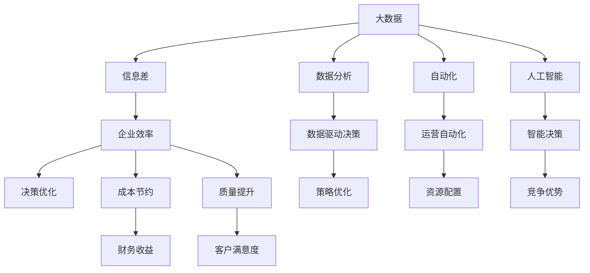

                 

# 信息差：利用大数据提升企业效率

> 关键词：大数据, 信息差, 企业效率, 数据分析, 自动化, 人工智能, 信息不对称

## 1. 背景介绍

在当今这个信息爆炸的时代，企业面临着前所未有的机遇与挑战。大数据技术的迅猛发展，为企业提供了海量的数据资源，同时也带来了处理和分析这些数据的新挑战。如何有效利用大数据，帮助企业提升运营效率，成为众多企业关注的焦点。本文将从信息差的概念出发，探讨利用大数据提升企业效率的方法和策略。

## 2. 核心概念与联系

### 2.1 核心概念概述

- **大数据**：指规模巨大、多样性丰富、高速产生、价值密度低、需要新处理模式的数据集合。
- **信息差**：指企业内部和外部的信息不对称，即企业决策者所掌握的信息与实际情况之间存在的差距。
- **企业效率**：指企业完成特定任务或目标所消耗的资源（如时间、金钱、人力）的效率。
- **数据分析**：通过统计学、机器学习等方法，从数据中提取有价值的信息和洞见的过程。
- **自动化**：指通过技术手段，将原本需要人工执行的任务，由机器自动完成的过程。
- **人工智能**：利用机器学习和深度学习等技术，使机器能够模拟人类智能过程，进行推理和决策。
- **信息不对称**：指不同决策者在处理相同问题时，掌握的信息量不同，导致决策结果不同。

这些概念相互联系，共同构成了大数据驱动的决策支持框架。

### 2.2 核心概念原理和架构的 Mermaid 流程图



## 3. 核心算法原理 & 具体操作步骤

### 3.1 算法原理概述

利用大数据提升企业效率的核心在于，通过分析和处理大数据，发现和消除信息差，从而优化企业决策和运营过程。这一过程可以概括为：

1. **数据采集与清洗**：从企业内外收集数据，并进行去重、去噪、标准化等预处理。
2. **数据分析与挖掘**：利用统计学和机器学习等技术，提取有价值的信息和洞见。
3. **决策优化与实施**：基于分析结果，调整企业决策，优化运营流程。
4. **自动化与智能化**：采用自动化和人工智能技术，实现决策和运营的自动执行。

### 3.2 算法步骤详解

#### 3.2.1 数据采集与清洗

- **步骤1：数据收集**：从企业内部业务系统、外部市场数据、社交媒体、互联网等渠道，收集与企业相关的各类数据。
- **步骤2：数据清洗**：对收集到的数据进行去重、去噪、标准化、填充缺失值等处理，确保数据质量。
- **步骤3：数据整合**：将来自不同来源的数据进行整合，构建统一的数据仓库或数据湖。

#### 3.2.2 数据分析与挖掘

- **步骤1：数据预处理**：对整合后的数据进行清洗、去噪、填充缺失值等处理。
- **步骤2：特征提取**：通过统计学、机器学习等方法，提取有用的特征变量。
- **步骤3：模型训练**：使用监督学习、无监督学习、强化学习等算法，训练数据模型。
- **步骤4：洞见挖掘**：基于模型，挖掘出与企业运营相关的洞见和知识。

#### 3.2.3 决策优化与实施

- **步骤1：策略制定**：根据挖掘出的洞见，制定优化策略。
- **步骤2：执行优化**：通过调整流程、修改规则、优化资源配置等方式，实施优化策略。
- **步骤3：效果评估**：对优化效果进行评估，确保达到预期目标。

#### 3.2.4 自动化与智能化

- **步骤1：流程自动化**：将优化后的决策和运营流程，实现自动化执行。
- **步骤2：智能化辅助**：引入人工智能技术，如自然语言处理、机器学习、深度学习等，提高决策的智能化水平。

### 3.3 算法优缺点

#### 3.3.1 优点

- **效率提升**：大数据分析能够快速发现信息差，帮助企业及时优化决策，提升效率。
- **成本节约**：自动化和智能化技术的应用，可以减少人工干预，降低运营成本。
- **质量提升**：数据分析可以识别流程中的瓶颈和问题，优化资源配置，提升产品质量。
- **竞争优势**：大数据分析和技术应用，可以增强企业的竞争力和市场响应能力。

#### 3.3.2 缺点

- **数据质量要求高**：大数据分析依赖高质量的数据，数据质量不高会导致分析结果不准确。
- **技术门槛高**：数据分析和自动化技术的应用需要专业技能，对企业的技术实力提出了较高要求。
- **隐私和安全问题**：大数据处理涉及大量敏感信息，数据隐私和安全问题不容忽视。
- **成本投入大**：大数据分析和技术实施需要大量的投入，包括硬件、软件、人力等。

### 3.4 算法应用领域

大数据驱动的企业效率优化方法，广泛应用于各行各业，如金融、零售、制造、医疗、物流等。

- **金融行业**：通过大数据分析，优化贷款审批流程，提高风险评估准确性，降低坏账率。
- **零售行业**：利用消费者行为数据，优化库存管理，提高销售效率，提升客户满意度。
- **制造行业**：通过设备运行数据，优化生产流程，降低生产成本，提高产品质量。
- **医疗行业**：利用患者数据，优化诊疗流程，提高诊断准确性，提升医疗服务质量。
- **物流行业**：通过供应链数据，优化物流路径，降低运输成本，提升配送效率。

## 4. 数学模型和公式 & 详细讲解 & 举例说明

### 4.1 数学模型构建

大数据驱动的企业效率优化模型可以表示为：

$$
E_{opt} = \min_{\theta} \left( \sum_{i} (C_i + W_i E_i) \right)
$$

其中，$E_{opt}$ 表示优化后的企业效率，$\theta$ 表示企业决策变量，$C_i$ 表示成本项，$W_i$ 表示权重，$E_i$ 表示企业运营效果。

### 4.2 公式推导过程

在优化模型的过程中，首先需要构建目标函数和约束条件。通过求解目标函数的最小值，可以得到最优的企业决策变量。具体推导过程如下：

- **目标函数**：
$$
\min_{\theta} \left( \sum_{i} (C_i + W_i E_i) \right)
$$
- **约束条件**：
$$
\begin{cases}
0 \leq \theta \leq 1 \\
\sum_{i} \theta_i = 1
\end{cases}
$$

其中，约束条件表示决策变量的取值范围和总和为1。

### 4.3 案例分析与讲解

假设一家制造企业，通过数据分析发现生产线的故障率较高，导致生产效率低下。企业的目标是最小化总成本，同时提升生产效率。企业可以通过以下步骤优化决策：

1. **数据收集**：从生产系统收集设备运行数据、维护记录等。
2. **数据分析**：利用统计学方法，发现故障率与设备维护频次之间的关系。
3. **模型训练**：使用机器学习模型，预测设备故障率，生成维护计划。
4. **决策优化**：根据预测结果，调整维护频次，优化生产流程。
5. **自动化实施**：引入自动化工具，实现维护计划的自动执行。

通过这一过程，企业不仅提高了生产效率，还降低了维护成本。

## 5. 项目实践：代码实例和详细解释说明

### 5.1 开发环境搭建

1. **安装Python和相关库**：
```bash
sudo apt-get update
sudo apt-get install python3-pip
pip install numpy pandas scikit-learn matplotlib seaborn joblib
```

2. **安装TensorFlow和Keras**：
```bash
pip install tensorflow
pip install keras
```

3. **创建虚拟环境**：
```bash
python3 -m venv venv
source venv/bin/activate
```

### 5.2 源代码详细实现

以下是一个简单的Python代码示例，用于数据清洗和特征提取：

```python
import pandas as pd
from sklearn.preprocessing import StandardScaler

# 加载数据集
data = pd.read_csv('data.csv')

# 数据清洗
data = data.dropna()
data = data.drop_duplicates()

# 特征提取
scaler = StandardScaler()
data['feature1'] = scaler.fit_transform(data[['feature1']])
data['feature2'] = scaler.fit_transform(data[['feature2']])
```

### 5.3 代码解读与分析

在上述代码中，首先使用`pandas`库加载数据集，并进行数据清洗，去除缺失值和重复值。然后，使用`scikit-learn`库的`StandardScaler`进行特征标准化，确保特征数据的分布一致性。这一过程是数据分析的基础，也是后续模型训练的前提。

## 6. 实际应用场景

### 6.1 智能制造

智能制造是利用大数据和人工智能技术，提升制造业的效率和质量。通过数据分析和机器学习，可以优化生产流程，减少故障率，提高生产效率。例如，利用设备运行数据和维护记录，预测设备故障，提前进行维护，避免生产中断。

### 6.2 智慧零售

智慧零售通过大数据分析，优化库存管理、个性化推荐、客户服务等环节，提升用户体验和销售效率。例如，通过分析消费者行为数据，优化库存结构，减少库存成本，提升销售转化率。

### 6.3 智慧医疗

智慧医疗通过大数据分析，优化诊疗流程，提升诊断准确性和医疗服务质量。例如，利用患者数据，分析疾病特征，辅助医生制定治疗方案，提高治疗效果。

### 6.4 未来应用展望

未来，随着大数据和人工智能技术的进一步发展，大数据驱动的企业效率优化将更加普及和深入。以下展望一些未来趋势：

1. **实时数据分析**：大数据分析将从离线转向实时，帮助企业实时优化决策，提高响应速度。
2. **自适应系统**：引入自适应学习算法，使系统能够根据环境变化自动调整决策和行为。
3. **跨领域融合**：大数据分析将跨领域融合，形成更全面、综合的信息模型，提升企业决策的科学性。
4. **伦理与安全**：大数据处理将更加注重数据隐私和伦理问题，保障企业运营的安全性和合法性。

## 7. 工具和资源推荐

### 7.1 学习资源推荐

- **《大数据分析与统计学》**：该书详细介绍了大数据分析的基本原理和方法，适合初学者学习。
- **Coursera《大数据分析》课程**：由约翰霍普金斯大学开设，系统讲解大数据分析技术和应用。
- **Kaggle竞赛平台**：通过参与实际项目，提升数据分析和机器学习技能。

### 7.2 开发工具推荐

- **Python**：作为数据科学的主流语言，Python具有丰富的数据分析和机器学习库。
- **R**：另一种流行的数据分析语言，特别适合统计学和数据可视化。
- **Tableau**：一个流行的数据可视化工具，可以轻松生成报表和图表。
- **Power BI**：微软推出的商业智能工具，适合企业内部数据分析和报告。

### 7.3 相关论文推荐

- **《大数据分析与决策支持系统》**：详细介绍了大数据分析的基本框架和方法。
- **《人工智能与大数据在制造行业的应用》**：探讨了大数据在制造业中的实际应用案例。
- **《大数据驱动的智慧医疗》**：介绍了大数据在医疗行业中的广泛应用和前景。

## 8. 总结：未来发展趋势与挑战

### 8.1 研究成果总结

大数据驱动的企业效率优化方法，已经在金融、零售、制造、医疗等行业取得了显著成效。通过数据分析和机器学习，企业能够快速发现信息差，优化决策和运营流程，提升效率和质量。

### 8.2 未来发展趋势

未来，大数据驱动的企业效率优化将更加智能化、实时化和跨领域化。以下是一些具体趋势：

1. **实时分析**：大数据分析将从离线转向实时，帮助企业实时优化决策，提高响应速度。
2. **自适应系统**：引入自适应学习算法，使系统能够根据环境变化自动调整决策和行为。
3. **跨领域融合**：大数据分析将跨领域融合，形成更全面、综合的信息模型，提升企业决策的科学性。
4. **伦理与安全**：大数据处理将更加注重数据隐私和伦理问题，保障企业运营的安全性和合法性。

### 8.3 面临的挑战

尽管大数据驱动的企业效率优化方法具有诸多优势，但也面临着一些挑战：

1. **数据质量问题**：大数据分析依赖高质量的数据，数据质量不高会导致分析结果不准确。
2. **技术门槛高**：数据分析和自动化技术的应用需要专业技能，对企业的技术实力提出了较高要求。
3. **隐私和安全问题**：大数据处理涉及大量敏感信息，数据隐私和安全问题不容忽视。
4. **成本投入大**：大数据分析和技术实施需要大量的投入，包括硬件、软件、人力等。

### 8.4 研究展望

未来，随着大数据和人工智能技术的进一步发展，大数据驱动的企业效率优化将更加普及和深入。以下展望一些具体研究方向：

1. **数据隐私保护**：研究如何在大数据分析中保护用户隐私，避免数据泄露。
2. **跨领域融合**：研究不同领域之间的数据融合方法，提升跨领域决策的科学性。
3. **自适应学习**：研究自适应学习算法，使系统能够根据环境变化自动调整决策和行为。
4. **伦理与安全**：研究如何在数据处理过程中，遵循伦理规范，保障数据的安全性和合法性。

## 9. 附录：常见问题与解答

**Q1：大数据分析的主要步骤是什么？**

A: 大数据分析的主要步骤包括数据采集与清洗、数据分析与挖掘、决策优化与实施、自动化与智能化。

**Q2：数据清洗时，需要注意哪些问题？**

A: 数据清洗时需要注意去重、去噪、标准化、填充缺失值等问题。

**Q3：如何评估大数据分析的效果？**

A: 可以通过数据分析前后的对比，评估优化策略的效果。同时，也可以通过实际应用中的业务指标，如销售额、利润率、客户满意度等，来评估大数据分析的效果。

**Q4：在数据分析过程中，如何处理异常值？**

A: 异常值处理可以使用箱线图、Z分数等方法，识别和处理异常值。同时，可以通过模型参数调整、数据平滑等手段，减少异常值对分析结果的影响。

**Q5：数据采集时，需要注意哪些问题？**

A: 数据采集时需要注意数据来源的可靠性、数据格式的一致性、数据量的合理性等问题。同时，还需要对数据进行权限管理，保障数据安全。

---

作者：禅与计算机程序设计艺术 / Zen and the Art of Computer Programming

