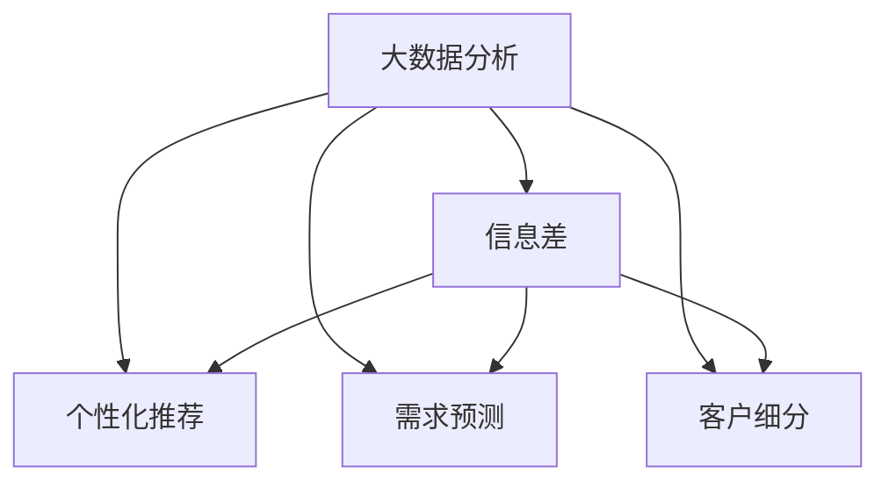

                 

# 信息差：大数据在零售行业的应用

在大数据时代，信息差已成为零售业者竞争的核心武器。通过利用大数据分析，零售商能够深入了解消费者需求，优化库存管理，提升营销精准度，从而在激烈的市场竞争中占据优势。本篇文章将从大数据分析与信息差的角度，探讨零售行业的数据应用和未来发展趋势。

## 1. 背景介绍

### 1.1 零售行业现状
随着互联网和移动设备的普及，全球零售业正在经历翻天覆地的变化。线上购物、个性化推荐、智能客服等新技术层出不穷，零售商需要更加精准、及时地获取消费者信息，以便制定有效的商业策略。

### 1.2 大数据的价值
大数据作为信息时代的重要资产，拥有极强的商业价值。通过大数据分析，零售商可以深入挖掘消费者行为模式、产品需求等关键信息，做出科学决策，提高运营效率，增强竞争力。

## 2. 核心概念与联系

### 2.1 核心概念概述

为更好地理解大数据在零售行业的应用，本节将介绍几个密切相关的核心概念：

- **大数据分析(Big Data Analysis)**：通过处理、分析和提炼大规模数据集，从海量数据中提取有价值信息的过程。
- **信息差(Information Gap)**：零售商在获取、处理、分析信息过程中存在的差距，包括数据质量、数据处理技术、分析模型等方面。
- **个性化推荐(Personalized Recommendation)**：根据用户历史行为和兴趣偏好，向其推荐最相关的产品和服务。
- **需求预测(Demand Forecasting)**：通过对历史数据和市场趋势的分析和建模，预测未来需求，优化库存和供应链管理。
- **客户细分(Customer Segmentation)**：根据客户属性、行为、消费习惯等，将客户进行分组，以便进行精准营销。

这些概念之间的逻辑关系可以通过以下Mermaid流程图来展示：



这个流程图展示了大数据分析在零售业中的应用，以及其与信息差、个性化推荐、需求预测、客户细分等概念之间的联系。

## 3. 核心算法原理 & 具体操作步骤
### 3.1 算法原理概述

大数据分析在零售业的应用，主要包括数据收集、清洗、处理、分析和应用等多个环节。核心算法包括：

- **数据清洗(Data Cleaning)**：去除数据中的噪声和异常值，确保数据质量。
- **数据处理(Data Processing)**：对数据进行格式化、合并、抽取等操作，便于分析。
- **统计分析(Statistical Analysis)**：通过描述性统计和推断性统计方法，从数据中提取有价值的信息。
- **机器学习(Machine Learning)**：利用机器学习算法进行模式识别和预测建模，提供更深刻的洞察。
- **数据可视化(Data Visualization)**：将分析结果以直观的方式展示，便于决策和应用。

### 3.2 算法步骤详解

以下以个性化推荐为例，介绍大数据分析在零售业中的应用流程：

**Step 1: 数据收集**
- 收集消费者浏览记录、购买历史、评价反馈、社交媒体等数据。
- 利用爬虫技术从电商平台、社交平台、搜索引擎等获取数据。

**Step 2: 数据清洗**
- 过滤无效数据、去重、处理缺失值、异常值。
- 应用正则表达式、缺失值填补等方法清洗数据。

**Step 3: 数据处理**
- 将数据格式统一，合并不同来源的数据。
- 对日期、时间等进行格式化，便于时间序列分析。

**Step 4: 统计分析**
- 计算消费者购买频率、购物篮分析、产品热销度等。
- 利用描述性统计方法进行数据概览。

**Step 5: 机器学习**
- 使用协同过滤、基于内容的推荐、深度学习等算法进行个性化推荐。
- 利用特征工程构建特征集合，训练推荐模型。

**Step 6: 数据可视化**
- 利用Tableau、Power BI等工具，将推荐结果进行可视化。
- 构建仪表盘展示关键指标，便于监控和优化。

**Step 7: 应用优化**
- 根据推荐结果，优化商品陈列、广告投放、客服服务等。
- 实时监控推荐效果，根据反馈不断优化模型。

### 3.3 算法优缺点

大数据分析在零售业中的应用，具有以下优点：

- **精确度**：利用大规模数据，能更准确地预测需求、优化库存、推荐产品。
- **实时性**：通过实时数据分析，能及时调整策略，应对市场变化。
- **全面性**：涵盖消费者行为、产品销售、市场趋势等多方面信息，提供全面洞察。

但同时，该方法也存在以下局限性：

- **数据隐私**：大规模数据收集和使用过程中，可能涉及消费者隐私问题，引发法律风险。
- **计算资源需求高**：大数据分析需要强大的计算和存储资源，成本较高。
- **算法复杂度**：复杂的机器学习模型可能难以解释，不便于业务决策。
- **数据质量**：数据清洗和处理环节需要大量人工干预，容易引入误差。

## 4. 数学模型和公式 & 详细讲解 & 举例说明

### 4.1 数学模型构建

在大数据分析中，常用的数学模型包括回归分析、分类模型、聚类算法等。以下以线性回归模型为例，介绍其构建和应用：

假设有一个电商平台，收集了消费者历史购买记录 $x_1, x_2, \dots, x_n$，对应的价格 $y_1, y_2, \dots, y_n$。通过线性回归模型，拟合一条直线：

$$
y = \beta_0 + \beta_1 x_1 + \beta_2 x_2 + \dots + \beta_p x_p
$$

其中 $\beta_0, \beta_1, \dots, \beta_p$ 为回归系数。

### 4.2 公式推导过程

线性回归模型的目标是最小化预测值与实际值之间的误差，即：

$$
\min_{\beta_0, \beta_1, \dots, \beta_p} \sum_{i=1}^n (y_i - \hat{y}_i)^2
$$

其中 $\hat{y}_i = \beta_0 + \beta_1 x_{1i} + \beta_2 x_{2i} + \dots + \beta_p x_{pi}$ 为第 $i$ 个样本的预测值。

根据最小二乘法，解上述最优化问题，得到回归系数的估计值：

$$
\hat{\beta} = (X^T X)^{-1} X^T y
$$

其中 $X$ 为设计矩阵，$y$ 为响应变量。

### 4.3 案例分析与讲解

以一个实际案例来说明线性回归在零售业中的应用：

某电商网站收集了过去一年的销售额数据，包括季节、促销活动、广告投入、客流量等特征。利用线性回归模型，预测下一年度的销售额：

- **数据收集**：从历史销售记录中提取相关特征，如月份、促销活动、广告投入、客流量等。
- **数据清洗**：去除异常值，处理缺失值，确保数据质量。
- **模型构建**：建立线性回归模型，拟合季节、促销、广告等因素对销售额的影响。
- **预测应用**：利用模型对下一年度的销售额进行预测，优化库存和采购计划。

## 5. 项目实践：代码实例和详细解释说明

### 5.1 开发环境搭建

在进行零售业数据应用开发前，需要准备好开发环境。以下是使用Python进行数据分析的开发环境配置流程：

1. 安装Anaconda：从官网下载并安装Anaconda，用于创建独立的Python环境。

2. 创建并激活虚拟环境：
```bash
conda create -n pydata-env python=3.8 
conda activate pydata-env
```

3. 安装相关工具包：
```bash
pip install pandas numpy scikit-learn matplotlib seaborn jupyter notebook ipython
```

4. 安装Jupyter Notebook：
```bash
conda install jupyterlab
```

完成上述步骤后，即可在`pydata-env`环境中开始数据分析开发。

### 5.2 源代码详细实现

以下是使用Python进行线性回归分析的完整代码实现：

```python
import pandas as pd
import numpy as np
from sklearn.linear_model import LinearRegression
from sklearn.model_selection import train_test_split
from sklearn.metrics import mean_squared_error

# 数据准备
df = pd.read_csv('sales_data.csv')
X = df[['season', 'promotion', 'ad_spending', 'traffic']]
y = df['sales']

# 数据清洗
X.dropna(inplace=True)

# 划分训练集和测试集
X_train, X_test, y_train, y_test = train_test_split(X, y, test_size=0.2, random_state=42)

# 线性回归模型
model = LinearRegression()
model.fit(X_train, y_train)

# 预测和评估
y_pred = model.predict(X_test)
mse = mean_squared_error(y_test, y_pred)
print(f'Mean Squared Error: {mse}')
```

### 5.3 代码解读与分析

让我们再详细解读一下关键代码的实现细节：

**数据准备**：
- 使用Pandas库读取历史销售数据，提取季节、促销、广告、流量等特征。

**数据清洗**：
- 使用dropna()方法处理缺失值，确保数据完整性。

**模型构建**：
- 使用LinearRegression类构建线性回归模型，并利用fit()方法训练模型。

**预测和评估**：
- 使用predict()方法进行预测，计算预测值与实际值之间的均方误差。

## 6. 实际应用场景

### 6.1 个性化推荐

在零售业中，个性化推荐已成为提升用户体验、增加销售额的重要手段。利用大数据分析，零售商可以精准推荐产品，增加用户粘性。

**算法流程**：
- 收集用户浏览、购买、评价数据。
- 使用协同过滤、基于内容的推荐、深度学习等算法进行推荐。
- 通过A/B测试，不断优化推荐模型。

**案例**：
某电商平台通过大数据分析，发现用户购买行为具有一定规律性，利用协同过滤算法，为用户推荐相似商品，显著提升了销售额和客户满意度。

### 6.2 需求预测

需求预测是零售商优化库存管理、降低缺货和过剩风险的关键。通过大数据分析，可以更准确地预测产品需求，优化库存结构。

**算法流程**：
- 收集历史销售数据、季节性因素、市场趋势等。
- 利用时间序列分析、回归分析等方法进行需求预测。
- 实时监控预测结果，及时调整库存策略。

**案例**：
某超市通过大数据分析，利用回归模型预测产品需求，优化了库存管理，减少了缺货和过剩风险，显著降低了运营成本。

### 6.3 客户细分

客户细分是精准营销的基础。通过大数据分析，可以将客户进行分组，以便进行个性化营销和提升客户满意度。

**算法流程**：
- 收集客户基本信息、购买行为、偏好数据。
- 利用聚类算法、决策树等方法进行客户细分。
- 根据不同细分群体，设计个性化的营销策略。

**案例**：
某服装品牌通过大数据分析，利用聚类算法将客户分成不同群体，针对不同群体设计个性化的促销活动，显著提高了销售额和客户忠诚度。

### 6.4 未来应用展望

未来，随着大数据技术的不断进步，大数据分析在零售业中的应用将更加广泛和深入。以下是一些可能的未来应用方向：

- **全渠道数据整合**：通过整合线上线下数据，实现全渠道客户行为分析，提供更精准的营销策略。
- **实时数据分析**：利用实时数据流处理技术，实时分析市场趋势和消费者行为，快速响应市场变化。
- **增强现实(AR)推荐**：结合增强现实技术，提升个性化推荐体验，提升用户购买决策。
- **机器学习模型集成**：将多种机器学习模型进行集成，提升预测和推荐的准确性。
- **区块链技术应用**：利用区块链技术确保数据隐私和安全，提升消费者信任度。

## 7. 工具和资源推荐

### 7.1 学习资源推荐

为帮助开发者系统掌握大数据分析在零售业的应用，这里推荐一些优质的学习资源：

1. **《Python数据科学手册》**：由Jake VanderPlas著，全面介绍了Python在数据分析、可视化、机器学习等方面的应用，适合初学者和进阶开发者。

2. **Coursera的《机器学习》课程**：由斯坦福大学教授Andrew Ng讲授，涵盖机器学习的基本原理和算法实现，适合全面理解机器学习在零售业中的应用。

3. **Kaggle竞赛平台**：提供各种数据集和竞赛题目，适合练习数据处理、分析和机器学习技能。

4. **Google Analytics平台**：提供强大的数据追踪和分析工具，帮助零售商深入了解消费者行为和市场趋势。

5. **Tableau和Power BI**：数据可视化工具，帮助零售商将数据分析结果以直观的方式展示，便于决策和应用。

通过对这些资源的学习实践，相信你一定能够快速掌握大数据分析在零售业的应用，并用于解决实际的商业问题。

### 7.2 开发工具推荐

高效的开发离不开优秀的工具支持。以下是几款用于大数据分析开发的常用工具：

1. **Pandas**：数据处理和分析库，提供强大的数据清洗、转换、合并等功能。
2. **NumPy**：数值计算库，支持高效的多维数组运算和科学计算。
3. **Scikit-learn**：机器学习库，提供多种算法实现，便于快速开发模型。
4. **TensorFlow和PyTorch**：深度学习框架，支持复杂的神经网络模型训练和推理。
5. **Jupyter Notebook**：交互式开发环境，支持代码编写、数据可视化、代码解释等。
6. **Tableau和Power BI**：数据可视化工具，支持复杂的数据仪表盘构建和展示。

合理利用这些工具，可以显著提升大数据分析在零售业中的开发效率，加速创新迭代的步伐。

### 7.3 相关论文推荐

大数据分析在零售业中的应用源于学界的持续研究。以下是几篇奠基性的相关论文，推荐阅读：

1. **"Big Data: A Revolution That Will Transform How We Live, Work, and Think"**：作者：Viktor Mayer-Schönberger，系统介绍了大数据的历史、现状和未来趋势，适合了解大数据的基础知识。

2. **"Machine Learning for Healthcare"**：作者：Peter Flach，介绍了机器学习在医疗领域的应用，包含数据处理、模型训练、评估等。

3. **"Customer Behavior in the Digital Age: Insights and Strategies for Engaging Customers Online"**：作者：Larry Frith，系统介绍了数字时代消费者行为的变化和应对策略，适合零售商理解消费者需求。

4. **"Big Data Analytics in Retail: Challenges and Opportunities"**：作者：Michael Arjmand，介绍了大数据分析在零售业中的挑战和机遇，适合深入了解行业现状。

这些论文代表了大数据分析在零售业的研究方向，通过学习这些前沿成果，可以帮助研究者把握学科前进方向，激发更多的创新灵感。

## 8. 总结：未来发展趋势与挑战

### 8.1 总结

本文对大数据在零售业中的应用进行了全面系统的介绍。首先阐述了大数据分析在零售业中的重要性和应用场景，明确了信息差在业务决策中的核心作用。其次，从原理到实践，详细讲解了大数据分析在个性化推荐、需求预测、客户细分等零售任务中的应用流程。最后，本文还探讨了大数据分析的未来发展趋势和面临的挑战，提供了实用的学习资源和开发工具，帮助读者系统掌握大数据分析技能。

通过本文的系统梳理，可以看到，大数据分析在大数据时代，对零售业的竞争优势起到了关键作用。通过科学的数据处理和分析，零售商能够深入了解消费者需求，优化库存管理，提升营销精准度，从而在激烈的市场竞争中占据优势。未来，随着大数据技术的不断进步，大数据分析将进一步深化应用，为零售业带来更多创新和机遇。

### 8.2 未来发展趋势

展望未来，大数据分析在零售业中将呈现以下几个发展趋势：

1. **全渠道数据整合**：通过整合线上线下数据，实现全渠道客户行为分析，提供更精准的营销策略。
2. **实时数据分析**：利用实时数据流处理技术，实时分析市场趋势和消费者行为，快速响应市场变化。
3. **增强现实(AR)推荐**：结合增强现实技术，提升个性化推荐体验，提升用户购买决策。
4. **机器学习模型集成**：将多种机器学习模型进行集成，提升预测和推荐的准确性。
5. **区块链技术应用**：利用区块链技术确保数据隐私和安全，提升消费者信任度。

这些趋势凸显了大数据分析在零售业中的广阔前景。这些方向的探索发展，必将进一步提升零售商的运营效率，增强市场竞争力。

### 8.3 面临的挑战

尽管大数据分析在零售业中已经取得了瞩目成就，但在迈向更加智能化、普适化应用的过程中，仍面临诸多挑战：

1. **数据隐私和安全**：大数据分析涉及海量敏感数据，如何保护数据隐私和安全，是一个重要问题。
2. **计算资源需求高**：大数据分析需要强大的计算和存储资源，成本较高，如何降低计算成本，是一个重要挑战。
3. **算法复杂度**：复杂的机器学习模型可能难以解释，不便于业务决策，如何提升模型的可解释性，是一个重要方向。
4. **数据质量**：数据清洗和处理环节需要大量人工干预，容易引入误差，如何提升数据质量，是一个重要课题。
5. **用户接受度**：消费者对数据分析结果的接受度和信任度，是一个重要考量，如何提升用户接受度，是一个重要方向。

这些挑战需要我们在数据、算法、工程、伦理等多个维度进行全面优化，才能实现大数据分析在零售业中的深度应用。

### 8.4 研究展望

面对大数据分析在零售业中的挑战，未来的研究需要在以下几个方面寻求新的突破：

1. **数据隐私保护技术**：开发更加高效的数据隐私保护算法，确保数据的安全性和匿名性。
2. **低成本计算技术**：探索分布式计算、边缘计算等技术，降低大数据分析的计算成本。
3. **可解释性提升**：开发更加可解释的机器学习模型，提升模型的透明性和可信度。
4. **实时分析框架**：研究实时数据流处理技术，提升数据处理的实时性和准确性。
5. **跨领域融合**：探索大数据分析与其他技术（如区块链、AR等）的融合，提升综合应用能力。

这些研究方向将推动大数据分析在零售业中的深度应用，为零售商带来更多的创新和机遇。

## 9. 附录：常见问题与解答

**Q1：大数据分析在零售业中的关键作用是什么？**

A: 大数据分析在零售业中的关键作用主要体现在以下几个方面：
1. **需求预测**：通过分析历史销售数据，预测未来需求，优化库存管理，降低缺货和过剩风险。
2. **个性化推荐**：根据消费者历史行为和偏好，精准推荐产品，提升用户粘性和销售额。
3. **客户细分**：通过聚类算法将客户分组，针对不同群体设计个性化营销策略，提升客户满意度和忠诚度。
4. **营销优化**：通过分析营销效果，优化广告投放、促销活动等，提升营销精准度和投资回报率。

**Q2：如何进行大数据分析在零售业中的数据清洗？**

A: 数据清洗是大数据分析的重要环节，主要包括以下步骤：
1. **缺失值处理**：使用均值、中位数、插值等方法处理缺失值。
2. **异常值处理**：使用箱线图、Z-score等方法检测和处理异常值。
3. **数据类型转换**：将数据转换为合适的数据类型，如日期、时间等。
4. **去重和去噪**：去除重复数据和噪声数据，确保数据质量。

**Q3：如何选择合适的大数据分析工具？**

A: 选择合适的大数据分析工具，主要考虑以下几个因素：
1. **功能需求**：根据具体业务需求，选择支持数据处理、分析和可视化的工具。
2. **技术栈**：根据现有技术栈和开发环境，选择支持Python、R等语言的分析工具。
3. **成本预算**：根据预算限制，选择开源或商业版的工具。
4. **社区支持**：选择有活跃社区和丰富文档支持的分析工具，便于技术交流和问题解决。

**Q4：如何提升大数据分析在零售业中的数据质量？**

A: 提升大数据分析在零售业中的数据质量，主要从以下几个方面进行：
1. **数据收集**：收集全面、准确的数据，确保数据来源可靠。
2. **数据清洗**：使用自动化的数据清洗工具，减少人工干预和误差。
3. **数据验证**：对数据进行交叉验证和对比，确保数据一致性和准确性。
4. **数据标准化**：使用标准化的数据格式和编码，提高数据可读性和可维护性。

**Q5：如何提升大数据分析在零售业中的算法可解释性？**

A: 提升大数据分析在零售业中的算法可解释性，主要从以下几个方面进行：
1. **特征工程**：使用可解释的特征，减少模型的复杂度。
2. **模型选择**：选择可解释的算法，如线性回归、决策树等，避免使用过于复杂的模型。
3. **模型评估**：使用可解释的评估指标，如准确率、召回率、F1分数等，评估模型性能。
4. **模型解释**：使用可解释性工具，如LIME、SHAP等，解释模型的决策过程。

**Q6：大数据分析在零售业中的未来发展方向是什么？**

A: 大数据分析在零售业中的未来发展方向主要包括以下几个方面：
1. **全渠道数据整合**：通过整合线上线下数据，实现全渠道客户行为分析，提供更精准的营销策略。
2. **实时数据分析**：利用实时数据流处理技术，实时分析市场趋势和消费者行为，快速响应市场变化。
3. **增强现实(AR)推荐**：结合增强现实技术，提升个性化推荐体验，提升用户购买决策。
4. **机器学习模型集成**：将多种机器学习模型进行集成，提升预测和推荐的准确性。
5. **区块链技术应用**：利用区块链技术确保数据隐私和安全，提升消费者信任度。

通过这些未来发展方向，大数据分析在零售业中将有更广阔的应用前景。

---

作者：禅与计算机程序设计艺术 / Zen and the Art of Computer Programming

