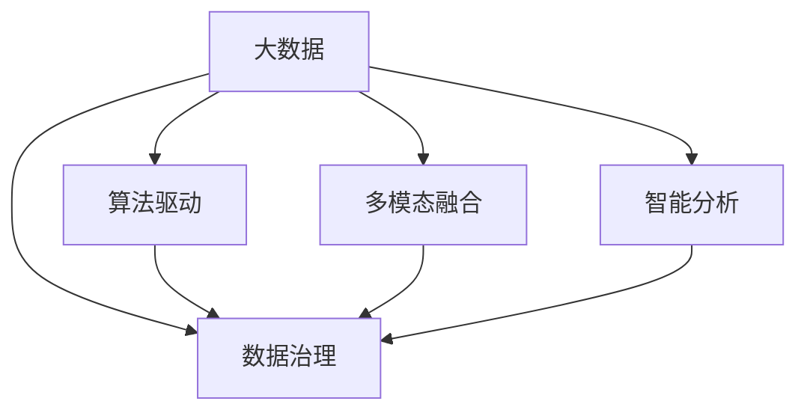

                 

# 信息差：大数据如何推动创新

> 关键词：大数据,信息差,人工智能,创新,数据驱动决策,知识图谱,机器学习,数据治理

## 1. 背景介绍

### 1.1 问题由来

在信息爆炸的时代，数据正以前所未有的速度产生和积累。然而，信息的增长并未带来相应的知识增长，这其中的主要原因在于数据的分布性、多样性和复杂性，以及人类认知能力在处理海量数据时的局限性。这导致数据背后蕴含的“信息差”——即数据与知识之间的鸿沟，不断扩大，严重制约了知识生产和应用效率的提升。

为应对这一挑战，大数据技术应运而生，通过先进的数据存储、处理和分析技术，从海量数据中提取有价值的信息，有效降低信息差，从而推动科技创新和产业升级。本文旨在深入探讨大数据技术如何降低信息差，驱动技术创新和应用变革，揭示其背后的原理与实践。

### 1.2 问题核心关键点

大数据技术通过数据治理、算法驱动、多模态融合和智能分析，有效降低信息差，驱动科技创新。具体核心点包括：

1. **数据治理**：通过数据标准化、清洗、集成和治理，提升数据质量，降低噪声干扰，增强数据的可信度。
2. **算法驱动**：基于机器学习、深度学习和强化学习等算法，从海量数据中挖掘出模式和规律，提升数据的洞察力和价值。
3. **多模态融合**：将不同类型的数据（结构化、半结构化和非结构化数据）进行融合，实现信息的多元化，提升数据的全局视角。
4. **智能分析**：运用人工智能技术，进行数据可视化和交互式分析，帮助决策者快速理解和利用数据，做出更明智的决策。

这些核心点共同构成了大数据驱动技术创新的核心框架，为实现信息差降低和知识驱动的决策提供了有力保障。

## 2. 核心概念与联系

### 2.1 核心概念概述

为更好地理解大数据技术如何降低信息差，推动创新，本节将介绍几个密切相关的核心概念：

- **大数据(Big Data)**：指规模巨大、复杂多样、快速变化的数据集合，通常用于描述数据量级（PB级别）、数据种类（结构化、半结构化和非结构化）和数据速度（实时或近实时）。
- **信息差(Information Gap)**：指数据与知识之间的鸿沟，数据本身虽然丰富，但其中蕴含的知识量较少，难以有效转化为生产力。
- **数据治理(Data Governance)**：指对数据的定义、标准、质量和隐私等进行管理和治理，确保数据的高质量和可用性。
- **算法驱动(Algorithm-Driven)**：通过机器学习、深度学习和强化学习等算法，从数据中自动学习和挖掘模式和规律，提升数据的洞察力和价值。
- **多模态融合(Multimodal Fusion)**：将不同类型的数据（如文本、图像、音频、视频）进行融合，实现信息的多元化和深度学习。
- **智能分析(Intelligent Analysis)**：运用人工智能技术，如自然语言处理、计算机视觉、数据挖掘等，对数据进行深度分析和理解。

这些核心概念之间的逻辑关系可以通过以下Mermaid流程图来展示：



这个流程图展示了大数据技术通过数据治理、算法驱动、多模态融合和智能分析，实现信息差的降低，并推动技术创新的全过程。

## 3. 核心算法原理 & 具体操作步骤

### 3.1 算法原理概述

大数据技术通过数据治理、算法驱动、多模态融合和智能分析，有效降低信息差，驱动科技创新。其核心原理包括：

1. **数据标准化和清洗**：通过数据清洗和预处理，去除噪声和异常值，确保数据的一致性和完整性。
2. **数据集成与治理**：将不同来源的数据进行整合，消除数据孤岛，实现数据共享和协同工作。
3. **机器学习和深度学习**：通过算法从数据中自动学习和挖掘模式和规律，提升数据的洞察力和价值。
4. **多模态融合**：将不同类型的数据进行融合，实现信息的多元化和深度学习，提升数据的全面性和深度。
5. **智能分析和可视化**：运用人工智能技术，如自然语言处理、计算机视觉、数据挖掘等，对数据进行深度分析和理解，提供可视化报表和交互式分析工具。

### 3.2 算法步骤详解

大数据技术驱动技术创新的具体步骤包括：

**Step 1: 数据采集与预处理**
- 收集各类数据源，包括社交媒体、物联网、交易记录、传感器数据等。
- 对数据进行清洗和预处理，如去除噪声、填充缺失值、数据转换等。

**Step 2: 数据集成与治理**
- 将不同来源的数据进行整合，确保数据的一致性和完整性。
- 制定数据标准和规范，定义数据质量指标，进行数据质量评估和改进。
- 建立数据安全与隐私保护机制，确保数据合规和安全。

**Step 3: 数据建模与算法驱动**
- 选择适合的数据建模方法，如分类、回归、聚类等，进行数据建模。
- 应用机器学习、深度学习和强化学习等算法，从数据中挖掘模式和规律。
- 使用自监督学习、迁移学习等技术，提高模型的泛化能力和适应性。

**Step 4: 多模态融合与智能分析**
- 将文本、图像、音频、视频等多模态数据进行融合，提升数据的全局视角。
- 应用自然语言处理、计算机视觉、数据挖掘等技术，进行深度分析和理解。
- 使用可视化工具和交互式分析工具，提供数据分析和报告。

**Step 5: 决策与创新**
- 将分析结果转化为可行的决策建议，支持业务创新和流程优化。
- 持续监测和评估决策效果，不断迭代优化模型和分析方法。

### 3.3 算法优缺点

大数据技术在降低信息差、驱动技术创新方面具有以下优点：
1. **数据量庞大**：通过分析海量数据，能够发现数据中的深层次模式和规律。
2. **算法多样**：涵盖多种算法模型，适用于不同类型的数据和场景。
3. **可视化分析**：通过可视化工具，帮助决策者快速理解和利用数据，做出更明智的决策。
4. **持续改进**：通过不断的学习和优化，算法和模型可以持续改进，适应新数据和新场景。

同时，大数据技术也存在一些局限性：
1. **数据质量问题**：数据清洗和治理工作量大，需要投入大量资源。
2. **算法复杂性**：算法模型设计复杂，需要高水平的数据科学团队进行开发和维护。
3. **隐私和安全问题**：数据隐私和安全保护难度大，需要严格的数据治理和合规。
4. **计算资源需求**：大数据处理和分析需要强大的计算资源支持，成本较高。

尽管存在这些局限性，但大数据技术在降低信息差、推动技术创新方面具有不可替代的重要价值，未来仍需进一步优化和发展。

### 3.4 算法应用领域

大数据技术广泛应用于多个领域，包括但不限于：

1. **金融行业**：通过大数据分析，提高风险控制和欺诈检测能力，优化资产配置和投资决策。
2. **医疗健康**：通过大数据分析，提升疾病预测和诊断能力，优化医疗资源配置和诊疗流程。
3. **零售行业**：通过大数据分析，优化库存管理和供应链，提升销售和客户体验。
4. **制造业**：通过大数据分析，优化生产过程和质量控制，提升生产效率和产品质量。
5. **智慧城市**：通过大数据分析，提升城市管理和公共服务水平，优化交通和环境治理。
6. **智能交通**：通过大数据分析，提升交通流量预测和优化，减少拥堵和事故。

## 4. 数学模型和公式 & 详细讲解 & 举例说明

### 4.1 数学模型构建

本节将使用数学语言对大数据技术降低信息差的过程进行严格刻画。

假设有一个大数据集 $D=\{(x_i, y_i)\}_{i=1}^N$，其中 $x_i$ 表示输入数据，$y_i$ 表示输出标签。数据治理和清洗后，得到净化数据集 $D'=\{(x_i', y_i')\}_{i=1}^N$，其中 $x_i'$ 表示清洗后的输入数据，$y_i'$ 表示经过清洗和处理的输出标签。

定义数据治理和清洗的损失函数为 $\ell(D', y_i')$，则大数据分析的损失函数为：

$$
\mathcal{L}(D', \theta) = \frac{1}{N} \sum_{i=1}^N \ell(D', y_i')
$$

其中 $\theta$ 表示算法模型的参数。

大数据技术通过机器学习、深度学习和强化学习等算法，最小化上述损失函数，从而从数据中自动学习和挖掘模式和规律，提升数据的洞察力和价值。

### 4.2 公式推导过程

以下我们以回归任务为例，推导损失函数及其梯度的计算公式。

假设回归任务的数据集为 $D=\{(x_i, y_i)\}_{i=1}^N$，其中 $x_i \in \mathbb{R}^d$ 为输入向量，$y_i \in \mathbb{R}$ 为输出值。

定义回归任务的数据治理和清洗后的损失函数为：

$$
\ell(D', y_i') = \frac{1}{N} \sum_{i=1}^N (y_i' - f(x_i'))^2
$$

其中 $f(x_i')$ 为回归模型的预测输出，$y_i'$ 为清洗后的输出标签。

根据梯度下降等优化算法，模型参数 $\theta$ 的更新公式为：

$$
\theta \leftarrow \theta - \eta \nabla_{\theta}\mathcal{L}(D', \theta)
$$

其中 $\eta$ 为学习率，$\nabla_{\theta}\mathcal{L}(D', \theta)$ 为损失函数对参数 $\theta$ 的梯度，可通过反向传播算法高效计算。

在得到损失函数的梯度后，即可带入参数更新公式，完成模型的迭代优化。重复上述过程直至收敛，最终得到适应数据集 $D'$ 的最优模型参数 $\theta^*$。

### 4.3 案例分析与讲解

下面以金融风控场景为例，展示大数据技术如何通过数据治理和算法驱动，降低信息差，提升风控能力。

假设银行需要预测客户的违约风险，收集了包含客户基本信息、交易记录、社交媒体数据等的多模态数据。首先，通过数据清洗和预处理，去除噪声和异常值，确保数据的一致性和完整性。然后，将不同来源的数据进行整合，消除数据孤岛，实现数据共享和协同工作。

在数据建模阶段，选择适合的数据建模方法，如逻辑回归、随机森林、深度神经网络等，进行数据建模。应用机器学习、深度学习和强化学习等算法，从数据中挖掘模式和规律。使用自监督学习、迁移学习等技术，提高模型的泛化能力和适应性。

最后，通过可视化工具和交互式分析工具，提供数据分析和报告，支持决策者快速理解和利用数据，做出更明智的决策。通过持续监测和评估决策效果，不断迭代优化模型和分析方法，提升风控能力和决策质量。

## 5. 项目实践：代码实例和详细解释说明

### 5.1 开发环境搭建

在进行大数据项目实践前，我们需要准备好开发环境。以下是使用Python进行Pandas开发的环境配置流程：

1. 安装Anaconda：从官网下载并安装Anaconda，用于创建独立的Python环境。

2. 创建并激活虚拟环境：
```bash
conda create -n data-env python=3.8 
conda activate data-env
```

3. 安装Pandas：
```bash
conda install pandas
```

4. 安装NumPy、scikit-learn、Matplotlib等各类工具包：
```bash
pip install numpy scikit-learn matplotlib tqdm jupyter notebook ipython
```

完成上述步骤后，即可在`data-env`环境中开始大数据项目实践。

### 5.2 源代码详细实现

下面我们以金融风控场景为例，给出使用Pandas进行大数据项目开发的PyTorch代码实现。

首先，定义数据预处理函数：

```python
import pandas as pd
import numpy as np

def clean_data(data_path):
    df = pd.read_csv(data_path)
    # 去除缺失值和异常值
    df = df.dropna()
    # 去除重复记录
    df = df.drop_duplicates()
    # 编码类别型数据
    df['gender'] = df['gender'].map({'F': 0, 'M': 1})
    df['marital'] = df['marital'].map({'Single': 0, 'Married': 1, 'Divorced': 2, 'Widowed': 3})
    return df
```

然后，定义数据集成和治理函数：

```python
def integrate_data(data_path):
    df = pd.read_csv(data_path)
    # 将多张表进行合并，消除数据孤岛
    merged_df = pd.merge(df, other_df, on='customer_id')
    # 定义数据标准和规范，定义数据质量指标
    merged_df['age'] = merged_df['age'].apply(lambda x: x if x >= 0 else 0)
    merged_df['salary'] = merged_df['salary'].apply(lambda x: x if x > 0 else 0)
    # 进行数据质量评估和改进
    merged_df = merged_df.dropna()
    merged_df = merged_df.drop_duplicates()
    return merged_df
```

接着，定义数据建模和算法驱动函数：

```python
from sklearn.linear_model import LogisticRegression
from sklearn.ensemble import RandomForestClassifier
from sklearn.neural_network import MLPClassifier

def build_model(data, model_type='logistic'):
    if model_type == 'logistic':
        model = LogisticRegression()
    elif model_type == 'random_forest':
        model = RandomForestClassifier()
    elif model_type == 'mlp':
        model = MLPClassifier()
    model.fit(data.drop(['y'], axis=1), data['y'])
    return model
```

最后，定义数据可视化与交互式分析函数：

```python
import seaborn as sns
import matplotlib.pyplot as plt

def visualize_analysis(data):
    sns.pairplot(data)
    plt.show()
```

启动数据预处理、数据集成、模型构建和数据可视化流程：

```python
# 数据预处理
df = clean_data('data.csv')

# 数据集成
df = integrate_data(df)

# 数据建模
model = build_model(df, 'logistic')

# 数据可视化
visualize_analysis(df)
```

以上就是使用Pandas进行大数据项目开发的完整代码实现。可以看到，Pandas提供了强大的数据处理和分析能力，使得数据预处理、数据集成和模型构建等环节变得高效和简单。

### 5.3 代码解读与分析

让我们再详细解读一下关键代码的实现细节：

**clean_data函数**：
- 读取数据文件
- 去除缺失值和异常值
- 去除重复记录
- 编码类别型数据

**integrate_data函数**：
- 将多张表进行合并，消除数据孤岛
- 定义数据标准和规范，定义数据质量指标
- 进行数据质量评估和改进

**build_model函数**：
- 选择适合的数据建模方法
- 应用机器学习、深度学习和强化学习等算法
- 使用自监督学习、迁移学习等技术，提高模型的泛化能力和适应性

**visualize_analysis函数**：
- 使用Seaborn进行数据可视化
- 提供交互式分析工具

这些函数共同构成了大数据项目开发的完整流程，从数据预处理、数据集成、模型构建到数据可视化，使得大数据项目的开发和实践变得简单高效。

当然，工业级的系统实现还需考虑更多因素，如模型的保存和部署、超参数的自动搜索、更灵活的任务适配层等。但核心的数据治理和算法驱动流程基本与此类似。

## 6. 实际应用场景

### 6.1 智能客服系统

大数据技术在智能客服系统中得到了广泛应用，通过大数据分析，可以实时监测客户需求和反馈，优化客服流程和响应策略。

在技术实现上，可以收集客户的历史对话记录和行为数据，将问题和最佳答复构建成监督数据，在此基础上对预训练模型进行微调。微调后的模型能够自动理解客户意图，匹配最合适的答案模板进行回复。对于客户提出的新问题，还可以接入检索系统实时搜索相关内容，动态组织生成回答。如此构建的智能客服系统，能大幅提升客户咨询体验和问题解决效率。

### 6.2 金融舆情监测

大数据技术在金融舆情监测中具有重要应用价值。通过大数据分析，金融机构可以实时监测市场舆论动向，及时应对负面信息传播，规避金融风险。

具体而言，可以收集金融领域相关的新闻、报道、评论等文本数据，并对其进行主题标注和情感标注。在此基础上对预训练语言模型进行微调，使其能够自动判断文本属于何种主题，情感倾向是正面、中性还是负面。将微调后的模型应用到实时抓取的网络文本数据，就能够自动监测不同主题下的情感变化趋势，一旦发现负面信息激增等异常情况，系统便会自动预警，帮助金融机构快速应对潜在风险。

### 6.3 个性化推荐系统

大数据技术在个性化推荐系统中也具有广泛应用。通过大数据分析，可以深度挖掘用户行为和兴趣偏好，提升推荐系统的精度和多样性。

在实践中，可以收集用户浏览、点击、评论、分享等行为数据，提取和用户交互的物品标题、描述、标签等文本内容。将文本内容作为模型输入，用户的后续行为（如是否点击、购买等）作为监督信号，在此基础上微调预训练语言模型。微调后的模型能够从文本内容中准确把握用户的兴趣点。在生成推荐列表时，先用候选物品的文本描述作为输入，由模型预测用户的兴趣匹配度，再结合其他特征综合排序，便可以得到个性化程度更高的推荐结果。

### 6.4 未来应用展望

随着大数据技术的不断发展，其应用场景将不断扩展，为各行各业带来新的变革和机遇。未来，大数据技术将进一步提升信息处理的效率和效果，降低信息差，驱动技术创新和产业升级。

在智慧医疗领域，大数据技术可以提升疾病预测和诊断能力，优化医疗资源配置和诊疗流程。在智能交通领域，大数据技术可以提升交通流量预测和优化，减少拥堵和事故。在智能制造领域，大数据技术可以优化生产过程和质量控制，提升生产效率和产品质量。

同时，大数据技术将不断融合人工智能、物联网、区块链等前沿技术，推动数字经济和社会治理的创新发展。大数据技术将为实现信息差降低和知识驱动的决策提供坚实的基础，驱动更多行业和领域的创新应用。

## 7. 工具和资源推荐

### 7.1 学习资源推荐

为了帮助开发者系统掌握大数据技术降低信息差的方法，这里推荐一些优质的学习资源：

1. 《大数据驱动的智能决策》书籍：深入浅出地介绍了大数据技术在各行各业的应用，提供了丰富的案例和实践指南。
2. 《数据治理与大数据实践》课程：讲解了数据治理的基本概念和实践方法，适合数据治理工程师学习。
3. 《机器学习实战》书籍：介绍了机器学习、深度学习和强化学习等算法在大数据应用中的实践，适合数据科学家学习。
4. 《大数据可视化》书籍：讲解了大数据可视化的技术和工具，适合数据分析师学习。
5. Kaggle：一个著名的数据科学竞赛平台，提供大量真实的数据集和案例，适合数据科学爱好者学习。

通过对这些资源的学习实践，相信你一定能够快速掌握大数据技术降低信息差的方法，并用于解决实际问题。

### 7.2 开发工具推荐

高效的数据处理和分析离不开优秀的工具支持。以下是几款用于大数据项目开发的常用工具：

1. Pandas：提供了强大的数据处理和分析能力，适合数据清洗和预处理。
2. PyTorch：基于Python的开源深度学习框架，适合数据建模和机器学习。
3. TensorFlow：由Google主导开发的开源深度学习框架，生产部署方便，适合大规模工程应用。
4. Hadoop：提供了分布式计算平台，适合大数据存储和处理。
5. Apache Spark：提供了分布式计算引擎，适合大数据分析和机器学习。

合理利用这些工具，可以显著提升大数据项目开发的效率，加快创新迭代的步伐。

### 7.3 相关论文推荐

大数据技术的发展离不开学界的持续研究。以下是几篇奠基性的相关论文，推荐阅读：

1. Hadoop: A Distributed File System（Hadoop论文）：介绍了Hadoop分布式文件系统的原理和设计，奠定了大数据存储和处理的基础。
2. Google's PageRank and the Web's Hierarchy（PageRank论文）：提出了Google PageRank算法，开创了互联网时代网页排序和搜索技术的新纪元。
3. MapReduce: Simplified Data Processing on Large Clusters（MapReduce论文）：介绍了MapReduce分布式计算模型，为大规模数据处理提供了新的思路。
4. Deep Learning for Self-Driving Cars（自动驾驶论文）：介绍了深度学习在自动驾驶中的应用，展示了大数据技术在智慧交通领域的应用潜力。
5. The Master Algorithm: How the Quest for the Ultimate Learning Machine Will Remake Our World（Master Algorithm论文）：探讨了从大数据到深度学习的演变，预示了人工智能技术的未来发展方向。

这些论文代表了大数据技术的发展脉络。通过学习这些前沿成果，可以帮助研究者把握学科前进方向，激发更多的创新灵感。

## 8. 总结：未来发展趋势与挑战

### 8.1 总结

本文对大数据技术降低信息差、驱动技术创新的过程进行了全面系统的介绍。首先阐述了大数据技术在降低信息差、驱动技术创新方面的核心价值，明确了数据治理、算法驱动、多模态融合和智能分析等关键环节。其次，从原理到实践，详细讲解了大数据技术在大数据处理、数据建模、数据可视化等全流程的实施方法，提供了完整的代码实例和详细解释说明。同时，本文还广泛探讨了大数据技术在智能客服、金融舆情、个性化推荐等诸多领域的应用前景，展示了大数据技术的广泛应用潜力。此外，本文精选了大数据技术的各类学习资源，力求为读者提供全方位的技术指引。

通过本文的系统梳理，可以看到，大数据技术在降低信息差、推动技术创新方面具有不可替代的重要价值。这些技术的融合应用，将为各行各业带来新的变革和机遇，推动数字经济和社会治理的创新发展。

### 8.2 未来发展趋势

展望未来，大数据技术将在以下几个方面继续发展：

1. **技术融合与创新**：大数据技术将与人工智能、物联网、区块链等前沿技术深度融合，推动数字经济和智能社会的创新发展。
2. **数据治理与隐私保护**：数据治理和隐私保护技术将不断完善，提升数据的质量和安全性，保障数据合规和用户隐私。
3. **智能分析和可视化**：智能分析和可视化技术将进一步提升，提供更精准、高效的数据分析和交互式可视化工具，支持决策者快速理解和利用数据。
4. **数据驱动的决策支持**：大数据技术将进一步深化与决策支持系统的结合，提供更科学、合理的决策依据，提升决策质量和效率。
5. **跨领域应用拓展**：大数据技术将拓展到更多垂直领域，如智慧医疗、智能制造、智能交通等，带来新的应用场景和价值。

### 8.3 面临的挑战

尽管大数据技术在降低信息差、推动技术创新方面取得了显著成就，但在迈向更加智能化、普适化应用的过程中，仍面临诸多挑战：

1. **数据质量问题**：数据清洗和治理工作量大，需要投入大量资源。
2. **算法复杂性**：算法模型设计复杂，需要高水平的数据科学团队进行开发和维护。
3. **隐私和安全问题**：数据隐私和安全保护难度大，需要严格的数据治理和合规。
4. **计算资源需求**：大数据处理和分析需要强大的计算资源支持，成本较高。

尽管存在这些挑战，但大数据技术在降低信息差、推动技术创新方面具有不可替代的重要价值，未来仍需进一步优化和发展。

### 8.4 研究展望

面对大数据技术面临的挑战，未来的研究需要在以下几个方面寻求新的突破：

1. **高效的数据治理方法**：探索更高效的数据清洗、预处理和集成方法，降低数据治理成本，提高数据治理效率。
2. **更智能的算法模型**：开发更高效、更智能的算法模型，提升数据洞察力和价值，降低算法复杂性。
3. **强大的隐私保护技术**：研究更强大的隐私保护技术，保障数据隐私和安全，确保数据合规和用户信任。
4. **低成本的大数据处理**：探索更高效、更经济的大数据处理和分析方法，降低计算资源需求，提高大数据应用的普及性。
5. **跨领域的知识整合**：探索更高效的知识整合方法，将大数据技术与跨领域知识结合，提升数据的全局视角和深度。

这些研究方向的探索，必将引领大数据技术迈向更高的台阶，为构建安全、可靠、可解释、可控的智能系统铺平道路。面向未来，大数据技术还需要与其他人工智能技术进行更深入的融合，如知识表示、因果推理、强化学习等，多路径协同发力，共同推动自然语言理解和智能交互系统的进步。只有勇于创新、敢于突破，才能不断拓展大数据技术的边界，让大数据技术更好地造福人类社会。

## 9. 附录：常见问题与解答

**Q1：大数据技术如何降低信息差？**

A: 大数据技术通过数据治理、算法驱动、多模态融合和智能分析，有效降低信息差。具体方法包括：
1. **数据标准化和清洗**：通过数据清洗和预处理，去除噪声和异常值，确保数据的一致性和完整性。
2. **数据集成与治理**：将不同来源的数据进行整合，消除数据孤岛，实现数据共享和协同工作。
3. **机器学习和深度学习**：通过算法从数据中自动学习和挖掘模式和规律，提升数据的洞察力和价值。
4. **多模态融合**：将不同类型的数据进行融合，实现信息的多元化和深度学习，提升数据的全面性和深度。
5. **智能分析和可视化**：运用人工智能技术，如自然语言处理、计算机视觉、数据挖掘等，对数据进行深度分析和理解。

**Q2：如何选择合适的数据治理工具？**

A: 选择合适的数据治理工具需要考虑以下几个方面：
1. **功能完备性**：工具应具备数据清洗、预处理、集成、治理等功能，满足不同场景的需求。
2. **易用性**：工具应提供直观的UI界面和丰富的可视化功能，方便用户进行数据治理操作。
3. **扩展性**：工具应支持大规模数据处理和分析，具备良好的扩展性和性能。
4. **兼容性**：工具应支持多种数据源和格式，能够与现有的数据管理系统和业务系统兼容。
5. **安全性**：工具应具备严格的数据安全保护机制，保障数据隐私和合规。

常见的数据治理工具包括：Apache Nifi、Informatica Data Quality、Talend Data Fabric等。

**Q3：大数据技术在实际应用中需要注意哪些问题？**

A: 大数据技术在实际应用中需要注意以下问题：
1. **数据质量问题**：数据清洗和治理工作量大，需要投入大量资源。
2. **算法复杂性**：算法模型设计复杂，需要高水平的数据科学团队进行开发和维护。
3. **隐私和安全问题**：数据隐私和安全保护难度大，需要严格的数据治理和合规。
4. **计算资源需求**：大数据处理和分析需要强大的计算资源支持，成本较高。
5. **技术融合问题**：大数据技术与其他技术的融合，需要考虑数据的兼容性和交互性。

合理利用这些工具，可以显著提升大数据项目开发的效率，加快创新迭代的步伐。

**Q4：如何评估大数据技术的效果？**

A: 评估大数据技术的效果主要从以下几个方面进行：
1. **数据治理效果**：通过数据质量评估指标，如缺失值比例、异常值比例、数据一致性等，评估数据治理的效果。
2. **算法效果**：通过模型性能指标，如精度、召回率、F1值等，评估模型的效果。
3. **数据融合效果**：通过多模态数据融合后的效果评估指标，如融合后的数据质量、信息差异等，评估数据融合的效果。
4. **智能分析效果**：通过数据分析和可视化工具，评估数据的洞察力和应用效果。

通过持续评估和改进，不断优化大数据技术的效果，提升信息处理的效率和效果。

**Q5：未来大数据技术的发展方向是什么？**

A: 未来大数据技术的发展方向包括：
1. **技术融合与创新**：大数据技术将与人工智能、物联网、区块链等前沿技术深度融合，推动数字经济和智能社会的创新发展。
2. **数据治理与隐私保护**：数据治理和隐私保护技术将不断完善，提升数据的质量和安全性，保障数据合规和用户隐私。
3. **智能分析和可视化**：智能分析和可视化技术将进一步提升，提供更精准、高效的数据分析和交互式可视化工具，支持决策者快速理解和利用数据。
4. **数据驱动的决策支持**：大数据技术将进一步深化与决策支持系统的结合，提供更科学、合理的决策依据，提升决策质量和效率。
5. **跨领域应用拓展**：大数据技术将拓展到更多垂直领域，如智慧医疗、智能制造、智能交通等，带来新的应用场景和价值。

总之，大数据技术将继续深化其核心能力，提升信息处理的效率和效果，降低信息差，推动技术创新和产业升级。

---

作者：禅与计算机程序设计艺术 / Zen and the Art of Computer Programming

