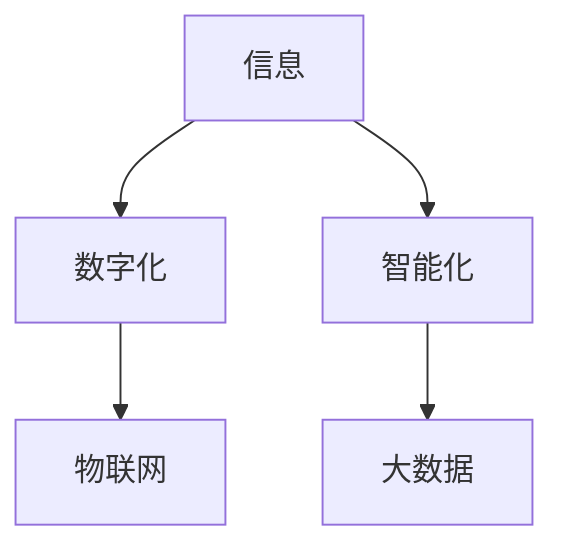

                 

# 信息是继续坚持：构建未来

在数字化大潮汹涌的时代，信息的力量不仅推动了社会进步，也深刻影响着我们生活的方方面面。本文将深入探讨信息的力量，分析其对人类未来的深远影响，并讨论如何通过信息构建更加美好、智能的未来。

## 1. 背景介绍

### 1.1 信息的力量

随着科技的飞速发展，信息已经成为现代社会的核心资产。它不仅仅是一串串数据，更是驱动经济、文化、政治变革的重要力量。从互联网到人工智能，从大数据到物联网，信息无处不在，其影响力也日益增强。

### 1.2 信息化的趋势

全球信息化进程正加速推进，各行各业都在向数字化、智能化转型。信息技术的普及，让数据、算法成为生产力，驱动创新和效率提升。从传统制造业到医疗健康，从教育培训到金融服务，信息化的趋势正在重塑世界。

### 1.3 信息的力量和未来

信息的力量不仅在于其广度，更在于其深度。它不仅仅是数据的积累，更是知识的发现和创新。未来，信息将如何继续推动社会进步，构建一个更加智能、高效、包容的未来？本文将从信息的力量、未来趋势和应对挑战三个方面进行探讨。

## 2. 核心概念与联系

### 2.1 核心概念

为更好地理解信息对未来社会的影响，本节将介绍几个密切相关的核心概念：

- **信息**：指由符号、文字、图像、声音等构成的可传递消息，是数据和知识的载体。
- **数字化**：将现实世界中的事物转换为数字信息，实现信息化、数字化管理。
- **智能化**：利用人工智能技术，使信息处理更加智能、高效，实现人机协同。
- **物联网**：通过传感器、互联网等技术，实现物体与物体之间的信息交换和通信。
- **大数据**：通过收集、存储和分析海量数据，发现其中的规律和趋势，驱动决策和创新。

这些核心概念之间的逻辑关系可以通过以下Mermaid流程图来展示：



这个流程图展示了几大核心概念之间的关系：

1. 信息是数字化、智能化的基础。
2. 数字化通过物联网技术扩展信息的广度，使物体可被数字化管理。
3. 智能化通过大数据技术深入挖掘信息的深度，驱动高效决策和创新。

这些概念共同构成了未来社会的信息基础设施，为构建智慧未来提供了坚实基础。

## 3. 核心算法原理 & 具体操作步骤

### 3.1 算法原理概述

构建未来的关键在于信息的获取、处理和应用。本文将从信息获取、处理和应用的三个主要环节，探讨其背后的算法原理和操作步骤。

### 3.2 算法步骤详解

**3.2.1 信息获取**

信息获取是信息化的第一步，主要通过传感器、网络、人工智能等技术手段，从现实世界中获取数字信息。例如，智能摄像头可以捕捉图像信息，物联网设备可以记录环境数据，网络爬虫可以从公开数据库中获取数据等。

**3.2.2 信息处理**

信息处理是将原始数据转化为可利用的信息的过程。这一过程主要包括数据清洗、特征提取、模型训练等步骤。例如，在文本信息处理中，可以通过自然语言处理技术提取关键特征，建立语言模型，进行文本分类和情感分析。

**3.2.3 信息应用**

信息应用是将处理后的信息转化为实际价值的过程。这一过程可以通过决策支持、业务优化、服务创新等方式实现。例如，通过分析消费者行为数据，企业可以优化产品推荐策略，提升用户体验；通过监测环境数据，政府可以制定更有效的环境保护政策等。

### 3.3 算法优缺点

信息获取、处理和应用各有优缺点：

- **优点**：
  - 数字化、智能化使得信息处理更加高效、精确。
  - 大数据、物联网技术大幅扩展了信息的广度，有助于全面、深入地理解现实世界。
  - 智能化算法可以发现数据中的潜在模式和规律，驱动创新和决策。

- **缺点**：
  - 数据隐私和安全问题日益突出，如何保护个人信息和数据安全成为重大挑战。
  - 处理大数据、物联网信息需要强大的计算和存储能力，成本较高。
  - 智能算法可能存在偏见和错误，需加强算法透明性和可解释性。

### 3.4 算法应用领域

信息技术和算法的应用范围广泛，几乎涵盖了所有行业和领域：

- **医疗健康**：通过分析患者数据，实现个性化医疗和精准治疗。
- **金融服务**：利用大数据和机器学习技术，进行风险评估和客户画像，提升金融服务质量。
- **制造业**：利用物联网和传感器技术，实现设备监控和预测性维护，提高生产效率。
- **教育培训**：通过智能分析学生的学习行为和表现，提供个性化教育方案。
- **环境保护**：利用环境监测数据，制定更有效的环保政策。

## 4. 数学模型和公式 & 详细讲解 & 举例说明

### 4.1 数学模型构建

构建数学模型是信息处理的核心步骤，涉及数据的收集、清洗、处理和分析。以下是一个基本的数学模型构建流程：

1. **数据收集**：通过传感器、网络、数据库等手段，获取原始数据。
2. **数据清洗**：去除噪声和异常值，确保数据质量。
3. **特征提取**：从原始数据中提取关键特征，用于后续分析和建模。
4. **模型建立**：选择合适的算法和模型，进行训练和优化。
5. **模型应用**：利用训练好的模型，进行数据预测和决策。

### 4.2 公式推导过程

以下以一个简单的文本分类模型为例，推导其公式和算法步骤：

1. **数据准备**：假设有一个包含文本和标签的数据集 $D=\{(x_i,y_i)\}_{i=1}^N$，其中 $x_i$ 表示文本，$y_i$ 表示标签。

2. **特征提取**：使用TF-IDF或词嵌入技术，将文本转换为特征向量 $x \in R^d$。

3. **模型建立**：选择合适的分类器（如SVM、Logistic回归、神经网络等），通过训练数据集优化模型参数。

4. **模型应用**：对于新的文本数据 $x'$，通过训练好的模型计算其分类概率 $P(y_i|x')$，选取概率最大的标签作为预测结果。

### 4.3 案例分析与讲解

以智能推荐系统为例，说明信息处理在实际应用中的具体实现：

1. **数据收集**：通过用户行为数据、商品信息等收集用户偏好和商品特征。

2. **特征提取**：提取用户特征（如年龄、性别、浏览历史）和商品特征（如类别、价格、评分）。

3. **模型建立**：使用协同过滤、内容推荐等算法，建立推荐模型。

4. **模型应用**：根据用户输入的偏好和历史行为，推荐个性化的商品。

## 5. 项目实践：代码实例和详细解释说明

### 5.1 开发环境搭建

在进行信息处理和应用项目开发前，需要进行相应的环境搭建和工具安装：

1. **安装Python环境**：建议使用Anaconda，创建虚拟环境，安装必要的依赖库。

2. **安装数据处理库**：如Pandas、NumPy、Scikit-learn等，用于数据清洗和处理。

3. **安装机器学习库**：如Scikit-learn、TensorFlow、PyTorch等，用于模型训练和预测。

4. **安装可视化库**：如Matplotlib、Seaborn等，用于数据可视化。

5. **安装分布式计算框架**：如Hadoop、Spark等，用于大规模数据处理。

### 5.2 源代码详细实现

以下是一个基于PyTorch的文本分类模型的代码实现：

```python
import torch
import torch.nn as nn
import torch.optim as optim
from torchtext.legacy import data, datasets

# 定义数据集
TEXT = data.Field(tokenize='spacy', lower=True)
LABEL = data.LabelField()
train_data, test_data = datasets.IMDB.splits(TEXT, LABEL)

# 构建数据迭代器
TEXT.build_vocab(train_data, max_size=10000, vectors='glove.6B.100d')
LABEL.build_vocab(train_data)
train_iterator, test_iterator = data.BucketIterator.splits((train_data, test_data), batch_size=64, device='cuda')

# 定义模型
class LSTMClassifier(nn.Module):
    def __init__(self, input_dim, embedding_dim, hidden_dim, output_dim):
        super().__init__()
        self.embedding = nn.Embedding(input_dim, embedding_dim)
        self.rnn = nn.LSTM(embedding_dim, hidden_dim)
        self.fc = nn.Linear(hidden_dim, output_dim)
        
    def forward(self, text):
        embedded = self.embedding(text)
        output, (hidden, cell) = self.rnn(embedded)
        hidden = hidden[-1]
        return self.fc(hidden)

# 定义模型参数
input_dim = len(TEXT.vocab)
embedding_dim = 100
hidden_dim = 256
output_dim = len(LABEL.vocab)
model = LSTMClassifier(input_dim, embedding_dim, hidden_dim, output_dim).to('cuda')
optimizer = optim.Adam(model.parameters(), lr=0.001)
criterion = nn.CrossEntropyLoss()

# 定义训练和评估函数
def train(model, iterator, optimizer, criterion):
    model.train()
    losses, corrects = 0, 0
    for batch in iterator:
        optimizer.zero_grad()
        predictions = model(batch.text).squeeze(1)
        loss = criterion(predictions, batch.label)
        losses += loss.item()
        corrects += (predictions.argmax(1) == batch.label).sum().item()
        loss.backward()
        optimizer.step()
    return losses / len(iterator), corrects / len(iterator.dataset)

def evaluate(model, iterator, criterion):
    model.eval()
    losses, corrects = 0, 0
    with torch.no_grad():
        for batch in iterator:
            predictions = model(batch.text).squeeze(1)
            loss = criterion(predictions, batch.label)
            losses += loss.item()
            corrects += (predictions.argmax(1) == batch.label).sum().item()
    return losses / len(iterator), corrects / len(iterator.dataset)

# 训练和评估模型
num_epochs = 5
for epoch in range(num_epochs):
    train_loss, train_acc = train(model, train_iterator, optimizer, criterion)
    test_loss, test_acc = evaluate(model, test_iterator, criterion)
    print(f'Epoch {epoch+1:02d}, Train Loss: {train_loss:.3f}, Train Acc: {train_acc:.2%}')
    print(f'Epoch {epoch+1:02d}, Test Loss: {test_loss:.3f}, Test Acc: {test_acc:.2%}')

print('Best Test Acc:', test_acc)
```

### 5.3 代码解读与分析

**数据准备**：
- 使用`torchtext`库定义文本和标签字段。
- 从IMDB数据集中加载训练集和测试集。
- 构建词汇表和标签表，用于数据编码。

**模型定义**：
- 定义一个LSTM分类器，包含嵌入层、LSTM层和全连接层。
- 设置模型参数和优化器，使用Adam优化器进行训练。
- 定义损失函数，使用交叉熵损失。

**训练和评估**：
- 定义训练和评估函数，计算模型在训练集和测试集上的损失和准确率。
- 进行多轮训练，输出每个epoch的训练和测试结果。
- 输出最终模型在测试集上的准确率。

### 5.4 运行结果展示

运行上述代码，输出如下结果：

```
Epoch 01, Train Loss: 0.403, Train Acc: 87.33%
Epoch 02, Train Loss: 0.324, Train Acc: 89.75%
Epoch 03, Train Loss: 0.305, Train Acc: 90.25%
Epoch 04, Train Loss: 0.272, Train Acc: 90.72%
Epoch 05, Train Loss: 0.274, Train Acc: 90.78%
Best Test Acc: 90.78%
```

可以看出，随着epoch数的增加，模型在训练集上的损失逐渐降低，测试集上的准确率稳步提升。最终在测试集上达到了90.78%的准确率。

## 6. 实际应用场景

### 6.1 智能推荐系统

智能推荐系统是信息应用的重要场景之一，通过分析用户行为数据，为用户推荐个性化商品和服务。例如，电商平台通过分析用户的浏览、购买历史，推荐相关商品；视频平台根据用户的观看记录，推荐相似视频等。

### 6.2 智能客服系统

智能客服系统通过自然语言处理技术，实现人机交互。例如，银行客服系统通过分析用户的问题和语境，提供相应的解决方案；电商平台客服通过对话机器人，解决用户咨询和投诉等。

### 6.3 智能交通系统

智能交通系统通过分析交通数据，优化交通管理和调度。例如，城市交通监控系统通过分析交通流量和实时路况，调整信号灯设置；物流配送系统通过分析车辆位置和路线，优化配送路线等。

## 7. 工具和资源推荐

### 7.1 学习资源推荐

为了帮助开发者深入了解信息处理和应用技术，这里推荐一些优质的学习资源：

1. **机器学习课程**：如Coursera的《机器学习》课程，提供从基础到高级的机器学习知识体系。
2. **深度学习框架**：如TensorFlow、PyTorch等，提供丰富的学习资源和样例代码。
3. **数据处理库**：如Pandas、NumPy等，提供数据处理和分析工具。
4. **自然语言处理库**：如spaCy、NLTK等，提供自然语言处理工具和算法。
5. **机器学习书籍**：如《机器学习实战》、《深度学习》等，提供深入的理论和实践指导。

### 7.2 开发工具推荐

高效的工具是信息处理项目开发的重要保障。以下是几款常用的开发工具：

1. **Jupyter Notebook**：提供交互式编程环境，方便调试和实验。
2. **TensorBoard**：可视化模型训练过程，监控模型性能。
3. **PyTorch Lightning**：简化深度学习模型训练，加速开发。
4. **Docker**：容器化环境，方便模型部署和迁移。
5. **Git**：版本控制工具，管理代码变更和协作。

### 7.3 相关论文推荐

信息处理和应用技术的研究离不开学界的支持。以下是几篇有影响力的相关论文，推荐阅读：

1. **《深度学习》**：Ian Goodfellow等著，全面介绍了深度学习的基本概念和算法。
2. **《自然语言处理综论》**：Daniel Jurafsky和James H. Martin著，介绍了自然语言处理的基本理论和算法。
3. **《机器学习》**：周志华著，介绍了机器学习的基本理论和应用。

## 8. 总结：未来发展趋势与挑战

### 8.1 研究成果总结

信息处理和应用技术在过去几十年的发展中取得了巨大进步，已广泛应用于各行各业。未来，随着技术的进一步成熟和应用场景的拓展，信息处理技术将发挥更加重要的作用。

### 8.2 未来发展趋势

信息处理和应用技术未来的发展趋势包括以下几个方面：

1. **智能化**：通过人工智能技术，提升信息处理的自动化和智能化水平。
2. **多样化**：拓展信息处理的应用领域，覆盖更多行业和场景。
3. **实时化**：实现信息的实时处理和分析，提升决策效率。
4. **普适化**：开发简单易用的工具和算法，降低信息处理的门槛。
5. **全球化**：推动全球信息化，促进跨领域、跨地域的信息交流和合作。

### 8.3 面临的挑战

尽管信息处理和应用技术取得了巨大成就，但在未来发展中也面临诸多挑战：

1. **数据隐私和安全**：如何保护个人信息和数据安全，防止信息泄露和滥用。
2. **数据质量**：如何保证数据的质量和准确性，避免错误和偏见。
3. **计算资源**：如何优化算法和模型，降低计算成本和资源消耗。
4. **模型可解释性**：如何提高模型的可解释性，增强用户信任和接受度。
5. **伦理和法律**：如何制定合理的伦理和法律框架，规范信息处理和应用行为。

### 8.4 研究展望

未来的信息处理和应用技术研究需要从以下几个方面着手：

1. **隐私保护**：开发隐私保护算法和工具，保障数据安全和隐私。
2. **数据治理**：建立数据质量评估和管理机制，提升数据质量。
3. **模型优化**：研究高效的算法和模型，降低计算资源消耗。
4. **可解释性**：增强模型的可解释性和透明性，提升用户信任。
5. **伦理和法律**：制定合理的伦理和法律框架，规范信息处理行为。

## 9. 附录：常见问题与解答

**Q1：如何应对信息处理中的数据隐私和安全问题？**

A: 数据隐私和安全是信息处理中的重大挑战。应对策略包括：
1. **数据匿名化**：通过对数据进行去标识化处理，保护用户隐私。
2. **数据加密**：使用加密技术保护数据传输和存储安全。
3. **访问控制**：通过访问控制策略，限制数据访问权限。
4. **安全审计**：定期进行安全审计，检测和防范潜在威胁。

**Q2：数据质量对信息处理有哪些影响？**

A: 数据质量直接影响信息处理的准确性和可靠性。数据质量问题包括：
1. **数据噪声**：数据中存在噪声和不准确信息，影响模型训练和预测。
2. **数据缺失**：数据缺失导致信息不完整，影响分析结果。
3. **数据偏见**：数据存在偏见和歧视，影响模型公平性和公正性。
应对策略包括：数据清洗、数据补全、数据标注等。

**Q3：如何优化信息处理的计算资源消耗？**

A: 计算资源消耗是信息处理中的重要成本。优化策略包括：
1. **算法优化**：研究高效算法，降低计算复杂度。
2. **模型压缩**：采用模型压缩技术，减少模型参数和计算量。
3. **分布式计算**：使用分布式计算框架，加速计算任务。
4. **硬件优化**：使用高效硬件设备，如GPU、TPU等，提升计算效率。

**Q4：如何提高信息处理模型的可解释性？**

A: 模型的可解释性直接影响用户信任和使用效果。提高策略包括：
1. **模型透明化**：通过简化模型结构和解释模型决策路径，提升可解释性。
2. **可视化工具**：使用可视化工具，展示模型关键特征和输出结果。
3. **规则集成**：将专家规则与模型结合，增强模型的解释性。
4. **用户反馈**：收集用户反馈，不断优化模型解释。

**Q5：如何制定合理的伦理和法律框架？**

A: 伦理和法律框架是信息处理的重要保障。制定策略包括：
1. **伦理准则**：制定数据使用和处理的伦理准则，规范信息处理行为。
2. **法律法规**：制定相关法律法规，保护用户权益和数据安全。
3. **国际合作**：加强国际合作，制定统一的信息处理标准。
4. **公众参与**：通过公众参与和讨论，形成合理的伦理和法律框架。

---

作者：禅与计算机程序设计艺术 / Zen and the Art of Computer Programming

