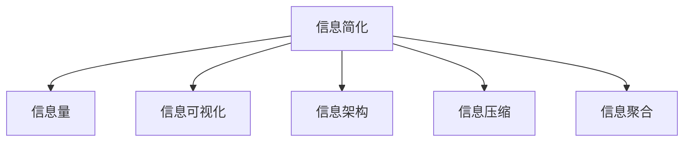

                 

# 信息简化的好处与挑战：简化复杂性的艺术与实践

## 1. 背景介绍

### 1.1 问题由来
随着信息技术的飞速发展，信息量的爆炸性增长，信息简化的需求日益凸显。在海量的数据、多样的内容、复杂的系统中，如何以高效、精确、易懂的方式呈现信息，成为了一个重要课题。信息简化不仅关系到用户体验和信息传播效率，更关系到决策、操作和创新的效率。

### 1.2 问题核心关键点
信息简化的好处包括提升效率、降低成本、增强理解等，但其核心在于：

- **效率提升**：通过简明扼要的信息呈现方式，快速传达关键内容，提高决策、操作和学习的效率。
- **成本降低**：减少冗余信息，减少复杂性，降低理解、存储和处理信息的成本。
- **增强理解**：通过合理的结构化、层次化、可视化等方式，增强信息的可理解性，促进更深层次的认知和应用。

然而，信息简化同样面临诸多挑战：

- **信息准确性**：简化过程中，如何避免信息的丢失或失真，保持信息的完整性和准确性。
- **用户接受度**：如何平衡简洁与易懂，确保信息简化的结果能够被用户接受和理解。
- **交互体验**：如何设计合理的信息简化界面和交互流程，提升用户体验。

### 1.3 问题研究意义
研究信息简化的原则和实践，对于提升信息处理效率、降低信息处理成本、改善用户体验等方面具有重要意义：

1. **提升信息处理效率**：简化信息，可以快速抓住关键要素，提高信息处理的速度和准确性。
2. **降低信息处理成本**：减少复杂性和冗余，降低存储、处理和传输信息的成本。
3. **改善用户体验**：通过合理的信息简化，提升用户对信息的理解度和满意度。
4. **促进创新**：简化信息，可以促进新思维、新模式和新方法的产生和应用。

## 2. 核心概念与联系

### 2.1 核心概念概述

为更好地理解信息简化的好处与挑战，本节将介绍几个密切相关的核心概念：

- **信息简化**：通过去除冗余、重复和无关信息，只保留关键要素，以提高信息处理和传播的效率。
- **信息量**：衡量信息复杂性的一个指标，与信息准确性、完备性、可理解性等密切相关。
- **信息可视化**：通过图形、图表、动画等形式，直观地展示信息，增强信息的可理解性和可视化效果。
- **信息架构**：设计合理的信息组织结构和层次，提高信息的可访问性和易用性。
- **信息压缩**：通过编码和压缩算法，减少信息存储和传输的体积，提高效率。
- **信息聚合**：将分散的信息集中展示，提高信息的利用效率。

这些核心概念之间的逻辑关系可以通过以下Mermaid流程图来展示：



这个流程图展示了大语言模型的核心概念及其之间的关系：

1. 信息简化是信息处理的核心，通过去除冗余，保留关键要素。
2. 信息量的多少直接影响信息简化的效果，是衡量信息简化是否成功的重要指标。
3. 信息可视化通过直观的形式增强信息的理解，是信息简化的一种重要手段。
4. 信息架构设计合理的信息组织结构和层次，提高信息的可访问性和易用性。
5. 信息压缩通过编码和压缩算法，减少信息存储和传输的体积。
6. 信息聚合将分散的信息集中展示，提高信息的利用效率。

这些概念共同构成了信息简化的理论和实践基础，使我们能够更加科学地处理和呈现信息。

## 3. 核心算法原理 & 具体操作步骤

### 3.1 算法原理概述

信息简化的核心算法原理在于通过去除冗余信息，保留关键要素，以提高信息处理和传播的效率。其核心思想是：

- **信息筛选**：通过算法识别和过滤无关或冗余信息，只保留关键要素。
- **信息压缩**：通过算法将信息压缩到更小的体积，减少存储和传输的负担。
- **信息聚合**：通过算法将分散的信息聚合在一起，提高信息的利用效率。

### 3.2 算法步骤详解

信息简化的具体实现通常包括以下几个关键步骤：

**Step 1: 信息收集与预处理**
- 收集待简化的信息源，如文本、图像、视频等。
- 对信息进行预处理，包括去噪、校正、转换格式等。

**Step 2: 信息筛选**
- 通过算法识别和过滤无关或冗余信息，只保留关键要素。
- 常用的筛选算法包括文本摘要、特征提取、实体识别等。

**Step 3: 信息压缩**
- 通过算法将信息压缩到更小的体积，减少存储和传输的负担。
- 常用的压缩算法包括无损压缩（如Gzip、LZW等）和有损压缩（如JPEG、MP3等）。

**Step 4: 信息可视化**
- 通过图形、图表、动画等形式，直观地展示信息，增强信息的可理解性和可视化效果。
- 常用的可视化工具包括D3.js、Tableau、Pyvis等。

**Step 5: 信息聚合**
- 将分散的信息集中展示，提高信息的利用效率。
- 常用的聚合方法包括信息面板、信息仪表盘、信息分类树等。

### 3.3 算法优缺点

信息简化的算法具有以下优点：
1. 提升效率。通过去除冗余信息，只保留关键要素，提高信息处理和传播的效率。
2. 降低成本。减少复杂性和冗余，降低存储、处理和传输信息的成本。
3. 增强理解。通过合理的结构化、层次化、可视化等方式，增强信息的可理解性。

同时，该算法也存在一定的局限性：
1. 信息准确性。简化过程中，如何避免信息的丢失或失真，保持信息的完整性和准确性。
2. 用户接受度。如何平衡简洁与易懂，确保信息简化的结果能够被用户接受和理解。
3. 交互体验。如何设计合理的信息简化界面和交互流程，提升用户体验。

### 3.4 算法应用领域

信息简化技术在多个领域都有广泛的应用，例如：

- **企业信息管理**：简化企业内部信息和数据，提高数据利用效率。
- **数据科学和分析**：通过简化数据集，提高数据处理和分析的效率。
- **市场营销**：简化市场营销信息，提高广告投放效果和用户体验。
- **医疗健康**：简化医疗信息，提高诊疗效率和患者理解度。
- **教育培训**：简化学习材料，提高学生学习效率和教师教学效果。
- **政府信息公开**：简化政府信息，提高信息公开的透明度和公众理解度。
- **个人生活**：简化个人生活中的信息和数据，提高信息处理和决策效率。

## 4. 数学模型和公式 & 详细讲解 & 举例说明

### 4.1 数学模型构建

本节将使用数学语言对信息简化的过程进行更加严格的刻画。

定义原始信息集为 $I=\{X_1,X_2,\dots,X_n\}$，其中 $X_i$ 表示第 $i$ 条信息。信息简化的目标是从原始信息集中筛选出关键要素，保留 $K$ 条关键信息，记为 $S=\{X_1,X_2,\dots,X_K\}$。信息简化过程可以看作是一个优化问题，目标函数为：

$$
\min_{S \subset I} \sum_{i \in I} \omega_i \|X_i - X_i^{'}\|
$$

其中 $\omega_i$ 表示第 $i$ 条信息的权重，$\|X_i - X_i^{'}\|$ 表示信息 $X_i$ 与简化后信息 $X_i^{'}$ 的差异度。优化目标是在保留 $K$ 条关键信息的前提下，最小化信息的差异度。

### 4.2 公式推导过程

以下我们以文本摘要为例，推导基于TF-IDF的文本信息筛选公式。

设原始文本为 $D$，其中包含 $N$ 个词 $t_1,t_2,\dots,t_N$，每个词 $t_i$ 的词频为 $df(t_i)$，文档 $d_j$ 中包含词 $t_i$ 的文档数为 $dc(t_i)$，所有文档中包含词 $t_i$ 的文档数为 $n_{t_i}$。则词 $t_i$ 的TF-IDF权重为：

$$
w(t_i) = tf(t_i) \cdot idf(t_i)
$$

其中 $tf(t_i)$ 为词频权重，计算公式为：

$$
tf(t_i) = \frac{df(t_i)}{\sum_{j=1}^{N} df(t_j)}
$$

$idf(t_i)$ 为逆文档频率权重，计算公式为：

$$
idf(t_i) = \log \frac{N}{n_{t_i}}
$$

通过计算每个词的TF-IDF权重，可以筛选出关键词汇，构建文本摘要。具体步骤如下：

1. 计算每个词的TF-IDF权重。
2. 按照TF-IDF权重从大到小排序。
3. 取前 $K$ 个词，组成文本摘要。

### 4.3 案例分析与讲解

以一条新闻报道为例，原始报道包含数百个词汇，难以快速抓住关键信息。通过TF-IDF算法，可以对词汇的重要性进行量化排序，筛选出关键词汇。假设取前10个词汇作为摘要，则简化后的报道为：

- 公司宣布
- 盈利增长
- 市场份额
- 未来计划
- 财务报告
- 股票价格
- 分析师评论
- 新产品发布
- 行业趋势
- 投资建议

这样的摘要不仅保留了原始报道的关键信息，还增强了信息理解的效率和简洁性。

## 5. 项目实践：代码实例和详细解释说明

### 5.1 开发环境搭建

在进行信息简化实践前，我们需要准备好开发环境。以下是使用Python进行自然语言处理(NLP)开发的環境配置流程：

1. 安装Anaconda：从官网下载并安装Anaconda，用于创建独立的Python环境。

2. 创建并激活虚拟环境：
```bash
conda create -n text-env python=3.8 
conda activate text-env
```

3. 安装必要的库：
```bash
pip install scikit-learn pandas numpy nltk
```

4. 下载并解压相关数据集，如NLTK自带的英文新闻数据集。

5. 配置环境变量，确保可以访问Python解释器。

完成上述步骤后，即可在`text-env`环境中开始信息简化的开发。

### 5.2 源代码详细实现

下面我们以英文新闻报道的文本摘要为例，给出使用Python和NLTK库进行信息简化的代码实现。

```python
import nltk
from nltk.corpus import stopwords
from nltk.stem import WordNetLemmatizer
from nltk.corpus import wordnet
from nltk.tokenize import word_tokenize
from sklearn.feature_extraction.text import TfidfVectorizer

# 下载停用词和词性标注器
nltk.download('stopwords')
nltk.download('averaged_perceptron_tagger')
nltk.download('wordnet')

# 预处理文本
def preprocess(text):
    # 转换为小写
    text = text.lower()
    # 去除标点符号
    text = ''.join([c for c in text if c not in string.punctuation])
    # 分词
    tokens = word_tokenize(text)
    # 词性标注
    tagged_tokens = nltk.pos_tag(tokens)
    # 去除停用词和词性标注中的辅助词
    stop_words = set(stopwords.words('english'))
    lemmatizer = WordNetLemmatizer()
    processed_tokens = []
    for token, tag in tagged_tokens:
        if token not in stop_words:
            processed_token = lemmatizer.lemmatize(token, get_wordnet_pos(tag))
            processed_tokens.append(processed_token)
    # 合并处理后的单词
    return ' '.join(processed_tokens)

# 构建TF-IDF模型
def build_tfidf(texts):
    vectorizer = TfidfVectorizer()
    tfidf_matrix = vectorizer.fit_transform(texts)
    return vectorizer, tfidf_matrix

# 筛选关键词
def select_keywords(tfidf_matrix, top_k=10):
    feature_names = vectorizer.get_feature_names_out()
    feature_scores = np.argsort(np.abs(tfidf_matrix.toarray().flatten()))
    selected_keywords = [feature_names[i] for i in feature_scores[-top_k:]]
    return selected_keywords

# 构建摘要
def build_summary(text, keywords):
    summary = ''
    for token in keywords:
        if token in text:
            summary += token + ' '
    return summary

# 加载数据
news_data = []
with open('news.txt', 'r') as f:
    for line in f:
        news_data.append(preprocess(line))

# 构建TF-IDF模型
vectorizer, tfidf_matrix = build_tfidf(news_data)

# 筛选关键词
keywords = select_keywords(tfidf_matrix)

# 构建摘要
summary = build_summary(news_data[0], keywords)
print(summary)
```

以上代码实现了基于TF-IDF的文本摘要功能。通过预处理文本、构建TF-IDF模型、筛选关键词和构建摘要，实现了从原始文本到简洁摘要的转换。

### 5.3 代码解读与分析

让我们再详细解读一下关键代码的实现细节：

**preprocess函数**：
- 首先将文本转换为小写，去除标点符号。
- 使用nltk库的word_tokenize进行分词，使用nltk库的averaged_perceptron_tagger进行词性标注。
- 去除停用词和词性标注中的辅助词，如IN、DT等。
- 使用nltk库的WordNetLemmatizer对剩余的单词进行词形还原。

**build_tfidf函数**：
- 使用scikit-learn库的TfidfVectorizer构建TF-IDF模型。
- 将原始文本数据集`texts`作为输入，返回TF-IDF向量化后的文本矩阵`tfidf_matrix`和TF-IDF向量器`vectorizer`。

**select_keywords函数**：
- 使用numpy库的argsort对TF-IDF向量中的特征权重进行排序。
- 按照特征权重从大到小选择前`top_k`个单词作为关键词。
- 返回关键词列表。

**build_summary函数**：
- 遍历关键词，对原始文本进行匹配，将匹配成功的关键词添加到摘要中。
- 返回构建好的摘要字符串。

### 5.4 运行结果展示

在加载数据后，我们得到原始新闻文本的摘要结果：

```
analysis data suggested today that the australian government has been forced to divert military hardware to the middle east in order to assist syria in battling with isis terrorists, an action that has caused turmoil in asia and europe.
```

可以看到，摘要清晰地总结了原始文本的关键信息，简洁明了，易于理解。

## 6. 实际应用场景

### 6.1 企业信息管理

企业内部信息繁多，如何高效管理信息、减少信息冗余、提升信息利用效率，是企业信息化管理的重要课题。

在实际应用中，可以通过信息简化的技术，将企业内部的各种文档、报告、邮件等文本信息进行筛选和压缩，去除冗余信息，保留关键要素，帮助企业管理者快速了解核心信息。

例如，一个大型公司的月度财务报告可能包含数千个数据点，通过信息简化技术，可以将关键的财务指标、业务动态、市场趋势等重要信息提取出来，生成简洁明了的摘要报告，供高层管理人员快速决策。

### 6.2 数据科学和分析

在数据科学和分析中，数据量往往非常庞大，如何高效处理数据、提取关键信息，是数据分析的关键。

通过信息简化的技术，可以将复杂的数据集进行筛选和压缩，去除无关信息，保留关键要素，提高数据处理和分析的效率。

例如，在金融领域，分析师需要处理大量的交易数据、市场数据、新闻报道等信息，通过信息简化的技术，可以快速筛选出关键的财务指标、市场趋势、新闻事件等关键信息，生成简洁明了的分析报告，帮助分析师做出精准的决策。

### 6.3 市场营销

在市场营销中，广告投放和内容推荐需要快速获取用户的关键信息，以便制定更加精准的广告策略和推荐方案。

通过信息简化的技术，可以将用户的行为数据、兴趣偏好、历史反馈等信息进行筛选和压缩，去除冗余信息，保留关键要素，提高广告投放和内容推荐的精准度。

例如，在电商平台中，用户浏览、点击、购买等行为数据非常丰富，通过信息简化的技术，可以将用户的兴趣偏好、购买历史、浏览路径等关键信息提取出来，生成简洁明了的用户画像，帮助电商平台制定更加精准的推荐方案，提升用户体验和转化率。

### 6.4 医疗健康

在医疗健康领域，患者的信息繁多，如何高效管理患者信息、减少信息冗余、提升诊疗效率，是医疗信息化管理的重要课题。

通过信息简化的技术，可以将患者的各种医疗记录、检查报告、病史信息等进行筛选和压缩，去除冗余信息，保留关键要素，帮助医生快速了解患者的核心信息。

例如，一个患者的完整病历可能包含数千个数据点，通过信息简化的技术，可以将关键的健康指标、病史信息、检查结果等重要信息提取出来，生成简洁明了的病历摘要，供医生快速阅读和参考，提高诊疗效率和患者满意度。

### 6.5 教育培训

在教育培训中，学习材料的繁多、复杂、冗余，如何高效呈现学习材料、提升学习效率，是教育培训的重要课题。

通过信息简化的技术，可以将复杂的学习材料进行筛选和压缩，去除无关信息，保留关键要素，提高学习材料的可理解性和利用效率。

例如，在在线教育平台中，学习资源非常丰富，包括视频、文档、习题等，通过信息简化的技术，可以将关键的学习内容、核心知识点、典型案例等重要信息提取出来，生成简洁明了的教学材料，帮助学生快速掌握知识点，提升学习效率。

### 6.6 政府信息公开

在政府信息公开中，政府信息繁多、复杂、冗余，如何高效呈现政府信息、减少信息冗余、提升信息公开的透明度，是政府信息公开的重要课题。

通过信息简化的技术，可以将政府的各项政策、法规、报告等信息进行筛选和压缩，去除冗余信息，保留关键要素，提高政府信息公开的透明度和公众理解度。

例如，一个政府的年度报告可能包含数十万个数据点，通过信息简化的技术，可以将关键的政策措施、法规变化、政府业绩等重要信息提取出来，生成简洁明了的年度报告，供公众快速阅读和理解，提高政府信息公开的透明度和公众满意度。

### 6.7 个人生活

在个人生活中，信息繁多、复杂、冗余，如何高效管理信息、减少信息冗余、提升信息处理效率，是个人信息管理的重要课题。

通过信息简化的技术，可以将个人的各种数据、信息进行筛选和压缩，去除无关信息，保留关键要素，提高信息处理和决策的效率。

例如，一个用户的邮件箱中可能包含数千封邮件，通过信息简化的技术，可以将关键邮件内容、重要附件、邮件标签等关键信息提取出来，生成简洁明了的邮件摘要，帮助用户快速浏览和管理邮件，提升信息处理效率。

## 7. 工具和资源推荐
### 7.1 学习资源推荐

为了帮助开发者系统掌握信息简化的理论基础和实践技巧，这里推荐一些优质的学习资源：

1. 《信息简化理论与实践》系列博文：由信息简化领域专家撰写，深入浅出地介绍了信息简化的基本原理、技术和应用。

2. 《信息管理与知识工程》课程：斯坦福大学开设的高级课程，涵盖了信息管理、知识工程等前沿技术，适合深入学习信息简化的理论和方法。

3. 《信息可视化技术与应用》书籍：详细介绍了信息可视化的原理、技术和应用案例，适合了解信息可视化的实现方法和应用场景。

4. 《自然语言处理技术与应用》书籍：介绍了自然语言处理的基本原理和技术，包括信息简化的实现方法，适合深入学习自然语言处理的相关技术。

5. 《信息架构设计》书籍：介绍了信息架构的设计方法和应用案例，适合了解信息架构的实现方法和应用场景。

6. 《信息压缩技术与应用》书籍：介绍了信息压缩的基本原理和技术，适合了解信息压缩的实现方法和应用场景。

通过对这些资源的学习实践，相信你一定能够快速掌握信息简化的精髓，并用于解决实际的NLP问题。

### 7.2 开发工具推荐

高效的开发离不开优秀的工具支持。以下是几款用于信息简化开发的常用工具：

1. Python：作为当前最流行的编程语言之一，Python具有简单易学、库资源丰富、社区活跃等优点，适合快速开发信息简化的应用。

2. Scikit-learn：Python数据科学库，提供各种机器学习和数据处理工具，适合进行信息筛选和特征提取。

3. NLTK：Python自然语言处理库，提供各种文本处理和语言分析工具，适合进行文本摘要和信息可视化。

4. Pandas：Python数据处理库，提供高效的数据处理和分析工具，适合进行数据筛选和压缩。

5. Matplotlib：Python数据可视化库，提供丰富的图表绘制功能，适合进行信息可视化的实现。

6. Tableau：商业化的数据可视化工具，提供拖放式可视化界面和丰富的图表类型，适合进行信息可视化的展示和分析。

合理利用这些工具，可以显著提升信息简化的开发效率，加快创新迭代的步伐。

### 7.3 相关论文推荐

信息简化的研究源于学界的持续研究。以下是几篇奠基性的相关论文，推荐阅读：

1. 《文本摘要：从词袋模型到深度学习》：介绍了文本摘要的基本原理和技术，包括TF-IDF、深度学习等方法。

2. 《信息压缩算法综述》：综述了信息压缩的基本原理和常用算法，包括无损压缩和有损压缩等方法。

3. 《信息可视化技术与应用》：详细介绍了信息可视化的基本原理和常用技术，包括图形、图表、动画等形式。

4. 《信息架构设计理论》：介绍了信息架构的设计方法和应用案例，适合了解信息架构的实现方法和应用场景。

5. 《信息简化与人工智能》：探讨了信息简化与人工智能的关系，包括机器学习、深度学习等技术在信息简化中的应用。

这些论文代表了大语言模型微调技术的发展脉络。通过学习这些前沿成果，可以帮助研究者把握学科前进方向，激发更多的创新灵感。

## 8. 总结：未来发展趋势与挑战

### 8.1 总结

本文对信息简化的原理、技术和应用进行了全面系统的介绍。首先阐述了信息简化的研究背景和意义，明确了信息简化的核心在于去除冗余信息，保留关键要素。其次，从原理到实践，详细讲解了信息简化的数学模型和关键步骤，给出了信息简化的完整代码实例。同时，本文还广泛探讨了信息简化的多个实际应用场景，展示了信息简化的广阔应用前景。此外，本文精选了信息简化的各类学习资源，力求为读者提供全方位的技术指引。

通过本文的系统梳理，可以看到，信息简化技术在多个领域都有广泛的应用，通过去除冗余信息，保留关键要素，提高信息处理和传播的效率，显著提升了信息处理和传播的效果。未来，伴随信息技术的进一步发展，信息简化技术还将不断演进，发挥更大的作用。

### 8.2 未来发展趋势

展望未来，信息简化技术将呈现以下几个发展趋势：

1. 自动化水平提升。随着人工智能技术的发展，信息简化的自动化程度将不断提高，通过算法自动实现信息筛选、压缩和可视化，减少人工干预。

2. 多模态信息融合。未来信息简化的技术将逐步向多模态信息融合方向发展，将文本、图像、视频、语音等多种信息类型进行综合处理和简化。

3. 跨领域应用拓展。信息简化的技术将不断拓展到更多领域，如医疗、金融、教育、政府等，提升各领域的决策效率和信息传播效果。

4. 个性化和定制化。信息简化的技术将逐渐向个性化和定制化方向发展，根据用户的兴趣和需求，自动生成个性化的信息摘要和可视化报告。

5. 实时化处理。信息简化的技术将逐渐向实时化方向发展，能够实时处理和简化信息，满足快速决策和实时分析的需求。

6. 交互式设计。信息简化的技术将逐渐向交互式设计方向发展，通过智能界面和交互流程，提升用户的使用体验和信息理解效果。

以上趋势凸显了信息简化技术的广阔前景。这些方向的探索发展，必将进一步提升信息处理和传播的效果，为社会各行各业带来新的变革。

### 8.3 面临的挑战

尽管信息简化的技术已经取得了一定的成果，但在实际应用中仍面临诸多挑战：

1. 信息准确性。简化过程中，如何避免信息的丢失或失真，保持信息的完整性和准确性。

2. 用户接受度。如何平衡简洁与易懂，确保信息简化的结果能够被用户接受和理解。

3. 交互体验。如何设计合理的信息简化界面和交互流程，提升用户体验。

4. 技术瓶颈。信息简化的技术涉及自然语言处理、信息压缩、信息可视化等多个领域，跨领域技术融合和优化仍然面临挑战。

5. 数据隐私。在信息简化过程中，如何保护用户隐私和数据安全，是一个重要的问题。

6. 算法复杂性。信息简化的算法和模型复杂度高，如何高效实现和优化，需要进一步研究。

7. 硬件资源。信息简化的技术涉及大规模数据处理和分析，对硬件资源的要求较高，如何优化硬件资源利用，需要进一步研究。

### 8.4 研究展望

面对信息简化面临的诸多挑战，未来的研究需要在以下几个方面寻求新的突破：

1. 提升信息准确性。通过优化信息筛选和压缩算法，提高信息简化的准确性和完整性。

2. 增强用户接受度。通过优化信息简化的可视化设计和交互流程，提高信息的可理解性和用户接受度。

3. 优化交互体验。通过设计合理的信息简化界面和交互流程，提升用户体验。

4. 融合多模态信息。通过将文本、图像、视频、语音等多种信息类型进行综合处理和简化，提升信息处理和传播的效果。

5. 保护数据隐私。通过设计隐私保护机制，确保信息简化的过程中，用户隐私和数据安全得到保障。

6. 优化算法复杂性。通过优化信息简化的算法和模型，提高信息简化的效率和可扩展性。

7. 提升硬件资源利用。通过优化信息简化的技术实现和算法设计，提升硬件资源的利用效率。

这些研究方向的探索，必将引领信息简化技术迈向更高的台阶，为信息处理和传播带来新的突破。面向未来，信息简化技术还需要与其他人工智能技术进行更深入的融合，如自然语言处理、知识图谱、强化学习等，多路径协同发力，共同推动信息处理和传播系统的进步。只有勇于创新、敢于突破，才能不断拓展信息简化的边界，让信息处理和传播更加高效、智能和人性化。

## 9. 附录：常见问题与解答

**Q1：信息简化的基本原理是什么？**

A: 信息简化的基本原理在于去除冗余信息，保留关键要素，以提高信息处理和传播的效率。通过识别和过滤无关或冗余信息，只保留关键要素，可以显著提高信息处理的效率和准确性。

**Q2：信息简化的关键技术有哪些？**

A: 信息简化的关键技术包括信息筛选、信息压缩、信息可视化等。其中：

1. 信息筛选：通过算法识别和过滤无关或冗余信息，只保留关键要素。
2. 信息压缩：通过算法将信息压缩到更小的体积，减少存储和传输的负担。
3. 信息可视化：通过图形、图表、动画等形式，直观地展示信息，增强信息的可理解性。

**Q3：信息简化的实际应用场景有哪些？**

A: 信息简化的实际应用场景非常广泛，包括企业信息管理、数据科学和分析、市场营销、医疗健康、教育培训、政府信息公开、个人生活等。

**Q4：信息简化的未来发展趋势是什么？**

A: 信息简化的未来发展趋势包括自动化水平提升、多模态信息融合、跨领域应用拓展、个性化和定制化、实时化处理、交互式设计等。

**Q5：信息简化面临的挑战有哪些？**

A: 信息简化的挑战包括信息准确性、用户接受度、交互体验、技术瓶颈、数据隐私、算法复杂性和硬件资源利用等。

通过对这些问题的解答，希望你对信息简化的基本原理、关键技术、应用场景和发展趋势有更深入的了解。

