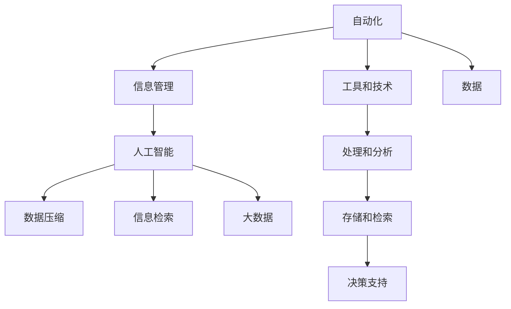

                 

# 信息简化的工具和技术：如何自动化你的信息管理

> 关键词：自动化, 信息管理, 人工智能, 数据压缩, 机器学习, 信息检索, 大数据

## 1. 背景介绍

在当今信息爆炸的时代，个人和企业面临着海量信息的挑战。如何有效地管理和利用这些信息，成为了一个重要的课题。信息管理不仅是组织工作的基础，更是提升工作效率和决策质量的关键。本文将探讨如何利用自动化工具和技术，简化信息管理过程，提升信息管理的效率和效果。

## 2. 核心概念与联系

### 2.1 核心概念概述

为更好地理解自动化信息管理，我们需要先了解几个核心概念：

- **自动化(Automation)**：利用计算机程序和软件工具，自动完成重复性、常规性的任务。
- **信息管理(Information Management)**：对信息进行收集、存储、组织、检索和利用，以支持决策和业务流程。
- **人工智能(AI)**：通过机器学习、自然语言处理等技术，实现信息管理自动化。
- **数据压缩(Data Compression)**：通过算法减少数据量，提高存储和传输效率。
- **信息检索(Information Retrieval)**：从大量数据中检索出与查询相关的信息。
- **大数据(Big Data)**：涉及大量数据的处理和分析，以支持复杂决策和业务需求。

这些概念之间存在紧密的联系：
- **自动化**是实现信息管理的核心手段，通过自动化工具和技术，信息管理能够更高效地进行。
- **信息管理**是自动化的目标，通过信息管理，提升决策和业务流程的效率和效果。
- **人工智能**提供了自动化的技术手段，通过机器学习和自然语言处理，实现信息管理的自动化。
- **数据压缩**是信息管理的基础，通过减少数据量，提高存储和传输效率。
- **信息检索**是信息管理的核心功能，通过检索相关数据，支持决策和业务需求。
- **大数据**是信息管理的背景，通过处理和分析大量数据，实现更精准的决策和业务支持。

这些概念共同构成了信息管理的自动化过程，通过它们之间的联系，我们可以更好地理解信息管理的自动化技术。

### 2.2 核心概念原理和架构的 Mermaid 流程图



这个流程图展示了自动化在信息管理中的应用，以及相关技术和概念之间的联系。

## 3. 核心算法原理 & 具体操作步骤

### 3.1 算法原理概述

信息管理自动化通常涉及以下几个核心算法：

- **机器学习算法**：通过训练模型，从大量数据中学习规律，支持信息检索和分类。
- **自然语言处理(NLP)**：处理文本数据，支持信息检索、信息摘要和问答系统等。
- **数据压缩算法**：减少数据量，提高存储和传输效率。
- **信息检索算法**：从大量数据中检索出与查询相关的信息。

这些算法共同构成了信息管理的自动化技术基础。

### 3.2 算法步骤详解

#### 3.2.1 数据收集与预处理

数据收集是信息管理的第一步，涉及到从不同来源获取数据，并进行清洗和预处理。常用的数据来源包括：

- 结构化数据：如数据库、电子表格等。
- 半结构化数据：如XML、JSON等。
- 非结构化数据：如文本、图片、视频等。

预处理包括数据清洗、去重、格式化等操作，确保数据的准确性和一致性。

#### 3.2.2 数据存储与组织

数据存储是信息管理的核心部分，涉及到数据的长期保存和快速访问。常用的存储方式包括：

- 数据库：如关系数据库、NoSQL数据库等。
- 文件系统：如HDFS、S3等。
- 数据仓库：如Google BigQuery、Amazon Redshift等。

数据组织涉及数据的分类、索引和搜索。通过合理的数据组织方式，可以快速检索到所需信息。

#### 3.2.3 信息检索与分类

信息检索是信息管理的核心功能，涉及到从大量数据中检索出与查询相关的信息。常用的检索方式包括：

- 文本检索：如布尔检索、向量空间模型等。
- 语义检索：如Word2Vec、BERT等。
- 自然语言查询：如SQL、NLQ等。

信息分类涉及到将数据分门别类，便于管理和检索。常用的分类方式包括：

- 规则分类：如决策树、朴素贝叶斯等。
- 机器学习分类：如支持向量机、随机森林等。
- 深度学习分类：如卷积神经网络、循环神经网络等。

#### 3.2.4 信息摘要与展示

信息摘要是将大量信息简化成简明扼要的概述。常用的摘要方式包括：

- 关键词提取：如TF-IDF、TextRank等。
- 句法摘要：如TextRank、GraphRank等。
- 语义摘要：如BERT、T5等。

信息展示是将处理后的信息呈现给用户。常用的展示方式包括：

- 仪表盘：如Tableau、PowerBI等。
- 报表：如Jupyter Notebook、Pandas等。
- 可视化：如Matplotlib、D3.js等。

### 3.3 算法优缺点

#### 3.3.1 优点

- **高效性**：通过自动化工具和技术，可以大大提高信息管理的效率，减少人工操作的时间和成本。
- **准确性**：自动化算法和工具可以确保信息处理和检索的准确性，减少人为错误。
- **可扩展性**：自动化系统可以轻松扩展，支持更大规模的数据处理和存储。
- **灵活性**：自动化系统可以根据需求进行配置和调整，灵活应对不同场景。

#### 3.3.2 缺点

- **初始成本高**：自动化系统需要初始的投资和部署，包括硬件、软件和数据准备等。
- **技术门槛高**：需要具备一定的技术背景和知识，才能进行自动化系统的设计和维护。
- **数据隐私和安全**：自动化系统涉及到大量数据的处理和存储，需要保证数据的安全和隐私。

### 3.4 算法应用领域

信息管理自动化在多个领域都有广泛的应用：

- **企业信息化**：通过自动化工具和技术，提升企业决策和业务流程的效率和效果。
- **政府数字化**：通过自动化系统，支持政府数据的存储、管理和分析，提高公共服务的效率。
- **教育信息化**：通过自动化工具和技术，支持教学资源的管理和学生学习的数据分析。
- **医疗信息化**：通过自动化系统，支持医疗数据的存储、管理和分析，提升医疗服务的质量和效率。
- **金融信息化**：通过自动化系统，支持金融数据的存储、管理和分析，提升金融决策的效率和效果。

## 4. 数学模型和公式 & 详细讲解 & 举例说明

### 4.1 数学模型构建

信息管理自动化通常涉及以下几个数学模型：

- **决策树模型**：用于分类和决策，通过树形结构表示决策规则。
- **支持向量机(SVM)**：用于分类和回归，通过超平面将数据分开。
- **随机森林**：用于分类和回归，通过多个决策树的集成提高准确性。
- **卷积神经网络(CNN)**：用于图像处理，通过卷积和池化操作提取特征。
- **循环神经网络(RNN)**：用于序列数据处理，通过循环结构处理时间序列数据。
- **长短期记忆网络(LSTM)**：用于处理序列数据，通过门控机制控制信息流动。

### 4.2 公式推导过程

#### 4.2.1 决策树模型

决策树模型通过树形结构表示决策规则，常用的决策树算法包括ID3、C4.5和CART等。决策树的构建过程包括：

- 选择一个最佳特征进行分裂。
- 根据特征将数据分成不同的子集。
- 对子集递归构建决策树。

公式推导如下：

$$
\text{Decision Tree} = \bigcup_{i=1}^n T_i
$$

其中 $T_i$ 为第 $i$ 个决策树的子树。

#### 4.2.2 支持向量机(SVM)

支持向量机通过超平面将数据分开，常用的SVM算法包括线性SVM和非线性SVM等。SVM的构建过程包括：

- 选择一个最优超平面将数据分开。
- 通过核函数处理非线性数据。
- 优化目标函数找到最优超平面。

公式推导如下：

$$
\text{SVM} = \arg\min_{w,b,\sigma} \frac{1}{2}||w||^2 + C\sum_{i=1}^n \sigma_i
$$

其中 $w$ 为超平面的法向量，$b$ 为偏置，$\sigma_i$ 为误分类点的标签。

#### 4.2.3 卷积神经网络(CNN)

卷积神经网络通过卷积和池化操作提取特征，常用的CNN算法包括LeNet、AlexNet和VGG等。CNN的构建过程包括：

- 卷积层提取特征。
- 池化层减小特征图的大小。
- 全连接层进行分类。

公式推导如下：

$$
\text{CNN} = \bigcup_{i=1}^n L_i
$$

其中 $L_i$ 为第 $i$ 个卷积层的特征图。

### 4.3 案例分析与讲解

#### 4.3.1 决策树案例

假设我们要对公司的客户进行分类，根据他们的购买历史和基本信息，分为高价值客户和普通客户。我们可以使用决策树模型进行分类。

首先，选择最佳特征进行分裂，如客户的消费金额和购买频率。然后，根据特征将数据分成不同的子集，如消费金额大于1000的客户和消费金额小于1000的客户。对子集递归构建决策树，最终得到如下决策树：

```
Tree 1 (购买金额 > 1000)
Tree 2 (购买金额 < 1000)
```

#### 4.3.2 SVM案例

假设我们要对房屋价格进行预测，根据房屋面积、地理位置和装修程度等特征。我们可以使用SVM模型进行回归。

首先，选择一个最优超平面将数据分开，如使用线性SVM。然后，通过核函数处理非线性数据，如高斯核。最后，优化目标函数找到最优超平面，如使用梯度下降法。

```python
from sklearn.svm import SVR
from sklearn.preprocessing import StandardScaler
from sklearn.pipeline import Pipeline

# 数据预处理
scaler = StandardScaler()
X = scaler.fit_transform(X_train)
y = y_train

# SVM模型训练
svm = SVR(kernel='rbf', C=1e-3, epsilon=0.1)
svm.fit(X_train, y_train)

# 数据预测
y_pred = svm.predict(X_test)
```

## 5. 项目实践：代码实例和详细解释说明

### 5.1 开发环境搭建

在进行信息管理自动化实践前，我们需要准备好开发环境。以下是使用Python进行PyTorch开发的环境配置流程：

1. 安装Anaconda：从官网下载并安装Anaconda，用于创建独立的Python环境。

2. 创建并激活虚拟环境：
```bash
conda create -n info-env python=3.8 
conda activate info-env
```

3. 安装PyTorch：根据CUDA版本，从官网获取对应的安装命令。例如：
```bash
conda install pytorch torchvision torchaudio cudatoolkit=11.1 -c pytorch -c conda-forge
```

4. 安装Pandas、NumPy、Scikit-Learn等常用库：
```bash
pip install pandas numpy scikit-learn matplotlib
```

5. 安装Jupyter Notebook：
```bash
pip install jupyter notebook
```

完成上述步骤后，即可在`info-env`环境中开始信息管理自动化实践。

### 5.2 源代码详细实现

这里我们以信息检索系统为例，给出使用Python进行信息检索的代码实现。

首先，定义数据处理函数：

```python
import pandas as pd
from sklearn.feature_extraction.text import TfidfVectorizer
from sklearn.metrics.pairwise import cosine_similarity

# 读取数据
df = pd.read_csv('data.csv')

# 数据预处理
df['text'] = df['text'].apply(lambda x: x.lower())
df['text'] = df['text'].str.replace('[^\w\s]', '')

# 文本向量表示
vectorizer = TfidfVectorizer()
X = vectorizer.fit_transform(df['text'])

# 相似度计算
similarity_matrix = cosine_similarity(X)
```

然后，定义信息检索函数：

```python
import numpy as np

# 信息检索函数
def search(query, threshold=0.8):
    # 构建查询向量
    query_vector = vectorizer.transform([query])
    similarity = cosine_similarity(query_vector, X)
    
    # 返回相似度大于阈值的文档
    top_results = np.argsort(similarity, axis=0)[::-1]
    top_results = top_results[top_results > threshold]
    
    return df.iloc[top_results].index.tolist()
```

最后，启动信息检索流程：

```python
# 检索相关文档
query = 'data science'
top_documents = search(query)
print(top_documents)
```

以上就是使用Python进行信息检索系统的完整代码实现。可以看到，利用Python和Scikit-Learn库，我们可以方便地进行文本向量化和相似度计算，实现信息检索功能。

### 5.3 代码解读与分析

让我们再详细解读一下关键代码的实现细节：

**数据处理函数**：
- 读取CSV格式的数据文件。
- 对文本数据进行预处理，包括转换为小写字母和去除非字母字符。
- 使用TF-IDF向量化器对文本数据进行向量化处理。

**信息检索函数**：
- 对查询文本进行向量化处理。
- 计算查询文本与数据集的相似度矩阵。
- 根据相似度矩阵，返回与查询文本相似度大于阈值的文档ID。

**信息检索流程**：
- 定义查询文本。
- 调用信息检索函数，返回相关文档。
- 输出相关文档的ID。

可以看到，通过Python和Scikit-Learn库，我们可以高效地实现信息检索功能。但如果要实现更复杂的信息管理自动化系统，还需要考虑数据清洗、数据存储、数据可视化等环节，以及选择合适的算法和工具。

## 6. 实际应用场景

### 6.1 企业知识管理

企业知识管理是信息管理自动化的一个重要应用场景。通过自动化工具和技术，企业可以将内部和外部的知识进行收集、整理和存储，支持员工的搜索和学习。

常用的企业知识管理系统包括：

- 文档管理系统：如SharePoint、Google Drive等。
- 知识库管理系统：如Confluence、Notion等。
- 智能搜索系统：如Elasticsearch、Solr等。

这些系统通过自动化工具和技术，可以实现文档的自动分类、索引和检索，支持员工的快速搜索和知识共享。

### 6.2 医疗信息管理

医疗信息管理是信息管理自动化的另一个重要应用场景。通过自动化工具和技术，医院可以将患者数据、医疗记录和研究数据进行收集、整理和存储，支持医生的决策和科研。

常用的医疗信息管理系统包括：

- 电子病历系统：如Cerner、Epic等。
- 医学研究平台：如PubMed、PubMed Central等。
- 医疗数据仓库：如Google BigQuery、Amazon Redshift等。

这些系统通过自动化工具和技术，可以实现医疗数据的自动清洗、分类和检索，支持医生的诊断和治疗，提升医疗服务的质量和效率。

### 6.3 金融信息管理

金融信息管理是信息管理自动化的重要应用场景之一。通过自动化工具和技术，金融机构可以将交易数据、市场数据和研究数据进行收集、整理和存储，支持投资决策和风险管理。

常用的金融信息管理系统包括：

- 交易系统：如Bloomberg、Reuters等。
- 数据仓库：如Snowflake、Amazon Redshift等。
- 数据分析平台：如Tableau、PowerBI等。

这些系统通过自动化工具和技术，可以实现金融数据的自动清洗、分类和分析，支持投资决策和风险管理，提升金融服务的效率和效果。

### 6.4 未来应用展望

随着信息管理自动化技术的不断发展，未来将有以下几个主要趋势：

- **云计算**：越来越多的信息管理系统将部署在云端，提高数据的存储和处理效率。
- **人工智能**：通过机器学习和自然语言处理等技术，实现信息管理的自动化和智能化。
- **大数据分析**：利用大数据技术，对海量数据进行分析和挖掘，支持复杂决策和业务需求。
- **边缘计算**：通过边缘计算技术，支持本地数据处理和分析，提升数据处理的实时性。
- **物联网(IoT)**：通过物联网技术，实现设备数据的自动收集和分析，支持智能决策和业务流程。

这些趋势将推动信息管理自动化技术向更加高效、智能和实时性的方向发展，提升企业和社会的运营效率和决策质量。

## 7. 工具和资源推荐

### 7.1 学习资源推荐

为了帮助开发者系统掌握信息管理自动化的理论基础和实践技巧，这里推荐一些优质的学习资源：

1. **Python基础教程**：《Python编程：从入门到实践》，张志华著。
2. **数据科学教程**：《Python数据科学手册》，Jake VanderPlas著。
3. **机器学习教程**：《机器学习实战》，Peter Harrington著。
4. **深度学习教程**：《深度学习》，Ian Goodfellow、Yoshua Bengio、Aaron Courville著。
5. **自然语言处理教程**：《自然语言处理综论》，Daniel Jurafsky、James H. Martin著。

这些书籍和教程涵盖了从Python基础到深度学习、自然语言处理等核心技术，适合不同层次的开发者阅读和学习。

### 7.2 开发工具推荐

为了提高信息管理自动化系统的开发效率，以下是几款常用的开发工具：

1. **Jupyter Notebook**：基于Python的交互式开发环境，支持代码编写和数据分析。
2. **PyTorch**：基于Python的深度学习框架，支持灵活的模型设计和训练。
3. **TensorFlow**：基于Python的深度学习框架，支持分布式计算和部署。
4. **Scikit-Learn**：基于Python的机器学习库，支持快速原型开发和模型评估。
5. **NLTK**：基于Python的自然语言处理库，支持文本分析和处理。

这些工具和库可以帮助开发者快速构建信息管理自动化系统，支持数据处理、模型训练和系统部署等各个环节。

### 7.3 相关论文推荐

信息管理自动化的发展离不开学界的持续研究。以下是几篇奠基性的相关论文，推荐阅读：

1. **信息检索与自然语言处理**：《现代信息检索》，Christopher Manning、Prabhakar Raghavan、Hinrich Schütze著。
2. **文本压缩与数据存储**：《文本压缩技术》，Richard L. Georghiades、E. Grüter、P. Sabes著。
3. **机器学习与决策树**：《机器学习》，Tom Mitchell著。
4. **支持向量机与数据分类**：《支持向量机理论基础》，Wladimir Zliobaite著。
5. **卷积神经网络与图像处理**：《深度学习》，Ian Goodfellow、Yoshua Bengio、Aaron Courville著。

这些论文代表了大数据、信息检索和机器学习等领域的研究进展，对理解信息管理自动化的技术基础具有重要意义。

## 8. 总结：未来发展趋势与挑战

### 8.1 研究成果总结

信息管理自动化技术经过多年的发展，已经取得了显著的进展。其主要成果包括：

- 自动化工具和技术在各个领域得到了广泛应用，提升了数据处理的效率和效果。
- 机器学习和大数据技术的应用，使得信息管理自动化变得更加智能和高效。
- 自然语言处理技术的进步，使得信息检索和文本处理变得更加精准和便捷。

### 8.2 未来发展趋势

展望未来，信息管理自动化技术将有以下几个主要趋势：

1. **云计算和边缘计算**：随着云计算技术的不断成熟，越来越多的信息管理系统将部署在云端，提高数据的存储和处理效率。同时，边缘计算技术的发展，将支持本地数据处理和分析，提升数据处理的实时性。
2. **人工智能和大数据分析**：通过机器学习和自然语言处理等技术，实现信息管理的自动化和智能化。大数据技术的应用，将支持复杂决策和业务需求，提升信息管理的深度和广度。
3. **物联网(IoT)**：通过物联网技术，实现设备数据的自动收集和分析，支持智能决策和业务流程，提升信息管理的实时性和智能化水平。
4. **人机协同**：结合人工智能和人类的智慧，构建人机协同的智能系统，提升信息管理的效率和效果。

### 8.3 面临的挑战

尽管信息管理自动化技术取得了显著进展，但在迈向更加智能化、普适化应用的过程中，仍面临诸多挑战：

1. **数据隐私和安全**：信息管理自动化涉及大量数据的处理和存储，需要保证数据的安全和隐私。
2. **技术门槛高**：信息管理自动化需要具备一定的技术背景和知识，才能进行自动化系统的设计和维护。
3. **资源消耗大**：大规模数据处理和存储需要高性能硬件设备，资源消耗较大。
4. **模型可解释性不足**：许多自动化系统是"黑盒"系统，难以解释其内部工作机制和决策逻辑。
5. **实时性不足**：信息管理自动化系统需要快速处理和分析数据，提升实时性是重要挑战。

### 8.4 研究展望

未来的信息管理自动化研究需要在以下几个方面进行探索：

1. **大数据和人工智能结合**：结合大数据分析和人工智能技术，实现更加智能和高效的信息管理。
2. **可解释性研究**：提高自动化系统的可解释性，增强系统的透明性和可信度。
3. **实时性优化**：提升信息管理自动化系统的实时性，支持实时数据处理和分析。
4. **跨领域应用**：将信息管理自动化技术应用于更多领域，提升各个领域的运营效率和决策质量。
5. **边缘计算和云计算结合**：结合边缘计算和云计算技术，实现分布式数据处理和存储，提升系统的可扩展性和可靠性。

这些方向的研究将推动信息管理自动化技术向更加高效、智能和实时性的方向发展，为企业的数字化转型和社会的智能化建设提供有力支持。

## 9. 附录：常见问题与解答

**Q1：信息管理自动化是否适用于所有领域？**

A: 信息管理自动化在大多数领域都有广泛的应用，特别是在数据驱动的行业如金融、医疗、零售等。但对于一些依赖人工判断和决策的领域，如法律、咨询等，信息管理自动化仍然面临一些挑战。

**Q2：如何选择合适的自动化工具？**

A: 选择合适的自动化工具需要考虑多个因素，包括数据规模、处理需求、技术栈和预算等。一般来说，需要综合评估不同工具的性能、易用性和可扩展性，选择最适合当前需求的自动化工具。

**Q3：如何进行数据清洗和预处理？**

A: 数据清洗和预处理是信息管理自动化的重要环节，需要考虑数据的多样性和复杂性。常用的数据清洗和预处理技术包括数据去重、格式转换、文本清洗和缺失值处理等。

**Q4：如何保证数据隐私和安全？**

A: 数据隐私和安全是信息管理自动化的重要考虑因素，需要采取多种措施进行保护。常用的方法包括数据加密、访问控制、数据匿名化和审计日志等。

**Q5：如何进行实时性优化？**

A: 实时性优化是信息管理自动化的一个重要挑战，需要优化数据处理和存储的效率，减少延迟和延迟抖动。常用的方法包括缓存机制、分布式计算和负载均衡等。

---

作者：禅与计算机程序设计艺术 / Zen and the Art of Computer Programming

