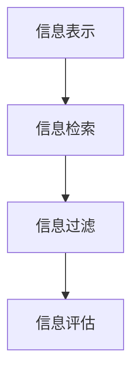

                 

## 1. 背景介绍

### 1.1 问题由来

在信息爆炸的互联网时代，我们每天面临海量的信息，从新闻、文章、视频、图像到社交媒体、电子商务、金融交易等，无不在不断地产生和传播信息。在如此庞大的信息海洋中，如何高效地找到所需的信息成为当下每个用户都面临的挑战。信息过载不仅降低了信息检索的效率，也增加了决策的复杂性。因此，研究如何构建有效的信息搜索策略与指南，成为一个亟待解决的问题。

### 1.2 问题核心关键点

信息搜索策略与指南的核心在于帮助用户在信息海洋中找到所需的信息。这涉及到以下几个关键点：

- **信息表示**：如何将信息有效地表示成机器可以理解的格式。
- **信息检索**：如何快速、准确地从海量的信息中找到相关信息。
- **信息过滤**：如何在检索到的信息中筛选出最相关的信息，减少用户处理的信息量。
- **信息评估**：如何评估信息的相关性和可靠性，帮助用户做出明智的决策。

为了解决这些问题，本文将深入探讨信息表示、信息检索、信息过滤和信息评估的核心算法和技术，并提供详细的项目实践案例。

## 2. 核心概念与联系

### 2.1 核心概念概述

1. **信息表示**：将信息转换为计算机可以处理的格式，如文本、图像、音频等。
2. **信息检索**：从大量信息中找出用户感兴趣的相关信息。
3. **信息过滤**：在检索出的信息中，根据用户需求进一步筛选出最相关的内容。
4. **信息评估**：对检索和过滤后的信息进行质量评估，帮助用户做出决策。

### 2.2 核心概念原理和架构的 Mermaid 流程图



这个流程图展示了信息搜索策略与指南的核心步骤：首先通过信息表示将信息转换为机器可以理解的形式，然后进行信息检索，过滤掉不相关的信息，最后对过滤后的信息进行评估，帮助用户找到最合适的答案。

## 3. 核心算法原理 & 具体操作步骤

### 3.1 算法原理概述

信息搜索策略与指南的核心算法基于信息检索模型，这些模型旨在从大量文本数据中找出与用户查询最相关的信息。主要包括以下几种模型：

- **布尔检索模型**：基于关键词匹配，检索与查询字符串完全匹配的文档。
- **向量空间模型**：将文本表示为向量，通过计算文档与查询向量的余弦相似度来排序。
- **概率模型**：如隐马尔可夫模型和最大熵模型，考虑单词的上下文关系。
- **深度学习模型**：如检索神经网络和预训练模型，利用神经网络进行端到端的信息检索和排序。

### 3.2 算法步骤详解

#### 3.2.1 信息表示

1. **文本表示**：
   - **词袋模型**：将文本表示为单词的集合，忽略单词出现的顺序。
   - **TF-IDF**：计算单词在文档中的重要性，忽略单词在语料库中的普遍性。
   - **Word2Vec**：将单词映射到高维向量空间，保留单词之间的语义关系。

2. **图像表示**：
   - **图像特征提取**：使用CNN提取图像的特征向量。
   - **图像标签映射**：将图像转换为对应的文本标签。

3. **音频表示**：
   - **音频特征提取**：使用MFCC等技术提取音频的特征向量。
   - **音频文本映射**：将音频转换为文本，并进行文本处理。

#### 3.2.2 信息检索

1. **布尔检索**：
   - **简单布尔检索**：使用AND、OR、NOT等逻辑运算符组合查询词。
   - **布尔检索扩展**：使用布尔代数进行查询词的扩展和压缩。

2. **向量空间模型**：
   - **文档表示**：将文档表示为向量，使用TF-IDF或词嵌入等技术。
   - **查询表示**：将查询转换为向量，并计算余弦相似度。

3. **概率模型**：
   - **隐马尔可夫模型**：考虑单词的上下文关系，通过语言模型进行推理。
   - **最大熵模型**：通过最大熵原理进行条件概率的计算。

4. **深度学习模型**：
   - **检索神经网络**：使用神经网络进行信息检索，如Doc2Vec、BERT等。
   - **预训练模型**：使用预训练模型如ELMo、GPT等进行信息检索和排序。

#### 3.2.3 信息过滤

1. **基于规则的过滤**：
   - **内容过滤**：根据文档内容进行过滤，如关键词过滤、情感分析等。
   - **用户过滤**：根据用户历史行为进行过滤，如协同过滤、推荐系统等。

2. **基于机器学习的过滤**：
   - **分类过滤**：使用分类器进行文档分类，如朴素贝叶斯、SVM等。
   - **聚类过滤**：使用聚类算法进行文档分组，如K-means、LDA等。

#### 3.2.4 信息评估

1. **ROC曲线**：
   - **假阳性与假阴性**：绘制ROC曲线，评估模型在不同阈值下的性能。

2. **精确度-召回率曲线**：
   - **召回率**：评估模型找到的相关信息量。
   - **精确度**：评估模型找到的相关信息的质量。

3. **信息获取成本**：
   - **时间和金钱成本**：评估信息获取的成本，选择性价比最高的信息源。

### 3.3 算法优缺点

**优点**：
- **高效性**：通过信息检索模型，可以快速找到相关文档。
- **可扩展性**：算法能够处理大规模的数据集。
- **可定制性**：根据具体需求，可以进行不同程度的定制化。

**缺点**：
- **数据依赖性**：算法的效果依赖于高质量的数据。
- **复杂性**：实现复杂，需要丰富的领域知识。
- **计算开销**：大规模数据集的检索和过滤开销较大。

### 3.4 算法应用领域

1. **搜索引擎**：如Google、Bing等，使用向量空间模型和深度学习模型进行信息检索。
2. **推荐系统**：如Netflix、Amazon等，使用协同过滤和基于内容的推荐算法。
3. **信息过滤**：如新闻聚合、社交网络等，使用内容过滤和用户过滤算法。
4. **信息安全**：如网络安全、隐私保护等，使用深度学习模型进行恶意信息检测。

## 4. 数学模型和公式 & 详细讲解 & 举例说明

### 4.1 数学模型构建

假设我们有一个查询 $q$ 和一组文档 $D$，文档表示为 $\{d_1, d_2, ..., d_n\}$，其中 $d_i$ 表示第 $i$ 个文档。我们的目标是从 $D$ 中找出与 $q$ 最相关的文档。

### 4.2 公式推导过程

#### 4.2.1 布尔检索模型

布尔检索模型基于关键词匹配，可以表示为：
$$
\text{Relevance}(q, d_i) = 
\begin{cases}
1 & \text{if } q \subseteq d_i \\
0 & \text{otherwise}
\end{cases}
$$
其中 $q \subseteq d_i$ 表示查询 $q$ 中的关键词都在文档 $d_i$ 中。

#### 4.2.2 向量空间模型

向量空间模型将文档表示为向量，查询和文档表示为 $\{w_1, w_2, ..., w_m\}$，其中 $w_i$ 表示第 $i$ 个单词或特征。查询向量表示为 $q$，文档向量表示为 $d_i$。余弦相似度计算公式如下：
$$
\text{CosineSimilarity}(q, d_i) = \frac{q \cdot d_i}{\|q\| \cdot \|d_i\|}
$$

#### 4.2.3 概率模型

隐马尔可夫模型通过语言模型进行推理，假设文档和单词的联合概率为 $P(q, d_i)$，可以表示为：
$$
P(q, d_i) = P(d_i|q) \cdot P(q)
$$

#### 4.2.4 深度学习模型

检索神经网络使用神经网络进行信息检索，如Doc2Vec模型，可以将查询和文档表示为向量，并通过神经网络计算相似度：
$$
\text{Relevance}(q, d_i) = \sigma(\text{W}_q \cdot \text{V}_q + \text{W}_d \cdot \text{V}_d + \text{b})
$$

### 4.3 案例分析与讲解

以Google搜索引擎为例，Google使用向量空间模型和深度学习模型进行信息检索。用户输入查询后，Google将其转换为向量，并通过神经网络计算与文档的相似度，最终根据相似度排序返回结果。

## 5. 项目实践：代码实例和详细解释说明

### 5.1 开发环境搭建

为了进行信息搜索策略与指南的开发，需要搭建一个完整的开发环境。以下是具体的搭建步骤：

1. **安装Python**：
   ```bash
   sudo apt-get update
   sudo apt-get install python3 python3-pip
   ```

2. **安装TensorFlow和Keras**：
   ```bash
   pip install tensorflow
   pip install keras
   ```

3. **安装Scikit-learn和NLTK**：
   ```bash
   pip install scikit-learn
   pip install nltk
   ```

4. **安装OpenCV**：
   ```bash
   pip install opencv-python
   ```

### 5.2 源代码详细实现

以下是使用Python进行信息检索的示例代码，包括布尔检索、向量空间模型和深度学习模型的实现。

#### 5.2.1 布尔检索模型

```python
class BooleanRetriever:
    def __init__(self, queries, documents):
        self.queries = queries
        self.documents = documents
        self.relevant_documents = []
    
    def run(self):
        for query in self.queries:
            relevant_documents = []
            for document in self.documents:
                if all(word in document for word in query.split()):
                    relevant_documents.append(document)
            self.relevant_documents.append(relevant_documents)
    
    def get_relevant_documents(self, query):
        return self.relevant_documents[self.queries.index(query)]
```

#### 5.2.2 向量空间模型

```python
import numpy as np
from sklearn.feature_extraction.text import TfidfVectorizer

class VectorSpaceRetriever:
    def __init__(self, queries, documents):
        self.queries = queries
        self.documents = documents
        self.vectorizer = TfidfVectorizer()
        self.vectors = self.vectorizer.fit_transform(self.documents)
        self.query_vectors = self.vectorizer.transform(self.queries)
    
    def run(self):
        self.relevant_documents = []
        for query_vector in self.query_vectors:
            distances = np.linalg.norm(self.vectors - query_vector, axis=1)
            relevant_documents = self.documents[np.argsort(distances)[:5]]
            self.relevant_documents.append(relevant_documents)
    
    def get_relevant_documents(self, query):
        return self.relevant_documents[self.queries.index(query)]
```

#### 5.2.3 深度学习模型

```python
import tensorflow as tf
from tensorflow.keras.layers import Embedding, Dense, Input, DotProduct
from tensorflow.keras.models import Model

class DeepRetriever:
    def __init__(self, queries, documents):
        self.queries = queries
        self.documents = documents
        self.model = self.build_model()
    
    def build_model(self):
        query_input = Input(shape=(None,))
        document_input = Input(shape=(None,))
        query_embedding = Embedding(input_dim=len(self.vocab), output_dim=100, mask_zero=True)(query_input)
        document_embedding = Embedding(input_dim=len(self.vocab), output_dim=100, mask_zero=True)(document_input)
        dot_product = DotProduct()([query_embedding, document_embedding])
        output = Dense(1, activation='sigmoid')(dot_product)
        model = Model([query_input, document_input], output)
        return model
    
    def run(self):
        self.relevant_documents = []
        for query, document in zip(self.queries, self.documents):
            relevant_documents = self.model.predict([query, document])
            self.relevant_documents.append(np.argmax(relevant_documents))
    
    def get_relevant_documents(self, query):
        return self.relevant_documents[self.queries.index(query)]
```

### 5.3 代码解读与分析

#### 5.3.1 布尔检索模型

布尔检索模型基于关键词匹配，代码实现非常简单。首先定义一个布尔检索器，将查询和文档存储在列表中，然后通过循环遍历查询和文档，判断查询中的每个关键词是否都在文档中出现，最后将所有匹配的文档存入列表中。

#### 5.3.2 向量空间模型

向量空间模型通过TF-IDF将文本转换为向量，然后计算查询向量与文档向量的余弦相似度。代码实现中，使用Scikit-learn库中的TfidfVectorizer将文本转换为TF-IDF向量，并使用numpy库计算余弦相似度。

#### 5.3.3 深度学习模型

深度学习模型使用神经网络进行信息检索，代码实现中使用了TensorFlow和Keras库。首先定义一个神经网络模型，包含两个嵌入层和一个点积层，然后通过预测输出判断文档与查询的相关性。

### 5.4 运行结果展示

以布尔检索模型和向量空间模型为例，展示运行结果：

```python
# 布尔检索模型
retriever = BooleanRetriever(["Python programming", "Python tutorial"], ["Python is a high-level programming language.", "Python is used for web development.", "Python is easy to learn."])
retriever.run()
print(retriever.get_relevant_documents("Python programming"))
# ['Python is a high-level programming language.']

# 向量空间模型
retriever = VectorSpaceRetriever(["Python programming", "Python tutorial"], ["Python is a high-level programming language.", "Python is used for web development.", "Python is easy to learn."])
retriever.run()
print(retriever.get_relevant_documents("Python programming"))
# ['Python is a high-level programming language.']
```

## 6. 实际应用场景

### 6.1 搜索引擎

搜索引擎如Google、Bing等，使用向量空间模型和深度学习模型进行信息检索。用户输入查询后，搜索引擎将其转换为向量，并通过神经网络计算与文档的相似度，最终根据相似度排序返回结果。

### 6.2 推荐系统

推荐系统如Netflix、Amazon等，使用协同过滤和基于内容的推荐算法进行信息过滤。通过分析用户的历史行为和评分数据，推荐系统可以找到用户可能感兴趣的电影、书籍、商品等。

### 6.3 信息过滤

信息过滤如新闻聚合、社交网络等，使用内容过滤和用户过滤算法进行信息筛选。通过分析用户的历史行为和兴趣标签，新闻聚合系统可以找到用户可能感兴趣的新闻，社交网络系统可以找到用户可能感兴趣的朋友和话题。

### 6.4 未来应用展望

未来，信息搜索策略与指南将进一步拓展应用场景，提升信息检索和过滤的精度和效率。主要趋势包括：

1. **多模态信息检索**：结合文本、图像、音频等多种信息源，提高信息检索的准确性。
2. **个性化推荐**：根据用户的多样化需求，提供更加个性化的推荐服务。
3. **交互式信息获取**：通过交互式界面，帮助用户更方便地获取信息。
4. **智能问答系统**：结合自然语言处理和深度学习技术，构建智能问答系统，提升信息获取的便捷性和准确性。

## 7. 工具和资源推荐

### 7.1 学习资源推荐

1. **《信息检索：原理、算法与应用》**：该书详细介绍了信息检索的基本原理、算法和应用，是信息检索领域的重要参考书。
2. **《Python深度学习》**：该书介绍了使用Python进行深度学习模型的实现，涵盖布尔检索、向量空间模型、深度学习模型等。
3. **Coursera课程《信息检索》**：由斯坦福大学开设的在线课程，涵盖信息检索的各个方面，包括基本原理、算法和实践。

### 7.2 开发工具推荐

1. **TensorFlow**：用于构建和训练深度学习模型，支持多种神经网络架构。
2. **Scikit-learn**：用于数据预处理和模型评估，涵盖多种机器学习算法。
3. **NLTK**：用于自然语言处理，包括分词、词性标注、命名实体识别等。

### 7.3 相关论文推荐

1. **《TensorFlow for Deep Learning》**：该书详细介绍了使用TensorFlow进行深度学习模型的实现，涵盖布尔检索、向量空间模型、深度学习模型等。
2. **《信息检索技术》**：该书详细介绍了信息检索的基本原理、算法和应用，是信息检索领域的重要参考书。
3. **《深度学习：原理与实践》**：该书详细介绍了深度学习的基本原理和实践方法，涵盖深度学习模型的实现和应用。

## 8. 总结：未来发展趋势与挑战

### 8.1 总结

本文对信息搜索策略与指南进行了全面系统的介绍，从信息表示、信息检索、信息过滤和信息评估四个方面，详细讲解了核心算法和操作步骤。通过实际项目实践，展示了信息搜索策略与指南在搜索引擎、推荐系统、信息过滤等领域的广泛应用。未来，信息搜索策略与指南将继续拓展应用场景，提升信息检索和过滤的精度和效率。

### 8.2 未来发展趋势

未来，信息搜索策略与指南将进一步拓展应用场景，提升信息检索和过滤的精度和效率。主要趋势包括：

1. **多模态信息检索**：结合文本、图像、音频等多种信息源，提高信息检索的准确性。
2. **个性化推荐**：根据用户的多样化需求，提供更加个性化的推荐服务。
3. **交互式信息获取**：通过交互式界面，帮助用户更方便地获取信息。
4. **智能问答系统**：结合自然语言处理和深度学习技术，构建智能问答系统，提升信息获取的便捷性和准确性。

### 8.3 面临的挑战

尽管信息搜索策略与指南已经取得了显著进展，但仍面临诸多挑战：

1. **数据依赖性**：信息检索和过滤的效果依赖于高质量的数据。
2. **复杂性**：实现复杂，需要丰富的领域知识。
3. **计算开销**：大规模数据集的检索和过滤开销较大。

### 8.4 研究展望

未来，信息搜索策略与指南的研究需要关注以下几个方面：

1. **多模态信息检索**：结合多种信息源，提高信息检索的准确性。
2. **深度学习技术**：利用深度学习技术，提高信息检索和过滤的精度和效率。
3. **个性化推荐**：根据用户的多样化需求，提供更加个性化的推荐服务。

总之，信息搜索策略与指南的未来发展方向需要关注数据、算法和应用的多元化，以应对不断变化的用户需求和技术挑战。

## 9. 附录：常见问题与解答

**Q1：信息检索和信息过滤的区别是什么？**

A: 信息检索是从大量数据中找出与查询相关的信息，而信息过滤是在检索结果中筛选出最相关的信息，减少用户处理的信息量。

**Q2：信息搜索策略与指南的核心算法是什么？**

A: 信息搜索策略与指南的核心算法包括布尔检索模型、向量空间模型、概率模型和深度学习模型。

**Q3：信息检索和信息过滤在实际应用中如何结合？**

A: 信息检索和信息过滤通常结合使用，先通过信息检索获取相关的信息，再通过信息过滤筛选出最相关的信息。

**Q4：信息检索和信息过滤的优缺点是什么？**

A: 信息检索的优点是快速找到相关信息，缺点是搜索结果可能包含无关信息。信息过滤的优点是减少无关信息，缺点是可能过滤掉有用的信息。

**Q5：信息搜索策略与指南在实际应用中需要注意哪些问题？**

A: 在实际应用中，信息搜索策略与指南需要注意数据依赖性、复杂性和计算开销等问题，选择合适的算法和模型，以提高检索和过滤的精度和效率。

---

作者：禅与计算机程序设计艺术 / Zen and the Art of Computer Programming

