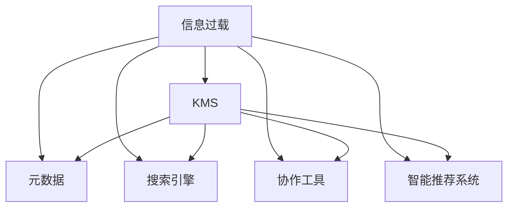

                 

# 信息过载与知识管理系统实施：管理和组织信息以提高生产力

## 1. 背景介绍

随着信息技术的飞速发展，全球数据量呈指数级增长。企业在面对海量信息时，往往面临着数据质量低下、信息过载、知识碎片化、管理混乱等问题。如何有效地管理和组织信息，以提升企业的生产力和竞争力，成为现代企业面临的重要挑战。

信息过载（Information Overload）是指当个人或组织接收的信息量超过其处理能力时，导致决策效率下降、错误率上升、创造力受到抑制等问题。特别是在现代企业中，员工需要处理和分析来自不同渠道的大量信息，如何有效地筛选、整理、使用信息，成为提高企业运营效率的关键。

知识管理系统（Knowledge Management System, KMS）通过整合企业的信息资源，帮助员工快速获取所需知识，优化工作流程，提高决策质量，从而提升企业的整体生产力和市场竞争力。知识管理系统的实施已经成为许多现代企业提升核心竞争力的重要策略。

## 2. 核心概念与联系

### 2.1 核心概念概述

为了更好地理解信息过载和知识管理系统的实施，本节将介绍几个关键的概念：

- **信息过载（Information Overload）**：当个人或组织接收的信息量超过其处理能力时，导致的信息处理效率下降、错误率上升、创造力受到抑制等问题。
- **知识管理系统（Knowledge Management System, KMS）**：通过整合企业的信息资源，帮助员工快速获取所需知识，优化工作流程，提高决策质量，从而提升企业的整体生产力和市场竞争力。
- **元数据（Metadata）**：描述数据的数据，用于标识、描述、管理和搜索数据的信息，是知识管理系统的重要组成部分。
- **搜索引擎（Search Engine）**：通过自然语言查询、标签、分类等方式，帮助用户快速定位信息资源的技术工具。
- **协作工具（Collaboration Tool）**：支持团队成员之间交流、协作、知识共享的平台，如Slack、Microsoft Teams等。
- **智能推荐系统（Recommendation System）**：根据用户的历史行为和偏好，推荐相关内容的技术系统，是知识管理系统中重要的一环。

这些概念之间的逻辑关系可以通过以下Mermaid流程图来展示：



这个流程图展示了一些关键概念之间的联系：

1. 信息过载是知识管理系统的背景问题，需要通过KMS来缓解。
2. 元数据、搜索引擎、协作工具、智能推荐系统都是KMS的核心组成部分，通过它们来提升信息处理效率和知识共享质量。

## 3. 核心算法原理 & 具体操作步骤

### 3.1 算法原理概述

知识管理系统的核心算法原理包括以下几个方面：

- **信息抽取与整合**：从不同的数据源中抽取和整合信息，形成统一的知识库。
- **元数据管理**：为信息资源打上标签、分类，帮助快速搜索、定位和理解。
- **智能推荐**：根据用户的历史行为和偏好，推荐相关内容，提升信息检索效率。
- **协作与知识共享**：支持团队成员之间的交流与协作，促进知识共享和创新。
- **数据分析与可视化**：对知识资源进行统计分析，形成可视化报表和图表，辅助决策。

### 3.2 算法步骤详解

知识管理系统的实施通常包括以下几个关键步骤：

**Step 1: 需求分析与规划**
- 分析企业信息管理现状，确定知识管理系统的目标和范围。
- 确定需要管理的知识类型、数据来源、用户角色等。

**Step 2: 知识库设计与实现**
- 设计知识库的架构，选择合适的数据库和存储技术。
- 实现知识库的数据模型和API接口，方便数据导入和查询。

**Step 3: 元数据管理**
- 定义元数据标准和结构，包括分类、标签、属性等。
- 实现元数据管理模块，对知识库中的信息进行标注和分类。

**Step 4: 搜索引擎与索引**
- 选择适合的搜索引擎技术，如Solr、ElasticSearch等。
- 建立索引，优化查询性能，提升搜索速度。

**Step 5: 智能推荐**
- 实现智能推荐算法，如协同过滤、内容推荐等。
- 根据用户的历史行为和偏好，实时推荐相关内容。

**Step 6: 协作与知识共享**
- 集成协作工具，如Slack、Microsoft Teams等，促进团队交流。
- 实现文档共享、评论、讨论等协作功能。

**Step 7: 数据分析与可视化**
- 实现数据分析模块，对知识库中的数据进行统计分析。
- 使用可视化工具，如Tableau、PowerBI等，生成报表和图表。

**Step 8: 测试与部署**
- 在测试环境中验证知识管理系统的功能和性能。
- 部署到生产环境，配置监控和告警系统。

**Step 9: 维护与优化**
- 定期收集用户反馈，优化知识库和系统功能。
- 根据业务需求的变化，不断迭代和升级知识管理系统。

### 3.3 算法优缺点

知识管理系统的优点：

1. **提升信息检索效率**：通过元数据和搜索引擎，快速定位和检索所需信息。
2. **促进知识共享**：协作工具和智能推荐系统，帮助团队成员共享知识，加速创新。
3. **辅助决策支持**：数据分析和可视化报表，提供数据支持，辅助决策。

知识管理系统的缺点：

1. **初始投入高**：需要投入大量的时间和资金进行需求分析、系统设计和实施。
2. **用户接受度低**：知识管理系统涉及大量的数据和隐私管理，用户接受度可能不高。
3. **维护成本高**：知识库需要不断更新和维护，确保数据准确性和系统稳定性。

### 3.4 算法应用领域

知识管理系统在多个领域得到了广泛的应用，如：

- **金融行业**：支持高频交易、风险管理、市场分析等任务，提高决策效率和风险控制能力。
- **制造业**：优化生产流程、提高设备利用率、管理供应链等，提升企业运营效率。
- **医疗行业**：支持病历管理、医疗影像分析、临床决策支持等，提升医疗服务质量和效率。
- **教育行业**：支持在线学习、知识管理、教学资源共享等，提高教学效果和学习体验。
- **政府机构**：支持政策制定、数据管理、公共服务优化等，提高政府治理能力。

## 4. 数学模型和公式 & 详细讲解 & 举例说明

### 4.1 数学模型构建

知识管理系统的数学模型主要涉及以下几个方面：

- **信息检索模型**：用于计算查询和文档之间的相关度。常用的模型包括向量空间模型（Vector Space Model, VSM）、BM25模型等。
- **推荐算法模型**：用于预测用户对内容的偏好。常用的模型包括协同过滤、基于内容的推荐、深度学习模型等。
- **数据分析模型**：用于统计分析知识库中的数据，生成可视化报表和图表。常用的模型包括时间序列分析、回归分析、聚类分析等。

### 4.2 公式推导过程

以信息检索模型中的BM25模型为例，其计算公式如下：

$$
DC = \sum_{i=1}^{n} TF_{i} \times IDF_{i}
$$

$$
BM25(Q, d) = \frac{((1 - k_1 + k_1 * \frac{DC}{L}) \times TF(Q, d) * (1 - k_2 + k_2 * \frac{L}{avgDL}))}{(k_1 * (1 - b + b * \frac{L}{avgDL}) + (1 - b) * \frac{DL}{avgDL})}
$$

其中：
- $Q$：查询向量。
- $d$：文档向量。
- $TF$：词频。
- $IDF$：逆文档频率。
- $L$：文档长度。
- $avgDL$：平均文档长度。
- $DC$：文档长度加权因子。
- $k_1$、$k_2$、$b$：模型参数。

该公式用于计算查询和文档之间的相关度，是知识管理系统中常用的信息检索模型之一。

### 4.3 案例分析与讲解

假设某企业的知识管理系统使用了BM25模型进行信息检索。企业希望检索关于“人工智能”的文档，查询向量$Q = [0, 1, 0, 1, 1]$，代表“人工智能”、“机器学习”、“深度学习”、“自然语言处理”、“计算机视觉”五个词语的出现情况。已知文档$d_1$和$d_2$的文本内容分别为：

- $d_1$：人工智能 机器学习 深度学习
- $d_2$：自然语言处理 机器学习 计算机视觉

计算两个文档与查询向量的BM25相似度，结果如下：

- $d_1$的相似度：$BM25(Q, d_1) = 0.8$
- $d_2$的相似度：$BM25(Q, d_2) = 0.6$

根据计算结果，$d_1$与查询向量$Q$的相关度更高，因此系统将优先推荐$d_1$。

## 5. 项目实践：代码实例和详细解释说明

### 5.1 开发环境搭建

在进行知识管理系统的开发前，我们需要准备好开发环境。以下是使用Python进行知识管理系统开发的流程：

1. 安装Anaconda：从官网下载并安装Anaconda，用于创建独立的Python环境。

2. 创建并激活虚拟环境：
```bash
conda create -n kms-env python=3.8 
conda activate kms-env
```

3. 安装必要的Python包：
```bash
pip install pandas numpy scikit-learn elasticsearch-dsl scikit-learn
```

4. 安装ElasticSearch：从官网下载并安装ElasticSearch，用于建立搜索引擎。

5. 安装Flask：用于开发知识管理系统的Web应用。
```bash
pip install flask
```

完成上述步骤后，即可在`kms-env`环境中开始知识管理系统的开发。

### 5.2 源代码详细实现

以下是一个简单的知识管理系统的Python实现示例：

```python
from flask import Flask, request, jsonify
from elasticsearch_dsl import Document, Index, Search
import pandas as pd
import numpy as np

app = Flask(__name__)

# 创建ElasticSearch索引
index = Index("kms_index")
index.create()

# 定义文档模型
class Document(Document):
    pass

# 建立搜索索引
search = Search(using=index)

# 处理查询请求
@app.route('/search', methods=['POST'])
def search():
    query = request.get_json()
    search.query('match', query=query['query'])
    results = search.execute()
    return jsonify([{'id': hit.id, 'title': hit['_source']['title']} for hit in results.hits])

if __name__ == '__main__':
    app.run(debug=True)
```

上述代码实现了简单的知识管理系统，包括建立ElasticSearch索引、定义文档模型、处理查询请求等。开发者可以在此基础上添加更多功能，如元数据管理、推荐算法等。

### 5.3 代码解读与分析

让我们再详细解读一下关键代码的实现细节：

**Flask应用搭建**：
- `Flask`是Python的Web应用框架，通过创建`Flask`应用，可以实现一个简单的HTTP服务器。
- `request`对象用于处理HTTP请求，`jsonify`用于将Python对象转换为JSON格式响应。

**ElasticSearch索引管理**：
- `Index`类用于创建和操作ElasticSearch索引。
- `search`对象用于执行ElasticSearch的查询操作。

**文档模型定义**：
- `Document`类用于定义ElasticSearch的文档模型。

**查询处理**：
- 当用户发送查询请求时，`search`对象会执行查询操作，返回匹配的结果。
- `jsonify`将查询结果转换为JSON格式，并返回给用户。

这个简单的实现展示了如何使用Python和ElasticSearch构建知识管理系统的基础框架。开发者可以在此基础上扩展更多功能，如元数据管理、推荐算法等。

## 6. 实际应用场景

### 6.1 智能制造

在智能制造领域，知识管理系统可以帮助企业优化生产流程、提高设备利用率、管理供应链等，提升企业运营效率。通过整合生产数据、设备信息、物流数据等，企业可以实现精细化管理，提高生产效率和产品质量。

具体而言，知识管理系统可以实现以下几个功能：
- 生产过程监控：实时采集生产数据，分析生产状态，及时发现和解决生产问题。
- 设备状态维护：监测设备运行状态，预测设备故障，制定维护计划。
- 供应链管理：优化供应链流程，提高物流效率，降低成本。
- 知识库管理：整理和存储生产、设备、物流等领域的知识，方便员工查询和应用。

通过知识管理系统的应用，企业可以实现更高效的生产管理，提高市场竞争力。

### 6.2 医疗健康

在医疗健康领域，知识管理系统可以帮助医院提高诊疗效率、优化医疗流程、辅助决策支持等，提升医疗服务质量和患者满意度。通过整合医疗数据、影像数据、电子病历等，医院可以实现更高效的医疗服务。

具体而言，知识管理系统可以实现以下几个功能：
- 电子病历管理：存储和查询患者的电子病历，提高诊疗效率。
- 医疗影像分析：辅助医生进行影像诊断，提高诊断准确性。
- 临床决策支持：根据病人的历史数据和当前状况，提供决策支持。
- 知识库管理：整理和存储医疗领域的知识，方便医生查询和应用。

通过知识管理系统的应用，医院可以实现更高效的医疗服务，提高医疗质量，提升患者满意度。

### 6.3 教育培训

在教育培训领域，知识管理系统可以帮助学校和培训机构提高教学效果、管理课程、优化学习体验等，提升教育质量和学习效率。通过整合教学资源、学生数据、课程信息等，学校和培训机构可以实现更高效的教学管理。

具体而言，知识管理系统可以实现以下几个功能：
- 在线课程管理：存储和查询在线课程，优化课程结构。
- 学生数据分析：分析学生学习行为和成绩，提供个性化学习建议。
- 协作平台：支持学生和教师之间的交流和协作，促进知识共享。
- 知识库管理：整理和存储教学领域的知识，方便学生和教师查询和应用。

通过知识管理系统的应用，学校和培训机构可以实现更高效的教学管理，提高教学质量和学习效率。

### 6.4 未来应用展望

随着信息技术的不断进步，知识管理系统将在更多领域得到应用，为各行各业带来变革性影响。

在智慧城市治理中，知识管理系统可以帮助政府机构提高治理能力、优化公共服务、管理城市数据等，构建更智能、高效的城市治理系统。

在智能家居领域，知识管理系统可以帮助家庭自动化设备互联互通、智能控制、提高生活便利性等，构建更舒适、便捷的家庭生活环境。

在智慧农业领域，知识管理系统可以帮助农民优化种植方案、管理田间数据、预测气候变化等，提高农业生产效率和农民收入。

未来，知识管理系统将更加智能化、集成化、个性化，成为各行各业提升生产力和服务质量的重要工具。

## 7. 工具和资源推荐

### 7.1 学习资源推荐

为了帮助开发者掌握知识管理系统的开发和应用，这里推荐一些优质的学习资源：

1. 《信息管理与知识工程》课程：由知名大学开设的信息管理与知识工程课程，涵盖知识管理的核心概念和方法。
2. 《知识管理实践指南》书籍：全面介绍了知识管理系统的开发和应用，包括元数据管理、搜索技术、推荐算法等。
3. 《ElasticSearch官方文档》：ElasticSearch官方文档，提供了详细的API接口和开发指南，是ElasticSearch开发的基础。
4. 《Flask官方文档》：Flask官方文档，提供了详细的API接口和开发指南，是Flask开发的基础。
5. 《知识管理技术》论文：综述知识管理技术的最新进展，包含元数据管理、信息检索、推荐算法等关键技术。

通过这些资源的学习，相信你一定能够快速掌握知识管理系统的开发和应用。

### 7.2 开发工具推荐

高效的开发离不开优秀的工具支持。以下是几款用于知识管理系统开发的常用工具：

1. Python：作为知识管理系统开发的主要语言，Python具有丰富的第三方库和框架，适合快速迭代开发。
2. ElasticSearch：高效的开源搜索引擎，支持分布式部署，适合处理大规模数据。
3. Flask：轻量级的Web应用框架，支持快速开发和部署。
4. Jupyter Notebook：强大的交互式开发环境，支持Python、R、SQL等语言，适合数据科学和知识管理应用开发。
5. Tableau：强大的可视化工具，支持从数据到报表的自动化生成，适合知识管理系统的数据分析和可视化。

合理利用这些工具，可以显著提升知识管理系统的开发效率，加快创新迭代的步伐。

### 7.3 相关论文推荐

知识管理系统的发展离不开学界的持续研究。以下是几篇奠基性的相关论文，推荐阅读：

1. 《信息检索理论与技术》：介绍了信息检索的基本概念和核心技术，包括向量空间模型、BM25模型等。
2. 《知识管理的理论与实践》：综述了知识管理的理论和实践，涵盖元数据管理、信息检索、推荐算法等。
3. 《协同过滤推荐算法》：介绍了协同过滤推荐算法的基本原理和应用案例，适合初学者快速入门。
4. 《深度学习在推荐系统中的应用》：介绍了深度学习在推荐系统中的应用，涵盖深度学习模型、神经网络等技术。
5. 《大数据时代的知识管理》：综述了大数据时代知识管理的挑战和机遇，涵盖数据存储、处理、分析等技术。

这些论文代表了大规模知识管理系统的核心技术，可以帮助研究者把握学科前进方向，激发更多的创新灵感。

## 8. 总结：未来发展趋势与挑战

### 8.1 总结

本文对信息过载和知识管理系统的实施进行了全面系统的介绍。首先阐述了信息过载问题及其对企业生产力的影响，明确了知识管理系统在缓解信息过载、提升生产力方面的重要价值。其次，从原理到实践，详细讲解了知识管理系统的数学模型和算法实现，给出了知识管理系统的完整代码实例。同时，本文还广泛探讨了知识管理系统在智能制造、医疗健康、教育培训等多个行业领域的应用前景，展示了知识管理系统的巨大潜力。此外，本文精选了知识管理系统的各类学习资源，力求为读者提供全方位的技术指引。

通过本文的系统梳理，可以看到，知识管理系统在缓解信息过载、提升企业生产力方面具有重要价值。其核心算法原理涉及信息检索、推荐算法、数据分析等，能够高效地管理和组织信息资源，辅助决策支持，促进知识共享。未来，知识管理系统将在更多领域得到应用，为各行各业带来变革性影响。

### 8.2 未来发展趋势

展望未来，知识管理系统的技术将呈现以下几个发展趋势：

1. **智能化和自动化**：通过人工智能和机器学习技术，实现知识管理的自动化和智能化，提升系统效率和精度。
2. **跨领域集成**：将知识管理与自然语言处理、计算机视觉、物联网等技术进行集成，实现跨领域数据和知识的协同管理。
3. **数据治理和隐私保护**：加强数据治理和隐私保护，确保数据安全和合规性，提升系统的可信度和可靠性。
4. **用户体验优化**：通过用户行为分析和界面设计，提升知识管理系统的易用性和用户体验。
5. **知识图谱和本体技术**：利用知识图谱和本体技术，构建更全面、准确的知识模型，提升系统的智能化水平。

以上趋势凸显了知识管理系统的广阔前景。这些方向的探索发展，必将进一步提升知识管理系统的性能和应用范围，为各行各业带来更多的价值。

### 8.3 面临的挑战

尽管知识管理系统已经取得了显著成果，但在迈向更加智能化、集成化、自动化应用的过程中，它仍面临着诸多挑战：

1. **数据质量和管理**：如何获取高质量的数据，并对其进行有效的管理和治理，是知识管理系统面临的重要问题。
2. **系统集成和互操作**：不同系统和平台之间的数据和知识集成与互操作性，是实现跨领域知识管理的难点。
3. **用户接受度和培训**：知识管理系统需要大量用户参与，如何提高用户接受度，并提供有效的培训，是推广应用的重要环节。
4. **系统安全性和可靠性**：知识管理系统涉及大量敏感数据和隐私信息，如何确保系统的安全性和可靠性，是实施过程中的关键问题。
5. **成本和资源消耗**：知识管理系统的实施需要大量资源，如何平衡成本和效益，是企业决策的重要考虑因素。

这些挑战需要企业在技术、管理、人员等多个方面进行全面优化和改进，才能真正实现知识管理系统的成功应用。

### 8.4 研究展望

面对知识管理系统所面临的挑战，未来的研究需要在以下几个方面寻求新的突破：

1. **数据治理和质量提升**：开发更智能的数据治理技术，提高数据质量和治理效率。
2. **系统集成和互操作**：探索跨平台、跨系统的数据和知识集成方法，提高系统互操作性。
3. **用户接受度和培训**：研究用户接受度和培训的有效方法，提高知识管理系统的普及率和应用效果。
4. **系统安全性和可靠性**：开发更安全、可靠的知识管理系统，确保数据和系统的安全性。
5. **成本和资源优化**：优化知识管理系统的架构和部署方式，降低实施成本，提高资源利用率。

这些研究方向的探索，必将引领知识管理系统的技术进步，为各行各业带来更多的价值。知识管理系统将成为构建智能、高效、安全的企业和组织的重要工具。

## 9. 附录：常见问题与解答

**Q1: 知识管理系统的核心是什么？**

A: 知识管理系统的核心在于有效地管理和组织信息资源，帮助用户快速获取所需知识，优化工作流程，提高决策质量。主要涉及元数据管理、信息检索、推荐算法、数据分析等关键技术。

**Q2: 知识管理系统如何提升企业生产力？**

A: 知识管理系统通过整合企业的信息资源，帮助员工快速获取所需知识，优化工作流程，提高决策质量。具体而言，可以通过以下方式提升企业生产力：
1. 优化生产流程：通过监控生产数据和设备状态，及时发现和解决生产问题。
2. 提高设备利用率：通过预测设备故障和维护计划，减少设备停机时间。
3. 管理供应链：优化供应链流程，提高物流效率，降低成本。
4. 提升医疗质量：通过整合医疗数据和影像数据，提高诊疗效率和诊断准确性。
5. 个性化学习：通过分析学生学习行为和成绩，提供个性化学习建议。

**Q3: 如何选择合适的知识管理系统？**

A: 选择合适的知识管理系统需要考虑以下几个方面：
1. 系统功能：选择符合企业需求的功能，如信息检索、推荐算法、数据分析等。
2. 技术架构：选择稳定、可扩展的技术架构，适合企业的数据量和业务需求。
3. 用户体验：选择易用、直观的用户界面，提升用户的使用体验。
4. 安全性：选择具有良好安全性和隐私保护措施的系统。
5. 可扩展性：选择可扩展、易于升级的系统，方便未来业务的扩展和升级。

通过综合考虑以上因素，可以更好地选择合适的知识管理系统，满足企业的需求。

**Q4: 如何优化知识管理系统的性能？**

A: 知识管理系统的性能优化可以从以下几个方面入手：
1. 数据治理：确保数据的完整性和准确性，提高数据质量。
2. 系统架构：优化系统的架构，提高系统的可扩展性和可维护性。
3. 索引优化：优化ElasticSearch等搜索引擎的索引，提高查询性能。
4. 算法优化：优化推荐算法和信息检索算法，提高系统的精度和效率。
5. 用户培训：加强用户培训，提高用户的使用效率和系统利用率。

通过以上优化措施，可以显著提升知识管理系统的性能和应用效果。

**Q5: 知识管理系统如何实现跨领域集成？**

A: 知识管理系统实现跨领域集成需要以下几个步骤：
1. 统一数据标准：制定统一的数据标准，确保不同领域的数据可以进行集成和互操作。
2. 建立数据接口：建立统一的数据接口，支持不同系统的数据交换和共享。
3. 实现跨系统集成：使用API接口、消息队列等技术，实现不同系统之间的数据集成和互操作。
4. 开发跨领域模型：开发跨领域的知识模型，支持不同领域数据的协同管理和分析。
5. 集成自然语言处理技术：利用自然语言处理技术，实现跨领域知识的语义理解和分析。

通过以上步骤，可以有效地实现知识管理系统的跨领域集成，提升系统的智能化水平和应用效果。

---

作者：禅与计算机程序设计艺术 / Zen and the Art of Computer Programming

