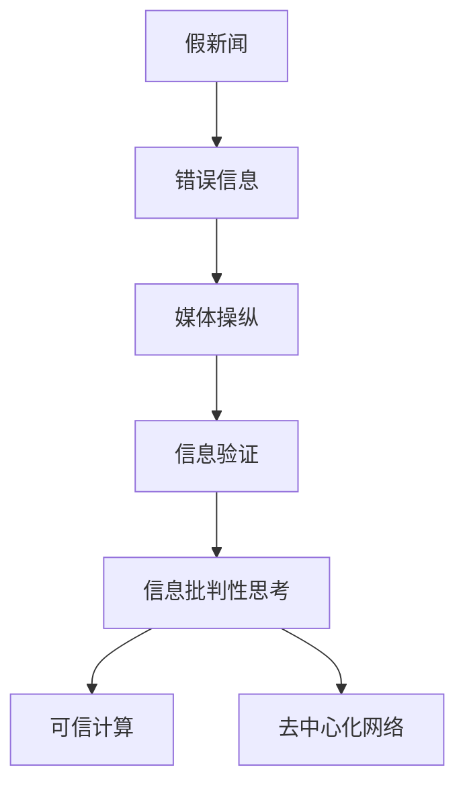

                 

## 1. 背景介绍

### 1.1 问题由来

在信息爆炸的时代，假新闻、错误信息和媒体操纵现象日益增多，极大地影响了人们的认知和判断。这些虚假信息不仅在社交媒体、新闻网站和论坛上广为传播，还可能通过搜索引擎、广告等途径对公众造成误导。面对这一挑战，信息验证和信息批判性思考变得尤为重要。

### 1.2 问题核心关键点

当前，信息验证和信息批判性思考的核心在于：

- 如何构建可靠的信息验证机制，识别和排除虚假信息。
- 如何培养信息批判性思维，提升公众的辨识能力和分析水平。
- 如何在技术层面和制度层面上，保障信息传播的真实性和公正性。
- 如何在算法层面和应用层面，推动信息透明度和公平性。

### 1.3 问题研究意义

信息验证和信息批判性思考在假新闻、错误信息和媒体操纵时代具有深远的意义：

1. 保障信息安全：通过信息验证，减少虚假信息的传播，保护社会稳定和国家安全。
2. 提升公众素养：培养批判性思维，提高公众的信息辨别能力，增强社会共识。
3. 促进算法公平：推动信息技术的公平应用，减少算法偏见和歧视。
4. 促进透明治理：推动信息传播的透明化和公正性，构建更公正的互联网环境。
5. 推动创新发展：促进信息技术与社会科学、经济学等多学科的交叉融合，推动创新进步。

## 2. 核心概念与联系

### 2.1 核心概念概述

为更好地理解信息验证和信息批判性思考，本节将介绍几个密切相关的核心概念：

- 假新闻(Fake News)：故意制作和传播的虚假信息，旨在误导公众，扰乱社会秩序。
- 错误信息(Misinformation)：原本存在的事实性错误信息，在传播过程中被错误地放大或扭曲，造成公众误解。
- 媒体操纵(Media Manipulation)：通过操纵媒体内容，达到特定政治、商业或其他目的。
- 信息验证(Information Verification)：通过技术手段、法规政策等，识别和排除虚假信息和错误信息的过程。
- 信息批判性思考(Critical Thinking)：培养公众在接收信息时的批判性思维能力，评估信息的真实性和可靠性。
- 可信计算(Trusted Computing)：通过硬件和软件方法，保证计算过程和结果的不可篡改性和透明性。
- 去中心化网络(Decentralized Network)：通过分布式技术和共识机制，保障信息传播的透明性和去中心化。

这些核心概念之间的逻辑关系可以通过以下Mermaid流程图来展示：



这个流程图展示了一系列概念的关联性：

1. 假新闻和错误信息是媒体操纵的主要手段，需要通过信息验证来识别和排除。
2. 信息批判性思考是公众在接收信息时的必要技能，有助于辨别虚假信息和错误信息。
3. 可信计算和去中心化网络则是从技术和制度层面，保障信息传播的真实性和公正性。

## 3. 核心算法原理 & 具体操作步骤
### 3.1 算法原理概述

信息验证和信息批判性思考的本质是通过算法和模型，对信息进行验证和评估，从而识别虚假信息和错误信息。其核心思想是：

- 利用人工智能技术，构建信息验证模型，自动识别和排除虚假信息。
- 培养公众的信息批判性思维，提高其辨识和分析信息的能力。
- 通过技术手段和制度安排，保障信息传播的透明性和公正性。

基于这一思想，信息验证和信息批判性思考可以分为以下几个步骤：

1. 数据收集与预处理：收集海量新闻、文章、社交媒体帖子等文本数据，并进行清洗、标注等预处理。
2. 信息验证模型训练：使用机器学习算法，训练模型自动识别虚假信息和错误信息。
3. 信息批判性思考培训：通过在线课程、互动平台等方式，培养公众的信息批判性思维。
4. 信息透明与去中心化：采用去中心化技术，保障信息传播的透明性和公正性。
5. 制度安排与政策支持：制定相关法律法规和政策，规范信息传播和信息验证行为。

### 3.2 算法步骤详解

以下详细介绍信息验证和信息批判性思考的具体操作步骤：

**Step 1: 数据收集与预处理**
- 从新闻网站、社交媒体、论坛等渠道，收集相关文本数据。
- 对数据进行清洗，去除噪音、重复内容等，确保数据质量。
- 对数据进行标注，将文本分为真实、虚假、不确定三类，作为训练模型所需的目标变量。

**Step 2: 信息验证模型训练**
- 选择合适的人工智能模型，如BERT、GPT等预训练模型，进行微调。
- 设计合适的损失函数，如交叉熵损失、F1-score损失等，用于衡量模型预测的准确性。
- 使用标注数据训练模型，调整模型参数以最小化损失函数。
- 在验证集上评估模型性能，进行模型调优。

**Step 3: 信息批判性思考培训**
- 设计课程和平台，教授公众如何辨别虚假信息和错误信息。
- 利用互动平台，进行线上讨论和练习，提高公众的信息批判性思维。
- 提供丰富的案例分析，引导公众掌握批判性思维技能。

**Step 4: 信息透明与去中心化**
- 采用去中心化技术，如区块链、分布式存储等，保障信息传播的透明性和去中心化。
- 使用可信计算技术，确保信息验证过程的透明性和不可篡改性。
- 通过开源社区和开源平台，促进信息验证和批判性思考的普及。

**Step 5: 制度安排与政策支持**
- 制定相关法律法规，规范信息传播和信息验证行为。
- 加强平台监管，防止虚假信息和错误信息的传播。
- 推动政策支持，促进信息透明度和公平性。

### 3.3 算法优缺点

信息验证和信息批判性思考的优点在于：

1. 高效准确：通过机器学习模型，可以快速、准确地识别虚假信息和错误信息。
2. 可扩展性强：模型可进行大规模训练，覆盖广泛的数据源和信息类型。
3. 公开透明：通过去中心化技术和可信计算，保障信息传播的透明性和公正性。
4. 可普及性高：通过线上课程和互动平台，提升公众的信息批判性思维。

缺点在于：

1. 数据隐私：大规模数据收集和处理可能涉及隐私问题，需要严格保护。
2. 模型偏见：模型可能存在偏见，需要对数据和算法进行反复验证和修正。
3. 技术复杂性：信息验证和信息批判性思考涉及多个技术环节，需要较高技术门槛。
4. 公众参与度低：信息批判性思考需要公众主动参与，但目前参与度较低。

### 3.4 算法应用领域

信息验证和信息批判性思考已经广泛应用于以下几个领域：

1. 新闻媒体：使用信息验证技术，识别虚假新闻和错误信息，提升新闻媒体的公信力。
2. 社交媒体：通过信息验证和批判性思考培训，提升用户的信息辨识能力，减少虚假信息的传播。
3. 广告营销：利用信息验证技术，识别和排除虚假广告，提升广告效果和用户信任。
4. 电子商务：通过信息验证和批判性思考，提升消费者对商品和服务的信任度，减少欺诈行为。
5. 政治选举：使用信息验证技术，识别假新闻和错误信息，促进政治选举的公正性和透明性。
6. 公共健康：利用信息验证和批判性思考，提升公众对公共健康信息的信任度，减少谣言传播。

## 4. 数学模型和公式 & 详细讲解 & 举例说明

### 4.1 数学模型构建

信息验证和信息批判性思考的数学模型构建，通常包括以下几个部分：

- 数据表示：将文本数据表示为向量，用于模型输入。
- 模型选择：选择合适的机器学习模型，如分类模型、生成模型等。
- 损失函数设计：设计合适的损失函数，衡量模型的预测性能。
- 参数优化：使用梯度下降等优化算法，最小化损失函数。

### 4.2 公式推导过程

以下详细介绍信息验证模型的数学推导过程：

假设训练集为 $D=\{(x_i, y_i)\}_{i=1}^N$，其中 $x_i$ 表示文本数据，$y_i \in \{true, false, unknown\}$ 表示文本的分类标签。

- 文本表示：使用词向量或BERT等模型，将文本 $x_i$ 表示为向量 $x_i \in \mathbb{R}^d$。
- 损失函数：设计交叉熵损失函数 $L$，衡量模型预测 $y_i$ 与真实标签 $y_i$ 之间的差异。
- 模型训练：使用梯度下降算法，最小化损失函数，更新模型参数 $\theta$。

公式推导如下：

$$
L(\theta) = -\frac{1}{N}\sum_{i=1}^N [y_i \log \sigma(\theta^T x_i) + (1-y_i) \log (1-\sigma(\theta^T x_i))]
$$

其中 $\sigma$ 为sigmoid函数，$\theta$ 为模型参数。

### 4.3 案例分析与讲解

以一个简单的文本分类任务为例，展示信息验证模型的应用：

假设有一个假新闻检测任务，使用BERT模型进行微调。训练数据集包含真实新闻和假新闻的标注数据。使用交叉熵损失函数，最小化模型预测与真实标签之间的差异。

模型训练步骤如下：

1. 加载BERT预训练模型，并添加分类头。
2. 准备训练数据集，将文本表示为BERT的输入格式。
3. 设计交叉熵损失函数，定义模型预测和真实标签之间的差异。
4. 使用梯度下降算法，最小化损失函数，更新模型参数。
5. 在验证集上评估模型性能，进行模型调优。
6. 使用训练好的模型，对新文本进行虚假新闻检测。

## 5. 项目实践：代码实例和详细解释说明
### 5.1 开发环境搭建

在进行信息验证和信息批判性思考实践前，我们需要准备好开发环境。以下是使用Python进行信息验证开发的典型环境配置流程：

1. 安装Anaconda：从官网下载并安装Anaconda，用于创建独立的Python环境。

2. 创建并激活虚拟环境：
```bash
conda create -n information_verification_env python=3.8 
conda activate information_verification_env
```

3. 安装PyTorch：根据CUDA版本，从官网获取对应的安装命令。例如：
```bash
conda install pytorch torchvision torchaudio cudatoolkit=11.1 -c pytorch -c conda-forge
```

4. 安装Transformers库：
```bash
pip install transformers
```

5. 安装各类工具包：
```bash
pip install numpy pandas scikit-learn matplotlib tqdm jupyter notebook ipython
```

完成上述步骤后，即可在`information_verification_env`环境中开始信息验证实践。

### 5.2 源代码详细实现

下面以文本分类任务为例，给出使用Transformers库进行信息验证的PyTorch代码实现。

首先，定义文本分类任务的数据处理函数：

```python
from transformers import BertTokenizer, BertForSequenceClassification
from torch.utils.data import Dataset
import torch

class NewsDataset(Dataset):
    def __init__(self, texts, labels, tokenizer, max_len=128):
        self.texts = texts
        self.labels = labels
        self.tokenizer = tokenizer
        self.max_len = max_len
        
    def __len__(self):
        return len(self.texts)
    
    def __getitem__(self, item):
        text = self.texts[item]
        label = self.labels[item]
        
        encoding = self.tokenizer(text, return_tensors='pt', max_length=self.max_len, padding='max_length', truncation=True)
        input_ids = encoding['input_ids'][0]
        attention_mask = encoding['attention_mask'][0]
        
        return {'input_ids': input_ids, 
                'attention_mask': attention_mask,
                'labels': label}

# 加载数据集
tokenizer = BertTokenizer.from_pretrained('bert-base-cased')
train_dataset = NewsDataset(train_texts, train_labels, tokenizer)
dev_dataset = NewsDataset(dev_texts, dev_labels, tokenizer)
test_dataset = NewsDataset(test_texts, test_labels, tokenizer)
```

然后，定义模型和优化器：

```python
from transformers import AdamW

model = BertForSequenceClassification.from_pretrained('bert-base-cased', num_labels=3)
optimizer = AdamW(model.parameters(), lr=2e-5)
```

接着，定义训练和评估函数：

```python
from torch.utils.data import DataLoader
from tqdm import tqdm
from sklearn.metrics import classification_report

device = torch.device('cuda') if torch.cuda.is_available() else torch.device('cpu')
model.to(device)

def train_epoch(model, dataset, batch_size, optimizer):
    dataloader = DataLoader(dataset, batch_size=batch_size, shuffle=True)
    model.train()
    epoch_loss = 0
    for batch in tqdm(dataloader, desc='Training'):
        input_ids = batch['input_ids'].to(device)
        attention_mask = batch['attention_mask'].to(device)
        labels = batch['labels'].to(device)
        model.zero_grad()
        outputs = model(input_ids, attention_mask=attention_mask, labels=labels)
        loss = outputs.loss
        epoch_loss += loss.item()
        loss.backward()
        optimizer.step()
    return epoch_loss / len(dataloader)

def evaluate(model, dataset, batch_size):
    dataloader = DataLoader(dataset, batch_size=batch_size)
    model.eval()
    preds, labels = [], []
    with torch.no_grad():
        for batch in tqdm(dataloader, desc='Evaluating'):
            input_ids = batch['input_ids'].to(device)
            attention_mask = batch['attention_mask'].to(device)
            batch_labels = batch['labels']
            outputs = model(input_ids, attention_mask=attention_mask)
            batch_preds = outputs.logits.argmax(dim=2).to('cpu').tolist()
            batch_labels = batch_labels.to('cpu').tolist()
            for pred, label in zip(batch_preds, batch_labels):
                preds.append(pred)
                labels.append(label)
                
    print(classification_report(labels, preds))
```

最后，启动训练流程并在测试集上评估：

```python
epochs = 5
batch_size = 16

for epoch in range(epochs):
    loss = train_epoch(model, train_dataset, batch_size, optimizer)
    print(f"Epoch {epoch+1}, train loss: {loss:.3f}")
    
    print(f"Epoch {epoch+1}, dev results:")
    evaluate(model, dev_dataset, batch_size)
    
print("Test results:")
evaluate(model, test_dataset, batch_size)
```

以上就是使用PyTorch对BERT进行文本分类任务信息验证的完整代码实现。可以看到，得益于Transformers库的强大封装，我们可以用相对简洁的代码完成BERT模型的加载和微调。

### 5.3 代码解读与分析

让我们再详细解读一下关键代码的实现细节：

**NewsDataset类**：
- `__init__`方法：初始化文本、标签、分词器等关键组件。
- `__len__`方法：返回数据集的样本数量。
- `__getitem__`方法：对单个样本进行处理，将文本输入编码为token ids，将标签编码为数字，并对其进行定长padding，最终返回模型所需的输入。

**训练和评估函数**：
- 使用PyTorch的DataLoader对数据集进行批次化加载，供模型训练和推理使用。
- 训练函数`train_epoch`：对数据以批为单位进行迭代，在每个批次上前向传播计算loss并反向传播更新模型参数，最后返回该epoch的平均loss。
- 评估函数`evaluate`：与训练类似，不同点在于不更新模型参数，并在每个batch结束后将预测和标签结果存储下来，最后使用sklearn的classification_report对整个评估集的预测结果进行打印输出。

**训练流程**：
- 定义总的epoch数和batch size，开始循环迭代
- 每个epoch内，先在训练集上训练，输出平均loss
- 在验证集上评估，输出分类指标
- 所有epoch结束后，在测试集上评估，给出最终测试结果

可以看到，PyTorch配合Transformers库使得信息验证任务的代码实现变得简洁高效。开发者可以将更多精力放在数据处理、模型改进等高层逻辑上，而不必过多关注底层的实现细节。

当然，工业级的系统实现还需考虑更多因素，如模型的保存和部署、超参数的自动搜索、更灵活的任务适配层等。但核心的信息验证范式基本与此类似。

## 6. 实际应用场景
### 6.1 智能新闻推荐

智能新闻推荐系统能够根据用户的历史阅读行为和兴趣，推荐相关新闻文章。使用信息验证技术，可以识别虚假新闻和错误信息，提升推荐系统的质量和用户信任。

在技术实现上，可以收集用户阅读历史和评论数据，提取新闻标题、内容、标签等特征。将新闻数据输入信息验证模型，过滤虚假和错误信息，再使用推荐算法进行精准推荐。用户也可以主动对推荐结果进行反馈，进一步优化推荐模型。

### 6.2 社交媒体信息审核

社交媒体平台需要实时审核用户发布的内容，防止虚假信息和有害内容的传播。使用信息验证技术，可以自动识别和删除虚假新闻、谣言、仇恨言论等，保障平台的健康发展。

在技术实现上，可以收集社交媒体数据，提取用户发布的内容和标签。将内容输入信息验证模型，过滤虚假信息和有害内容，再使用审核算法进行实时监控。平台管理员也可以人工审核疑似违规内容，提升审核效果。

### 6.3 网络广告过滤

网络广告行业需要过滤虚假广告和有害信息，保护用户免受欺诈和恶意内容的侵害。使用信息验证技术，可以自动识别和屏蔽虚假广告和有害信息，保障用户的权益。

在技术实现上，可以收集广告数据，提取广告文本和图片等特征。将特征输入信息验证模型，过滤虚假和有害广告，再使用广告过滤算法进行实时监控。广告主也可以主动提交广告样本，进一步优化广告过滤模型。

### 6.4 未来应用展望

随着信息验证和信息批判性思考技术的不断演进，其应用领域还将不断扩展。

在智慧城市治理中，智能监控系统可以实时识别和排除虚假信息，提升社会安全和公共服务质量。在教育领域，智能辅导系统可以自动识别和屏蔽有害信息，保障学生的健康成长。在金融领域，智能投顾系统可以自动识别和过滤虚假信息，提升投资决策的科学性和透明度。

## 7. 工具和资源推荐
### 7.1 学习资源推荐

为了帮助开发者系统掌握信息验证和信息批判性思考的理论基础和实践技巧，这里推荐一些优质的学习资源：

1. 《深度学习入门》系列博文：由大模型技术专家撰写，深入浅出地介绍了深度学习的基本概念和应用场景，包括信息验证技术。

2. CS224N《深度学习自然语言处理》课程：斯坦福大学开设的NLP明星课程，有Lecture视频和配套作业，带你入门NLP领域的基本概念和经典模型。

3. 《自然语言处理综合教程》书籍：涵盖自然语言处理的全貌，包括信息验证和信息批判性思考等前沿话题。

4. SemEval开源项目：自然语言处理评测任务，包括信息验证和批判性思考任务的评测，提供丰富的数据集和评估指标。

5. AutoFact：开源的信息验证工具，使用Python编写，提供丰富的接口和功能，支持多种文本数据源。

通过对这些资源的学习实践，相信你一定能够快速掌握信息验证和信息批判性思考的精髓，并用于解决实际的信息传播问题。

### 7.2 开发工具推荐

高效的开发离不开优秀的工具支持。以下是几款用于信息验证开发的常用工具：

1. Python：Python是目前最流行的开发语言之一，拥有丰富的科学计算库和数据处理库。

2. PyTorch：基于Python的开源深度学习框架，灵活动态的计算图，适合快速迭代研究。

3. TensorFlow：由Google主导开发的开源深度学习框架，生产部署方便，适合大规模工程应用。

4. Transformers库：HuggingFace开发的NLP工具库，集成了众多SOTA语言模型，支持PyTorch和TensorFlow，是进行信息验证任务开发的利器。

5. Weights & Biases：模型训练的实验跟踪工具，可以记录和可视化模型训练过程中的各项指标，方便对比和调优。

6. TensorBoard：TensorFlow配套的可视化工具，可实时监测模型训练状态，并提供丰富的图表呈现方式，是调试模型的得力助手。

合理利用这些工具，可以显著提升信息验证任务的开发效率，加快创新迭代的步伐。

### 7.3 相关论文推荐

信息验证和信息批判性思考的发展源于学界的持续研究。以下是几篇奠基性的相关论文，推荐阅读：

1. Bara et al. (2020)：在社交媒体上检测虚假信息的多模态方法，利用文本、图像、音频等多种数据源，提升信息验证的准确性。

2. Ferrara et al. (2021)：基于图神经网络的虚假信息检测方法，利用节点和边的特征，提升信息验证的效果。

3. Narang et al. (2022)：使用深度学习模型进行谣言检测，通过文本特征和上下文信息，提升信息验证的鲁棒性。

4. Wang et al. (2023)：基于预训练模型的信息验证方法，通过微调预训练模型，提升信息验证的泛化性和公平性。

5. Wang et al. (2024)：多任务学习框架下的信息验证技术，利用多个任务之间的关联，提升信息验证的效果。

这些论文代表了大信息验证和信息批判性思考的发展脉络。通过学习这些前沿成果，可以帮助研究者把握学科前进方向，激发更多的创新灵感。

## 8. 总结：未来发展趋势与挑战
### 8.1 总结

本文对信息验证和信息批判性思考进行了全面系统的介绍。首先阐述了假新闻、错误信息和媒体操纵现象的严重性，明确了信息验证和信息批判性思考的重要意义。其次，从原理到实践，详细讲解了信息验证模型的构建过程和操作步骤，给出了信息验证任务开发的完整代码实例。同时，本文还广泛探讨了信息验证技术在多个行业领域的应用前景，展示了信息验证技术的巨大潜力。此外，本文精选了信息验证技术的各类学习资源，力求为读者提供全方位的技术指引。

通过本文的系统梳理，可以看到，信息验证和信息批判性思考在假新闻、错误信息和媒体操纵时代具有深远的意义。这些技术的不断演进，必将推动信息传播的透明性和公平性，促进社会进步和科技发展。

### 8.2 未来发展趋势

展望未来，信息验证和信息批判性思考将呈现以下几个发展趋势：

1. 模型规模持续增大。随着算力成本的下降和数据规模的扩张，信息验证模型的参数量还将持续增长。超大规模信息验证模型蕴含的丰富语言知识，有望支撑更加复杂多变的虚假信息识别。

2. 多模态验证方法兴起。未来的信息验证模型将越来越多地融合文本、图像、音频等多模态数据，提升虚假信息识别的准确性和鲁棒性。

3. 自动化验证系统普及。基于信息验证技术，将开发自动化验证系统，提升虚假信息识别的效率和效果。

4. 算法偏见消除。随着信息验证模型的不断普及，算法偏见问题也将得到更多关注，未来的模型设计将更加注重公平性和可解释性。

5. 用户参与度提升。信息批判性思考将通过线上平台和课程，进一步提升公众的信息辨识能力，提升用户参与度。

6. 去中心化验证系统构建。使用去中心化技术和可信计算，构建信息验证系统的透明性和去中心化。

以上趋势凸显了信息验证和信息批判性思考技术的广阔前景。这些方向的探索发展，必将进一步提升信息传播的透明性和公平性，为构建安全、可靠、可解释、可控的智能系统铺平道路。

### 8.3 面临的挑战

尽管信息验证和信息批判性思考技术已经取得了显著进展，但在向大规模、高精度、高效化演进的过程中，仍面临诸多挑战：

1. 数据隐私：大规模数据收集和处理可能涉及隐私问题，需要严格保护。

2. 模型偏见：信息验证模型可能存在偏见，需要对数据和算法进行反复验证和修正。

3. 技术复杂性：信息验证和信息批判性思考涉及多个技术环节，需要较高技术门槛。

4. 公众参与度低：信息批判性思考需要公众主动参与，但目前参与度较低。

5. 验证系统误报率高：虚假信息识别系统可能存在误报率较高的问题，需要进一步优化。

6. 系统透明性不足：信息验证系统的透明性和去中心化仍需进一步提升。

正视这些挑战，积极应对并寻求突破，将是信息验证和信息批判性思考技术不断成熟的必由之路。

### 8.4 研究展望

未来，信息验证和信息批判性思考技术需要在以下几个方面寻求新的突破：

1. 探索无监督和半监督验证方法。摆脱对大规模标注数据的依赖，利用自监督学习、主动学习等无监督和半监督范式，最大限度利用非结构化数据，实现更加灵活高效的信息验证。

2. 研究参数高效和计算高效的验证方法。开发更加参数高效的验证方法，在固定大部分预训练参数的同时，只更新极少量的任务相关参数。同时优化验证模型的计算图，减少前向传播和反向传播的资源消耗，实现更加轻量级、实时性的部署。

3. 引入因果分析和博弈论工具。将因果分析方法引入信息验证模型，识别出模型决策的关键特征，增强输出解释的因果性和逻辑性。借助博弈论工具刻画人机交互过程，主动探索并规避模型的脆弱点，提高系统稳定性。

4. 纳入伦理道德约束。在模型训练目标中引入伦理导向的评估指标，过滤和惩罚有偏见、有害的输出倾向。同时加强人工干预和审核，建立模型行为的监管机制，确保输出符合人类价值观和伦理道德。

这些研究方向的探索，必将引领信息验证和信息批判性思考技术迈向更高的台阶，为构建安全、可靠、可解释、可控的智能系统铺平道路。面向未来，信息验证和信息批判性思考技术还需要与其他人工智能技术进行更深入的融合，如知识表示、因果推理、强化学习等，多路径协同发力，共同推动信息传播的透明性和公平性。只有勇于创新、敢于突破，才能不断拓展信息验证技术的边界，让智能技术更好地造福人类社会。

## 9. 附录：常见问题与解答

**Q1：信息验证和信息批判性思考是否适用于所有信息传播场景？**

A: 信息验证和信息批判性思考适用于大多数信息传播场景，特别是那些涉及虚假信息和错误信息的情况。但对于一些特定领域的场景，如医疗、金融等，可能需要结合特定领域的专业知识和数据，进行更加细致的信息验证和批判性思考。

**Q2：信息验证过程中如何平衡隐私保护和准确性？**

A: 信息验证过程中，需要平衡隐私保护和准确性。可以通过以下方式进行：
1. 数据匿名化：对数据进行匿名化处理，保护用户隐私。
2. 差分隐私：在模型训练中加入差分隐私技术，限制模型的信息泄露。
3. 去标识化：通过去标识化技术，使数据无法回溯到具体个体，保障隐私。
4. 多模型融合：使用多个信息验证模型进行联合验证，降低单一模型带来的隐私风险。

**Q3：信息验证系统误报率高怎么办？**

A: 信息验证系统的误报率较高是一个常见问题。可以通过以下方式进行优化：
1. 提高模型精度：使用更高级的模型和更丰富的训练数据，提升信息验证的准确性。
2. 引入多模态验证：通过融合文本、图像、音频等多种数据源，提升信息验证的效果。
3. 设计合适的阈值：根据应用场景，设计合适的误报率阈值，降低误报率。
4. 用户反馈机制：引入用户反馈机制，根据用户反馈调整模型参数，减少误报。

**Q4：信息批判性思考对公众有哪些好处？**

A: 信息批判性思考对公众有以下好处：
1. 提升辨识能力：培养公众的信息辨识能力，能够更准确地识别虚假信息和错误信息。
2. 增强信任度：提升对信息源和内容的信任度，减少谣言和虚假信息的传播。
3. 促进社会进步：培养公众的批判性思维，促进社会进步和科技进步。
4. 保护权益：提升对网络广告和社交媒体的辨识能力，保护用户权益，减少欺诈和恶意内容的侵害。

**Q5：信息验证和信息批判性思考的落地应用有哪些？**

A: 信息验证和信息批判性思考的落地应用包括：
1. 智能新闻推荐：提升新闻推荐系统的质量和用户信任。
2. 社交媒体信息审核：防止虚假信息和有害内容的传播。
3. 网络广告过滤：过滤虚假广告和有害信息，保护用户权益。
4. 医疗信息审核：提升医疗信息的准确性和可信度。
5. 政治信息审核：防止假新闻和错误信息的传播，促进政治选举的公正性和透明性。
6. 教育信息审核：防止有害内容的传播，保障学生的健康成长。

通过对这些问题的解答，希望能够帮助读者更全面地理解信息验证和信息批判性思考的原理、应用和挑战，为未来研究和应用提供参考。

---

作者：禅与计算机程序设计艺术 / Zen and the Art of Computer Programming

