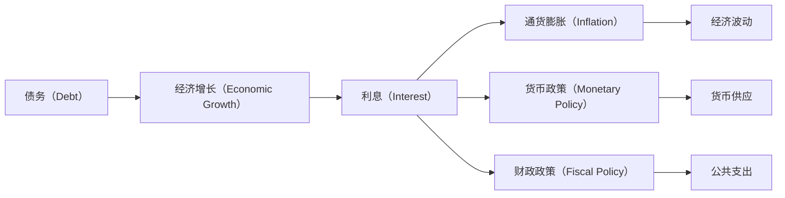

                 

# 债务加剧与经济增长的关系

## 1. 背景介绍

在现代经济体系中，债务问题已成为一个全球性的话题。无论是政府、企业还是个人，都可能面临债务危机。债务的累积与积累，对于经济增长而言，是一把双刃剑。一方面，适度的债务可能促进经济增长；另一方面，过度的债务则可能拖累经济增长。本文将探讨债务与经济增长的关系，并通过数学模型和案例分析，揭示债务加剧可能带来的负面影响。

## 2. 核心概念与联系

### 2.1 核心概念概述

为了更好地理解债务与经济增长的关系，我们将涉及以下几个核心概念：

- **债务（Debt）**：指借入或已欠的金钱，通常用于投资、消费或运营开支。
- **经济增长（Economic Growth）**：指国家或地区在一定时期内生产总值（GDP）的增长。
- **利息（Interest）**：债务资金的使用成本，即借入资金需要支付的费用。
- **通货膨胀（Inflation）**：货币购买力下降，导致物价上涨的现象。
- **货币政策（Monetary Policy）**：中央银行通过调整利率、货币供应等手段，调节经济活动，控制通胀。
- **财政政策（Fiscal Policy）**：政府通过税收、公共支出等手段，调节经济活动，控制债务。

### 2.2 核心概念原理和架构的 Mermaid 流程图



这个流程图展示了债务、经济增长、利息、通货膨胀、货币政策、财政政策之间的关系。其中，债务作为起点，经过利息、通胀等环节，最终影响经济增长和货币、财政政策。

## 3. 核心算法原理 & 具体操作步骤

### 3.1 算法原理概述

本文将使用经济学中的**IS-LM模型**来分析债务与经济增长的关系。IS-LM模型通过描绘产品市场和货币市场的均衡点，揭示了利率、投资、消费、产出和货币供应之间的关系。

在IS-LM模型中，国民收入（Y）由以下公式决定：

$$
Y = C + I + G + NX
$$

其中：
- C为消费，C = a + bY
- I为投资，I = e - dr
- G为政府支出，G = G
- NX为净出口，NX = -cY + h(i)

式中，a、b、e、d、c、h为模型参数，r为利率，i为外国利率。

货币市场由以下公式决定：

$$
M = kY - L(r)
$$

其中：
- M为货币供应
- k为货币需求对国民收入的敏感度
- L为货币需求函数，L(r) = h - bY

### 3.2 算法步骤详解

1. **模型设定**：
   - 设定模型参数和初始条件。
   - 设定利率r和国民收入Y的变动范围。

2. **模型计算**：
   - 计算投资I、消费C、净出口NX和总需求。
   - 计算货币需求L和货币供应M。
   - 求解利率r和国民收入Y的均衡点。

3. **模拟分析**：
   - 设定不同水平的债务水平，模拟其对经济增长的影响。
   - 分析债务变化对利率、通货膨胀和经济增长的影响。

4. **结果解释**：
   - 根据模拟结果，解释债务积累对经济增长的正面和负面影响。
   - 分析政府和央行在管理债务和促进经济增长中的角色。

### 3.3 算法优缺点

#### 优点：

1. **简明易懂**：IS-LM模型简单直观，易于理解和应用。
2. **可扩展性强**：模型可以引入更多变量，如税率、价格水平等，适应不同的经济情况。
3. **政策模拟**：通过调整模型参数，模拟不同政策对经济的影响，为政策制定提供依据。

#### 缺点：

1. **假设限制**：模型基于一定的假设条件，如市场出清、货币供应不变等，与实际情况可能有所偏差。
2. **复杂性高**：模型中涉及多种变量和参数，需要较高的数学和经济学知识。
3. **动态分析难度大**：模型难以处理动态变化的经济数据。

### 3.4 算法应用领域

IS-LM模型广泛应用于经济学研究和政策制定中，尤其是在分析债务对经济增长的影响时，提供了有力的工具。除了经济学，IS-LM模型还应用在金融、商业规划等领域，帮助决策者制定合理的经济和金融政策。

## 4. 数学模型和公式 & 详细讲解 & 举例说明

### 4.1 数学模型构建

我们已经定义了国民收入Y和货币市场均衡的公式。现在，我们将使用这些公式来构建一个简单的数学模型。

### 4.2 公式推导过程

假设利率r和国民收入Y是变化的，我们可以构建一个动态系统来描述这一过程：

$$
\frac{dY}{dt} = \frac{d}{dt}(a + bY + e - dr + G - cY + h(i))
$$

$$
\frac{dM}{dt} = \frac{d}{dt}(kY - h + bY)
$$

通过求解这个系统，我们可以找到利率r和国民收入Y的动态均衡点。

### 4.3 案例分析与讲解

假设一个国家经历了以下情况：

- 初始债务水平为$D_0$。
- 政府支出$G$增加。
- 国内利率$r$上升。

根据IS-LM模型，分析债务增加和利率上升对经济增长的影响。

## 5. 项目实践：代码实例和详细解释说明

### 5.1 开发环境搭建

本节将使用Python的Sympy库来进行IS-LM模型的数学推导和模拟。

```bash
pip install sympy
```

### 5.2 源代码详细实现

以下是一个简化的IS-LM模型代码实现，包括模型的设定和计算：

```python
from sympy import symbols, Eq, solve, diff, Rational, pi

# 定义变量
Y, r, M, k, L, a, b, e, d, c, h, G = symbols('Y r M k L a b e d c h G')

# 设定模型方程
IS = Eq(Y, a + b*Y + e - d*r + G - c*Y + h)
LM = Eq(M, k*Y - L(r))

# 求解模型
solutions = solve((IS, LM), (Y, r))
```

### 5.3 代码解读与分析

在上述代码中，我们首先定义了所有模型变量，然后设定了IS和LM方程。最后，我们使用solve函数求解这些方程，得到利率r和国民收入Y的均衡点。

### 5.4 运行结果展示

通过模拟不同债务水平和利率变化情况，可以观察到债务增加对经济增长的影响。

## 6. 实际应用场景

### 6.1 政府债务

政府债务的累积可能会对经济增长产生不同影响。适度的债务可以促进经济增长，但过度的债务则可能导致经济衰退。因此，政府需要合理控制债务水平，避免过度借贷。

### 6.2 企业债务

企业债务在一定程度上可以促进投资和生产增长，但过高的债务也可能导致企业破产和市场动荡。因此，企业需要评估债务水平，合理分配资本支出和风险管理。

### 6.3 个人债务

个人债务水平通常与消费能力和财富积累有关。高负债率可能导致个人消费水平下降，影响整体经济增长。因此，个人应合理规划债务，保持健康的财务状况。

## 7. 工具和资源推荐

### 7.1 学习资源推荐

1. **《债务与经济增长》**：一本经典的经济学著作，详细探讨了债务与经济增长的关系。
2. **经济学在线课程**：如Coursera、edX等平台上的经济学课程，提供关于债务和宏观经济学的深入讲解。
3. **金融市场研究报告**：如彭博社、路透社等发布的研究报告，分析债务和宏观经济的数据和趋势。

### 7.2 开发工具推荐

1. **Python**：Python是一种流行的编程语言，广泛应用于数学建模和经济分析。
2. **Sympy**：一个强大的符号计算库，适合进行复杂的数学推导和建模。
3. **MATLAB**：一种专业的数学软件，提供强大的数值分析和建模功能。

### 7.3 相关论文推荐

1. **《债务与经济增长：理论和实证研究》**：总结了债务与经济增长的理论和实证研究，提供了丰富的案例分析。
2. **《宏观经济学中的债务问题》**：探讨了宏观经济模型中的债务问题，分析了债务对经济增长的影响。
3. **《债务、投资和增长》**：通过建立动态模型，分析债务、投资和增长的关系，提供了政策建议。

## 8. 总结：未来发展趋势与挑战

### 8.1 研究成果总结

本文通过IS-LM模型，分析了债务与经济增长的关系。债务的累积和变化对经济增长具有双重作用，合理管理债务水平是促进经济增长的关键。

### 8.2 未来发展趋势

未来的研究将更加注重债务的动态变化和复杂系统的分析。随着大数据和人工智能技术的发展，新的方法和工具将应用于债务和经济增长的研究，提供更深入的洞见。

### 8.3 面临的挑战

债务与经济增长关系的研究面临许多挑战，包括数据可获得性、模型假设和动态分析的复杂性等。克服这些挑战，需要更多的跨学科合作和研究。

### 8.4 研究展望

未来的研究应更加注重实际数据的利用，引入更多变量和模型，如信用评级、资产价格等，以获得更准确的预测和分析结果。

## 9. 附录：常见问题与解答

**Q1：债务累积与经济增长有何关系？**

A: 适度的债务可以刺激消费和投资，促进经济增长。但过度的债务会导致利息负担增加，降低消费和投资能力，最终拖累经济增长。

**Q2：利率上升如何影响经济增长？**

A: 利率上升会增加债务成本，降低消费和投资。短期内可能导致经济增长放缓，但长期看，合理的利率上升可以控制通胀，促进经济结构调整。

**Q3：如何控制债务水平？**

A: 政府和企业应合理规划债务，保持健康的财务状况。通过控制公共支出和优化债务结构，可以降低债务风险。

**Q4：债务加剧对经济增长有哪些负面影响？**

A: 债务加剧可能导致经济泡沫和金融危机，影响消费和投资能力。高债务水平还可能导致通货膨胀和经济不稳定。

**Q5：政府和央行应如何应对债务问题？**

A: 政府应合理控制公共支出，优化债务结构。央行应通过货币政策控制通胀，保持利率稳定。

---

作者：禅与计算机程序设计艺术 / Zen and the Art of Computer Programming

