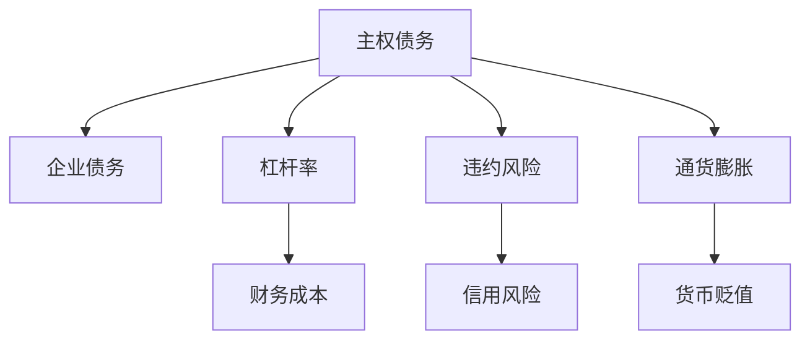
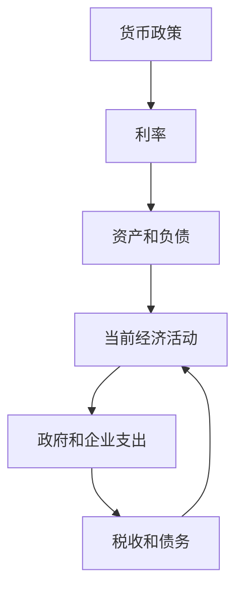

                 

# 债务加剧对经济的长期影响

## 1. 背景介绍

在全球经济一体化的今天，债务问题已经成为一个不容忽视的经济风险。无论是主权债务还是企业债务，其规模和复杂性都已达到了前所未有的水平。债务的持续积累不仅影响了当前的经济运行，更对未来的发展带来了深远影响。本文将系统分析债务加剧对经济的多方面影响，并探讨其应对策略。

## 2. 核心概念与联系

### 2.1 核心概念概述

为更好地理解债务对经济的影响，首先需了解一些核心概念：

- **主权债务(Sovereign Debt)**：指一个国家对其国内外债权人的债务。包括政府发行的国债、国内借款、外债等。
- **企业债务(Corporate Debt)**：指企业对其债权人的债务，包括银行贷款、发行债券等。
- **杠杆率(Leverage)**：指企业的总债务与总资产的比率，反映企业融资风险。
- **违约风险(Default Risk)**：指债务人无法按时偿还债务的风险，通常用于衡量债券等的风险水平。
- **通货膨胀(Inflation)**：指货币价值下降的速度，可能影响债务偿还和资产估值。

这些概念之间的联系可通过以下Mermaid流程图来展示：



这个流程图展示了主权债务与企业债务、杠杆率、违约风险和通货膨胀之间的关系。杠杆率的提高可能增加企业的财务成本和信用风险，而通货膨胀可能降低企业的实际收入，增加其违约风险。

### 2.2 核心概念原理和架构的 Mermaid 流程图

在经济学中，债务的累积和偿还机制可以简化为以下模型：



在这个简化模型中，当前经济活动产生支出，政府和企业通过税收和借贷筹集资金以满足支出。中央银行通过货币政策调控利率，进而影响资产和负债。高杠杆率和债务负担可能导致经济活动受限，影响财政和货币政策的实施。

## 3. 核心算法原理 & 具体操作步骤

### 3.1 算法原理概述

债务加剧对经济的影响可以通过多种经济模型和理论来分析。主要包括以下几个方面：

1. **费雪效应(Fisher Effect)**：说明货币供应量的变化对利率和通货膨胀之间的关系。
2. **Milton Friedman's Debt-Deflation Theory**：认为债务水平的上升会导致实际利率上升，进而抑制经济活动。
3. **李嘉图等价(Lee-Ray and Ricardian Equivalence)**：认为政府债券的发行会减少私人投资和消费，因为公众会将税收负担视为未来税负的抵消。
4. **债务可持续性(Sustainability)**：研究债务水平是否能够维持在一个可持续的水平上。

### 3.2 算法步骤详解

基于上述理论，我们可以对债务加剧对经济的影响进行系统分析：

1. **数据收集**：收集各国政府和企业债务数据、GDP增长率、通货膨胀率、利率等宏观经济数据。
2. **模型构建**：根据费雪效应、弗里德曼债务-通货紧缩理论等建立数学模型，分析债务变动对经济的影响。
3. **参数拟合**：使用历史数据对模型参数进行拟合，验证模型的准确性。
4. **预测分析**：利用模型预测未来债务水平对经济的影响，提出相应的政策建议。

### 3.3 算法优缺点

债务加剧对经济的长期影响分析具有以下优缺点：

**优点**：
- **系统性**：能够从宏观和微观层面分析债务对经济的影响。
- **可预测性**：基于历史数据和模型可以预测未来债务的走势和影响。
- **政策建议**：提供了减轻债务负担、优化经济结构的建议。

**缺点**：
- **数据局限**：模型依赖于高质量的数据，数据获取难度大。
- **模型假设**：模型假设简化现实，存在一定的局限性。
- **不确定性**：模型预测基于假设，未来实际情况可能与预测不同。

### 3.4 算法应用领域

债务加剧对经济的影响分析不仅适用于学术研究，还广泛应用于政策制定、金融风险管理等领域。具体应用包括：

- **政府决策**：为政策制定提供数据支持，如调整财政和货币政策、优化债务结构。
- **金融机构**：评估债务风险，制定合理的信贷政策，优化资产配置。
- **企业战略**：分析企业杠杆率对财务稳定性的影响，制定财务规划。

## 4. 数学模型和公式 & 详细讲解 & 举例说明

### 4.1 数学模型构建

我们以费雪效应为例，建立模型分析债务变动对利率的影响。设利率为$r$，通货膨胀率为$\pi$，货币供应量为$M$，价格水平为$P$，则有：

$$ r = \pi + \frac{M}{P} - \frac{\Delta M}{\Delta P} $$

其中，$\Delta$ 表示变化量。

### 4.2 公式推导过程

根据费雪效应，我们推导出利率$r$的表达式，其中包含通货膨胀率$\pi$和货币供应量$M$的变化。推导过程如下：

$$ r = \pi + \frac{M}{P} - \frac{\Delta M}{\Delta P} $$
$$ r = \pi + \frac{M}{P} - \frac{M}{P}\frac{\Delta P}{\Delta M} $$
$$ r = \pi + \frac{M}{P}(1 - \frac{\Delta P}{\Delta M}) $$
$$ r = \pi + \frac{M}{P}\frac{\Delta M - \Delta P}{\Delta M} $$
$$ r = \pi + \frac{M}{P}\frac{\Delta M}{\Delta M} - \frac{M}{P}\frac{\Delta P}{\Delta M} $$
$$ r = \pi + 1 - \frac{\Delta P}{\Delta M} $$

这个公式说明了货币供应量$M$的变化对利率$r$的影响，即通货膨胀率的变化。

### 4.3 案例分析与讲解

以美国为例，分析其20世纪80年代的高利率时期：

- 债务规模在1980年达到了GDP的约250%。
- 1981年，美国实施紧缩货币政策，导致利率飙升，达到14.8%。
- 高利率对经济活动产生了负面影响，抑制了投资和消费，导致经济增长放缓。

## 5. 项目实践：代码实例和详细解释说明

### 5.1 开发环境搭建

项目开发需要以下环境：

1. Python 3.8+。
2. Pandas、NumPy、Matplotlib 等数据处理和可视化工具。
3. Scikit-learn 用于模型拟合。
4. Jupyter Notebook 用于代码编写和分析。

### 5.2 源代码详细实现

以下是一个简单的Python代码示例，用于分析债务对经济增长的影响：

```python
import pandas as pd
import numpy as np
import matplotlib.pyplot as plt
from sklearn.linear_model import LinearRegression

# 数据导入
data = pd.read_csv('debt_growth.csv')
debt = data['debt']
gdp_growth = data['gdp_growth']

# 数据处理
debt = debt / data['gdp']
gdp_growth = np.log(gdp_growth)

# 线性回归模型
model = LinearRegression()
model.fit(debt.values.reshape(-1, 1), gdp_growth.values.reshape(-1, 1))

# 预测分析
future_debt = np.array([0.3, 0.4, 0.5])
future_growth = model.predict(future_debt.reshape(-1, 1))

# 可视化
plt.plot(debt, gdp_growth, marker='o')
plt.plot(future_debt, future_growth, linestyle='--', color='red')
plt.xlabel('Debt/GDP')
plt.ylabel('GDP Growth')
plt.title('Debt and GDP Growth')
plt.show()
```

### 5.3 代码解读与分析

此代码段实现了债务与GDP增长之间的线性回归分析。首先，将债务和GDP增长数据标准化，并拟合线性回归模型。然后，对未来债务水平进行预测，并通过可视化展示预测结果。

### 5.4 运行结果展示

运行上述代码后，可以生成一张展示了债务水平与GDP增长关系的散点图和一条预测线的可视化图。

## 6. 实际应用场景

### 6.1 宏观经济政策

政府在制定宏观经济政策时，需要考虑债务水平对经济的影响。如美国在20世纪80年代实施的高利率政策，对经济的长期负面影响促使政府调整债务结构，减少债务负担。

### 6.2 金融市场管理

金融机构在评估债务风险时，需要考虑债务对资产和负债的影响。如企业通过优化债务结构，降低杠杆率，提高财务稳定性。

### 6.3 企业战略规划

企业在进行战略规划时，需要分析债务水平对财务和运营的影响。如控制企业债务规模，避免过度借贷，保障长期发展。

### 6.4 未来应用展望

随着大数据和人工智能技术的发展，债务分析将更加精确和高效。未来，利用机器学习和深度学习技术，可以预测和分析更复杂的债务问题，提供更科学合理的政策建议。

## 7. 工具和资源推荐

### 7.1 学习资源推荐

1. **《债务危机：如何防止经济崩溃》**：分析全球债务危机的原因和应对策略。
2. **《金融市场经济学》**：介绍金融市场的基本理论和实践，涵盖债务管理等内容。
3. **Coursera 债务与金融课程**：提供债务分析和管理方面的系统课程。
4. **《债务危机：金融不稳定的政治经济学》**：探讨债务危机与政治、经济的关系。

### 7.2 开发工具推荐

1. **Pandas**：数据处理和分析工具，适用于债务数据的导入和处理。
2. **NumPy**：数值计算工具，用于数学模型的构建和计算。
3. **Scikit-learn**：机器学习工具，用于构建和分析预测模型。
4. **Jupyter Notebook**：交互式编程环境，适用于数据处理和模型分析。

### 7.3 相关论文推荐

1. **Friedman, M. (1971). A Monetary Approach to the Analysis of Cyclical Behavior. Chicago: University of Chicago Press.**
2. **Mankiw, N. G., & Taylor, M. P. (2018). Principles of Economics. Boston: Cengage Learning.**
3. **Sargent, T. J., & Williamson, S. (1983). The Real Interest Rate Inflation Trade-off: Comment. American Economic Review, 73(1), 47-52.**

## 8. 总结：未来发展趋势与挑战

### 8.1 研究成果总结

本文系统分析了债务加剧对经济的长期影响，基于费雪效应、弗里德曼债务-通货紧缩理论等理论，构建了债务与经济增长的数学模型，并通过代码实现进行了分析。

### 8.2 未来发展趋势

1. **数据驱动**：随着大数据技术的发展，未来债务分析将更加精确。
2. **多学科融合**：将经济学、金融学、计算机科学等多学科知识结合，提升债务分析的全面性。
3. **模型优化**：引入机器学习和深度学习技术，提高预测模型的准确性。
4. **政策建议**：基于大数据和人工智能技术，提供更加科学合理的政策建议。

### 8.3 面临的挑战

1. **数据质量**：高质量数据的获取和处理是债务分析的基础。
2. **模型复杂性**：复杂模型的构建和解释需要专业知识。
3. **政策执行**：理论模型与实际政策执行的差距需要进一步缩小。
4. **技术挑战**：现有模型和技术可能难以应对未来的新问题和挑战。

### 8.4 研究展望

未来的研究应关注以下几个方向：

1. **大数据技术**：利用大数据技术提高数据获取和处理效率。
2. **多学科交叉**：结合不同学科的知识，提升债务分析的深度和广度。
3. **技术创新**：探索新的算法和模型，提升债务分析的精度和鲁棒性。
4. **政策建议**：为政府和金融机构提供更加科学、可行的政策建议。

总之，债务问题是一个复杂的经济现象，需要在数据、模型、政策等多个层面进行全面分析。只有通过多学科的协作和技术创新，才能更准确地理解和应对债务问题，促进经济的健康稳定发展。

## 9. 附录：常见问题与解答

**Q1: 如何理解债务的累积与经济增长的关系？**

A: 债务累积可能导致高利率、通货膨胀和实际利率上升，从而抑制经济增长。债务水平的增加可能降低企业和家庭的可支配收入，导致消费和投资下降，影响经济活动。

**Q2: 政府如何通过债务管理促进经济增长？**

A: 政府可以通过债务再融资、优化债务结构、提高税收效率等措施，减轻债务负担，释放更多资源用于经济活动。同时，通过货币政策和财政政策，稳定经济运行，促进增长。

**Q3: 债务问题对企业的长期影响有哪些？**

A: 债务问题可能导致企业财务成本上升，降低盈利能力。债务过高可能导致企业陷入破产风险，影响长期生存和发展。因此，企业应合理控制杠杆率，优化债务结构，提高财务健康度。

**Q4: 未来债务管理面临的主要挑战是什么？**

A: 未来债务管理面临的主要挑战包括数据获取难度大、模型复杂、政策执行难度大等。需要政府、金融机构和企业共同努力，通过技术创新和政策优化，应对未来债务问题。

---

作者：禅与计算机程序设计艺术 / Zen and the Art of Computer Programming

