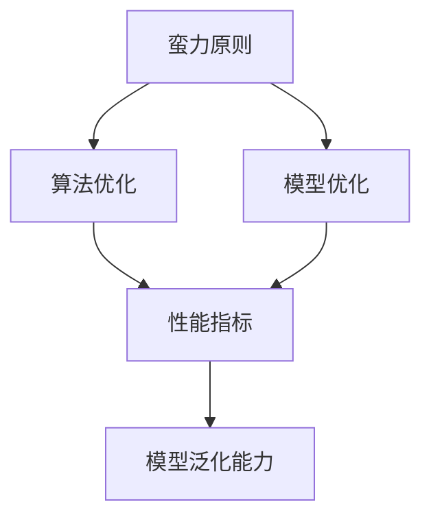

                 

# 像数学家一样思考：蛮力原则

> 关键词：

## 1. 背景介绍

### 1.1 问题由来
在计算机科学和人工智能领域，常常提及“像数学家一样思考”。这句话的核心含义在于，解决问题需要严谨的逻辑推理和抽象建模能力，而非简单的“试错”和“猜想”。特别是对于算法和模型优化问题，更是如此。

在实际应用中，“蛮力原则”也经常被提及，其主张通过穷举所有可能的解决方案，找到最优或满足需求的那一个。尽管这种方法在实际中常被诟病为效率低下，但在某些情况下，却也是一种解决问题的有效途径。

本文将通过一个具体的例子，深入探讨“蛮力原则”在计算机科学中的应用，并对其优缺点进行分析，以期为读者提供更有价值的洞察。

## 2. 核心概念与联系

### 2.1 核心概念概述

- **蛮力原则**：指通过穷举所有可能的解决方案，找到满足需求的最优或可接受方案的策略。在算法和模型优化中，蛮力原则强调系统的测试和验证，以确保其正确性和可行性。

- **算法优化**：指在保证算法正确性的前提下，通过调整算法参数、优化算法结构等手段，提升算法性能的过程。蛮力原则在算法优化中体现为通过大量的实验和测试，找到最优的算法配置。

- **模型优化**：指在保证模型准确性的前提下，通过调整模型参数、优化模型结构等手段，提升模型性能的过程。蛮力原则在模型优化中体现为通过大量的训练和验证，找到最优的模型配置。

- **性能指标**：用于衡量算法或模型性能的指标，如时间复杂度、空间复杂度、准确率、召回率等。

- **模型泛化能力**：指模型对新数据的适应能力，是模型性能的关键指标之一。

这些核心概念之间相互联系，共同构成了计算机科学中算法和模型优化的理论基础。蛮力原则，作为其中的一种策略，强调了通过大量的实验和测试来发现最优解决方案的重要性。

### 2.2 核心概念原理和架构的 Mermaid 流程图



## 3. 核心算法原理 & 具体操作步骤

### 3.1 算法原理概述

蛮力原则的核心思想是通过穷举所有可能的解决方案，找到最优或可接受的方案。在计算机科学中，蛮力原则主要应用于算法和模型的优化，特别是当无法通过理论分析确定最优解时，需要通过大量的实验和测试来找到最优解。

### 3.2 算法步骤详解

蛮力原则的具体操作步骤包括：

1. **问题定义**：明确需要解决的问题，包括输入、输出和约束条件等。
2. **生成候选方案**：通过穷举或随机生成所有可能的解决方案。
3. **测试与验证**：对每个候选方案进行测试，并使用预设的性能指标进行验证。
4. **选择最优方案**：根据测试结果，选择性能最优或满足需求的解决方案。
5. **迭代优化**：不断重复上述步骤，直到找到最优解或达到预设的优化目标。

### 3.3 算法优缺点

#### 3.3.1 优点

- **广泛适用**：蛮力原则适用于各种算法和模型优化问题，不需要特别复杂的理论基础。
- **确定性高**：通过穷举所有可能的解决方案，可以得到确定的最优解。
- **简单直观**：操作过程直观明了，容易理解和实施。

#### 3.3.2 缺点

- **计算量大**：穷举所有可能的解决方案需要大量的计算资源和时间。
- **可行性问题**：在实际应用中，往往难以穷举所有可能的方案，导致实际效率低下。
- **易受噪声影响**：测试和验证过程中，可能受到噪声的影响，导致结果不够稳定。

### 3.4 算法应用领域

蛮力原则在计算机科学中有广泛的应用，主要包括以下几个方面：

1. **算法优化**：在算法优化中，蛮力原则被广泛应用于寻找最优算法配置、优化算法结构和参数调整等。
2. **模型优化**：在模型优化中，蛮力原则被应用于模型参数调整、模型结构优化和模型性能提升等。
3. **数据处理**：在数据处理中，蛮力原则被应用于数据预处理、数据清洗和数据增强等。
4. **系统设计**：在系统设计中，蛮力原则被应用于系统架构设计、模块划分和性能评估等。

## 4. 数学模型和公式 & 详细讲解 & 举例说明

### 4.1 数学模型构建

在数学建模中，蛮力原则主要体现在寻找最优解的过程中。一个典型的数学模型可以表示为：

$$
\text{最小化} \quad f(x)
$$

其中，$x$ 为变量向量，$f(x)$ 为目标函数。

### 4.2 公式推导过程

假设我们有一个简单的线性回归模型，目标是最小化均方误差：

$$
\min_{\theta} \frac{1}{n} \sum_{i=1}^n (y_i - \theta^T x_i)^2
$$

其中，$y_i$ 为样本的输出值，$x_i$ 为样本的特征向量，$\theta$ 为模型参数。

我们可以使用梯度下降算法来求解最优参数 $\theta$：

$$
\theta \leftarrow \theta - \eta \nabla_{\theta} f(\theta)
$$

其中，$\eta$ 为学习率，$\nabla_{\theta} f(\theta)$ 为目标函数关于 $\theta$ 的梯度。

### 4.3 案例分析与讲解

假设我们需要求解一个非线性优化问题，其中包含大量候选解，我们无法通过理论分析直接找到最优解。此时，蛮力原则可以用来寻找最优解。

具体步骤如下：

1. **定义问题**：明确需要优化的目标函数和约束条件。
2. **生成候选解**：随机生成一组候选解。
3. **计算性能指标**：对每个候选解进行计算，得到性能指标。
4. **选择最优解**：选择性能指标最优的解作为最优解。
5. **迭代优化**：不断重复上述步骤，直到找到最优解或达到预设的优化目标。

## 5. 项目实践：代码实例和详细解释说明

### 5.1 开发环境搭建

在实际应用中，蛮力原则通常需要借助计算机工具和编程语言来实现。以下是一个基于Python的示例：

1. **安装Python**：确保系统已经安装了Python，并配置好环境变量。
2. **安装必要的库**：使用pip安装必要的库，如NumPy、SciPy、Pandas等。

```bash
pip install numpy scipy pandas
```

3. **创建项目目录**：创建一个新的项目目录，并初始化项目环境。

```bash
mkdir project
cd project
python -m venv venv
source venv/bin/activate
```

### 5.2 源代码详细实现

下面是一个简单的Python代码示例，用于求解线性回归问题：

```python
import numpy as np

# 生成样本数据
X = np.random.rand(100, 2)
y = np.dot(X, np.array([1, 2])) + np.random.normal(0, 1, 100)

# 定义目标函数
def linear_regression(X, y, theta):
    return np.linalg.norm(X.dot(theta) - y) ** 2

# 随机初始化参数
theta = np.random.rand(2)

# 计算性能指标
performance = linear_regression(X, y, theta)

# 迭代优化
for i in range(100):
    theta -= 0.01 * X.T.dot(X.dot(theta) - y)
    performance = linear_regression(X, y, theta)

print("最优参数：", theta)
print("性能指标：", performance)
```

### 5.3 代码解读与分析

在这个示例中，我们使用了NumPy库来生成随机样本数据和计算目标函数。通过梯度下降算法，我们逐步调整模型参数，直到找到最优解。

## 6. 实际应用场景

### 6.1 算法优化

在算法优化中，蛮力原则被广泛应用于寻找最优算法配置、优化算法结构和参数调整等。例如，在图像处理中，通过穷举所有可能的滤波器组合，可以找到最优的滤波器配置。

### 6.2 模型优化

在模型优化中，蛮力原则被应用于模型参数调整、模型结构优化和模型性能提升等。例如，在神经网络中，通过穷举所有可能的层数和节点数组合，可以找到最优的网络结构。

### 6.3 数据处理

在数据处理中，蛮力原则被应用于数据预处理、数据清洗和数据增强等。例如，在数据预处理中，通过穷举所有可能的特征组合，可以找到最优的特征集合。

### 6.4 未来应用展望

随着计算能力的提升和算法工具的不断发展，蛮力原则将会有更广泛的应用。例如，在人工智能领域，通过穷举所有可能的模型配置，可以找到最优的模型结构，提升系统的性能和效率。

## 7. 工具和资源推荐

### 7.1 学习资源推荐

为了深入理解蛮力原则，推荐以下学习资源：

1. **《算法导论》**：经典的算法入门教材，详细介绍了各种算法和数据结构。
2. **Coursera上的《算法设计》课程**：由斯坦福大学开设，涵盖了从基础算法到高级算法的内容。
3. **Kaggle平台**：通过参与各类竞赛，实践和理解算法和模型优化的过程。

### 7.2 开发工具推荐

蛮力原则的实现需要借助各种编程语言和工具，以下是几个推荐的工具：

1. **Python**：广泛应用的语言，拥有丰富的库和框架，适合各种类型的开发。
2. **R语言**：用于数据分析和统计建模，拥有强大的数据处理和可视化能力。
3. **MATLAB**：用于科学计算和数学建模，拥有丰富的数学函数和工具箱。

### 7.3 相关论文推荐

以下是几篇经典论文，推荐读者深入阅读：

1. **《使用线性回归进行预测和决策》**：详细介绍了线性回归算法及其应用。
2. **《深度学习中的优化算法》**：讨论了深度学习中常用的优化算法及其改进方法。
3. **《数据预处理技术》**：介绍了数据预处理的基本方法和技术，是数据科学的重要基础。

## 8. 总结：未来发展趋势与挑战

### 8.1 研究成果总结

蛮力原则在计算机科学中的应用已经取得了一定的成果，特别是在算法和模型优化中，通过穷举所有可能的解决方案，可以找到最优或可接受的方案。然而，其缺点也显而易见，计算量大、可行性问题等。

### 8.2 未来发展趋势

随着计算能力的提升和算法工具的不断发展，蛮力原则将会有更广泛的应用。例如，在人工智能领域，通过穷举所有可能的模型配置，可以找到最优的模型结构，提升系统的性能和效率。

### 8.3 面临的挑战

尽管蛮力原则在许多情况下是有效的，但其缺点也需要引起注意。计算量大、可行性问题等是亟待解决的问题。

### 8.4 研究展望

未来，如何结合理论分析和实际实验，找到更高效、更可靠的优化方法，将是重要的研究方向。同时，如何将蛮力原则与其他优化方法结合，提升算法的效率和效果，也是值得探索的方向。

## 9. 附录：常见问题与解答

### 9.1 问题1：蛮力原则的缺点是什么？

解答：蛮力原则的主要缺点是计算量大，可行性问题等。在实际应用中，往往难以穷举所有可能的方案，导致实际效率低下。

### 9.2 问题2：如何改进蛮力原则？

解答：可以通过理论分析和实际实验相结合，找到更高效、更可靠的优化方法。同时，可以将蛮力原则与其他优化方法结合，提升算法的效率和效果。

### 9.3 问题3：蛮力原则适用于哪些场景？

解答：蛮力原则适用于各种算法和模型优化问题，特别是当无法通过理论分析确定最优解时，需要通过大量的实验和测试来找到最优解。

作者：禅与计算机程序设计艺术 / Zen and the Art of Computer Programming

