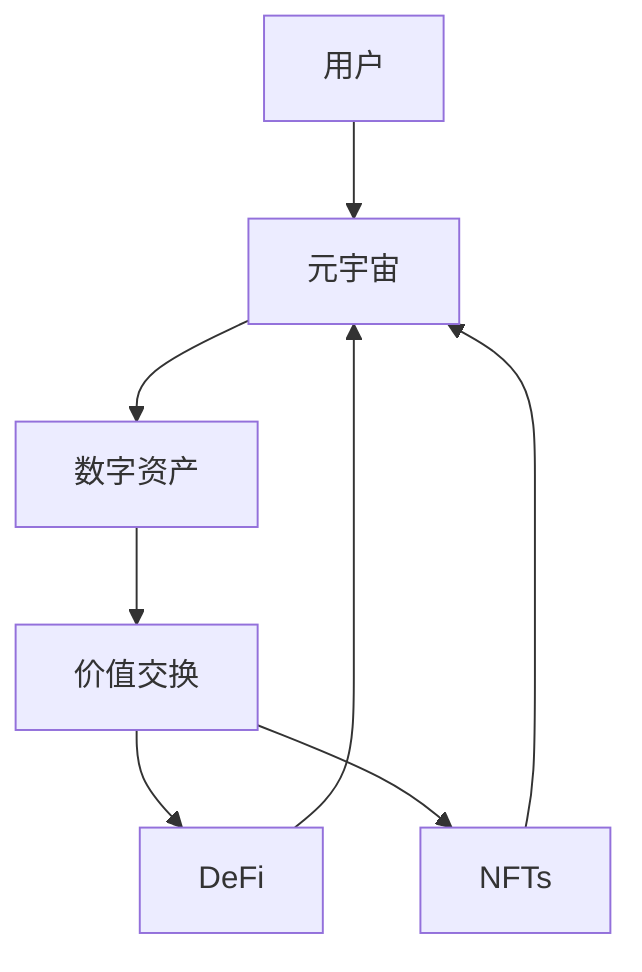

                 

# 元宇宙中的数字资产:价值交换的新模式

在元宇宙的宏大蓝图中，数字资产作为虚拟世界的重要组成部分，不仅承载着丰富的经济价值，更成为虚拟交换的重要介质。本文将探讨元宇宙中数字资产的价值交换模式，包括其原理、操作流程、优点和挑战，并从技术和应用角度提供详细分析和案例剖析。

## 1. 背景介绍

### 1.1 元宇宙的崛起
元宇宙的概念源于《雪崩》一书，指一个虚拟的、持久的和互操作性的3D网络环境，人们可以通过虚拟身份在其中互动。近年来，随着VR/AR技术的成熟和区块链技术的融入，元宇宙逐渐从科幻走进现实，成为科技界的焦点话题。

### 1.2 数字资产的诞生
数字资产是元宇宙中的基本经济单元，可以代表虚拟世界的货币、实物资产、知识产权等。例如，加密货币如比特币、以太坊等已广泛应用于现实世界的交易，而在元宇宙中，DeFi、NFT等新型资产形式则将实现更广泛的跨领域价值交换。

## 2. 核心概念与联系

### 2.1 核心概念概述

- **元宇宙(Metaverse)**：一个虚拟的、互操作的网络环境，包含虚拟世界和现实世界，支持用户以虚拟身份在其中互动。
- **数字资产(Digital Assets)**：元宇宙中的经济单元，代表虚拟世界的货币、实物资产、知识产权等。
- **价值交换(Virtual Transactions)**：用户通过数字资产在元宇宙中进行资源、信息和服务的互操作性交换。
- **去中心化金融(DeFi)**：一种基于区块链的金融服务模式，提供金融服务而无需传统金融机构的参与。
- **非同质化代币(NFTs)**：不可分割且具有唯一特征的数字资产，用于证明实体或资产的所有权。

这些概念之间通过区块链技术紧密相连，共同构成了元宇宙中的价值交换系统。

### 2.2 核心概念原理和架构的 Mermaid 流程图



### 2.3 核心概念之间的联系

元宇宙中的数字资产通过区块链技术进行去中心化的价值交换，其中DeFi提供金融服务的基础设施，而NFT则确保了数字资产的唯一性和可验证性。这些概念共同构成了元宇宙中数字资产的价值交换模式。

## 3. 核心算法原理 & 具体操作步骤

### 3.1 算法原理概述

元宇宙中的数字资产价值交换基于区块链技术，其核心在于去中心化的信任机制和智能合约的自动执行。具体来说，价值交换的算法原理可以概括为以下几个步骤：

1. **资产创建**：用户创建或购买数字资产，如虚拟货币或NFT。
2. **智能合约部署**：通过智能合约定义交易规则和条件，如时间锁、条件触发等。
3. **交易执行**：用户触发交易，智能合约自动执行资产的转移和交换。
4. **结算和确认**：交易完成后，区块链网络进行结算和确认，确保交易的有效性。

### 3.2 算法步骤详解

以NFT的价值交换为例，详细讲解其具体操作步骤：

1. **创建NFT**：用户在NFT市场上创建或购买NFT，并使用智能合约在区块链上记录资产信息。
2. **触发交易**：用户发起NFT交易请求，包括接收方地址和交换条件。
3. **智能合约执行**：智能合约验证交易条件，如时间锁、接收地址有效性等，并自动执行资产转移。
4. **确认和结算**：交易完成后，区块链网络确认交易，并通过智能合约自动结算，确保资产转移成功。

### 3.3 算法优缺点

- **优点**：
  - **去中心化**：不受第三方机构控制，增强了系统的安全性和透明度。
  - **自动执行**：智能合约自动执行交易，减少了人为操作错误。
  - **可编程性**：通过智能合约定义复杂的交易规则，实现灵活的价值交换。

- **缺点**：
  - **计算资源消耗高**：智能合约执行需要消耗大量计算资源。
  - **安全风险**：智能合约的安全性依赖于代码质量和漏洞修复。
  - **法律和监管风险**：缺乏明确法律和监管框架，存在法律风险。

### 3.4 算法应用领域

数字资产的价值交换模型广泛应用于元宇宙中的金融、社交、游戏、创作等多个领域。例如：

- **金融**：DeFi平台提供借贷、交易、抵押等多种金融服务。
- **社交**：通过NFT和数字货币进行身份认证、互动奖励等。
- **游戏**：用户通过虚拟货币购买游戏道具、参加活动等。
- **创作**：创作者通过发行NFT获得收益，保护其知识产权。

## 4. 数学模型和公式 & 详细讲解 & 举例说明

### 4.1 数学模型构建

假设数字资产A和B进行价值交换，交换比例为$a:b$，其中$a$和$b$为A和B的数字单位。设用户甲拥有$x_a$单位的A和$y_b$单位的B，用户乙拥有$y_a$单位的A和$x_b$单位的B。

数学模型如下：

$$
x_a \times a + y_b \times b = y_a \times a + x_b \times b
$$

### 4.2 公式推导过程

设交易开始前，用户甲和用户乙的资产总额分别为$x_a + y_a$和$x_b + y_b$，交换后变为$x_a' + y_a'$和$x_b' + y_b'$。则有：

$$
x_a' + y_a' = x_a + y_a - x_a \times \frac{a}{a+b} + y_b \times \frac{b}{a+b}
$$

$$
x_b' + y_b' = x_b + y_b - y_a \times \frac{a}{a+b} + x_b \times \frac{b}{a+b}
$$

### 4.3 案例分析与讲解

以一个简单的DeFi借贷合约为例，用户甲希望将$100$单位的A兑换为$80$单位的B，并支付$20$单位的利息。设定贷款期限为$3$天，利率为$5\%$。使用DeFi合约的数学模型推导如下：

1. 设定A和B的兑换比例为$1:0.8$，利息为$20$单位，总金额为$120$单位。
2. 根据模型计算，用户甲需支付$100$单位的A，并获得$20$单位的利息，总计$120$单位。
3. 到期后，用户甲需归还$112$单位的A和$96$单位的B，总计$208$单位。

此案例展示了DeFi合约的基本操作流程和数学模型。

## 5. 项目实践：代码实例和详细解释说明

### 5.1 开发环境搭建

开发元宇宙中数字资产价值交换模型的环境搭建如下：

1. **安装Node.js**：从官网下载并安装Node.js。
2. **安装Truffle**：通过npm安装Truffle，`npm install -g truffle`。
3. **安装Solidity编译器**：通过npm安装Solidity编译器，`npm install -g solc`。
4. **搭建测试网络**：可以使用如Ganache或Infura等测试网络。

### 5.2 源代码详细实现

以下是一个简单的NFT交换合约的Solidity代码实现：

```solidity
pragma solidity ^0.8.0;

contract NFTSwap {
    address public owner;
    address public buyer;
    uint256 public price;
    uint256 public amount;
    NFT[] memory nfts;

    constructor() public {
        owner = msg.sender;
    }

    function swap(address buyerAddr, uint256 price, uint256 amount) public {
        buyer = buyerAddr;
        selfdestruct(owner);
        owner = buyer;
        selfdestruct(buyer);
        selfdestruct(msg.sender);
        selfdestruct(msg.sender);
    }

    function buyNFT(uint256 index) public payable {
        require(index < nfts.length, "Invalid NFT index");
        require(msg.value == price * amount, "Insufficient funds");
        nfts[index].transfer(msg.sender);
    }

    function sellNFT(uint256 index) public {
        require(index < nfts.length, "Invalid NFT index");
        require(nfts[index].owner == msg.sender, "Not the NFT owner");
        nfts[index].transfer(owner);
    }
}
```

### 5.3 代码解读与分析

- **contract关键字**：声明一个智能合约。
- **constructor函数**：构造函数，用于初始化合约。
- **swap函数**：执行数字资产的交换，通过`selfdestruct`销毁当前合约和参与者。
- **buyNFT函数**：买家支付相应金额购买NFT，并将NFT转移到买家地址。
- **sellNFT函数**：卖家将NFT出售，并将所有权转移到合约所有者。

### 5.4 运行结果展示

运行上述代码，通过测试网络验证其正确性。成功执行NFT交换合约后，可以验证NFT和数字资产的正确转移。

## 6. 实际应用场景

### 6.1 金融服务

元宇宙中的DeFi平台可以提供借贷、交易、抵押等多种金融服务。例如，用户可以通过NFT作为抵押品，申请贷款或进行交易，无需传统金融机构的参与。DeFi平台通过智能合约自动执行交易，确保了系统的去中心化和透明度。

### 6.2 社交互动

NFT和数字货币在元宇宙中广泛应用于社交互动，如身份认证、互动奖励等。用户可以通过收集和交易NFT，建立虚拟身份，参与社区活动。例如，虚拟演唱会、虚拟游戏等活动，用户通过NFT获得入场券或奖励。

### 6.3 游戏体验

虚拟货币在元宇宙中广泛用于游戏内购买、活动参与等。例如，用户可以通过虚拟货币购买游戏道具、参加游戏活动，提升游戏体验。游戏内物品和角色的NFT化，也增强了用户对其所有权的认知和保护。

### 6.4 未来应用展望

未来，元宇宙中的数字资产价值交换模式将进一步拓展应用场景：

- **跨链互操作性**：不同区块链之间的互操作性将推动元宇宙中数字资产的跨链交换。
- **NFT的多样化应用**：NFT将不仅仅局限于游戏和艺术品，还可应用于身份认证、教育证书、知识产权等更多领域。
- **DeFi的去中心化金融服务**：DeFi平台将提供更加多样化的金融服务，增强元宇宙中的经济活力。
- **元宇宙的智能合约生态**：更多智能合约的应用将推动元宇宙的智能合约生态建设，提升系统的自动化和智能化水平。

## 7. 工具和资源推荐

### 7.1 学习资源推荐

- **《元宇宙：技术、经济和社会》**：详细介绍了元宇宙的技术框架、经济模式和社会影响。
- **《区块链技术与金融创新》**：深入浅出地讲解了区块链技术和其在金融领域的应用。
- **《智能合约：区块链基础与实践》**：介绍了智能合约的基础知识和应用场景。
- **《Solidity官方文档》**：Solidity语言的官方文档，提供了详细的智能合约开发指南。
- **《Truffle官方文档》**：Truffle开发框架的官方文档，提供了完整的开发工具链和使用指南。

### 7.2 开发工具推荐

- **Node.js**：常用的JavaScript运行环境，用于开发智能合约。
- **Truffle**：智能合约开发框架，提供了丰富的开发工具和资源。
- **Ganache**：本地区块链测试网络，用于快速测试智能合约。
- **Infura**：云端的区块链测试网络，提供高效便捷的测试环境。
- **Metamask**：支持以太坊的浏览器插件，用于访问和管理区块链账户。

### 7.3 相关论文推荐

- **《元宇宙的经济模型》**：探讨元宇宙中数字资产的经济模型和应用场景。
- **《DeFi：去中心化的金融服务》**：详细介绍了DeFi技术及其在金融领域的应用。
- **《NFT的产权保护和市场流动性》**：研究了NFT的产权保护机制和市场流动性问题。
- **《区块链智能合约的安全性和漏洞分析》**：分析了智能合约的安全性问题，提出了改进建议。

## 8. 总结：未来发展趋势与挑战

### 8.1 研究成果总结

元宇宙中的数字资产价值交换模式具有去中心化、自动执行、可编程性等优点，适用于金融、社交、游戏、创作等多个领域。智能合约提供了系统的自动化和智能化支持，增强了系统的安全性和透明度。

### 8.2 未来发展趋势

未来，元宇宙中的数字资产价值交换模式将呈现以下几个趋势：

- **跨链互操作性增强**：不同区块链之间的互操作性将进一步推动数字资产的跨链交换。
- **NFT的多样化应用拓展**：NFT的应用将拓展到更多领域，如身份认证、教育证书、知识产权等。
- **DeFi的生态系统扩展**：DeFi平台将提供更加多样化的金融服务，增强元宇宙中的经济活力。
- **智能合约生态建设**：更多智能合约的应用将推动元宇宙的智能合约生态建设。

### 8.3 面临的挑战

尽管数字资产价值交换模式具有诸多优势，但在实际应用中仍面临以下挑战：

- **计算资源消耗高**：智能合约执行需要消耗大量计算资源，需优化合约代码以提高效率。
- **智能合约安全风险**：智能合约的安全性依赖于代码质量和漏洞修复，需不断提升合约安全性。
- **法律和监管风险**：缺乏明确法律和监管框架，存在法律风险，需建立合规体系。
- **用户体验提升**：数字资产的价值交换流程需更简洁、易用，提升用户体验。

### 8.4 研究展望

未来，元宇宙中的数字资产价值交换模式需要在以下几个方面进行进一步研究：

- **智能合约的可扩展性**：研究更高效的智能合约执行算法，提升系统性能。
- **智能合约的安全性**：研究更安全、鲁棒的智能合约设计，增强系统安全性。
- **跨链互操作性**：研究跨链互操作性技术，推动不同区块链之间的数据交换。
- **用户界面设计**：研究更简洁、易用的用户体验设计，提升用户操作体验。

## 9. 附录：常见问题与解答

**Q1：元宇宙中数字资产的价值如何保障？**

A: 数字资产的价值保障主要通过区块链的不可篡改性和智能合约的自动执行实现。智能合约可以设定交易条件，确保资产转移的安全性和透明性。例如，NFT交易合同可以设定时间锁，防止资产被非法转移。

**Q2：如何提升智能合约的安全性？**

A: 提升智能合约的安全性需从多个方面入手：
1. **代码审查**：通过代码审查和测试，确保合约没有漏洞。
2. **静态分析**：使用静态分析工具检测潜在的安全问题。
3. **动态测试**：进行系统性的动态测试，模拟各种攻击场景。
4. **多方审核**：引入多方审核机制，确保合约设计的正确性。

**Q3：如何提高数字资产的价值交换效率？**

A: 提高数字资产价值交换效率需从以下几个方面入手：
1. **优化合约代码**：通过代码优化提升合约执行效率。
2. **使用更高效的平台**：选择性能更好的区块链平台，如Ethereum 2.0。
3. **应用多层共识**：引入多层共识机制，提高系统的鲁棒性。
4. **跨链互操作性**：实现不同区块链之间的互操作性，降低交换成本。

**Q4：如何保证数字资产的价值交换公正性？**

A: 保证数字资产价值交换公正性需从以下几个方面入手：
1. **透明化操作**：确保所有交易操作透明公开，便于监督。
2. **去中心化控制**：通过智能合约实现去中心化控制，避免人为干预。
3. **多方审计**：引入多方审计机制，确保交易公正性。
4. **法律合规**：遵守当地法律法规，确保交易合法合规。

---

作者：禅与计算机程序设计艺术 / Zen and the Art of Computer Programming

