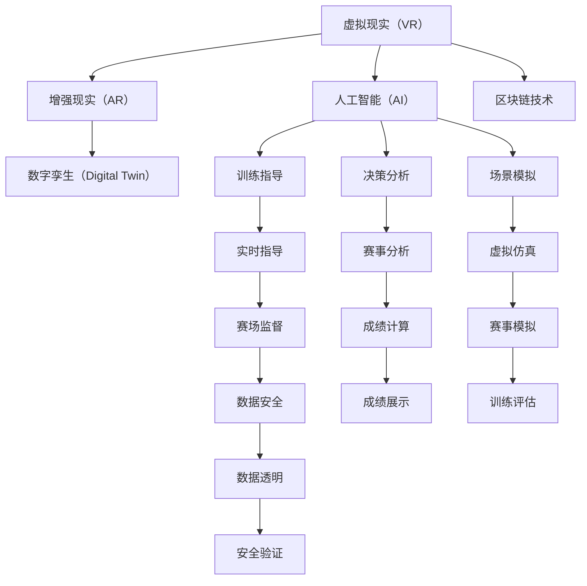

                 

# 元宇宙体育:虚实结合的竞技新形式

## 1. 背景介绍

### 1.1 问题由来

随着虚拟现实（VR）、增强现实（AR）、人工智能（AI）、区块链等技术的迅猛发展，元宇宙（Metaverse）的概念逐渐浮出水面，成为一个全新的数字时代。元宇宙被定义为一种虚拟的、共享的、沉浸式的网络空间，人们可以全方位参与其中，而不再受限于现实世界的物理限制。

体育作为人类最早的游戏形式之一，如今也开始借助元宇宙技术，开启虚实结合的竞技新模式。传统体育受制于场地、设备、时间、空间等因素，无法满足人们日益增长的运动需求和个性化体验。元宇宙体育，以数字形式呈现真实体育赛事，打破物理限制，使得随时随地参与成为可能，给体育竞技带来颠覆性的变革。

### 1.2 问题核心关键点

元宇宙体育的核心在于通过将现实体育赛事数字化，利用虚拟技术构建一个虚拟世界，使运动员、教练、观众能够在其中实现沉浸式互动，提升竞技体验，拓展体育活动的可能性。

元宇宙体育的关键点包括：

1. **虚拟场馆**：构建一个虚拟的体育赛事环境，使参与者可以在其中自由移动、互动，体验真实的竞赛氛围。
2. **虚拟教练**：通过AI技术实现虚拟教练的实时指导，使运动员的训练不受时间和空间的限制。
3. **虚拟观众**：利用VR、AR技术，使远程观众可以身临其境地观看比赛，享受现场观赛体验。
4. **虚拟积分与排名**：通过区块链技术实现运动员的虚拟积分和排名，保障比赛的公平性和透明性。
5. **虚拟物品与道具**：为参与者提供虚拟道具，增强互动性和趣味性，吸引更多用户参与。

这些关键点共同构成了元宇宙体育的技术基础，为其虚实结合的竞技新模式提供了实现可能。

### 1.3 问题研究意义

元宇宙体育的出现，不仅为体育产业带来了新的发展机遇，还为元宇宙技术的应用提供了广阔的空间。其研究意义包括：

1. **拓展体育竞技空间**：元宇宙体育打破了体育竞技的物理限制，使更多人能够参与其中，享受竞技的乐趣。
2. **推动技术创新**：元宇宙体育的实现需要跨学科技术的融合，包括虚拟现实、增强现实、人工智能、区块链等，促进了相关技术的发展。
3. **提升用户体验**：通过虚拟技术，元宇宙体育能够提供更加沉浸、个性化的体验，满足用户的不同需求。
4. **促进体育产业化**：元宇宙体育为体育产业的商业化和产业化提供了新的方向，打开了新的市场空间。

## 2. 核心概念与联系

### 2.1 核心概念概述

为更好地理解元宇宙体育的技术实现，本节将介绍几个关键概念及其联系：

- **虚拟现实（VR）**：利用计算机技术模拟出一个逼真的三维虚拟环境，让用户沉浸其中，体验虚拟世界。
- **增强现实（AR）**：将虚拟信息与现实环境相融合，使用户看到虚拟元素在现实世界中的叠加，增强现实体验。
- **人工智能（AI）**：通过机器学习、深度学习等技术，实现智能化的训练指导、决策分析、场景模拟等功能。
- **区块链技术**：通过分布式账本技术，实现数据的透明、安全、不可篡改，保障比赛的公平性和隐私性。
- **数字孪生（Digital Twin）**：创建一个与现实世界完全相同且能够实时更新的虚拟模型，用于训练、测试、仿真等场景。

这些概念之间相互联系，共同构成了元宇宙体育的技术框架。

### 2.2 核心概念原理和架构的 Mermaid 流程图



这个流程图展示了虚拟现实、增强现实、人工智能、区块链、数字孪生等核心概念的相互联系，及其在元宇宙体育中的应用。

## 3. 核心算法原理 & 具体操作步骤

### 3.1 算法原理概述

元宇宙体育的核心算法原理主要包括：

1. **虚拟场馆的构建**：利用3D建模和虚拟仿真技术，创建逼真的虚拟场馆，包括场地布局、物理环境、观众席等。
2. **虚拟教练的实现**：通过AI技术，训练虚拟教练，使其能够实时指导运动员的训练和比赛。
3. **虚拟观众的互动**：使用VR、AR技术，让远程观众能够身临其境地参与比赛，体验现场观赛氛围。
4. **虚拟积分与排名**：通过区块链技术，记录运动员的虚拟积分和排名，保障比赛的公平性和透明性。
5. **虚拟物品与道具**：设计虚拟物品和道具，增强比赛的趣味性和互动性，吸引更多用户参与。

这些算法原理共同支撑了元宇宙体育的虚实结合竞技模式。

### 3.2 算法步骤详解

以下是对元宇宙体育核心算法步骤的详细讲解：

#### 3.2.1 虚拟场馆的构建

1. **3D建模**：使用专业的3D建模软件，根据实际场馆的尺寸、布局、材质等进行建模。
2. **物理仿真**：将物理引擎应用于模型，模拟场馆的物理特性，如光线、声学、碰撞等。
3. **实时渲染**：使用GPU加速技术，实现场馆的实时渲染，保证用户的沉浸感。

#### 3.2.2 虚拟教练的实现

1. **数据收集**：收集现实教练的训练方法和策略，形成训练数据集。
2. **模型训练**：使用深度学习模型，如卷积神经网络（CNN）、长短期记忆网络（LSTM）等，对数据集进行训练。
3. **实时指导**：将训练好的模型应用到虚拟教练中，实时分析运动员的动作和状态，给出指导建议。

#### 3.2.3 虚拟观众的互动

1. **VR设备连接**：连接用户的VR设备，实现虚拟场馆与用户的互动。
2. **视角控制**：用户可以通过手柄、头部动作等控制自己的视角，查看场馆的不同角度。
3. **互动功能**：加入问答、投票、评论等互动功能，增强用户的参与感。

#### 3.2.4 虚拟积分与排名

1. **区块链平台搭建**：选择适合的区块链平台，如Ethereum、Polkadot等，搭建虚拟积分和排名的区块链平台。
2. **数据记录**：使用智能合约记录运动员的虚拟积分和排名，保证数据的透明性和不可篡改性。
3. **显示与查询**：提供用户界面，展示运动员的积分和排名，支持用户进行查询和验证。

#### 3.2.5 虚拟物品与道具

1. **物品设计**：设计符合比赛主题的虚拟物品和道具，如球、头盔、道具等。
2. **道具效果**：为物品和道具设定不同的效果，如增加速度、提高防御、变换形态等。
3. **互动使用**：允许运动员在比赛中使用虚拟物品和道具，增强比赛趣味性和互动性。

### 3.3 算法优缺点

元宇宙体育的算法具有以下优点：

1. **沉浸式体验**：虚拟现实和增强现实技术使得用户能够身临其境地参与比赛，体验逼真的竞技场景。
2. **个性化定制**：用户可以根据自身需求，自由定制虚拟场馆、教练、物品等，满足个性化的体验需求。
3. **随时随地参与**：不受时间和空间的限制，用户可以随时随地参与比赛，扩大了竞技的覆盖面。
4. **透明公平**：区块链技术保障了比赛的透明性和公平性，减少了人为干预的可能。

但同时也存在一些缺点：

1. **技术成本高**：元宇宙体育的实现需要投入大量技术和资源，包括3D建模、物理仿真、AI训练等，成本较高。
2. **技术门槛高**：技术实现需要跨学科的知识和技能，对开发者的技术水平要求较高。
3. **用户适应期长**：初次体验的用户可能需要一段时间适应虚拟环境，难以立刻获得沉浸式体验。
4. **数据安全风险**：用户的虚拟数据可能面临隐私泄露、数据篡改等安全风险，需要严格的数据保护措施。

### 3.4 算法应用领域

元宇宙体育的算法应用领域广泛，涵盖了多个方面：

1. **体育竞技**：包括足球、篮球、羽毛球、乒乓球等多种体育项目，可以在虚拟场馆中进行模拟比赛。
2. **电子竞技**：如《英雄联盟》《王者荣耀》等热门游戏，加入虚拟现实和增强现实元素，提升游戏体验。
3. **健身训练**：提供虚拟教练和虚拟物品，支持用户的健身训练和体能提升。
4. **虚拟赛事**：包括马拉松、极限运动、航模比赛等，在虚拟环境中进行模拟，提供更多的比赛机会。
5. **教育培训**：用于体育教育、技能培训等场景，通过虚拟教练和虚拟场景进行教学。

## 4. 数学模型和公式 & 详细讲解 & 举例说明

### 4.1 数学模型构建

假设现实场馆的坐标为 $(x,y,z)$，利用3D建模软件，构建虚拟场馆的模型，并应用物理引擎进行仿真。设仿真时间步长为 $\Delta t$，当前时间为 $t$，虚拟场馆的物理状态为 $x(t)$、$y(t)$、$z(t)$，则有：

$$
\begin{cases}
\dot{x}(t) = F_x(t) \\
\dot{y}(t) = F_y(t) \\
\dot{z}(t) = F_z(t)
\end{cases}
$$

其中，$F_x(t)$、$F_y(t)$、$F_z(t)$ 分别表示虚拟场馆在 $x$、$y$、$z$ 方向上的力，通过物理引擎计算得到。

### 4.2 公式推导过程

假设虚拟教练的训练模型为 $y=f(x)$，其中 $x$ 表示运动员的动作，$y$ 表示训练指导。则训练模型的公式推导如下：

$$
\min_{f} \sum_{i=1}^{N} (y_i - f(x_i))^2
$$

其中，$(y_i,f(x_i))$ 为训练样本，$N$ 为样本数量。使用最小二乘法求解 $f(x)$，得到最优的训练指导模型。

### 4.3 案例分析与讲解

以篮球比赛为例，分析元宇宙体育中虚拟教练的实现过程：

1. **数据收集**：收集现实教练的训练视频和指导语，将其转换为数字信号。
2. **特征提取**：使用CNN等深度学习模型，从视频中提取运动员的动作特征。
3. **模型训练**：使用LSTM等模型，对特征数据进行训练，建立训练指导模型。
4. **实时指导**：在比赛中，虚拟教练实时分析运动员的动作，使用训练模型输出指导建议。

## 5. 项目实践：代码实例和详细解释说明

### 5.1 开发环境搭建

在进行元宇宙体育开发前，需要准备开发环境。以下是使用Python进行PyTorch开发的环境配置流程：

1. 安装Anaconda：从官网下载并安装Anaconda，用于创建独立的Python环境。

2. 创建并激活虚拟环境：
```bash
conda create -n pytorch-env python=3.8 
conda activate pytorch-env
```

3. 安装PyTorch：根据CUDA版本，从官网获取对应的安装命令。例如：
```bash
conda install pytorch torchvision torchaudio cudatoolkit=11.1 -c pytorch -c conda-forge
```

4. 安装Transformers库：
```bash
pip install transformers
```

5. 安装各类工具包：
```bash
pip install numpy pandas scikit-learn matplotlib tqdm jupyter notebook ipython
```

完成上述步骤后，即可在`pytorch-env`环境中开始元宇宙体育的开发实践。

### 5.2 源代码详细实现

下面是使用PyTorch和Transformers库实现虚拟教练的Python代码实现：

```python
from transformers import BertForTokenClassification, AdamW
import torch
from transformers import BertTokenizer

# 定义虚拟教练模型
class VirtualCoach:
    def __init__(self, model_name):
        self.tokenizer = BertTokenizer.from_pretrained(model_name)
        self.model = BertForTokenClassification.from_pretrained(model_name, num_labels=6) # 动作分类为6类
    
    def forward(self, input_ids, attention_mask, labels):
        inputs = self.tokenizer(input_ids, return_tensors='pt', max_length=128, padding='max_length', truncation=True)
        output = self.model(inputs['input_ids'], attention_mask=inputs['attention_mask'])
        loss = self.model.loss(output.logits, labels)
        return loss

# 定义虚拟教练的训练函数
def train_vcoach(model, train_data, batch_size, optimizer, num_epochs):
    device = torch.device('cuda') if torch.cuda.is_available() else torch.device('cpu')
    model.to(device)

    for epoch in range(num_epochs):
        model.train()
        epoch_loss = 0
        for batch in train_data:
            input_ids = batch['input_ids'].to(device)
            attention_mask = batch['attention_mask'].to(device)
            labels = batch['labels'].to(device)
            loss = model.forward(input_ids, attention_mask, labels)
            epoch_loss += loss.item()
            optimizer.zero_grad()
            loss.backward()
            optimizer.step()

    return epoch_loss / len(train_data)

# 训练虚拟教练模型
tokenizer = BertTokenizer.from_pretrained('bert-base-cased')
model_name = 'bert-base-cased'

train_data = ...
train_loss = train_vcoach(model_name, train_data, batch_size=16, optimizer=AdamW(model_name.parameters(), lr=2e-5), num_epochs=5)
print(f'虚拟教练训练完成，损失为{train_loss:.4f}')
```

### 5.3 代码解读与分析

这里对虚拟教练代码的关键部分进行详细解读：

**VirtualCoach类**：
- `__init__`方法：初始化虚拟教练模型，包括分词器和模型本身。
- `forward`方法：前向传播，计算损失函数，返回损失值。

**训练函数train_vcoach**：
- 设置设备，将模型移动到GPU（如果可用）。
- 在每个epoch中，循环训练数据集。
- 在每个批次中，前向传播计算损失，反向传播更新模型参数。
- 累计epoch内的平均损失，返回训练结果。

**代码实现**：
- 利用BertTokenizer进行分词和编码。
- 使用BertForTokenClassification作为虚拟教练模型，定义动作分类标签。
- 训练函数调用虚拟教练模型的`forward`方法计算损失，并使用AdamW优化器进行模型参数更新。

**运行结果展示**：
- 训练完成后，输出虚拟教练的平均损失值。

## 6. 实际应用场景

### 6.1 智能健身

元宇宙体育在智能健身领域具有广泛的应用前景。用户可以在虚拟场馆中进行各种体育训练，如跑步、跳绳、健身操等。通过虚拟教练的实时指导，用户可以掌握正确的动作和姿势，提升训练效果。同时，虚拟积分和排名系统可以激励用户积极参与，提高健身积极性。

### 6.2 虚拟赛事

在虚拟赛事中，用户可以参与各种体育比赛，如足球、篮球、羽毛球等。虚拟场馆和增强现实技术使得用户能够身临其境地参与比赛，享受逼真的竞技体验。虚拟教练和虚拟观众的互动功能，增加了比赛的趣味性和参与感。

### 6.3 教育培训

元宇宙体育可以用于体育教育和技能培训。虚拟教练和虚拟场馆可以模拟各种训练环境和比赛场景，让学生和运动员在安全的虚拟环境中进行训练和比赛，提升技能水平。

### 6.4 未来应用展望

随着技术的不断进步，元宇宙体育将在未来迎来更多的应用场景和新的突破：

1. **沉浸式游戏**：将元宇宙体育与游戏结合，开发更加丰富多样的游戏内容，满足用户的娱乐需求。
2. **健康监测**：利用传感器技术，实时监测用户的运动数据，提供个性化的健康建议和训练方案。
3. **虚拟教练**：发展更加智能的虚拟教练，提供更加个性化和精准的训练指导，提升用户的训练效果。
4. **虚拟赛事管理**：利用区块链技术，实现比赛的透明管理和公平竞赛，提升赛事的公信力和影响力。
5. **跨界融合**：与其他领域的技术和应用结合，如虚拟现实、增强现实、人工智能等，创造更多的应用场景和创新模式。

## 7. 工具和资源推荐

### 7.1 学习资源推荐

为帮助开发者系统掌握元宇宙体育的技术基础和实践技巧，这里推荐一些优质的学习资源：

1. **《Unity与虚拟现实编程》**：该书详细介绍了Unity游戏引擎的虚拟现实编程，涵盖各种VR应用开发。
2. **《Unreal Engine VR/AR开发实战》**：该书介绍了Unreal Engine在游戏开发中的应用，包含大量虚拟现实和增强现实项目的案例分析。
3. **《Python深度学习》**：该书介绍了深度学习在图像识别、自然语言处理等方面的应用，结合元宇宙体育技术，提供了全面的学习框架。
4. **《区块链技术与应用》**：该书介绍了区块链技术的基本原理和应用场景，为元宇宙体育中区块链的应用提供了理论支持。
5. **《虚拟现实技术与应用》**：该书详细介绍了虚拟现实技术的原理和应用，为元宇宙体育的开发提供了技术基础。

通过对这些资源的学习实践，相信你一定能够快速掌握元宇宙体育的技术框架和实践技巧，并用于解决实际的元宇宙体育问题。

### 7.2 开发工具推荐

高效的开发离不开优秀的工具支持。以下是几款用于元宇宙体育开发的常用工具：

1. **Unity**：流行的游戏引擎，支持3D建模、物理仿真、增强现实等技术，广泛应用于元宇宙体育开发。
2. **Unreal Engine**：强大的游戏引擎，支持高级图形渲染和物理模拟，适合构建高品质的虚拟环境。
3. **PyTorch**：基于Python的深度学习框架，灵活高效，支持各种深度学习模型的实现。
4. **TensorFlow**：由Google主导的深度学习框架，生产部署方便，支持分布式训练。
5. **Transformers**：HuggingFace开发的NLP工具库，集成了各种预训练语言模型，支持自然语言处理任务。
6. **Keras**：高层次的深度学习框架，易于使用，适合初学者快速上手。

合理利用这些工具，可以显著提升元宇宙体育的开发效率，加快创新迭代的步伐。

### 7.3 相关论文推荐

元宇宙体育的研究源于学界的持续研究。以下是几篇奠基性的相关论文，推荐阅读：

1. **《元宇宙：新时代的数字时代》**：该论文讨论了元宇宙的原理和应用场景，为元宇宙体育的发展提供了理论支持。
2. **《虚拟现实与体育竞技的结合》**：该论文探讨了虚拟现实技术在体育竞技中的应用，提出了虚拟教练和虚拟观众的实现方法。
3. **《区块链技术在虚拟赛事中的应用》**：该论文介绍了区块链技术在赛事管理和数据透明中的应用，为元宇宙体育中区块链的应用提供了参考。
4. **《体育训练中的深度学习应用》**：该论文介绍了深度学习在体育训练中的应用，提出了虚拟教练和虚拟场馆的实现方法。
5. **《虚拟现实在体育教育中的应用》**：该论文探讨了虚拟现实技术在体育教育中的应用，提出了虚拟教练和虚拟场景的实现方法。

这些论文代表了大数据、区块链、虚拟现实等技术的最新进展，为元宇宙体育的发展提供了理论指导。

## 8. 总结：未来发展趋势与挑战

### 8.1 研究成果总结

本文对元宇宙体育的虚实结合竞技模式进行了全面系统的介绍。首先阐述了元宇宙体育的背景和研究意义，明确了其在拓展体育竞技空间、推动技术创新、提升用户体验等方面的独特价值。其次，从原理到实践，详细讲解了虚拟场馆、虚拟教练、虚拟观众、虚拟积分与排名等核心算法的实现过程，给出了元宇宙体育开发的完整代码实例。同时，本文还广泛探讨了元宇宙体育在智能健身、虚拟赛事、教育培训等多个领域的应用前景，展示了元宇宙体育技术的广阔前景。最后，本文精选了元宇宙体育的各类学习资源，力求为开发者提供全方位的技术指引。

通过本文的系统梳理，可以看到，元宇宙体育的虚实结合竞技模式正在成为体育竞技的新趋势，极大地拓展了体育竞技的空间和可能性，为体育产业带来了新的发展机遇。未来，伴随技术的不断进步，元宇宙体育必将在更多领域得到应用，为体育竞技和数字时代的发展注入新的动力。

### 8.2 未来发展趋势

展望未来，元宇宙体育的发展趋势包括：

1. **技术成熟度提升**：随着技术的发展和优化，元宇宙体育的虚实结合模式将更加成熟，用户体验将进一步提升。
2. **多模态融合**：元宇宙体育将与其他领域的技术和应用结合，如虚拟现实、增强现实、人工智能等，创造更多的应用场景和创新模式。
3. **跨界应用拓展**：元宇宙体育将应用于更多领域，如游戏、教育、健康等，成为数字化时代的通用应用。
4. **数据驱动**：利用大数据技术，实时分析用户数据，提供个性化的训练和比赛建议，提升用户参与度。
5. **智能分析**：引入人工智能技术，实现智能化的训练指导和比赛分析，提升竞技水平。
6. **跨界合作**：元宇宙体育将与其他领域的企业和组织合作，共同推动体育竞技和数字技术的发展。

### 8.3 面临的挑战

尽管元宇宙体育技术已经取得了瞩目成就，但在迈向更加智能化、普适化应用的过程中，它仍面临着诸多挑战：

1. **技术门槛高**：元宇宙体育的实现需要跨学科的知识和技能，对开发者的技术水平要求较高。
2. **设备成本高**：高质量的VR/AR设备价格较高，难以普及到更多用户。
3. **内容缺乏**：高质量的虚拟内容和比赛场景相对较少，影响用户的沉浸体验。
4. **网络稳定性**：虚拟内容的高质量传输需要稳定的网络连接，网络波动会影响用户的体验。
5. **数据安全**：用户的虚拟数据可能面临隐私泄露、数据篡改等安全风险，需要严格的数据保护措施。

### 8.4 研究展望

面对元宇宙体育面临的挑战，未来的研究需要在以下几个方面寻求新的突破：

1. **技术标准化**：制定元宇宙体育的行业标准和规范，提升技术的成熟度和可靠性。
2. **内容多样化**：开发更多高质量的虚拟内容和比赛场景，丰富用户的沉浸体验。
3. **设备普及**：降低VR/AR设备的成本，推动设备的普及和应用。
4. **网络优化**：优化虚拟内容传输的网络协议，提高网络稳定性。
5. **数据安全**：研究数据加密和隐私保护技术，保障用户数据的安全。

这些研究方向的探索，将推动元宇宙体育技术的发展和应用，为体育竞技和数字时代的发展提供新的动力。面向未来，元宇宙体育必将在体育竞技、数字娱乐、教育培训等多个领域发挥重要作用，成为数字化时代的创新引擎。

## 9. 附录：常见问题与解答

**Q1：元宇宙体育的虚拟场馆如何构建？**

A: 构建虚拟场馆需要以下几个步骤：
1. 使用3D建模软件，根据现实场馆的尺寸和布局，构建虚拟场馆的3D模型。
2. 应用物理引擎，模拟场馆的物理特性，如光线、声学、碰撞等。
3. 实时渲染虚拟场馆，保证用户的沉浸感。

**Q2：如何实现虚拟教练的实时指导？**

A: 实现虚拟教练的实时指导需要以下几个步骤：
1. 收集现实教练的训练视频和指导语，将其转换为数字信号。
2. 使用深度学习模型，如CNN、LSTM等，从视频中提取运动员的动作特征。
3. 训练深度学习模型，建立动作分类模型。
4. 实时分析运动员的动作，使用模型输出指导建议。

**Q3：元宇宙体育面临哪些技术挑战？**

A: 元宇宙体育面临以下技术挑战：
1. 技术门槛高，需要跨学科的知识和技能。
2. 设备成本高，高质量的VR/AR设备价格较高。
3. 内容缺乏，高质量的虚拟内容和比赛场景相对较少。
4. 网络稳定性，虚拟内容的高质量传输需要稳定的网络连接。
5. 数据安全，用户的虚拟数据可能面临隐私泄露、数据篡改等安全风险。

**Q4：元宇宙体育如何实现跨界应用？**

A: 元宇宙体育可以通过以下方式实现跨界应用：
1. 与其他领域的技术和应用结合，如虚拟现实、增强现实、人工智能等。
2. 应用于游戏、教育、健康等多个领域，创造新的应用场景和创新模式。
3. 与企业、组织合作，共同推动体育竞技和数字技术的发展。

**Q5：元宇宙体育如何保障数据安全？**

A: 元宇宙体育可以通过以下方式保障数据安全：
1. 研究数据加密和隐私保护技术，保障用户数据的安全。
2. 采用区块链技术，记录用户的虚拟数据，保障数据的透明性和不可篡改性。
3. 设立数据管理和安全审查机制，确保数据的合法使用和保护。

**Q6：元宇宙体育如何提升用户的参与度？**

A: 元宇宙体育可以通过以下方式提升用户的参与度：
1. 提供高质量的虚拟内容和比赛场景，增强用户的沉浸体验。
2. 实时分析用户数据，提供个性化的训练和比赛建议。
3. 引入智能化的训练指导和比赛分析，提升竞技水平。
4. 设立虚拟积分和排名系统，激励用户积极参与。

以上是对元宇宙体育技术实现过程中常见问题的解答，希望对你有所帮助。

