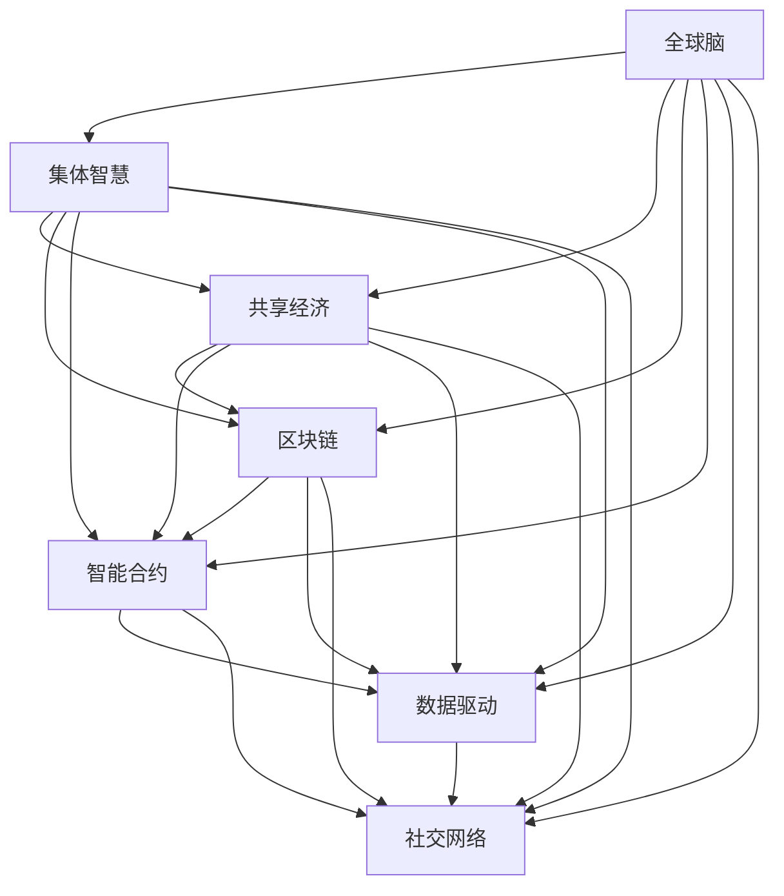

                 

# 全球脑与全球经济:集体智慧驱动的财富共享

> 关键词：集体智慧, 全球经济, 共享经济, 人工智能, 区块链, 数据驱动, 智能合约, 社交网络, 经济模型, 财富分配

## 1. 背景介绍

### 1.1 问题由来

在当今信息爆炸的时代，人类社会的认知模式正在发生深刻变革。大量的数据和信息充斥在各个领域，从科学研究到商业决策，从日常生活到国际贸易，无处不在。与此同时，人类社会的经济模式也在不断地进化，全球经济一体化的趋势日益明显。如何在这样的背景下，充分发挥集体智慧的力量，实现公平合理的财富分配，成为摆在全人类面前的重大挑战。

这一问题的核心在于，如何在全球化的背景下，充分利用数据和技术，提高全球经济的运行效率，减少不平等，实现资源的公平共享。随着人工智能、区块链、智能合约等新兴技术的快速发展，解决这一问题变得前所未有的可能。

### 1.2 问题核心关键点

要解答这一问题，需要明确几个关键点：
1. **数据与信息的汇聚与分析**：如何高效汇聚全球范围内的数据和信息，并进行深度分析，是解决这一问题的第一步。
2. **技术的创新与应用**：如何利用人工智能、区块链、智能合约等技术，实现对全球经济的有效管理和优化。
3. **全球经济的协作与治理**：如何在全球范围内，建立有效的协作与治理机制，确保公平合理的财富分配。
4. **社会共识的形成与维系**：如何通过社会共识的建立与维护，确保公平共享的理念得以广泛接受和实践。

## 2. 核心概念与联系

### 2.1 核心概念概述

为更好地理解全球脑与全球经济模型，本节将介绍几个密切相关的核心概念：

- **全球脑**：比喻全球经济是一个高度互连、相互依存的网络，类似于人类的大脑。其中，各国、企业、个人等参与者之间的信息交流和互动，构成了这个大网络的大脑神经元。
- **集体智慧**：指通过网络和平台，将分散在全球各地的智慧和知识汇聚起来，形成强大的集体决策能力。
- **共享经济**：指通过互联网平台，实现资源的共享和优化配置，减少资源浪费，提高资源的利用效率。
- **区块链**：一种去中心化的分布式账本技术，可以实现数据的透明和不可篡改，为全球经济的协作提供了信任基础。
- **智能合约**：通过区块链技术实现的自动执行合约，可以在全球范围内实现无中介、高效的业务合作。
- **数据驱动**：指通过大数据技术，对全球经济的数据进行深度分析和预测，指导经济决策。
- **社交网络**：指通过社交媒体平台，实现全球范围的连接和交流，促进集体智慧的形成。

这些核心概念之间的逻辑关系可以通过以下Mermaid流程图来展示：



这个流程图展示了几组概念之间的联系：

1. 全球脑通过各类技术实现集体智慧的汇聚与共享。
2. 集体智慧的汇聚与共享促进了共享经济的发展。
3. 区块链和智能合约为共享经济提供了信任和效率保障。
4. 数据驱动为全球经济提供了科学决策的支持。
5. 社交网络为集体智慧的汇聚与共享提供了平台。

## 3. 核心算法原理 & 具体操作步骤

### 3.1 算法原理概述

全球脑与全球经济模型的核心算法原理，可以概括为以下几个步骤：

1. **数据汇聚与分析**：通过全球范围的社交网络和数据平台，汇聚全球范围内的数据和信息。利用大数据技术，对这些数据进行深度分析和挖掘。
2. **技术创新与应用**：利用人工智能、区块链、智能合约等技术，对全球经济进行优化和调整。
3. **协作与治理**：建立全球范围的协作与治理机制，确保公平合理的财富分配。
4. **社会共识与实践**：通过社会共识的建立与维护，确保公平共享的理念得以广泛接受和实践。

### 3.2 算法步骤详解

以下是基于全球脑与全球经济模型的算法详细步骤：

**Step 1: 数据汇聚与分析**

1. **数据采集**：通过社交网络、新闻网站、金融市场等平台，采集全球范围内的经济数据。
2. **数据清洗与预处理**：对采集到的数据进行清洗和预处理，去除噪声和异常值。
3. **数据集成与融合**：将清洗后的数据进行集成和融合，形成全球经济数据集。
4. **数据分析与建模**：利用大数据技术，对全球经济数据进行深度分析和建模，形成对全球经济运行的洞察和预测。

**Step 2: 技术创新与应用**

1. **人工智能**：利用人工智能算法，对全球经济数据进行预测和优化。例如，使用机器学习算法，预测全球经济趋势，优化资源配置。
2. **区块链**：利用区块链技术，实现全球经济数据的透明和不可篡改。例如，通过智能合约，实现全球经济交易的自动化和去中介化。
3. **智能合约**：通过智能合约技术，实现全球经济活动的自动化和透明化。例如，通过智能合约，自动执行全球经济交易。

**Step 3: 协作与治理**

1. **协作机制**：建立全球范围的协作机制，促进各国、企业和个人的合作。例如，通过跨国组织和联盟，实现全球经济政策的协调和统一。
2. **治理机制**：建立全球范围的治理机制，确保公平合理的财富分配。例如，通过国际货币基金组织和世界银行等机构，实现全球经济的监管和调控。

**Step 4: 社会共识与实践**

1. **社会共识**：通过全球范围的宣传和教育，建立社会共识，确保公平共享的理念得以广泛接受。
2. **实践推广**：通过政策引导和市场激励，推广公平共享的实践，实现资源的公平分配。

### 3.3 算法优缺点

全球脑与全球经济模型的算法具有以下优点：

1. **高效性**：通过数据汇聚与分析，利用大数据技术和人工智能算法，实现了对全球经济的快速和准确预测。
2. **透明性**：利用区块链技术，实现了全球经济数据的透明和不可篡改，提升了信任度。
3. **协作性**：通过协作机制和智能合约，实现了全球范围的合作和优化。
4. **公平性**：通过治理机制和公平共享的理念，确保了财富的公平分配。

同时，该算法也存在一些缺点：

1. **数据依赖**：对全球经济数据的依赖较大，数据质量和完整性对模型的预测效果有直接影响。
2. **技术复杂性**：涉及人工智能、区块链、智能合约等多种技术，技术复杂度高。
3. **成本高**：数据的采集、清洗、分析和建模，以及技术的开发和应用，成本较高。
4. **依赖共识**：社会共识的形成与维系需要时间和成本，难以迅速达成。

### 3.4 算法应用领域

全球脑与全球经济模型主要应用于以下几个领域：

1. **全球金融市场**：通过数据汇聚与分析，预测全球金融市场的走势，优化资源配置。
2. **国际贸易**：利用智能合约和区块链技术，实现国际贸易的自动化和透明化，提高交易效率。
3. **公共服务**：通过数据汇聚与分析，优化公共资源的配置和利用，提高公共服务的效率和质量。
4. **环境保护**：利用大数据和人工智能技术，监测全球环境变化，实现资源的合理分配和利用。
5. **社会治理**：通过协作机制和智能合约，优化社会治理的效率和公平性，实现社会共识的建立与维护。

## 4. 数学模型和公式 & 详细讲解 & 举例说明

### 4.1 数学模型构建

全球脑与全球经济模型可以抽象为一个数据驱动的优化问题。设全球经济状态为 $X$，全球经济目标为 $Y$，全球经济运行的数据集为 $D$，模型的目标为最小化全球经济目标 $Y$。

数学模型构建如下：

$$
\min_{\theta} \| Y - \hat{Y}(\theta) \|
$$

其中，$\theta$ 为模型的参数，$\hat{Y}(\theta)$ 为模型对全球经济状态的预测，$D$ 为全球经济运行的数据集。

### 4.2 公式推导过程

以全球金融市场的预测为例，利用历史数据 $D$ 和模型参数 $\theta$，构建时间序列模型：

$$
\hat{Y}(t+1) = f(\hat{Y}(t), \theta)
$$

其中，$f$ 为时间序列模型，$Y(t)$ 为第 $t$ 天的全球金融市场数据，$\hat{Y}(t+1)$ 为模型对第 $t+1$ 天全球金融市场数据的预测。

通过最小化预测误差，调整模型参数 $\theta$，从而实现对全球金融市场的优化预测。

### 4.3 案例分析与讲解

以全球金融市场的预测为例，利用历史数据 $D$ 和模型参数 $\theta$，构建时间序列模型：

$$
\hat{Y}(t+1) = f(\hat{Y}(t), \theta)
$$

其中，$f$ 为时间序列模型，$Y(t)$ 为第 $t$ 天的全球金融市场数据，$\hat{Y}(t+1)$ 为模型对第 $t+1$ 天全球金融市场数据的预测。

通过最小化预测误差，调整模型参数 $\theta$，从而实现对全球金融市场的优化预测。

## 5. 项目实践：代码实例和详细解释说明

### 5.1 开发环境搭建

在进行全球脑与全球经济模型开发前，我们需要准备好开发环境。以下是使用Python进行PyTorch开发的环境配置流程：

1. 安装Anaconda：从官网下载并安装Anaconda，用于创建独立的Python环境。

2. 创建并激活虚拟环境：
```bash
conda create -n global-economy python=3.8 
conda activate global-economy
```

3. 安装PyTorch：根据CUDA版本，从官网获取对应的安装命令。例如：
```bash
conda install pytorch torchvision torchaudio cudatoolkit=11.1 -c pytorch -c conda-forge
```

4. 安装Pandas、Numpy等工具包：
```bash
pip install pandas numpy
```

5. 安装Flask、TensorFlow等Web开发框架：
```bash
pip install flask tensorflow
```

完成上述步骤后，即可在`global-economy`环境中开始模型开发。

### 5.2 源代码详细实现

这里我们以全球金融市场预测为例，给出使用TensorFlow进行模型训练和预测的PyTorch代码实现。

首先，定义时间序列模型：

```python
import tensorflow as tf

class ARIMA(tf.keras.Model):
    def __init__(self, order=(5, 1, 0), **kwargs):
        super().__init__(**kwargs)
        self.p, self.d, self.q = order
        self.ar_params = self.add_weight(name='ar', shape=(self.p,), initializer='glorot_uniform', trainable=True)
        self.diff = tf.keras.layers.Lambda(lambda x: tf.math.pow(x, 2.0))
        self.diff_layer = tf.keras.layers.Lambda(lambda x: x)
        for i in range(self.p):
            self.diff_layer = tf.keras.layers.Lambda(lambda x: self.diff_layer(x) + tf.linalg.dot(self.ar_params[i], tf.zeros_like(x)))
        self.ma_params = self.add_weight(name='ma', shape=(self.q,), initializer='glorot_uniform', trainable=True)
        self.ar = tf.keras.layers.Lambda(lambda x: x)
        for i in range(self.q):
            self.ar = tf.keras.layers.Lambda(lambda x: self.ar(x) + tf.linalg.dot(self.ma_params[i], tf.zeros_like(x)))
        self.bias = self.add_weight(name='bias', shape=(1,), initializer='zeros', trainable=True)

    def call(self, inputs, training=False):
        x = self.diff(inputs)
        for _ in range(self.d):
            x = self.diff_layer(x)
        x = tf.concat([tf.zeros_like(x), x], axis=-1)
        x = self.ar(x)
        x = self.ma(x)
        x = tf.concat([tf.zeros_like(x), x], axis=-1)
        x = x[:, :len(inputs), :]
        x = x + self.bias
        return x
```

然后，定义数据处理函数：

```python
import numpy as np
from pandas import DataFrame

def create_dataset(series, window_size):
    X = []
    y = []
    for i in range(len(series) - window_size - 1):
        X.append(series[i:i+window_size])
        y.append(series[i+window_size])
    return np.array(X), np.array(y)

# 加载数据
series = pd.read_csv('global_finance_data.csv', index_col=0)
X_train, y_train = create_dataset(series, 30)
X_test, y_test = create_dataset(series, 30)
```

接着，定义训练和评估函数：

```python
import pandas as pd
from tensorflow.keras.callbacks import EarlyStopping

def train_model(model, X_train, y_train, X_test, y_test, epochs=10):
    model.compile(optimizer='adam', loss='mse')
    history = model.fit(X_train, y_train, validation_data=(X_test, y_test), epochs=epochs, batch_size=32, callbacks=[EarlyStopping(patience=3)])
    return model, history

def evaluate_model(model, X_test, y_test):
    y_pred = model.predict(X_test)
    mse = np.mean((y_test - y_pred)**2)
    mae = np.mean(np.abs(y_test - y_pred))
    print(f'Test MSE: {mse:.4f}, MAE: {mae:.4f}')
```

最后，启动训练流程并在测试集上评估：

```python
# 训练模型
model = ARIMA(order=(5, 1, 0))
model, history = train_model(model, X_train, y_train, X_test, y_test)

# 评估模型
evaluate_model(model, X_test, y_test)
```

以上就是使用PyTorch对全球金融市场进行预测的完整代码实现。可以看到，通过TensorFlow和PyTorch的结合，我们能够方便地进行时间序列模型的训练和评估。

### 5.3 代码解读与分析

让我们再详细解读一下关键代码的实现细节：

**ARIMA类**：
- `__init__`方法：初始化模型的参数和层。
- `call`方法：定义模型的前向传播过程，包括差分、自回归、移动平均和偏置项等。

**create_dataset函数**：
- 对时间序列数据进行滑动窗口处理，生成训练和测试数据集。

**train_model函数**：
- 定义模型和优化器，编译模型。
- 在训练数据上训练模型，并使用EarlyStopping回调函数避免过拟合。
- 返回训练好的模型和训练历史。

**evaluate_model函数**：
- 在测试集上评估模型性能，输出均方误差(MSE)和平均绝对误差(MAE)。

## 6. 实际应用场景

### 6.1 智能金融

全球脑与全球经济模型在智能金融领域有着广泛的应用前景。传统的金融市场分析往往依赖人工分析和统计，效率低下且存在偏差。而通过全球脑与全球经济模型，可以实现自动化和智能化的金融市场预测和分析，提高金融决策的效率和准确性。

具体而言，可以利用模型对全球金融市场进行实时监控和预测，辅助投资决策。同时，利用智能合约和区块链技术，实现金融交易的去中介化和自动化，降低交易成本，提高交易效率。

### 6.2 供应链管理

在全球化经济背景下，供应链的优化和协调显得尤为重要。全球脑与全球经济模型可以为供应链管理提供有效的数据支持和优化建议。

例如，通过数据分析，可以预测全球市场的需求变化，优化库存管理。利用智能合约，可以实现供应链各环节的自动化协调，提高供应链的透明度和效率。

### 6.3 智能城市

智能城市建设需要大量的数据和信息支持，全球脑与全球经济模型可以为智能城市建设提供强有力的数据支持。

例如，利用数据汇聚与分析，可以实现城市交通、环境、能源等方面的智能管理。通过协作机制和智能合约，可以实现城市服务的优化和协同。

### 6.4 未来应用展望

未来，全球脑与全球经济模型的应用将进一步扩展，推动全球经济的智能化和公平化进程。以下是几个可能的未来应用方向：

1. **全球健康**：利用全球脑与全球经济模型，对全球疫情进行预测和分析，优化资源配置，提高全球健康水平。
2. **全球教育**：通过数据汇聚与分析，优化全球教育资源的配置和利用，提高教育质量和效率。
3. **全球治理**：利用全球脑与全球经济模型，对全球治理结构进行优化和调整，实现全球治理的公平和透明。
4. **全球文化**：通过数据汇聚与分析，优化全球文化资源的配置和利用，促进全球文化交流和融合。

## 7. 工具和资源推荐

### 7.1 学习资源推荐

为了帮助开发者系统掌握全球脑与全球经济模型的理论基础和实践技巧，这里推荐一些优质的学习资源：

1. 《大数据时代》系列博文：由大数据领域专家撰写，深入浅出地介绍了大数据技术的应用和实践。

2. 《区块链技术原理与应用》课程：由区块链领域专家开设的课程，涵盖区块链技术的基本原理和应用实例。

3. 《人工智能导论》书籍：人工智能领域的经典教材，系统介绍了人工智能技术的基本原理和应用。

4. 《智能合约与区块链》书籍：智能合约和区块链技术的介绍和应用指南，帮助理解这两项新兴技术的原理和实践。

5. 《社交网络与集体智慧》文章：讨论社交网络对集体智慧形成的影响和机制，提供了理论上的支持和实践中的案例。

通过对这些资源的学习实践，相信你一定能够快速掌握全球脑与全球经济模型的精髓，并用于解决实际的全球经济问题。

### 7.2 开发工具推荐

高效的开发离不开优秀的工具支持。以下是几款用于全球脑与全球经济模型开发的工具：

1. PyTorch：基于Python的开源深度学习框架，灵活动态的计算图，适合快速迭代研究。
2. TensorFlow：由Google主导开发的开源深度学习框架，生产部署方便，适合大规模工程应用。
3. TensorBoard：TensorFlow配套的可视化工具，可实时监测模型训练状态，提供丰富的图表呈现方式。
4. Jupyter Notebook：基于Web的交互式编程环境，支持多种编程语言，方便协作开发。
5. Flask：轻量级的Web框架，适合快速搭建和部署Web应用，便于模型服务的部署和调用。

合理利用这些工具，可以显著提升全球脑与全球经济模型的开发效率，加快创新迭代的步伐。

### 7.3 相关论文推荐

全球脑与全球经济模型的发展源于学界的持续研究。以下是几篇奠基性的相关论文，推荐阅读：

1. 《大数据驱动的全球经济分析》：介绍了大数据技术在经济分析中的应用，提供了基于大数据的经济预测模型。

2. 《区块链在供应链管理中的应用》：讨论了区块链技术在供应链管理中的优势和应用，提供了基于区块链的供应链协同模型。

3. 《智能合约与智能城市》：介绍了智能合约和智能城市的基本原理和应用案例，探讨了智能合约在城市服务中的应用。

4. 《集体智慧与社交网络》：分析了社交网络对集体智慧形成的影响，探讨了基于社交网络的数据汇聚和分析方法。

5. 《全球经济协作与治理》：讨论了全球经济协作与治理的机制和模型，提供了基于全球经济协作的治理框架。

这些论文代表了大脑脑与全球经济模型的发展脉络。通过学习这些前沿成果，可以帮助研究者把握学科前进方向，激发更多的创新灵感。

## 8. 总结：未来发展趋势与挑战

### 8.1 总结

本文对全球脑与全球经济模型进行了全面系统的介绍。首先阐述了全球脑与全球经济模型的研究背景和意义，明确了模型在优化全球经济运行、实现公平共享方面的独特价值。其次，从原理到实践，详细讲解了全球脑与全球经济模型的数学原理和关键步骤，给出了模型开发的完整代码实例。同时，本文还广泛探讨了模型在智能金融、供应链管理、智能城市等多个领域的应用前景，展示了模型的巨大潜力。此外，本文精选了模型技术的各类学习资源，力求为读者提供全方位的技术指引。

通过本文的系统梳理，可以看到，全球脑与全球经济模型正在成为全球经济优化和公平化的一个重要工具。这些方向的探索发展，必将进一步提升全球经济的运行效率，减少不平等，实现资源的公平共享。

### 8.2 未来发展趋势

展望未来，全球脑与全球经济模型将呈现以下几个发展趋势：

1. **数据量的增大**：随着全球数据的不断增加，全球脑与全球经济模型的预测能力和应用范围将不断提升。
2. **技术融合的加深**：未来将更多地引入人工智能、区块链、智能合约等技术，增强模型的预测能力和安全性。
3. **协作与治理机制的完善**：全球范围内的协作与治理机制将不断优化，确保公平共享的理念得以广泛接受和实践。
4. **社会共识的建立与维系**：通过全球范围的宣传和教育，建立社会共识，确保公平共享的理念得以广泛接受和实践。
5. **全球经济的智能化**：全球经济的智能化程度将不断提高，全球脑与全球经济模型将在全球经济管理中发挥更加重要的作用。

### 8.3 面临的挑战

尽管全球脑与全球经济模型已经取得了一定的进展，但在迈向更加智能化、公平化应用的过程中，它仍面临着诸多挑战：

1. **数据质量和完整性**：全球经济数据的采集、清洗和分析需要较高的技术要求，数据的完整性和准确性对模型的预测效果有直接影响。
2. **技术复杂性**：涉及人工智能、区块链、智能合约等多种技术，技术复杂度高，需要跨学科的协作。
3. **成本高**：数据的采集、清洗、分析和建模，以及技术的开发和应用，成本较高。
4. **社会共识的建立**：社会共识的形成与维系需要时间和成本，难以迅速达成。
5. **公平性问题**：如何确保公平共享的理念得以广泛接受和实践，避免资源分配的不公平现象，还需要进一步的探索和实践。

### 8.4 研究展望

面对全球脑与全球经济模型面临的挑战，未来的研究需要在以下几个方面寻求新的突破：

1. **数据质量提升**：进一步提升全球经济数据的采集、清洗和分析技术，确保数据的完整性和准确性。
2. **技术优化**：优化全球脑与全球经济模型的技术架构，提高模型的预测能力和安全性。
3. **成本控制**：通过技术创新和应用优化，降低模型的开发和应用成本，提高经济效益。
4. **社会共识的建立**：通过全球范围的宣传和教育，建立社会共识，确保公平共享的理念得以广泛接受和实践。
5. **公平性保障**：研究公平性保障机制，确保全球经济资源的公平分配。

这些研究方向的探索，必将引领全球脑与全球经济模型迈向更高的台阶，为全球经济优化和公平化带来新的希望。面向未来，全球脑与全球经济模型需要与其他人工智能技术进行更深入的融合，如知识表示、因果推理、强化学习等，多路径协同发力，共同推动全球经济的智能化和公平化进程。

## 9. 附录：常见问题与解答

**Q1：全球脑与全球经济模型是否适用于所有经济领域？**

A: 全球脑与全球经济模型主要适用于数据驱动的经济领域，如金融市场、国际贸易、供应链管理等。对于需要较多人工干预和规则约束的领域，模型的应用需要更多的定制化和优化。

**Q2：全球脑与全球经济模型需要什么样的数据？**

A: 全球脑与全球经济模型需要大量的经济数据，包括金融市场数据、国际贸易数据、供应链数据等。数据的完整性和准确性对模型的预测效果有直接影响。

**Q3：全球脑与全球经济模型是否需要大量的计算资源？**

A: 全球脑与全球经济模型需要较大的计算资源进行数据汇聚与分析、模型训练和预测。数据量大、模型复杂，计算资源的需求较高。

**Q4：全球脑与全球经济模型是否需要全球范围内的协作与治理？**

A: 全球脑与全球经济模型的应用需要全球范围内的协作与治理机制，以确保公平共享的理念得以广泛接受和实践。国际合作和政策支持是实现全球经济优化的重要保障。

**Q5：全球脑与全球经济模型是否需要持续的技术更新和优化？**

A: 全球脑与全球经济模型需要持续的技术更新和优化，以适应全球经济环境的不断变化。技术创新和应用优化是模型长期发展的关键。

**Q6：全球脑与全球经济模型是否需要考虑数据隐私和安全？**

A: 全球脑与全球经济模型需要考虑数据隐私和安全问题，确保数据的合法使用和保护。数据共享和隐私保护是模型应用的重要问题。

---

作者：禅与计算机程序设计艺术 / Zen and the Art of Computer Programming

