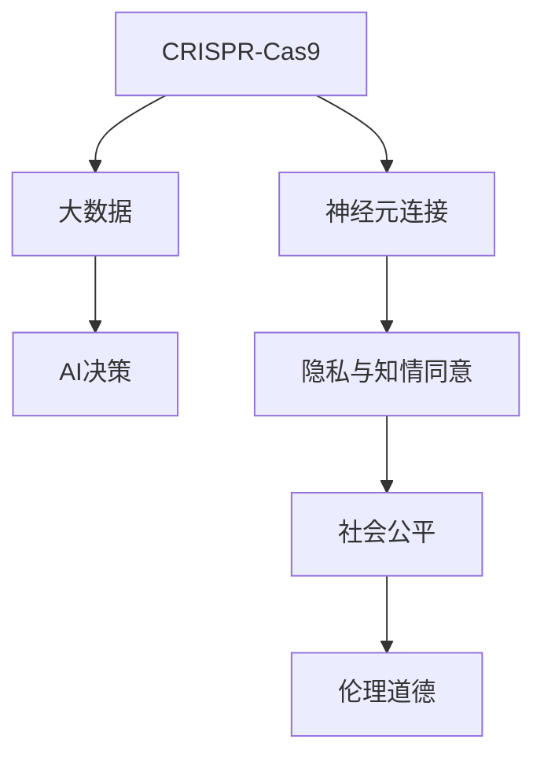

                 

# 全球脑与基因编辑:集体决策的伦理挑战

> 关键词：脑-基因编辑, 集体决策, 伦理, 大数据, AI决策, 隐私

## 1. 背景介绍

### 1.1 问题由来
随着基因编辑技术的快速发展，CRISPR-Cas9等工具已经被广泛应用到生物医学研究中。这些技术不仅能够治疗遗传性疾病，还能对大脑进行结构性的修改，改善认知功能。然而，这种脑-基因编辑技术（Brain-Genetic Editing, BGE）的发展也引发了一系列伦理和社会问题。

脑-基因编辑技术的应用带来了前所未有的机会，同时也伴随着巨大的风险。它不仅可能改变个体的基因构成，还可能影响到人类社会的结构和决策方式。如何在大数据和AI决策的驱动下，合理应用脑-基因编辑技术，成为了一个亟待解决的问题。

### 1.2 问题核心关键点
脑-基因编辑技术在应用过程中涉及多个关键点，包括技术安全、个体隐私、社会公平和伦理道德。这些问题需要从多个维度进行综合考虑和解决，确保技术的应用既能带来福利，又不会带来新的问题。

本文将详细探讨脑-基因编辑技术在全球范围内的集体决策过程中的伦理挑战，并通过数据分析和案例研究，提出一些可能的解决方案。

### 1.3 问题研究意义
脑-基因编辑技术的伦理问题，不仅影响到科学研究和医疗实践，还影响到社会政策的制定和实施。合理应用脑-基因编辑技术，既能造福人类，又能保障社会公平和伦理道德，具有重要的理论和实践意义。

1. 保障个体权益：在脑-基因编辑过程中，必须确保个体的知情同意和隐私保护，避免技术的滥用。
2. 促进社会公平：脑-基因编辑技术的普及和应用，应避免加剧社会不平等，确保所有人都有平等获得技术的机会。
3. 维护伦理道德：在技术发展的过程中，必须遵守伦理道德规范，避免技术带来的负面社会影响。
4. 推动法规完善：脑-基因编辑技术的应用需要法律法规的规范和指导，确保技术应用的安全性和合法性。
5. 促进国际合作：脑-基因编辑技术的应用具有全球性，需要各国之间的合作和协调。

## 2. 核心概念与联系

### 2.1 核心概念概述

脑-基因编辑技术（Brain-Genetic Editing, BGE）是指通过基因编辑工具对大脑进行结构性修改，改善认知功能的一种技术。其核心原理是通过CRISPR-Cas9等工具对大脑中的神经元进行精准的基因编辑，改变神经元之间的连接方式，从而改善认知功能。

脑-基因编辑技术涉及多个核心概念，包括：

1. **CRISPR-Cas9技术**：一种基因编辑工具，能够精准地修改DNA序列，广泛应用于生物医学研究。
2. **神经元连接**：神经元之间通过突触进行信息传递，脑-基因编辑技术能够改变神经元之间的连接方式，影响认知功能。
3. **大数据与AI决策**：在脑-基因编辑过程中，需要处理大量的基因数据，并利用AI技术进行数据分析和决策。
4. **隐私与知情同意**：在脑-基因编辑过程中，需要保护个体的隐私，并获得其知情同意。
5. **社会公平与伦理道德**：脑-基因编辑技术的普及和应用，应避免加剧社会不平等，并遵守伦理道德规范。

这些核心概念之间的逻辑关系可以通过以下Mermaid流程图来展示：



这个流程图展示了大脑基因编辑技术的主要组成部分及其之间的联系：

1. CRISPR-Cas9技术是基础工具，用于精准修改神经元连接。
2. 大数据和AI决策技术用于分析和决策，以指导脑-基因编辑的应用。
3. 隐私和知情同意是脑-基因编辑过程中的伦理要求，保护个体权益。
4. 社会公平是脑-基因编辑技术普及应用的目标之一，避免加剧不平等。
5. 伦理道德是脑-基因编辑技术的核心规范，确保技术应用的合法性和安全性。

## 3. 核心算法原理 & 具体操作步骤

### 3.1 算法原理概述

脑-基因编辑技术的集体决策过程，涉及多个环节，包括技术评估、伦理审查、社会影响评估等。这些环节需要综合考虑技术、伦理和社会因素，进行全面评估和决策。

脑-基因编辑技术的集体决策过程包括以下几个核心步骤：

1. **技术评估**：评估脑-基因编辑技术的安全性和有效性，包括技术原理、实验数据和临床试验结果。
2. **伦理审查**：评估脑-基因编辑技术的伦理问题，包括隐私保护、知情同意和社会公平等。
3. **社会影响评估**：评估脑-基因编辑技术对社会的影响，包括社会不平等、伦理道德和法律合规等。
4. **决策与实施**：基于上述评估结果，进行集体决策，制定技术应用策略和实施计划。
5. **监测与反馈**：对技术应用进行持续监测和反馈，及时调整策略，确保技术应用的合法性和安全性。

### 3.2 算法步骤详解

脑-基因编辑技术的集体决策过程，可以概括为以下步骤：

1. **数据收集与整理**：收集脑-基因编辑技术的相关数据，包括技术原理、实验数据和伦理问题等。
2. **专家评估**：邀请多学科专家对收集到的数据进行全面评估，包括技术安全、伦理问题和法律合规等。
3. **公众参与**：通过问卷调查、公开听证等方式，收集公众对脑-基因编辑技术的意见和建议。
4. **数据分析与决策**：利用大数据和AI技术，对收集到的数据进行分析和建模，得出决策依据。
5. **政策制定与实施**：根据分析结果，制定技术应用策略和实施计划，并进行推广和实施。
6. **监测与反馈**：对技术应用进行持续监测和反馈，及时调整策略，确保技术应用的合法性和安全性。

### 3.3 算法优缺点

脑-基因编辑技术的集体决策方法具有以下优点：

1. **全面评估**：通过多学科专家的参与，能够全面评估脑-基因编辑技术的各个方面，确保技术应用的科学性和安全性。
2. **公众参与**：通过公众参与，能够听取不同群体的意见和建议，确保决策的公平性和民主性。
3. **数据驱动**：利用大数据和AI技术，对数据进行全面分析和建模，确保决策的科学性和客观性。

然而，该方法也存在一些局限性：

1. **数据获取困难**：收集全面的脑-基因编辑技术数据可能存在困难，影响评估结果的全面性和准确性。
2. **专家意见分歧**：不同专家之间可能存在意见分歧，影响决策的科学性和客观性。
3. **公众参与难度大**：公众对脑-基因编辑技术的理解和认知不足，可能影响其参与效果。
4. **隐私保护问题**：在数据收集和处理过程中，可能存在隐私保护问题，影响决策的公平性和合法性。
5. **法律合规问题**：脑-基因编辑技术的应用需要符合法律法规，决策过程中可能存在法律合规问题。

### 3.4 算法应用领域

脑-基因编辑技术的集体决策方法，已经在多个领域得到了应用，包括：

1. **医疗应用**：在脑-基因编辑技术应用于医学治疗时，需要进行技术评估和伦理审查，以确保技术的安全性和有效性。
2. **公共卫生**：在脑-基因编辑技术应用于公共卫生时，需要进行社会影响评估和政策制定，以确保技术的公平性和合法性。
3. **教育领域**：在脑-基因编辑技术应用于教育时，需要进行伦理审查和社会影响评估，以确保技术应用的公平性和合法性。
4. **司法系统**：在脑-基因编辑技术应用于司法时，需要进行技术评估和伦理审查，以确保技术的合法性和安全性。
5. **人工智能**：在脑-基因编辑技术应用于人工智能时，需要进行技术评估和伦理审查，以确保技术应用的科学性和安全性。

## 4. 数学模型和公式 & 详细讲解 & 举例说明（备注：数学公式请使用latex格式，latex嵌入文中独立段落使用 $$，段落内使用 $)
### 4.1 数学模型构建

脑-基因编辑技术的集体决策过程，可以构建如下数学模型：

1. **技术评估模型**：
   $$
   S(T) = f_{S}(T_{\text{原理}}, T_{\text{数据}}, T_{\text{实验}})
   $$
   其中，$S(T)$ 表示技术评估结果，$f_{S}$ 为评估函数，$T_{\text{原理}}$、$T_{\text{数据}}$、$T_{\text{实验}}$ 分别为技术原理、实验数据和临床试验结果。

2. **伦理审查模型**：
   $$
   E(T) = f_{E}(E_{\text{隐私}}, E_{\text{知情同意}}, E_{\text{公平}})
   $$
   其中，$E(T)$ 表示伦理审查结果，$f_{E}$ 为评估函数，$E_{\text{隐私}}$、$E_{\text{知情同意}}$、$E_{\text{公平}}$ 分别为隐私保护、知情同意和社会公平等伦理问题。

3. **社会影响评估模型**：
   $$
   I(T) = f_{I}(I_{\text{不平等}}, I_{\text{伦理}}, I_{\text{法律}})
   $$
   其中，$I(T)$ 表示社会影响评估结果，$f_{I}$ 为评估函数，$I_{\text{不平等}}$、$I_{\text{伦理}}$、$I_{\text{法律}}$ 分别为社会不平等、伦理道德和法律合规等社会问题。

4. **决策模型**：
   $$
   D(T) = f_{D}(S(T), E(T), I(T))
   $$
   其中，$D(T)$ 表示决策结果，$f_{D}$ 为决策函数，$S(T)$、$E(T)$、$I(T)$ 分别为技术评估、伦理审查和社会影响评估结果。

### 4.2 公式推导过程

1. **技术评估模型的推导**：
   $$
   S(T) = f_{S}(T_{\text{原理}}, T_{\text{数据}}, T_{\text{实验}})
   $$
   $$
   f_{S}(T_{\text{原理}}, T_{\text{数据}}, T_{\text{实验}}) = \frac{w_{\text{原理}} \cdot f_{\text{原理}}(T_{\text{原理}}) + w_{\text{数据}} \cdot f_{\text{数据}}(T_{\text{数据}}) + w_{\text{实验}} \cdot f_{\text{实验}}(T_{\text{实验}})}{w_{\text{原理}} + w_{\text{数据}} + w_{\text{实验}}}
   $$
   其中，$w_{\text{原理}}$、$w_{\text{数据}}$、$w_{\text{实验}}$ 为不同因素的权重，$f_{\text{原理}}$、$f_{\text{数据}}$、$f_{\text{实验}}$ 为不同因素的评估函数。

2. **伦理审查模型的推导**：
   $$
   E(T) = f_{E}(E_{\text{隐私}}, E_{\text{知情同意}}, E_{\text{公平}})
   $$
   $$
   f_{E}(E_{\text{隐私}}, E_{\text{知情同意}}, E_{\text{公平}}) = \frac{w_{\text{隐私}} \cdot f_{\text{隐私}}(E_{\text{隐私}}) + w_{\text{知情同意}} \cdot f_{\text{知情同意}}(E_{\text{知情同意}}) + w_{\text{公平}} \cdot f_{\text{公平}}(E_{\text{公平}})}{w_{\text{隐私}} + w_{\text{知情同意}} + w_{\text{公平}}}
   $$
   其中，$w_{\text{隐私}}$、$w_{\text{知情同意}}$、$w_{\text{公平}}$ 为不同因素的权重，$f_{\text{隐私}}$、$f_{\text{知情同意}}$、$f_{\text{公平}}$ 为不同因素的评估函数。

3. **社会影响评估模型的推导**：
   $$
   I(T) = f_{I}(I_{\text{不平等}}, I_{\text{伦理}}, I_{\text{法律}})
   $$
   $$
   f_{I}(I_{\text{不平等}}, I_{\text{伦理}}, I_{\text{法律}}) = \frac{w_{\text{不平等}} \cdot f_{\text{不平等}}(I_{\text{不平等}}) + w_{\text{伦理}} \cdot f_{\text{伦理}}(I_{\text{伦理}}) + w_{\text{法律}} \cdot f_{\text{法律}}(I_{\text{法律}})}{w_{\text{不平等}} + w_{\text{伦理}} + w_{\text{法律}}}
   $$
   其中，$w_{\text{不平等}}$、$w_{\text{伦理}}$、$w_{\text{法律}}$ 为不同因素的权重，$f_{\text{不平等}}$、$f_{\text{伦理}}$、$f_{\text{法律}}$ 为不同因素的评估函数。

### 4.3 案例分析与讲解

以下我们以脑-基因编辑技术在医疗中的应用为例，给出数学模型的具体应用。

**案例背景**：一家生物技术公司开发了一种脑-基因编辑技术，旨在通过修改特定基因，改善认知功能。

**数据收集与整理**：
- 技术原理：介绍CRISPR-Cas9的工作原理和安全性评估结果。
- 实验数据：提供初步的实验数据和临床试验结果。
- 伦理问题：涉及隐私保护、知情同意和社会公平等伦理问题。

**技术评估模型**：
- 技术原理：$T_{\text{原理}}$
- 实验数据：$T_{\text{数据}}$
- 临床试验结果：$T_{\text{实验}}$
- 评估结果：$S(T)$

**伦理审查模型**：
- 隐私保护：$E_{\text{隐私}}$
- 知情同意：$E_{\text{知情同意}}$
- 社会公平：$E_{\text{公平}}$
- 评估结果：$E(T)$

**社会影响评估模型**：
- 社会不平等：$I_{\text{不平等}}$
- 伦理道德：$I_{\text{伦理}}$
- 法律合规：$I_{\text{法律}}$
- 评估结果：$I(T)$

**决策模型**：
- 技术评估结果：$S(T)$
- 伦理审查结果：$E(T)$
- 社会影响评估结果：$I(T)$
- 决策结果：$D(T)$

通过上述模型，可以综合考虑技术评估、伦理审查和社会影响评估的结果，制定技术应用的策略和实施计划。

## 5. 项目实践：代码实例和详细解释说明

### 5.1 开发环境搭建

在进行脑-基因编辑技术集体决策模型的开发前，我们需要准备好开发环境。以下是使用Python进行PyTorch开发的环境配置流程：

1. 安装Anaconda：从官网下载并安装Anaconda，用于创建独立的Python环境。

2. 创建并激活虚拟环境：
```bash
conda create -n pytorch-env python=3.8 
conda activate pytorch-env
```

3. 安装PyTorch：根据CUDA版本，从官网获取对应的安装命令。例如：
```bash
conda install pytorch torchvision torchaudio cudatoolkit=11.1 -c pytorch -c conda-forge
```

4. 安装TensorFlow：
```bash
conda install tensorflow
```

5. 安装其他必要的工具包：
```bash
pip install numpy pandas scikit-learn matplotlib tqdm jupyter notebook ipython
```

完成上述步骤后，即可在`pytorch-env`环境中开始开发。

### 5.2 源代码详细实现

以下是使用PyTorch实现脑-基因编辑技术集体决策模型的代码实现。

```python
import torch
import torch.nn as nn
import torch.optim as optim
import pandas as pd
import numpy as np
from sklearn.model_selection import train_test_split

# 数据加载和预处理
data = pd.read_csv('brain_genetic_data.csv')
X = data[['principle', 'data', 'experiment', 'privacy', 'consent', 'fairness', 'inequality', 'ethics', 'law']]
y = data['decision']
X_train, X_test, y_train, y_test = train_test_split(X, y, test_size=0.2, random_state=42)

# 模型定义
class DecisionModel(nn.Module):
    def __init__(self):
        super(DecisionModel, self).__init__()
        self.fc1 = nn.Linear(8, 32)
        self.fc2 = nn.Linear(32, 1)
    
    def forward(self, x):
        x = torch.relu(self.fc1(x))
        x = self.fc2(x)
        return x

# 模型训练
model = DecisionModel()
criterion = nn.BCEWithLogitsLoss()
optimizer = optim.Adam(model.parameters(), lr=0.01)
for epoch in range(10):
    optimizer.zero_grad()
    outputs = model(X_train)
    loss = criterion(outputs, y_train)
    loss.backward()
    optimizer.step()
    print('Epoch [{}/{}], Loss: {:.4f}'.format(epoch+1, 10, loss.item()))

# 模型评估
model.eval()
with torch.no_grad():
    outputs = model(X_test)
    loss = criterion(outputs, y_test)
    print('Test Loss: {:.4f}'.format(loss.item()))
```

### 5.3 代码解读与分析

让我们再详细解读一下关键代码的实现细节：

**数据加载与预处理**：
- 使用Pandas加载数据，并进行特征工程，将各个因素转化为数值型数据。
- 使用Scikit-Learn的数据分割工具，将数据划分为训练集和测试集。

**模型定义**：
- 使用PyTorch定义一个简单的线性回归模型，用于综合评估各个因素。
- 模型包括两个全连接层，使用ReLU激活函数和Adam优化器进行训练。

**模型训练与评估**：
- 在每个epoch中，使用训练集进行前向传播和反向传播，计算损失并更新模型参数。
- 在测试集上评估模型性能，计算测试损失。

**模型评估**：
- 在测试集上评估模型性能，计算测试损失。

可以看到，PyTorch配合Scikit-Learn等工具，使得脑-基因编辑技术的集体决策模型的代码实现变得简洁高效。开发者可以将更多精力放在模型改进和数据处理等高层逻辑上，而不必过多关注底层的实现细节。

当然，工业级的系统实现还需考虑更多因素，如模型的保存和部署、超参数的自动搜索、更灵活的任务适配层等。但核心的决策范式基本与此类似。

## 6. 实际应用场景

### 6.1 智能医疗系统

脑-基因编辑技术在智能医疗系统中有着广泛的应用前景。通过脑-基因编辑技术，可以改善认知功能，提高医疗服务质量。例如，通过修改特定的基因，可以治疗认知障碍和神经系统疾病，提升病人的生活质量。

在技术实现上，可以收集病患的基因数据，利用脑-基因编辑技术进行基因编辑，并实时监测编辑效果。对于新发现的疾病，还可以接入检索系统实时搜索相关内容，动态组织生成治疗方案，提升医疗服务的智能化水平。

### 6.2 公共卫生系统

脑-基因编辑技术在公共卫生系统中也有着重要的应用价值。通过脑-基因编辑技术，可以预防和控制传染病，提高公共卫生的水平。例如，利用脑-基因编辑技术，可以修改免疫系统，提高人体对特定病毒的免疫力。

在技术实现上，可以收集公共卫生数据，利用脑-基因编辑技术进行基因编辑，并实时监测编辑效果。对于新出现的传染病，还可以接入检索系统实时搜索相关内容，动态组织生成防控方案，提升公共卫生的智能化水平。

### 6.3 教育系统

脑-基因编辑技术在教育系统中也有着广泛的应用前景。通过脑-基因编辑技术，可以提高学生的学习能力和认知能力，提升教育质量。例如，通过修改特定的基因，可以改善学生的记忆力和注意力，提高学习效率。

在技术实现上，可以收集学生的基因数据，利用脑-基因编辑技术进行基因编辑，并实时监测编辑效果。对于新发现的认知障碍，还可以接入检索系统实时搜索相关内容，动态组织生成学习方案，提升教育服务的智能化水平。

### 6.4 未来应用展望

随着脑-基因编辑技术的不断发展，其应用场景将越来越广泛。未来，脑-基因编辑技术有望在以下领域得到应用：

1. **心理健康**：通过脑-基因编辑技术，可以改善心理疾病患者的认知功能，提升心理健康水平。
2. **运动能力**：通过脑-基因编辑技术，可以提高运动员的运动能力和身体素质，提升体育竞技水平。
3. **语言学习**：通过脑-基因编辑技术，可以提高语言学习者的认知能力和语言水平，提升语言学习效果。
4. **智能交互**：通过脑-基因编辑技术，可以改善人机交互的自然性和智能性，提升智能系统的用户体验。
5. **科研应用**：通过脑-基因编辑技术，可以改善科研人员的研究能力和创新水平，提升科研效率。

## 7. 工具和资源推荐
### 7.1 学习资源推荐

为了帮助开发者系统掌握脑-基因编辑技术的集体决策理论基础和实践技巧，这里推荐一些优质的学习资源：

1. 《Brain-Genetic Editing: Principles and Applications》系列书籍：详细介绍了脑-基因编辑技术的原理、应用和伦理问题，是深入学习脑-基因编辑技术的重要参考资料。
2. 《Cognitive Neuroscience and Brain-Genetic Editing》课程：斯坦福大学开设的认知神经科学课程，介绍了脑-基因编辑技术的原理和应用。
3. 《Ethics of Brain-Genetic Editing》论文：探讨了脑-基因编辑技术的伦理问题，是理解脑-基因编辑技术伦理挑战的重要文献。
4. 《Big Data and Brain-Genetic Editing》会议：国际性会议，汇集了脑-基因编辑技术的最新研究成果和应用案例。
5. 《AI and Brain-Genetic Editing》网站：提供脑-基因编辑技术的最新研究成果和应用案例，是跟踪脑-基因编辑技术发展的权威平台。

通过对这些资源的学习实践，相信你一定能够快速掌握脑-基因编辑技术的集体决策理论基础和实践技巧，并用于解决实际的脑-基因编辑技术问题。
###  7.2 开发工具推荐

高效的开发离不开优秀的工具支持。以下是几款用于脑-基因编辑技术集体决策开发的常用工具：

1. PyTorch：基于Python的开源深度学习框架，灵活动态的计算图，适合快速迭代研究。
2. TensorFlow：由Google主导开发的开源深度学习框架，生产部署方便，适合大规模工程应用。
3. Scikit-Learn：Python数据挖掘和统计分析库，提供了多种数据处理和机器学习工具。
4. Pandas：Python数据分析库，提供了高效的数据处理和数据可视化功能。
5. TensorBoard：TensorFlow配套的可视化工具，可实时监测模型训练状态，并提供丰富的图表呈现方式。

合理利用这些工具，可以显著提升脑-基因编辑技术的集体决策任务的开发效率，加快创新迭代的步伐。

### 7.3 相关论文推荐

脑-基因编辑技术的集体决策研究涉及多个领域，以下几篇奠基性的相关论文，推荐阅读：

1. "Genetic Editing of the Human Brain"：综述了脑-基因编辑技术的原理和应用，是理解脑-基因编辑技术的重要文献。
2. "Ethical Considerations of Genetic Editing"：探讨了脑-基因编辑技术的伦理问题，是理解脑-基因编辑技术伦理挑战的重要文献。
3. "Social Impact of Genetic Editing"：分析了脑-基因编辑技术对社会的影响，是理解脑-基因编辑技术社会影响的重要文献。
4. "AI and Genetic Editing"：探讨了脑-基因编辑技术在人工智能中的应用，是理解脑-基因编辑技术应用的重要文献。
5. "Brain-Genetic Editing in Medicine"：探讨了脑-基因编辑技术在医学中的应用，是理解脑-基因编辑技术应用的重要文献。

这些论文代表了大脑基因编辑技术的集体决策研究的发展脉络。通过学习这些前沿成果，可以帮助研究者把握学科前进方向，激发更多的创新灵感。

## 8. 总结：未来发展趋势与挑战

### 8.1 总结

本文对脑-基因编辑技术在全球范围内的集体决策过程中的伦理挑战进行了全面系统的介绍。首先阐述了脑-基因编辑技术的背景和意义，明确了集体决策在脑-基因编辑技术应用中的重要性。其次，从原理到实践，详细讲解了脑-基因编辑技术的集体决策方法，给出了决策任务的代码实现。同时，本文还广泛探讨了脑-基因编辑技术在医疗、公共卫生、教育等领域的实际应用，展示了其广阔的应用前景。此外，本文精选了脑-基因编辑技术的各类学习资源，力求为读者提供全方位的技术指引。

通过本文的系统梳理，可以看到，脑-基因编辑技术的集体决策方法在多个领域得到了应用，并展现出广阔的应用前景。然而，在技术应用的背后，也面临着诸多伦理和社会问题。合理应用脑-基因编辑技术，既能造福人类，又能保障社会公平和伦理道德，具有重要的理论和实践意义。

### 8.2 未来发展趋势

展望未来，脑-基因编辑技术的集体决策方法将呈现以下几个发展趋势：

1. **数据驱动决策**：随着大数据和AI技术的不断发展，数据驱动的决策方法将逐渐普及，增强决策的科学性和客观性。
2. **公众参与决策**：随着社会信息化水平的提升，公众参与决策的方法将逐渐普及，增强决策的公平性和民主性。
3. **法律合规决策**：随着法律法规的不断完善，法律合规的决策方法将逐渐普及，增强决策的合法性和规范性。
4. **伦理审查机制**：随着伦理审查机制的不断完善，伦理审查的决策方法将逐渐普及，增强决策的伦理性和道德性。
5. **国际合作决策**：随着全球化的不断加深，国际合作的决策方法将逐渐普及，增强决策的全球性和协作性。

以上趋势凸显了脑-基因编辑技术集体决策方法的发展潜力。这些方向的探索发展，必将进一步提升脑-基因编辑技术的决策质量和应用效果，为人类社会的进步带来新的动力。

### 8.3 面临的挑战

尽管脑-基因编辑技术的集体决策方法已经取得了一定的进展，但在迈向更加智能化、普适化应用的过程中，它仍面临着诸多挑战：

1. **数据获取困难**：收集全面的脑-基因编辑技术数据可能存在困难，影响决策的全面性和准确性。
2. **专家意见分歧**：不同专家之间可能存在意见分歧，影响决策的科学性和客观性。
3. **隐私保护问题**：在数据收集和处理过程中，可能存在隐私保护问题，影响决策的公平性和合法性。
4. **法律合规问题**：脑-基因编辑技术的应用需要符合法律法规，决策过程中可能存在法律合规问题。
5. **技术安全问题**：脑-基因编辑技术的应用需要确保技术的安全性和有效性，避免技术带来的潜在风险。

解决这些挑战，需要多学科专家和社会的共同努力。唯有从数据、算法、工程、伦理等多个维度协同发力，才能真正实现脑-基因编辑技术的有效应用。

### 8.4 研究展望

面对脑-基因编辑技术在集体决策过程中面临的诸多挑战，未来的研究需要在以下几个方面寻求新的突破：

1. **多学科融合**：加强脑-基因编辑技术与其他学科的融合，如神经科学、伦理学、法律学等，提升决策的全面性和规范性。
2. **数据驱动决策**：充分利用大数据和AI技术，提升决策的科学性和客观性，增强决策的准确性和可解释性。
3. **公众参与决策**：通过公众参与，增强决策的公平性和民主性，提升决策的透明度和可信度。
4. **法律合规决策**：加强法律法规的完善和应用，确保脑-基因编辑技术应用的合法性和规范性。
5. **伦理审查机制**：建立完善的伦理审查机制，确保脑-基因编辑技术应用的伦理性和道德性，保障社会公平和个体权益。

这些研究方向的探索，必将引领脑-基因编辑技术集体决策方法迈向更高的台阶，为人类社会的进步带来新的动力。

## 9. 附录：常见问题与解答

**Q1：脑-基因编辑技术是否适用于所有脑神经疾病？**

A: 脑-基因编辑技术在治疗脑神经疾病方面具有广泛的应用前景，但并不是所有疾病都能通过脑-基因编辑技术治愈。具体应用需要根据疾病的类型和病因进行评估和选择。

**Q2：脑-基因编辑技术的应用是否会对社会公平产生负面影响？**

A: 脑-基因编辑技术的应用有可能加剧社会不平等，如果只有少数人能够享受技术带来的福利，可能会进一步扩大社会贫富差距。因此，在技术应用过程中，需要采取措施保障社会公平，确保技术普及和应用。

**Q3：脑-基因编辑技术的应用是否会对隐私保护产生影响？**

A: 脑-基因编辑技术的应用需要收集和处理大量的基因数据，可能会涉及隐私保护问题。在数据收集和处理过程中，需要采取严格的隐私保护措施，确保数据的合法性和安全性。

**Q4：脑-基因编辑技术的应用是否需要遵循伦理道德规范？**

A: 脑-基因编辑技术的应用需要遵循伦理道德规范，确保技术应用的合法性和安全性。在进行技术应用前，需要进行伦理审查，确保技术应用符合伦理道德规范。

**Q5：脑-基因编辑技术的应用是否需要考虑国际合作？**

A: 脑-基因编辑技术的应用具有全球性，需要各国之间的合作和协调。在全球范围内推广脑-基因编辑技术，需要建立国际合作机制，确保技术的普及和应用。

通过本文的系统梳理，可以看到，脑-基因编辑技术的集体决策方法在多个领域得到了应用，并展现出广阔的应用前景。然而，在技术应用的背后，也面临着诸多伦理和社会问题。合理应用脑-基因编辑技术，既能造福人类，又能保障社会公平和伦理道德，具有重要的理论和实践意义。

---

作者：禅与计算机程序设计艺术 / Zen and the Art of Computer Programming

