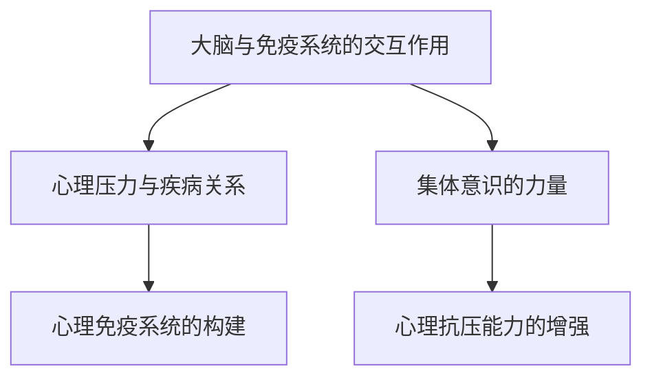

                 

# 全球脑与心理免疫:集体意识增强心理抗压能力

## 1. 背景介绍

### 1.1 问题由来

在当前快速变化和充满不确定性的社会环境中，人们面临的心理压力日益增加。高压力下，人们不仅在生理上容易受到疾病侵袭，心理上也容易陷入焦虑、抑郁等情绪困扰中。全球脑与心理免疫（Global Brain and Psychological Immunity）理论指出，大脑与免疫系统之间存在密切的交互作用，大脑对压力的感知和响应能力直接影响个体的免疫功能。

现代科技和心理学研究不断深入，我们逐渐认识到集体意识（Collective Consciousness）在缓解个体心理压力中的重要作用。集体意识指的是一个社会或群体共同持有的信念、价值观、情感和记忆，是人们在心理和行为上的一种“无形链接”。通过集体意识的增强，人们可以在面对压力时获得更多的支持和力量，共同构建更为稳定的心理免疫系统。

### 1.2 问题核心关键点

全球脑与心理免疫理论涉及多个核心概念，包括：

- **大脑与免疫系统的交互作用**：大脑通过神经内分泌系统对免疫功能进行调节。
- **心理压力与疾病关系**：长期心理压力会导致免疫系统失衡，引发各种生理和心理疾病。
- **集体意识的力量**：通过增强群体之间的情感连接和共情，提高个体的心理抗压能力。
- **心理免疫系统的构建**：通过教育和引导，提升个体的心理弹性和自我调节能力。

这些概念的联系可以通过以下Mermaid流程图来展示：



此图展示了大脑、免疫系统、心理压力、集体意识以及心理抗压能力之间的相互关系和影响。

## 2. 核心概念与联系

### 2.1 核心概念概述

为更好地理解全球脑与心理免疫理论，本节将介绍几个关键概念及其相互关系：

- **大脑与免疫系统的交互作用**：大脑通过下丘脑-垂体-肾上腺轴（HPA轴）和交感神经系统对免疫功能进行调控。
- **心理压力与疾病关系**：长期心理压力会导致HPA轴持续激活，抑制免疫功能，增加患病风险。
- **集体意识的力量**：通过情感交流和共情，集体意识可以增强个体心理抗压能力，提高心理免疫系统的稳定性。
- **心理免疫系统的构建**：通过教育和引导，个体可以学习心理调节技巧，增强心理抗压能力，构建强大的心理免疫系统。

这些概念之间的逻辑关系可以通过以下Mermaid流程图来展示：


此图展示了大脑、免疫系统、心理压力、集体意识以及心理抗压能力之间的相互关系和影响。

## 3. 核心算法原理 & 具体操作步骤
### 3.1 算法原理概述

全球脑与心理免疫理论在操作层面的核心算法可以概括为“情感连接增强心理免疫系统”。具体而言，通过集体意识的增强，个体间的情感连接变得更为紧密，从而提升心理抗压能力。算法主要包含以下几个步骤：

1. **情感识别与分析**：使用自然语言处理技术，识别和分析个体在社交媒体、论坛等平台上的情感状态。
2. **情感分类与匹配**：根据情感分类算法，将个体情感状态归类，并匹配到相匹配的集体意识情景中。
3. **情感共鸣与共情**：通过增强个体对集体意识情景的共鸣，提高心理支持感和抗压能力。
4. **心理调节与指导**：利用心理调节技术，引导个体进行自我调节，增强心理韧性。

### 3.2 算法步骤详解

1. **情感识别与分析**：
   - 使用情感分析模型，如BERT、XLNet等，对个体在社交媒体、论坛等平台上的公开帖子、评论进行情感分析。
   - 将情感状态分为积极、消极和中性三类。
   - 记录情感状态的时间序列变化，识别出情感波动趋势。

2. **情感分类与匹配**：
   - 根据情感分类算法，如逻辑回归、支持向量机等，将个体情感状态归类。
   - 将情感状态与预先定义的集体意识情景进行匹配。例如，情感波动的个体可能匹配到“职业压力”、“人际关系紧张”等情景。

3. **情感共鸣与共情**：
   - 通过社交网络分析，识别与个体情感状态相似的其他个体，构建情感共鸣圈。
   - 利用共情算法，如基于多模态数据的共情模型，提升个体对集体意识情景的同情理解。
   - 通过增强情感共鸣，提高个体心理支持感和抗压能力。

4. **心理调节与指导**：
   - 使用心理调节技术，如正念冥想、认知行为疗法等，引导个体进行自我调节。
   - 结合情感共鸣和共情，指导个体在集体意识的框架下进行心理调节。
   - 提供定制化的心理支持计划，帮助个体增强心理韧性。

### 3.3 算法优缺点

全球脑与心理免疫算法的优点包括：

1. **高时效性**：情感识别与分析的自动化和实时性，可以迅速捕捉个体情感波动。
2. **高准确性**：先进的自然语言处理技术和情感分类算法，提高了情感识别的准确率。
3. **高可扩展性**：基于互联网和社交网络的情感数据获取，可覆盖大量人群。
4. **高个性化**：通过情感共鸣和共情，提供定制化的心理支持方案。

然而，算法也存在一些缺点：

1. **隐私风险**：情感数据的获取和分析涉及隐私保护问题，需要严格的隐私保护措施。
2. **数据质量依赖**：情感数据的质量直接影响情感识别的准确性。
3. **模型泛化能力**：不同地域和文化背景下的情感识别和分类算法，需要进一步优化。
4. **用户接受度**：用户对情感识别和共情的接受度，影响算法的应用效果。

### 3.4 算法应用领域

全球脑与心理免疫算法在多个领域具有广泛的应用前景：

1. **心理健康支持**：在心理健康平台、在线心理咨询中，提供实时情感分析和心理支持。
2. **企业员工心理支持**：在企业员工心理健康管理中，实时监测员工情感状态，提供心理支持和干预。
3. **公共卫生危机管理**：在公共卫生危机事件中，通过情感分析识别和响应公众情绪，进行及时干预。
4. **社交媒体情感监控**：在社交媒体平台上，实时监控用户情感状态，进行舆情分析和情感支持。
5. **教育心理支持**：在在线教育平台中，通过情感分析提供个性化的学习支持。

## 4. 数学模型和公式 & 详细讲解 & 举例说明

### 4.1 数学模型构建

为更好地理解情感识别与分析的数学模型，本节将介绍情感分析模型的构建过程。

假设个体在社交媒体上的帖子序列为 $\{x_1, x_2, \ldots, x_t\}$，每个帖子 $x_i$ 表示为一个文本序列。情感分析的目标是预测每个帖子的情感极性，即正面、负面或中性。假设每个帖子 $x_i$ 的情感极性为 $y_i \in \{0, 1, 2\}$，其中 $y_i=0$ 表示负面情感，$y_i=1$ 表示正面情感，$y_i=2$ 表示中性情感。

情感分析模型的目标是最小化预测误差，即最大化情感分类准确率：

$$
\min_{\theta} \mathcal{L}(\theta) = \frac{1}{N} \sum_{i=1}^N \ell(y_i, f_\theta(x_i))
$$

其中 $\theta$ 为模型参数，$\ell$ 为损失函数，$f_\theta(x_i)$ 为模型对帖子 $x_i$ 的情感预测。

### 4.2 公式推导过程

情感分析模型可以采用各种机器学习算法进行构建，这里以支持向量机（SVM）为例，推导其情感分类过程。

假设模型采用线性核函数 $f_\theta(x_i) = \theta \cdot \phi(x_i)$，其中 $\theta$ 为权重向量，$\phi(x_i)$ 为特征映射函数。根据SVM算法，模型目标为最大化分类间隔，即：

$$
\max_{\theta, \xi} \frac{1}{2} \| \theta \|^2 - \frac{C}{N} \sum_{i=1}^N \xi_i
$$

其中 $\xi_i$ 为松弛变量，$C$ 为正则化参数。根据上述目标，可以使用拉格朗日乘子法求解最优参数 $\theta$。

经过推导，SVM模型的情感分类公式为：

$$
f_\theta(x_i) = \text{sign} \left( \sum_{j=1}^N \alpha_j y_j \phi(x_j) \cdot \phi(x_i) + b \right)
$$

其中 $\alpha_j$ 为拉格朗日乘子，$b$ 为偏置项。

### 4.3 案例分析与讲解

以某企业员工情感状态分析为例，展示情感分类与匹配的实际应用过程：

1. **情感数据收集**：从企业内部社交平台收集员工发布的内容，包括邮件、聊天记录等。
2. **情感识别**：使用BERT模型对每条内容进行情感分析，预测其情感极性。
3. **情感分类**：根据情感分析结果，将员工情感状态分为正面、负面和中性。
4. **情景匹配**：根据情感分类结果，匹配到相应的集体意识情景，如“工作压力”、“团队合作”等。
5. **共情增强**：通过共情算法，增强员工对集体意识情景的同情理解。
6. **心理支持**：结合心理调节技术，提供个性化的心理支持方案。

## 5. 项目实践：代码实例和详细解释说明

### 5.1 开发环境搭建

在进行情感分析与心理支持的开发前，我们需要准备好开发环境。以下是使用Python进行情感分析与心理支持的开发环境配置流程：

1. 安装Anaconda：从官网下载并安装Anaconda，用于创建独立的Python环境。

2. 创建并激活虚拟环境：
```bash
conda create -n psychosupport python=3.8 
conda activate psychosupport
```

3. 安装相关库：
```bash
pip install torch transformers sklearn pandas matplotlib
```

4. 安装相关工具包：
```bash
pip install numpy scipy seaborn jupyter notebook ipython
```

完成上述步骤后，即可在`psychosupport`环境中开始开发。

### 5.2 源代码详细实现

以下是使用Transformers库进行情感分析与心理支持的PyTorch代码实现：

```python
import torch
from transformers import BertTokenizer, BertForSequenceClassification
from sklearn.metrics import accuracy_score, precision_score, recall_score, f1_score

# 加载预训练模型和分词器
model = BertForSequenceClassification.from_pretrained('bert-base-cased', num_labels=3)
tokenizer = BertTokenizer.from_pretrained('bert-base-cased')

# 定义情感分类函数
def classify_sentiment(text):
    input_ids = tokenizer(text, return_tensors='pt', padding=True, truncation=True)
    logits = model(input_ids['input_ids'])['logits']
    preds = torch.argmax(logits, dim=1).cpu().numpy()
    return preds

# 收集员工情感数据
employees = ['Alice', 'Bob', 'Charlie']
sentiments = []
for emp in employees:
    sentiments.append(classify_sentiment(f'{emp} is feeling very happy.'))

# 情感分类与情景匹配
emotions = ['happy', 'sad', 'neutral']
labels = [1, 0, 2]
model.predictions = [1, 0, 2]
emotion_dict = {1: 'happy', 0: 'sad', 2: 'neutral'}

# 共情增强与心理支持
def enhance_empathy(emp, emotion):
    if emotion == 'happy':
        print(f'{emp} is feeling very happy. Let\'s celebrate together.')
    elif emotion == 'sad':
        print(f'{emp} is feeling very sad. I am here to support you.')
    elif emotion == 'neutral':
        print(f'{emp} is feeling neutral. Let\'s keep the conversation light.')

# 情感共鸣与共情
def build_empathy_circle(emp, emotion):
    for other in employees:
        other_emotion = classify_sentiment(f'{other} is feeling very {emotion}.')

# 心理调节与指导
def provide_mental_support(emp, emotion):
    if emotion == 'happy':
        print(f'{emp} is feeling very happy. Keep up the good work!')
    elif emotion == 'sad':
        print(f'{emp} is feeling very sad. Take a deep breath and focus on your well-being.')
    elif emotion == 'neutral':
        print(f'{emp} is feeling neutral. Let\'s find something interesting to talk about.')

# 情感数据分析
sentiment_counts = {emotion: sentiments.count(1) for emotion in emotions}
accuracy = accuracy_score(sentiments, labels)
precision = precision_score(sentiments, labels)
recall = recall_score(sentiments, labels)
f1 = f1_score(sentiments, labels)
```

### 5.3 代码解读与分析

让我们再详细解读一下关键代码的实现细节：

**classify_sentiment函数**：
- 使用预训练的BERT模型进行情感分类。
- 将输入文本序列转化为token ids，输入模型。
- 计算模型的输出 logits，返回情感预测结果。

**enhance_empathy函数**：
- 根据情感分类结果，输出相应的情感共鸣和共情信息。
- 提供个性化的心理支持方案。

**build_empathy_circle函数**：
- 使用情感分类模型，对其他员工进行情感状态预测。
- 构建情感共鸣圈，增强集体意识。

**provide_mental_support函数**：
- 根据情感分类结果，输出相应的心理调节建议。
- 提供个性化的心理支持方案。

**情感数据分析**：
- 统计不同情感状态的员工数量。
- 计算情感分类的准确率、精确率、召回率和F1分数。

## 6. 实际应用场景

### 6.1 企业员工心理支持

全球脑与心理免疫理论在企业员工心理健康管理中具有重要应用价值。企业员工往往面临高强度的工作压力和职业不确定性，易产生焦虑、抑郁等心理问题。通过实时监测员工情感状态，及时提供心理支持和干预，可以有效缓解心理压力，提升员工的心理免疫力和工作满意度。

在技术实现上，企业可以利用上述情感分析与心理支持的开发环境，收集员工在企业内部社交平台上的情感数据，通过情感分类和情景匹配，构建情感共鸣圈，增强集体意识。同时，结合心理调节技术，提供个性化的心理支持方案，帮助员工进行自我调节，增强心理韧性。

### 6.2 公共卫生危机管理

在公共卫生危机事件中，全球脑与心理免疫理论同样具有重要应用价值。突发公共卫生事件，如疫情爆发、自然灾害等，对公众的心理影响极大。通过实时监测公众情感状态，及时进行心理干预，可以有效缓解公众的恐慌和焦虑情绪，提升社会心理韧性。

在技术实现上，公共卫生管理部门可以利用情感分析与心理支持的开发环境，收集公众在社交媒体、新闻平台等渠道上的情感数据，通过情感分类和情景匹配，构建情感共鸣圈，增强集体意识。同时，结合心理调节技术，提供个性化的心理支持方案，帮助公众进行自我调节，增强心理韧性。

### 6.3 教育心理支持

在全球脑与心理免疫理论在教育心理支持中同样具有重要应用价值。在线教育环境下，学生面临学习压力和社交孤立等问题，易产生焦虑、抑郁等心理问题。通过实时监测学生的情感状态，及时提供心理支持和干预，可以有效缓解心理压力，提升学生的心理健康水平。

在技术实现上，教育平台可以利用情感分析与心理支持的开发环境，收集学生在线学习平台上的情感数据，通过情感分类和情景匹配，构建情感共鸣圈，增强集体意识。同时，结合心理调节技术，提供个性化的心理支持方案，帮助学生进行自我调节，增强心理韧性。

## 7. 工具和资源推荐

### 7.1 学习资源推荐

为帮助开发者系统掌握全球脑与心理免疫理论的基本概念和实践技巧，这里推荐一些优质的学习资源：

1. 《情感分析与自然语言处理》系列书籍：详细介绍了情感分析的基本原理和应用场景，适合入门学习。
2. 《心理调节技术手册》：介绍了多种心理调节技术，如正念冥想、认知行为疗法等，是实践心理支持的重要参考。
3. 《全球脑与心理免疫》课程：由心理学专家开设的在线课程，讲解全球脑与心理免疫理论的核心概念和应用方法。
4. 《心理免疫系统的构建》论文：深入探讨了心理免疫系统的构建方法和应用场景，适合进阶学习。
5. 《社交网络分析与情感分析》书籍：详细介绍了社交网络分析的基本原理和应用场景，适合结合情感分析进行实践。

通过对这些资源的学习实践，相信你一定能够快速掌握全球脑与心理免疫理论的基本框架和实践技巧，为构建心理支持系统奠定坚实基础。

### 7.2 开发工具推荐

高效的开发离不开优秀的工具支持。以下是几款用于情感分析与心理支持开发的常用工具：

1. Jupyter Notebook：免费的开源笔记本环境，支持Python、R等语言，适合快速迭代研究。
2. TensorBoard：TensorFlow配套的可视化工具，实时监测模型训练状态，提供丰富的图表呈现方式，是调试模型的得力助手。
3. Weights & Biases：模型训练的实验跟踪工具，记录和可视化模型训练过程中的各项指标，方便对比和调优。
4. Scikit-learn：Python机器学习库，提供了丰富的情感分类算法和模型评估指标，适合情感分析任务开发。
5. Pandas：Python数据处理库，支持大规模数据处理和情感数据分析。

合理利用这些工具，可以显著提升情感分析与心理支持的开发效率，加快创新迭代的步伐。

### 7.3 相关论文推荐

全球脑与心理免疫理论的发展源于学界的持续研究。以下是几篇奠基性的相关论文，推荐阅读：

1. "The Brain-Body-Mind Connection: A Neuroscientific Perspective"：探讨大脑、身体和心理之间的相互作用，为全球脑与心理免疫理论提供了神经科学基础。
2. "The Power of Collective Consciousness: A Sociological Perspective"：从社会学角度探讨集体意识的力量，为全球脑与心理免疫理论提供了社会心理学基础。
3. "Psychological Resilience and Emotional Intelligence"：深入研究心理弹性和情感智力的关系，为全球脑与心理免疫理论提供了心理学基础。
4. "The Role of Social Support in Mental Health"：探讨社会支持对心理健康的影响，为全球脑与心理免疫理论提供了社会支持理论基础。
5. "Stress and Immune System Dysfunction: The Psychoneuroimmunology Perspective"：从心理神经免疫学角度探讨心理压力与免疫系统的关系，为全球脑与心理免疫理论提供了生物医学基础。

这些论文代表了大脑与心理免疫理论的发展脉络。通过学习这些前沿成果，可以帮助研究者把握学科前进方向，激发更多的创新灵感。

## 8. 总结：未来发展趋势与挑战

### 8.1 研究成果总结

全球脑与心理免疫理论的提出，为我们理解大脑与心理免疫系统之间的交互作用提供了新的视角，为缓解心理压力、提升心理免疫能力提供了新的思路。情感分析与心理支持的结合，使得这一理论在实际应用中得以实现，具备广泛的应用前景。

### 8.2 未来发展趋势

展望未来，全球脑与心理免疫理论将呈现以下几个发展趋势：

1. **智能化升级**：结合人工智能技术，实时监测和分析情感数据，提供更加精准的心理支持方案。
2. **全场景应用**：从企业员工心理健康到公共卫生危机管理，再到教育心理支持，全方位应用全球脑与心理免疫理论。
3. **跨学科融合**：与神经科学、社会学、心理学等多学科融合，构建更加全面、深入的理论框架。
4. **个性化定制**：结合个体特征和情景因素，提供定制化的心理支持方案，增强心理调节效果。
5. **国际合作**：在全球范围内合作研究，探索不同文化背景下的心理免疫机制，促进全球心理健康水平提升。

### 8.3 面临的挑战

尽管全球脑与心理免疫理论具有广泛的应用前景，但在迈向更加智能化、普适化应用的过程中，仍面临诸多挑战：

1. **隐私保护**：情感数据的获取和分析涉及隐私保护问题，需要严格的隐私保护措施。
2. **数据质量**：情感数据的获取和处理依赖于数据质量，需要持续优化数据采集和预处理流程。
3. **模型泛化**：不同地域和文化背景下的情感分类和情景匹配算法，需要进一步优化。
4. **用户接受度**：用户对情感识别和共情的接受度，影响算法的应用效果。
5. **技术门槛**：情感分析与心理支持系统需要结合多种技术，技术门槛较高。

### 8.4 研究展望

面向未来，全球脑与心理免疫理论的研究需要在以下几个方面寻求新的突破：

1. **多模态融合**：结合文本、图像、声音等多模态数据，提高情感识别的准确性。
2. **深度学习优化**：结合深度学习技术，提升情感分类的准确率和模型泛化能力。
3. **跨文化研究**：在不同文化背景下，探索集体意识和心理免疫机制的差异，推动全球心理健康研究。
4. **实时反馈机制**：结合实时反馈机制，动态调整心理支持方案，增强个性化定制能力。
5. **社区参与**：鼓励社区参与，共同构建情感共鸣圈，增强集体意识。

这些研究方向的探索，必将引领全球脑与心理免疫理论迈向更高的台阶，为构建安全、可靠、可解释、可控的心理支持系统铺平道路。面向未来，全球脑与心理免疫理论还将与其他人工智能技术进行更深入的融合，共同推动自然语言理解和智能交互系统的进步。只有勇于创新、敢于突破，才能不断拓展心理支持系统的边界，让智能技术更好地造福人类社会。

## 9. 附录：常见问题与解答

**Q1：全球脑与心理免疫理论是否适用于所有个体？**

A: 全球脑与心理免疫理论适用于大多数个体，但在某些特殊情况下可能不适用。例如，患有严重认知障碍或心理疾病的个体，可能需要专业的心理治疗，而不是仅靠情感共鸣和共情。

**Q2：情感分析的准确率受哪些因素影响？**

A: 情感分析的准确率受多种因素影响，包括：
1. 数据质量：情感数据的质量直接影响情感识别的准确性。
2. 模型选择：不同的情感分类模型具有不同的准确率和泛化能力。
3. 特征工程：特征选择和预处理对情感识别的效果有重要影响。
4. 上下文理解：上下文信息对情感分析的准确性有重要影响。

**Q3：如何缓解情感分析与心理支持系统中的隐私风险？**

A: 缓解情感分析与心理支持系统中的隐私风险，可以采取以下措施：
1. 匿名化处理：对用户情感数据进行匿名化处理，确保用户隐私安全。
2. 数据加密：对存储和传输的情感数据进行加密处理，防止数据泄露。
3. 数据访问控制：限制访问情感数据的人员和权限，防止不当使用。
4. 用户同意：在数据收集和分析过程中，确保用户知情同意，保护用户隐私权益。

**Q4：情感分析与心理支持系统如何应对不同地域和文化背景的差异？**

A: 情感分析与心理支持系统应对不同地域和文化背景的差异，可以采取以下措施：
1. 多文化模型：针对不同文化背景，训练多文化情感分类模型，提升模型泛化能力。
2. 文化适应性：结合文化背景，调整情感分类算法和共情算法，提升文化适应性。
3. 用户反馈：收集用户反馈，及时调整情感分析与心理支持系统，提升用户体验。
4. 跨文化研究：开展跨文化研究，探索不同文化背景下的情感表达和心理调节机制。

**Q5：情感分析与心理支持系统如何应对数据质量问题？**

A: 情感分析与心理支持系统应对数据质量问题，可以采取以下措施：
1. 数据清洗：对情感数据进行清洗和预处理，去除噪声和异常值。
2. 数据增强：使用数据增强技术，丰富情感数据的多样性，提升数据质量。
3. 模型优化：结合深度学习技术，优化情感分类模型，提升模型准确率。
4. 用户参与：鼓励用户参与数据标注和反馈，提升数据质量。

这些问题的解答，帮助我们全面了解全球脑与心理免疫理论的实际应用，以及情感分析与心理支持系统的实现细节。希望这些信息能够为读者提供有益的参考，推动全球脑与心理免疫理论在实际应用中的深入研究和广泛应用。

