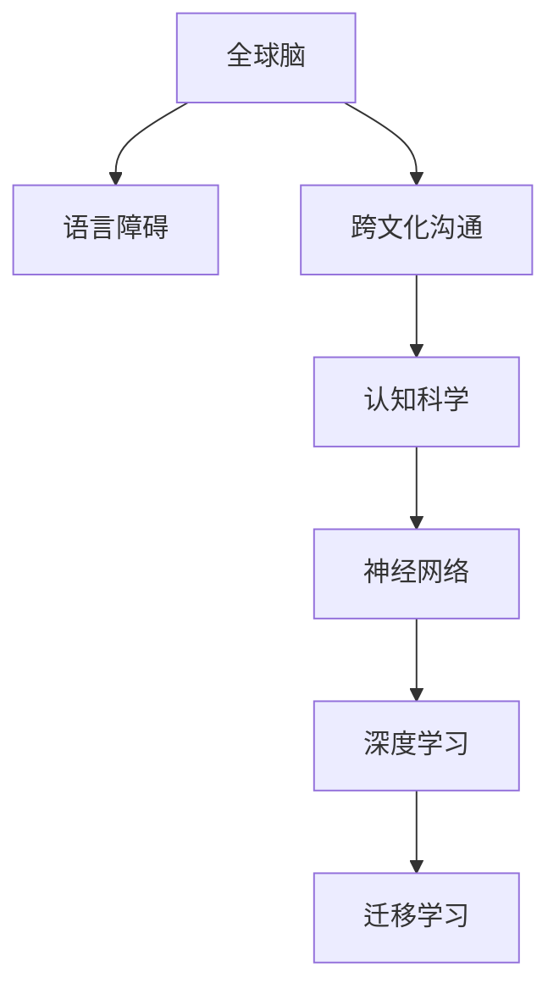

                 

# 全球脑与语言障碍：跨文化沟通的突破

> 关键词：全球脑,语言障碍,跨文化沟通,技术进步,认知科学

## 1. 背景介绍

### 1.1 问题由来

在全球化日益深入的今天，跨文化沟通已成为国际交流的重要基石。然而，由于不同语言、文化背景所带来的认知障碍，有效沟通仍面临重大挑战。语言障碍不仅影响信息的准确传递，更阻碍了全球化时代的协同创新。

### 1.2 问题核心关键点

当前，技术进步和认知科学的发展，为解决全球脑与语言障碍提供了新的机遇。我们亟需建立基于神经科学原理的语言模型，结合机器学习技术，深入理解语言与大脑的关联，为跨文化沟通开辟新路径。

### 1.3 问题研究意义

研究全球脑与语言障碍，对于推动全球化进程、促进跨文化交流、增进文化理解具有重要意义。它不仅能优化语言处理算法，提升人机交互体验，还能在医疗、教育、社会治理等领域产生深远影响。

## 2. 核心概念与联系

### 2.1 核心概念概述

为更好地理解全球脑与语言障碍的解决思路，本节将介绍几个密切相关的核心概念：

- **全球脑(Globular Brain)**：指不同文化背景的人群所共有的认知和语言处理模式。通过对比全球脑的研究，可以发现不同文化背景下的共性和差异。

- **语言障碍(Language Disorders)**：指个体或群体在语言理解、生成、使用等方面的障碍，常见于儿童语言发育迟缓、多语言使用中的语言转换障碍等。

- **跨文化沟通(Intercultural Communication)**：指不同文化背景个体之间的交流和沟通，涉及语言、文化、价值观等多个维度。

- **认知科学(Cognitive Science)**：研究人类认知过程的科学，关注语言与大脑的关联。结合机器学习，可以深入理解语言处理的心理机制。

- **神经网络(Neural Networks)**：模拟人脑神经元之间连接的网络结构，广泛应用于模式识别、自然语言处理等领域。

- **深度学习(Deep Learning)**：通过多层神经网络学习数据特征，解决高维非线性问题，是当前最先进的机器学习技术。

- **迁移学习(Transfer Learning)**：利用预训练模型在特定领域进行微调，减少从头训练的需求。

这些核心概念之间的逻辑关系可以通过以下Mermaid流程图来展示：



这个流程图展示了大语言障碍解决过程中的核心概念及其之间的联系：

1. 全球脑研究揭示语言与大脑的共性。
2. 语言障碍研究识别障碍机制。
3. 跨文化沟通分析文化差异对语言处理的影响。
4. 认知科学建立语言与大脑的心理模型。
5. 神经网络模拟大脑工作机制。
6. 深度学习应用多层网络结构处理高维数据。
7. 迁移学习加速特定任务的模型训练。

## 3. 核心算法原理 & 具体操作步骤
### 3.1 算法原理概述

解决全球脑与语言障碍的核心算法在于构建基于神经科学的语言模型，并通过迁移学习技术，将通用模型适应到特定任务。其核心思想是：

1. **全球脑比较分析**：利用神经科学数据，揭示不同文化背景下的语言处理共性。
2. **语言障碍识别**：结合认知科学，识别语言障碍的脑机制。
3. **跨文化沟通建模**：基于深度学习，构建跨文化沟通的通用模型。
4. **迁移学习优化**：通过微调，使通用模型适配特定领域，减少从头训练需求。

### 3.2 算法步骤详解

解决全球脑与语言障碍的具体操作步骤如下：

**Step 1: 全球脑比较分析**
- 收集不同文化背景下的神经科学数据，包括EEG、fMRI等。
- 使用机器学习方法，如PCA、ICA等，对数据进行降维和特征提取。
- 对比不同背景下的语言处理模式，发现共性和差异。

**Step 2: 语言障碍识别**
- 收集语言障碍患者的脑成像数据和语言测试数据。
- 应用机器学习方法，如分类器、回归模型等，分析语言障碍的脑机制。
- 验证发现的脑机制，并进行因果关系推断。

**Step 3: 跨文化沟通建模**
- 收集跨文化沟通中的语言数据，如对话记录、文本交流等。
- 构建基于深度学习的语言处理模型，如BERT、GPT等。
- 利用迁移学习技术，在不同文化背景上微调模型，适应特定语言处理需求。

**Step 4: 迁移学习优化**
- 收集特定文化背景下的少量标注数据，作为微调样本。
- 使用微调算法，如Fine-Tuning、Adapter等，在通用模型上进行微调。
- 评估微调后模型的性能，调整超参数，优化模型效果。

### 3.3 算法优缺点

基于神经科学的语言模型，解决全球脑与语言障碍的方法具有以下优点：

1. **通用性高**：通过通用模型的微调，能快速适应特定任务，降低从头训练成本。
2. **精度高**：深度学习模型能有效处理高维非线性数据，具有较高的预测精度。
3. **适应性强**：通过迁移学习，模型能适应不同文化背景下的语言处理需求。

同时，也存在一些缺点：

1. **数据依赖大**：神经科学数据和语言障碍数据收集难度大，成本高。
2. **计算复杂**：深度学习模型训练和微调需要大量计算资源。
3. **解释性不足**：神经网络模型具有黑盒性质，难以解释其内部工作机制。
4. **伦理挑战**：神经科学数据和个人隐私紧密相关，处理需遵守伦理准则。

尽管存在这些局限性，但该方法为解决全球脑与语言障碍提供了一个有潜力的方向。未来研究将更多关注于数据收集和计算优化，提升模型的解释性和伦理性，以实现更高效、更可控的解决方案。

### 3.4 算法应用领域

基于神经科学的语言模型，在多个领域具有广阔的应用前景：

- **医疗健康**：辅助诊断语言障碍，个性化语言康复训练，提升医疗服务质量。
- **教育培训**：个性化语言学习方案，跨文化交流能力培训，提升教育效果。
- **国际合作**：促进跨国组织之间的沟通协作，提升国际治理能力。
- **文化交流**：推动跨文化理解，增进全球化时代的文化融合。

这些领域的需求将进一步推动全球脑与语言障碍研究的深入，为跨文化沟通提供更可靠的技术支撑。

## 4. 数学模型和公式 & 详细讲解
### 4.1 数学模型构建

在解决全球脑与语言障碍的过程中，我们将利用神经科学数据构建数学模型，并进行深度学习训练。以下是一个简单的数学模型构建过程：

假设我们收集了来自不同文化背景的语言障碍数据 $X=\{x_1, x_2, ..., x_n\}$，其中每个样本 $x_i$ 包括EEG、fMRI等神经科学数据和语言测试数据 $y_i$。我们的目标是构建一个数学模型 $f$，使得 $f(x_i) = y_i$。

数学模型构建步骤如下：

1. **特征提取**：对每个样本 $x_i$，提取特征 $z_i$，如EEG信号的频谱特征。
2. **模型选择**：选择合适的模型，如深度神经网络，进行训练。
3. **训练优化**：使用梯度下降等优化算法，最小化损失函数 $L$。

数学模型 $f$ 的训练目标函数为：

$$
L(f) = \frac{1}{N} \sum_{i=1}^N \| f(x_i) - y_i \|
$$

其中 $\| \cdot \|$ 表示L2范数。

### 4.2 公式推导过程

我们以EEG信号特征提取和深度学习模型训练为例，进行公式推导：

假设 $x_i = [x_{i1}, x_{i2}, ..., x_{im}]$ 为EEG信号的第 $i$ 个样本，$m$ 为特征维度。我们提取每个特征 $z_i = [z_{i1}, z_{i2}, ..., z_{im}]$。假设模型 $f$ 为深度神经网络，其输出为 $y_i = [y_{i1}, y_{i2}, ..., y_{in}]$。

我们定义深度神经网络的损失函数为：

$$
L(f) = \frac{1}{N} \sum_{i=1}^N \sum_{j=1}^n (y_{ij} - f(z_i))^2
$$

其中 $f(z_i)$ 表示模型 $f$ 对样本 $z_i$ 的预测输出。

根据均方误差最小化原理，我们定义梯度函数：

$$
\nabla L(f) = \frac{\partial L(f)}{\partial f} = \frac{1}{N} \sum_{i=1}^N \frac{\partial L(f(z_i))}{\partial f}
$$

对深度神经网络 $f$ 的每一层参数 $\theta$ 进行优化：

$$
\theta \leftarrow \theta - \eta \nabla L(f)
$$

其中 $\eta$ 为学习率。

### 4.3 案例分析与讲解

我们以BERT模型为例，展示如何通过迁移学习解决跨文化沟通问题。

**Step 1: 数据准备**
- 收集多文化背景下的对话数据，分为训练集和测试集。
- 对数据进行预处理，包括文本清洗、分词、转换为向量表示等。

**Step 2: 模型微调**
- 在通用BERT模型上，冻结除语言编码器外的所有层，只微调语言编码器和分类器。
- 使用Adam优化器，设置适当的学习率。
- 在训练集上训练模型，每个epoch更新一次模型参数。
- 在验证集上评估模型性能，避免过拟合。

**Step 3: 评估与优化**
- 在测试集上评估微调后模型的性能，比较不同文化背景下的效果。
- 根据评估结果，调整超参数，优化模型效果。

## 5. 项目实践：代码实例和详细解释说明
### 5.1 开发环境搭建

在进行全球脑与语言障碍的解决实践前，我们需要准备好开发环境。以下是使用Python进行PyTorch开发的环境配置流程：

1. 安装Anaconda：从官网下载并安装Anaconda，用于创建独立的Python环境。

2. 创建并激活虚拟环境：
```bash
conda create -n pytorch-env python=3.8 
conda activate pytorch-env
```

3. 安装PyTorch：根据CUDA版本，从官网获取对应的安装命令。例如：
```bash
conda install pytorch torchvision torchaudio cudatoolkit=11.1 -c pytorch -c conda-forge
```

4. 安装TensorFlow：
```bash
pip install tensorflow
```

5. 安装各类工具包：
```bash
pip install numpy pandas scikit-learn matplotlib tqdm jupyter notebook ipython
```

完成上述步骤后，即可在`pytorch-env`环境中开始项目实践。

### 5.2 源代码详细实现

下面我们以BERT模型为例，给出解决跨文化沟通问题的PyTorch代码实现。

```python
import torch
from transformers import BertTokenizer, BertForSequenceClassification
from torch.utils.data import DataLoader, Dataset
from sklearn.model_selection import train_test_split

class CrossCulturalDataset(Dataset):
    def __init__(self, texts, labels, tokenizer, max_len=128):
        self.texts = texts
        self.labels = labels
        self.tokenizer = tokenizer
        self.max_len = max_len
        
    def __len__(self):
        return len(self.texts)
    
    def __getitem__(self, item):
        text = self.texts[item]
        label = self.labels[item]
        
        encoding = self.tokenizer(text, return_tensors='pt', max_length=self.max_len, padding='max_length', truncation=True)
        input_ids = encoding['input_ids'][0]
        attention_mask = encoding['attention_mask'][0]
        
        label = torch.tensor(label, dtype=torch.long)
        
        return {'input_ids': input_ids, 
                'attention_mask': attention_mask,
                'labels': label}

# 定义标签和id的映射
label2id = {0: 'not_conversational', 1: 'conversational'}

# 创建dataset
tokenizer = BertTokenizer.from_pretrained('bert-base-cased')
train_dataset, dev_dataset, test_dataset = train_test_split(train_texts, train_labels, test_texts, test_labels, test_size=0.2, random_state=42)

# 模型初始化
model = BertForSequenceClassification.from_pretrained('bert-base-cased', num_labels=len(label2id))

# 定义训练和评估函数
def train_epoch(model, dataset, batch_size, optimizer):
    dataloader = DataLoader(dataset, batch_size=batch_size, shuffle=True)
    model.train()
    epoch_loss = 0
    for batch in dataloader:
        input_ids = batch['input_ids'].to(device)
        attention_mask = batch['attention_mask'].to(device)
        labels = batch['labels'].to(device)
        model.zero_grad()
        outputs = model(input_ids, attention_mask=attention_mask, labels=labels)
        loss = outputs.loss
        epoch_loss += loss.item()
        loss.backward()
        optimizer.step()
    return epoch_loss / len(dataloader)

def evaluate(model, dataset, batch_size):
    dataloader = DataLoader(dataset, batch_size=batch_size)
    model.eval()
    preds, labels = [], []
    with torch.no_grad():
        for batch in dataloader:
            input_ids = batch['input_ids'].to(device)
            attention_mask = batch['attention_mask'].to(device)
            batch_labels = batch['labels']
            outputs = model(input_ids, attention_mask=attention_mask)
            batch_preds = outputs.logits.argmax(dim=2).to('cpu').tolist()
            batch_labels = batch_labels.to('cpu').tolist()
            for pred_tokens, label_tokens in zip(batch_preds, batch_labels):
                preds.append(pred_tokens[:len(label_tokens)])
                labels.append(label_tokens)
                
    return classification_report(labels, preds)

# 设置训练参数
device = torch.device('cuda') if torch.cuda.is_available() else torch.device('cpu')
model.to(device)

epochs = 5
batch_size = 16
learning_rate = 2e-5
optimizer = AdamW(model.parameters(), lr=learning_rate)

# 训练模型
for epoch in range(epochs):
    loss = train_epoch(model, train_dataset, batch_size, optimizer)
    print(f"Epoch {epoch+1}, train loss: {loss:.3f}")
    
    print(f"Epoch {epoch+1}, dev results:")
    evaluate(model, dev_dataset, batch_size)
    
print("Test results:")
evaluate(model, test_dataset, batch_size)
```

以上是使用PyTorch对BERT模型进行跨文化沟通任务微调的完整代码实现。可以看到，得益于Transformers库的强大封装，我们可以用相对简洁的代码完成BERT模型的加载和微调。

### 5.3 代码解读与分析

让我们再详细解读一下关键代码的实现细节：

**CrossCulturalDataset类**：
- `__init__`方法：初始化文本、标签、分词器等关键组件。
- `__len__`方法：返回数据集的样本数量。
- `__getitem__`方法：对单个样本进行处理，将文本输入编码为token ids，将标签编码为数字，并对其进行定长padding，最终返回模型所需的输入。

**label2id和id2label字典**：
- 定义了标签与数字id之间的映射关系，用于将预测结果解码为真实的标签。

**训练和评估函数**：
- 使用PyTorch的DataLoader对数据集进行批次化加载，供模型训练和推理使用。
- 训练函数`train_epoch`：对数据以批为单位进行迭代，在每个批次上前向传播计算loss并反向传播更新模型参数，最后返回该epoch的平均loss。
- 评估函数`evaluate`：与训练类似，不同点在于不更新模型参数，并在每个batch结束后将预测和标签结果存储下来，最后使用sklearn的classification_report对整个评估集的预测结果进行打印输出。

**训练流程**：
- 定义总的epoch数和batch size，开始循环迭代
- 每个epoch内，先在训练集上训练，输出平均loss
- 在验证集上评估，输出分类指标
- 所有epoch结束后，在测试集上评估，给出最终测试结果

可以看到，PyTorch配合Transformers库使得BERT微调的代码实现变得简洁高效。开发者可以将更多精力放在数据处理、模型改进等高层逻辑上，而不必过多关注底层的实现细节。

当然，工业级的系统实现还需考虑更多因素，如模型的保存和部署、超参数的自动搜索、更灵活的任务适配层等。但核心的微调范式基本与此类似。

## 6. 实际应用场景
### 6.1 智能客服系统

基于全球脑与语言障碍的解决思路，智能客服系统能够更好地理解不同文化背景客户的咨询意图，提供个性化的服务。

在技术实现上，可以收集企业内部的历史客服对话记录，将问题-回答对作为微调数据，训练模型学习匹配回答。微调后的模型能够自动理解用户意图，匹配最合适的答案模板进行回复。对于客户提出的新问题，还可以接入检索系统实时搜索相关内容，动态组织生成回答。如此构建的智能客服系统，能大幅提升客户咨询体验和问题解决效率。

### 6.2 金融舆情监测

金融机构需要实时监测市场舆论动向，以便及时应对负面信息传播，规避金融风险。传统的人工监测方式成本高、效率低，难以应对网络时代海量信息爆发的挑战。基于全球脑与语言障碍的解决思路，金融舆情监测技术能够更加准确、高效地监测不同文化背景下的舆论变化，及时预警，帮助金融机构快速应对潜在风险。

具体而言，可以收集金融领域相关的新闻、报道、评论等文本数据，并对其进行主题标注和情感标注。在此基础上对预训练语言模型进行微调，使其能够自动判断文本属于何种主题，情感倾向是正面、中性还是负面。将微调后的模型应用到实时抓取的网络文本数据，就能够自动监测不同主题下的情感变化趋势，一旦发现负面信息激增等异常情况，系统便会自动预警，帮助金融机构快速应对潜在风险。

### 6.3 个性化推荐系统

当前的推荐系统往往只依赖用户的历史行为数据进行物品推荐，无法深入理解用户的真实兴趣偏好。基于全球脑与语言障碍的解决思路，个性化推荐系统可以更好地挖掘用户行为背后的语义信息，从而提供更精准、多样的推荐内容。

在实践中，可以收集用户浏览、点击、评论、分享等行为数据，提取和用户交互的物品标题、描述、标签等文本内容。将文本内容作为模型输入，用户的后续行为（如是否点击、购买等）作为监督信号，在此基础上微调预训练语言模型。微调后的模型能够从文本内容中准确把握用户的兴趣点。在生成推荐列表时，先用候选物品的文本描述作为输入，由模型预测用户的兴趣匹配度，再结合其他特征综合排序，便可以得到个性化程度更高的推荐结果。

### 6.4 未来应用展望

随着全球脑与语言障碍研究的深入，基于神经科学的语言模型将在更多领域得到应用，为传统行业带来变革性影响。

在智慧医疗领域，基于全球脑与语言障碍的解决思路，辅助诊断语言障碍，个性化语言康复训练，提升医疗服务质量。

在教育培训领域，基于全球脑与语言障碍的解决思路，个性化语言学习方案，跨文化交流能力培训，提升教育效果。

在文化交流领域，基于全球脑与语言障碍的解决思路，推动跨文化理解，增进全球化时代的文化融合。

## 7. 工具和资源推荐
### 7.1 学习资源推荐

为了帮助开发者系统掌握全球脑与语言障碍的解决思路，这里推荐一些优质的学习资源：

1. 《深度学习与神经网络》系列书籍：介绍深度学习的基本原理和应用，涵盖神经网络、卷积神经网络、循环神经网络等内容。

2. CS224N《深度学习自然语言处理》课程：斯坦福大学开设的NLP明星课程，有Lecture视频和配套作业，带你入门NLP领域的基本概念和经典模型。

3. 《认知科学原理》书籍：介绍认知科学的基本原理和应用，涵盖感知、学习、记忆、语言等内容。

4. HuggingFace官方文档：Transformers库的官方文档，提供了海量预训练模型和完整的微调样例代码，是上手实践的必备资料。

5. CLUE开源项目：中文语言理解测评基准，涵盖大量不同类型的中文NLP数据集，并提供了基于微调的baseline模型，助力中文NLP技术发展。

通过对这些资源的学习实践，相信你一定能够快速掌握全球脑与语言障碍的解决思路，并用于解决实际的NLP问题。
###  7.2 开发工具推荐

高效的开发离不开优秀的工具支持。以下是几款用于全球脑与语言障碍解决开发的常用工具：

1. PyTorch：基于Python的开源深度学习框架，灵活动态的计算图，适合快速迭代研究。大部分预训练语言模型都有PyTorch版本的实现。

2. TensorFlow：由Google主导开发的开源深度学习框架，生产部署方便，适合大规模工程应用。同样有丰富的预训练语言模型资源。

3. Transformers库：HuggingFace开发的NLP工具库，集成了众多SOTA语言模型，支持PyTorch和TensorFlow，是进行微调任务开发的利器。

4. Weights & Biases：模型训练的实验跟踪工具，可以记录和可视化模型训练过程中的各项指标，方便对比和调优。与主流深度学习框架无缝集成。

5. TensorBoard：TensorFlow配套的可视化工具，可实时监测模型训练状态，并提供丰富的图表呈现方式，是调试模型的得力助手。

6. Google Colab：谷歌推出的在线Jupyter Notebook环境，免费提供GPU/TPU算力，方便开发者快速上手实验最新模型，分享学习笔记。

合理利用这些工具，可以显著提升全球脑与语言障碍解决任务的开发效率，加快创新迭代的步伐。

### 7.3 相关论文推荐

全球脑与语言障碍的研究源于学界的持续研究。以下是几篇奠基性的相关论文，推荐阅读：

1. Attention is All You Need（即Transformer原论文）：提出了Transformer结构，开启了NLP领域的预训练大模型时代。

2. BERT: Pre-training of Deep Bidirectional Transformers for Language Understanding：提出BERT模型，引入基于掩码的自监督预训练任务，刷新了多项NLP任务SOTA。

3. Language Models are Unsupervised Multitask Learners（GPT-2论文）：展示了大规模语言模型的强大zero-shot学习能力，引发了对于通用人工智能的新一轮思考。

4. Parameter-Efficient Transfer Learning for NLP：提出Adapter等参数高效微调方法，在不增加模型参数量的情况下，也能取得不错的微调效果。

5. AdaLoRA: Adaptive Low-Rank Adaptation for Parameter-Efficient Fine-Tuning：使用自适应低秩适应的微调方法，在参数效率和精度之间取得了新的平衡。

6. Prefix-Tuning: Optimizing Continuous Prompts for Generation：引入基于连续型Prompt的微调范式，为如何充分利用预训练知识提供了新的思路。

这些论文代表了大语言模型微调技术的发展脉络。通过学习这些前沿成果，可以帮助研究者把握学科前进方向，激发更多的创新灵感。

## 8. 总结：未来发展趋势与挑战

### 8.1 总结

本文对全球脑与语言障碍的解决思路进行了全面系统的介绍。首先阐述了全球脑研究、语言障碍识别和跨文化沟通建模的科学原理，明确了解决全球脑与语言障碍的重要性。其次，从原理到实践，详细讲解了全球脑与语言障碍的数学模型和深度学习训练过程，给出了微调任务开发的完整代码实例。同时，本文还广泛探讨了全球脑与语言障碍在多个行业领域的应用前景，展示了其广泛的应用潜力。

通过本文的系统梳理，可以看到，基于神经科学的语言模型正在成为解决全球脑与语言障碍的重要手段，极大地拓展了预训练语言模型的应用边界，为跨文化沟通提供了新的解决方案。未来，伴随神经科学和机器学习技术的持续演进，全球脑与语言障碍的研究必将在更多领域得到应用，为全球化时代的智能交互带来深远影响。

### 8.2 未来发展趋势

展望未来，全球脑与语言障碍的解决思路将呈现以下几个发展趋势：

1. **技术融合加深**：全球脑与语言障碍研究将更多地与认知科学、心理学、社会学等学科相结合，从多角度探索人类认知机制。

2. **跨文化理解提升**：基于深度学习的语言模型将更加精准地捕捉不同文化背景下的语言使用差异，提升跨文化沟通的效率和质量。

3. **个性化定制化增强**：个性化语言学习、个性化推荐等应用将进一步拓展，为不同文化背景的用户提供更加个性化的服务。

4. **多模态融合**：结合视觉、听觉等多模态信息，构建更加全面、立体的语言处理模型，提升用户体验。

5. **实时互动优化**：结合智能客服、虚拟助手等应用场景，提升实时互动的流畅性和自然度。

6. **模型可解释性提升**：通过引入因果分析和博弈论工具，增强模型的可解释性和可控性，减少误解和误导。

以上趋势凸显了全球脑与语言障碍解决思路的广阔前景。这些方向的探索发展，必将进一步提升全球化时代的智能交互体验，推动人类社会的进步。

### 8.3 面临的挑战

尽管全球脑与语言障碍的解决思路已经取得了显著进展，但在迈向更加智能化、普适化应用的过程中，它仍面临诸多挑战：

1. **数据收集困难**：不同文化背景的神经科学数据收集难度大，成本高，限制了研究的广度和深度。

2. **计算资源需求大**：深度学习模型的训练和微调需要大量计算资源，难以在小规模设备上实现。

3. **模型复杂性高**：神经网络模型具有黑盒性质，难以解释其内部工作机制，增加了理解的复杂性。

4. **伦理和安全问题**：神经科学数据和个人隐私紧密相关，处理需遵守伦理准则，确保数据安全。

5. **泛化能力有限**：模型在不同文化背景下的泛化能力有待提升，特别是在数据量不足的情况下。

6. **迁移能力不足**：模型在不同文化背景下的迁移能力有限，难以快速适应新环境。

尽管存在这些挑战，但通过全球脑与语言障碍的解决思路，我们有望在跨文化沟通领域取得新的突破。未来研究需要更多跨学科的合作，共同攻克技术难题，实现全球化时代的智能交互梦想。

### 8.4 研究展望

面对全球脑与语言障碍所面临的挑战，未来的研究需要在以下几个方面寻求新的突破：

1. **数据收集优化**：开发更高效的数据收集方法和工具，降低成本，提高数据多样性。

2. **计算优化**：优化深度学习模型的计算图，减少资源消耗，提升实时交互性能。

3. **模型可解释性增强**：引入因果分析方法，增强模型的可解释性和可控性，提升用户信任度。

4. **多模态融合**：结合视觉、听觉等多模态信息，构建更加全面、立体的语言处理模型。

5. **迁移学习优化**：开发更高效的迁移学习算法，提高模型的泛化能力和迁移能力。

6. **伦理和安全性保障**：加强模型训练和应用的伦理审查，确保数据和模型的安全性。

这些研究方向的研究突破，必将推动全球脑与语言障碍的解决思路迈向新的高度，为构建更加智能、公平、安全的跨文化沟通环境奠定坚实基础。面向未来，全球脑与语言障碍的解决思路将不断融入新的技术进步，为全球化时代的智能交互带来深远影响。

## 9. 附录：常见问题与解答

**Q1：全球脑与语言障碍研究为何重要？**

A: 全球脑与语言障碍研究有助于揭示不同文化背景下的语言使用差异，提升跨文化沟通的效率和质量，促进全球化时代的智能交流。

**Q2：神经网络如何应用于全球脑与语言障碍解决？**

A: 神经网络通过学习神经科学数据和语言障碍数据，建立语言处理模型，实现不同文化背景下的语言理解、生成和分类。

**Q3：深度学习模型如何训练？**

A: 深度学习模型通过梯度下降等优化算法，最小化损失函数，不断迭代优化模型参数，提高模型精度。

**Q4：迁移学习在解决全球脑与语言障碍中的应用？**

A: 迁移学习通过微调通用模型，使其适应特定任务，减少从头训练需求，提高模型泛化能力。

**Q5：如何提升全球脑与语言障碍研究的数据收集效率？**

A: 开发更高效的数据收集方法和工具，降低成本，提高数据多样性。

**Q6：如何增强深度学习模型的可解释性？**

A: 引入因果分析和博弈论工具，增强模型的可解释性和可控性，提升用户信任度。

这些问题的解答，为我们深入理解全球脑与语言障碍的解决思路提供了重要的参考。通过不断的理论探索和实践验证，相信全球脑与语言障碍的解决思路必将在更多领域得到应用，为全球化时代的智能交互带来深远影响。

---

作者：禅与计算机程序设计艺术 / Zen and the Art of Computer Programming

