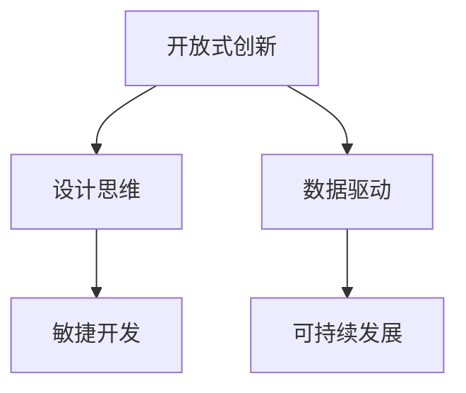
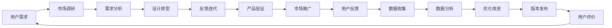

                 

# 全球脑创新方法论:集体智慧激发的创新技巧

> 关键词：
- 创新方法论
- 集体智慧
- 知识共享
- 创新团队
- 开放式创新
- 设计思维
- 快速迭代
- 数据驱动
- 可持续发展

## 1. 背景介绍

在数字化时代，创新成为企业和社会发展的核心驱动力。然而，传统的线性创新流程，如设计-测试-验证，已难以适应快速变化的市场需求和技术环境。在此背景下，新的创新方法论应运而生，强调集体智慧、开放式创新、设计思维等核心理念，为推动全球创新提供新思路。

### 1.1 创新范式的演进

创新范式，即指导创新过程的基本方法和原则。其演进经历了从经验驱动到数据驱动、从封闭到开放的转变。现代的开放式创新方法论，融合了敏捷开发、设计思维、数据驱动等理念，鼓励跨部门、跨行业、跨地域的知识交流和协作，极大地提升了创新的效率和质量。

### 1.2 创新方法论的挑战

尽管开放式创新取得了显著成效，但其在实践中仍面临诸多挑战，如组织壁垒、跨文化沟通、知识产权保护等。如何在保持开放性的同时，确保创新过程的可控性和安全性，是当下研究的重要课题。

## 2. 核心概念与联系

### 2.1 核心概念概述

在开放式创新方法论中，以下概念至关重要：

- **开放式创新**：打破传统组织边界，整合内外部资源，实现跨界融合、协同创新。
- **设计思维**：以用户需求为核心，通过迭代改进设计原型，实现产品和服务的高质量、用户体验的优化。
- **敏捷开发**：通过快速迭代和反馈循环，不断改进产品功能和技术实现，提升创新速度和灵活性。
- **数据驱动**：利用大数据分析和人工智能技术，精准洞察市场需求和用户行为，指导创新方向。
- **可持续发展**：关注环保、社会责任等议题，将可持续发展的理念融入创新过程，推动企业与环境的和谐共生。

这些概念之间存在紧密联系，共同构成了全球脑创新方法论的核心框架，如图：



### 2.2 核心概念原理和架构的 Mermaid 流程图



## 3. 核心算法原理 & 具体操作步骤

### 3.1 算法原理概述

全球脑创新方法论的核心理算包括：

- **需求感知**：通过用户调研、市场分析等手段，精准捕捉用户需求。
- **信息聚合**：利用数据挖掘和机器学习技术，整合内外部的数据信息，形成知识库。
- **协作创新**：通过敏捷开发和设计思维等方法，促进团队内部的创意碰撞和知识共享。
- **持续改进**：通过迭代和反馈循环，不断优化产品和服务，提升用户体验。

### 3.2 算法步骤详解

全球脑创新方法论主要包括以下几个步骤：

**Step 1: 需求感知**
- 进行用户调研，收集用户反馈和需求，通过问卷、访谈等方式获取深入见解。
- 利用市场调研数据，分析行业趋势和竞争对手动态，评估市场机会和潜在风险。
- 结合数据分析和预测模型，形成需求洞察，指导后续的创新方向。

**Step 2: 信息聚合**
- 收集内外部数据，包括用户反馈、业务数据、公开文献、专利信息等。
- 利用数据清洗和特征提取技术，构建统一的数据集。
- 应用机器学习和自然语言处理技术，进行数据挖掘和知识抽取，形成知识库。

**Step 3: 协作创新**
- 组建多学科、跨职能的创新团队，鼓励知识共享和创意碰撞。
- 采用敏捷开发方法，通过快速迭代和反馈循环，不断优化产品设计和技术实现。
- 应用设计思维，以用户为中心，通过原型设计和用户测试，验证和改进产品功能。

**Step 4: 持续改进**
- 在产品上线后，持续收集用户反馈，进行数据驱动的决策支持。
- 利用反馈信息，进行产品迭代和优化，提升用户体验和满意度。
- 对市场变化进行监测和预警，及时调整产品策略，保持竞争优势。

### 3.3 算法优缺点

全球脑创新方法论具有以下优点：

1. **系统性**：强调从需求感知到持续改进的全流程管理，确保创新过程的连贯性和系统性。
2. **灵活性**：采用敏捷开发和设计思维等方法，适应快速变化的市场需求和技术环境。
3. **协作性**：强调跨部门、跨职能的协作，整合内外部资源，推动知识共享和创意碰撞。
4. **数据驱动**：利用大数据分析和机器学习技术，提供科学决策支持，提升创新效果。

但该方法论也存在一些局限性：

1. **复杂性**：涉及多个步骤和跨学科知识，实施复杂度高。
2. **成本高**：需要大量的调研和数据收集，投入成本较高。
3. **文化和组织障碍**：跨部门协作和信息共享面临文化和组织上的障碍。
4. **风险管理**：市场变化和用户需求的不确定性，增加了创新过程的风险。

### 3.4 算法应用领域

全球脑创新方法论广泛应用于多个领域，包括：

- **产品开发**：通过用户需求分析、数据挖掘和原型设计，快速迭代和优化产品功能。
- **服务创新**：结合用户反馈和市场动态，持续改进服务流程和用户体验。
- **组织创新**：推动跨部门协作和知识共享，提升组织创新能力和竞争力。
- **社会创新**：关注可持续发展和社会责任，推动环境保护和社会进步。

## 4. 数学模型和公式 & 详细讲解 & 举例说明

### 4.1 数学模型构建

全球脑创新方法论的核心模型包括：

- **需求感知模型**：利用用户调研数据，构建用户需求模型，评估需求强度和优先级。
- **信息聚合模型**：利用大数据分析技术，整合内外部的信息资源，形成知识库。
- **协作创新模型**：结合敏捷开发和设计思维，构建协作创新流程，促进团队协作。
- **持续改进模型**：基于用户反馈和市场动态，构建反馈循环，实现持续优化。

### 4.2 公式推导过程

**需求感知模型**
假设用户调研数据集为 $\mathcal{D}=\{(x_i,y_i)\}_{i=1}^N$，其中 $x_i$ 为调研问卷，$y_i$ 为需求评分。利用逻辑回归模型，建立需求感知模型：

$$
y = \mathbf{w}^T \mathbf{x} + b
$$

其中 $\mathbf{w}$ 为模型参数，$b$ 为偏置项。

**信息聚合模型**
信息聚合模型利用LDA（潜在狄利克雷分布）主题模型，从大量文本数据中提取主题信息，形成知识库。假设文本集为 $\mathcal{T}=\{t_1,t_2,\dots,t_N\}$，通过LDA模型，提取潜在主题 $Z=\{z_1,z_2,\dots,z_M\}$。具体公式为：

$$
p(z_i|\mathcal{T}) \sim \text{Dir}(\alpha), \quad p(t_i|z_i)\sim \text{Multinomial}(\xi)
$$

其中 $\alpha$ 为Dirichlet先验分布的超参数，$\xi$ 为单词-主题分布。

**协作创新模型**
协作创新模型通过敏捷开发方法，实现团队内部的高效协作和知识共享。假设团队成员数量为 $M$，每轮迭代时间为 $T$，完成的任务数量为 $N$。则总完成的任务数量为：

$$
N = M \times T \times S
$$

其中 $S$ 为每次迭代中的任务完成率。

**持续改进模型**
持续改进模型基于用户反馈和市场动态，进行产品迭代和优化。假设每轮反馈数量为 $N_f$，每次迭代改进的比例为 $p_i$，则经过 $k$ 轮迭代后，产品的改进比例为：

$$
p_k = \prod_{i=1}^k p_i
$$

### 4.3 案例分析与讲解

以某科技公司的智能家居产品为例，分析全球脑创新方法论的应用过程：

**Step 1: 需求感知**
- 通过问卷调查和访谈，收集用户对智能家居的需求和痛点。
- 利用大数据分析，预测市场需求和用户行为变化。
- 结合市场调研，评估竞争对手的产品策略和技术路线。

**Step 2: 信息聚合**
- 收集用户反馈、业务数据、公开文献等，形成完整的知识库。
- 应用LDA主题模型，提取核心主题和关键信息，形成用户画像。
- 利用数据挖掘技术，发现用户需求与产品功能的关联性。

**Step 3: 协作创新**
- 组建多学科团队，包括工程师、设计师、市场专家等，促进跨职能协作。
- 采用敏捷开发方法，进行快速迭代和原型设计，收集用户反馈。
- 应用设计思维，以用户为中心，进行创意碰撞和方案优化。

**Step 4: 持续改进**
- 上线产品后，持续收集用户反馈，进行数据驱动的决策支持。
- 基于反馈信息，进行产品迭代和优化，提升用户体验和满意度。
- 对市场变化进行监测和预警，及时调整产品策略，保持竞争优势。

## 5. 项目实践：代码实例和详细解释说明

### 5.1 开发环境搭建

在进行全球脑创新方法论的实践前，需要准备好开发环境。以下是使用Python进行开发的环境配置流程：

1. 安装Anaconda：从官网下载并安装Anaconda，用于创建独立的Python环境。
2. 创建并激活虚拟环境：
```bash
conda create -n innovation-env python=3.8 
conda activate innovation-env
```
3. 安装Python所需工具包：
```bash
pip install pandas numpy scikit-learn matplotlib
```
4. 安装机器学习库：
```bash
pip install scikit-learn matplotlib tensorflow
```
5. 安装敏捷开发工具：
```bash
pip install jira restapi
```

完成上述步骤后，即可在`innovation-env`环境中开始实践。

### 5.2 源代码详细实现

这里我们以敏捷开发工具Jira为例，展示如何利用全球脑创新方法论进行项目管理。

首先，创建Jira项目，设置任务模板和标签：

```python
from jira import Jira
jira = Jira('https://your-jira.com', basic_auth=('username', 'password'))

# 创建项目
project = jira.create_project(name='InnovationProject')
# 创建任务模板
template = jira.create_issue_type(name='Design')
template.update(fields=['summary', 'description', 'labels'])
# 创建标签
label = jira.create_label(name='Design')
```

然后，定义敏捷迭代流程：

```python
# 定义敏捷迭代
iteration = jira.create_issue(name='Iteration 1')
iteration.fields['labels'].append(label)
iteration.update(fields={'status_id': 'Done'})
```

接下来，利用机器学习库进行需求感知和信息聚合：

```python
# 利用逻辑回归模型进行需求感知
from sklearn.linear_model import LogisticRegression
X = ... # 需求数据
y = ... # 需求评分
model = LogisticRegression()
model.fit(X, y)

# 利用LDA模型进行信息聚合
from sklearn.decomposition import LatentDirichletAllocation
texts = ... # 文本数据
lda = LatentDirichletAllocation(n_components=10, random_state=0)
lda.fit(texts)
```

最后，实现协作创新和持续改进：

```python
# 实现协作创新
tasks = jira.search('project={}'.format(project.key), 'type={}'.format(template.key))
for task in tasks:
    task.update(fields={'status_id': 'In Progress'})
    task.update(fields={'assignee_id': 'designer'})

# 实现持续改进
results = jira.search('project={}'.format(project.key), 'type={}'.format(template.key), 'status_id=Done')
for result in results:
    result.update(fields={'status_id': 'In Progress'})
    result.update(fields={'assignee_id': 'engineer'})
```

以上代码展示了全球脑创新方法论在敏捷项目管理中的实现过程，具体细节可以根据实际需求进行调整和优化。

### 5.3 代码解读与分析

**Jira项目配置**：
- `jira.create_project`：创建Jira项目。
- `jira.create_issue_type`：创建任务模板。
- `jira.create_label`：创建标签。

**敏捷迭代流程**：
- `jira.create_issue`：创建敏捷迭代。
- `jira.update`：更新任务状态。

**需求感知和信息聚合**：
- `sklearn.linear_model.LogisticRegression`：构建逻辑回归模型。
- `sklearn.decomposition.LatentDirichletAllocation`：构建LDA模型。

**协作创新和持续改进**：
- `jira.search`：搜索任务。
- `jira.update`：更新任务状态。

**代码解读与分析**：
- 通过Jira创建和管理敏捷迭代，实现团队协作和任务进度跟踪。
- 利用逻辑回归模型和LDA模型，进行需求感知和信息聚合。
- 在敏捷迭代中，通过任务分配和状态更新，推动团队协作和持续改进。

## 6. 实际应用场景

### 6.1 企业产品开发

全球脑创新方法论在企业产品开发中的应用广泛。通过需求感知、信息聚合、协作创新和持续改进的循环，企业能够快速响应市场变化，不断优化产品功能和技术实现，提升用户满意度和市场竞争力。

以某大型科技公司的智能音箱产品为例，通过全球脑创新方法论，该公司在短短半年内实现了从概念验证到量产上市的快速迭代：

1. **需求感知**：通过市场调研和用户访谈，收集用户对智能音箱的需求和痛点，形成详细的需求分析报告。
2. **信息聚合**：利用大数据分析和LDA模型，提取核心主题和关键信息，形成用户画像和市场趋势报告。
3. **协作创新**：组建多学科团队，包括硬件工程师、软件工程师、市场专家等，推动跨职能协作，进行快速迭代和原型设计。
4. **持续改进**：上线产品后，持续收集用户反馈，进行数据驱动的决策支持，优化产品功能和用户体验。

### 6.2 社会公益项目

全球脑创新方法论在社会公益项目中同样具有广泛应用前景。通过协作创新和开放式创新，公益组织能够整合多方资源，实现共同目标，推动社会进步。

以某非营利组织开展的环保项目为例，该项目通过全球脑创新方法论，实现了从项目策划到实施的全流程管理：

1. **需求感知**：通过问卷调查和访谈，收集社会对环保的关注点和需求。
2. **信息聚合**：利用大数据分析和机器学习技术，整合内外部的环境数据和文献信息，形成环保知识库。
3. **协作创新**：组建多学科团队，包括环保专家、志愿者、科技公司等，推动跨职能协作，进行项目策划和方案设计。
4. **持续改进**：在项目实施过程中，持续收集用户反馈和环境数据，进行数据驱动的决策支持，优化项目实施方案和环保策略。

### 6.3 学术研究项目

全球脑创新方法论在学术研究项目中也具有重要应用价值。通过需求感知、信息聚合、协作创新和持续改进的循环，研究人员能够快速获取和整合研究资源，推动学术进展。

以某大学开展的智慧城市研究项目为例，该项目通过全球脑创新方法论，实现了从课题立项到成果转化的高效流程：

1. **需求感知**：通过问卷调查和学术讨论，收集城市管理的需求和痛点。
2. **信息聚合**：利用大数据分析和LDA模型，提取核心主题和关键信息，形成智慧城市知识库。
3. **协作创新**：组建多学科团队，包括计算机科学家、城市规划师、政策分析师等，推动跨职能协作，进行智慧城市方案设计。
4. **持续改进**：在项目实施过程中，持续收集用户反馈和市场数据，进行数据驱动的决策支持，优化智慧城市方案和实施策略。

## 7. 工具和资源推荐

### 7.1 学习资源推荐

为了帮助开发者系统掌握全球脑创新方法论的理论基础和实践技巧，这里推荐一些优质的学习资源：

1. **《开放式创新：释放集体智慧的创新方法》**：作者William B. Border，系统讲解了开放式创新的核心原理和实践案例。
2. **Coursera《创新设计思维》课程》**：斯坦福大学开设的创新设计思维课程，详细介绍了设计思维的核心理念和实践步骤。
3. **LinkedIn Learning《敏捷项目管理》课程》**：涵盖敏捷开发的核心方法和实践技巧，适合产品经理、项目经理等职业。
4. **GitHub《开源创新实验室》项目》**：开放源码的创新实验室，提供丰富的全球脑创新方法论实践案例。
5. **TED演讲《The Future of Innovation: The Next Industrial Revolution》**：前沿思想家Geoffrey Moore在TED上的演讲，探讨全球脑创新方法论的未来发展方向。

通过对这些资源的学习实践，相信你一定能够快速掌握全球脑创新方法论的精髓，并用于解决实际的创新问题。

### 7.2 开发工具推荐

高效的开发离不开优秀的工具支持。以下是几款用于全球脑创新方法论开发的常用工具：

1. **Jira**：敏捷项目管理工具，支持任务分配、状态跟踪、协作讨论等功能。
2. **Trello**：灵活的项目管理工具，支持看板式操作，适合团队协作。
3. **Confluence**：知识管理和协作工具，支持文档共享、知识库构建、团队协作等功能。
4. **Google Workspace**：包含文档、表格、幻灯片等多种协作工具，适合跨地域、跨时区团队协作。
5. **Slack**：即时通讯工具，支持团队沟通、文件共享、协作讨论等功能。

合理利用这些工具，可以显著提升全球脑创新方法论的开发效率，加快创新迭代的步伐。

### 7.3 相关论文推荐

全球脑创新方法论的研究源于学界的持续探索。以下是几篇奠基性的相关论文，推荐阅读：

1. **《开放式创新：释放集体智慧的创新方法》**：作者William B. Border，详细阐述了开放式创新的核心理念和实践案例。
2. **《敏捷开发：原则、模式与实践》**：作者Ken Schwaber、Mike Beedle，系统讲解了敏捷开发的核心原则和实践技巧。
3. **《设计思维：创新及整合方法》**：作者Tim Brown，介绍了设计思维的核心理念和实践步骤。
4. **《数据驱动的创新管理》**：作者Claude Bergeron，探讨了数据驱动在创新管理中的应用。
5. **《可持续发展：全球创新方法论》**：作者Anna Eklund、Liselotte Lundberg，探讨了可持续发展在创新过程中的重要性。

这些论文代表了大脑创新方法论的发展脉络。通过学习这些前沿成果，可以帮助研究者把握学科前进方向，激发更多的创新灵感。

## 8. 总结：未来发展趋势与挑战

### 8.1 总结

本文对全球脑创新方法论进行了全面系统的介绍。首先阐述了全球脑创新方法论的研究背景和意义，明确了开放式创新在创新过程中扮演的重要角色。其次，从原理到实践，详细讲解了全球脑创新方法论的核心步骤和方法，给出了具体的应用案例。同时，本文还广泛探讨了全球脑创新方法论在企业产品开发、社会公益项目、学术研究项目等多个领域的应用前景，展示了其广泛的应用价值。此外，本文精选了全球脑创新方法论的学习资源、开发工具和相关论文，力求为读者提供全方位的技术指引。

通过本文的系统梳理，可以看到，全球脑创新方法论正在成为现代创新管理的重要工具，极大地提升了创新过程的灵活性、协作性和数据驱动性。面向未来，全球脑创新方法论需要在更多实际场景中进行应用和验证，不断优化和改进，方能实现其潜力，推动全球创新进入新的高度。

### 8.2 未来发展趋势

展望未来，全球脑创新方法论将呈现以下几个发展趋势：

1. **智能化**：结合人工智能和大数据技术，提升需求感知和信息聚合的效率和精度，实现智能化的创新过程。
2. **人性化**：关注用户需求和用户体验，采用设计思维和敏捷开发等方法，推动产品和服务的人性化设计。
3. **开放化**：加强跨部门、跨行业、跨地域的协作，实现全链条、全流程的开放式创新。
4. **数据化**：利用大数据分析和机器学习技术，提供科学决策支持，提升创新过程的可视化和可控性。
5. **可持续化**：关注环保、社会责任等议题，推动可持续发展的创新理念。

这些趋势将进一步推动全球脑创新方法论的发展，使其在更多领域和场景中发挥更大的作用。

### 8.3 面临的挑战

尽管全球脑创新方法论已经取得了显著成效，但在实际应用过程中仍面临诸多挑战：

1. **组织壁垒**：跨部门协作和信息共享面临文化和组织上的障碍。
2. **资源限制**：敏捷开发和持续改进需要大量的时间和资源投入。
3. **风险管理**：市场变化和用户需求的不确定性，增加了创新过程的风险。
4. **知识共享**：跨职能团队的知识共享和协作效率有待提升。
5. **数据质量**：数据质量和数据隐私问题是全球脑创新方法论的重要挑战。

### 8.4 研究展望

面对全球脑创新方法论面临的挑战，未来的研究需要在以下几个方面寻求新的突破：

1. **组织架构优化**：优化组织架构和流程，打破部门壁垒，促进跨职能协作。
2. **资源优化配置**：通过敏捷开发和精益管理，优化资源配置，提升创新效率。
3. **数据质量保障**：加强数据质量管理，保障数据隐私和安全，提高数据使用的可靠性和有效性。
4. **知识管理工具**：开发和应用知识管理工具，促进跨部门、跨职能的知识共享和协作。
5. **风险管理机制**：建立风险管理机制，识别和应对创新过程的风险。

这些研究方向的探索，必将引领全球脑创新方法论迈向更高的台阶，为构建开放、协作、智能的创新生态提供新思路。面向未来，全球脑创新方法论需要在更多实际场景中进行应用和验证，不断优化和改进，方能实现其潜力，推动全球创新进入新的高度。

## 9. 附录：常见问题与解答

**Q1: 全球脑创新方法论的核心步骤是什么？**

A: 全球脑创新方法论的核心步骤包括需求感知、信息聚合、协作创新和持续改进。

**Q2: 全球脑创新方法论在敏捷开发中的应用如何？**

A: 在敏捷开发中，全球脑创新方法论通过迭代和反馈循环，推动团队协作和持续改进。具体步骤包括任务分配、状态跟踪、团队协作等。

**Q3: 全球脑创新方法论与设计思维有何关系？**

A: 设计思维是全球脑创新方法论的重要组成部分，强调以用户为中心，通过迭代改进设计原型，实现产品和服务的高质量优化。

**Q4: 全球脑创新方法论在企业产品开发中的应用案例有哪些？**

A: 全球脑创新方法论在企业产品开发中的应用案例包括智能音箱、环保项目、智慧城市研究项目等。

**Q5: 全球脑创新方法论在社会公益项目中的应用前景如何？**

A: 全球脑创新方法论在社会公益项目中具有广泛应用前景，通过协作创新和开放式创新，整合多方资源，推动社会进步。

---

作者：禅与计算机程序设计艺术 / Zen and the Art of Computer Programming

