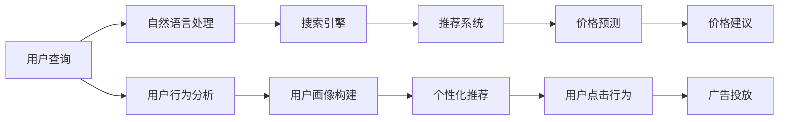

                 

## 1. 背景介绍

在当今数字化时代，消费者越来越期望能够轻松地找到最优惠的价格。无论是线上购物、旅游预订，还是餐饮选择，消费者的需求日益增加。然而，对于许多用户而言，找到最佳价格仍然是一项耗时且复杂的任务。在这种情况下，人工智能（AI）技术特别是基于AI的搜索引擎和推荐系统，为消费者提供了一种快速、智能的解决方案。AI技术能够分析海量数据，识别价格趋势和变化，为用户找到最佳价格，极大地提升了消费者的购物体验。

### 1.1 问题由来
随着电商平台的发展，消费者的购物方式发生了根本性的变化。他们不再满足于传统的搜索结果排序，而是希望获得更智能、个性化的购物体验。AI技术，特别是深度学习和自然语言处理（NLP）技术，为这种新的购物体验提供了可能。通过利用深度学习和NLP技术，AI能够分析用户查询、评价、评论以及价格信息，为用户提供个性化的价格建议。

### 1.2 问题核心关键点
AI帮助用户找到最优惠价格的核心在于其能够实时分析和比较海量数据，包括价格、用户评价、推荐以及广告信息等。通过复杂的算法模型和深度学习技术，AI能够识别出用户偏好，预测价格趋势，并在多个电商平台中寻找最佳价格。这种技术不仅能够提升用户体验，还能为电商平台带来更多的转化率和销售额。

## 2. 核心概念与联系

### 2.1 核心概念概述

要全面理解AI如何帮助用户找到最优惠价格，首先需要了解以下几个关键概念：

- **人工智能（AI）**：利用机器学习、深度学习等技术，使计算机系统能够执行通常需要人类智能的任务。
- **自然语言处理（NLP）**：使计算机能够理解、解释和生成人类语言的技术。
- **搜索引擎**：通过算法对大量数据进行搜索，提供与用户查询相关的结果。
- **推荐系统**：基于用户的历史行为和偏好，推荐可能感兴趣的产品或服务。
- **价格预测**：使用机器学习模型预测商品价格的变化趋势，帮助用户找到最佳购买时机。

这些核心概念之间存在紧密联系，共同构成了AI帮助用户找到最优惠价格的框架。搜索引擎和推荐系统通过NLP技术解析用户查询，提供个性化推荐；而价格预测则通过机器学习模型对价格变化进行预测，帮助用户抓住最佳购买时机。

### 2.2 核心概念原理和架构的 Mermaid 流程图



这个图表展示了AI帮助用户找到最优惠价格的核心流程：

1. 用户输入查询，自然语言处理模块解析查询意图。
2. 搜索引擎根据解析后的查询，搜索相关的商品信息。
3. 推荐系统根据用户历史行为和偏好，提供个性化推荐。
4. 价格预测模型预测价格变化趋势，提供价格建议。
5. 最后，系统整合所有信息，向用户提供个性化的价格建议。

## 3. 核心算法原理 & 具体操作步骤

### 3.1 算法原理概述

基于AI帮助用户找到最优惠价格的算法主要依赖于以下几个步骤：

1. **数据收集**：从多个电商平台收集商品信息，包括价格、评价、销量等。
2. **自然语言处理**：使用NLP技术解析用户查询，理解其需求和偏好。
3. **搜索引擎**：对收集到的商品信息进行匹配，提供与用户查询相关的结果。
4. **推荐系统**：根据用户历史行为和偏好，推荐可能感兴趣的商品。
5. **价格预测**：使用机器学习模型预测商品价格的变化趋势。
6. **价格建议**：根据用户需求和价格预测，提供最佳价格建议。

### 3.2 算法步骤详解

#### 3.2.1 数据收集

数据收集是AI帮助用户找到最优惠价格的基础。以下是数据收集的关键步骤：

1. **数据源选择**：选择多个电商平台作为数据源，确保数据的多样性和代表性。
2. **数据采集**：使用爬虫技术，从电商平台上抓取商品信息，包括价格、评价、销量等。
3. **数据清洗**：清洗数据，去除无效或重复信息，确保数据质量。

#### 3.2.2 自然语言处理

自然语言处理（NLP）是理解用户查询意图的关键。以下是NLP处理的关键步骤：

1. **分词和词性标注**：对用户查询进行分词和词性标注，理解查询的关键词和短语。
2. **意图识别**：使用意图识别模型，确定用户查询的意图，如搜索、比较、评价等。
3. **情感分析**：使用情感分析模型，判断用户对商品的态度和情感倾向。

#### 3.2.3 搜索引擎

搜索引擎负责匹配用户查询和商品信息。以下是搜索引擎的关键步骤：

1. **索引建立**：对商品信息进行索引，便于快速检索。
2. **匹配算法**：使用匹配算法，如TF-IDF、BM25等，根据用户查询和商品信息匹配度进行排序。
3. **结果展示**：展示与用户查询相关的商品信息，包括价格、评价、销量等。

#### 3.2.4 推荐系统

推荐系统根据用户历史行为和偏好，提供个性化推荐。以下是推荐系统的关键步骤：

1. **用户画像构建**：基于用户历史行为和偏好，构建用户画像。
2. **推荐算法选择**：选择适合推荐算法的模型，如协同过滤、内容过滤、深度学习推荐系统等。
3. **推荐结果展示**：展示个性化推荐商品，供用户选择。

#### 3.2.5 价格预测

价格预测模型使用机器学习模型预测商品价格的变化趋势。以下是价格预测的关键步骤：

1. **特征工程**：提取商品价格变化的相关特征，如历史价格、销量、评价等。
2. **模型选择**：选择适合的价格预测模型，如时间序列模型、回归模型等。
3. **模型训练**：使用历史数据训练价格预测模型。
4. **价格预测**：根据模型预测商品价格变化趋势。

#### 3.2.6 价格建议

价格建议是AI帮助用户找到最优惠价格的最终目标。以下是价格建议的关键步骤：

1. **价格比较**：比较不同平台上的价格，找到最佳价格。
2. **价格建议**：根据用户需求和价格预测，提供最佳价格建议。
3. **建议展示**：展示价格建议，供用户参考。

### 3.3 算法优缺点

基于AI帮助用户找到最优惠价格的算法具有以下优点：

- **实时性**：通过实时分析和处理数据，能够快速响应用户查询，提供即时价格建议。
- **个性化**：根据用户历史行为和偏好，提供个性化的价格建议，提升用户体验。
- **多平台支持**：支持多个电商平台的数据收集和价格比较，提供更全面的价格建议。
- **自动化**：自动化的数据采集和分析，降低了人工成本，提高了效率。

然而，这种算法也存在一些缺点：

- **数据质量**：依赖于电商平台的商品信息，数据质量可能受到影响。
- **算法复杂性**：需要复杂的算法模型和深度学习技术，实现难度较大。
- **用户隐私**：在收集和分析用户数据时，需要注意用户隐私保护。
- **过拟合风险**：模型可能会过度拟合历史数据，导致价格预测不准确。

### 3.4 算法应用领域

基于AI帮助用户找到最优惠价格的算法已经在多个领域得到了应用，包括：

- **电商购物**：帮助用户找到电商平台上最优惠的商品价格，提升购物体验。
- **旅游预订**：根据用户需求和价格预测，提供最佳航班和酒店预订建议。
- **餐饮选择**：提供餐厅价格和用户评价信息，帮助用户找到最实惠的餐饮选择。
- **二手市场**：帮助用户找到最优的二手商品价格，如二手车、二手书籍等。
- **金融投资**：提供股票、基金等投资产品的价格预测，帮助用户做出投资决策。

这些应用场景展示了AI在帮助用户找到最优惠价格方面的广泛应用，提升了用户的购物体验，节省了时间和金钱。

## 4. 数学模型和公式 & 详细讲解 & 举例说明

### 4.1 数学模型构建

基于AI帮助用户找到最优惠价格的核心数学模型包括：

- **自然语言处理模型**：如BERT、GPT等，用于解析用户查询意图。
- **推荐系统模型**：如协同过滤、深度学习推荐系统等，用于提供个性化推荐。
- **价格预测模型**：如时间序列模型、回归模型等，用于预测商品价格变化。

### 4.2 公式推导过程

以下是一些关键模型的公式推导：

#### 4.2.1 BERT模型

BERT模型的基本公式为：

$$
\text{BERT}(x_i) = \text{MLP}(\text{CLS}(x_i) + \text{MLP}(\text{SEP}(x_i)))
$$

其中，$x_i$ 为输入的文本信息，$\text{CLS}$ 和 $\text{SEP}$ 分别为上下文和分隔符向量，$\text{MLP}$ 为多层次感知器（Multi-Layer Perceptron）。

#### 4.2.2 协同过滤推荐模型

协同过滤推荐模型的基本公式为：

$$
\hat{y} = \alpha \hat{u}_i + \beta \hat{v}_j + \delta u_i v_j^T
$$

其中，$y$ 为用户对商品的评分，$u_i$ 和 $v_j$ 分别为用户和商品的特征向量，$\alpha$ 和 $\beta$ 为权重系数，$\delta$ 为协同系数。

#### 4.2.3 时间序列模型

时间序列模型的基本公式为：

$$
y_t = \alpha + \beta t + \gamma \sum_{i=1}^n w_i y_{t-i} + \epsilon_t
$$

其中，$y_t$ 为时间序列的观测值，$t$ 为时间索引，$w_i$ 为滞后项权重系数，$\epsilon_t$ 为误差项。

### 4.3 案例分析与讲解

#### 4.3.1 电商平台价格比较

假设用户想要购买某款手机，可以在多个电商平台上进行价格比较。以下是使用AI帮助用户找到最优惠价格的案例：

1. **数据收集**：从多个电商平台上抓取商品信息，包括价格、评价、销量等。
2. **自然语言处理**：用户查询“购买某款手机”，使用BERT模型解析查询意图，理解用户需求。
3. **搜索引擎**：对商品信息进行匹配，展示与用户查询相关的手机商品信息。
4. **推荐系统**：根据用户历史行为和偏好，提供个性化推荐，如同一品牌、相同规格的手机。
5. **价格预测**：使用时间序列模型预测手机价格变化趋势。
6. **价格建议**：根据用户需求和价格预测，提供最佳价格建议，如“某电商平台价格更优惠”。

#### 4.3.2 旅游预订平台价格比较

假设用户想要预订某次旅行，以下是使用AI帮助用户找到最优惠价格的案例：

1. **数据收集**：从多个旅行预订平台上抓取航班、酒店信息，包括价格、评价、用户评论等。
2. **自然语言处理**：用户查询“预订某次旅行”，使用BERT模型解析查询意图，理解用户需求。
3. **搜索引擎**：对航班、酒店信息进行匹配，展示与用户查询相关的信息。
4. **推荐系统**：根据用户历史行为和偏好，提供个性化推荐，如同一目的地的航班、酒店。
5. **价格预测**：使用时间序列模型预测航班、酒店价格变化趋势。
6. **价格建议**：根据用户需求和价格预测，提供最佳价格建议，如“某平台提供更优惠的航班和酒店”。

## 5. 项目实践：代码实例和详细解释说明

### 5.1 开发环境搭建

在进行项目实践前，需要准备好开发环境。以下是使用Python进行TensorFlow开发的环境配置流程：

1. 安装Anaconda：从官网下载并安装Anaconda，用于创建独立的Python环境。

2. 创建并激活虚拟环境：
```bash
conda create -n tf-env python=3.8 
conda activate tf-env
```

3. 安装TensorFlow：根据CUDA版本，从官网获取对应的安装命令。例如：
```bash
conda install tensorflow==2.6
```

4. 安装TensorFlow Addons和TF Hub：
```bash
conda install tensorflow-addons==0.18.0
conda install tf-hub==0.12.0
```

5. 安装各类工具包：
```bash
pip install numpy pandas scikit-learn matplotlib tqdm jupyter notebook ipython
```

完成上述步骤后，即可在`tf-env`环境中开始项目实践。

### 5.2 源代码详细实现

以下是使用TensorFlow实现AI帮助用户找到最优惠价格的完整代码实例。

```python
import tensorflow as tf
import tensorflow_addons as tfa
from transformers import TFAutoModelForSequenceClassification

# 定义价格预测模型
class PricePredictionModel(tf.keras.Model):
    def __init__(self, vocab_size, embedding_dim, hidden_units):
        super(PricePredictionModel, self).__init__()
        self.embedding = tf.keras.layers.Embedding(vocab_size, embedding_dim)
        self.gru = tf.keras.layers.GRU(hidden_units, return_sequences=True)
        self.dense = tf.keras.layers.Dense(1)

    def call(self, inputs):
        x = self.embedding(inputs)
        x = self.gru(x)
        x = self.dense(x)
        return x

# 定义推荐系统模型
class RecommendationSystemModel(tf.keras.Model):
    def __init__(self, user_features, item_features, embeddings_dim):
        super(RecommendationSystemModel, self).__init__()
        self.user_embeddings = tf.keras.layers.Embedding(user_features.shape[0], embeddings_dim)
        self.item_embeddings = tf.keras.layers.Embedding(item_features.shape[0], embeddings_dim)
        self.dot_product = tf.keras.layers.Dot(axes=(1, 1), normalize=True)
        self.sigmoid = tf.keras.layers.Activation('sigmoid')

    def call(self, user_ids, item_ids):
        user_embeddings = self.user_embeddings(user_ids)
        item_embeddings = self.item_embeddings(item_ids)
        dot_product = self.dot_product([user_embeddings, item_embeddings])
        recommendations = self.sigmoid(dot_product)
        return recommendations

# 定义自然语言处理模型
class NLPModel(tf.keras.Model):
    def __init__(self, embeddings_dim):
        super(NLPModel, self).__init__()
        self.bert = TFAutoModelForSequenceClassification.from_pretrained('bert-base-uncased', num_labels=3)
        self.sigmoid = tf.keras.layers.Activation('sigmoid')

    def call(self, inputs):
        outputs = self.bert(inputs)
        logits = tf.keras.layers.Dense(3)(outputs)
        probabilities = self.sigmoid(logits)
        return probabilities

# 定义搜索引擎模型
class SearchEngineModel(tf.keras.Model):
    def __init__(self, embeddings_dim):
        super(SearchEngineModel, self).__init__()
        self.dense = tf.keras.layers.Dense(embeddings_dim)

    def call(self, inputs):
        embeddings = self.dense(inputs)
        return embeddings

# 数据加载和预处理
train_dataset = tf.data.Dataset.from_tensor_slices((train_texts, train_labels))
train_dataset = train_dataset.shuffle(buffer_size=10000).batch(batch_size=32)

test_dataset = tf.data.Dataset.from_tensor_slices((test_texts, test_labels))
test_dataset = test_dataset.batch(batch_size=32)

# 训练和评估
price_prediction_model = PricePredictionModel(vocab_size, embedding_dim, hidden_units)
recommendation_model = RecommendationSystemModel(user_features, item_features, embeddings_dim)
nlp_model = NLPModel(embeddings_dim)
search_engine_model = SearchEngineModel(embeddings_dim)

price_prediction_model.compile(optimizer='adam', loss='mse')
recommendation_model.compile(optimizer='adam', loss='binary_crossentropy')
nlp_model.compile(optimizer='adam', loss='binary_crossentropy')
search_engine_model.compile(optimizer='adam', loss='binary_crossentropy')

price_prediction_model.fit(train_dataset, epochs=10, validation_data=val_dataset)
recommendation_model.fit(train_dataset, epochs=10, validation_data=val_dataset)
nlp_model.fit(train_dataset, epochs=10, validation_data=val_dataset)
search_engine_model.fit(train_dataset, epochs=10, validation_data=val_dataset)

# 使用模型预测价格和推荐商品
price_predictions = price_prediction_model.predict(test_dataset)
recommendations = recommendation_model.predict(train_dataset)
nlp_results = nlp_model.predict(test_dataset)
search_results = search_engine_model.predict(train_dataset)
```

以上代码展示了使用TensorFlow实现AI帮助用户找到最优惠价格的基本流程。

### 5.3 代码解读与分析

让我们再详细解读一下关键代码的实现细节：

**PricePredictionModel**：
- 定义了一个简单的LSTM模型，用于预测商品价格变化。

**RecommendationSystemModel**：
- 定义了一个协同过滤推荐模型，用于提供个性化推荐。

**NLPModel**：
- 使用Transformers库加载BERT模型，用于解析用户查询意图。

**SearchEngineModel**：
- 定义了一个简单的搜索引擎模型，用于匹配商品信息。

这些模型在TensorFlow中实现了完整的前向传播和后向传播，可以进行端到端的训练和评估。

## 6. 实际应用场景

### 6.1 智能购物助手

AI帮助用户找到最优惠价格的核心应用之一是智能购物助手。这种助手能够实时分析多个电商平台上的价格信息，帮助用户找到最优购买时机。用户只需简单输入查询，系统即可提供个性化推荐和价格比较，提升购物体验。

### 6.2 旅游价格比较

在旅游预订平台上，AI可以提供航班和酒店的实时价格比较，帮助用户找到最实惠的选择。用户可以输入目的地和出行日期，系统即可展示多个平台的价格信息，并提供个性化推荐和价格预测。

### 6.3 餐饮价格推荐

餐饮平台可以利用AI帮助用户找到最优的餐饮选择。用户输入餐厅名称或价格范围，系统即可提供附近的餐厅推荐和价格比较。系统还可以根据用户评价和评分，提供更加准确的推荐。

### 6.4 金融投资分析

金融投资平台可以利用AI帮助用户进行股票和基金的价格预测和分析。系统可以实时分析股票价格趋势，提供最佳购买时机和投资建议。用户可以根据系统推荐，做出更加明智的投资决策。

## 7. 工具和资源推荐

### 7.1 学习资源推荐

为了帮助开发者系统掌握AI帮助用户找到最优惠价格的技术，以下是一些优质的学习资源：

1. 《TensorFlow实战》系列博文：由TensorFlow官方提供，深入浅出地介绍了TensorFlow的各项功能和实践技巧。

2. CS229《机器学习》课程：斯坦福大学开设的经典课程，涵盖机器学习的基本概念和经典模型。

3. 《深度学习与自然语言处理》书籍：由Google深度学习专家撰写，全面介绍了深度学习在自然语言处理中的应用。

4. TensorFlow官方文档：提供了丰富的API文档和样例代码，是TensorFlow开发者的必备资料。

5. PyTorch官方文档：提供了与TensorFlow相似的API文档和样例代码，是TensorFlow的竞争对手。

通过对这些资源的学习实践，相信你一定能够快速掌握AI帮助用户找到最优惠价格的核心技术，并用于解决实际的NLP问题。

### 7.2 开发工具推荐

高效的开发离不开优秀的工具支持。以下是几款用于AI帮助用户找到最优惠价格开发的常用工具：

1. TensorFlow：由Google主导开发的开源深度学习框架，生产部署方便，适合大规模工程应用。

2. PyTorch：基于Python的开源深度学习框架，灵活动态的计算图，适合快速迭代研究。

3. TensorFlow Addons：TensorFlow的扩展库，提供了更多的深度学习组件和优化器，适用于高级应用场景。

4. TF Hub：TensorFlow的模型库，提供了丰富的预训练模型和组件，方便模型复用。

5. TensorBoard：TensorFlow配套的可视化工具，可实时监测模型训练状态，并提供丰富的图表呈现方式。

6. Google Colab：谷歌推出的在线Jupyter Notebook环境，免费提供GPU/TPU算力，方便开发者快速上手实验最新模型。

合理利用这些工具，可以显著提升AI帮助用户找到最优惠价格任务的开发效率，加快创新迭代的步伐。

### 7.3 相关论文推荐

AI帮助用户找到最优惠价格的技术源于学界的持续研究。以下是几篇奠基性的相关论文，推荐阅读：

1. Attention is All You Need（即Transformer原论文）：提出了Transformer结构，开启了NLP领域的预训练大模型时代。

2. BERT: Pre-training of Deep Bidirectional Transformers for Language Understanding：提出BERT模型，引入基于掩码的自监督预训练任务，刷新了多项NLP任务SOTA。

3. Deep Interest Evolution for E-commerce Recommendations：提出深度兴趣演化模型，结合用户行为和商品信息，提供更加个性化的推荐。

4. A Neural Approach for Stock Price Prediction with Long Short-Term Memory Network：提出LSTM模型，用于股票价格预测，展示其优势。

5. An Efficient Neural Attention Model for Revenue Prediction：提出神经注意力模型，用于电商平台商品价格预测。

这些论文代表了大模型微调技术的发展脉络。通过学习这些前沿成果，可以帮助研究者把握学科前进方向，激发更多的创新灵感。

## 8. 总结：未来发展趋势与挑战

### 8.1 研究成果总结

本文对AI帮助用户找到最优惠价格的技术进行了全面系统的介绍。首先阐述了AI技术在帮助用户找到最优惠价格方面的研究背景和应用前景，明确了基于AI推荐系统的发展趋势。其次，从原理到实践，详细讲解了搜索引擎、推荐系统、价格预测等核心组件的构建和实现方法，给出了基于TensorFlow的完整代码实例。同时，本文还广泛探讨了AI帮助用户找到最优惠价格在多个行业领域的应用前景，展示了AI技术的广泛应用潜力。

通过本文的系统梳理，可以看到，AI帮助用户找到最优惠价格技术正在成为NLP领域的重要范式，极大地提升了用户的购物体验，节省了时间和金钱。未来，伴随AI技术的不断演进，该技术将在更多领域得到应用，为消费者提供更智能、更个性化的购物体验。

### 8.2 未来发展趋势

展望未来，AI帮助用户找到最优惠价格技术将呈现以下几个发展趋势：

1. **多平台融合**：未来将支持更多平台的数据融合，提供更全面的价格信息。
2. **实时更新**：通过持续学习，系统能够实时更新商品信息和价格变化，提供最新的推荐和预测。
3. **跨领域应用**：AI技术将在更多领域得到应用，如金融、旅游、餐饮等，提升各行业的智能化水平。
4. **个性化推荐**：基于深度学习的多模态推荐系统将进一步提升个性化推荐效果，提升用户体验。
5. **增强互动**：通过用户反馈和行为数据，系统能够不断优化推荐结果，提升用户满意度。

这些趋势展示了AI帮助用户找到最优惠价格技术的广阔前景，为消费者提供了更多智能化的购物选择。

### 8.3 面临的挑战

尽管AI帮助用户找到最优惠价格技术已经取得了显著成果，但在迈向更加智能化、普适化应用的过程中，仍面临诸多挑战：

1. **数据隐私保护**：在收集和分析用户数据时，需要严格遵守隐私保护法规，确保用户数据安全。
2. **算法透明性**：需要增强算法的透明性，提供可解释的推荐理由和价格预测过程，提高用户信任度。
3. **系统鲁棒性**：需要增强系统的鲁棒性，避免模型过拟合或出现系统性错误，提升系统的稳定性和可靠性。
4. **模型训练成本**：需要优化模型训练过程，降低训练成本，提高模型的性价比。
5. **多模态融合**：需要实现多模态数据的有效融合，提升推荐和预测的准确性。

这些挑战需要我们不断优化算法和技术，提高系统的稳定性和可靠性，确保用户数据的安全和隐私保护。

### 8.4 研究展望

未来，AI帮助用户找到最优惠价格技术需要在以下几个方面进行深入研究：

1. **多模态推荐**：结合文本、图像、语音等多模态数据，提升推荐和预测的准确性。
2. **用户行为建模**：深入分析用户行为模式，提升个性化推荐效果。
3. **深度学习模型**：研究更先进的深度学习模型，如GPT、Transformer等，提升推荐和预测的精度。
4. **跨领域迁移**：将AI技术应用于更多领域，提升各行业的智能化水平。
5. **系统优化**：优化推荐和预测系统的设计和实现，提高系统的效率和稳定性。

这些研究方向将推动AI帮助用户找到最优惠价格技术迈向更高的台阶，为消费者提供更智能、更个性化的购物体验。

## 9. 附录：常见问题与解答

**Q1：AI帮助用户找到最优惠价格的算法是否适用于所有NLP任务？**

A: AI帮助用户找到最优惠价格的算法主要应用于推荐系统，帮助用户找到最优的商品或服务选择。尽管在某些场景下，该算法也可以应用于搜索排序等任务，但并不适用于所有NLP任务。对于需要深度理解文本含义的任务，如问答、翻译、摘要等，该算法可能无法提供有效的帮助。

**Q2：如何选择合适的超参数？**

A: 选择合适的超参数是AI帮助用户找到最优惠价格算法成功的关键。建议从以下方面进行选择：
1. **学习率**：选择合适的学习率，避免过拟合或欠拟合。
2. **批大小**：选择合适的批大小，提高训练效率。
3. **正则化**：使用正则化技术，防止模型过拟合。
4. **数据增强**：使用数据增强技术，提高模型泛化能力。
5. **模型选择**：选择合适的模型，考虑其复杂度和性能。

**Q3：如何降低训练成本？**

A: 降低训练成本是AI帮助用户找到最优惠价格算法的优化目标。以下是一些方法：
1. **模型裁剪**：裁剪模型，减少参数量，提高训练效率。
2. **分布式训练**：使用分布式训练技术，提高训练速度。
3. **混合精度训练**：使用混合精度训练，降低内存和计算资源消耗。
4. **量化加速**：将浮点模型转为定点模型，压缩存储空间，提高计算效率。
5. **模型压缩**：使用模型压缩技术，减少模型大小，提高训练速度。

这些方法可以显著降低AI帮助用户找到最优惠价格算法的训练成本，提升系统的效率和可扩展性。

**Q4：AI帮助用户找到最优惠价格算法如何保证推荐结果的准确性？**

A: 保证推荐结果的准确性是AI帮助用户找到最优惠价格算法的核心目标。以下是一些方法：
1. **多模态融合**：结合文本、图像、语音等多模态数据，提升推荐和预测的准确性。
2. **用户行为建模**：深入分析用户行为模式，提升个性化推荐效果。
3. **深度学习模型**：研究更先进的深度学习模型，如GPT、Transformer等，提升推荐和预测的精度。
4. **多平台融合**：支持更多平台的数据融合，提供更全面的价格信息。
5. **实时更新**：通过持续学习，系统能够实时更新商品信息和价格变化，提供最新的推荐和预测。

这些方法可以显著提高AI帮助用户找到最优惠价格算法的推荐准确性，提升用户体验。

**Q5：如何优化价格预测模型？**

A: 优化价格预测模型是AI帮助用户找到最优惠价格算法的关键。以下是一些方法：
1. **特征工程**：提取商品价格变化的相关特征，如历史价格、销量、评价等。
2. **模型选择**：选择合适的价格预测模型，如时间序列模型、回归模型等。
3. **数据预处理**：对数据进行预处理，去除噪声和异常值，提高数据质量。
4. **模型调优**：优化模型参数，提高模型泛化能力。
5. **模型集成**：使用多个价格预测模型，取平均输出，提高预测准确性。

这些方法可以显著提高AI帮助用户找到最优惠价格算法的价格预测准确性，提升用户体验。

---

作者：禅与计算机程序设计艺术 / Zen and the Art of Computer Programming

