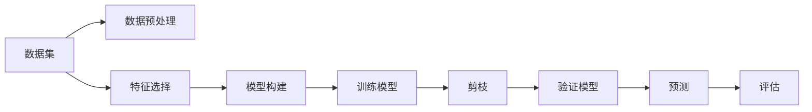

                 

## 1. 背景介绍

### 1.1 问题由来
决策树（Decision Tree）是一种基本的机器学习模型，用于分类和回归分析。它通过将数据集划分为更小的、更易于处理的子集来解决问题，每个子集代表一个决策节点，而每个节点的划分则表示一个属性测试。这一过程一直持续到所有子集都只包含同一类型的实例，或者达到了一个预设的停止条件。

### 1.2 问题核心关键点
决策树模型在处理离散型和连续型数据、处理缺失值和噪声数据、可解释性强、易于理解和实现、能够处理多分类问题等方面具有显著优势。然而，决策树也存在过拟合、生成复杂的树形结构等问题，因此需要关注剪枝、最小样本划分等问题。

### 1.3 问题研究意义
决策树模型广泛应用于金融、医疗、电商、市场营销等众多领域，对于数据探索和数据分析具有重要作用。通过深入理解决策树的原理，可以帮助我们更好地应用于实际问题中，提升模型效率和准确性。

## 2. 核心概念与联系

### 2.1 核心概念概述

为更好地理解决策树模型，本节将介绍几个密切相关的核心概念：

- **决策树（Decision Tree）**：一种用于分类和回归问题的机器学习模型，通过树形结构对数据进行划分，每个叶子节点代表一个类别或一个数值，整个树形结构表示从根节点到叶子节点的决策路径。

- **熵（Entropy）**：用于衡量数据集的不确定性，熵值越低表示数据集越纯净，分类效果越好。

- **信息增益（Information Gain）**：用于衡量特征选择的好坏，信息增益越大，说明该特征提供的分类信息越多，决策树的分裂效果越好。

- **剪枝（Pruning）**：用于控制决策树的复杂度，防止过拟合。

- **交叉验证（Cross Validation）**：用于评估模型泛化能力，通过将数据集分成训练集和验证集，并多次重复训练模型来减小模型的方差。

这些核心概念之间的逻辑关系可以通过以下Mermaid流程图来展示：



这个流程图展示了大数据集经过数据预处理、特征选择、模型构建、训练、剪枝、验证、预测和评估的一般流程。

## 3. 核心算法原理 & 具体操作步骤
### 3.1 算法原理概述

决策树的训练过程通常包括以下几个步骤：

1. **数据预处理**：将原始数据集进行清洗和处理，包括处理缺失值、转换数据类型等。
2. **特征选择**：从数据集中选取重要的特征进行模型构建，可以使用信息增益、信息增益比等方法进行选择。
3. **模型构建**：根据选择的特征，使用贪心策略构建决策树，从根节点开始，根据信息增益或基尼指数等指标选择最佳的划分特征。
4. **剪枝**：为了防止过拟合，需要对构建的决策树进行剪枝，可以通过预剪枝或后剪枝两种方法实现。
5. **验证和评估**：使用交叉验证等方法验证模型的泛化能力，评估模型性能。

### 3.2 算法步骤详解

#### 3.2.1 数据预处理

数据预处理是决策树构建的第一步，通常包括以下几个步骤：

- 缺失值处理：对于缺失值，可以采用删除、填补或插值等方法处理。
- 数据归一化：将数据缩放到[0,1]或[-1,1]等范围内，以避免不同特征之间的数值差异影响模型的训练。
- 数据标准化：将数据转换为均值为0，方差为1的标准正态分布，以避免特征尺度对模型的影响。

#### 3.2.2 特征选择

特征选择是决策树构建中非常重要的一步，通常有以下几种方法：

- **信息增益（ID3、C4.5）**：计算每个特征的信息增益，选择信息增益最大的特征进行划分。
- **信息增益比（CART）**：信息增益除以特征自身的熵，消除信息增益偏向取值较多的特征。
- **基尼指数（CART）**：计算每个特征的基尼指数，选择基尼指数最小的特征进行划分。

#### 3.2.3 模型构建

模型构建是决策树的训练过程，主要通过贪心策略从数据集中选择最佳的划分特征。具体步骤如下：

- 从数据集中选择一个最优的特征进行划分，将数据集分为多个子集。
- 对于每个子集，递归地选择最优的特征进行划分，直到所有叶子节点都只包含同一类型的实例。

#### 3.2.4 剪枝

剪枝是决策树构建过程中的重要步骤，通过减少树的深度来防止过拟合。主要分为以下两种方法：

- **预剪枝**：在模型构建过程中，根据一些停止条件（如达到最大深度、最小叶子节点数等）提前停止模型构建。
- **后剪枝**：在模型构建完成后，使用验证集对决策树进行剪枝，将一些分支剪去，保留最优的子树。

#### 3.2.5 验证和评估

模型构建完成后，需要对模型进行验证和评估，主要使用以下几种方法：

- **交叉验证**：将数据集分成训练集和验证集，通过多次交叉验证来减小模型的方差。
- **留出法**：将数据集分成训练集和测试集，使用测试集评估模型的泛化能力。
- **自助法**：从数据集中有放回地抽取样本，生成多个训练集和测试集，通过多次实验来评估模型的泛化能力。

### 3.3 算法优缺点

决策树模型具有以下优点：

- **易于理解和解释**：决策树的每一层都可以直观地解释，有助于理解模型的决策过程。
- **处理离散型和连续型数据**：可以处理各种类型的数据，包括离散型、连续型和混合型数据。
- **处理缺失值和噪声数据**：可以通过删除或填补缺失值、处理噪声数据等方法来提高模型的鲁棒性。
- **多分类问题**：可以处理多分类问题，只需在叶子节点中包含多个类别即可。

决策树模型也存在以下缺点：

- **过拟合**：容易过拟合，特别是在训练数据较少的情况下。
- **生成的树形结构复杂**：生成的决策树可能非常复杂，难以理解和调试。
- **计算复杂度较高**：构建和剪枝决策树需要较高的计算资源。

### 3.4 算法应用领域

决策树模型在金融、医疗、电商、市场营销等众多领域中都有广泛应用：

- **金融风险评估**：使用决策树模型对客户的信用评分、贷款风险进行评估。
- **医疗诊断**：使用决策树模型对病人的病情进行诊断和预测。
- **电商推荐**：使用决策树模型对用户的购买行为进行分析和预测，推荐商品。
- **市场营销**：使用决策树模型对客户的购买意愿进行分析，优化营销策略。

## 4. 数学模型和公式 & 详细讲解
### 4.1 数学模型构建

决策树的构建过程可以通过数学公式进行描述。以信息增益为例，假设数据集为 $D$，特征为 $A$，目标变量为 $Y$，则信息增益 $IG$ 可以表示为：

$$
IG(D, A) = Ent(D) - \sum_{a \in A} \frac{|D_a|}{|D|} Ent(D_a)
$$

其中，$Ent(D)$ 表示数据集 $D$ 的熵，$D_a$ 表示特征 $A$ 取值为 $a$ 的数据集，$|D|$ 表示数据集 $D$ 的大小。

### 4.2 公式推导过程

**信息增益计算**：

- 首先计算数据集 $D$ 的熵 $Ent(D)$，表示数据集 $D$ 的不确定性。
- 然后计算特征 $A$ 取值为 $a$ 的数据集 $D_a$ 的熵 $Ent(D_a)$。
- 最后计算特征 $A$ 的信息增益 $IG(D, A)$，表示特征 $A$ 对于数据集 $D$ 的分类效果。

### 4.3 案例分析与讲解

假设有一个数据集 $D$，特征 $A$ 包括 $A_1$ 和 $A_2$，目标变量 $Y$ 包括 $Y_1$ 和 $Y_2$。计算特征 $A$ 的信息增益 $IG(D, A)$ 的过程如下：

1. 计算数据集 $D$ 的熵 $Ent(D)$：
$$
Ent(D) = -\frac{1}{|D|} \sum_{i=1}^2 p(Y_i) \log_2 p(Y_i)
$$

2. 计算特征 $A$ 取值为 $a$ 的数据集 $D_a$ 的熵 $Ent(D_a)$：
$$
Ent(D_a) = -\frac{1}{|D_a|} \sum_{i=1}^2 p(Y_i | A=a) \log_2 p(Y_i | A=a)
$$

3. 计算特征 $A$ 的信息增益 $IG(D, A)$：
$$
IG(D, A) = Ent(D) - \frac{|D_{A_1}|}{|D|} Ent(D_{A_1}) - \frac{|D_{A_2}|}{|D|} Ent(D_{A_2})
$$

其中，$p(Y_i)$ 表示目标变量 $Y_i$ 的概率，$p(Y_i | A=a)$ 表示目标变量 $Y_i$ 在特征 $A=a$ 条件下的概率，$|D_a|$ 表示特征 $A=a$ 的数据集 $D_a$ 的大小。

## 5. 项目实践：代码实例和详细解释说明
### 5.1 开发环境搭建

在进行决策树模型开发前，我们需要准备好开发环境。以下是使用Python进行决策树开发的开发环境配置流程：

1. 安装Python：从官网下载并安装Python，确保版本为3.6及以上。
2. 安装决策树库：
```bash
pip install scikit-learn
```

3. 安装其他工具包：
```bash
pip install numpy pandas matplotlib seaborn
```

完成上述步骤后，即可在Python环境中开始决策树模型开发。

### 5.2 源代码详细实现

下面我们以分类任务为例，给出使用scikit-learn库构建决策树的Python代码实现。

首先，导入必要的库：

```python
from sklearn.datasets import load_iris
from sklearn.model_selection import train_test_split
from sklearn.tree import DecisionTreeClassifier
from sklearn.metrics import accuracy_score
```

然后，加载数据集并进行预处理：

```python
iris = load_iris()
X, y = iris.data, iris.target

# 数据集划分为训练集和测试集
X_train, X_test, y_train, y_test = train_test_split(X, y, test_size=0.3, random_state=42)
```

接下来，定义和训练决策树模型：

```python
# 定义决策树模型
clf = DecisionTreeClassifier()

# 训练模型
clf.fit(X_train, y_train)
```

最后，评估模型并输出结果：

```python
# 预测测试集
y_pred = clf.predict(X_test)

# 计算准确率
accuracy = accuracy_score(y_test, y_pred)
print("Accuracy:", accuracy)
```

以上就是使用scikit-learn库构建决策树的完整代码实现。可以看到，使用scikit-learn库可以很方便地构建和训练决策树模型，并进行模型评估和结果输出。

### 5.3 代码解读与分析

让我们再详细解读一下关键代码的实现细节：

**sklearn库的DecisionTreeClassifier类**：
- 该类提供了一个简单而强大的决策树分类器，支持分类和回归任务。
- 可以通过设置不同的参数，如max_depth、min_samples_split等，控制决策树的复杂度。

**数据集划分**：
- 使用`train_test_split`方法将数据集划分为训练集和测试集，用于模型的训练和评估。
- 使用`random_state`参数确保数据集的划分可重复。

**模型训练和评估**：
- 使用`fit`方法训练决策树模型，输入训练集数据。
- 使用`predict`方法预测测试集数据，输出模型预测的类别。
- 使用`accuracy_score`方法计算模型在测试集上的准确率。

**结果输出**：
- 打印出模型的准确率，评估模型在测试集上的性能。

## 6. 实际应用场景

### 6.1 金融风险评估

在金融领域，决策树模型可以用于客户信用评分、贷款风险评估等任务。通过分析客户的财务状况、历史交易记录、社交媒体信息等，可以构建决策树模型，预测客户是否会违约或逾期还款。这有助于银行和金融机构进行风险控制，优化贷款审核流程。

### 6.2 医疗诊断

在医疗领域，决策树模型可以用于病情诊断、治疗方案推荐等任务。通过分析病人的病历、检查结果、基因数据等，可以构建决策树模型，预测病人的病情和预后。这有助于医生制定个性化的治疗方案，提高医疗服务的质量和效率。

### 6.3 电商推荐

在电商领域，决策树模型可以用于商品推荐、客户行为分析等任务。通过分析用户的浏览记录、购买历史、评价信息等，可以构建决策树模型，预测用户的购买意愿和偏好。这有助于电商平台提高转化率和用户满意度，优化推荐算法。

### 6.4 市场营销

在市场营销领域，决策树模型可以用于客户细分、营销渠道优化等任务。通过分析客户的购买行为、地理位置、兴趣爱好等，可以构建决策树模型，预测客户的购买意愿和行为。这有助于企业制定精准的营销策略，提升市场竞争力和品牌价值。

## 7. 工具和资源推荐
### 7.1 学习资源推荐

为了帮助开发者系统掌握决策树模型的理论基础和实践技巧，这里推荐一些优质的学习资源：

1. **《机器学习实战》（原书第2版）**：讲解了决策树的原理、构建、评估等基础知识，适合初学者入门。
2. **Coursera《机器学习》课程**：斯坦福大学开设的著名课程，由机器学习专家Andrew Ng主讲，涵盖决策树等经典模型。
3. **Kaggle**：全球知名的数据科学竞赛平台，提供了大量决策树模型竞赛数据集和代码，是实践决策树模型的绝佳场所。
4. **GitHub**：全球最大的开源社区，提供了丰富的决策树模型代码和应用案例，适合深入学习和交流。

通过对这些资源的学习实践，相信你一定能够快速掌握决策树模型的精髓，并用于解决实际的NLP问题。

### 7.2 开发工具推荐

高效的开发离不开优秀的工具支持。以下是几款用于决策树模型开发的常用工具：

1. **Python**：灵活、易用、生态丰富，是机器学习开发的主流语言，scikit-learn库提供了丰富的决策树算法。
2. **R语言**：统计分析能力强，特别适合数据分析和可视化，C50等库提供了决策树算法。
3. **MATLAB**：强大的数值计算和可视化工具，支持各种机器学习算法，包括决策树。
4. **Jupyter Notebook**：开源的交互式编程环境，支持Python、R等多种语言，适合展示和分享代码。

合理利用这些工具，可以显著提升决策树模型的开发效率，加快创新迭代的步伐。

### 7.3 相关论文推荐

决策树模型在机器学习领域已有诸多研究，以下是几篇奠基性的相关论文，推荐阅读：

1. **ID3算法**：Quinlan在1986年提出的决策树算法，使用信息增益进行特征选择，构建决策树。
2. **C4.5算法**：Quinlan在1993年提出的改进版决策树算法，使用信息增益比和基尼指数进行特征选择。
3. **CART算法**：Breiman等人在1998年提出的决策树算法，支持分类和回归任务，使用基尼指数进行特征选择。

这些论文代表了大数据树模型发展的重要节点，通过学习这些前沿成果，可以帮助研究者把握学科前进方向，激发更多的创新灵感。

## 8. 总结：未来发展趋势与挑战

### 8.1 总结

本文对决策树模型的原理、核心算法和实际应用进行了全面系统的介绍。首先阐述了决策树模型的背景和核心概念，明确了模型在数据探索和数据分析中的重要应用。其次，从算法原理到具体实现，详细讲解了决策树模型的构建过程，并通过代码实例展示了模型的应用。同时，本文还探讨了决策树模型在多个行业领域的应用，展示了模型的广泛适用性。

通过本文的系统梳理，可以看到，决策树模型在金融、医疗、电商、市场营销等众多领域中具有重要的应用价值。未来的发展趋势显示，决策树模型将继续在人工智能领域中发挥重要作用，不断推动NLP技术的进步。

### 8.2 未来发展趋势

展望未来，决策树模型将呈现以下几个发展趋势：

1. **深度决策树**：通过构建深度决策树，可以处理更加复杂和多样的数据，提高模型的精度和泛化能力。
2. **集成学习**：通过集成多个决策树模型，可以提高模型的稳定性和准确性，减小过拟合风险。
3. **跨领域应用**：决策树模型在金融、医疗、电商等领域的成功应用，将进一步推动其在其他领域的拓展和应用。
4. **实时化处理**：决策树模型在实时数据处理中的应用将得到重视，如在物联网、智能交通等领域的应用。
5. **融合其他技术**：决策树模型可以与其他机器学习技术进行融合，如深度学习、强化学习等，实现更强大的应用。

### 8.3 面临的挑战

尽管决策树模型具有诸多优点，但在实际应用中仍然面临一些挑战：

1. **过拟合问题**：决策树模型容易过拟合，特别是在训练数据较少的情况下。需要采用剪枝、集成学习等方法来解决过拟合问题。
2. **模型复杂度**：生成的决策树可能非常复杂，难以理解和调试。需要采用可视化工具来辅助分析和优化。
3. **处理连续型数据**：决策树模型对连续型数据的处理效果一般，需要采用其他算法如随机森林等来处理。
4. **训练时间长**：决策树模型的训练时间较长，特别是在数据集较大的情况下。需要采用并行计算、分布式计算等方法来提高训练效率。

### 8.4 研究展望

面对决策树模型面临的挑战，未来的研究需要在以下几个方面寻求新的突破：

1. **参数优化**：通过优化决策树模型参数，提高模型的泛化能力和鲁棒性。
2. **算法改进**：改进决策树算法，提高模型的训练效率和精度。
3. **跨领域应用**：将决策树模型应用于更多领域，推动其他领域的智能化发展。
4. **融合其他技术**：将决策树模型与其他技术进行融合，实现更强大的应用。

这些研究方向将进一步推动决策树模型在人工智能领域的发展，为大数据的分析和处理提供更加高效和准确的解决方案。总之，决策树模型在未来将发挥重要作用，不断推动人工智能技术的进步。

## 9. 附录：常见问题与解答

**Q1: 决策树模型和随机森林模型的区别是什么？**

A: 决策树模型和随机森林模型都是基于决策树算法构建的，但随机森林模型是通过多个决策树的集成来提高模型的稳定性和泛化能力，而决策树模型则是一次性训练单个决策树。因此，随机森林模型比决策树模型具有更好的鲁棒性和准确性。

**Q2: 如何处理缺失值和噪声数据？**

A: 处理缺失值和噪声数据是决策树模型构建中的重要步骤。对于缺失值，可以采用删除、填补或插值等方法处理；对于噪声数据，可以采用数据清洗、异常值检测等方法进行处理。

**Q3: 如何判断决策树模型是否过拟合？**

A: 判断决策树模型是否过拟合通常需要观察模型在训练集和测试集上的性能表现。如果模型在训练集上表现很好，但在测试集上表现较差，则可能存在过拟合问题。

**Q4: 决策树模型有哪些参数可以进行调优？**

A: 决策树模型有很多参数可以进行调优，如最大深度、最小样本数、叶子节点数等。可以通过网格搜索、随机搜索等方法来寻找最优参数组合。

**Q5: 决策树模型在实际应用中需要注意哪些问题？**

A: 在实际应用中，决策树模型需要注意以下问题：
- 数据预处理：对数据进行清洗、归一化等处理，以提高模型的鲁棒性。
- 特征选择：选择重要的特征进行模型构建，避免过拟合。
- 剪枝：对模型进行剪枝，减小过拟合风险。
- 模型验证：使用交叉验证等方法评估模型的泛化能力，避免过拟合。

通过合理使用决策树模型，可以有效解决实际问题，提升模型效率和准确性。

