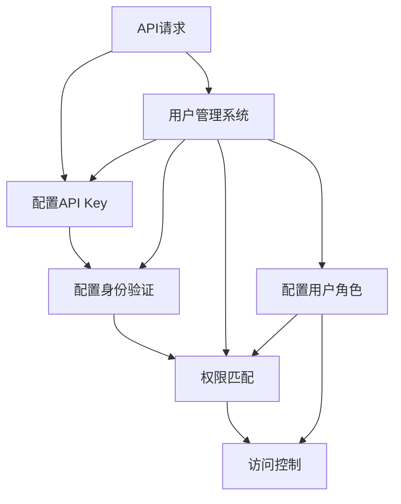

                 

# 分级 API Key 的应用

> 关键词：API Key, 分级授权, 安全性, 访问控制, 微服务, 认证, 用户管理

## 1. 背景介绍

在现代的Web应用程序中，API接口已经成为连接前后端的重要桥梁。API接口的访问控制和安全性问题一直是开发者关注的热点。API Key是其中一种常见的身份验证方式，用于限制对API资源的访问。然而，当API接口被广泛使用时，单一的API Key已无法满足复杂的安全和权限需求，分级授权机制应运而生。分级API Key可以在不同级别上实现对API接口的细粒度控制，满足不同场景下的安全性和权限管理需求。

## 2. 核心概念与联系

### 2.1 核心概念概述

- **API Key**：用于API访问的身份验证信息，通常以字符串形式存在于请求头中，用于标识访问者的身份。

- **分级授权**：根据不同的用户身份、权限等级或角色，对API资源进行细粒度控制。分级授权可以根据不同级别的API Key实现对API接口的访问限制。

- **微服务架构**：将应用程序拆分成多个独立、可互操作的服务单元，通过HTTP API进行通信。微服务架构下，API接口的安全和权限管理变得复杂，需要细粒度的访问控制。

- **认证与授权**：认证过程用于验证用户身份，授权过程用于确定用户是否有权限访问特定资源。分级API Key作为一种高效的授权机制，广泛应用于微服务架构中。

- **用户管理**：用于管理API接口的用户和权限，包括用户注册、身份验证、权限配置等。分级API Key的应用离不开完善的用户管理系统。

通过Mermaid流程图可以更直观地展示分级API Key的应用场景，如下所示：



这个流程图展示了分级API Key的应用流程：

1. 用户向API网关发送API请求。
2. API网关进行身份验证。
3. 身份验证通过后，API网关根据API Key进行分级授权。
4. 根据权限级别和用户角色，API网关对用户进行资源访问控制。
5. 用户管理系统的配置信息作为输入，用于配置API Key、身份验证、分级授权和用户角色。

## 3. 核心算法原理 & 具体操作步骤

### 3.1 算法原理概述

分级API Key的原理基于细粒度的授权机制，通过将API Key划分为多个级别，对不同级别的API Key进行权限管理。每个级别对应一组权限，访问者需要使用不同级别的API Key才能访问对应的API资源。分级API Key的设计基于以下原则：

1. **细粒度控制**：通过级别划分实现细粒度的访问控制，满足不同场景下的安全需求。
2. **灵活配置**：根据不同业务需求，灵活配置每个级别的权限，支持多级授权。
3. **安全性增强**：通过分级授权，降低单一API Key的权限泄漏风险，提高API接口的安全性。

### 3.2 算法步骤详解

#### 3.2.1 定义API Key等级

分级API Key的关键在于定义不同级别的API Key。可以基于以下维度进行分级：

- **用户身份**：如管理员、普通用户、访客等。
- **角色**：如管理员、开发人员、测试人员等。
- **权限等级**：如普通权限、高级权限、完全权限等。

例如，一个典型的分级方案可能包括：

- **管理员级API Key**：具有完全权限，可以访问所有API资源。
- **普通用户级API Key**：具有部分权限，可以访问部分API资源。
- **访客级API Key**：权限最低，只能访问特定资源或进行读取操作。

#### 3.2.2 配置权限规则

根据不同的API Key等级，配置对应的权限规则。例如，管理员级API Key可以访问所有资源，而普通用户级API Key只能访问特定资源。权限规则通常包含以下内容：

- **资源访问**：哪些API资源可以被访问。
- **操作权限**：哪些操作可以被执行。
- **时间窗口**：API请求的时间范围限制。

权限规则可以通过配置文件或数据库进行管理，支持动态配置和更新。

#### 3.2.3 身份验证与授权

在API请求到达API网关时，先进行身份验证，再根据API Key等级进行授权。身份验证和授权过程通常包含以下步骤：

1. **身份验证**：检查API Key的有效性，包括API Key的格式、签名等。
2. **授权**：根据API Key等级，获取对应的权限规则，检查API请求是否符合权限规则。

身份验证和授权通常通过以下方式实现：

- **HTTP请求头**：将API Key添加到HTTP请求头中，API网关通过解析请求头进行验证和授权。
- **令牌机制**：使用Token或JWT（JSON Web Token）进行身份验证和授权。

#### 3.2.4 资源访问控制

在授权通过后，API网关根据API Key等级进行资源访问控制。例如，普通用户级API Key只能访问特定API资源，而管理员级API Key可以访问所有资源。资源访问控制通常包含以下内容：

- **API路由**：根据API Key等级，路由到不同的API接口。
- **操作控制**：根据API Key等级，控制不同操作的行为。

资源访问控制通常通过以下方式实现：

- **中间件**：在API网关中添加中间件，根据API Key等级进行路由和操作控制。
- **代理服务**：使用代理服务对API请求进行转发和控制，实现细粒度访问控制。

### 3.3 算法优缺点

分级API Key具有以下优点：

1. **细粒度控制**：可以根据不同的API Key等级，实现细粒度的访问控制，满足不同场景下的安全需求。
2. **灵活配置**：根据不同业务需求，灵活配置每个级别的权限，支持多级授权。
3. **安全性增强**：通过分级授权，降低单一API Key的权限泄漏风险，提高API接口的安全性。

分级API Key也存在以下缺点：

1. **复杂性增加**：需要对API Key进行分级和配置，增加了系统的复杂性。
2. **性能影响**：分级授权机制可能会增加API请求的处理时间，影响系统性能。
3. **管理成本**：需要对每个级别的API Key进行管理，增加了管理成本。

### 3.4 算法应用领域

分级API Key广泛应用于微服务架构下的API接口管理，适用于以下场景：

- **企业内部系统**：企业内部系统通常需要细粒度的权限控制，分级API Key可以满足不同业务和角色的需求。
- **公共API接口**：公共API接口需要应对不同用户和设备的安全需求，分级API Key可以提高API接口的安全性和可靠性。
- **第三方服务**：第三方服务需要根据不同的用户和设备进行权限控制，分级API Key可以满足多级授权的需求。

## 4. 数学模型和公式 & 详细讲解 & 举例说明

### 4.1 数学模型构建

分级API Key的数学模型通常包含以下几个部分：

1. **API Key等级**：定义API Key的等级，包括用户身份、角色、权限等级等。
2. **权限规则**：定义每个API Key等级的权限规则，包括资源访问、操作权限、时间窗口等。
3. **访问控制**：根据API Key等级，进行资源访问控制和操作控制。

### 4.2 公式推导过程

#### 4.2.1 API Key等级定义

API Key等级通常表示为一个多维向量，包含用户身份、角色、权限等级等信息。例如，一个典型的API Key等级可以表示为：

$$
\text{API Key Level} = (UserID, Role, PermissionLevel)
$$

其中，UserID表示用户身份，Role表示角色，PermissionLevel表示权限等级。

#### 4.2.2 权限规则定义

权限规则可以表示为一个二维表，包含API资源、操作权限、时间窗口等信息。例如，一个典型的权限规则可以表示为：

$$
\text{Permission Rule} = (\text{Resource}, \text{Operation}, \text{Time Window})
$$

其中，Resource表示API资源，Operation表示操作权限，Time Window表示时间窗口。

#### 4.2.3 访问控制实现

访问控制可以通过以下公式实现：

$$
\text{Access Control} = f(\text{API Key Level}, \text{Permission Rule})
$$

其中，f表示访问控制的函数，根据API Key等级和权限规则，判断API请求是否被授权。

### 4.3 案例分析与讲解

#### 4.3.1 案例背景

某公司内部系统需要使用分级API Key进行细粒度权限控制。系统定义了三个级别的API Key，包括管理员级API Key、普通用户级API Key和访客级API Key。每个级别的API Key对应的权限规则如下：

- 管理员级API Key：可以访问所有API资源，执行所有操作。
- 普通用户级API Key：可以访问特定API资源，执行部分操作。
- 访客级API Key：只能访问特定API资源，执行读取操作。

#### 4.3.2 权限规则配置

根据不同级别的API Key，配置对应的权限规则。例如，普通用户级API Key可以访问资源A和资源B，执行操作X和操作Y，时间窗口为白天工作时间。管理员级API Key可以访问所有资源，执行所有操作，时间窗口不受限制。

#### 4.3.3 访问控制实现

在API请求到达API网关时，先进行身份验证，再根据API Key等级进行授权。例如，普通用户级API Key只能访问资源A和资源B，执行操作X和操作Y，其他操作将被拒绝。管理员级API Key可以访问所有资源，执行所有操作。

## 5. 项目实践：代码实例和详细解释说明

### 5.1 开发环境搭建

在进行分级API Key的实践前，需要先搭建好开发环境。以下是使用Python和Flask框架搭建分级API Key系统的环境配置流程：

1. 安装Python：从官网下载并安装Python。
2. 安装Flask：使用pip安装Flask，并创建Flask应用。
3. 安装API Key认证模块：使用pip安装Flask-RESTful、Flask-JWT等认证模块。

```bash
pip install flask flask-restful flask-jwt
```

4. 安装用户管理模块：使用pip安装Flask-User等用户管理模块。

```bash
pip install flask-user
```

完成上述步骤后，即可在本地环境中启动分级API Key系统。

### 5.2 源代码详细实现

以下是使用Python和Flask框架实现分级API Key的代码示例：

#### 5.2.1 用户管理模块

首先，需要实现用户管理模块，用于管理API Key和用户信息。具体代码如下：

```python
from flask_user import UserMixin, UserManager
from flask_user import login_required, current_user

# 定义用户模型
class User(db.Model, UserMixin):
    id = db.Column(db.Integer, primary_key=True)
    email = db.Column(db.String(255), unique=True)
    password = db.Column(db.String(255))
    active = db.Column(db.Boolean())

# 定义用户管理器
user_manager = UserManager(User, db, User.email)

# 定义用户认证
@login_required
def user_auth():
    return current_user.id
```

#### 5.2.2 API Key认证模块

接下来，实现API Key认证模块，用于处理API Key的生成、验证和授权。具体代码如下：

```python
from flask import request
from flask_restful import Resource, reqparse
from flask_jwt_extended import JWTManager, jwt_required, create_access_token
from models.user import User

# 定义JWT扩展
app.config['JWT_SECRET_KEY'] = 'super-secret'
jwt = JWTManager(app)

# 定义API Key认证资源
class APIKeyAuth(Resource):
    parser = reqparse.RequestParser()
    parser.add_argument('api_key', type=str, required=True, help='API Key is required.')
    parser.add_argument('role', type=str, required=True, help='Role is required.')

    @jwt_required
    def get(self):
        api_key = request.args.get('api_key')
        role = request.args.get('role')
        # 检查API Key的有效性
        if not check_api_key(api_key, role):
            return {'message': 'Invalid API Key'}, 401
        return {'message': 'API Key is valid.'}

    @jwt_required
    def post(self):
        api_key = request.args.get('api_key')
        role = request.args.get('role')
        # 生成API Key
        new_api_key = generate_api_key(api_key, role)
        return {'message': f'API Key {new_api_key} is generated.'}
```

#### 5.2.3 细粒度授权模块

最后，实现细粒度授权模块，用于根据API Key等级进行资源访问控制。具体代码如下：

```python
from flask_restful import Resource, reqparse
from models.user import User

# 定义细粒度授权资源
class FineGrainedAuth(Resource):
    parser = reqparse.RequestParser()
    parser.add_argument('api_key', type=str, required=True, help='API Key is required.')
    parser.add_argument('resource', type=str, required=True, help='Resource is required.')
    parser.add_argument('operation', type=str, required=True, help='Operation is required.')

    @jwt_required
    def get(self):
        api_key = request.args.get('api_key')
        resource = request.args.get('resource')
        operation = request.args.get('operation')
        # 检查API Key等级
        if not check_api_key_level(api_key, resource, operation):
            return {'message': 'Invalid API Key.'}, 401
        return {'message': 'API Key is valid.'}
```

### 5.3 代码解读与分析

#### 5.3.1 用户管理模块

用户管理模块定义了用户模型和用户管理器，用于管理API Key和用户信息。用户模型包含id、email、password和active等信息，用户管理器用于处理用户登录、注册和激活等操作。

#### 5.3.2 API Key认证模块

API Key认证模块实现了API Key的生成、验证和授权功能。API Key的验证和授权通过JWT扩展实现，JWT扩展用于生成和验证JWT令牌。

#### 5.3.3 细粒度授权模块

细粒度授权模块实现了根据API Key等级进行资源访问控制的功能。细粒度授权模块通过解析API请求参数，检查API Key的有效性和等级，实现细粒度访问控制。

### 5.4 运行结果展示

通过上述代码，可以搭建一个简单的分级API Key系统，用于实现细粒度访问控制。系统通过JWT扩展生成JWT令牌，用户需要携带JWT令牌才能访问API接口。API Key等级通过API请求参数进行检查，确保API请求符合权限规则。

## 6. 实际应用场景

### 6.1 企业内部系统

分级API Key在企业内部系统中得到广泛应用。企业内部系统通常需要细粒度的权限控制，确保不同用户和设备只能访问自己权限范围内的资源。分级API Key可以根据用户身份、角色和权限等级，实现细粒度的访问控制，确保系统的安全性和可靠性。

### 6.2 公共API接口

公共API接口需要应对不同用户和设备的安全需求。分级API Key可以根据用户身份和角色，实现细粒度的访问控制，确保API接口的安全性和可靠性。分级API Key还可以限制API请求的频率和数量，避免恶意攻击和资源滥用。

### 6.3 第三方服务

第三方服务需要根据不同的用户和设备进行权限控制。分级API Key可以根据用户身份和角色，实现细粒度的访问控制，确保第三方服务的可靠性和安全性。分级API Key还可以限制API请求的频率和数量，避免恶意攻击和资源滥用。

## 7. 工具和资源推荐

### 7.1 学习资源推荐

为了帮助开发者系统掌握分级API Key的理论基础和实践技巧，这里推荐一些优质的学习资源：

1. **Flask官方文档**：Flask官方文档提供了丰富的API Key认证和细粒度授权示例，是学习分级API Key的最佳资料。
2. **JWT官方文档**：JWT官方文档介绍了JWT扩展的使用方法和最佳实践，是学习JWT扩展的必备资料。
3. **API Key认证教程**：Coursera等在线课程提供了API Key认证和细粒度授权的详细教程，帮助开发者掌握实践技巧。

### 7.2 开发工具推荐

开发分级API Key系统需要借助一些常用工具，以下是一些推荐的工具：

1. **Python**：Python是一种广泛使用的编程语言，适合开发API Key认证和细粒度授权系统。
2. **Flask**：Flask是一个轻量级的Web框架，适合开发API接口和RESTful服务。
3. **JWT扩展**：JWT扩展用于生成和验证JWT令牌，是实现API Key认证的关键工具。
4. **JWT库**：使用JWT库可以简化JWT扩展的使用，提高开发效率。

### 7.3 相关论文推荐

分级API Key的研究得到了学界的广泛关注，以下是几篇代表性的论文，推荐阅读：

1. **Fine-Grained Access Control for Web Services**：介绍了一种基于角色和权限的细粒度访问控制方法，应用于Web服务中的API Key认证。
2. **OAuth 2.0 and Fine-Grained Access Control**：探讨了OAuth 2.0协议在细粒度访问控制中的应用，介绍了OAuth 2.0协议的细粒度授权机制。
3. **Access Control Mechanism Based on API Key**：介绍了一种基于API Key的细粒度访问控制方法，适用于微服务架构下的API接口管理。

## 8. 总结：未来发展趋势与挑战

### 8.1 总结

本文对分级API Key的应用进行了全面系统的介绍。首先阐述了分级API Key的背景和意义，明确了分级API Key在细粒度权限控制和安全管理中的重要作用。其次，从原理到实践，详细讲解了分级API Key的数学模型和操作步骤，给出了分级API Key的代码示例。同时，本文还探讨了分级API Key在企业内部系统、公共API接口和第三方服务等多个领域的应用场景。最后，本文精选了分级API Key的学习资源、开发工具和相关论文，力求为读者提供全方位的技术指引。

通过本文的系统梳理，可以看到，分级API Key在现代Web应用程序中具有重要的应用价值，能够有效提升API接口的安全性和权限管理能力。分级API Key的出现，标志着API接口管理从粗粒度控制向细粒度控制迈进，未来将广泛应用于各种复杂场景，满足不同业务和角色的需求。

### 8.2 未来发展趋势

展望未来，分级API Key将呈现以下几个发展趋势：

1. **多级授权机制**：未来分级API Key将支持多级授权，满足更加复杂的权限控制需求。
2. **动态配置管理**：未来分级API Key将支持动态配置和更新，实现更灵活的权限管理。
3. **跨平台应用**：未来分级API Key将支持跨平台应用，适用于不同操作系统和设备。
4. **基于区块链的授权**：未来分级API Key将结合区块链技术，实现更加安全和透明的权限控制。

### 8.3 面临的挑战

尽管分级API Key具有广泛的应用前景，但在实际应用中仍面临一些挑战：

1. **系统复杂性**：分级API Key需要设计多级权限控制和动态配置管理，增加了系统的复杂性。
2. **性能影响**：分级授权机制可能会增加API请求的处理时间，影响系统性能。
3. **管理成本**：分级API Key需要管理多个级别的API Key，增加了管理成本。

### 8.4 研究展望

面对分级API Key面临的挑战，未来的研究需要在以下几个方面寻求新的突破：

1. **优化授权算法**：设计高效的授权算法，提高系统的性能和可扩展性。
2. **简化配置管理**：简化分级API Key的配置管理，降低管理成本。
3. **结合区块链技术**：结合区块链技术，实现更加安全和透明的权限控制。
4. **实现跨平台应用**：实现分级API Key的跨平台应用，提高系统的兼容性和可靠性。

总之，分级API Key在未来API接口管理中具有重要的应用价值，需要不断探索和优化。通过技术创新和管理优化，分级API Key必将在未来的Web应用程序中发挥更大的作用，提升API接口的安全性和权限管理能力。

## 9. 附录：常见问题与解答

**Q1：分级API Key和单级API Key有何区别？**

A: 分级API Key和单级API Key的主要区别在于权限控制的粒度。单级API Key只能实现粗粒度的权限控制，如允许所有用户访问所有资源。而分级API Key可以实现细粒度的权限控制，根据不同的API Key等级，实现对API接口的细粒度访问控制。分级API Key可以根据用户身份、角色和权限等级，实现更灵活和安全的权限管理。

**Q2：分级API Key在微服务架构中的应用场景有哪些？**

A: 分级API Key在微服务架构中具有广泛的应用场景，包括：

- 企业内部系统：企业内部系统通常需要细粒度的权限控制，确保不同用户和设备只能访问自己权限范围内的资源。分级API Key可以根据用户身份、角色和权限等级，实现细粒度的访问控制，确保系统的安全性和可靠性。
- 公共API接口：公共API接口需要应对不同用户和设备的安全需求。分级API Key可以根据用户身份和角色，实现细粒度的访问控制，确保API接口的安全性和可靠性。
- 第三方服务：第三方服务需要根据不同的用户和设备进行权限控制。分级API Key可以根据用户身份和角色，实现细粒度的访问控制，确保第三方服务的可靠性和安全性。

**Q3：分级API Key如何实现细粒度授权？**

A: 分级API Key通过定义多个级别的API Key，实现细粒度授权。每个级别的API Key对应一组权限规则，访问者需要使用不同级别的API Key才能访问对应的API资源。例如，管理员级API Key可以访问所有资源，普通用户级API Key只能访问特定资源，访客级API Key只能进行读取操作。分级授权机制通过API请求参数进行检查，确保API请求符合权限规则。

**Q4：分级API Key在API Key管理中的应用有哪些？**

A: 分级API Key在API Key管理中具有以下应用：

- 用户身份验证：分级API Key可以用于验证API Key的有效性，确保API请求的合法性。
- 权限管理：分级API Key可以根据不同级别的API Key，实现细粒度的权限管理，确保API接口的安全性和可靠性。
- 资源访问控制：分级API Key可以用于控制API接口的资源访问，确保用户只能访问自己权限范围内的资源。

**Q5：分级API Key如何结合区块链技术？**

A: 分级API Key可以结合区块链技术，实现更加安全和透明的权限控制。区块链技术具有去中心化、不可篡改和可追溯的特点，可以用于记录和验证API Key的创建和变更过程。分级API Key可以记录每个级别的API Key的创建时间、授权规则和变更记录，确保API Key的合法性和可追溯性。同时，区块链技术可以用于实现去中心化的API Key管理和授权机制，提高系统的可靠性和安全性。

