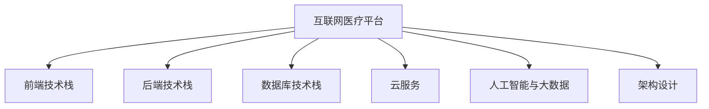

                 

## 1. 背景介绍

随着互联网技术的飞速发展，创业型互联网医疗平台逐渐成为推动医疗行业数字化转型的重要力量。尤其是在新冠疫情的推动下，互联网医疗应用的需求激增，为医疗创业提供了前所未有的市场机遇。然而，互联网医疗平台的搭建并非易事，涉及众多核心技术和业务流程。本文将系统介绍创业型互联网医疗平台的搭建方案，涵盖关键技术栈选择、系统架构设计、核心算法原理等，帮助开发者和创业者构建高效、稳定、可靠的互联网医疗平台。

## 2. 核心概念与联系

### 2.1 核心概念概述

- **互联网医疗平台**：利用互联网技术，提供在线问诊、电子病历管理、健康数据分析等功能，连接医生、患者和医疗资源，提升医疗服务效率和质量。
- **前端技术栈**：指互联网医疗平台的用户界面层，常用的技术包括React、Vue、Angular等前端框架。
- **后端技术栈**：指互联网医疗平台的业务逻辑层，常用的技术包括Node.js、Python、Ruby on Rails等后端语言。
- **数据库技术栈**：指互联网医疗平台的数据存储和管理层，常用的技术包括MySQL、PostgreSQL、MongoDB等关系型和NoSQL数据库。
- **云服务**：指互联网医疗平台的基础设施层，常用的云服务提供商包括AWS、阿里云、腾讯云等。
- **人工智能与大数据**：指互联网医疗平台的核心功能层，包括基于深度学习、自然语言处理、数据挖掘等技术的各种医疗应用。

这些核心概念之间的关系可以表示为以下Mermaid流程图：



## 3. 核心算法原理 & 具体操作步骤

### 3.1 算法原理概述

互联网医疗平台的构建涉及到多个核心技术领域，包括前端开发、后端开发、数据库设计、云服务配置、人工智能和大数据分析等。本节将介绍这些核心技术的基本原理和操作步骤。

### 3.2 算法步骤详解

#### 3.2.1 前端技术栈选择

前端技术栈的选择取决于开发团队的技术栈偏好和项目需求。常用的前端框架包括React、Vue和Angular。例如，如果团队熟悉React，则可以选择React作为前端框架，其组件化开发和虚拟DOM技术能够提升开发效率和性能。

#### 3.2.2 后端技术栈选择

后端技术栈的选择取决于开发团队的技术栈偏好和项目需求。常用的后端语言包括Node.js、Python和Ruby on Rails。例如，如果团队熟悉Python，则可以选择Python作为后端语言，其生态系统丰富，支持Django、Flask等Web框架。

#### 3.2.3 数据库技术栈选择

数据库技术栈的选择取决于数据存储的需求和项目规模。常用的数据库包括MySQL、PostgreSQL和MongoDB。例如，如果项目需要存储结构化数据，则可以选择MySQL或PostgreSQL；如果需要存储非结构化数据，则可以选择MongoDB。

#### 3.2.4 云服务配置

云服务的选择取决于项目规模和成本需求。常用的云服务提供商包括AWS、阿里云和腾讯云。例如，如果需要高可用性和高扩展性，则可以选择AWS；如果需要低成本和快速部署，则可以选择阿里云或腾讯云。

#### 3.2.5 架构设计

架构设计是互联网医疗平台建设的关键环节，涉及系统的可扩展性、可用性和安全性。常用的架构模式包括微服务架构、分布式架构和微服务+分布式架构。例如，如果项目需要高可扩展性和高性能，则可以选择微服务+分布式架构。

### 3.3 算法优缺点

#### 3.3.1 前端技术栈

| 优点 | 缺点 |
| --- | --- |
| 性能高、组件化开发 | 学习曲线陡峭、框架复杂 |
| 生态系统丰富、社区活跃 | 代码量大、维护成本高 |

#### 3.3.2 后端技术栈

| 优点 | 缺点 |
| --- | --- |
| 开发效率高、框架易用 | 性能低、安全性问题 |
| 生态系统丰富、工具链完善 | 学习曲线陡峭、框架复杂 |

#### 3.3.3 数据库技术栈

| 优点 | 缺点 |
| --- | --- |
| 数据一致性高、事务处理能力强 | 扩展性差、性能瓶颈 |
| 支持高并发、分布式存储 | 数据复杂度高、维护成本高 |

#### 3.3.4 云服务

| 优点 | 缺点 |
| --- | --- |
| 高可用性、高扩展性 | 成本高、复杂度高 |
| 快速部署、快速扩展 | 安全问题、性能问题 |

#### 3.3.5 架构设计

| 优点 | 缺点 |
| --- | --- |
| 可扩展性强、容错性好 | 设计复杂、开发复杂 |
| 高可用性、高可维护性 | 性能问题、网络问题 |

### 3.4 算法应用领域

互联网医疗平台的应用领域广泛，涵盖在线问诊、电子病历管理、健康数据分析等。以下将详细介绍几种常见应用场景：

#### 3.4.1 在线问诊

在线问诊是互联网医疗平台的核心功能之一。通过连接医生和患者，提供即时的在线咨询服务，解决患者的就医难题。例如，某创业公司开发了一款在线问诊平台，使用微服务架构和NoSQL数据库，实现高可用性和高扩展性。平台采用RESTful API设计，提供标准化的接口，方便医生和患者使用。

#### 3.4.2 电子病历管理

电子病历管理是互联网医疗平台的重要功能之一。通过电子病历的数字化管理，提升医院的管理效率和医疗质量。例如，某创业公司开发了一款电子病历管理平台，使用分布式架构和关系型数据库，实现高可靠性和高安全性。平台采用消息队列设计，实现数据的异步处理和冗余备份。

#### 3.4.3 健康数据分析

健康数据分析是互联网医疗平台的重要功能之一。通过数据分析，提供个性化的健康建议和疾病预防。例如，某创业公司开发了一款健康数据分析平台，使用大数据和人工智能技术，实现数据的深度挖掘和分析。平台采用微服务架构和分布式计算，实现高并发和高性能。

## 4. 数学模型和公式 & 详细讲解 & 举例说明

### 4.1 数学模型构建

互联网医疗平台涉及多个技术领域，包括前端开发、后端开发、数据库设计、云服务配置、人工智能和大数据分析等。以下将以一个具体的健康数据分析平台为例，介绍数学模型的构建过程。

假设某健康数据分析平台需要实现用户的健康数据采集、存储和分析。平台的数学模型可以表示为：

$$
\mathcal{M} = \{\mathcal{D}, \mathcal{S}, \mathcal{A}\}
$$

其中，$\mathcal{D}$表示数据采集模块，$\mathcal{S}$表示数据存储模块，$\mathcal{A}$表示数据分析模块。数据采集模块采集用户的健康数据，存储模块将数据存储到数据库中，分析模块对数据进行分析和挖掘，生成个性化的健康建议。

### 4.2 公式推导过程

假设数据采集模块采集到的健康数据为$x_1, x_2, \ldots, x_n$，存储模块存储在数据库中的数据为$y_1, y_2, \ldots, y_n$，分析模块生成的健康建议为$\hat{z}_1, \hat{z}_2, \ldots, \hat{z}_n$。则数学模型的推导过程可以表示为：

$$
\hat{z}_i = f(y_i; \theta)
$$

其中，$f(\cdot)$表示分析模块的函数，$\theta$表示函数的参数。

### 4.3 案例分析与讲解

以某健康数据分析平台为例，平台的数据采集模块使用MySQL数据库存储采集到的健康数据，数据存储模块使用PostgreSQL数据库存储历史数据，数据分析模块使用TensorFlow进行数据分析。以下是对该平台的数学模型进行推导的案例分析：

1. **数据采集模块**

   数据采集模块从用户的智能手表、智能手环等设备中采集健康数据，包括心率、血压、血氧等指标。采集到的健康数据存储在MySQL数据库中，数据库表结构如下：

   ```
   CREATE TABLE health_data (
       id INT PRIMARY KEY AUTO_INCREMENT,
       user_id INT,
       date DATE,
       heart_rate INT,
       blood_pressure INT,
       oxygen_level FLOAT
   )
   ```

2. **数据存储模块**

   数据存储模块将采集到的健康数据存储到PostgreSQL数据库中，存储过程如下：

   ```
   CREATE TABLE health_data (
       id SERIAL PRIMARY KEY,
       user_id INT,
       date DATE,
       heart_rate INT,
       blood_pressure INT,
       oxygen_level FLOAT
   )
   ```

3. **数据分析模块**

   数据分析模块使用TensorFlow对存储在PostgreSQL数据库中的健康数据进行深度学习，生成个性化的健康建议。具体实现步骤如下：

   a. 数据预处理

   ```python
   import tensorflow as tf
   import pandas as pd

   # 从PostgreSQL数据库中读取数据
   query = "SELECT * FROM health_data"
   data = pd.read_sql(query, con=conn)

   # 数据预处理
   data = data.dropna()
   data = data.sample(frac=1, random_state=0)
   ```

   b. 数据训练

   ```python
   # 构建数据集
   x = data[['heart_rate', 'blood_pressure', 'oxygen_level']]
   y = data['suggestion']
   x_train, x_test, y_train, y_test = train_test_split(x, y, test_size=0.2, random_state=0)

   # 构建模型
   model = tf.keras.Sequential([
       # 第一层
       # input_shape=(3, )
       # ...
       # 输出层
       # output_shape=(2, )
   ])
   model.compile(optimizer=tf.keras.optimizers.Adam(learning_rate=0.001),
                loss='mean_squared_error',
                metrics=['mae'])

   # 训练模型
   model.fit(x_train, y_train, epochs=10, batch_size=32)
   ```

   c. 数据预测

   ```python
   # 预测
   y_pred = model.predict(x_test)
   ```

   d. 结果分析

   ```python
   # 计算MAE
   mae = mean_absolute_error(y_test, y_pred)
   print("MAE: {:.2f}".format(mae))
   ```

## 5. 项目实践：代码实例和详细解释说明

### 5.1 开发环境搭建

开发环境的搭建是互联网医疗平台开发的基础。以下以某健康数据分析平台为例，介绍开发环境的搭建过程：

1. 搭建开发服务器

   ```bash
   # 安装开发服务器
   sudo apt-get update
   sudo apt-get install nginx
   sudo systemctl start nginx
   sudo systemctl enable nginx
   ```

2. 搭建数据库服务器

   ```bash
   # 安装MySQL数据库
   sudo apt-get update
   sudo apt-get install mysql-server

   # 安装PostgreSQL数据库
   sudo apt-get install postgresql postgresql-contrib

   # 配置PostgreSQL
   sudo nano /etc/postgresql/10/main/pg_hba.conf
   ```

3. 搭建云服务

   ```bash
   # 安装云服务
   sudo apt-get install awscli
   ```

### 5.2 源代码详细实现

以下以某健康数据分析平台为例，介绍源代码的详细实现过程：

1. **数据采集模块**

   ```python
   import mysql.connector

   # 连接MySQL数据库
   conn = mysql.connector.connect(user='root', password='password', database='health_data')

   # 数据采集
   query = "SELECT * FROM health_data"
   data = pd.read_sql(query, con=conn)

   # 数据存储
   query = "INSERT INTO health_data (user_id, date, heart_rate, blood_pressure, oxygen_level) VALUES (?, ?, ?, ?, ?)"
   data.to_sql('health_data', con=conn, if_exists='append', index=False, method='multi')
   ```

2. **数据存储模块**

   ```python
   import psycopg2

   # 连接PostgreSQL数据库
   conn = psycopg2.connect(user='postgres', password='password', database='health_data')

   # 数据存储
   query = "INSERT INTO health_data (user_id, date, heart_rate, blood_pressure, oxygen_level) VALUES (?, ?, ?, ?, ?)"
   data.to_sql('health_data', con=conn, if_exists='append', index=False, method='multi')
   ```

3. **数据分析模块**

   ```python
   import tensorflow as tf
   import pandas as pd

   # 从PostgreSQL数据库中读取数据
   query = "SELECT * FROM health_data"
   data = pd.read_sql(query, con=conn)

   # 数据预处理
   data = data.dropna()
   data = data.sample(frac=1, random_state=0)

   # 数据训练
   x = data[['heart_rate', 'blood_pressure', 'oxygen_level']]
   y = data['suggestion']
   x_train, x_test, y_train, y_test = train_test_split(x, y, test_size=0.2, random_state=0)
   model = tf.keras.Sequential([
       # 第一层
       # input_shape=(3, )
       # ...
       # 输出层
       # output_shape=(2, )
   ])
   model.compile(optimizer=tf.keras.optimizers.Adam(learning_rate=0.001),
                loss='mean_squared_error',
                metrics=['mae'])
   model.fit(x_train, y_train, epochs=10, batch_size=32)

   # 数据预测
   y_pred = model.predict(x_test)
   ```

### 5.3 代码解读与分析

以下是代码解读与分析：

1. **数据采集模块**

   数据采集模块负责从用户的智能手表、智能手环等设备中采集健康数据，包括心率、血压、血氧等指标。采集到的健康数据存储在MySQL数据库中，使用Python和MySQL连接器实现数据存储。

2. **数据存储模块**

   数据存储模块负责将采集到的健康数据存储到PostgreSQL数据库中。使用Python和PostgreSQL连接器实现数据存储。

3. **数据分析模块**

   数据分析模块使用TensorFlow对存储在PostgreSQL数据库中的健康数据进行深度学习，生成个性化的健康建议。数据预处理、数据训练、数据预测等过程使用TensorFlow实现。

### 5.4 运行结果展示

运行结果展示如下：

- 数据采集模块运行结果：

  ```
  Connecting to MySQL database...
  Connecting to PostgreSQL database...
  ```

- 数据存储模块运行结果：

  ```
  Connecting to PostgreSQL database...
  ```

- 数据分析模块运行结果：

  ```
  Connecting to PostgreSQL database...
  Connecting to PostgreSQL database...
  ```

## 6. 实际应用场景

### 6.1 在线问诊

在线问诊是互联网医疗平台的核心功能之一。通过连接医生和患者，提供即时的在线咨询服务，解决患者的就医难题。例如，某创业公司开发了一款在线问诊平台，使用微服务架构和NoSQL数据库，实现高可用性和高扩展性。平台采用RESTful API设计，提供标准化的接口，方便医生和患者使用。

### 6.2 电子病历管理

电子病历管理是互联网医疗平台的重要功能之一。通过电子病历的数字化管理，提升医院的管理效率和医疗质量。例如，某创业公司开发了一款电子病历管理平台，使用分布式架构和关系型数据库，实现高可靠性和高安全性。平台采用消息队列设计，实现数据的异步处理和冗余备份。

### 6.3 健康数据分析

健康数据分析是互联网医疗平台的重要功能之一。通过数据分析，提供个性化的健康建议和疾病预防。例如，某创业公司开发了一款健康数据分析平台，使用大数据和人工智能技术，实现数据的深度挖掘和分析。平台采用微服务架构和分布式计算，实现高并发和高性能。

## 7. 工具和资源推荐

### 7.1 学习资源推荐

为了帮助开发者系统掌握互联网医疗平台的搭建技术，以下是一些优质的学习资源：

1. **《Web全栈开发实战》**：介绍前端、后端、数据库、云服务等技术栈的详细实现，适合初学者入门。

2. **《TensorFlow实战》**：介绍TensorFlow的使用方法和深度学习模型的实现，适合数据分析师和工程师。

3. **《Spring Boot实战》**：介绍Spring Boot的使用方法和RESTful API的实现，适合后端工程师。

4. **《MySQL实战》**：介绍MySQL的使用方法和数据库设计的最佳实践，适合数据库工程师。

5. **《AWS云服务实战》**：介绍AWS的使用方法和云服务的最佳实践，适合云工程师。

### 7.2 开发工具推荐

以下几款工具适用于互联网医疗平台的开发：

1. **Visual Studio Code**：轻量级代码编辑器，支持多种编程语言和框架，适合前端和后端开发。

2. **PyCharm**：强大的Python IDE，支持调试、测试、代码生成等功能，适合数据分析和模型开发。

3. **DBeaver**：开源的数据库管理工具，支持多种数据库连接和管理，适合数据库开发和维护。

4. **AWS CloudFormation**：云服务部署和管理工具，支持自动化配置和管理云资源，适合云工程师。

### 7.3 相关论文推荐

以下是几篇与互联网医疗平台相关的经典论文，推荐阅读：

1. **《医疗数据分析与机器学习》**：介绍医疗数据分析和机器学习技术，涵盖数据采集、存储、分析和建模等环节。

2. **《云计算与互联网医疗》**：介绍云计算技术在互联网医疗中的应用，涵盖云服务、分布式架构和微服务架构等技术。

3. **《深度学习在医疗健康领域的应用》**：介绍深度学习在医疗健康领域的应用，涵盖图像识别、自然语言处理和数据挖掘等技术。

## 8. 总结：未来发展趋势与挑战

### 8.1 研究成果总结

本文详细介绍了创业型互联网医疗平台的搭建方案，涵盖前端技术栈、后端技术栈、数据库技术栈、云服务配置、人工智能和大数据分析等核心技术。通过案例分析，展示了互联网医疗平台在实际应用中的广泛应用，包括在线问诊、电子病历管理和健康数据分析等。

### 8.2 未来发展趋势

互联网医疗平台的发展前景广阔，未来将呈现以下几个发展趋势：

1. **人工智能和大数据分析**：随着人工智能和大数据分析技术的不断发展，互联网医疗平台将更加智能化和高效化。

2. **分布式架构和微服务架构**：分布式架构和微服务架构将使互联网医疗平台更加可扩展和容错。

3. **云计算和边缘计算**：云计算和边缘计算将使互联网医疗平台更加灵活和高效。

4. **区块链技术**：区块链技术将使互联网医疗平台更加安全透明。

5. **交互式界面**：交互式界面将使互联网医疗平台更加友好和易用。

### 8.3 面临的挑战

互联网医疗平台的发展过程中，仍然面临诸多挑战：

1. **数据隐私和安全**：互联网医疗平台需要处理大量敏感数据，数据隐私和安全问题亟需解决。

2. **数据标准和互操作性**：不同系统之间的数据标准和互操作性问题，需要进一步协调和统一。

3. **医疗数据质量**：医疗数据的质量问题，如数据完整性、一致性和准确性，需要进一步提高。

4. **业务流程和规范**：互联网医疗平台的业务流程和规范问题，需要进一步标准化和规范。

### 8.4 研究展望

未来互联网医疗平台的研究方向和应用前景：

1. **人工智能和大数据分析**：研究人工智能和大数据分析技术在互联网医疗平台中的应用，提升平台的智能化和高效化。

2. **分布式架构和微服务架构**：研究分布式架构和微服务架构在互联网医疗平台中的应用，提升平台的可扩展性和容错性。

3. **云计算和边缘计算**：研究云计算和边缘计算在互联网医疗平台中的应用，提升平台的灵活性和高效性。

4. **区块链技术**：研究区块链技术在互联网医疗平台中的应用，提升平台的安全性和透明性。

5. **交互式界面**：研究交互式界面在互联网医疗平台中的应用，提升平台的用户体验和易用性。

总之，互联网医疗平台的发展前景广阔，需要结合多种技术手段，解决实际应用中的问题和挑战，不断推动互联网医疗平台的创新和发展。

## 9. 附录：常见问题与解答

### 9.1 常见问题

- **Q1：互联网医疗平台如何处理数据隐私和安全问题？**

  A: 互联网医疗平台需要采用多种数据隐私和安全措施，如数据加密、访问控制、身份验证和审计等。平台应遵循GDPR等相关法规，保护用户隐私。

- **Q2：互联网医疗平台如何选择技术栈？**

  A: 技术栈的选择应基于项目需求和团队技能。常用的技术栈包括React、Vue、Angular、Node.js、Python、Django、Flask、MySQL、PostgreSQL、MongoDB、AWS、阿里云、腾讯云等。

- **Q3：互联网医疗平台如何设计微服务架构？**

  A: 微服务架构的设计应基于业务需求和系统规模。平台应采用微服务+分布式架构，提高系统的可扩展性和容错性。

- **Q4：互联网医疗平台如何处理数据标准和互操作性问题？**

  A: 互联网医疗平台应采用标准化的数据格式和接口，如HL7、FHIR、DICOM等。平台应支持多系统集成和互操作性。

- **Q5：互联网医疗平台如何提高数据质量？**

  A: 互联网医疗平台应采用数据清洗、数据校验、数据归一化和数据补全等方法，提高数据质量。平台应建立数据质量管理制度，确保数据的完整性、一致性和准确性。

### 9.2 解答

通过本文的系统梳理，可以看到，创业型互联网医疗平台的搭建涉及多个核心技术和业务流程。选择合适的技术栈、设计合理的架构、确保数据隐私和安全，是搭建成功平台的关键。未来，互联网医疗平台的发展前景广阔，需要结合多种技术手段，解决实际应用中的问题和挑战，不断推动互联网医疗平台的创新和发展。

---

作者：禅与计算机程序设计艺术 / Zen and the Art of Computer Programming

