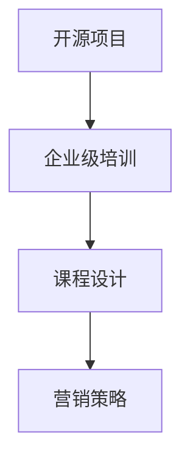

                 

# 创建开源项目的企业级培训课程：课程设计和营销

> 关键词：开源项目, 企业级培训, 课程设计, 营销策略

## 1. 背景介绍

在当今数字化时代，开源项目已经成为了推动技术创新和企业发展的关键力量。企业级培训课程的开发和营销，不仅能够帮助组织培养技术人才，还能够提升企业的技术竞争力。本文将系统介绍如何设计和管理一个企业级培训课程，并分享一些实用的营销策略，以确保课程的成功实施。

## 2. 核心概念与联系

### 2.1 核心概念概述

在进行开源项目的企业级培训课程设计和营销之前，首先需要理解一些核心概念：

- **开源项目**：指公开源代码的、可自由修改和分发的软件项目。开源项目能够汇聚全球程序员的智慧，推动技术创新。
- **企业级培训**：指针对企业内部或面向市场提供的技术技能培训，旨在提升员工技能、推动企业技术进步。
- **课程设计**：指根据培训目标和学员需求，制定教学大纲、设计课程内容和教学方法的过程。
- **营销策略**：指通过市场调研、宣传推广等方式，提高培训课程知名度和吸引力的策略。

这些核心概念之间存在着紧密的联系。企业级培训课程的成功实施，不仅需要高质量的课程内容和科学的教学设计，还需要有效的营销策略来吸引目标学员和提高课程的参与度。

### 2.2 核心概念原理和架构的 Mermaid 流程图



## 3. 核心算法原理 & 具体操作步骤

### 3.1 算法原理概述

企业级培训课程的设计和营销，本质上是一个基于需求导向的优化过程。通过市场调研和学员需求分析，确定培训目标和课程内容，并运用营销策略吸引学员参与。这一过程可以抽象为以下几步：

1. **需求分析**：通过调查和访谈等方式，了解目标学员的技术水平、学习需求和职业发展目标。
2. **课程设计**：根据需求分析结果，设计合理的教学大纲和课程内容，选择合适的教学方法和评估方式。
3. **营销推广**：通过多渠道宣传推广，提高课程的曝光度和吸引力，吸引目标学员参与。

### 3.2 算法步骤详解

#### 3.2.1 需求分析

**Step 1: 市场调研**  
- 使用问卷调查、深度访谈等方式，收集目标学员的技术背景、学习需求和职业发展目标。
- 分析调研数据，确定培训的目标受众和课程需求。

**Step 2: 学员分类**  
- 将目标学员分为不同类别，如初学者、中级开发者、高级开发者等。
- 针对不同类别的学员，设计不同难度的课程内容。

#### 3.2.2 课程设计

**Step 3: 确定课程目标**  
- 根据需求分析结果，明确课程的教学目标和预期成果。
- 设定课程的深度和广度，确保课程内容既有挑战性，又不过于复杂。

**Step 4: 设计教学大纲**  
- 制定详细的课程大纲，包括每个模块的学习目标、教学内容和评估方式。
- 设计多样化的教学活动，如讲授、实验、讨论等，提高学员的学习兴趣和参与度。

**Step 5: 选择合适的教学方法**  
- 根据课程目标和学员特点，选择合适的教学方法，如项目驱动、案例分析、小组讨论等。
- 引入实践项目和案例分析，增强学员的实际动手能力。

**Step 6: 评估与反馈**  
- 设计科学的评估方式，如在线测试、项目评审、学员反馈等。
- 根据学员反馈，不断优化课程内容和教学方法。

#### 3.2.3 营销策略

**Step 7: 目标市场定位**  
- 确定目标市场，包括企业内部培训和面向市场推广。
- 分析目标市场的需求和痛点，制定相应的推广策略。

**Step 8: 多渠道宣传**  
- 使用社交媒体、专业论坛、企业官网等渠道进行宣传推广。
- 发布课程介绍、学员评价和成功案例，提高课程的吸引力。

**Step 9: 吸引目标学员**  
- 提供免费试听课程或前置学习材料，降低学员的参与门槛。
- 利用学员推荐和口碑传播，扩大课程的影响力。

### 3.3 算法优缺点

#### 3.3.1 优点

- **灵活性高**：根据市场需求和学员反馈，灵活调整课程内容和教学方法。
- **覆盖面广**：面向企业内部和市场，能够满足不同层次和背景学员的需求。
- **低成本高效益**：利用开源项目和在线平台，降低课程开发和推广的成本。

#### 3.3.2 缺点

- **质量控制难度大**：开源项目可能存在质量参差不齐的情况，课程内容需要严格把关。
- **学员动机不一**：不同学员的学习动机和目标不同，课程设计需要多样化。
- **竞争激烈**：市场上的培训课程繁多，需要进行有效的市场推广才能吸引学员。

### 3.4 算法应用领域

企业级培训课程设计和营销策略，广泛应用于软件开发、数据分析、云计算等多个技术领域。例如：

- **软件开发**：面向企业内部开发人员，提供最新的编程语言、框架和工具的培训。
- **数据分析**：针对数据工程师和分析师，提供数据建模、数据可视化和大数据分析技能的培训。
- **云计算**：面向IT运维人员和开发人员，提供云计算平台、容器化和DevOps技能的培训。

## 4. 数学模型和公式 & 详细讲解 & 举例说明

### 4.1 数学模型构建

本节将使用数学语言对企业级培训课程的设计和营销过程进行系统描述。

设目标学员数为 $N$，学员的技术水平为 $T$，学员的学习需求为 $L$，课程的教学目标为 $G$，课程设计策略为 $S$，营销推广策略为 $M$。

则课程设计和营销的数学模型可以表示为：

$$
\max_{S, M} \text{Effectiveness}(N, T, L, G, S, M)
$$

其中 $\text{Effectiveness}$ 表示课程设计和营销的总体效果，包括课程满意度、学员参与度、知识掌握度等指标。

### 4.2 公式推导过程

**Step 1: 需求分析**  
- 使用问卷调查和深度访谈，收集目标学员的技术水平 $T$、学习需求 $L$ 和职业发展目标。

**Step 2: 课程设计**  
- 根据需求分析结果，设计教学大纲和课程内容。
- 设定课程的教学目标 $G$ 和教学方法 $S$。

**Step 3: 营销推广**  
- 确定目标市场定位，设计宣传推广策略 $M$。
- 通过多渠道宣传，吸引目标学员参与课程。

**Step 4: 评估与反馈**  
- 设计科学的评估方式，收集学员反馈。
- 根据反馈优化课程内容和教学方法。

### 4.3 案例分析与讲解

假设某IT公司需要对企业内部开发人员进行大数据技能培训，可以按照以下步骤进行课程设计和营销：

**Step 1: 需求分析**  
- 通过问卷调查，了解开发人员的技术水平和职业发展目标。
- 分析需求数据，确定培训的目标受众和课程需求。

**Step 2: 课程设计**  
- 制定详细的大数据培训大纲，包括数据建模、数据可视化和大数据分析等内容。
- 设计实践项目和案例分析，提高学员的实际动手能力。

**Step 3: 营销推广**  
- 在企业官网和专业论坛上发布课程介绍和学员评价。
- 提供免费试听课程，降低学员的参与门槛。

**Step 4: 评估与反馈**  
- 通过在线测试和项目评审，评估学员的学习效果。
- 根据学员反馈，优化课程内容和教学方法。

## 5. 项目实践：代码实例和详细解释说明

### 5.1 开发环境搭建

在进行培训课程设计和营销之前，需要先搭建开发环境。以下是使用Python进行Django开发的环境配置流程：

1. 安装Anaconda：从官网下载并安装Anaconda，用于创建独立的Python环境。

2. 创建并激活虚拟环境：
```bash
conda create -n django-env python=3.8 
conda activate django-env
```

3. 安装Django：使用pip安装Django框架。
```bash
pip install django
```

4. 安装各类工具包：
```bash
pip install numpy pandas scikit-learn matplotlib tqdm jupyter notebook ipython
```

完成上述步骤后，即可在`django-env`环境中开始培训课程设计和营销实践。

### 5.2 源代码详细实现

这里我们以创建一门开源的Python课程为例，介绍如何使用Django进行企业级培训课程的设计和管理。

首先，定义课程相关的模型和表单：

```python
from django.db import models

class Course(models.Model):
    name = models.CharField(max_length=100)
    description = models.TextField()
    target_audience = models.CharField(max_length=100)
    requirement = models.TextField()
    prerequisites = models.TextField()
    duration = models.IntegerField()
    modules = models.ManyToManyField('Module')
    
class Module(models.Model):
    name = models.CharField(max_length=100)
    description = models.TextField()
    content = models.TextField()
    tests = models.ManyToManyField('Test')
    
class Test(models.Model):
    question = models.TextField()
    answer = models.TextField()
    choices = models.TextField()
    
class Enrollment(models.Model):
    course = models.ForeignKey(Course, on_delete=models.CASCADE)
    student = models.ForeignKey(Student, on_delete=models.CASCADE)
```

然后，定义课程的CRUD操作：

```python
from django.shortcuts import render, redirect
from django.views.generic import CreateView, UpdateView, DeleteView
from .forms import CourseForm, ModuleForm, TestForm
from .models import Course, Module, Test

def course_list(request):
    courses = Course.objects.all()
    return render(request, 'courses/course_list.html', {'courses': courses})
    
def course_detail(request, pk):
    course = Course.objects.get(pk=pk)
    return render(request, 'courses/course_detail.html', {'course': course})

class CourseCreateView(CreateView):
    model = Course
    fields = ['name', 'description', 'target_audience', 'requirement', 'prerequisites', 'duration']
    template_name = 'courses/course_create.html'
    
class CourseUpdateView(UpdateView):
    model = Course
    fields = ['name', 'description', 'target_audience', 'requirement', 'prerequisites', 'duration']
    template_name = 'courses/course_update.html'
    
class CourseDeleteView(DeleteView):
    model = Course
    template_name = 'courses/course_confirm_delete.html'
```

接着，编写前端页面模板：

```html
<!-- courses/course_list.html -->


  <h1>Courses List</h1>
  <ul>
    
      <li><a href="">{{ course.name }}</a></li>
    
  </ul>
  <a href="">Create Course</a>


<!-- courses/course_detail.html -->


  <h1>{{ course.name }}</h1>
  <p>{{ course.description }}</p>
  <p>Target Audience: {{ course.target_audience }}</p>
  <p>Requirement: {{ course.requirement }}</p>
  <p>Prerequisites: {{ course.prerequisites }}</p>
  <p>Duration: {{ course.duration }} weeks</p>
  <a href="">Update</a>
  <a href="">Delete</a>

```

最后，启动Django项目并进行测试：

```python
# manage.py runserver 8000
```

打开浏览器访问http://localhost:8000，即可开始培训课程的设计和管理。

### 5.3 代码解读与分析

让我们再详细解读一下关键代码的实现细节：

**Course模型**：
- 定义了课程的基本属性，包括课程名称、描述、目标受众、先决条件、时长等。
- 使用了Django的内置字段类型，方便数据的存储和查询。

**Module模型**：
- 定义了课程的模块，包括模块名称、描述和内容。
- 通过ManyToManyField与Course模型建立多对多关系，方便课程与模块的关联。

**Test模型**：
- 定义了课程的测试题，包括测试题目、答案和选项。
- 通过ManyToManyField与Module模型建立多对多关系，方便模块与测试题的关联。

**Enrollment模型**：
- 定义了学员的报名信息，包括选修的课程和学员信息。
- 通过ForeignKey与Course和Student模型建立一对多关系，方便学员和课程的关联。

**Course视图**：
- 定义了课程的CRUD操作，包括课程列表、课程详情、创建、更新和删除课程。
- 使用了Django的通用视图类，方便实现常见的表单提交和数据保存。

通过以上代码，可以看出Django框架在企业级培训课程的设计和管理中提供了便捷的开发工具。开发者可以高效地实现课程的CRUD功能，并通过表单和模板，提升用户体验。

## 6. 实际应用场景

### 6.1 在线教育平台

基于Django开发的在线教育平台，可以方便地管理企业级培训课程。平台不仅能够实现课程的在线发布和报名，还能提供互动讨论、在线测试等功能，提升学员的学习效果。

### 6.2 企业内部培训系统

企业可以通过内部培训系统，实现技术技能的系统化培训。系统能够自动推荐适合的课程，记录学员的学习进度和成绩，方便企业内部的技术管理和人才培育。

### 6.3 开源社区培训

开源社区可以利用在线培训平台，为开源项目的贡献者提供系统化的技术培训。平台能够发布最新的开源课程，收集学员反馈，持续优化课程内容。

### 6.4 未来应用展望

随着Django和开源技术的不断发展，企业级培训课程设计和营销将呈现以下几个发展趋势：

1. **云化部署**：越来越多的培训课程将采用云化部署，降低硬件成本，提升系统的可扩展性和可靠性。
2. **数据驱动**：利用大数据和AI技术，分析学员的学习行为和课程效果，提供个性化推荐和优化建议。
3. **移动端支持**：培训课程将全面支持移动端设备，方便学员随时随地进行学习。
4. **互动化增强**：引入更多互动元素，如实时问答、在线讨论等，提升学员的学习参与度和互动体验。
5. **多语言支持**：培训课程将支持多语言教学，满足不同国家和地区的学习需求。

## 7. 工具和资源推荐

### 7.1 学习资源推荐

为了帮助开发者系统掌握企业级培训课程设计和营销的理论基础和实践技巧，这里推荐一些优质的学习资源：

1. Django官方文档：Django框架的官方文档，提供了完整的Django开发教程和实践指南。
2. Python编程之道：由著名Python专家撰写，详细介绍了Python编程技巧和最佳实践。
3. 《Django实战》书籍：Django实战项目的详细案例，涵盖了Django的各个模块和应用场景。
4. 《企业级培训体系设计》书籍：系统介绍企业级培训体系的设计方法和实践经验。
5. Coursera《数据科学导论》课程：通过数据科学导论课程，学习数据分析和机器学习的实战技巧。

通过对这些资源的学习实践，相信你一定能够快速掌握企业级培训课程的设计和营销技巧，并用于解决实际的NLP问题。

### 7.2 开发工具推荐

高效的开发离不开优秀的工具支持。以下是几款用于Django开发的企业级培训课程设计的常用工具：

1. Django：由Python社区主导开发的Web框架，支持MVC架构，便于开发复杂的企业级应用。
2. VS Code：轻量级的开发环境，支持Python、Django等语言的开发，功能强大且易用。
3. Git：版本控制系统，方便协作开发和代码管理。
4. PyCharm：强大的Python开发工具，提供代码提示、自动重构等功能。
5. Docker：容器化技术，便于打包和部署Django应用，支持多环境测试和部署。

合理利用这些工具，可以显著提升企业级培训课程的设计和营销的开发效率，加快创新迭代的步伐。

### 7.3 相关论文推荐

企业级培训课程设计和营销技术的发展源于学界的持续研究。以下是几篇奠基性的相关论文，推荐阅读：

1. The Django web framework: its evolution, purpose and value propositions：Django框架的介绍和演变，介绍了Django的核心概念和应用场景。
2. Designing Effective Learning and Development Strategies：通过案例分析，讨论如何设计有效的学习和发展策略。
3. Open Educational Resources and Online Learning for Developers：探讨如何使用在线教育资源进行开发者培训。
4. The future of enterprise training: from LMS to LEC：探讨企业培训的未来发展方向，从LMS到LEC的转变。
5. Data-Driven Learning Analytics in Online Education：利用大数据分析在线学习行为，提供个性化推荐和优化建议。

这些论文代表了大语言模型微调技术的发展脉络。通过学习这些前沿成果，可以帮助研究者把握学科前进方向，激发更多的创新灵感。

## 8. 总结：未来发展趋势与挑战

### 8.1 总结

本文对企业级培训课程的设计和营销方法进行了全面系统的介绍。首先阐述了企业级培训课程的重要性和当前的发展趋势，明确了课程设计和营销在企业技术人才培养中的关键作用。其次，从原理到实践，详细讲解了企业级培训课程的构建过程，并给出了实用的营销策略。同时，本文还广泛探讨了企业级培训课程在在线教育、企业内部培训和开源社区培训等不同场景中的应用前景，展示了课程设计和营销的广泛价值。

通过本文的系统梳理，可以看到，企业级培训课程设计和营销是一个系统性工程，需要结合企业实际需求和学员特点，精心设计课程内容，科学制定推广策略。未来，随着技术的不断进步和应用场景的扩展，企业级培训课程设计和营销方法也将不断创新，为企业的技术人才培育和技术进步提供更大的助力。

### 8.2 未来发展趋势

展望未来，企业级培训课程设计和营销技术将呈现以下几个发展趋势：

1. **数据驱动优化**：利用大数据和AI技术，实时监测课程效果和学员反馈，动态调整课程内容和教学方法。
2. **个性化推荐**：通过分析学员的学习行为和偏好，提供个性化的课程推荐，提升学习效率和体验。
3. **多渠道整合**：整合线上线下培训资源，提供多样化、灵活的学习路径，满足不同学员的需求。
4. **云化部署**：利用云平台提供课程管理、学员互动和评估等功能，降低企业内部IT运维成本。
5. **混合学习模式**：结合在线学习、面授培训和实践项目，提供混合学习模式，提升学习效果。

### 8.3 面临的挑战

尽管企业级培训课程设计和营销技术已经取得了显著成效，但在迈向更加智能化、普适化应用的过程中，它仍面临诸多挑战：

1. **内容质量控制**：课程内容的筛选和优化需要耗费大量时间和精力，如何确保课程质量是关键。
2. **学员动机多样化**：不同学员的学习动机和目标不同，如何设计多样化的课程内容和教学方法，满足不同学员的需求。
3. **技术迭代快**：技术发展日新月异，如何及时更新课程内容，保持技术的领先性。
4. **营销效果难评估**：如何科学评估营销策略的效果，进行数据驱动的优化调整。
5. **数据安全和隐私**：如何保障学员数据的隐私和安全，防止数据泄露和滥用。

### 8.4 研究展望

面对企业级培训课程设计和营销所面临的挑战，未来的研究需要在以下几个方面寻求新的突破：

1. **内容质量优化**：利用AI技术自动化课程内容的筛选和优化，提升课程质量。
2. **个性化推荐算法**：开发更加智能的个性化推荐算法，提升学员的学习效率和满意度。
3. **混合学习模式**：探索混合学习模式的优化策略，平衡线上线下学习的优势。
4. **数据驱动营销**：利用大数据和AI技术，科学评估营销策略的效果，进行数据驱动的优化调整。
5. **隐私保护技术**：研究数据保护和隐私保护的最新技术，确保学员数据的安全和隐私。

这些研究方向的探索，必将引领企业级培训课程设计和营销技术迈向更高的台阶，为企业的技术人才培育和技术进步提供更大的助力。面向未来，企业级培训课程设计和营销技术还需要与其他人工智能技术进行更深入的融合，如知识表示、因果推理、强化学习等，多路径协同发力，共同推动自然语言理解和智能交互系统的进步。只有勇于创新、敢于突破，才能不断拓展语言模型的边界，让智能技术更好地造福人类社会。

## 9. 附录：常见问题与解答

**Q1：企业级培训课程设计和营销的核心是什么？**

A: 企业级培训课程设计和营销的核心是需求导向的优化过程。通过市场调研和学员需求分析，确定培训目标和课程内容，并运用营销策略吸引学员参与。这一过程需要科学的设计方法和高效的营销策略，以确保课程的成功实施。

**Q2：如何设计高质量的企业级培训课程？**

A: 设计高质量的企业级培训课程需要以下步骤：
1. 需求分析：通过问卷调查和深度访谈，了解目标学员的技术水平和职业发展目标。
2. 课程设计：根据需求分析结果，设计教学大纲和课程内容，选择合适的教学方法和评估方式。
3. 评估与反馈：设计科学的评估方式，收集学员反馈，不断优化课程内容和教学方法。

**Q3：企业级培训课程的营销策略有哪些？**

A: 企业级培训课程的营销策略包括：
1. 多渠道宣传：使用社交媒体、专业论坛、企业官网等渠道进行宣传推广。
2. 吸引目标学员：提供免费试听课程或前置学习材料，降低学员的参与门槛。
3. 利用学员推荐：利用学员推荐和口碑传播，扩大课程的影响力。

**Q4：企业级培训课程的开发环境有哪些？**

A: 企业级培训课程的开发环境包括：
1. Django：Django框架，支持MVC架构，便于开发复杂的企业级应用。
2. VS Code：轻量级的开发环境，支持Python、Django等语言的开发，功能强大且易用。
3. Git：版本控制系统，方便协作开发和代码管理。
4. PyCharm：强大的Python开发工具，提供代码提示、自动重构等功能。
5. Docker：容器化技术，便于打包和部署Django应用，支持多环境测试和部署。

**Q5：企业级培训课程的设计和营销面临哪些挑战？**

A: 企业级培训课程的设计和营销面临以下挑战：
1. 内容质量控制：课程内容的筛选和优化需要耗费大量时间和精力，如何确保课程质量是关键。
2. 学员动机多样化：不同学员的学习动机和目标不同，如何设计多样化的课程内容和教学方法，满足不同学员的需求。
3. 技术迭代快：技术发展日新月异，如何及时更新课程内容，保持技术的领先性。
4. 营销效果难评估：如何科学评估营销策略的效果，进行数据驱动的优化调整。
5. 数据安全和隐私：如何保障学员数据的隐私和安全，防止数据泄露和滥用。

---

作者：禅与计算机程序设计艺术 / Zen and the Art of Computer Programming

