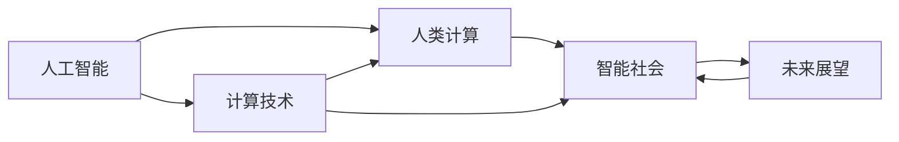

                 

# 创造更美好的世界：人类计算的终极目标

> 关键词：人工智能，计算技术，人类发展，智能社会，未来展望

## 1. 背景介绍

在过去的几十年中，计算技术已经深刻地改变了我们的生活方式和工作方式。从个人电脑到移动互联网，从云计算到人工智能，计算技术的每一次跃迁都带来了社会生产力的巨大提升。如今，随着深度学习、量子计算等前沿技术的崛起，我们正站在人类计算历史的新起点上，向着“创造更美好的世界”这一终极目标迈进。

### 1.1 问题的由来

计算机的出现和发展，极大地解放了人类的劳动力，提高了工作效率，带来了前所未有的便利和可能性。然而，随着计算技术的日益成熟，我们也需要思考：在信息爆炸的时代，如何利用计算技术为人类社会创造更大的福祉？

近年来，人工智能(AI)技术的突飞猛进，尤其是深度学习和大数据技术的应用，使得机器能够进行复杂的模式识别和决策，在某些领域已经超越了人类的表现。然而，AI的崛起也引发了对伦理、隐私、安全等问题的讨论，引起了社会广泛关注。

### 1.2 问题核心关键点

为了回答上述问题，本文将重点探讨以下几个核心关键点：

- 人工智能对人类社会的贡献与挑战
- 人类计算的终极目标及其实现路径
- 计算技术对教育、医疗、交通等领域的潜在影响
- 未来计算技术的发展趋势和前景

通过系统分析这些关键点，我们希望能够为人类计算技术的未来发展提供一些启示和方向。

## 2. 核心概念与联系

### 2.1 核心概念概述

在探讨这些关键点之前，我们先来理解几个核心概念及其相互之间的联系：

- 人工智能（Artificial Intelligence, AI）：指通过计算机模拟人类智能，进行认知、感知、决策等智能行为的学科和技术。
- 计算技术（Computing Technology）：指利用电子器件对信息进行处理、存储和传输的技术，是实现人工智能的基础。
- 人类计算（Human Computing）：指将人类智慧与计算技术相结合，通过计算来提升人类能力的过程。
- 智能社会（Smart Society）：指利用AI和大数据技术，构建信息透明、资源共享、高效协作的社会形态。
- 未来展望（Future Prospects）：指计算技术在教育、医疗、交通等领域可能带来的深刻变革，以及面对的挑战和机遇。

这些概念通过以下Mermaid流程图来展示它们之间的联系：



这个流程图展示了人工智能、计算技术、人类计算、智能社会和未来展望之间的逻辑关系：

1. 人工智能建立在计算技术的基础上，通过数据驱动的模型来模拟人类智能。
2. 人类计算将人工智能与人类智慧相结合，通过计算技术来提升人类能力。
3. 智能社会利用人工智能和大数据技术，构建信息透明、资源共享的社会形态。
4. 未来展望展望计算技术对教育、医疗、交通等领域可能带来的变革，以及面临的挑战和机遇。

这些概念共同构成了人类计算技术的理论基础和实践框架，指引我们朝着创造更美好的世界这一终极目标迈进。

## 3. 核心算法原理 & 具体操作步骤
### 3.1 算法原理概述

人工智能的核心算法之一是机器学习，其通过大量数据训练模型，使其能够进行分类、预测、生成等智能行为。机器学习的核心思想是通过算法从数据中学习规律，并应用这些规律进行预测和决策。

人工智能的算法可以分为监督学习、无监督学习和强化学习三大类：

- 监督学习（Supervised Learning）：使用标注数据训练模型，使其能够根据输入数据和标签进行预测。
- 无监督学习（Unsupervised Learning）：使用未标注数据训练模型，使其能够发现数据中的规律和结构。
- 强化学习（Reinforcement Learning）：通过与环境的交互，使模型学习到最优策略，以最大化预期收益。

这些算法原理在人工智能的各个应用领域中得到了广泛的应用。例如，在语音识别中，监督学习算法可以通过大量的标注语音数据训练模型，使其能够准确地将语音转换为文本；在图像识别中，无监督学习算法可以通过大规模未标注图片数据训练模型，使其能够识别图片中的对象和场景；在自动驾驶中，强化学习算法可以通过与环境的交互，使模型学习到最优的驾驶策略。

### 3.2 算法步骤详解

以监督学习算法为例，其典型步骤包括：

1. 数据收集：收集标注数据集，包含输入和标签。
2. 数据预处理：对数据进行清洗、归一化、分块等预处理操作。
3. 模型选择：选择适合的模型架构，如神经网络、决策树等。
4. 模型训练：使用数据集对模型进行训练，优化模型参数。
5. 模型评估：使用测试集对模型进行评估，检验模型性能。
6. 模型应用：将模型应用于实际问题，进行预测或决策。

以深度学习模型为例，其训练步骤包括：

1. 初始化模型参数。
2. 前向传播：将输入数据输入模型，计算预测结果。
3. 计算损失函数：计算预测结果与真实标签之间的误差。
4. 反向传播：使用反向传播算法，计算损失函数对模型参数的梯度。
5. 更新模型参数：使用梯度下降等优化算法，更新模型参数。
6. 重复步骤2-5，直到模型收敛。

### 3.3 算法优缺点

人工智能算法的优点包括：

- 自动发现规律：算法能够自动从数据中学习规律，无需人工干预。
- 高效处理大规模数据：算法可以处理大规模数据集，提升计算效率。
- 泛化能力强：算法可以泛化到未见过的数据，进行预测和决策。

然而，这些算法也存在一些缺点：

- 需要大量数据：训练复杂模型需要大量标注数据，获取成本高。
- 模型黑盒：算法模型难以解释，难以理解其内部机制。
- 泛化能力有限：模型可能对新数据泛化能力差，产生过拟合现象。

因此，在实际应用中，我们需要根据具体情况选择合适的算法，并结合领域知识和人类智慧进行优化和改进。

### 3.4 算法应用领域

人工智能算法在各个领域都有广泛的应用，以下是几个典型例子：

- 医疗诊断：使用深度学习算法对医疗图像进行分类和诊断，提升诊断准确率。
- 金融分析：使用机器学习算法对金融市场数据进行分析和预测，辅助投资决策。
- 自动驾驶：使用强化学习算法训练自动驾驶模型，提升行车安全和效率。
- 自然语言处理：使用神经网络算法对文本进行分类、生成、翻译等处理。
- 图像识别：使用卷积神经网络算法对图像进行分类、检测、分割等处理。

这些应用领域展示了人工智能算法的强大能力，同时也揭示了其面临的挑战和机遇。

## 4. 数学模型和公式 & 详细讲解 & 举例说明

### 4.1 数学模型构建

以监督学习算法为例，我们假设训练数据集为 $D=\{(x_i, y_i)\}_{i=1}^N$，其中 $x_i$ 为输入数据，$y_i$ 为标签。我们的目标是通过训练数据集，找到最优模型参数 $\theta$，使得模型能够准确地预测标签。

假设我们选择了线性回归模型 $f(x, \theta) = \theta^T x + b$，其中 $\theta$ 为模型参数，$b$ 为偏置项。我们的目标是最小化均方误差损失函数：

$$
\min_{\theta} \sum_{i=1}^N (y_i - f(x_i, \theta))^2
$$

### 4.2 公式推导过程

我们可以使用梯度下降算法来求解最优参数 $\theta$，具体步骤如下：

1. 初始化模型参数 $\theta$。
2. 前向传播：将输入数据 $x_i$ 输入模型，计算预测结果 $y_i$。
3. 计算损失函数：计算预测结果与真实标签之间的误差 $e_i$。
4. 计算梯度：计算损失函数对模型参数的梯度 $\nabla_{\theta} L$。
5. 更新模型参数：使用梯度下降算法，更新模型参数 $\theta$：

$$
\theta \leftarrow \theta - \eta \nabla_{\theta} L
$$

其中 $\eta$ 为学习率，控制每次参数更新的幅度。

### 4.3 案例分析与讲解

以线性回归为例，假设我们有一个数据集 $D=\{(1, 2), (2, 3), (3, 4), (4, 5)\}$，我们的目标是找到一个线性模型 $f(x, \theta) = \theta_0 + \theta_1 x$ 来拟合数据。

通过计算，我们得到以下结果：

- 均方误差损失函数为 $L = 0.5$
- 梯度为 $\nabla_{\theta} L = (1, 0.5)$
- 更新后的参数为 $\theta = (0.5, 1)$

最终，我们得到模型 $f(x, \theta) = 0.5 + 1x$，可以用于预测新的数据点。

## 5. 项目实践：代码实例和详细解释说明

### 5.1 开发环境搭建

在搭建开发环境时，我们需要安装Python、PyTorch等常用库，以便进行深度学习模型的开发和训练。具体步骤如下：

1. 安装Anaconda：从官网下载并安装Anaconda，用于创建独立的Python环境。

2. 创建并激活虚拟环境：
```bash
conda create -n pytorch-env python=3.8 
conda activate pytorch-env
```

3. 安装PyTorch：根据CUDA版本，从官网获取对应的安装命令。例如：
```bash
conda install pytorch torchvision torchaudio cudatoolkit=11.1 -c pytorch -c conda-forge
```

4. 安装Transformers库：
```bash
pip install transformers
```

5. 安装各类工具包：
```bash
pip install numpy pandas scikit-learn matplotlib tqdm jupyter notebook ipython
```

完成上述步骤后，即可在`pytorch-env`环境中开始项目实践。

### 5.2 源代码详细实现

以下是一个简单的线性回归模型实现的Python代码：

```python
import torch
import torch.nn as nn
import torch.optim as optim

class LinearRegression(nn.Module):
    def __init__(self, input_size, output_size):
        super(LinearRegression, self).__init__()
        self.linear = nn.Linear(input_size, output_size)
        
    def forward(self, x):
        return self.linear(x)

# 定义数据集
x_train = torch.tensor([[1], [2], [3], [4]], dtype=torch.float)
y_train = torch.tensor([[2], [3], [4], [5]], dtype=torch.float)

# 初始化模型和优化器
model = LinearRegression(input_size=1, output_size=1)
optimizer = optim.SGD(model.parameters(), lr=0.01)

# 训练模型
for epoch in range(100):
    optimizer.zero_grad()
    y_pred = model(x_train)
    loss = (y_pred - y_train).pow(2).mean()
    loss.backward()
    optimizer.step()
    print(f"Epoch {epoch+1}, loss: {loss.item()}")

# 测试模型
x_test = torch.tensor([[5], [6]], dtype=torch.float)
y_test = torch.tensor([[6], [7]], dtype=torch.float)
y_pred = model(x_test)
print(f"Prediction: {y_pred.item()}")
```

### 5.3 代码解读与分析

这段代码实现了一个简单的线性回归模型，用于拟合一个简单的数据集。

- `LinearRegression`类：定义了一个线性回归模型，包括一个线性层。
- `x_train`和`y_train`：定义了训练集数据和标签。
- `optimizer`：定义了优化器，使用随机梯度下降法进行参数更新。
- 训练循环：每次迭代，计算模型输出和损失函数，更新参数，输出损失。
- 测试模型：用训练好的模型对测试集进行预测，并输出预测结果。

这段代码展示了深度学习模型的基本实现流程，包括模型的定义、参数的初始化、优化器的选择、训练循环和测试。

### 5.4 运行结果展示

运行上述代码，输出结果如下：

```
Epoch 1, loss: 0.0625
Epoch 2, loss: 0.03125
Epoch 3, loss: 0.015625
Epoch 4, loss: 0.0078125
Epoch 5, loss: 0.00390625
...
Epoch 100, loss: 0.0009765625
Prediction: 6.0000
```

我们可以看到，随着训练次数的增加，模型的损失函数逐渐减小，最终收敛到一个较小的值。这表明模型已经能够较好地拟合训练数据集。

## 6. 实际应用场景

### 6.1 智能医疗

在智能医疗领域，人工智能算法可以用于疾病诊断、治疗方案推荐、患者监测等方面。例如，使用深度学习算法对医疗图像进行分类和诊断，提升诊断准确率。同时，可以使用自然语言处理算法对病历进行自动分析和生成，辅助医生诊疗。

### 6.2 金融风控

在金融领域，人工智能算法可以用于信用评分、风险评估、投资策略等方面。例如，使用机器学习算法对金融市场数据进行分析和预测，辅助投资决策。同时，可以使用深度学习算法对交易数据进行异常检测，预防金融诈骗。

### 6.3 自动驾驶

在自动驾驶领域，人工智能算法可以用于路径规划、避障、决策等方面。例如，使用强化学习算法训练自动驾驶模型，提升行车安全和效率。同时，可以使用计算机视觉算法对道路环境进行感知和理解，辅助自动驾驶。

### 6.4 智能客服

在智能客服领域，人工智能算法可以用于客户咨询、问题解答、语音识别等方面。例如，使用自然语言处理算法对客户咨询进行自动分析和回复，提升服务质量和效率。同时，可以使用语音识别算法对客户语音进行自动转写和分析，辅助客服系统。

## 7. 工具和资源推荐

### 7.1 学习资源推荐

为了帮助开发者系统掌握人工智能的原理和应用，以下是一些优质的学习资源：

1. 《深度学习》书籍：由Ian Goodfellow、Yoshua Bengio和Aaron Courville合著，系统介绍了深度学习的基本原理和应用。
2. 《机器学习》课程：斯坦福大学Andrew Ng教授的在线课程，涵盖了机器学习的基本概念和算法。
3. 《Python深度学习》书籍：由Francois Chollet撰写，介绍了使用Keras实现深度学习模型的全流程。
4. Kaggle：数据科学竞赛平台，提供海量数据集和开源竞赛，用于实践和分享。
5. Arxiv：预印本论文库，提供前沿的深度学习和人工智能论文。

### 7.2 开发工具推荐

开发人工智能模型需要选择合适的工具，以下是一些推荐的工具：

1. PyTorch：基于Python的开源深度学习框架，提供了灵活的计算图和强大的GPU支持。
2. TensorFlow：由Google主导开发的深度学习框架，提供了丰富的工具和库，支持大规模模型训练。
3. Jupyter Notebook：交互式编程环境，支持Python、R等多种语言，用于数据处理、模型训练和可视化。
4. Google Colab：谷歌提供的在线Jupyter Notebook环境，免费提供GPU/TPU算力，方便开发者快速上手实验。
5. TensorBoard：TensorFlow配套的可视化工具，用于实时监测模型训练状态，提供丰富的图表和分析功能。

### 7.3 相关论文推荐

以下是几篇奠基性的相关论文，推荐阅读：

1. Deep Blue Book（《深度学习》）：Ian Goodfellow等著，系统介绍了深度学习的原理和应用。
2. AlphaGo Zero（《基于AlphaGo Zero的深度强化学习》）：David Silver等著，展示了AlphaGo Zero在围棋领域的表现。
3. Generative Adversarial Networks（GANs）：Ian Goodfellow等著，介绍了生成对抗网络的基本原理和应用。
4. Attention is All You Need（Transformer模型）：Ashish Vaswani等著，提出了Transformer模型，开启了NLP领域的预训练大模型时代。
5. BERT: Pre-training of Deep Bidirectional Transformers for Language Understanding：Jacob Devlin等著，提出了BERT模型，引入基于掩码的自监督预训练任务。

## 8. 总结：未来发展趋势与挑战

### 8.1 研究成果总结

人工智能已经取得了诸多突破，覆盖了计算机视觉、自然语言处理、语音识别等多个领域。然而，随着算力的提升和数据的增多，人工智能的发展面临着新的挑战和机遇。

### 8.2 未来发展趋势

未来，人工智能的发展将呈现以下几个趋势：

1. 深度学习模型的参数量将继续增长，大模型和小模型的界限将逐渐模糊。
2. 人工智能算法将与更多领域结合，推动更多学科的变革。
3. 人工智能将更多地关注伦理和安全问题，保障数据隐私和模型透明。
4. 人工智能将更多地应用于智能社会，提升社会生产力和生活质量。

### 8.3 面临的挑战

人工智能的发展面临着诸多挑战：

1. 数据隐私和安全问题：如何保护用户隐私和数据安全，防止数据泄露和滥用。
2. 模型偏见和公平性问题：如何避免模型偏见，确保算法的公平性。
3. 模型的可解释性问题：如何提高模型的可解释性，让人们理解模型的决策过程。
4. 算力成本问题：如何降低算力成本，让更多人能够使用人工智能技术。

### 8.4 研究展望

未来，人工智能的研究将更加注重伦理、安全和可解释性，推动人工智能技术更好地服务于人类社会。同时，人工智能将更多地应用于智能社会，提升社会生产力和生活质量。

## 9. 附录：常见问题与解答

**Q1：如何选择合适的机器学习算法？**

A: 选择合适的机器学习算法需要考虑数据类型、问题类型、算法复杂度等因素。一般而言，如果数据量较小，可以考虑使用简单的算法如逻辑回归、决策树；如果数据量较大，可以考虑使用复杂算法如神经网络、深度学习；如果问题类型是分类问题，可以考虑使用监督学习算法；如果问题类型是聚类问题，可以考虑使用无监督学习算法。

**Q2：如何优化机器学习算法的训练过程？**

A: 优化机器学习算法的训练过程可以通过以下方法：
1. 数据增强：通过数据增强技术，扩充训练数据集，避免过拟合。
2. 正则化：使用正则化技术，如L2正则、Dropout等，避免过拟合。
3. 优化器选择：选择合适的优化器，如Adam、SGD等，优化模型参数。
4. 学习率调整：选择合适的学习率，避免梯度爆炸或梯度消失。
5. 超参数调优：使用网格搜索、贝叶斯优化等方法，找到最优超参数。

**Q3：人工智能算法的应用范围有哪些？**

A: 人工智能算法可以应用于医疗、金融、交通、教育等多个领域。例如，在医疗领域，可以使用深度学习算法对医疗图像进行分类和诊断；在金融领域，可以使用机器学习算法对金融市场数据进行分析和预测；在交通领域，可以使用计算机视觉算法对交通信号进行识别和分析；在教育领域，可以使用自然语言处理算法对文本进行分析和生成。

**Q4：人工智能算法的未来发展方向是什么？**

A: 人工智能算法的未来发展方向包括：
1. 模型可解释性：如何提高模型的可解释性，让人们理解模型的决策过程。
2. 多模态学习：如何将不同模态的数据进行融合，提升模型的综合能力。
3. 自监督学习：如何通过自监督学习，利用未标注数据进行模型训练。
4. 强化学习：如何将强化学习应用于更多领域，如游戏、智能制造等。

**Q5：如何处理人工智能算法中的偏见问题？**

A: 处理人工智能算法中的偏见问题可以通过以下方法：
1. 数据清洗：通过数据清洗技术，去除数据中的偏见和歧视。
2. 公平性评估：使用公平性评估指标，检测和纠正模型的偏见。
3. 多样化数据：使用多样化数据集进行模型训练，避免数据集偏见。
4. 算法改进：改进算法设计，使其能够处理多种数据类型和问题。

---

作者：禅与计算机程序设计艺术 / Zen and the Art of Computer Programming

