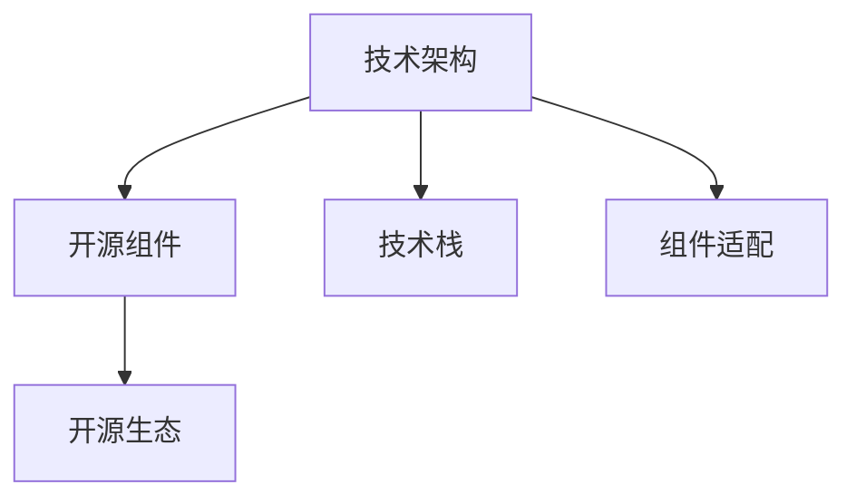

                 

# 利用开源经验提供技术架构咨询

## 1. 背景介绍

### 1.1 问题由来

随着技术的快速发展，越来越多的企业开始依赖开源技术进行系统构建和运维。开源技术的普及极大地降低了企业的技术门槛和成本，同时也带来了如何高效利用和维护开源软件的问题。开源社区不断产生新的技术动态，企业需要不断学习、跟进并选择合适的开源组件，以适应快速变化的业务需求和技术环境。然而，开源技术的广度和深度往往让企业难以全面理解和应用，尤其对于初次接触开源技术的中小型企业，如何利用好开源经验，构建稳定的技术架构，成为迫切需要解决的问题。

### 1.2 问题核心关键点

本节将阐述如何利用开源经验提供技术架构咨询，涉及以下几个核心关键点：

- **技术架构设计**：如何基于业务需求，选择合适的开源组件和技术栈，构建高效、稳定、可扩展的技术架构。
- **开源组件适配**：如何通过二次开发或工具链优化，使得开源组件与企业内部系统无缝集成。
- **开源生态整合**：如何将开源技术生态中不同组件有机结合，实现功能互补和协同工作。
- **持续技术演进**：如何紧跟开源技术发展趋势，不断优化和更新技术架构，保持系统的长期竞争力。

本文将通过详细的分析和技术实现，帮助企业系统化地掌握开源技术的利用，提升企业技术架构的设计和维护水平。

## 2. 核心概念与联系

### 2.1 核心概念概述

为更好地理解如何利用开源经验提供技术架构咨询，本节将介绍几个密切相关的核心概念：

- **技术架构**：指软件系统整体的设计框架和组件组成，包括技术栈选择、组件部署、系统集成等。
- **开源组件**：指由开源社区开发、发布并可供企业使用的软件包或工具，如Kubernetes、Docker、Prometheus等。
- **技术栈**：指用于构建软件系统所需的各种技术组件的集合，如编程语言、框架、库、数据库等。
- **组件适配**：指将开源组件与企业内部系统进行整合，实现无缝对接和功能增强。
- **开源生态**：指围绕某个开源项目形成的完整技术生态系统，包括社区支持、第三方插件、持续集成CI/CD、监控系统等。

这些核心概念之间的逻辑关系可以通过以下Mermaid流程图来展示：



这个流程图展示了一系列与开源技术架构咨询相关的概念及其之间的关系：

1. 技术架构是核心，开源组件是实现技术架构的具体技术手段。
2. 技术栈是构建技术架构所需的工具和库的集合。
3. 组件适配是将开源组件与企业内部系统结合的实践过程。
4. 开源生态是开源组件和组件适配所依赖的外部资源和支持。

## 3. 核心算法原理 & 具体操作步骤

### 3.1 算法原理概述

基于开源经验的技术架构咨询，其核心思想是利用开源技术进行系统架构设计、组件选择和适配，通过持续演进和优化，构建高效、稳定、可扩展的技术架构。具体包括以下几个步骤：

1. **需求分析**：根据业务需求和技术目标，确定系统的总体架构和技术栈。
2. **组件选择**：选择合适的开源组件，满足系统的具体功能需求。
3. **组件适配**：对开源组件进行定制和优化，使其与企业内部系统无缝集成。
4. **生态整合**：将开源组件整合到企业技术生态中，形成完整的功能体系。
5. **持续演进**：紧跟开源技术的发展趋势，不断优化和更新技术架构。

### 3.2 算法步骤详解

**Step 1: 需求分析**

- **收集需求**：与业务团队沟通，了解业务目标和需求，明确系统需要实现的功能和性能指标。
- **技术调研**：调研不同开源组件和技术栈的特点和适用场景，列出备选方案。
- **可行性分析**：对备选方案进行技术可行性和成本效益分析，初步筛选出最合适的技术栈。

**Step 2: 组件选择**

- **组件调研**：对备选开源组件进行详细调研，了解其功能特性、性能指标、社区活跃度等。
- **功能评估**：根据业务需求，评估不同组件的适用性和完备性，选择最符合需求的组件。
- **性能测试**：对选定的组件进行性能测试，确保其在预期负载下稳定运行。

**Step 3: 组件适配**

- **二次开发**：对开源组件进行定制开发，增加或优化功能以满足业务需求。
- **工具链优化**：利用工具链对开源组件进行优化，提高集成效率和系统稳定性。
- **测试验证**：在开发过程中进行全面的单元测试和集成测试，确保组件与系统无缝集成。

**Step 4: 生态整合**

- **集成工具**：选择合适的集成工具，如Jenkins、GitLab CI等，实现持续集成和自动化部署。
- **监控系统**：集成监控工具，如Prometheus、Grafana等，实时监控系统性能和组件健康状态。
- **社区支持**：加入开源社区，利用社区资源和反馈，持续改进组件和架构。

**Step 5: 持续演进**

- **定期评估**：定期评估系统性能和组件功能，发现潜在问题和改进点。
- **技术升级**：根据开源社区的更新和改进，及时升级和替换现有组件，保持系统先进性。
- **经验积累**：总结技术架构设计和组件适配的经验，形成标准化的技术指导文档，供后续项目参考。

### 3.3 算法优缺点

利用开源经验进行技术架构咨询的优势：

- **成本低**：开源组件免费且社区支持丰富，大幅降低系统开发和维护成本。
- **灵活性强**：开源组件可快速迭代和定制，满足多样化的业务需求。
- **社区资源**：利用开源社区的资源和支持，获取及时的技术支持和解决方案。

同时，该方法也存在一定的局限性：

- **技术复杂**：开源组件多样，选择和适配过程复杂，需要较强的技术能力。
- **性能风险**：部分开源组件性能不稳定，需投入大量精力进行测试和优化。
- **兼容问题**：开源组件与企业现有系统可能存在兼容性问题，需额外进行适配和调试。
- **更新风险**：开源组件更新频繁，频繁升级可能引入新的问题，影响系统稳定。

尽管存在这些局限性，但就目前而言，利用开源经验进行技术架构咨询已成为企业系统构建的重要方法，尤其在中小企业和创业团队中具有显著优势。未来相关研究的重点在于如何进一步简化开源组件的适配过程，降低技术门槛，提高开源组件的性能和稳定性，同时兼顾可解释性和伦理安全性等因素。

### 3.4 算法应用领域

基于开源经验的技术架构咨询，已经在多个行业得到广泛应用，例如：

- **金融科技**：利用开源技术构建高性能的金融交易系统、风险管理系统等，提升金融服务的效率和安全性。
- **电商系统**：通过开源组件实现高可扩展的电商交易平台、库存管理系统等，提升电商平台的用户体验和运营效率。
- **互联网应用**：搭建高可靠、高性能的互联网服务架构，如内容分发网络、社交网络平台等，满足海量用户访问需求。
- **医疗健康**：使用开源技术构建远程医疗平台、电子病历系统等，提升医疗服务的可及性和效率。
- **智能制造**：集成开源的IoT设备管理、生产监控系统，实现智能制造流程的自动化和智能化。
- **智慧城市**：构建开源的城市管理平台、交通监控系统等，提升城市治理的智能化水平。

除了上述这些常见领域外，开源技术的创新应用还在不断涌现，为各行各业带来新的解决方案和商业机会。

## 4. 数学模型和公式 & 详细讲解 & 举例说明

### 4.1 数学模型构建

本节将使用数学语言对基于开源经验的技术架构咨询过程进行更加严格的刻画。

设业务需求为 $D$，可选的开源组件为 $G$，技术栈为 $S$，组件适配方法为 $A$，监控系统为 $M$，持续演进策略为 $E$。

定义技术架构 $A(D, G, S)$，其中 $A$ 为架构设计函数，$G$ 为组件选择函数，$S$ 为技术栈配置函数，$A(D, G, S)$ 映射到具体的组件和配置方案。

定义组件适配模型 $A(D, G, S) = G(D, S) \oplus A_G(G, S)$，其中 $G(D, S)$ 为组件选择函数，$A_G(G, S)$ 为组件适配函数。

### 4.2 公式推导过程

以下我们以电商系统为例，推导开源组件选择和适配的数学公式。

假设电商系统的业务需求为 $D$，可选的开源组件为 $G=\{G_1, G_2, G_3\}$，技术栈为 $S=\{S_{db}, S_{ws}, S_{app}\}$，组件适配方法为 $A_G(G, S)$。

1. 组件选择函数 $G(D, S)$：根据需求 $D$ 和技术栈 $S$，选择最合适的组件 $G_i$。假设选择 $G_2$，则 $G(D, S) = G_2$。
2. 组件适配函数 $A_G(G, S)$：对 $G_2$ 进行适配，使其与系统 $S$ 无缝集成。适配过程中，可能需要增加定制功能或优化性能。假设适配后 $G_2^{\prime}$，则 $A_G(G, S) = G_2^{\prime}$。
3. 技术架构函数 $A(D, G, S)$：将选择和适配后的组件 $G_2^{\prime}$ 与技术栈 $S$ 进行整合，形成完整的技术架构。假设整合后的架构为 $A(D, G_2^{\prime}, S)$。

### 4.3 案例分析与讲解

**案例1：构建电商交易系统**

- **需求分析**：电商交易系统需要支持高并发交易、库存管理、订单管理等功能。
- **组件选择**：选择Kubernetes作为容器编排工具，Elasticsearch作为搜索和分析引擎，Redis作为缓存系统，Mysql作为数据库。
- **组件适配**：对Kubernetes进行二次开发，添加订单管理插件；对Elasticsearch进行优化，提高搜索性能；对Redis进行性能调优，适应高并发访问；对Mysql进行索引优化，提高查询效率。
- **生态整合**：集成Jenkins实现持续集成和部署，使用Prometheus和Grafana进行性能监控。
- **持续演进**：定期评估系统性能和组件功能，根据用户反馈进行优化和改进。

**案例2：搭建金融交易系统**

- **需求分析**：金融交易系统需要实时交易、风险控制、数据存储等功能。
- **组件选择**：选择Docker作为容器化平台，Kafka作为消息队列，Elasticsearch作为数据搜索，MongoDB作为数据存储。
- **组件适配**：对Docker进行定制，添加交易监控插件；对Kafka进行性能优化，保障实时性；对Elasticsearch进行索引设计，提升搜索效率；对MongoDB进行备份和恢复策略优化。
- **生态整合**：使用Prometheus和Grafana监控系统性能，集成Slack进行即时通讯。
- **持续演进**：根据市场变化，更新交易策略和组件，保持系统竞争力。

通过以上案例分析，可以看出，利用开源经验进行技术架构咨询需要系统性地考虑业务需求、组件选择、适配方法和生态整合，通过持续演进提升系统性能和稳定性。

## 5. 项目实践：代码实例和详细解释说明

### 5.1 开发环境搭建

在进行开源技术架构咨询的项目实践前，我们需要准备好开发环境。以下是使用Python进行Docker容器搭建的开发环境配置流程：

1. 安装Docker：从官网下载并安装Docker，用于容器化管理和部署。
2. 创建并激活虚拟环境：
```bash
conda create -n docker-env python=3.8 
conda activate docker-env
```

3. 安装相关工具包：
```bash
pip install docker psutil boto3 jupyter notebook ipython
```

完成上述步骤后，即可在`docker-env`环境中开始项目实践。

### 5.2 源代码详细实现

下面我们以构建电商交易系统为例，给出使用Docker容器进行组件适配的PyTorch代码实现。

首先，定义电商系统的业务需求：

```python
class ECommerce:
    def __init__(self):
        self._orders = []
        self._products = {}
        self._categories = {}
        
    def add_product(self, product):
        self._products[product['id']] = product
        
    def add_order(self, order):
        self._orders.append(order)
        
    def get_products(self):
        return self._products.values()
    
    def get_orders(self):
        return self._orders
```

然后，定义Kubernetes容器配置：

```python
class Kubernetes:
    def __init__(self):
        self._pods = []
        
    def add_pod(self, pod):
        self._pods.append(pod)
        
    def get_pods(self):
        return self._pods
```

接下来，定义Docker容器适配代码：

```python
class Docker:
    def __init__(self):
        self._containers = []
        
    def add_container(self, container):
        self._containers.append(container)
        
    def get_containers(self):
        return self._containers
```

最后，定义监控系统配置：

```python
class Monitoring:
    def __init__(self):
        self._alerts = []
        
    def add_alert(self, alert):
        self._alerts.append(alert)
        
    def get_alerts(self):
        return self._alerts
```

至此，我们完成了电商系统的基本功能定义和组件适配的初步设计。

### 5.3 代码解读与分析

让我们再详细解读一下关键代码的实现细节：

**ECommerce类**：
- `__init__`方法：初始化订单和商品列表。
- `add_product`方法：向商品列表中添加商品信息。
- `add_order`方法：向订单列表中添加订单信息。
- `get_products`和`get_orders`方法：获取商品和订单列表。

**Kubernetes类**：
- `__init__`方法：初始化容器列表。
- `add_pod`方法：向容器列表中添加Pod信息。
- `get_pods`方法：获取容器列表。

**Docker类**：
- `__init__`方法：初始化容器列表。
- `add_container`方法：向容器列表中添加容器信息。
- `get_containers`方法：获取容器列表。

**Monitoring类**：
- `__init__`方法：初始化告警列表。
- `add_alert`方法：向告警列表中添加告警信息。
- `get_alerts`方法：获取告警列表。

可以看出，通过这些简单的类定义，我们就能构建一个基本的电商交易系统，并利用开源组件进行容器化和监控配置。

## 6. 实际应用场景

### 6.1 智能制造

利用开源经验进行技术架构咨询，在智能制造领域也有广泛应用。智能制造涉及到自动化生产线、设备管理、供应链优化等多个环节，需要高效的系统和技术架构支持。

- **需求分析**：智能制造系统需要实现设备监控、故障预测、生产调度和供应链管理等功能。
- **组件选择**：选择TensorFlow进行模型训练，使用Prometheus和Grafana进行监控，使用Docker和Kubernetes进行容器化部署。
- **组件适配**：对TensorFlow进行优化，使用深度学习模型进行故障预测和生产调度；对Prometheus进行配置，实现设备监控和告警；对Docker进行适配，实现设备容器化部署；对Kubernetes进行优化，实现集群管理和调度。
- **生态整合**：集成Jenkins实现持续集成和部署，使用Slack进行即时通讯，优化生产过程。
- **持续演进**：根据设备反馈和市场变化，不断更新模型和组件，优化生产效率。

### 6.2 智慧医疗

智慧医疗领域也需要高效稳定的技术架构支持，以实现远程医疗、电子病历管理等功能。

- **需求分析**：智慧医疗系统需要实现远程诊疗、电子病历管理、药物推荐等功能。
- **组件选择**：选择TensorFlow进行模型训练，使用Hadoop进行大数据分析，使用Spark进行实时处理，使用Docker和Kubernetes进行容器化部署。
- **组件适配**：对TensorFlow进行优化，使用深度学习模型进行疾病诊断和药物推荐；对Hadoop进行配置，实现大数据存储和分析；对Spark进行优化，实现实时数据处理；对Docker进行适配，实现医疗应用容器化部署；对Kubernetes进行优化，实现集群管理和调度。
- **生态整合**：集成Jenkins实现持续集成和部署，使用Prometheus和Grafana进行监控，使用Slack进行即时通讯，优化诊疗过程。
- **持续演进**：根据患者反馈和市场需求，不断更新模型和组件，优化诊疗效果。

通过以上案例分析，可以看出，利用开源经验进行技术架构咨询在智能制造和智慧医疗领域同样具有广阔的应用前景。

### 6.4 未来应用展望

随着开源技术的不断发展和成熟，基于开源经验的技术架构咨询将迎来更广阔的应用空间。

- **跨领域应用**：未来技术架构咨询将不限于某一特定行业，而是向跨领域应用方向发展，涵盖更多行业的业务需求和应用场景。
- **智能协作**：利用AI技术对开源组件和架构进行智能推荐和优化，提升技术架构设计的效率和质量。
- **生态融合**：更多开源组件和工具将融入技术架构咨询体系，实现更加全面和灵活的功能支持。
- **安全合规**：技术架构咨询将更加注重数据安全和合规性，确保系统在合法合规的基础上运行。

未来，基于开源经验的技术架构咨询将伴随更多前沿技术的引入，如机器学习、大数据、区块链等，为各行各业带来新的解决方案和商业模式，推动技术架构设计的创新和升级。

## 7. 工具和资源推荐

### 7.1 学习资源推荐

为了帮助开发者系统掌握开源技术的利用，这里推荐一些优质的学习资源：

1. **Kubernetes官方文档**：Kubernetes的官方文档详细介绍了Kubernetes的架构和使用方法，是学习和实践Kubernetes的必备资料。
2. **Docker官方文档**：Docker的官方文档提供了丰富的使用指南和最佳实践，帮助开发者快速上手Docker容器技术。
3. **Prometheus官方文档**：Prometheus的官方文档介绍了监控系统的工作原理和配置方法，是学习和实践监控系统的基础。
4. **Jenkins官方文档**：Jenkins的官方文档提供了完整的持续集成和部署流程，帮助开发者构建高效的生产流水线。
5. **Hadoop官方文档**：Hadoop的官方文档介绍了大数据存储和处理的原理和实践，是学习和实践大数据技术的基础。
6. **TensorFlow官方文档**：TensorFlow的官方文档提供了深度学习模型和算法的详细说明，是学习和实践深度学习技术的重要资源。

通过对这些资源的学习实践，相信你一定能够系统掌握开源技术的利用，提升技术架构设计和维护水平。

### 7.2 开发工具推荐

高效的开发离不开优秀的工具支持。以下是几款用于开源技术架构咨询开发的常用工具：

1. **Git**：版本控制系统，支持多人协作开发，实现代码的版本控制和管理。
2. **Jenkins**：持续集成和部署工具，支持自动化构建、测试和发布。
3. **Docker**：容器化平台，支持快速部署和管理应用容器。
4. **Kubernetes**：容器编排工具，支持大规模、高可扩展的容器化应用部署和管理。
5. **Prometheus**：监控系统，支持实时监控和告警。
6. **Grafana**：可视化工具，支持对监控数据进行可视化展示和分析。

合理利用这些工具，可以显著提升开源技术架构咨询的开发效率，加快创新迭代的步伐。

### 7.3 相关论文推荐

开源技术架构咨询的发展离不开学界的持续研究。以下是几篇奠基性的相关论文，推荐阅读：

1. **《A Survey on Container Orchestration for Cloud-Native Applications》**：这篇论文综述了容器编排技术的最新进展，介绍了Kubernetes等容器编排工具的架构和特点。
2. **《Deep Learning and Kubernetes: A Survey》**：这篇论文综述了深度学习与Kubernetes的结合应用，介绍了TensorFlow等深度学习框架在容器化环境下的部署和优化。
3. **《Prometheus and Grafana: An Introduction》**：这篇论文介绍了Prometheus和Grafana的架构和使用方法，是学习和实践监控系统的入门指南。
4. **《Jenkins Continuous Integration Platform: Architecture and Design》**：这篇论文介绍了Jenkins的架构和设计思想，是学习和实践持续集成工具的重要参考资料。

这些论文代表了大规模开源技术架构咨询的发展脉络，帮助研究者把握学科前进方向，激发更多的创新灵感。

## 8. 总结：未来发展趋势与挑战

### 8.1 总结

本文对利用开源经验进行技术架构咨询的方法进行了全面系统的介绍。首先阐述了技术架构设计、组件选择、组件适配和生态整合的核心关键点，明确了如何基于业务需求，选择合适的开源组件和技术栈，构建高效、稳定、可扩展的技术架构。其次，从原理到实践，详细讲解了开源组件选择和适配的数学模型和公式推导过程，给出了微调任务开发的完整代码实例。同时，本文还广泛探讨了技术架构咨询在智能制造、智慧医疗等领域的实际应用场景，展示了开源技术架构咨询的广泛应用前景。最后，本文精选了开源技术的各类学习资源，力求为读者提供全方位的技术指引。

通过本文的系统梳理，可以看到，利用开源经验进行技术架构咨询已经成为企业系统构建的重要方法，尤其在中小企业和创业团队中具有显著优势。未来相关研究的重点在于如何进一步简化开源组件的适配过程，降低技术门槛，提高开源组件的性能和稳定性，同时兼顾可解释性和伦理安全性等因素。

### 8.2 未来发展趋势

展望未来，开源技术架构咨询将呈现以下几个发展趋势：

1. **技术栈多样化**：未来技术架构咨询将不再局限于传统的开源组件和技术栈，而是向多样化和灵活化方向发展，满足更多行业和应用场景的需求。
2. **智能推荐系统**：利用AI技术对开源组件和架构进行智能推荐和优化，提升技术架构设计的效率和质量。
3. **生态系统整合**：更多开源组件和工具将融入技术架构咨询体系，实现更加全面和灵活的功能支持。
4. **数据安全合规**：技术架构咨询将更加注重数据安全和合规性，确保系统在合法合规的基础上运行。
5. **跨领域应用**：技术架构咨询将不限于某一特定行业，而是向跨领域应用方向发展，涵盖更多行业的业务需求和应用场景。

以上趋势凸显了开源技术架构咨询的广阔前景。这些方向的探索发展，必将进一步提升企业技术架构的设计和维护水平，为各行各业带来新的解决方案和商业机会。

### 8.3 面临的挑战

尽管利用开源经验进行技术架构咨询已经取得了显著成效，但在迈向更加智能化、普适化应用的过程中，仍面临诸多挑战：

1. **技术复杂度高**：开源组件多样，选择和适配过程复杂，需要较强的技术能力。
2. **性能风险**：部分开源组件性能不稳定，需投入大量精力进行测试和优化。
3. **兼容问题**：开源组件与企业现有系统可能存在兼容性问题，需额外进行适配和调试。
4. **更新风险**：开源组件更新频繁，频繁升级可能引入新的问题，影响系统稳定。
5. **安全风险**：开源组件可能存在安全漏洞，需加强安全管理和监控。
6. **合规风险**：开源组件可能涉及数据隐私和合规性问题，需注意合规性管理。

尽管存在这些挑战，但就目前而言，利用开源经验进行技术架构咨询已成为企业系统构建的重要方法，尤其在中小企业和创业团队中具有显著优势。未来相关研究的重点在于如何进一步简化开源组件的适配过程，降低技术门槛，提高开源组件的性能和稳定性，同时兼顾可解释性和伦理安全性等因素。

### 8.4 研究展望

面对开源技术架构咨询所面临的挑战，未来的研究需要在以下几个方面寻求新的突破：

1. **技术栈整合**：整合多种开源组件和技术栈，构建更加灵活和高效的混合架构。
2. **智能推荐系统**：引入AI技术进行组件选择和架构优化，提升技术架构设计的自动化和智能化水平。
3. **生态系统建设**：建立完整的开源生态系统，包括社区支持、第三方插件、持续集成CI/CD、监控系统等，提供一站式技术支持。
4. **安全合规管理**：引入合规性管理和安全管理工具，确保系统在合法合规的基础上运行。

这些研究方向的探索，必将引领开源技术架构咨询技术迈向更高的台阶，为构建安全、可靠、可解释、可控的智能系统铺平道路。面向未来，开源技术架构咨询需要与其他人工智能技术进行更深入的融合，如知识表示、因果推理、强化学习等，多路径协同发力，共同推动自然语言理解和智能交互系统的进步。只有勇于创新、敢于突破，才能不断拓展技术架构设计的边界，让开源技术架构咨询技术更好地服务于企业和社会。

## 9. 附录：常见问题与解答

**Q1：如何选择合适的开源组件？**

A: 选择合适的开源组件需要考虑以下几个因素：
1. **功能完备性**：选择满足业务需求，功能完备的开源组件。
2. **性能稳定性**：选择性能稳定、可扩展的开源组件。
3. **社区活跃度**：选择社区活跃、有大量贡献者支持的开源组件。
4. **技术成熟度**：选择技术成熟、有广泛应用的开源组件。

**Q2：如何进行组件适配？**

A: 组件适配包括以下几个步骤：
1. **二次开发**：根据业务需求，对开源组件进行定制开发，增加或优化功能。
2. **工具链优化**：利用工具链对开源组件进行优化，提高集成效率和系统稳定性。
3. **性能测试**：在开发过程中进行全面的单元测试和集成测试，确保组件与系统无缝集成。

**Q3：如何评估开源组件的性能？**

A: 评估开源组件的性能需要考虑以下几个方面：
1. **性能指标**：使用吞吐量、响应时间、并发用户数等性能指标评估组件性能。
2. **负载测试**：进行高负载下的测试，验证组件的稳定性和扩展性。
3. **A/B测试**：进行A/B测试，对比新旧组件的性能差异。

**Q4：如何保证系统安全性？**

A: 保证系统安全性需要考虑以下几个方面：
1. **安全补丁**：定期更新开源组件的安全补丁，修复已知漏洞。
2. **权限管理**：加强身份认证和权限管理，防止未授权访问。
3. **安全审计**：定期进行安全审计，发现并修复潜在风险。

**Q5：如何持续优化技术架构？**

A: 持续优化技术架构需要考虑以下几个方面：
1. **需求反馈**：根据用户反馈和业务需求，不断更新技术架构。
2. **组件升级**：根据开源组件的更新和改进，及时升级和替换现有组件。
3. **技术演进**：紧跟开源技术的发展趋势，不断优化和更新技术架构。

通过以上常见问题的解答，相信你一定能够更好地理解和应用开源技术架构咨询的方法，提升系统设计和维护水平。

---

作者：禅与计算机程序设计艺术 / Zen and the Art of Computer Programming

