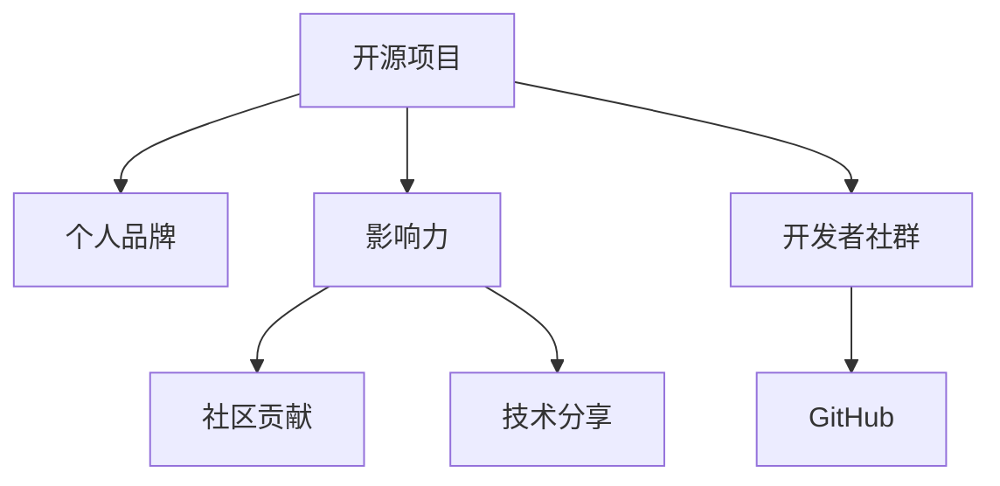

                 

# 利用开源项目构建个人影响力

> 关键词：开源项目, 个人品牌, 影响力, 社区贡献, 技术分享, 开发者社群, GitHub, 项目协作, 知识共享

## 1. 背景介绍

### 1.1 问题由来

在当今高度信息化和网络化的时代，技术从业者如何在众多同行中脱颖而出，成为具有影响力的技术专家，成为许多人关注的焦点。过去，技术专家往往通过发表论文、出版书籍等传统方式来展示自己的技术成果和影响力。然而，随着社交媒体和开源社区的兴起，技术专家们通过在开源项目上的积极参与和贡献，逐渐成为一种更为直接和广泛的影响力塑造方式。

### 1.2 问题核心关键点

开源项目在构建个人影响力方面具有诸多优势，关键点在于：
- 开源项目提供了大量实践机会，使得技术专家能够不断更新和提升技术能力。
- 通过在开源项目中积极贡献代码、解决bug、提交改进建议等行为，专家可以在社区中建立起信任和权威。
- 开源项目上的技术分享和交流，能够有效地传播专业知识，带动更多人学习与成长。
- 借助开源项目，技术专家可以积累大量的项目和案例经验，便于撰写技术文章和博客，吸引更多的关注。
- 开源项目为专家提供了展示才华的舞台，使其能够在同行面前树立专业形象，赢得行业内的认可。

### 1.3 问题研究意义

掌握如何利用开源项目构建个人影响力，对技术从业者具有重要意义：
- 提升个人品牌价值。通过在开源项目中的出色表现，个人品牌能够得到广泛传播和认可。
- 增强职业竞争力。在开源社区中的活跃和贡献，能够成为求职时的重要加分项。
- 促进技术交流。开源项目是知识共享和技术交流的重要平台，能够极大地促进技术传播和创新。
- 推动行业发展。通过开源项目，技术专家能够引领行业技术趋势，推动技术进步和应用。
- 实现自我超越。开源项目为技术专家提供了挑战高难度任务的机会，激发其潜力和创造力。

## 2. 核心概念与联系

### 2.1 核心概念概述

为了更好地理解如何利用开源项目构建个人影响力，下面将介绍几个核心概念及其相互之间的联系：

- **开源项目 (Open Source Projects)**：开放给所有人使用、修改和改进的软件项目。这些项目基于社区协作，源代码完全公开，任何人都可以访问、修改和分发。

- **个人品牌 (Personal Brand)**：个人在职业生涯中展现出的专业技能、工作态度、职业发展等方面的综合形象。通过在开源项目中的表现，个人品牌可以在业界和同行中得到认可。

- **影响力 (Influence)**：个人或团队对其他人的思想、行为或决策产生影响的能力。在开源社区中，通过积极贡献和高质量的代码，技术专家可以在同行中获得影响力。

- **社区贡献 (Community Contribution)**：指在开源项目中为代码库贡献代码、修复错误、提交功能、编写文档等活动。社区贡献是建立影响力的基础。

- **技术分享 (Technical Sharing)**：通过博客、论文、视频等形式分享自己的技术知识和经验。在开源项目中的技术分享可以极大地提升个人的影响力。

- **开发者社群 (Developer Community)**：由技术爱好者和专家组成的网络，他们共同开发、分享和讨论开源项目。开发者社群是构建影响力的重要环境。

- **GitHub**：全球最大的代码托管平台，多数开源项目在这里进行管理和开发。GitHub不仅是代码托管工具，也是社区协作和展示才华的平台。

这些核心概念之间的联系可以通过以下Mermaid流程图来展示：



这个流程图展示了几项核心概念之间的逻辑关系：开源项目是个人品牌和影响力的基础；社区贡献和技术分享是提升影响力的具体行动；开发者社群和GitHub是实现这些行动的重要平台。

## 3. 核心算法原理 & 具体操作步骤
### 3.1 算法原理概述

利用开源项目构建个人影响力的核心算法原理，可以概括为以下几个关键步骤：

1. **参与开源项目**：选择并积极参与感兴趣的开源项目，贡献代码和改进建议。
2. **提升技术能力**：在项目中学习和实践，不断提升自己的技术水平。
3. **社区贡献**：通过提交代码、修复bug、优化功能等方式，为开源项目做出实质性贡献。
4. **技术分享**：通过博客、论文、视频等形式，分享自己的技术心得和项目经验。
5. **建立网络**：在社区中积极交流与合作，建立起广泛的人际关系网。
6. **持续更新**：不断学习和更新技术，保持在社区中的领先地位。

这些步骤构成了利用开源项目提升个人影响力的基本流程。

### 3.2 算法步骤详解

#### 步骤1：选择并参与感兴趣的开源项目

1. **项目筛选**：首先从GitHub、GitLab等平台搜索并筛选感兴趣的开源项目。可以参考以下标准：
   - 项目活跃度高，有定期更新和维护。
   - 项目文档齐全，有明确的项目目标和使用说明。
   - 项目有较稳定的用户群体和社区支持。

2. **创建账户**：在选定的开源项目所在的代码托管平台创建账户，并关注该项目。

3. **开始贡献**：阅读项目的贡献指南，了解提交代码和修改文档的流程。从小规模的贡献开始，例如提交issue、修复小bug或添加小的功能特性。

#### 步骤2：提升技术能力

1. **学习项目代码**：深入阅读项目代码，了解其架构和技术栈。可以通过代码审查和阅读提交的历史记录来学习和理解。

2. **参与社区讨论**：在项目的邮件列表或论坛中积极参与讨论，了解项目需求和技术难点。

3. **解决问题**：尝试解决项目中的技术问题，这不仅能提升技术能力，也能在社区中建立信任。

#### 步骤3：社区贡献

1. **提交代码**：根据贡献指南，撰写并提交高质量的代码。优先修复bug，因为修复bug通常比添加新功能更容易获得社区认可。

2. **优化功能**：通过编写新的功能模块或改进已有模块，为项目增加新的价值。

3. **文档编写**：编写高质量的代码文档和技术文档，帮助新开发者快速上手。

#### 步骤4：技术分享

1. **撰写博客**：将自己参与项目的经验和心得撰写成博客文章，发布在技术社区和个人网站。

2. **制作视频**：通过YouTube或Bilibili等平台，制作技术讲解视频，分享项目开发经验和实战案例。

3. **开设课程**：在Coursera、Udemy等在线教育平台上开设技术课程，教授特定技术和工具的使用。

#### 步骤5：建立网络

1. **社区互动**：积极在社区中交流，回复问题、解答疑惑，建立自己的技术权威。

2. **加入社群**：加入相关的开发者社群和技术讨论组，与同行交流分享经验。

3. **参加活动**：参加技术会议、黑客松等活动，拓展人际网络。

#### 步骤6：持续更新

1. **跟进项目**：持续关注项目的最新进展，保持技术敏感性。

2. **学习和实践**：不断学习新技术、新工具，应用于项目中。

3. **更新博客和视频**：定期更新博客和视频内容，保持内容的时效性和相关性。

### 3.3 算法优缺点

**优点**：
- 成本低廉。开源项目几乎不需要成本，只需投入时间和精力即可。
- 社区支持。开源社区资源丰富，技术问题通常能迅速得到解决。
- 经验积累。通过参与项目，技术专家可以积累大量实践经验。
- 个人品牌提升。高质量的贡献和分享能够迅速提升个人在社区中的影响力。

**缺点**：
- 时间投入大。高质量的贡献通常需要大量时间和精力。
- 社区竞争激烈。高活跃度的开源项目竞争激烈，难以脱颖而出。
- 技术差异。开源项目技术栈各异，需不断学习和适应。
- 知识分散。贡献往往零散，难以形成系统的知识体系。

### 3.4 算法应用领域

开源项目在构建个人影响力方面的应用广泛，包括但不限于：
- **技术开发与测试**：通过参与开源项目，技术专家能够不断实践和测试新技术，提升开发能力。
- **技术交流与合作**：在开源项目中，技术专家能够与全球开发者交流合作，共同解决技术难题。
- **技术培训与教育**：通过撰写文档、制作视频等，技术专家能够进行技术教育和培训，帮助更多人掌握技能。
- **技术创新与引领**：开源项目中的技术创新能够推动行业技术进步，引领技术发展趋势。
- **技术成果展示**：技术专家通过开源项目中的实际成果，展示自己的技术实力和影响力。

## 4. 数学模型和公式 & 详细讲解  
### 4.1 数学模型构建

假设有一个开源项目，其贡献度可以用以下数学模型来衡量：

$$
Contribution = \sum_{i=1}^n P_i \times D_i
$$

其中，$P_i$ 为第 $i$ 项贡献（代码行数、修复的bug数等），$D_i$ 为第 $i$ 项贡献的难度（复杂度、技术深度等）。这个模型假设每项贡献的价值与其难度成正比。

### 4.2 公式推导过程

通过对贡献度的计算模型进行分析，可以得出以下推导过程：

- **贡献度计算**：通过计算每项贡献的价值和难度，得到总贡献度。
- **贡献影响分析**：分析每项贡献对个人影响力的影响，考虑代码质量、社区反馈等因素。
- **影响因子计算**：通过引入影响力因子，对每位技术专家的影响进行量化评估。

具体计算过程涉及多个变量的评估和计算，需根据具体项目和数据进行调整。

### 4.3 案例分析与讲解

以下通过一个实际案例，展示如何利用开源项目构建个人影响力：

1. **案例背景**：假设一个技术专家John参与了开源项目X，该项目专注于开发一款高效的数据处理工具。

2. **参与过程**：
   - John在GitHub上创建账户，并关注项目X。
   - 阅读项目文档，学习代码实现。
   - 提交了一些修复bug的小贡献，并撰写了详细的修复说明。
   - 在社区中积极回答问题，提供了技术指导。
   - 编写了一篇关于项目架构的博客文章，并分享在技术社区。
   - 制作了关于项目使用的YouTube视频教程，并上传到YouTube。

3. **影响力提升**：
   - 通过提交高质量的修复代码，John在项目中建立了信任。
   - 在社区中积极回答问题和提供帮助，逐渐树立了自己的技术权威。
   - 博客文章和视频教程的分享，提升了John在技术社区中的知名度和影响力。

## 5. 项目实践：代码实例和详细解释说明
### 5.1 开发环境搭建

在进行开源项目贡献实践前，需要准备好开发环境。以下是使用Python进行GitHub开发的环境配置流程：

1. **安装Git**：下载并安装Git客户端。
2. **创建GitHub账户**：在GitHub官网注册并创建账户。
3. **克隆代码仓库**：在GitHub上找到感兴趣的项目，克隆其代码仓库到本地。
4. **安装Python开发环境**：根据项目需求，安装相应的Python环境（如Anaconda、Pyenv等）。
5. **安装开发工具**：安装必要的开发工具（如PyCharm、Jupyter Notebook等）。

完成上述步骤后，即可在本地开始开源项目的贡献实践。

### 5.2 源代码详细实现

以下以参与开源项目X为例，给出使用Python对数据处理工具进行贡献的代码实现。

首先，定义数据处理函数：

```python
import pandas as pd

def process_data(data):
    # 对数据进行处理，例如清洗、转换、归一化等
    # 返回处理后的数据
    return pd.DataFrame(data)
```

然后，定义提交贡献的函数：

```python
import requests

def submit_contribution(data, comment=''):
    # 将处理后的数据提交到项目仓库
    # 可选：添加提交备注
    return requests.post('https://api.github.com/repos/username/projectX/commits', data=data, comment=comment)
```

接着，定义测试函数：

```python
def test_contribution():
    # 读取测试数据
    test_data = pd.read_csv('test_data.csv')
    
    # 处理数据并提交贡献
    processed_data = process_data(test_data)
    submission_response = submit_contribution(processed_data)
    
    # 输出提交结果
    print(submission_response.text)
```

最后，启动测试流程：

```python
test_contribution()
```

以上就是使用Python对开源项目进行贡献的完整代码实现。可以看到，通过GitHub API和Python脚本，技术专家能够便捷地提交代码和数据处理贡献。

### 5.3 代码解读与分析

让我们再详细解读一下关键代码的实现细节：

**process_data函数**：
- 定义了一个简单的数据处理函数，用于对输入数据进行清洗、转换和归一化操作。

**submit_contribution函数**：
- 使用GitHub API将处理后的数据提交到项目仓库。
- 可选参数`comment`用于添加提交备注，提升代码的可读性和可维护性。

**test_contribution函数**：
- 读取测试数据文件。
- 调用`process_data`函数处理数据。
- 调用`submit_contribution`函数提交贡献，并输出响应结果。

**test_contribution函数调用**：
- 直接调用`test_contribution`函数，启动测试流程。

以上代码实现展示了技术专家如何在开源项目中进行贡献，包括数据处理和提交代码的具体过程。

## 6. 实际应用场景

### 6.1 开源社区

开源社区是技术专家展示才华、建立影响力的重要平台。通过在社区中的积极参与和贡献，技术专家能够赢得同行和社区的认可。

- **代码贡献**：在社区中参与项目开发，提交高质量代码和修复bug。
- **社区互动**：积极参与社区讨论，提供技术支持和解决方案。
- **开源贡献**：在社区中发布自己的开源项目，吸引更多人使用和贡献。

### 6.2 技术会议与黑客松

技术会议和黑客松是技术专家展示能力和影响力的重要场合。通过在这些活动中的出色表现，专家能够快速提升自己在行业中的知名度。

- **技术分享**：在技术会议上分享自己的研究成果和实践经验。
- **技术竞赛**：参加黑客松等技术竞赛，展示自己的技术实力和创新能力。
- **项目展示**：在技术会议上展示自己的开源项目和贡献，吸引更多人关注和参与。

### 6.3 企业内部开发

在企业内部，技术专家可以利用开源项目构建影响力，提升在团队和公司中的地位。

- **内部开源**：在公司内部推动开源项目，提高团队协作效率。
- **知识共享**：通过内部开源项目，分享自己的技术知识和经验。
- **项目管理**：参与开源项目的管理和维护，提升项目管理和领导能力。

### 6.4 未来应用展望

随着开源项目的不断发展和普及，利用开源项目构建个人影响力的场景将更加多样化。未来，技术专家可以通过开源项目实现以下目标：

1. **技术创新引领**：通过参与和贡献开源项目，技术专家能够引领技术创新和行业发展。
2. **跨领域协作**：开源项目推动跨领域技术交流与合作，提升技术专家的综合能力。
3. **国际影响力**：开源项目使技术专家能够与全球开发者交流合作，提升国际影响力。
4. **教育与培训**：通过开源项目进行技术教育和培训，帮助更多人掌握技能。
5. **社会责任**：开源项目为技术专家提供了履行社会责任的平台，例如参与公益项目、提供开源工具等。

## 7. 工具和资源推荐
### 7.1 学习资源推荐

为了帮助技术专家系统掌握开源项目的贡献方法和实践技巧，这里推荐一些优质的学习资源：

1. **《开源项目贡献指南》**：详细介绍了如何参与开源项目，从提交issue到贡献代码的全面指南。
2. **GitHub官方文档**：GitHub的官方文档提供了丰富的API和工具使用说明，方便技术专家在项目中高效协作。
3. **《Python开源项目开发指南》**：介绍如何使用Python进行开源项目开发和贡献。
4. **Coursera和Udemy等在线课程**：提供系统化的开源项目贡献和技术分享课程。
5. **Stack Overflow和GitHub社区**：丰富的技术问答和讨论资源，帮助技术专家解决问题。

通过对这些资源的学习实践，相信技术专家能够快速掌握开源项目的贡献方法和实践技巧。

### 7.2 开发工具推荐

高效的开源项目贡献离不开优秀的工具支持。以下是几款常用的开源项目贡献开发工具：

1. **GitHub Desktop**：GitHub官方的桌面工具，方便进行本地仓库和远程仓库的同步管理。
2. **GitHub CLI**：GitHub的命令行工具，快速高效地进行版本控制和协作。
3. **Jupyter Notebook**：强大的交互式开发环境，方便技术专家进行数据分析和代码实验。
4. **PyCharm和VS Code**：流行的Python和跨平台开发工具，提供丰富的插件和扩展支持。
5. **Markdown编辑器**：如Typora、StackEdit等，方便技术专家撰写高质量的文档和技术分享内容。

合理利用这些工具，可以显著提升技术专家在开源项目中的贡献效率，加快创新迭代的步伐。

### 7.3 相关论文推荐

开源项目和开源贡献的研究源于学界的持续研究。以下是几篇奠基性的相关论文，推荐阅读：

1. **《开源社区协作模式研究》**：分析开源项目中的协作模式和网络结构。
2. **《开源项目的演化与影响力》**：研究开源项目的演化过程和影响力的量化评估。
3. **《开源贡献行为分析》**：通过数据分析开源贡献行为，发现贡献规律和趋势。
4. **《开源项目的贡献与社区发展》**：探讨开源项目中的贡献与社区发展的关系。
5. **《开源项目的协作与知识传播》**：研究开源项目中的协作机制和知识传播路径。

这些论文代表了大规模开源项目的研究脉络。通过学习这些前沿成果，可以帮助技术专家把握学科前进方向，激发更多的创新灵感。

## 8. 总结：未来发展趋势与挑战

### 8.1 总结

本文对如何利用开源项目构建个人影响力进行了全面系统的介绍。首先阐述了开源项目在构建个人影响力方面的优势和重要性，明确了技术专家在开源社区中的行为策略。其次，从原理到实践，详细讲解了开源项目贡献的基本流程和具体方法，给出了代码实例和详细解释说明。同时，本文还探讨了开源项目在实际应用中的多种场景和未来展望，展示了开源项目在技术发展和社会责任方面的巨大潜力。最后，本文精选了开源项目的各类学习资源和开发工具，力求为技术专家提供全方位的技术指引。

通过本文的系统梳理，可以看到，利用开源项目构建个人影响力是技术专家提升职业竞争力和技术影响力的重要途径。开源项目为技术专家提供了广泛的实践机会和展示舞台，能够促进技术交流和创新，推动技术进步和应用。未来，随着开源项目和开源贡献方法的不断发展，技术专家将能够在更多领域和更多层次上展示自己的才华和影响力，为技术发展和社会进步做出更大贡献。

### 8.2 未来发展趋势

展望未来，开源项目将呈现以下几个发展趋势：

1. **开放协作增强**：开源项目将继续推动更广泛的开放协作，吸引全球开发者共同参与。
2. **社区生态优化**：开源社区将更加注重用户体验和生态优化，提升社区活力和贡献效率。
3. **技术创新加速**：开源项目将成为技术创新的重要平台，推动更多前沿技术的诞生和发展。
4. **社会责任强化**：开源项目将在环境保护、教育普及、公益事业等领域发挥更大的社会责任。
5. **国际影响力扩大**：开源项目推动全球技术交流与合作，提升技术专家和项目的国际影响力。

以上趋势凸显了开源项目在技术发展和社会进步中的重要地位。技术专家应当积极参与和贡献开源项目，通过开源合作实现技术突破和社会责任的双重提升。

### 8.3 面临的挑战

尽管开源项目在技术发展和社会进步中发挥着重要作用，但在其发展过程中仍面临诸多挑战：

1. **社区资源不足**：高活跃度的开源项目通常需要大量的社区资源和维护人力，难以实现持续稳定发展。
2. **技术复杂性**：大型开源项目的技术复杂性较高，贡献者需要具备较强的技术能力和经验。
3. **版权和知识产权**：开源项目中涉及复杂的版权和知识产权问题，需要开发者具备相应的法律意识。
4. **贡献动机不一**：社区中贡献者的动机各异，如何激励贡献和提升贡献质量成为一大挑战。
5. **社区管理困难**：开源项目中的管理问题复杂多样，需要有效的项目管理工具和方法。

面对这些挑战，开源社区和开发者需要共同努力，寻找创新的解决方案，确保开源项目的健康发展和持续创新。

### 8.4 研究展望

未来的研究需要在以下几个方面进行深入探索：

1. **社区激励机制**：研究如何通过激励机制提升社区贡献和质量。
2. **贡献行为分析**：深入研究开源项目中贡献行为的规律和模式，提升贡献效果。
3. **项目管理优化**：开发更高效的开源项目管理工具和方法，提高项目维护和协作效率。
4. **技术创新促进**：推动开源项目在技术创新中的引领作用，促进技术进步。
5. **社会责任扩展**：拓展开源项目在社会责任方面的应用，实现技术与社会进步的双赢。

这些研究方向的探索，将引领开源项目和开源贡献方法走向更高的层次，为技术专家和开发者提供更加多样化的发展机遇。

## 9. 附录：常见问题与解答

**Q1：如何选择合适的开源项目？**

A: 选择开源项目时，应考虑以下几个标准：
1. 项目活跃度和更新频率：选择有稳定更新和活跃社区的项目。
2. 项目目标和使用说明：选择有明确目标和使用说明的项目。
3. 项目文档和代码质量：选择有完整文档和高质量代码的项目。

**Q2：如何在开源项目中建立信任和权威？**

A: 在开源项目中建立信任和权威，需要从以下几个方面入手：
1. 提交高质量的代码和修复bug。
2. 积极参与社区讨论和问题解决。
3. 编写高质量的技术文档和教程。
4. 在项目中承担关键任务和领导角色。

**Q3：如何提升开源项目贡献的质量？**

A: 提升开源项目贡献的质量，可以从以下几个方面入手：
1. 理解项目需求和技术栈。
2. 阅读相关文档和代码。
3. 与项目贡献者积极交流。
4. 进行代码审查和单元测试。

**Q4：开源项目中的贡献是否需要大篇幅的代码？**

A: 开源项目中的贡献并不一定需要大篇幅的代码。小而精的贡献，如修复小bug、添加注释、优化性能等，同样能够得到社区认可。

**Q5：如何高效利用开源项目提升个人影响力？**

A: 高效利用开源项目提升个人影响力，需要从以下几个方面入手：
1. 选择合适的项目并积极参与。
2. 提升技术能力和代码质量。
3. 进行技术分享和交流。
4. 建立广泛的社区关系和网络。
5. 持续学习和更新技术。

---

作者：禅与计算机程序设计艺术 / Zen and the Art of Computer Programming

