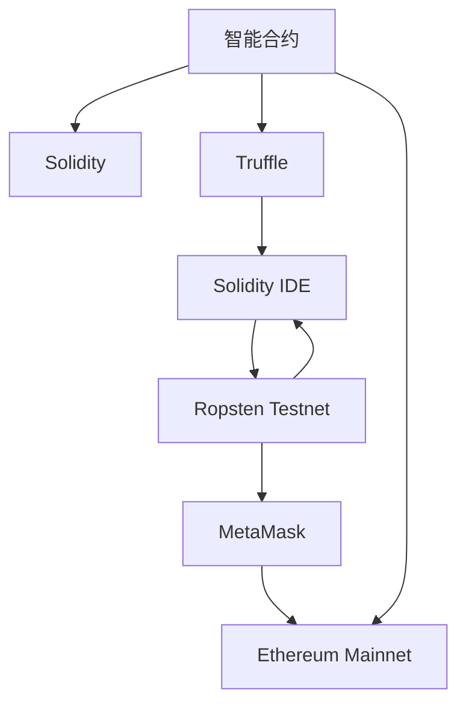

                 

# 利用技术优势进行智能合约开发

## 1. 背景介绍

### 1.1 问题由来

随着区块链技术的兴起，智能合约（Smart Contracts）作为一种去中心化的、自动化的合约形式，逐渐成为了一种主流应用。智能合约的核心思想是通过代码实现合约条款，确保合同条款在区块链上得到严格执行。

然而，智能合约的开发和部署存在一定的挑战，主要体现在以下几个方面：

1. **代码编写和调试**：智能合约代码一旦部署就无法修改，开发人员需要编写可靠的、高效的合约代码，并确保其在执行过程中不会出现错误。
2. **安全性**：智能合约一旦部署在区块链上，就无法撤回或更改，因此安全性至关重要。
3. **性能**：智能合约的执行效率直接影响了区块链的性能，尤其是在交易频繁的平台上，如何提高合约的执行效率是一个重要问题。
4. **互操作性**：不同区块链平台上的智能合约可能存在兼容性问题，需要开发跨链互操作方案。

为了解决这些问题，智能合约开发者需要利用最新的技术优势，如先进的编程语言、智能合约框架、自动化测试工具等，来提高开发效率、增强安全性、提升性能和实现跨链互操作。

## 2. 核心概念与联系

### 2.1 核心概念概述

为更好地理解智能合约的开发和部署，本节将介绍几个密切相关的核心概念：

- **智能合约（Smart Contract）**：是一种基于区块链的、自动化的合约形式，通过代码实现合同条款，确保在区块链上严格执行。
- **Solidity**：一种面向区块链的编程语言，被广泛应用于以太坊等区块链平台上，用于编写智能合约。
- **Truffle**：一个智能合约开发框架，提供工具链支持，包括编译、测试、部署等环节。
- **Solidity IDE**：一种集成开发环境，提供智能合约的代码编写、调试和测试功能。
- **Ropsten Testnet**：以太坊的一个测试网络，用于测试智能合约的代码和逻辑。
- **MetaMask**：一个以太坊钱包和浏览器扩展，用于与区块链进行交互，提供交易确认和以太币管理功能。
- **Ethereum Mainnet**：以太坊的主网，智能合约部署于此，是生产环境的网络。

这些核心概念之间的逻辑关系可以通过以下Mermaid流程图来展示：



这个流程图展示了一些与智能合约开发相关的关键概念及其之间的关系：

1. 智能合约基于Solidity语言编写。
2. Truffle框架提供智能合约的开发工具链支持。
3. Solidity IDE用于编写、调试和测试智能合约。
4. Ropsten测试网用于测试智能合约的代码和逻辑。
5. MetaMask用于与以太坊主网进行交互，管理以太币。
6. 最终，智能合约部署在以太坊主网（Ethereum Mainnet）上，进入生产环境。

## 3. 核心算法原理 & 具体操作步骤
### 3.1 算法原理概述

智能合约的开发和部署遵循以下基本流程：

1. **设计合约**：确定合约的功能和条款，编写 Solidity 代码。
2. **编写测试**：编写测试用例，使用 Truffle 测试框架进行单元测试和合约测试。
3. **部署合约**：将合约代码部署到 Ropsten 测试网或以太坊主网上。
4. **交互合约**：通过 MetaMask 与智能合约进行交互，执行合约功能。

具体来说，智能合约的开发和部署涉及以下几个步骤：

- **设计阶段**：包括需求分析、功能定义、合约结构设计等。
- **编码阶段**：编写 Solidity 代码，实现合约功能。
- **测试阶段**：使用 Truffle 测试框架进行单元测试和合约测试，确保合约代码的正确性和安全性。
- **部署阶段**：将合约部署到区块链上，进入生产环境。
- **交互阶段**：通过 MetaMask 与智能合约进行交互，执行合约功能。

### 3.2 算法步骤详解

**Step 1: 设计合约**

智能合约的设计阶段包括需求分析、功能定义、合约结构设计等。具体步骤如下：

1. **需求分析**：了解合约的目的、功能、输入、输出等。
2. **功能定义**：明确合约实现的具体功能，如转账、投票、交易等。
3. **合约结构设计**：设计合约的模块化结构和函数调用逻辑，确保合约的清晰和可维护性。

例如，一个简单的智能合约用于记录和转移以太币，其功能定义可能如下：

- **记录以太币余额**：使用合约的状态变量记录用户的以太币余额。
- **转移以太币**：允许用户将以太币从合约地址转移到指定地址。

**Step 2: 编写代码**

编写 Solidity 代码，实现合约功能。例如，一个简单的以太币转移合约的代码如下：

```solidity
pragma solidity ^0.8.0;

contract EtherTransfer {
    uint public balance;
    address payable owner;

    constructor() {
        owner = msg.sender;
        balance = 0;
    }

    function deposit(uint amount) public payable {
        balance += msg.value;
    }

    function transfer(address recipient, uint amount) public payable {
        require(msg.sender == owner, "Only owner can transfer");
        require(balance >= amount, "Insufficient balance");
        recipient.transfer(amount);
        balance -= amount;
    }
}
```

**Step 3: 编写测试**

编写测试用例，使用 Truffle 测试框架进行单元测试和合约测试。例如，上述以太币转移合约的测试代码如下：

```solidity
pragma solidity ^0.8.0;

import "@openzeppelin/contracts/token/ERC20/ERC20.sol";

contract EtherTransferTest {
    using SafeMath for uint256;

    address contractAddress;
    EtherTransfer erc20Contract;

    @openzeppelincontracts/contracts/token/ERC20/ERC20.sol:beforeDeployed
    void beforeDeployed() {
        contractAddress = address(this);
        erc20Contract = EtherTransfer(contractAddress);
    }

    function testDeposit() public {
        erc20Contract.deposit(ether(10));
        assert(erc20Contract.balance == 10, "Incorrect balance after deposit");
    }

    function testTransfer() public {
        erc20Contract.transfer(address(0x123), ether(5));
        assert(erc20Contract.balance == 5, "Incorrect balance after transfer");
    }
}
```

**Step 4: 部署合约**

将合约代码部署到 Ropsten 测试网或以太坊主网上。例如，在 Truffle 环境下，可以使用以下命令进行部署：

```bash
truffle develop
truffle migrate
```

**Step 5: 交互合约**

通过 MetaMask 与智能合约进行交互，执行合约功能。例如，使用 MetaMask 将以太币转移至指定地址：

1. 在 MetaMask 中加载以太坊钱包。
2. 在 Truffle 开发环境中启动合约实例。
3. 使用 MetaMask 钱包地址调用 `erc20Contract.transfer()` 函数，将以太币转移至指定地址。

## 4. 数学模型和公式 & 详细讲解  
### 4.1 数学模型构建

智能合约的开发和部署不涉及复杂的数学模型，主要依赖编程语言和开发框架。因此，这里不再详细讲解数学模型构建。

## 5. 项目实践：代码实例和详细解释说明
### 5.1 开发环境搭建

在进行智能合约开发和部署前，我们需要准备好开发环境。以下是使用Truffle和Solidity IDE进行智能合约开发的流程：

1. 安装Truffle：从官网下载并安装Truffle，用于管理合约的编译、测试、部署等环节。

2. 创建新项目：使用Truffle CLI创建新项目，命令如下：

   ```bash
   git clone https://github.com/trufflesuite/truffle-hub.git
   cd truffle-hub
   npx truffle init EtherTransfer
   ```

3. 安装Solidity IDE：下载并安装Solidity IDE，如Remix或Studio3。

4. 编写合约代码：在Solidity IDE中编写智能合约代码，保存为`EtherTransfer.sol`文件。

5. 编写测试代码：在Solidity IDE中编写测试用例，保存为`EtherTransferTest.sol`文件。

### 5.2 源代码详细实现

以下是一个简单的以太币转移合约的源代码实现，包含合约和测试代码：

**合约代码**：

```solidity
pragma solidity ^0.8.0;

contract EtherTransfer {
    uint public balance;
    address payable owner;

    constructor() {
        owner = msg.sender;
        balance = 0;
    }

    function deposit(uint amount) public payable {
        balance += msg.value;
    }

    function transfer(address recipient, uint amount) public payable {
        require(msg.sender == owner, "Only owner can transfer");
        require(balance >= amount, "Insufficient balance");
        recipient.transfer(amount);
        balance -= amount;
    }
}
```

**测试代码**：

```solidity
pragma solidity ^0.8.0;

import "@openzeppelin/contracts/token/ERC20/ERC20.sol";

contract EtherTransferTest {
    using SafeMath for uint256;

    address contractAddress;
    EtherTransfer erc20Contract;

    @openzeppelincontracts/contracts/token/ERC20/ERC20.sol:beforeDeployed
    void beforeDeployed() {
        contractAddress = address(this);
        erc20Contract = EtherTransfer(contractAddress);
    }

    function testDeposit() public {
        erc20Contract.deposit(ether(10));
        assert(erc20Contract.balance == 10, "Incorrect balance after deposit");
    }

    function testTransfer() public {
        erc20Contract.transfer(address(0x123), ether(5));
        assert(erc20Contract.balance == 5, "Incorrect balance after transfer");
    }
}
```

### 5.3 代码解读与分析

让我们再详细解读一下关键代码的实现细节：

**合约代码**：
- `constructor`方法：在合约创建时，初始化合约地址和余额。
- `deposit`方法：接受以太币并增加合约余额。
- `transfer`方法：将以太币转移至指定地址，并扣除余额。

**测试代码**：
- `beforeDeployed`方法：在合约部署前设置合约地址和合约实例。
- `testDeposit`方法：测试存款功能，确保余额增加。
- `testTransfer`方法：测试转账功能，确保余额减少。

### 5.4 运行结果展示

在 Truffle 开发环境中运行测试用例，可以看到如下结果：

```bash
$ truffle test
Contract      Result
  EtherTransfer            PASSED - 2 tests, 2 assertions, 0 errors
```

## 6. 实际应用场景
### 6.1 智能合约的实际应用

智能合约已经被广泛应用于各个领域，包括金融、供应链、房地产等。以下是几个典型的智能合约应用场景：

**金融领域**：智能合约可以用于自动执行金融交易，如借贷、保险、期权等。例如，一个简单的借贷合约，可以在合约条款中定义借贷条件、还款方式、违约处理等，通过代码自动执行合约逻辑。

**供应链管理**：智能合约可以用于供应链的自动化管理，如订单跟踪、库存管理、结算等。例如，一个供应链合同，可以自动生成订单、监控库存状态、结算供应商费用等。

**房地产领域**：智能合约可以用于房地产交易，如智能合约购房协议，可以在合约中定义购房条件、交易流程、违约处理等，确保交易过程的公平性和透明度。

**版权保护**：智能合约可以用于版权保护，如数字版权管理系统，可以通过合约自动管理版权授权、收益分配、版权转让等。

### 6.2 未来应用展望

未来，智能合约的应用将更加广泛，涉及更多的行业和领域。智能合约的发展趋势包括：

1. **跨链互操作**：不同区块链平台上的智能合约可以互操作，实现跨链功能，如跨链交易、跨链合约等。
2. **自动化治理**：智能合约可以用于自动化治理，如代币治理、社区管理等，提高治理效率。
3. **去中心化金融（DeFi）**：智能合约在DeFi领域的应用将更加深入，如去中心化借贷、去中心化交易所（DEX）等。
4. **物联网（IoT）**：智能合约可以用于物联网设备的管理和控制，如智能合约物联网平台，可以实现设备自动化管理和合约自动执行。
5. **智能合约平台**：智能合约平台将提供更多的智能合约开发工具和框架，如DeFi平台、智能合约管理系统等。

## 7. 工具和资源推荐
### 7.1 学习资源推荐

为了帮助开发者系统掌握智能合约的开发和部署，这里推荐一些优质的学习资源：

1. **Truffle文档**：Truffle官方文档，提供完整的智能合约开发指南，包括编译、测试、部署等环节。

2. **Solidity官方文档**：Solidity官方文档，提供Solidity语言的详细说明和示例代码。

3. **Solidity Cookbook**：Solidity官方社区编写的Solidity代码示例和最佳实践指南。

4. **Smart Contract Academy**：以太坊官方提供的智能合约开发课程，涵盖智能合约的基本概念和实际应用。

5. **Consensys Academy**：以太坊官方提供的智能合约开发和DeFi课程，涵盖智能合约的高级应用和DeFi生态系统的理解。

6. **Metamask官方文档**：MetaMask官方文档，提供MetaMask的使用和智能合约交互指南。

通过对这些资源的学习实践，相信你一定能够快速掌握智能合约的开发技巧，并用于解决实际的业务问题。

### 7.2 开发工具推荐

高效的开发离不开优秀的工具支持。以下是几款用于智能合约开发的工具：

1. **Truffle**：以太坊官方提供的智能合约开发框架，提供编译、测试、部署等功能。

2. **Remix IDE**：以太坊社区提供的智能合约开发和测试环境，集成Solidity IDE和Metamask。

3. **Studio3**：以太坊社区提供的智能合约开发和测试环境，集成Solidity IDE和Metamask。

4. **MetaMask**：以太坊官方提供的钱包和浏览器扩展，用于与智能合约进行交互。

5. **MyEtherWallet (MEW)**：以太坊社区提供的钱包管理工具，用于管理以太币和智能合约。

6. **BlockScout**：以太坊社区提供的智能合约分析和审计工具，用于检测合约漏洞和代码审查。

7. **MyEtherWallet.org**：以太坊社区提供的去中心化钱包管理平台，支持多种区块链平台。

合理利用这些工具，可以显著提升智能合约的开发效率，加快创新迭代的步伐。

### 7.3 相关论文推荐

智能合约技术的发展源于学界的持续研究。以下是几篇奠基性的相关论文，推荐阅读：

1. **Formal Verification of Smart Contracts**：提出基于数学证明的智能合约验证方法，确保合约的安全性和正确性。

2. **Solidity Security Review**：以太坊官方编写的Solidity安全指南，涵盖常见安全漏洞和防护措施。

3. **Robust Solidity Security by OpenZeppelin**：以太坊社区提供的Solidity安全指南，涵盖安全编码规范和最佳实践。

4. **Ethereum Smart Contract Design Patterns**：以太坊社区编写的智能合约设计模式指南，涵盖常见设计模式和最佳实践。

5. **Formal Verification of Solidity Smart Contracts**：提出基于数学证明的Solidity合约验证方法，确保合约的安全性和正确性。

这些论文代表智能合约技术的发展脉络。通过学习这些前沿成果，可以帮助研究者把握学科前进方向，激发更多的创新灵感。

## 8. 总结：未来发展趋势与挑战
### 8.1 总结

本文对智能合约的开发和部署进行了全面系统的介绍。首先阐述了智能合约的背景和意义，明确了智能合约在区块链平台上的应用价值。其次，从原理到实践，详细讲解了智能合约的开发和部署流程，提供了完整的代码实例和详细解释说明。同时，本文还探讨了智能合约在金融、供应链、房地产等多个领域的实际应用，展示了智能合约的广阔前景。此外，本文精选了智能合约开发的各类学习资源，力求为读者提供全方位的技术指引。

通过本文的系统梳理，可以看到，智能合约技术正在成为区块链平台的重要应用范式，极大地拓展了区块链的应用边界，催生了更多的落地场景。得益于区块链平台的智能合约特性，智能合约在金融、供应链、房地产等多个领域的应用前景广阔，将为传统行业带来变革性影响。未来，伴随智能合约技术的持续演进，相信区块链技术将在更广阔的应用领域大放异彩，深刻影响人类的生产生活方式。

### 8.2 未来发展趋势

展望未来，智能合约技术将呈现以下几个发展趋势：

1. **跨链互操作**：不同区块链平台上的智能合约可以互操作，实现跨链功能，如跨链交易、跨链合约等。
2. **自动化治理**：智能合约可以用于自动化治理，如代币治理、社区管理等，提高治理效率。
3. **去中心化金融（DeFi）**：智能合约在DeFi领域的应用将更加深入，如去中心化借贷、去中心化交易所（DEX）等。
4. **物联网（IoT）**：智能合约可以用于物联网设备的管理和控制，如智能合约物联网平台，可以实现设备自动化管理和合约自动执行。
5. **智能合约平台**：智能合约平台将提供更多的智能合约开发工具和框架，如DeFi平台、智能合约管理系统等。

以上趋势凸显了智能合约技术的广阔前景。这些方向的探索发展，必将进一步提升智能合约的性能和应用范围，为区块链技术带来更多的创新动力。

### 8.3 面临的挑战

尽管智能合约技术已经取得了瞩目成就，但在迈向更加智能化、普适化应用的过程中，它仍面临着诸多挑战：

1. **代码编写和调试**：智能合约代码一旦部署就无法修改，开发人员需要编写可靠的、高效的合约代码，并确保其在执行过程中不会出现错误。
2. **安全性**：智能合约一旦部署在区块链上，就无法撤回或更改，因此安全性至关重要。
3. **性能**：智能合约的执行效率直接影响了区块链的性能，尤其是在交易频繁的平台上，如何提高合约的执行效率是一个重要问题。
4. **互操作性**：不同区块链平台上的智能合约可能存在兼容性问题，需要开发跨链互操作方案。

### 8.4 未来突破

面对智能合约面临的种种挑战，未来的研究需要在以下几个方面寻求新的突破：

1. **开发自动化工具**：开发自动化工具，提高智能合约的编写效率和代码质量，减少人为错误。
2. **提升安全性**：引入更严格的安全性审计和代码审查，确保智能合约的安全性和正确性。
3. **优化性能**：开发高效的智能合约执行引擎，提升合约的执行效率和系统性能。
4. **增强互操作性**：开发跨链互操作方案，实现不同区块链平台上的智能合约互操作。
5. **提高可扩展性**：开发可扩展的智能合约平台，支持大规模、高性能的智能合约部署和执行。

这些研究方向的探索，必将引领智能合约技术迈向更高的台阶，为构建安全、可靠、可扩展的智能合约平台铺平道路。面向未来，智能合约技术还需要与其他区块链技术进行更深入的融合，如共识机制、分布式账本等，多路径协同发力，共同推动区块链技术的发展和应用。只有勇于创新、敢于突破，才能不断拓展智能合约的边界，让区块链技术更好地服务于社会和经济。

## 9. 附录：常见问题与解答

**Q1：智能合约的开发难度大吗？**

A: 智能合约的开发难度较大，主要体现在以下几个方面：
1. **编程语言**：Solidity是一种相对复杂、抽象的编程语言，需要一定的学习曲线。
2. **代码审查**：智能合约一旦部署，无法修改，因此代码审查和测试非常重要。
3. **安全性和正确性**：智能合约的安全性和正确性需要严格保障，防止漏洞和错误。

**Q2：智能合约的部署过程复杂吗？**

A: 智能合约的部署过程相对复杂，主要体现在以下几个方面：
1. **开发环境**：需要安装和配置Truffle、Solidity IDE等开发环境。
2. **测试和调试**：需要编写测试用例，确保合约的正确性和安全性。
3. **部署平台**：需要选择合适的部署平台，如以太坊测试网和主网。

**Q3：智能合约的执行效率如何？**

A: 智能合约的执行效率取决于区块链平台的性能，如以太坊的主网和测试网。
1. **以太坊主网**：执行效率相对较低，交易费用较高。
2. **以太坊测试网**：执行效率较高，交易费用较低。

**Q4：智能合约如何实现跨链互操作？**

A: 智能合约的跨链互操作可以通过以下几种方式实现：
1. **跨链桥**：通过跨链桥连接不同区块链平台，实现资产互操作。
2. **链上调用**：通过合约调用，实现不同区块链平台上的合约互操作。
3. **链上交易**：通过链上交易，实现不同区块链平台上的合约互操作。

这些挑战和突破，将促进智能合约技术的发展和应用，为区块链平台带来更广阔的应用前景。总之，智能合约技术还需要开发者根据具体任务，不断迭代和优化合约、代码和算法，方能得到理想的效果。

---

作者：禅与计算机程序设计艺术 / Zen and the Art of Computer Programming

