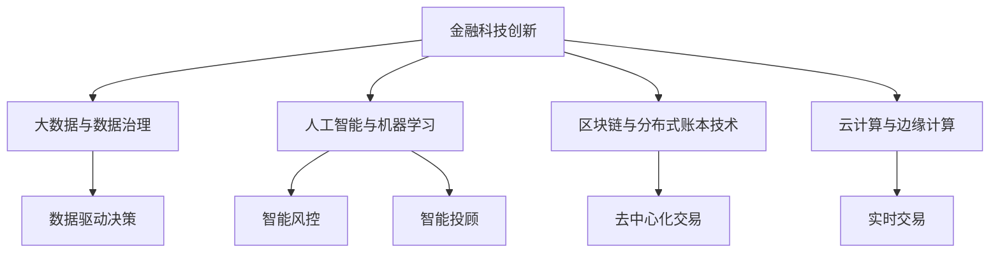

                 

# 利用技术优势进行金融科技创新

## 1. 背景介绍

### 1.1 问题由来
随着数字化转型的大潮席卷全球，金融行业也在快速向科技化迈进。无论是传统银行业，还是新兴金融科技公司，都在积极利用先进技术改造业务流程，提升服务质量，拓展业务边界。金融科技创新不仅关乎金融机构的竞争力，也直接影响着消费者的体验与信任。

近年来，大数据、人工智能、区块链等技术在金融领域的应用日趋成熟，衍生出包括智能投顾、算法交易、智能风控等在内的一系列创新服务。然而，随着技术应用越来越深入，金融科技创新的瓶颈也开始显现：数据隐私保护、算法透明性、模型鲁棒性等难题亟需解决。

### 1.2 问题核心关键点
金融科技创新需要依赖多项关键技术的支撑，主要包括：

- **大数据与数据治理**：通过数据整合、清洗和治理，构建统一的数据基础平台，支撑数据驱动的决策分析。
- **人工智能与机器学习**：利用深度学习、自然语言处理等技术，提升金融服务智能化水平，增强风险识别和应对能力。
- **区块链与分布式账本技术**：保障交易透明性和安全性，降低中介成本，提升交易效率。
- **云计算与边缘计算**：通过云计算提供强大的算力支持，通过边缘计算降低网络延迟，提升用户体验。

这些技术在金融领域的应用，带来了显著的业务增值和转型升级，但也带来了新的挑战。如何在技术创新与业务发展之间找到平衡，是当前金融科技创新的一个重要课题。

## 2. 核心概念与联系

### 2.1 核心概念概述

为更好地理解金融科技创新，本节将介绍几个密切相关的核心概念：

- **金融科技创新**：利用先进信息技术，对金融业务进行智能化、自动化、数字化改造，提升服务效率、降低成本、提升客户体验的过程。
- **大数据与数据治理**：从海量数据中提取有价值的信息，通过数据清洗、整合、治理等手段，提升数据质量，支撑数据驱动的决策分析。
- **人工智能与机器学习**：通过算法学习和模型训练，使机器具备理解、处理和生成复杂数据的能力，用于金融风险评估、智能投顾、欺诈检测等场景。
- **区块链与分布式账本技术**：通过去中心化、不可篡改的区块链技术，实现金融交易的透明性和安全性，增强信任机制。
- **云计算与边缘计算**：通过云平台提供弹性计算资源，通过边缘计算提升响应速度，满足实时交易的需求。

这些核心概念之间的逻辑关系可以通过以下Mermaid流程图来展示：



这个流程图展示了大数据、人工智能、区块链、云计算等技术在金融科技创新中的应用，以及它们共同支撑起数据驱动决策、智能风控、智能投顾、去中心化交易、实时交易等金融科技创新方向。

## 3. 核心算法原理 & 具体操作步骤
### 3.1 算法原理概述

金融科技创新涉及多个技术领域的交叉融合，其核心算法原理可以归纳为以下几个方面：

- **数据挖掘与模型训练**：利用大数据技术进行数据预处理和特征提取，通过机器学习算法对历史数据进行建模，预测金融市场趋势和风险。
- **自然语言处理与文本分析**：通过NLP技术对金融新闻、报告、公告等文本数据进行分析，提取有价值信息，用于辅助决策。
- **强化学习与智能投顾**：利用强化学习算法，训练智能投顾模型，根据市场动态和用户偏好，提供个性化投资建议。
- **区块链与智能合约**：利用区块链技术实现去中心化交易，通过智能合约自动化执行交易规则，提升交易效率和安全性。
- **云计算与边缘计算**：利用云计算提供弹性计算资源，通过边缘计算优化网络架构，实现低延迟、高可靠性的金融服务。

### 3.2 算法步骤详解

金融科技创新的一般流程包括数据获取、数据处理、模型训练、模型部署和业务集成等多个环节，具体如下：

**Step 1: 数据收集与处理**
- 从各类金融数据源（如市场交易数据、社交媒体数据、新闻公告等）收集原始数据。
- 对数据进行清洗、去重、归一化等预处理操作，构建数据基础平台。

**Step 2: 模型训练与优化**
- 根据具体需求，选择合适的算法模型，如随机森林、深度学习等。
- 在处理后的数据上，进行模型训练，选择最优的超参数和模型架构。
- 应用交叉验证、网格搜索等方法，对模型进行参数调优和模型集成。

**Step 3: 模型部署与集成**
- 将训练好的模型部署到生产环境，如云平台或边缘设备。
- 对模型进行监控和调优，确保其稳定性和性能。
- 将模型集成到业务流程中，实现自动化决策和服务。

**Step 4: 业务应用与评估**
- 在实际业务场景中测试模型的效果，收集反馈数据。
- 对模型的预测结果进行分析和评估，优化模型性能。
- 持续收集新数据，定期更新和重新训练模型。

### 3.3 算法优缺点

金融科技创新的算法优势包括：

- **提升效率与降低成本**：自动化和智能化技术可以显著提升业务处理效率，减少人工干预和运营成本。
- **增强决策与风险控制**：通过数据驱动和模型预测，金融服务可以实现更加精准的决策和风险控制。
- **提升客户体验与信任**：利用技术手段实现快速响应和高可靠性服务，增强客户信任和满意度。

同时，金融科技创新也面临一些挑战：

- **数据隐私与安全**：金融数据敏感性高，如何确保数据安全和隐私保护是一个重大挑战。
- **模型透明性与可解释性**：复杂模型如深度学习常常被视为"黑盒"，难以解释其决策过程，影响模型信任度。
- **技术实现与业务适配**：技术创新需符合实际业务需求，如何找到技术实现与业务目标之间的平衡点，需要深入理解和沟通。
- **伦理与社会责任**：金融技术创新可能带来新的伦理问题和公平性问题，如算法偏见、信息不对称等。

### 3.4 算法应用领域

金融科技创新的算法技术在多个领域得到广泛应用，例如：

- **智能投顾**：利用机器学习和自然语言处理技术，分析市场动态和用户需求，提供个性化投资建议。
- **算法交易**：通过分析历史交易数据和市场趋势，自动执行交易策略，优化投资回报率。
- **智能风控**：利用大数据和机器学习算法，实时监控交易风险，进行信用评估和欺诈检测。
- **金融市场分析**：通过自然语言处理和文本挖掘技术，对金融新闻、报告等进行分析，预测市场走势。
- **区块链与去中心化金融**：利用区块链技术，实现去中心化交易、智能合约、去中心化金融（DeFi）等创新应用。

这些技术在金融领域的广泛应用，正在重塑金融服务模式，推动金融科技行业的快速发展。

## 4. 数学模型和公式 & 详细讲解 & 举例说明

### 4.1 数学模型构建

金融科技创新涉及多个数学模型，以下以风险评估为例，介绍其数学模型构建过程。

假设有一个二分类问题，我们需要预测某笔贷款是否违约。假设输入特征为 $x_1, x_2, ..., x_n$，输出标签为 $y \in \{0, 1\}$。使用逻辑回归模型进行预测，模型形式为：

$$
f(x) = \frac{1}{1 + \exp(-\theta^T x)}
$$

其中 $\theta$ 为模型参数。模型损失函数为交叉熵损失：

$$
\mathcal{L}(y, f(x)) = -[y \log f(x) + (1-y) \log (1-f(x))]
$$

目标是最小化经验风险，即：

$$
\theta^* = \mathop{\arg\min}_{\theta} \frac{1}{N} \sum_{i=1}^N \mathcal{L}(y_i, f(x_i))
$$

### 4.2 公式推导过程

在给定训练集 $\{(x_i, y_i)\}_{i=1}^N$ 的情况下，最小化上述损失函数，可以使用梯度下降等优化算法。假设选择了二阶矩估计（如正态分布）的梯度下降算法，更新公式为：

$$
\theta \leftarrow \theta - \eta \nabla_{\theta} \mathcal{L}(\theta)
$$

其中 $\eta$ 为学习率，$\nabla_{\theta} \mathcal{L}(\theta)$ 为损失函数对 $\theta$ 的梯度，可以通过链式法则求得：

$$
\nabla_{\theta} \mathcal{L}(\theta) = -\frac{1}{N} \sum_{i=1}^N [(y_i - f(x_i)) x_i]
$$

通过反向传播算法，可高效计算出梯度，并不断迭代优化模型参数 $\theta$，直到损失函数收敛。

### 4.3 案例分析与讲解

以智能投顾系统为例，介绍模型的训练与优化过程。

假设我们使用深度学习模型，如卷积神经网络（CNN）或循环神经网络（RNN），作为智能投顾的决策引擎。模型输入为股票价格、交易量、市场情绪等特征，输出为买入、卖出、持平的信号。训练数据集包括历史交易数据和市场信息，标注为买入、卖出或持平的标签。

模型训练过程如下：

1. 数据预处理：对原始数据进行归一化、特征工程等预处理操作。
2. 模型构建：选择CNN或RNN等深度学习模型，定义输入和输出层。
3. 损失函数设计：选择交叉熵损失函数，作为模型的训练目标。
4. 模型训练：在训练集上使用梯度下降算法，不断迭代更新模型参数。
5. 模型评估：在验证集上评估模型性能，调整超参数。
6. 模型集成：将训练好的模型集成到投顾系统中，实时接收市场数据，输出投资建议。

在模型集成后，可以持续收集用户反馈和市场数据，不断优化模型，提升预测准确性和鲁棒性。

## 5. 项目实践：代码实例和详细解释说明

### 5.1 开发环境搭建

在进行金融科技创新项目实践前，我们需要准备好开发环境。以下是使用Python进行金融科技创新开发的常见环境配置流程：

1. 安装Anaconda：从官网下载并安装Anaconda，用于创建独立的Python环境。

2. 创建并激活虚拟环境：
```bash
conda create -n finance-env python=3.8 
conda activate finance-env
```

3. 安装必要的Python包：
```bash
pip install pandas numpy scikit-learn torch transformers 
```

4. 安装其他必要工具：
```bash
pip install pytorch-lightning datasets transformers huggingface_hub 
```

5. 安装相关库：
```bash
pip install pyarrow snp fastapi numpy scipy pandas sklearn 
```

完成上述步骤后，即可在`finance-env`环境中开始项目实践。

### 5.2 源代码详细实现

我们以智能投顾系统为例，介绍基于PyTorch的金融科技创新项目开发流程。

首先，导入必要的库和模块：

```python
import torch
import torch.nn as nn
import torch.optim as optim
from torch.utils.data import DataLoader
from sklearn.model_selection import train_test_split
import pandas as pd
import numpy as np
```

接着，准备数据集：

```python
# 读取数据集
data = pd.read_csv('finance_data.csv')

# 数据清洗与预处理
# 此处省略数据清洗和特征工程的代码

# 划分训练集和测试集
train_data, test_data = train_test_split(data, test_size=0.2, random_state=42)

# 定义模型
class FinanceModel(nn.Module):
    def __init__(self):
        super().__init__()
        self.conv1 = nn.Conv2d(3, 64, kernel_size=3, padding=1)
        self.pool = nn.MaxPool2d(kernel_size=2, stride=2)
        self.conv2 = nn.Conv2d(64, 128, kernel_size=3, padding=1)
        self.fc1 = nn.Linear(128 * 8 * 8, 256)
        self.fc2 = nn.Linear(256, 3)

    def forward(self, x):
        x = self.conv1(x)
        x = self.pool(x)
        x = self.conv2(x)
        x = self.pool(x)
        x = x.view(-1, 128 * 8 * 8)
        x = self.fc1(x)
        x = torch.relu(x)
        x = self.fc2(x)
        return x

# 定义损失函数和优化器
model = FinanceModel()
loss_fn = nn.CrossEntropyLoss()
optimizer = optim.Adam(model.parameters(), lr=0.001)
```

然后，定义训练和评估函数：

```python
def train_epoch(model, data_loader, optimizer):
    model.train()
    total_loss = 0
    for data, target in data_loader:
        data, target = data.to(device), target.to(device)
        optimizer.zero_grad()
        output = model(data)
        loss = loss_fn(output, target)
        total_loss += loss.item()
        loss.backward()
        optimizer.step()
    return total_loss / len(data_loader)

def evaluate(model, data_loader):
    model.eval()
    total_loss = 0
    correct = 0
    with torch.no_grad():
        for data, target in data_loader:
            data, target = data.to(device), target.to(device)
            output = model(data)
            loss = loss_fn(output, target)
            total_loss += loss.item()
            _, predicted = torch.max(output.data, 1)
            correct += (predicted == target).sum().item()
    return total_loss / len(data_loader), correct / len(data_loader.dataset)

# 定义模型训练与评估函数
device = torch.device('cuda' if torch.cuda.is_available() else 'cpu')
model.to(device)

train_loader = DataLoader(train_data, batch_size=64, shuffle=True)
test_loader = DataLoader(test_data, batch_size=64, shuffle=False)

# 模型训练
num_epochs = 10
best_loss = float('inf')
for epoch in range(num_epochs):
    train_loss = train_epoch(model, train_loader, optimizer)
    test_loss, test_acc = evaluate(model, test_loader)
    if test_loss < best_loss:
        best_loss = test_loss
        torch.save(model.state_dict(), 'best_model.pth')

print('Best loss:', best_loss)
```

在代码中，我们定义了一个简单的卷积神经网络模型，并使用交叉熵损失函数进行训练。在训练过程中，我们使用了Adam优化器进行参数更新，并在训练和评估时使用GPU进行加速。

### 5.3 代码解读与分析

以下是代码中关键部分的解读与分析：

**数据预处理与特征工程**：
- 在实际应用中，数据预处理和特征工程是非常关键的一步。需要根据具体业务需求进行数据清洗、特征提取、归一化等操作，构建高质量的数据集。

**模型定义**：
- 我们定义了一个包含两个卷积层、两个池化层和两个全连接层的简单卷积神经网络模型。在实际应用中，模型设计需要根据具体业务需求进行调整。

**损失函数与优化器**：
- 我们选择了交叉熵损失函数，适用于二分类问题的预测。在实际应用中，可以根据具体问题选择合适的损失函数。

**模型训练与评估**：
- 在训练过程中，我们使用了Adam优化器进行参数更新。在评估过程中，我们计算了模型在测试集上的损失和准确率，并根据损失进行模型保存。

在模型训练完成后，我们可以将模型集成到实际的智能投顾系统中，接收市场数据，输出投资建议。

### 5.4 运行结果展示

训练完成后，我们保存了模型并评估了其在测试集上的性能。如果模型在测试集上获得了较好的性能，我们可以将其集成到实际应用中。

## 6. 实际应用场景

### 6.1 智能投顾

智能投顾系统通过机器学习算法和大数据分析，为投资者提供个性化的投资建议。智能投顾可以自动分析市场趋势、预测股票价格，帮助用户制定投资策略，优化投资组合，降低投资风险。

智能投顾系统可以广泛应用于个人投资者、机构投资者等不同场景。通过智能投顾，投资者可以享受到更高效、更精准、更个性化的投资服务。

### 6.2 风险控制

金融风险控制是金融科技创新的重要方向之一。通过大数据和机器学习算法，可以对交易行为进行实时监控，识别异常交易和欺诈行为，及时预警并采取措施。

风险控制系统可以广泛应用于贷款审批、信用卡审核、证券交易等领域，提升风险识别和防范能力，保护金融机构和投资者利益。

### 6.3 区块链与去中心化金融

区块链技术通过去中心化、不可篡改的特性，为金融交易提供了更高的安全性和透明度。智能合约可以实现自动执行交易规则，提升交易效率和信任度。

去中心化金融（DeFi）利用区块链技术，提供了无中介的交易服务，降低了交易成本，拓展了金融服务的边界。DeFi系统可以广泛应用于借贷、保险、投资等领域。

### 6.4 未来应用展望

未来，金融科技创新将继续深入融合多项前沿技术，带来更多创新应用。

**大数据与人工智能的深度融合**：通过大数据和人工智能技术的结合，可以实现更精准的风险评估和市场预测，提升金融服务的智能化水平。

**区块链与分布式账本技术的发展**：未来，区块链技术将进一步发展，成为金融领域的基础设施。智能合约、去中心化金融（DeFi）等应用将得到更广泛的应用。

**云计算与边缘计算的协同发展**：通过云计算和边缘计算的协同发展，可以实现更高效、更可靠的金融服务，满足实时交易的需求。

## 7. 工具和资源推荐
### 7.1 学习资源推荐

为了帮助开发者系统掌握金融科技创新技术的理论基础和实践技巧，这里推荐一些优质的学习资源：

1. **《金融科技创新技术》系列课程**：由知名高校或企业提供的金融科技专业课程，涵盖大数据、人工智能、区块链、云计算等多个领域的最新技术。

2. **《机器学习在金融中的应用》书籍**：介绍机器学习在金融领域的具体应用，包括信用评分、风险管理、智能投顾等。

3. **《区块链技术与应用》课程**：由知名高校或企业提供的区块链专业课程，涵盖区块链技术原理、应用场景、安全机制等。

4. **金融科技创新技术社区**：加入金融科技创新技术社区，获取最新的行业动态和技术资讯，与同行交流学习经验。

5. **金融科技创新技术论文**：关注金融科技创新技术的最新论文，了解前沿研究成果和应用案例。

通过对这些资源的学习实践，相信你一定能够快速掌握金融科技创新的精髓，并用于解决实际的金融问题。

### 7.2 开发工具推荐

高效的开发离不开优秀的工具支持。以下是几款用于金融科技创新开发的常用工具：

1. **PyTorch**：基于Python的开源深度学习框架，灵活动态的计算图，适合快速迭代研究。

2. **TensorFlow**：由Google主导开发的开源深度学习框架，生产部署方便，适合大规模工程应用。

3. **TensorFlow Lite**：TensorFlow的轻量级部署工具，适用于移动端和边缘计算设备。

4. **PyTorch Lightning**：基于PyTorch的快速原型开发工具，提供高效的模型训练和评估功能。

5. **Jupyter Notebook**：开源的交互式编程环境，支持Python、R等多种语言，适合数据分析和模型训练。

6. **GitHub**：全球最大的开源社区，方便开发者共享代码、协作开发和跟踪项目进度。

合理利用这些工具，可以显著提升金融科技创新项目的开发效率，加快创新迭代的步伐。

### 7.3 相关论文推荐

金融科技创新技术的发展源于学界的持续研究。以下是几篇奠基性的相关论文，推荐阅读：

1. **《大数据与金融科技》**：介绍了大数据在金融领域的应用，涵盖数据治理、风险管理、智能投顾等多个方向。

2. **《机器学习在金融风险管理中的应用》**：研究了机器学习算法在金融风险识别和评估中的应用，探讨了模型选择和评估方法。

3. **《区块链与去中心化金融》**：介绍了区块链技术在金融领域的应用，涵盖智能合约、去中心化交易、去中心化金融（DeFi）等多个方向。

4. **《金融科技创新技术的未来发展趋势》**：分析了金融科技创新技术的未来发展方向，探讨了大数据、人工智能、区块链、云计算等技术的融合应用。

5. **《智能投顾系统的设计与实现》**：介绍了智能投顾系统的设计与实现方法，探讨了模型选择和用户交互设计等问题。

这些论文代表了大数据、人工智能、区块链、云计算等技术在金融科技创新中的应用方向，为金融科技领域的理论研究和实践应用提供了重要参考。

## 8. 总结：未来发展趋势与挑战

### 8.1 总结

本文对金融科技创新技术的核心算法原理、操作步骤和应用场景进行了全面系统的介绍。首先阐述了金融科技创新在数据驱动、智能决策、去中心化等方面的优势，明确了其在提升金融服务质量、降低运营成本、防范金融风险等方面的重要意义。其次，从原理到实践，详细讲解了金融科技创新的数学模型构建和代码实现，给出了智能投顾系统的完整代码实例。同时，本文还广泛探讨了金融科技创新技术在智能投顾、风险控制、去中心化金融等多个领域的应用前景，展示了其在推动金融科技行业发展中的巨大潜力。

通过本文的系统梳理，可以看到，金融科技创新技术的广泛应用正在改变金融服务的模式，推动金融科技行业的快速演进。未来，伴随大数据、人工智能、区块链等技术的持续发展，金融科技创新必将在更多领域得到深化，为经济社会的发展注入新的动力。

### 8.2 未来发展趋势

展望未来，金融科技创新技术将呈现以下几个发展趋势：

1. **大数据与人工智能的深度融合**：通过大数据和人工智能技术的结合，可以实现更精准的风险评估和市场预测，提升金融服务的智能化水平。

2. **区块链与分布式账本技术的发展**：未来，区块链技术将进一步发展，成为金融领域的基础设施。智能合约、去中心化金融（DeFi）等应用将得到更广泛的应用。

3. **云计算与边缘计算的协同发展**：通过云计算和边缘计算的协同发展，可以实现更高效、更可靠的金融服务，满足实时交易的需求。

4. **去中心化与隐私保护**：去中心化金融（DeFi）和隐私保护技术将成为未来金融科技创新的重要方向，确保用户数据安全和隐私保护。

5. **合规与监管**：金融科技创新需要符合法律法规，确保合规性。未来将建立更完善的监管框架，促进金融科技的健康发展。

6. **可持续发展**：金融科技创新需要考虑环境、社会和治理（ESG）因素，推动可持续发展目标的实现。

以上趋势凸显了金融科技创新技术的广阔前景。这些方向的探索发展，必将进一步提升金融服务的质量和效率，推动金融科技行业的可持续发展。

### 8.3 面临的挑战

尽管金融科技创新技术已经取得了显著成就，但在迈向更加智能化、普适化应用的过程中，仍面临诸多挑战：

1. **数据隐私与安全**：金融数据敏感性高，如何确保数据安全和隐私保护是一个重大挑战。

2. **模型透明性与可解释性**：复杂模型如深度学习常常被视为"黑盒"，难以解释其决策过程，影响模型信任度。

3. **技术实现与业务适配**：技术创新需符合实际业务需求，如何找到技术实现与业务目标之间的平衡点，需要深入理解和沟通。

4. **伦理与社会责任**：金融技术创新可能带来新的伦理问题和公平性问题，如算法偏见、信息不对称等。

5. **监管与合规**：金融科技创新需要符合法律法规，确保合规性。

6. **可持续发展**：金融科技创新需要考虑环境、社会和治理（ESG）因素，推动可持续发展目标的实现。

正视金融科技创新面临的这些挑战，积极应对并寻求突破，将是大规模金融科技创新走向成熟的必由之路。

### 8.4 研究展望

面对金融科技创新所面临的挑战，未来的研究需要在以下几个方面寻求新的突破：

1. **数据隐私与安全技术**：研究如何在大数据应用中保护用户隐私，开发高效的数据隐私保护技术。

2. **模型透明性与可解释性**：研究如何增强模型的可解释性，开发易于理解、易于解释的金融模型。

3. **技术实现与业务适配**：研究如何更好地将先进技术应用到实际业务中，确保技术的落地性和适配性。

4. **伦理与社会责任**：研究如何在金融科技创新中考虑伦理和社会责任，避免不公平、不道德的算法应用。

5. **监管与合规**：研究如何建立更完善的监管框架，确保金融科技创新符合法律法规。

6. **可持续发展**：研究如何利用金融科技创新推动可持续发展目标的实现，促进绿色金融和普惠金融的发展。

这些研究方向的探索，必将引领金融科技创新技术迈向更高的台阶，为构建安全、可靠、可解释、可控的智能金融系统铺平道路。面向未来，金融科技创新技术还需要与其他人工智能技术进行更深入的融合，如知识表示、因果推理、强化学习等，多路径协同发力，共同推动金融科技行业的进步。

## 9. 附录：常见问题与解答

**Q1：大数据与金融科技创新有哪些主要应用场景？**

A: 大数据在金融科技创新的主要应用场景包括：

1. **客户行为分析**：通过大数据分析客户的历史行为数据，了解客户偏好，制定个性化的金融产品和服务。

2. **风险评估与管理**：利用大数据分析历史交易数据和市场数据，评估信用风险、市场风险等，制定风险管理策略。

3. **市场预测与策略优化**：通过大数据分析市场数据和新闻数据，预测市场趋势，优化投资策略。

4. **运营优化与决策支持**：利用大数据分析运营数据，优化业务流程，提高决策效率。

**Q2：机器学习在金融风险管理中有哪些应用？**

A: 机器学习在金融风险管理中的主要应用包括：

1. **信用评分**：利用机器学习算法评估客户的信用风险，制定授信策略。

2. **欺诈检测**：利用机器学习算法分析交易数据，识别异常交易行为，防范欺诈风险。

3. **市场风险评估**：利用机器学习算法分析历史交易数据和市场数据，评估市场风险。

4. **舆情分析**：利用机器学习算法分析新闻、社交媒体等文本数据，识别舆情变化，评估市场情绪。

**Q3：区块链技术在金融科技创新中有哪些主要应用？**

A: 区块链技术在金融科技创新中的主要应用包括：

1. **去中心化交易**：利用区块链技术实现去中心化交易，降低中介成本，提升交易效率。

2. **智能合约**：利用区块链技术实现智能合约，自动化执行交易规则，提升交易透明度和信任度。

3. **去中心化金融（DeFi）**：利用区块链技术实现去中心化金融服务，如去中心化借贷、去中心化保险等。

4. **供应链金融**：利用区块链技术优化供应链管理，提升供应链效率和信任度。

**Q4：云计算与边缘计算在金融科技创新中有哪些主要应用？**

A: 云计算与边缘计算在金融科技创新中的主要应用包括：

1. **大规模数据分析**：利用云计算平台提供的大规模计算资源，进行大规模数据分析和机器学习建模。

2. **实时交易**：利用边缘计算技术，降低网络延迟，提升实时交易的效率和可靠性。

3. **数据存储与管理**：利用云计算平台提供的海量存储服务，实现数据的高效存储与管理。

4. **高可用性架构**：利用云计算平台提供的弹性计算资源，实现高可用性架构，保障金融服务的稳定性。

**Q5：金融科技创新技术的发展趋势有哪些？**

A: 金融科技创新技术的发展趋势包括：

1. **大数据与人工智能的深度融合**：通过大数据和人工智能技术的结合，实现更精准的风险评估和市场预测，提升金融服务的智能化水平。

2. **区块链与分布式账本技术的发展**：未来，区块链技术将进一步发展，成为金融领域的基础设施。智能合约、去中心化金融（DeFi）等应用将得到更广泛的应用。

3. **云计算与边缘计算的协同发展**：通过云计算和边缘计算的协同发展，实现更高效、更可靠的金融服务，满足实时交易的需求。

4. **去中心化与隐私保护**：去中心化金融（DeFi）和隐私保护技术将成为未来金融科技创新的重要方向，确保用户数据安全和隐私保护。

5. **合规与监管**：金融科技创新需要符合法律法规，确保合规性。

6. **可持续发展**：金融科技创新需要考虑环境、社会和治理（ESG）因素，推动可持续发展目标的实现。

这些趋势凸显了金融科技创新技术的广阔前景。这些方向的探索发展，必将进一步提升金融服务的质量和效率，推动金融科技行业的可持续发展。

---

作者：禅与计算机程序设计艺术 / Zen and the Art of Computer Programming

