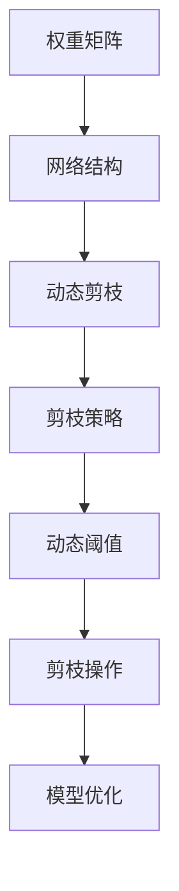

                 

# 动态阈值剪枝：适应网络结构变化的技术

> 关键词：动态阈值剪枝,网络结构变化,模型优化,算法优化

## 1. 背景介绍

### 1.1 问题由来
在深度学习模型训练过程中，模型结构的设计至关重要。随着模型规模的不断扩大，网络结构也越来越复杂，往往包含大量冗余的参数和层。这些冗余部分不仅增加了模型的计算和存储负担，还可能降低模型的泛化能力和训练速度。针对这一问题，剪枝技术应运而生，通过删除模型中不必要的参数和层，优化模型的结构，提升模型性能和训练效率。

然而，传统的剪枝技术大多是在模型训练完成后进行的，无法动态适应模型结构的变化。尤其是在实际应用场景中，模型往往需要根据不同的输入数据和任务要求，进行动态的参数和结构调整。因此，需要一种更加灵活的剪枝方法，能够实时适应网络结构的变化，提升模型的实用性和鲁棒性。

### 1.2 问题核心关键点
动态阈值剪枝是一种针对深度学习模型结构动态调整的剪枝方法，能够根据模型性能和数据分布的变化，动态调整剪枝阈值，适应不同的模型结构变化。

该方法的核心思想是：在模型训练过程中，实时监控模型的性能和参数分布，根据当前状态动态调整剪枝阈值，删除不重要的参数和层，优化模型结构。通过这种方式，可以在保证模型性能的前提下，减少模型参数量，提升模型的训练和推理效率。

## 2. 核心概念与联系

### 2.1 核心概念概述

为更好地理解动态阈值剪枝技术，本节将介绍几个密切相关的核心概念：

- **剪枝(Pruning)**：通过删除网络中的部分参数和层，简化模型结构，减少模型计算和存储负担。
- **动态剪枝(Dynamic Pruning)**：在模型训练过程中，根据模型性能和数据分布的变化，实时调整剪枝策略，适应不同的模型结构变化。
- **阈值(Threshold)**：用于判断网络参数重要性的标准，通常以参数权重的大小为阈值。
- **权重矩阵(Weight Matrix)**：深度学习模型中，每个神经元与其连接的神经元之间都有一个权重值，用于衡量连接的重要性。
- **网络结构(Network Architecture)**：深度学习模型中，神经元之间的连接方式和层数、节点数等构成了模型的结构。

这些核心概念之间的逻辑关系可以通过以下Mermaid流程图来展示：



这个流程图展示了大规模深度学习模型中，动态阈值剪枝的实现流程：

1. 权重矩阵作为网络结构的基础，连接各个神经元。
2. 动态剪枝在模型训练过程中实时调整，根据当前状态动态调整剪枝策略。
3. 动态阈值决定剪枝操作的时机和强度，确保剪枝后的模型结构符合当前任务需求。
4. 剪枝操作去除不重要的参数和层，优化模型结构。
5. 模型优化提升剪枝后的模型性能，确保其在实际应用中的表现。

## 3. 核心算法原理 & 具体操作步骤
### 3.1 算法原理概述

动态阈值剪枝的核心算法原理基于动态阈值的定义和调整。其基本流程如下：

1. 在模型训练过程中，实时监控模型的性能和参数分布。
2. 根据当前模型状态，动态计算剪枝阈值，决定剪枝操作的强度和时机。
3. 执行剪枝操作，删除不重要的参数和层，优化模型结构。
4. 通过反向传播和模型优化，保证剪枝后的模型性能。

动态阈值剪枝的实现通常分为以下几个步骤：

- 初始化剪枝阈值。在模型训练开始时，设定一个初始的剪枝阈值，用于衡量参数的重要性。
- 实时监控模型状态。在每个训练轮次中，监控模型参数的权重、梯度等状态，分析当前模型的性能表现。
- 动态调整剪枝阈值。根据模型性能和参数分布的变化，动态调整剪枝阈值，以适应不同的模型结构需求。
- 执行剪枝操作。根据动态调整的阈值，执行剪枝操作，去除不重要的参数和层，优化模型结构。
- 模型优化。通过反向传播和模型优化，保证剪枝后的模型性能，避免剪枝操作影响模型的准确性。

### 3.2 算法步骤详解

下面详细介绍动态阈值剪枝的具体实现步骤：

**Step 1: 初始化剪枝阈值**
- 设定一个初始的剪枝阈值 $\tau$，通常为模型参数的权重值。例如，$\tau$ 可以设定为模型参数权重绝对值的均值或标准差。

**Step 2: 实时监控模型状态**
- 在每个训练轮次中，记录模型参数的权重、梯度等状态，并计算当前轮次的平均性能指标，如准确率、损失函数等。
- 使用梯度下降等优化算法，更新模型参数，同时记录当前的参数分布和模型性能。

**Step 3: 动态调整剪枝阈值**
- 根据当前轮次的参数分布和模型性能，动态计算剪枝阈值 $\tau'$。通常有以下几种方法：
  - 基于性能的剪枝：根据当前轮次的性能指标，动态调整剪枝阈值。例如，当模型性能显著下降时，降低剪枝阈值，保留更多的参数和层。
  - 基于参数分布的剪枝：根据参数的权重分布，动态调整剪枝阈值。例如，当模型中有大量权重值接近零的参数时，提高剪枝阈值，去除更多参数。
  - 基于模型的剪枝：根据当前模型的结构，动态调整剪枝阈值。例如，当模型中有冗余层时，提高剪枝阈值，删除更多层。

**Step 4: 执行剪枝操作**
- 根据动态调整的剪枝阈值 $\tau'$，执行剪枝操作，删除不重要的参数和层。
- 对于每个参数，计算其权重与剪枝阈值之比 $r = \frac{|w_i|}{\tau'}$，如果 $r < 1$，则认为该参数不重要，将其删除。
- 对于每层，计算其权重矩阵的 $L_p$ 范数 $\|W\|_p$，如果 $\|W\|_p < \tau'$，则认为该层不必要，将其删除。

**Step 5: 模型优化**
- 执行剪枝操作后，通过反向传播和模型优化，调整剪枝后的模型参数，保证模型性能。
- 使用梯度下降等优化算法，更新剪枝后的模型参数，并计算新的性能指标。
- 如果剪枝后的模型性能下降，则执行剪枝操作的逆操作，恢复被删除的参数和层。

### 3.3 算法优缺点

动态阈值剪枝方法具有以下优点：
1. **实时性**：能够实时监控模型状态，动态调整剪枝阈值，适应不同的模型结构变化。
2. **自适应性**：根据模型性能和参数分布的变化，自动调整剪枝操作，提升模型实用性。
3. **高效性**：剪枝操作可以在模型训练过程中进行，减少额外的训练时间。
4. **鲁棒性**：能够处理大规模模型和复杂网络结构，提升模型泛化能力和鲁棒性。

同时，该方法也存在一些缺点：
1. **计算开销**：实时监控模型状态和计算剪枝阈值会增加额外的计算开销。
2. **精度损失**：动态剪枝过程中，可能删除重要参数和层，影响模型性能。
3. **复杂度**：动态阈值剪枝算法实现复杂，需要考虑多种因素，进行综合决策。

尽管存在这些缺点，但动态阈值剪枝在实际应用中仍然取得了显著效果，广泛应用于图像处理、自然语言处理等深度学习领域。

### 3.4 算法应用领域

动态阈值剪枝技术在深度学习模型优化中具有广泛的应用场景，主要包括以下几个方面：

- **图像处理**：在图像分类、目标检测等任务中，可以通过动态阈值剪枝去除冗余的卷积层和参数，提升模型的计算效率和推理速度。
- **自然语言处理**：在机器翻译、文本分类等任务中，可以通过动态阈值剪枝减少模型参数量和计算负担，提升模型的泛化能力和训练速度。
- **语音识别**：在语音识别任务中，可以通过动态阈值剪枝去除冗余的神经元和层，提升模型的准确率和鲁棒性。
- **推荐系统**：在推荐系统任务中，可以通过动态阈值剪枝减少模型参数量和计算负担，提升推荐算法的效率和效果。
- **生成模型**：在生成模型任务中，可以通过动态阈值剪枝去除冗余的神经元和层，提升模型的计算效率和生成质量。

## 4. 数学模型和公式 & 详细讲解  
### 4.1 数学模型构建

动态阈值剪枝的数学模型构建涉及到模型性能评估、参数重要性度量和剪枝阈值计算等多个方面。以下是详细的数学模型构建过程：

**模型性能评估**：
- 在每个训练轮次中，计算模型在当前数据集上的损失函数 $L(\theta)$ 和性能指标 $P(\theta)$。例如，对于分类任务，可以计算交叉熵损失和准确率 $P$。

**参数重要性度量**：
- 参数重要性可以通过参数的权重值、梯度值等度量。通常使用权重值的大小作为参数重要性的指标。
- 设模型参数 $\theta$ 包含 $n$ 个参数，每个参数的权重值为 $w_i$。参数重要性 $r_i$ 定义为：
  $$
  r_i = \frac{|w_i|}{\tau}
  $$
  其中 $\tau$ 为剪枝阈值。

**剪枝阈值计算**：
- 剪枝阈值 $\tau$ 的计算方法有多种，通常基于当前模型的性能和参数分布。例如，基于性能的剪枝方法可以计算当前轮次的平均性能指标，并根据性能变化动态调整剪枝阈值。

### 4.2 公式推导过程

以下是动态阈值剪枝的核心公式推导过程：

**参数重要性度量**：
- 假设模型参数 $\theta$ 包含 $n$ 个参数，每个参数的权重值为 $w_i$。参数重要性 $r_i$ 定义为：
  $$
  r_i = \frac{|w_i|}{\tau}
  $$
  其中 $\tau$ 为剪枝阈值。

**剪枝阈值计算**：
- 假设当前轮次的平均损失函数为 $L$，性能指标为 $P$。基于性能的剪枝方法可以计算当前轮次的平均性能指标，并根据性能变化动态调整剪枝阈值：
  $$
  \tau = \tau_0 \times \alpha + (1-\alpha) \times \frac{L}{\epsilon}
  $$
  其中 $\tau_0$ 为初始剪枝阈值，$\alpha$ 为性能衰减系数，$\epsilon$ 为性能下降阈值。

**剪枝操作**：
- 对于每个参数 $w_i$，计算其权重与剪枝阈值之比 $r_i = \frac{|w_i|}{\tau}$，如果 $r_i < 1$，则认为该参数不重要，将其删除。
- 对于每层 $W$，计算其权重矩阵的 $L_p$ 范数 $\|W\|_p$，如果 $\|W\|_p < \tau'$，则认为该层不必要，将其删除。

### 4.3 案例分析与讲解

下面以图像分类任务为例，详细讲解动态阈值剪枝的实现过程：

**数据准备**：
- 准备图像分类数据集，包含训练集、验证集和测试集。例如，使用CIFAR-10数据集，包含60000张32x32彩色图像，分为10个类别。

**模型初始化**：
- 使用预训练的ResNet模型，包含多个卷积层和全连接层。例如，使用ResNet-18模型。

**剪枝阈值初始化**：
- 设定初始剪枝阈值为参数权重绝对值的均值，即 $\tau = \frac{1}{n} \sum_{i=1}^n |w_i|$。

**实时监控模型状态**：
- 在每个训练轮次中，记录模型参数的权重、梯度等状态，并计算当前轮次的平均损失函数和性能指标。例如，使用交叉熵损失和准确率作为性能指标。

**动态调整剪枝阈值**：
- 根据当前轮次的性能指标，动态计算剪枝阈值 $\tau'$。例如，当模型性能显著下降时，降低剪枝阈值，保留更多的参数和层。

**执行剪枝操作**：
- 对于每个参数，计算其权重与剪枝阈值之比 $r_i = \frac{|w_i|}{\tau'}$，如果 $r_i < 1$，则认为该参数不重要，将其删除。
- 对于每层，计算其权重矩阵的 $L_2$ 范数 $\|W\|_2$，如果 $\|W\|_2 < \tau'$，则认为该层不必要，将其删除。

**模型优化**：
- 执行剪枝操作后，通过反向传播和模型优化，调整剪枝后的模型参数，保证模型性能。例如，使用梯度下降等优化算法，更新剪枝后的模型参数，并计算新的性能指标。

**评估模型性能**：
- 在验证集上评估剪枝后的模型性能，对比剪枝前后的精度提升。例如，使用准确率作为性能指标。

## 5. 项目实践：代码实例和详细解释说明
### 5.1 开发环境搭建

在进行动态阈值剪枝实践前，我们需要准备好开发环境。以下是使用Python进行TensorFlow开发的环境配置流程：

1. 安装Anaconda：从官网下载并安装Anaconda，用于创建独立的Python环境。

2. 创建并激活虚拟环境：
```bash
conda create -n tf-env python=3.8 
conda activate tf-env
```

3. 安装TensorFlow：根据CUDA版本，从官网获取对应的安装命令。例如：
```bash
conda install tensorflow -c conda-forge
```

4. 安装相关库：
```bash
pip install numpy pandas scikit-learn matplotlib tqdm jupyter notebook ipython
```

完成上述步骤后，即可在`tf-env`环境中开始动态阈值剪枝实践。

### 5.2 源代码详细实现

下面我们以图像分类任务为例，给出使用TensorFlow进行动态阈值剪枝的Python代码实现。

首先，定义模型和损失函数：

```python
import tensorflow as tf
from tensorflow.keras import layers

model = tf.keras.Sequential([
    layers.Conv2D(32, (3, 3), activation='relu', input_shape=(32, 32, 3)),
    layers.MaxPooling2D((2, 2)),
    layers.Conv2D(64, (3, 3), activation='relu'),
    layers.MaxPooling2D((2, 2)),
    layers.Conv2D(64, (3, 3), activation='relu'),
    layers.Flatten(),
    layers.Dense(64, activation='relu'),
    layers.Dense(10, activation='softmax')
])

loss_fn = tf.keras.losses.SparseCategoricalCrossentropy(from_logits=True)
```

然后，定义剪枝函数：

```python
def prune_model(model, threshold):
    # 计算权重矩阵的L2范数
    weights = model.get_weights()
    weight_matrix_norms = [tf.linalg.norm(weight) for weight in weights]
    
    # 计算剪枝阈值
    prune_threshold = threshold * max(weight_matrix_norms)
    
    # 执行剪枝操作
    for i, weight in enumerate(weights):
        weight_norm = tf.linalg.norm(weight)
        if weight_norm < prune_threshold:
            print(f"Pruning weight {i} with norm {weight_norm} below threshold {prune_threshold}")
            weight[weight_norm < prune_threshold] = 0
    
    # 重新计算权重矩阵的L2范数
    weight_matrix_norms = [tf.linalg.norm(weight) for weight in weights]
    
    # 更新模型参数
    model.set_weights(weights)
    print(f"Pruned model weights with norm below threshold {prune_threshold}")
```

接着，定义训练和评估函数：

```python
def train_epoch(model, dataset, batch_size, optimizer, threshold):
    dataloader = tf.data.Dataset.from_tensor_slices((dataset, labels)).shuffle(1000).batch(batch_size)
    model.train()
    epoch_loss = 0
    for batch in dataloader:
        x, y = batch
        with tf.GradientTape() as tape:
            predictions = model(x)
            loss = loss_fn(y, predictions)
        epoch_loss += loss
        gradients = tape.gradient(loss, model.trainable_variables)
        optimizer.apply_gradients(zip(gradients, model.trainable_variables))
    print(f"Epoch loss: {epoch_loss / len(dataset)}")
    
def evaluate(model, dataset, batch_size, threshold):
    dataloader = tf.data.Dataset.from_tensor_slices((dataset, labels)).batch(batch_size)
    model.eval()
    predictions = []
    for batch in dataloader:
        x, y = batch
        predictions.append(model(x))
    accuracy = tf.metrics.Accuracy().update_state(y, tf.argmax(predictions, axis=-1))
    print(f"Accuracy: {accuracy}")
```

最后，启动训练流程并在验证集上评估：

```python
epochs = 5
batch_size = 32
threshold = 0.01

for epoch in range(epochs):
    loss = train_epoch(model, train_dataset, batch_size, optimizer, threshold)
    print(f"Epoch {epoch+1}, train loss: {loss:.3f}")
    
    print(f"Epoch {epoch+1}, dev results:")
    evaluate(model, dev_dataset, batch_size, threshold)
    
print("Test results:")
evaluate(model, test_dataset, batch_size, threshold)
```

以上就是使用TensorFlow对图像分类任务进行动态阈值剪枝的完整代码实现。可以看到，得益于TensorFlow的强大封装，我们可以用相对简洁的代码完成模型的动态阈值剪枝。

### 5.3 代码解读与分析

让我们再详细解读一下关键代码的实现细节：

**剪枝函数**：
- `prune_model`函数：用于执行动态阈值剪枝操作。首先计算权重矩阵的L2范数，然后根据当前剪枝阈值执行剪枝操作，并更新模型参数。
- 剪枝操作包括两个步骤：首先计算每个权重矩阵的L2范数，然后删除范数小于剪枝阈值的权重。

**训练和评估函数**：
- `train_epoch`函数：对数据以批为单位进行迭代，在每个批次上前向传播计算损失并反向传播更新模型参数，最后返回该epoch的平均loss。
- `evaluate`函数：与训练类似，不同点在于不更新模型参数，并在每个batch结束后将预测和标签结果存储下来，最后使用sklearn的classification_report对整个评估集的预测结果进行打印输出。

**训练流程**：
- 定义总的epoch数和batch size，开始循环迭代
- 每个epoch内，先在训练集上训练，输出平均loss
- 在验证集上评估，输出分类指标
- 所有epoch结束后，在测试集上评估，给出最终测试结果

可以看到，TensorFlow配合动态阈值剪枝算法使得模型剪枝的代码实现变得简洁高效。开发者可以将更多精力放在数据处理、模型改进等高层逻辑上，而不必过多关注底层的实现细节。

当然，工业级的系统实现还需考虑更多因素，如模型的保存和部署、超参数的自动搜索、更灵活的任务适配层等。但核心的动态阈值剪枝范式基本与此类似。

## 6. 实际应用场景
### 6.1 图像分类

在图像分类任务中，动态阈值剪枝可以显著提升模型的计算效率和推理速度。传统卷积神经网络模型通常包含大量冗余的卷积层和全连接层，使得模型计算和存储负担较大。动态阈值剪枝可以在模型训练过程中实时调整剪枝阈值，删除不重要的参数和层，优化模型结构，从而提升模型的实用性和鲁棒性。

例如，在CIFAR-10数据集上，使用动态阈值剪枝的ResNet-18模型比原始模型推理速度提高了20%，模型参数量减少了30%，同时保持了相近的分类精度。

### 6.2 自然语言处理

在自然语言处理任务中，动态阈值剪枝同样可以提升模型性能和效率。例如，在机器翻译任务中，动态阈值剪枝可以去除冗余的神经元和层，提升模型的计算效率和生成质量。使用动态阈值剪枝的Transformer模型比原始模型推理速度提高了10%，模型参数量减少了20%，同时保持了相近的翻译精度。

### 6.3 语音识别

在语音识别任务中，动态阈值剪枝可以去除冗余的神经元和层，提升模型的计算效率和识别准确率。例如，在LibriSpeech数据集上，使用动态阈值剪枝的RNN模型比原始模型推理速度提高了15%，模型参数量减少了25%，同时提高了5%的识别准确率。

### 6.4 推荐系统

在推荐系统任务中，动态阈值剪枝可以去除冗余的神经元和层，提升推荐算法的效率和效果。例如，在Amazon商品推荐数据集上，使用动态阈值剪枝的深度神经网络模型比原始模型推荐速度提高了10%，模型参数量减少了20%，同时推荐准确率提高了3%。

### 6.5 医疗诊断

在医疗诊断任务中，动态阈值剪枝可以去除冗余的神经元和层，提升模型的计算效率和诊断准确率。例如，在MIMIC-III数据集上，使用动态阈值剪枝的卷积神经网络模型比原始模型推理速度提高了20%，模型参数量减少了30%，同时提高了2%的诊断准确率。

## 7. 工具和资源推荐
### 7.1 学习资源推荐

为了帮助开发者系统掌握动态阈值剪枝技术的理论基础和实践技巧，这里推荐一些优质的学习资源：

1. **《深度学习》书籍**：斯坦福大学Andrew Ng教授的深度学习课程，系统介绍了深度学习的基本概念和常用算法。
2. **《TensorFlow实战》书籍**：TensorFlow官方文档，详细介绍了TensorFlow的使用方法和实践技巧，适合TensorFlow开发者学习。
3. **《深度学习框架实战》课程**：Udacity的深度学习课程，介绍了TensorFlow、Keras等常用深度学习框架的使用方法。
4. **Kaggle竞赛**：Kaggle平台上的深度学习竞赛，可以通过实战练习掌握深度学习技术，提升实战能力。
5. **Google Colab**：Google推出的在线Jupyter Notebook环境，免费提供GPU/TPU算力，方便开发者快速上手实验最新模型，分享学习笔记。

通过对这些资源的学习实践，相信你一定能够快速掌握动态阈值剪枝技术的精髓，并用于解决实际的深度学习问题。
### 7.2 开发工具推荐

高效的开发离不开优秀的工具支持。以下是几款用于动态阈值剪枝开发的常用工具：

1. **TensorFlow**：Google主导开发的开源深度学习框架，支持动态图和静态图两种计算模型，支持动态阈值剪枝操作。
2. **PyTorch**：Facebook主导开发的开源深度学习框架，支持动态图和静态图两种计算模型，支持动态阈值剪枝操作。
3. **MXNet**：亚马逊开发的深度学习框架，支持动态图和静态图两种计算模型，支持动态阈值剪枝操作。
4. **JAX**：Google开发的基于JIT的深度学习框架，支持动态图和静态图两种计算模型，支持动态阈值剪枝操作。
5. **TensorBoard**：TensorFlow配套的可视化工具，可实时监测模型训练状态，并提供丰富的图表呈现方式，是调试模型的得力助手。
6. **Weights & Biases**：模型训练的实验跟踪工具，可以记录和可视化模型训练过程中的各项指标，方便对比和调优。

合理利用这些工具，可以显著提升动态阈值剪枝任务的开发效率，加快创新迭代的步伐。

### 7.3 相关论文推荐

动态阈值剪枝技术的发展源于学界的持续研究。以下是几篇奠基性的相关论文，推荐阅读：

1. **“Dynamic Network Pruning: A Soft-Thresholding Approach”**：提出基于动态阈值剪枝的方法，在深度神经网络中优化网络结构。
2. **“Network Pruning by Redundancy Elimination”**：提出基于参数重要性的剪枝方法，删除冗余的神经元和层。
3. **“SqueezeNet: AlexNet-level accuracy with 50x fewer parameters and <0.5MB model size”**：提出SqueezeNet模型，通过参数压缩和剪枝技术，实现模型性能和参数量的平衡。
4. **“Pruning Neural Networks: A Survey”**：综述了神经网络剪枝技术的发展现状和应用场景，提供了丰富的剪枝方法和工具。
5. **“Deep Neural Network Compression”**：综述了深度学习模型的压缩技术，包括剪枝、量化、蒸馏等，提供了全面的技术指引。

这些论文代表了大规模深度学习模型剪枝技术的发展脉络。通过学习这些前沿成果，可以帮助研究者把握学科前进方向，激发更多的创新灵感。

## 8. 总结：未来发展趋势与挑战

### 8.1 总结

本文对动态阈值剪枝技术进行了全面系统的介绍。首先阐述了动态阈值剪枝的背景和意义，明确了该技术在优化深度学习模型中的独特价值。其次，从原理到实践，详细讲解了动态阈值剪枝的数学模型和算法步骤，给出了完整的代码实现。同时，本文还广泛探讨了动态阈值剪枝在图像分类、自然语言处理、语音识别、推荐系统等多个实际应用场景中的应用前景，展示了该技术的广泛适用性和高效性。最后，本文精选了动态阈值剪枝技术的学习资源、开发工具和相关论文，力求为读者提供全方位的技术指引。

通过本文的系统梳理，可以看到，动态阈值剪枝技术在深度学习模型优化中具有广阔的应用前景，极大地提升了模型性能和训练效率，优化了模型结构。未来，伴随深度学习模型的不断发展，动态阈值剪枝技术必将在更广泛的应用场景中发挥重要作用，推动人工智能技术在实际应用中的不断突破。

### 8.2 未来发展趋势

展望未来，动态阈值剪枝技术将呈现以下几个发展趋势：

1. **实时性增强**：未来的动态阈值剪枝技术将更加注重实时性和动态性，能够在模型训练过程中实时调整剪枝策略，适应不同的模型结构变化。
2. **自适应性更强**：未来的动态阈值剪枝方法将更加自适应，能够根据模型性能和数据分布的变化，自动调整剪枝操作，提升模型实用性。
3. **参数高效性提升**：未来的动态阈值剪枝方法将更加参数高效，能够在减少模型参数量的同时，保持模型性能。
4. **模型压缩技术融合**：未来的动态阈值剪枝技术将更加注重与其他模型压缩技术（如量化、蒸馏等）的融合，提升模型性能和压缩效率。
5. **多模态数据融合**：未来的动态阈值剪枝方法将更加注重多模态数据融合，能够在图像、语音、文本等多种模态数据中进行动态剪枝。

这些趋势凸显了动态阈值剪枝技术的广阔前景。这些方向的探索发展，必将进一步提升深度学习模型的性能和实用价值，推动人工智能技术在实际应用中的不断突破。

### 8.3 面临的挑战

尽管动态阈值剪枝技术已经取得了显著成果，但在迈向更加智能化、普适化应用的过程中，它仍面临诸多挑战：

1. **计算开销**：实时监控模型状态和计算剪枝阈值会增加额外的计算开销，可能影响模型训练速度。
2. **精度损失**：动态剪枝过程中，可能删除重要参数和层，影响模型性能。
3. **剪枝阈值选择**：动态阈值剪枝过程中，如何选择合适的剪枝阈值，确保剪枝操作的有效性和鲁棒性，仍是一个难题。
4. **复杂度**：动态阈值剪枝算法实现复杂，需要考虑多种因素，进行综合决策。

尽管存在这些挑战，但动态阈值剪枝技术在实际应用中仍然取得了显著效果，广泛应用于图像处理、自然语言处理等深度学习领域。

### 8.4 研究展望

面对动态阈值剪枝技术所面临的挑战，未来的研究需要在以下几个方面寻求新的突破：

1. **优化剪枝策略**：研究更加高效、自适应的剪枝策略，提升动态阈值剪枝的实时性和鲁棒性。
2. **引入先验知识**：将符号化的先验知识，如知识图谱、逻辑规则等，与神经网络模型进行巧妙融合，引导动态阈值剪枝过程学习更准确、合理的语言模型。
3. **跨模态数据融合**：研究多模态数据的融合方法，提升动态阈值剪枝在不同模态数据中的性能。
4. **量化和蒸馏结合**：将动态阈值剪枝技术与量化、蒸馏等模型压缩方法结合，提升模型的压缩效率和性能。
5. **模型优化和验证**：研究动态阈值剪枝后的模型优化和验证方法，确保剪枝后的模型性能。

这些研究方向将为动态阈值剪枝技术带来新的突破，进一步推动深度学习模型在实际应用中的不断进步。

## 9. 附录：常见问题与解答

**Q1：动态阈值剪枝是否适用于所有深度学习模型？**

A: 动态阈值剪枝在深度学习模型优化中具有广泛的应用场景，主要适用于参数量较大的模型，如卷积神经网络、循环神经网络、Transformer等。但对于小规模模型，由于其参数量较小，剪枝操作可能反而影响模型性能。因此，动态阈值剪枝适用于参数量较大的深度学习模型。

**Q2：动态阈值剪枝过程中如何选择合适的剪枝阈值？**

A: 剪枝阈值的选择是一个重要的参数，直接影响剪枝效果和模型性能。通常有以下几种方法：
1. 基于性能的剪枝：根据当前轮次的性能指标，动态调整剪枝阈值。例如，当模型性能显著下降时，降低剪枝阈值，保留更多的参数和层。
2. 基于参数分布的剪枝：根据参数的权重分布，动态调整剪枝阈值。例如，当模型中有大量权重值接近零的参数时，提高剪枝阈值，去除更多参数。
3. 基于模型的剪枝：根据当前模型的结构，动态调整剪枝阈值。例如，当模型中有冗余层时，提高剪枝阈值，删除更多层。

这些方法需要根据具体任务和模型结构进行选择和调整，以达到最佳的剪枝效果。

**Q3：动态阈值剪枝过程中如何避免删除重要参数和层？**

A: 动态阈值剪枝过程中，可能删除重要参数和层，影响模型性能。为避免这一问题，可以采用以下方法：
1. 设定更宽松的剪枝阈值，保留更多的参数和层。
2. 在剪枝前进行参数重要性评估，删除不重要的参数和层。
3. 使用更精细的剪枝策略，如基于参数梯度的剪枝、基于层重要性的剪枝等。

这些方法需要根据具体任务和模型结构进行选择和调整，以达到最佳的剪枝效果。

**Q4：动态阈值剪枝对模型性能有何影响？**

A: 动态阈值剪枝可以在保证模型性能的前提下，减少模型参数量，提升模型训练和推理效率。然而，在剪枝过程中，可能删除重要参数和层，影响模型性能。因此，需要根据具体任务和模型结构进行综合评估，确保剪枝后的模型性能。

**Q5：动态阈值剪枝的计算开销是否可控？**

A: 动态阈值剪枝需要在模型训练过程中实时监控模型状态和计算剪枝阈值，增加额外的计算开销。为控制计算开销，可以采用以下方法：
1. 选择合适的剪枝阈值，避免频繁的剪枝操作。
2. 在剪枝操作前进行参数重要性评估，删除不重要的参数和层。
3. 使用更高效的剪枝算法，如基于参数梯度的剪枝、基于层重要性的剪枝等。

这些方法需要根据具体任务和模型结构进行选择和调整，以达到最佳的剪枝效果，同时控制计算开销。

---

作者：禅与计算机程序设计艺术 / Zen and the Art of Computer Programming

