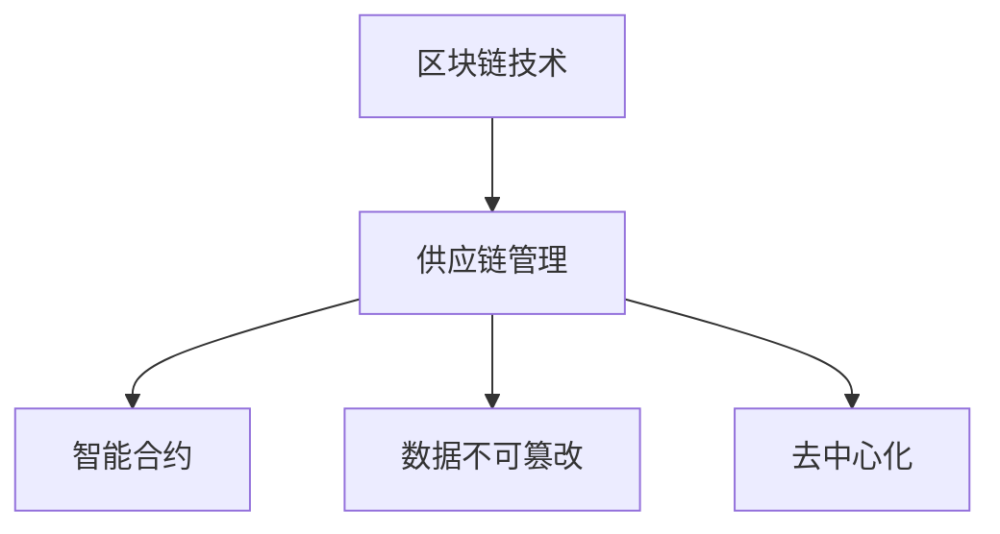

                 

# 区块链技术在供应链管理中的应用

> 关键词：区块链技术,供应链管理,智能合约,溯源,去中心化,数据不可篡改

## 1. 背景介绍

### 1.1 问题由来
在当今全球化的商业环境中，供应链管理（Supply Chain Management, SCM）已经成为一个企业能否保持竞争力，乃至生存的关键因素。随着国际贸易的日益频繁，供应链的复杂性和多样性也在不断增加。然而，传统的供应链管理模式存在诸多问题，包括信息共享不充分、数据孤岛现象严重、供应链透明度不足、欺诈和质量问题频发等。这些问题不仅增加了企业的运营成本，还严重影响了消费者的信任和满意度。

### 1.2 问题核心关键点
传统供应链管理模式的核心问题在于信息孤岛和信任危机。供应链各环节之间的信息传递和共享存在严重滞后，导致信息不对称，增加了协调成本。同时，供应链上的企业之间缺乏足够的信任机制，容易引发欺诈、合同违约等问题。而区块链技术的出现，为解决这些问题提供了一种全新的思路。

区块链技术的核心特性包括去中心化、数据不可篡改、智能合约和分布式账本。这些特性使得区块链能够为供应链管理提供强有力的技术支撑。通过区块链技术，供应链上的各节点可以实现无缝的信息共享和协作，实现自动化、透明化和可追踪的供应链管理。

## 2. 核心概念与联系

### 2.1 核心概念概述

为更好地理解区块链技术在供应链管理中的应用，本节将介绍几个密切相关的核心概念：

- 区块链技术(Blockchain Technology)：一种分布式数据库技术，通过去中心化的方式记录和管理数据，确保数据的不可篡改性和透明性。
- 供应链管理(Supply Chain Management)：对企业采购、生产、分销、配送等供应链过程的管理，旨在通过优化供应链各环节的协同和协作，提升企业运营效率和盈利能力。
- 智能合约(Smart Contract)：一种基于区块链技术的自动化合约，能够自动执行并验证合同条款，减少人为干预和欺诈风险。
- 数据不可篡改（Data Integrity）：区块链中的数据一旦记录，就无法被更改，保证了供应链数据的真实性和可信度。
- 去中心化（Decentralization）：区块链系统中的数据由多个节点共同维护，避免了单点故障和中心化控制的风险，提升了供应链的稳定性和可靠性。

这些核心概念之间的逻辑关系可以通过以下Mermaid流程图来展示：



这个流程图展示了大语言模型的核心概念及其之间的关系：

1. 区块链技术为供应链管理提供底层技术支持。
2. 供应链管理中的智能合约和去中心化特性，通过区块链得以实现。
3. 数据不可篡改特性保障了供应链数据的真实性和可信度。

## 3. 核心算法原理 & 具体操作步骤
### 3.1 算法原理概述

区块链技术在供应链管理中的应用，本质上是通过分布式账本和智能合约技术，实现供应链各环节的信息透明、可信和自动化管理。其核心思想是：将供应链上的所有交易数据记录在区块链上，每个节点都有完整的交易记录，确保数据的安全性和透明度。

供应链上的每个节点都可以通过智能合约自动验证和执行交易，从而实现供应链各环节的自动化和智能管理。智能合约能够在无需第三方中介的情况下，自动执行合同条款，提高供应链的效率和可靠性。

### 3.2 算法步骤详解

区块链技术在供应链管理中的应用主要包括以下几个关键步骤：

**Step 1: 设计智能合约**
- 根据供应链管理的需求，设计合适的智能合约，定义交易的规则和条件。
- 例如，可以使用智能合约管理货物的运输和交付，确保货物到达指定地点后自动支付运费。

**Step 2: 部署智能合约**
- 将设计的智能合约部署到区块链上，使供应链上的所有节点都能够访问和执行。
- 通常使用Solidity、Chaincode等编程语言编写智能合约，并使用以太坊、Hyperledger等区块链平台进行部署。

**Step 3: 实现供应链数据上链**
- 将供应链上的各类数据（如订单、发货、收货、支付等）记录在区块链上，确保数据的安全性和不可篡改性。
- 可以使用分布式账本技术，记录供应链上的所有交易和状态变更。

**Step 4: 实现供应链监控和预警**
- 通过区块链上的智能合约和数据，实时监控供应链的运行状态，并在异常情况发生时自动发出预警。
- 例如，当货物到达指定地点时，智能合约自动触发，将运费支付给物流公司。

**Step 5: 实现供应链追溯和透明化**
- 通过区块链技术，实现供应链的追溯和透明化，使消费者能够实时查看产品的来源和流向。
- 例如，在食品供应链中，消费者可以实时查看食品的生产、运输和销售信息，确保食品的质量和安全。

### 3.3 算法优缺点

区块链技术在供应链管理中的应用，具有以下优点：
1. 提高供应链的透明度和可信度。通过区块链记录供应链各环节的数据，确保数据的真实性和不可篡改性。
2. 提高供应链的效率和可靠性。智能合约自动执行和验证交易，减少了人为干预和欺诈风险。
3. 降低供应链的运营成本。通过自动化和智能管理，减少了人工操作和协调成本。
4. 提高供应链的灵活性和适应性。通过区块链的分布式账本和智能合约技术，供应链能够快速适应市场变化和需求。

同时，该方法也存在一些局限性：
1. 技术复杂度高。区块链技术的部署和维护需要较高的技术门槛，对供应链企业提出了较高的技术要求。
2. 交易速度较慢。区块链的交易速度较慢，影响了供应链的响应速度和效率。
3. 数据存储成本高。区块链上的数据存储和传输需要占用较多的计算和存储资源。
4. 隐私保护问题。区块链上的数据透明化可能会泄露供应链企业的商业机密和客户信息。

尽管存在这些局限性，但区块链技术在供应链管理中的应用仍然具有广泛的应用前景，尤其是在提升供应链的透明度和可信度方面，表现尤为突出。未来相关研究的方向包括降低区块链的部署和维护成本，提高区块链的交易速度和扩展性，以及增强隐私保护措施。

### 3.4 算法应用领域

区块链技术在供应链管理中的应用，覆盖了供应链的各个环节，包括采购、生产、仓储、运输、配送和销售等。以下是几个典型的应用场景：

**1. 采购和供应商管理**
- 通过区块链技术，实现供应商的身份验证和资质审核，确保供应链的可靠性和透明度。
- 例如，某食品企业可以要求所有供应商将产品生产信息记录在区块链上，消费者可以实时查看食品的来源和生产信息，确保食品的质量和安全。

**2. 货物跟踪和溯源**
- 通过区块链技术，实现货物的跟踪和溯源，确保货物的真实性和来源可靠性。
- 例如，某电子产品企业可以将每件产品的生产、组装、运输和销售信息记录在区块链上，消费者可以实时查看产品的来源和流向。

**3. 智能合约和自动化管理**
- 通过区块链上的智能合约，实现供应链的自动化管理，减少人工操作和协调成本。
- 例如，某物流公司可以使用智能合约自动结算运费，确保运费支付的及时性和准确性。

**4. 金融服务和供应链金融**
- 通过区块链技术，实现供应链金融的自动化和智能化，降低金融服务的成本和风险。
- 例如，某企业可以使用区块链技术进行供应链融资，确保融资的透明度和安全性。

## 4. 数学模型和公式 & 详细讲解
### 4.1 数学模型构建

区块链技术在供应链管理中的应用，可以通过以下数学模型进行建模：

设供应链上的节点数量为 $N$，每个节点 $i$ 的货物数量为 $Q_i$，供应链的总货物数量为 $Q$，供应链的总运输成本为 $C$。

定义智能合约的执行条件为 $Condition_i$，满足 $Condition_i$ 的条件下，智能合约自动执行。假设智能合约的执行条件为：当货物到达指定地点时，智能合约自动触发，支付运费。则智能合约的执行概率为：

$$ P_{execute} = \frac{\sum_{i=1}^N Condition_i}{N} $$

在智能合约的执行过程中，供应链的总运输成本 $C$ 可以表示为：

$$ C = \sum_{i=1}^N C_i $$

其中 $C_i$ 为节点 $i$ 的运输成本。

### 4.2 公式推导过程

以下是智能合约执行概率的推导过程：

设节点 $i$ 的货物数量为 $Q_i$，运输成本为 $C_i$，则节点 $i$ 的执行条件可以表示为：

$$ Condition_i = Q_i \geq threshold_i $$

其中 $threshold_i$ 为节点 $i$ 的货物数量阈值。

假设每个节点的货物数量和运输成本相互独立，则智能合约的执行概率为：

$$ P_{execute} = \frac{\sum_{i=1}^N Condition_i}{N} = \frac{\sum_{i=1}^N 1(Q_i \geq threshold_i)}{N} $$

由于每个节点的货物数量 $Q_i$ 相互独立，且满足 $Q_i \sim Bernoulli(p)$，则智能合约的执行概率为：

$$ P_{execute} = \frac{\sum_{i=1}^N \prod_{j=1}^N (1-p) + \sum_{i=1}^N \prod_{j=1}^N (1-p)Q_i}{N} $$

其中 $p$ 为节点 $i$ 的货物数量概率。

### 4.3 案例分析与讲解

以某电子产品企业的供应链为例，分析智能合约在货物跟踪和溯源中的应用。

假设某电子产品企业需要将一批货物从工厂运送到指定的客户仓库。在该供应链中，工厂为起点，客户仓库为终点，经过多个运输节点。

首先，企业在区块链上记录每个运输节点的货物数量和运输成本，使用智能合约自动执行运费支付。智能合约的执行条件为：当货物到达指定地点时，自动触发运费支付。

其次，在货物到达客户仓库后，智能合约自动触发，支付运费。此时，供应链上的每个节点都可以实时查看货物的流向和运输成本，确保货物的真实性和来源可靠性。

最后，客户仓库可以实时查看货物的到达状态和运输成本，确保货物的按时交付和成本控制。通过区块链技术，实现了供应链的自动化和智能化管理，提高了供应链的效率和透明度。

## 5. 项目实践：代码实例和详细解释说明
### 5.1 开发环境搭建

在进行区块链应用开发前，我们需要准备好开发环境。以下是使用Python进行Hyperledger Fabric开发的环境配置流程：

1. 安装Docker：从官网下载并安装Docker，用于创建和管理容器化环境。

2. 创建并激活虚拟环境：
```bash
conda create -n blockchain-env python=3.8 
conda activate blockchain-env
```

3. 安装Hyperledger Fabric：根据系统平台，从官网获取对应的安装命令。例如：
```bash
docker pull hyperledger/fabric
```

4. 安装各类工具包：
```bash
pip install hyperledger Fabric
```

5. 安装Java SDK：
```bash
apt-get update
apt-get install default-jdk
```

完成上述步骤后，即可在`blockchain-env`环境中开始区块链应用开发。

### 5.2 源代码详细实现

下面以供应链管理为例，给出使用Hyperledger Fabric进行智能合约开发的Python代码实现。

首先，定义智能合约的输入和输出：

```python
class SupplyChainContract(SmartContract):
    def __init__(self):
        self goods = {}

    def add_goods(self, node_id, goods_num):
        self.goods[node_id] = goods_num

    def get_goods(self, node_id):
        return self.goods[node_id]
```

然后，定义智能合约的API接口：

```python
@chaincode.function
def add_goods(self, args):
    if len(args) != 2:
        raise ValueError('Invalid arguments')
    node_id = args[0]
    goods_num = args[1]
    if not self.goods.get(node_id):
        self.goods[node_id] = 0
    self.goods[node_id] += goods_num

@chaincode.function
def get_goods(self, args):
    if len(args) != 1:
        raise ValueError('Invalid arguments')
    node_id = args[0]
    return self.goods.get(node_id, 0)
```

最后，启动智能合约的区块链节点：

```python
import hyperledger.fabric
from hyperledger.fabric import chaincode

def main():
    # 创建智能合约实例
    contract = SupplyChainContract()
    # 将智能合约编译为chaincode
    cc_source = chaincode.compile(SupplyChainContract.__name__)
    # 将智能合约打包到blockchain上
    cc_bytes = chaincode.pack(cc_source)
    # 创建blockchain实例
    client = hyperledger.fabric.BCAClient('localhost:7051')
    # 注册智能合约
    client.register_cc(cc_bytes)
    # 查询智能合约的输出
    response = client.get_cc(SupplyChainContract.__name__)
    print(response)

main()
```

以上就是在Hyperledger Fabric上进行智能合约开发的完整代码实现。可以看到，Hyperledger Fabric的智能合约开发流程相对简单，开发者可以根据具体需求定义智能合约的输入和输出，并通过API接口实现相应的逻辑。

### 5.3 代码解读与分析

让我们再详细解读一下关键代码的实现细节：

**SupplyChainContract类**：
- `__init__`方法：初始化智能合约的数据结构，用于存储货物数量。
- `add_goods`方法：向智能合约中添加货物数量。
- `get_goods`方法：从智能合约中获取货物数量。

**add_goods和get_goods方法**：
- `add_goods`方法接收两个参数，节点ID和货物数量。如果节点ID不存在，则初始化货物数量为0。
- `get_goods`方法接收一个参数，节点ID。如果节点ID不存在，则返回默认值0。

**智能合约的区块链节点启动**：
- 首先，创建智能合约的实例。
- 然后，使用`chaincode.compile`方法将智能合约编译为`cc_source`字节码。
- 接着，使用`chaincode.pack`方法将字节码打包为`cc_bytes`。
- 最后，使用`BCAClient`实例注册智能合约，并查询智能合约的输出。

可以看到，Hyperledger Fabric的智能合约开发相对简单，开发者可以根据具体需求定义智能合约的输入和输出，并通过API接口实现相应的逻辑。

当然，工业级的系统实现还需考虑更多因素，如智能合约的权限控制、事件驱动机制、跨链交互等。但核心的智能合约范式基本与此类似。

## 6. 实际应用场景
### 6.1 智能合约管理
智能合约在供应链管理中的应用非常广泛，可以实现自动化的合同执行和管理，提高供应链的效率和透明度。

**智能合约采购管理**：
- 某食品企业可以使用智能合约自动审核供应商的资质和合同条款，确保供应链的可靠性和透明度。
- 例如，某食品企业可以要求所有供应商将产品生产信息记录在区块链上，消费者可以实时查看食品的来源和生产信息，确保食品的质量和安全。

**智能合约货物跟踪和溯源**：
- 通过智能合约，实现货物的跟踪和溯源，确保货物的真实性和来源可靠性。
- 例如，某电子产品企业可以将每件产品的生产、组装、运输和销售信息记录在区块链上，消费者可以实时查看产品的来源和流向。

### 6.2 供应链金融
通过区块链技术，可以实现供应链金融的自动化和智能化，降低金融服务的成本和风险。

**供应链融资**：
- 某企业可以使用区块链技术进行供应链融资，确保融资的透明度和安全性。
- 例如，某企业可以将供应链上的所有交易数据记录在区块链上，确保供应链的透明性和可追溯性，从而降低金融服务的成本和风险。

## 7. 工具和资源推荐
### 7.1 学习资源推荐

为了帮助开发者系统掌握区块链技术在供应链管理中的应用，这里推荐一些优质的学习资源：

1. Hyperledger Fabric官方文档：Hyperledger Fabric的官方文档，提供了完整的智能合约开发和区块链应用实现流程，是入门和进阶必备资料。

2. 《区块链技术在供应链中的应用》系列博文：由区块链技术专家撰写，深入浅出地介绍了区块链技术在供应链管理中的应用，涵盖智能合约、数据不可篡改、去中心化等核心概念。

3. 《区块链在供应链中的应用案例分析》书籍：介绍多个区块链在供应链中的应用案例，详细分析了区块链技术在供应链管理中的具体应用。

4. 《区块链技术与区块链应用开发》课程：通过实战教学，帮助开发者深入理解区块链技术和智能合约开发，快速上手区块链项目。

5. GitHub区块链项目：GitHub上有大量开源的区块链项目，可以借鉴和学习其中的实现思路和技术细节，提升区块链开发能力。

通过对这些资源的学习实践，相信你一定能够快速掌握区块链技术在供应链管理中的应用，并用于解决实际的供应链问题。

### 7.2 开发工具推荐

高效的开发离不开优秀的工具支持。以下是几款用于区块链开发和智能合约开发的常用工具：

1. Hyperledger Fabric：Hyperledger Fabric是Hyperledger推出的基于区块链的分布式账本平台，提供了智能合约开发和管理工具，是区块链开发的主流框架。

2. Ethereum：以太坊是全球领先的区块链平台，支持智能合约的开发和部署，提供了丰富的开发工具和社区支持。

3. Solidity：Solidity是Ethereum上的智能合约编程语言，语法简单，易于上手，是智能合约开发的主流语言。

4. Truffle：Truffle是Ethereum开发的开发框架，提供了智能合约的开发、测试和部署工具，支持多种区块链平台。

5. Web3.js：Web3.js是Ethereum的JavaScript开发框架，提供了丰富的API接口，方便开发者在客户端进行智能合约的交互和调用。

合理利用这些工具，可以显著提升区块链应用和智能合约开发的效率，加快创新迭代的步伐。

### 7.3 相关论文推荐

区块链技术在供应链管理中的应用，已经得到了广泛的研究和应用。以下是几篇奠基性的相关论文，推荐阅读：

1. Blockchain for Supply Chain Visibility: A Systematic Review（区块链在供应链可视性中的应用：系统综述）：对区块链在供应链中的应用进行了全面的综述，分析了区块链技术在供应链可视性、智能合约、去中心化等方面的应用。

2. Smart Contract for Supply Chain Management（智能合约在供应链管理中的应用）：介绍了智能合约在供应链中的应用，分析了智能合约在采购、货物跟踪、溯源等方面的具体应用。

3. Blockchain and IoT Integration for Supply Chain Visibility（区块链和物联网在供应链可视性中的应用）：讨论了区块链和物联网技术的结合，通过区块链记录物联网设备的数据，实现供应链的透明化和可追溯性。

4. Blockchain for Supply Chain Management: A Survey（区块链在供应链管理中的应用综述）：对区块链在供应链中的应用进行了全面的综述，分析了区块链技术在供应链可视性、智能合约、去中心化等方面的应用。

这些论文代表了大语言模型微调技术的发展脉络。通过学习这些前沿成果，可以帮助研究者把握学科前进方向，激发更多的创新灵感。

## 8. 总结：未来发展趋势与挑战
### 8.1 总结

本文对区块链技术在供应链管理中的应用进行了全面系统的介绍。首先阐述了区块链技术在供应链管理中的研究背景和意义，明确了智能合约和数据不可篡改特性对供应链管理的重要价值。其次，从原理到实践，详细讲解了区块链技术在供应链管理中的应用方法，给出了智能合约开发的完整代码实例。同时，本文还广泛探讨了智能合约在供应链金融、智能合约管理等多个领域的应用前景，展示了区块链技术的巨大潜力。

通过本文的系统梳理，可以看到，区块链技术在供应链管理中的应用正在成为供应链领域的重要范式，极大地提升了供应链的透明度和可信度，催生了更多的落地场景。随着区块链技术的不断发展，未来必将在供应链的各个环节得到更广泛的应用，为供应链管理带来革命性的变化。

### 8.2 未来发展趋势

展望未来，区块链技术在供应链管理中的应用将呈现以下几个发展趋势：

1. 区块链与物联网的结合。通过区块链和物联网技术的结合，实现供应链各环节数据的实时记录和传输，提升供应链的透明性和可追溯性。

2. 跨链互操作性的提升。区块链平台之间的互操作性提升，将实现供应链上各平台的数据共享和协同，进一步提升供应链的效率和可靠性。

3. 智能合约的多样化。除了传统的采购、货物跟踪、溯源等应用，未来将涌现更多创新的智能合约应用，如供应链风险管理、供应链金融等。

4. 供应链金融的智能化。通过区块链技术，实现供应链金融的自动化和智能化，降低金融服务的成本和风险。

5. 供应链数据的价值挖掘。通过区块链技术，实现供应链数据的价值挖掘和分析，提供更精准的供应链分析和决策支持。

6. 供应链的自动化和智能化。通过区块链技术，实现供应链各环节的自动化和智能化，提高供应链的运营效率和竞争力。

以上趋势凸显了区块链技术在供应链管理中的广阔前景。这些方向的探索发展，必将进一步提升供应链的效率和透明度，推动供应链管理向更高层次迈进。

### 8.3 面临的挑战

尽管区块链技术在供应链管理中的应用已经取得了瞩目成就，但在迈向更加智能化、普适化应用的过程中，它仍面临着诸多挑战：

1. 技术复杂度高。区块链技术的部署和维护需要较高的技术门槛，对供应链企业提出了较高的技术要求。

2. 交易速度较慢。区块链的交易速度较慢，影响了供应链的响应速度和效率。

3. 数据存储成本高。区块链上的数据存储和传输需要占用较多的计算和存储资源。

4. 隐私保护问题。区块链上的数据透明化可能会泄露供应链企业的商业机密和客户信息。

5. 监管和合规问题。区块链技术的应用需要符合各国家和地区的监管和合规要求，增加了供应链企业的运营成本和风险。

尽管存在这些挑战，但区块链技术在供应链管理中的应用仍然具有广泛的应用前景，尤其是在提升供应链的透明度和可信度方面，表现尤为突出。未来相关研究的方向包括降低区块链的部署和维护成本，提高区块链的交易速度和扩展性，以及增强隐私保护和监管合规措施。

### 8.4 研究展望

面对区块链技术在供应链管理中所面临的挑战，未来的研究需要在以下几个方面寻求新的突破：

1. 探索无监督和半监督区块链技术。摆脱对大规模区块链数据的依赖，利用自监督学习、主动学习等无监督和半监督范式，最大限度利用非结构化数据，实现更加灵活高效的区块链技术。

2. 研究区块链的跨链互操作性。提升区块链平台之间的互操作性，实现供应链上各平台的数据共享和协同，进一步提升供应链的效率和可靠性。

3. 引入更多先验知识。将符号化的先验知识，如知识图谱、逻辑规则等，与区块链技术进行巧妙融合，引导区块链过程学习更准确、合理的供应链数据。

4. 结合因果分析和博弈论工具。将因果分析方法引入区块链技术，识别出区块链决策的关键特征，增强输出解释的因果性和逻辑性。借助博弈论工具刻画人机交互过程，主动探索并规避区块链的脆弱点，提高系统稳定性。

5. 纳入伦理道德约束。在区块链技术的应用目标中引入伦理导向的评估指标，过滤和惩罚有偏见、有害的输出倾向。同时加强人工干预和审核，建立区块链行为的监管机制，确保输出符合人类价值观和伦理道德。

这些研究方向的探索，必将引领区块链技术在供应链管理中的应用走向更高的台阶，为供应链管理带来革命性的变化。面向未来，区块链技术需要与其他人工智能技术进行更深入的融合，如知识表示、因果推理、强化学习等，多路径协同发力，共同推动供应链管理的进步。只有勇于创新、敢于突破，才能不断拓展区块链技术的边界，让智能技术更好地造福供应链管理。

## 9. 附录：常见问题与解答

**Q1：区块链技术在供应链管理中的应用是否适用于所有供应链企业？**

A: 区块链技术在供应链管理中的应用，能够显著提升供应链的透明度和可信度，但其适用范围还需根据企业的具体需求和供应链的特点进行评估。例如，对于数据量较小、业务场景简单的供应链，区块链的应用效果可能不明显。而对于数据量较大、业务场景复杂的供应链，区块链技术将发挥更大的作用。

**Q2：区块链技术的部署和维护成本是否较高？**

A: 区块链技术的部署和维护成本相对较高，需要专业的技术团队进行实施和管理。但是，随着区块链技术的发展，其部署和维护成本也在逐步降低。同时，区块链技术在供应链中的应用，能够大幅提升供应链的效率和透明度，降低运营成本，从而在长期来看，具有较高的投入产出比。

**Q3：区块链技术在供应链中的应用是否存在隐私保护问题？**

A: 区块链技术的透明化特性可能会泄露供应链企业的商业机密和客户信息。为了解决这个问题，可以采用匿名化和数据脱敏等技术，确保供应链数据的安全性。同时，还可以将供应链数据分为公开和私密两种类型，公开数据用于区块链上，私密数据通过其他方式进行管理和共享。

**Q4：区块链技术在供应链中的应用是否能够实现实时数据记录？**

A: 区块链技术可以实现实时数据记录，但需要结合物联网等技术，实现供应链各环节的数据实时传输和记录。此外，还需要优化区块链的交易速度和扩展性，以支持大规模的实时数据记录。

**Q5：区块链技术在供应链中的应用是否需要结合其他技术手段？**

A: 区块链技术在供应链中的应用需要结合其他技术手段，如物联网、人工智能、大数据等，才能充分发挥其潜力。例如，通过区块链和物联网技术的结合，实现供应链各环节数据的实时记录和传输，提升供应链的透明性和可追溯性。

这些研究方向的探索，必将引领区块链技术在供应链管理中的应用走向更高的台阶，为供应链管理带来革命性的变化。面向未来，区块链技术需要与其他人工智能技术进行更深入的融合，如知识表示、因果推理、强化学习等，多路径协同发力，共同推动供应链管理的进步。只有勇于创新、敢于突破，才能不断拓展区块链技术的边界，让智能技术更好地造福供应链管理。

---

作者：禅与计算机程序设计艺术 / Zen and the Art of Computer Programming

