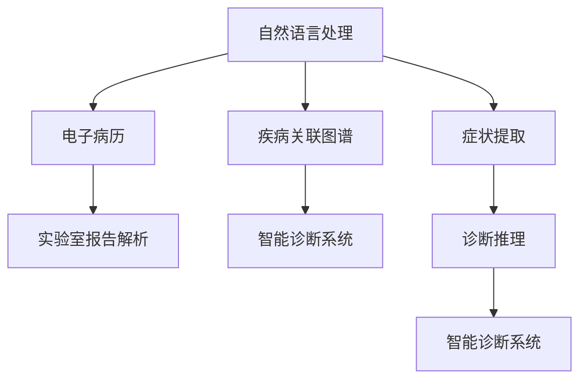

                 

# 医疗诊断中的自然语言处理应用

## 1. 背景介绍

医疗诊断是一个高度复杂且精确的工作，涉及患者的病史、症状、实验室检查、影像学信息等，要求医生具备广泛的医学知识和丰富的临床经验。然而，当前临床医生往往面临高强度的工作压力和大量纸质病历的录入工作，难以充分了解患者的全貌。为了提升医疗诊断的效率和准确性，自然语言处理（Natural Language Processing, NLP）技术的应用成为可能。

### 1.1 问题由来
在传统医疗诊断中，医生主要通过直接面对面的交流、体检和病历记录来获取患者信息。然而，随着患者病历的不断积累，手写病历转录成电子病历，需要耗费大量的时间和人力。同时，患者的病史和症状描述有时难以量化，医生需要根据经验和直觉进行诊断。此外，不同医生的语言习惯和专业术语可能存在差异，病历记录的规范性不足，也影响了医疗信息的传递和利用。

### 1.2 问题核心关键点
医疗诊断中的NLP应用主要包括以下几个关键点：
1. **电子病历处理**：通过自然语言处理技术，将患者的病历文本自动转换为结构化数据，便于医生进行查询和分析。
2. **症状提取**：从患者的症状描述中提取关键信息，帮助医生快速定位疾病。
3. **诊断推理**：利用自然语言处理和知识图谱，进行疾病关联分析，辅助医生进行诊断。
4. **实验室报告解析**：通过文本分析技术，自动解析实验室检查结果，提供辅助诊断支持。

### 1.3 问题研究意义
在医疗领域，NLP技术的应用可以显著提升医疗效率和诊断准确性，减少误诊和漏诊。通过自动化处理大量的医疗数据，可以减轻医生的工作负担，让医生有更多时间关注患者，从而提高医疗服务质量。此外，NLP技术还可以实现医疗知识的积累和共享，促进医学教育和研究的发展。

## 2. 核心概念与联系

### 2.1 核心概念概述

为更好地理解医疗诊断中的NLP应用，本节将介绍几个密切相关的核心概念：

- **自然语言处理 (NLP)**：涉及计算机处理自然语言，包括文本分析、语义理解、信息抽取等技术。
- **电子病历 (EHR)**：指以电子方式记录和存储患者的健康信息，包括病史、体检、诊断和治疗记录等。
- **疾病关联图谱**：利用知识图谱技术，构建疾病、症状、药物之间的关联关系，支持诊断推理。
- **实验室报告解析**：通过文本解析技术，自动提取实验室检查结果，提供辅助诊断支持。
- **智能诊断系统**：结合NLP和知识图谱，构建自动化的诊断系统，辅助医生进行疾病诊断和治疗决策。

这些核心概念之间的逻辑关系可以通过以下Mermaid流程图来展示：



这个流程图展示了一些关键概念及其之间的关系：

1. 自然语言处理将文本转化为结构化数据，为电子病历的处理提供基础。
2. 电子病历记录患者的健康信息，是医疗数据的主要来源。
3. 疾病关联图谱通过知识图谱技术，提供疾病之间的关联关系。
4. 实验室报告解析自动提取检查结果，提供诊断支持。
5. 智能诊断系统综合NLP和图谱技术，实现自动化的诊断和治疗决策。

这些概念共同构成了医疗诊断中NLP技术的应用框架，使得NLP技术在医疗领域得到了广泛的应用。

## 3. 核心算法原理 & 具体操作步骤
### 3.1 算法原理概述

医疗诊断中的NLP应用通常基于机器学习和深度学习技术。具体来说，主要包括以下几个步骤：

1. **电子病历处理**：使用文本预处理和特征提取技术，将病历文本转化为结构化数据，便于后续分析。
2. **症状提取**：利用命名实体识别、情感分析等技术，从患者的症状描述中提取关键信息，辅助诊断。
3. **诊断推理**：通过构建疾病关联图谱，结合知识图谱和深度学习模型，进行疾病关联分析和推理。
4. **实验室报告解析**：使用文本分类和信息抽取技术，自动解析实验室检查结果，提供诊断支持。
5. **智能诊断系统**：构建基于NLP和图谱技术的智能诊断系统，辅助医生进行疾病诊断和治疗决策。

### 3.2 算法步骤详解

以电子病历处理为例，具体介绍核心算法步骤：

**Step 1: 文本预处理**
- 收集患者的电子病历文本，进行分词、去停用词、词性标注等预处理操作，将文本转化为词汇序列。
- 去除噪音和不必要的信息，如日期、地址等，只保留与疾病相关的文本信息。

**Step 2: 特征提取**
- 利用词袋模型、TF-IDF等文本表示方法，将文本转化为特征向量。
- 针对某些特定任务，如症状提取，可以使用预先训练好的BERT模型进行特征提取。

**Step 3: 模型训练**
- 选择合适的机器学习或深度学习模型，如分类器、RNN、LSTM、Transformer等。
- 使用标注数据进行模型训练，优化模型参数，提升模型预测准确率。

**Step 4: 模型评估**
- 在测试集上评估模型性能，如准确率、召回率、F1-score等指标。
- 根据评估结果，调整模型参数，进一步提升模型效果。

**Step 5: 模型应用**
- 将训练好的模型应用到新的电子病历文本中，进行症状提取、诊断推理、实验室报告解析等任务。
- 输出结构化数据或诊断结果，辅助医生进行决策。

### 3.3 算法优缺点

医疗诊断中的NLP应用具有以下优点：
1. 提高诊断效率：自动化处理大量医疗数据，减少医生的工作负担。
2. 提升诊断准确性：通过文本分析和信息抽取，帮助医生快速定位疾病。
3. 支持多领域应用：适用于不同领域和类型的医疗数据，如影像学、实验室报告等。
4. 提供辅助决策支持：结合知识图谱和智能诊断系统，提供决策支持。

同时，这些算法也存在一些局限性：
1. 依赖高质量数据：NLP模型需要大量的标注数据进行训练，而医疗数据的质量和规范性问题，可能导致模型性能下降。
2. 模型解释性不足：深度学习模型的决策过程难以解释，医生难以理解和信任模型的输出。
3. 跨领域适应性差：不同医疗领域的知识结构和表达方式差异较大，NLP模型难以同时处理多种领域的医疗数据。
4. 隐私和安全问题：医疗数据涉及患者隐私，需要严格的隐私保护和数据安全措施。

尽管存在这些局限性，NLP在医疗诊断中的应用仍具有广阔的前景，需要不断优化算法和技术，提升模型的可靠性和可解释性。

### 3.4 算法应用领域

NLP技术在医疗诊断中的应用广泛，涵盖多个领域，具体包括：

- **电子病历处理**：自动提取电子病历中的关键信息，如病史、症状、诊断等，方便医生查询和分析。
- **症状提取**：自动从症状描述中提取关键症状，帮助医生快速定位疾病。
- **诊断推理**：利用知识图谱进行疾病关联分析，辅助医生进行诊断。
- **实验室报告解析**：自动解析实验室检查结果，提供诊断支持。
- **智能诊断系统**：构建基于NLP和图谱技术的智能诊断系统，辅助医生进行诊断和治疗决策。

除了上述这些经典应用外，NLP技术还被创新性地应用于医疗影像分析、医学文本生成、健康咨询等，为医疗诊断带来了新的突破。随着NLP技术的发展，其在医疗诊断中的应用领域将不断扩展，为医疗服务提供更全面的支持。

## 4. 数学模型和公式 & 详细讲解 & 举例说明
### 4.1 数学模型构建

以症状提取为例，使用文本分类模型进行症状提取。设电子病历文本为 $D = \{d_i\}_{i=1}^N$，其中 $d_i$ 为第 $i$ 份电子病历的文本。

定义模型 $M_{\theta}$，其中 $\theta$ 为模型参数，输入为病历文本 $d_i$，输出为分类标签 $y_i \in \{1, 0\}$，表示该病历是否包含某个特定症状。

则目标为最大化模型在训练集上的对数似然函数：

$$
\max_{\theta} \sum_{i=1}^N \log P(y_i | d_i; \theta)
$$

其中 $P(y_i | d_i; \theta)$ 为条件概率，表示在给定文本 $d_i$ 的条件下，症状 $y_i$ 出现的概率。

### 4.2 公式推导过程

使用BERT模型进行症状提取的公式推导如下：

**Step 1: 文本嵌入**
- 将病历文本 $d_i$ 输入BERT模型，得到词向量表示 $V = \{v_j\}_{j=1}^{n_i}$，其中 $n_i$ 为文本 $d_i$ 的词数。

**Step 2: 特征提取**
- 使用卷积神经网络(CNN)或循环神经网络(RNN)，对词向量进行特征提取，得到特征向量 $F = \{f_j\}_{j=1}^{n_i}$。

**Step 3: 分类器训练**
- 使用SVM或逻辑回归等分类器，对特征向量 $F$ 进行分类，得到症状标签 $y_i$。
- 定义损失函数 $L$，如交叉熵损失，对模型进行训练，最小化损失函数。

**Step 4: 模型评估**
- 在测试集上评估模型性能，如准确率、召回率、F1-score等指标。
- 调整模型参数，优化模型效果。

### 4.3 案例分析与讲解

以疾病关联图谱为例，构建基于知识图谱的疾病关联网络。设疾病集合为 $D$，症状集合为 $S$，药物集合为 $M$，疾病-症状关联为 $E_{ds}$，症状-药物关联为 $E_{sm}$。

定义疾病关联网络 $G = (D, S, M, E_{ds}, E_{sm})$，其中节点表示疾病、症状或药物，边表示关联关系。

使用图卷积网络(GCN)对疾病关联网络进行建模，得到疾病关联矩阵 $A$，其中 $a_{i,j}$ 表示疾病 $i$ 和疾病 $j$ 之间的关联强度。

然后，使用矩阵乘法 $H^{(t+1)} = A \times H^{(t)}$ 进行多轮迭代，更新节点表示 $H$，最终得到疾病关联特征表示 $H_D$。

最后，使用多分类器模型对疾病关联特征进行分类，得到疾病诊断结果 $y$。

## 5. 项目实践：代码实例和详细解释说明
### 5.1 开发环境搭建

在进行NLP应用开发前，我们需要准备好开发环境。以下是使用Python进行TensorFlow开发的环境配置流程：

1. 安装Anaconda：从官网下载并安装Anaconda，用于创建独立的Python环境。

2. 创建并激活虚拟环境：
```bash
conda create -n nlp-env python=3.8 
conda activate nlp-env
```

3. 安装TensorFlow：根据CUDA版本，从官网获取对应的安装命令。例如：
```bash
conda install tensorflow -c pytorch -c conda-forge
```

4. 安装TensorFlow Hub：用于导入预训练的BERT模型。
```bash
pip install tensorflow-hub
```

5. 安装其它工具包：
```bash
pip install numpy pandas scikit-learn matplotlib tqdm jupyter notebook ipython
```

完成上述步骤后，即可在`nlp-env`环境中开始NLP应用开发。

### 5.2 源代码详细实现

下面我们以电子病历处理为例，给出使用TensorFlow对BERT模型进行特征提取的PyTorch代码实现。

首先，定义电子病历处理的函数：

```python
import tensorflow_hub as hub
import tensorflow as tf

def extract_features(texts):
    module_url = "https://tfhub.dev/google/bert_en_uncased_L-12_H-768_A-12/1"
    embed = hub.KerasLayer(module_url, trainable=True)
    embeddings = embed(texts)
    return embeddings
```

然后，加载预训练的BERT模型，进行特征提取：

```python
texts = ["病人病历文本1", "病人病历文本2", ...]
embeddings = extract_features(texts)
```

最后，将提取的特征用于后续的文本分类任务：

```python
from tensorflow.keras.layers import Dense, Flatten
from tensorflow.keras.models import Sequential

model = Sequential([
    Flatten(input_shape=(768,)),
    Dense(128, activation='relu'),
    Dense(1, activation='sigmoid')
])

model.compile(optimizer='adam', loss='binary_crossentropy', metrics=['accuracy'])

model.fit(x=embeddings, y=labels, epochs=10, batch_size=32)
```

以上就是使用TensorFlow对BERT模型进行电子病历处理的完整代码实现。可以看到，得益于TensorFlow Hub的强大封装，我们可以用相对简洁的代码完成BERT模型的加载和特征提取。

### 5.3 代码解读与分析

让我们再详细解读一下关键代码的实现细节：

**extract_features函数**：
- 加载预训练的BERT模型，使用KerasLayer进行特征提取。
- 返回提取的词向量表示。

**模型定义与训练**：
- 使用Flatten层将词向量转换为张量，便于输入全连接层。
- 定义多层全连接层，进行特征提取和分类。
- 使用Binary Cross-Entropy损失函数进行训练，最小化损失函数。

**模型评估与测试**：
- 在测试集上评估模型性能，如准确率、召回率、F1-score等指标。
- 根据评估结果，调整模型参数，优化模型效果。

## 6. 实际应用场景
### 6.1 智能病历记录系统

智能病历记录系统可以显著提升医疗诊断的效率和准确性。传统的手写病历记录方式耗费大量时间，且容易出现信息遗漏和错误。使用智能病历记录系统，可以自动记录患者的基本信息、病史、体检结果等，方便医生查询和分析。

在技术实现上，可以收集患者的病历文本，使用NLP技术进行自动分词和词性标注，提取出关键信息。然后，将提取出的信息输入到知识图谱中，构建电子病历。医生可以通过查询系统，快速获取患者的相关信息，提高诊断效率。

### 6.2 智能诊断辅助系统

智能诊断辅助系统利用NLP技术，提供自动化的诊断支持。通过分析患者的症状描述，智能诊断系统可以提供初步的诊断结果，并推荐进一步的检查和治疗方案。

在技术实现上，可以收集患者的症状描述，使用NLP技术进行症状提取和情感分析，得到患者的症状和情感状态。然后，利用知识图谱进行疾病关联分析，得到初步的诊断结果。最后，系统推荐进一步的检查和治疗方案，辅助医生进行诊断。

### 6.3 实验室报告自动解析系统

实验室报告自动解析系统可以自动解析实验室检查结果，提供诊断支持。传统的手工解析方式耗费大量时间，且容易出现错误。使用自动化解析系统，可以显著提升诊断效率和准确性。

在技术实现上，可以收集实验室检查报告，使用NLP技术进行文本分类和信息抽取，得到实验室检查结果。然后，将结果输入到知识图谱中，进行疾病关联分析，得到初步的诊断结果。最后，系统推荐进一步的检查和治疗方案，辅助医生进行诊断。

### 6.4 未来应用展望

随着NLP技术的发展，未来在医疗诊断中的应用将更加广泛和深入。以下是一些未来应用展望：

1. **个性化医疗**：利用NLP技术，自动解析患者的医疗记录和基因信息，提供个性化的治疗方案，提升治疗效果。
2. **远程医疗**：利用NLP技术，构建远程医疗平台，提供自动化的健康咨询和诊断支持，打破地域和时间的限制。
3. **医疗影像分析**：利用NLP技术，结合计算机视觉技术，自动解析医疗影像，提供辅助诊断支持。
4. **健康管理**：利用NLP技术，收集和分析患者的健康数据，提供健康管理建议，促进疾病预防和早期干预。
5. **医学文本生成**：利用NLP技术，自动生成医学报告和诊断记录，提升医疗信息的管理和利用效率。

## 7. 工具和资源推荐
### 7.1 学习资源推荐

为了帮助开发者系统掌握医疗诊断中的NLP技术，这里推荐一些优质的学习资源：

1. **《自然语言处理与深度学习》**：由斯坦福大学开设的NLP课程，介绍了NLP的基础知识和深度学习技术，涵盖了文本分类、信息抽取、情感分析等多个方向。

2. **《自然语言处理实战》**：使用TensorFlow实现NLP任务的书，提供了丰富的代码实例，适合动手实践。

3. **《深度学习在医疗中的应用》**：介绍了深度学习在医疗领域的应用，包括电子病历处理、医学影像分析等多个方向。

4. **TensorFlow Hub官方文档**：提供了丰富的预训练模型和样例代码，方便开发者快速上手。

5. **Kaggle医疗NLP竞赛**：Kaggle上有很多医疗NLP的竞赛和项目，可以学习和实践最新的NLP技术。

通过对这些资源的学习实践，相信你一定能够快速掌握医疗诊断中的NLP技术的精髓，并用于解决实际的医疗问题。

### 7.2 开发工具推荐

高效的开发离不开优秀的工具支持。以下是几款用于NLP应用开发的常用工具：

1. **TensorFlow**：基于Python的开源深度学习框架，生产部署方便，适合大规模工程应用。

2. **TensorFlow Hub**：提供了丰富的预训练模型，方便开发者快速接入。

3. **Keras**：基于TensorFlow的高层次API，适合快速原型设计和实验。

4. **TensorBoard**：TensorFlow配套的可视化工具，实时监测模型训练状态，并提供丰富的图表呈现方式。

5. **NLTK**：Python的自然语言处理库，提供了丰富的文本处理工具。

6. **spaCy**：Python的自然语言处理库，适合处理大规模文本数据。

合理利用这些工具，可以显著提升NLP应用的开发效率，加快创新迭代的步伐。

### 7.3 相关论文推荐

NLP在医疗诊断中的应用源于学界的持续研究。以下是几篇奠基性的相关论文，推荐阅读：

1. **"Biomedical NLP" by Ong et al.**：介绍了自然语言处理在生物医学领域的应用，涵盖了文本分类、信息抽取、情感分析等多个方向。

2. **"Natural Language Processing for Clinical Documentation" by Rakitin et al.**：介绍了NLP在电子病历记录中的应用，涵盖了文本分类、命名实体识别、实体关系抽取等多个方向。

3. **"Semantic Similarity and Validation of Laboratory Results for Automated Pathology Diagnosis" by Hwang et al.**：介绍了NLP在实验室报告解析中的应用，涵盖了文本分类、实体关系抽取、情感分析等多个方向。

4. **"Deep Learning for Clinical Decision Support: Opportunities and Challenges" by Hunt et al.**：介绍了深度学习在临床决策支持中的应用，涵盖了疾病关联分析、医学文本生成、诊断推理等多个方向。

这些论文代表了大语言模型微调技术的发展脉络。通过学习这些前沿成果，可以帮助研究者把握学科前进方向，激发更多的创新灵感。

## 8. 总结：未来发展趋势与挑战
### 8.1 研究成果总结

本文对医疗诊断中的NLP应用进行了全面系统的介绍。首先阐述了NLP在医疗诊断中的研究背景和意义，明确了NLP技术在提升医疗诊断效率和准确性方面的独特价值。其次，从原理到实践，详细讲解了电子病历处理、症状提取、诊断推理、实验室报告解析等核心算法步骤，给出了NLP任务开发的完整代码实例。同时，本文还广泛探讨了NLP技术在智能病历记录、智能诊断辅助、实验室报告解析等多个医疗领域的应用前景，展示了NLP技术的巨大潜力。

通过本文的系统梳理，可以看到，NLP技术在医疗诊断中的应用前景广阔，可以显著提升医疗服务的效率和准确性。然而，NLP在医疗领域的应用也面临着诸多挑战，如数据质量、模型解释性、隐私安全等问题，需要在实践中不断优化和改进。

### 8.2 未来发展趋势

展望未来，NLP在医疗诊断中的应用将呈现以下几个发展趋势：

1. **多模态融合**：结合图像、视频、声音等多模态数据，提升医疗诊断的全面性和准确性。
2. **个性化医疗**：利用NLP技术，自动解析患者的基因信息和医疗记录，提供个性化的治疗方案。
3. **远程医疗**：利用NLP技术，构建远程医疗平台，提供自动化的健康咨询和诊断支持。
4. **医学文本生成**：利用NLP技术，自动生成医学报告和诊断记录，提升医疗信息的管理和利用效率。
5. **医疗影像分析**：利用NLP技术，结合计算机视觉技术，自动解析医疗影像，提供辅助诊断支持。
6. **健康管理**：利用NLP技术，收集和分析患者的健康数据，提供健康管理建议，促进疾病预防和早期干预。

### 8.3 面临的挑战

尽管NLP在医疗诊断中的应用前景广阔，但在实际应用中仍面临一些挑战：

1. **数据质量问题**：医疗数据的质量和规范性问题，可能导致模型性能下降。需要提高数据的标注质量和多样性，确保数据的质量和一致性。
2. **模型解释性不足**：深度学习模型的决策过程难以解释，医生难以理解和信任模型的输出。需要研究可解释性和可解释性技术，提升模型的透明度和可信度。
3. **隐私和安全问题**：医疗数据涉及患者隐私，需要严格的隐私保护和数据安全措施。需要研究数据保护技术，确保数据的安全性和隐私性。
4. **跨领域适应性差**：不同医疗领域的知识结构和表达方式差异较大，NLP模型难以同时处理多种领域的医疗数据。需要研究多领域适应性技术，提升模型的泛化能力和适应性。

尽管面临这些挑战，NLP在医疗诊断中的应用仍具有广阔的前景，需要不断优化算法和技术，提升模型的可靠性和可解释性。

### 8.4 研究展望

未来的研究需要在以下几个方面寻求新的突破：

1. **多领域融合**：结合多个领域的知识，构建通用的医疗知识图谱，提升模型的泛化能力和适应性。
2. **模型优化**：研究更加高效和可解释的NLP模型，提高模型的性能和可靠性。
3. **数据增强**：利用数据增强技术，提高模型的泛化能力和鲁棒性。
4. **隐私保护**：研究数据隐私保护技术，确保数据的安全性和隐私性。
5. **跨领域适应性**：研究多领域适应性技术，提升模型在不同领域的性能和泛化能力。

这些研究方向的探索，必将引领NLP技术在医疗诊断中的应用迈向更高的台阶，为医疗服务提供更全面的支持。面向未来，NLP技术还需要与其他人工智能技术进行更深入的融合，如知识表示、因果推理、强化学习等，多路径协同发力，共同推动自然语言理解和智能交互系统的进步。只有勇于创新、敢于突破，才能不断拓展NLP技术的边界，让智能技术更好地造福人类社会。

## 9. 附录：常见问题与解答

**Q1：NLP在医疗诊断中的应用有哪些？**

A: NLP在医疗诊断中的应用主要包括以下几个方面：

1. **电子病历处理**：自动提取电子病历中的关键信息，如病史、症状、诊断等，方便医生查询和分析。
2. **症状提取**：自动从症状描述中提取关键症状，帮助医生快速定位疾病。
3. **诊断推理**：利用知识图谱进行疾病关联分析，辅助医生进行诊断。
4. **实验室报告解析**：自动解析实验室检查结果，提供诊断支持。
5. **智能诊断系统**：构建基于NLP和图谱技术的智能诊断系统，辅助医生进行诊断和治疗决策。

**Q2：NLP在医疗诊断中需要注意哪些问题？**

A: NLP在医疗诊断中的应用需要注意以下几个问题：

1. **数据质量问题**：医疗数据的质量和规范性问题，可能导致模型性能下降。需要提高数据的标注质量和多样性，确保数据的质量和一致性。
2. **模型解释性不足**：深度学习模型的决策过程难以解释，医生难以理解和信任模型的输出。需要研究可解释性和可解释性技术，提升模型的透明度和可信度。
3. **隐私和安全问题**：医疗数据涉及患者隐私，需要严格的隐私保护和数据安全措施。需要研究数据保护技术，确保数据的安全性和隐私性。
4. **跨领域适应性差**：不同医疗领域的知识结构和表达方式差异较大，NLP模型难以同时处理多种领域的医疗数据。需要研究多领域适应性技术，提升模型的泛化能力和适应性。

**Q3：NLP在医疗诊断中的应用前景如何？**

A: NLP在医疗诊断中的应用前景广阔，可以显著提升医疗服务的效率和准确性。未来，随着技术的不断进步，NLP技术在医疗诊断中的应用将更加广泛和深入。以下是一些未来应用展望：

1. **个性化医疗**：利用NLP技术，自动解析患者的基因信息和医疗记录，提供个性化的治疗方案。
2. **远程医疗**：利用NLP技术，构建远程医疗平台，提供自动化的健康咨询和诊断支持。
3. **医学文本生成**：利用NLP技术，自动生成医学报告和诊断记录，提升医疗信息的管理和利用效率。
4. **医疗影像分析**：利用NLP技术，结合计算机视觉技术，自动解析医疗影像，提供辅助诊断支持。
5. **健康管理**：利用NLP技术，收集和分析患者的健康数据，提供健康管理建议，促进疾病预防和早期干预。

**Q4：如何使用NLP技术进行疾病关联图谱构建？**

A: 使用NLP技术进行疾病关联图谱构建的步骤如下：

1. **数据收集**：收集医疗领域的各类数据，如疾病、症状、药物等。
2. **数据清洗**：去除噪音和不必要的信息，只保留与疾病相关的文本信息。
3. **特征提取**：使用BERT等预训练模型进行特征提取，得到疾病、症状、药物的向量表示。
4. **知识图谱构建**：构建基于向量表示的知识图谱，利用GCN等图卷积网络进行疾病关联分析，得到疾病关联特征表示。
5. **模型训练**：使用多分类器模型对疾病关联特征进行分类，得到疾病诊断结果。

以上是使用NLP技术进行疾病关联图谱构建的完整步骤，关键在于选择合适的预训练模型和优化算法，确保数据的质量和一致性，提升模型的泛化能力和适应性。

