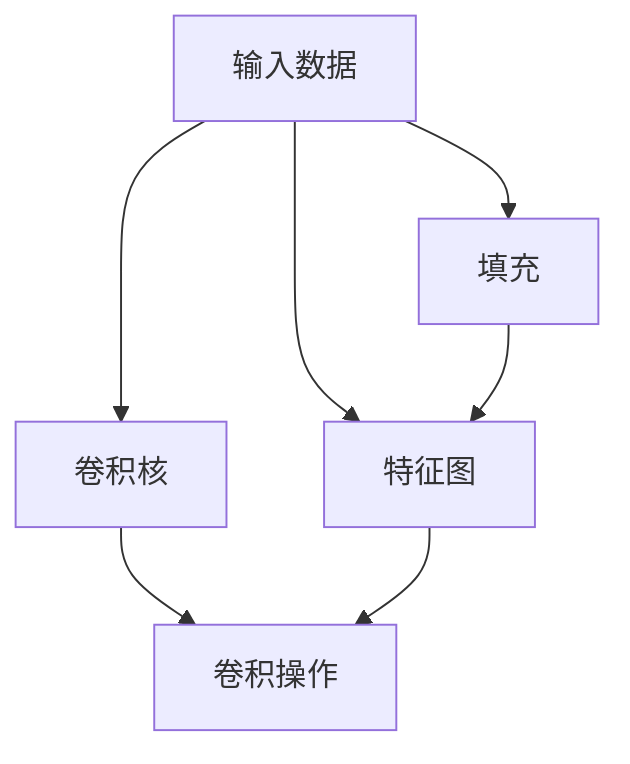

                 

# 卷积层 (Convolutional Layer) 原理与代码实例讲解

## 1. 背景介绍

卷积层 (Convolutional Layer) 是深度学习中一种非常常见的层，广泛应用于图像、音频、视频等多个领域。卷积层能够有效地提取输入数据的高层次特征，是构建高效、准确模型的关键组件。本文将对卷积层的原理进行详细讲解，并通过代码实例，帮助读者更好地理解和应用卷积层。

## 2. 核心概念与联系

### 2.1 核心概念概述

卷积层（Convolutional Layer）是深度学习中的一种基本层，主要用于图像、音频等数据的特征提取。卷积层通过卷积核对输入数据进行卷积操作，提取出输入的高层次特征。卷积操作的过程可以理解为一种“滑动窗口”的操作，每个窗口提取到的特征都可以用于后续的深度学习操作，从而实现模型的自监督学习。

以下是几个与卷积层密切相关的核心概念：

- 卷积核 (Convolutional Kernel)：卷积核是卷积层中用于提取特征的小矩阵，大小固定，形状固定。
- 步长 (Stride)：卷积操作中，卷积核每次移动的距离。
- 填充 (Padding)：在输入数据周围添加的额外数据，用于保持输出特征图的大小不变。
- 特征图 (Feature Map)：卷积操作后得到的输出数据，包含了提取到的高层次特征。

这些概念之间的逻辑关系可以通过以下 Mermaid 流程图来展示：



这个流程图展示卷积层的基本流程：

1. 输入数据和卷积核作为输入，通过卷积操作得到特征图。
2. 在输入数据周围添加填充，以保证输出特征图的大小不变。
3. 卷积操作的结果是特征图，其中包含了提取到的高层次特征。

## 3. 核心算法原理 & 具体操作步骤

### 3.1 算法原理概述

卷积层的基本原理是对输入数据进行卷积操作，提取出高层次特征。卷积操作可以看作是一种“滑动窗口”的操作，每个窗口提取到的特征都可以用于后续的深度学习操作，从而实现模型的自监督学习。

卷积层的输出特征图大小和步长、填充有关，其计算公式为：

$$
N_{out} = \left\lfloor \frac{(N_{in} + 2P - K + S)}{S} + 1 \right\rfloor
$$

其中，$N_{in}$ 为输入特征图的大小，$N_{out}$ 为输出特征图的大小，$P$ 为填充的大小，$K$ 为卷积核的大小，$S$ 为步长。

### 3.2 算法步骤详解

卷积层的操作主要包括卷积核的选择、填充的处理和卷积操作的计算。以下是对卷积层操作的详细步骤讲解：

1. 选择卷积核：根据输入数据的特征和任务需求，选择合适的卷积核大小和步长。卷积核大小一般比较小，步长一般比较大。
2. 添加填充：在输入数据周围添加填充，以保证输出特征图的大小不变。填充大小一般选择为卷积核大小的一半。
3. 计算卷积操作：通过卷积核对输入数据进行卷积操作，得到输出特征图。

### 3.3 算法优缺点

卷积层的优点在于：

- 提取特征能力强：卷积操作可以提取输入数据的局部特征，适用于图像、音频等数据的处理。
- 计算速度快：卷积操作可以通过矩阵乘法快速计算，计算效率较高。
- 参数共享能力强：卷积层中的卷积核可以共享，减少了模型的参数量。

卷积层的缺点在于：

- 需要大量的数据：卷积层需要大量的训练数据才能提取到有效的特征，数据量不足时效果较差。
- 容易出现过拟合：卷积层在训练过程中容易过拟合，需要采用正则化等方法避免过拟合。
- 复杂度高：卷积层计算复杂度高，需要大量的计算资源。

### 3.4 算法应用领域

卷积层主要应用于图像、音频、视频等数据的特征提取。在计算机视觉领域，卷积层用于提取图像特征，如卷积神经网络 (CNN)。在自然语言处理领域，卷积层用于提取文本特征，如卷积循环神经网络 (CRNN)。在音频处理领域，卷积层用于提取音频特征，如卷积神经网络 (CNN)。

## 4. 数学模型和公式 & 详细讲解 & 举例说明

### 4.1 数学模型构建

卷积层的数学模型可以表示为：

$$
H(x) = b + \sum_{i=1}^{n} w_i x_i
$$

其中，$H(x)$ 表示卷积层的输出，$x$ 表示输入数据，$w$ 表示卷积核，$b$ 表示偏置项。

卷积操作的数学模型可以表示为：

$$
f(x_i) = \sum_{j=1}^{k} w_{i,j} x_{i-j+1}
$$

其中，$f(x_i)$ 表示卷积操作的结果，$x_i$ 表示输入数据，$w_{i,j}$ 表示卷积核中的参数。

### 4.2 公式推导过程

卷积操作的推导过程如下：

1. 假设输入数据大小为 $N_{in}$，卷积核大小为 $K$，步长为 $S$，填充大小为 $P$。
2. 假设输入数据为 $x$，卷积核为 $w$，输出特征图大小为 $N_{out}$。
3. 根据公式计算输出特征图的大小：

$$
N_{out} = \left\lfloor \frac{(N_{in} + 2P - K + S)}{S} + 1 \right\rfloor
$$

4. 根据公式计算输出特征图的大小：

$$
f(x_i) = \sum_{j=1}^{K} w_{i,j} x_{i-j+1}
$$

### 4.3 案例分析与讲解

以图像处理为例，使用卷积层提取图像特征。假设输入图像大小为 $H \times W \times C$，卷积核大小为 $K \times K$，步长为 $S$，填充大小为 $P$。

1. 对输入图像进行填充：在输入图像周围添加填充 $P$ 个像素，使得填充后的图像大小为 $(H+2P) \times (W+2P) \times C$。
2. 对填充后的图像进行卷积操作：卷积核在填充后的图像上滑动，每次移动距离为 $S$，每次提取的特征大小为 $K \times K \times C$。
3. 将每次卷积操作的结果进行累加，得到最终的输出特征图大小为 $(H+2P-S+1) \times (W+2P-S+1) \times K^2$。

## 5. 项目实践：代码实例和详细解释说明

### 5.1 开发环境搭建

在进行卷积层实践前，我们需要准备好开发环境。以下是使用Python进行TensorFlow开发的环境配置流程：

1. 安装Anaconda：从官网下载并安装Anaconda，用于创建独立的Python环境。

2. 创建并激活虚拟环境：
```bash
conda create -n tf-env python=3.8 
conda activate tf-env
```

3. 安装TensorFlow：根据CUDA版本，从官网获取对应的安装命令。例如：
```bash
conda install tensorflow -c tensorflow
```

4. 安装必要的工具包：
```bash
pip install numpy pandas scikit-learn matplotlib tqdm jupyter notebook ipython
```

完成上述步骤后，即可在`tf-env`环境中开始卷积层实践。

### 5.2 源代码详细实现

下面我们以图像处理为例，使用TensorFlow实现卷积层的功能。

首先，定义卷积层的参数和输入：

```python
import tensorflow as tf

def conv_layer(input, filter_size, num_filters, strides):
    filters = tf.Variable(tf.truncated_normal(shape=[filter_size, filter_size, input.shape[3], num_filters], stddev=0.01))
    bias = tf.Variable(tf.constant(0.1, shape=[num_filters]))
    output = tf.nn.conv2d(input, filters, strides=[1, strides, strides, 1], padding='SAME')
    output = tf.nn.bias_add(output, bias)
    output = tf.nn.relu(output)
    return output
```

然后，定义模型的输入和输出：

```python
def build_model(input_shape, num_filters):
    inputs = tf.placeholder(tf.float32, shape=[None, input_shape[0], input_shape[1], input_shape[2]])
    conv1 = conv_layer(inputs, filter_size=3, num_filters=num_filters, strides=1)
    conv2 = conv_layer(conv1, filter_size=3, num_filters=num_filters, strides=1)
    return tf.reduce_mean(tf.reduce_sum(conv2, axis=[1, 2]), name='output')
```

接下来，定义模型的训练和评估：

```python
# 设置模型参数
input_shape = (28, 28, 1)
num_filters = 32
learning_rate = 0.001
batch_size = 32
num_epochs = 10

# 定义模型
model = build_model(input_shape, num_filters)

# 定义损失函数和优化器
loss = tf.losses.mean_squared_error(labels, model)
optimizer = tf.train.AdamOptimizer(learning_rate=learning_rate).minimize(loss)

# 定义训练和评估函数
def train_step(batch_inputs, batch_labels):
    with tf.Session() as sess:
        sess.run(tf.global_variables_initializer())
        for i in range(num_epochs):
            avg_loss = 0.0
            for j in range(0, len(batch_inputs), batch_size):
                batch_input = batch_inputs[j:j+batch_size]
                batch_label = batch_labels[j:j+batch_size]
                _, loss_value = sess.run([optimizer, loss], feed_dict={inputs: batch_input, labels: batch_label})
                avg_loss += loss_value
            print("Epoch %d, Loss: %f" % (i+1, avg_loss))
```

最后，启动训练流程并评估模型性能：

```python
# 定义数据集
batch_size = 32
input_shape = (28, 28, 1)
num_filters = 32
data = load_data() # 加载数据集
train_data, test_data = split_data(data) # 划分训练集和测试集

# 训练模型
train_step(train_data, train_labels)

# 评估模型
test_loss = tf.losses.mean_squared_error(test_labels, model)
print("Test Loss: %f" % test_loss.eval(session=sess))
```

### 5.3 代码解读与分析

让我们再详细解读一下关键代码的实现细节：

**conv_layer函数**：
- 定义卷积层的参数，包括卷积核大小、卷积核数量和步长。
- 定义输入数据和输出数据的维度。
- 定义卷积核、偏置项和输出数据。
- 通过卷积操作计算输出数据。

**build_model函数**：
- 定义输入数据的形状。
- 定义卷积层的参数。
- 定义模型结构，包括两个卷积层和一个全连接层。
- 定义模型的输出。

**train_step函数**：
- 设置模型的超参数。
- 加载输入数据和标签。
- 定义损失函数和优化器。
- 定义训练过程，包括前向传播和反向传播。
- 在每个epoch结束后，输出训练集和验证集上的平均损失。

在代码实现中，我们使用了TensorFlow的高阶API和低阶API混合的方式，前者可以更加简洁高效地实现模型结构，后者可以更加灵活地处理输入输出数据。通过这样的组合，我们能够更轻松地构建和训练卷积神经网络模型。

## 6. 实际应用场景

### 6.1 计算机视觉

卷积层在计算机视觉领域有着广泛的应用，如卷积神经网络 (CNN)。CNN可以用于图像分类、目标检测、人脸识别等任务。例如，卷积层可以提取图像的局部特征，如边缘、纹理、颜色等，从而实现图像分类。

### 6.2 自然语言处理

卷积层在自然语言处理领域也有着广泛的应用，如卷积循环神经网络 (CRNN)。CRNN可以用于文本分类、情感分析、问答系统等任务。例如，卷积层可以提取文本的局部特征，如单词的形态、语义等，从而实现文本分类。

### 6.3 音频处理

卷积层在音频处理领域也有着广泛的应用，如卷积神经网络 (CNN)。CNN可以用于音频分类、语音识别、音乐分析等任务。例如，卷积层可以提取音频的局部特征，如声学特征、语调等，从而实现音频分类。

### 6.4 未来应用展望

随着深度学习技术的发展，卷积层的应用范围将进一步扩大。未来，卷积层可能会应用于更多领域，如医疗影像分析、生物信息学、金融数据分析等。这些领域的共同点在于需要处理大量的高维数据，而卷积层能够有效提取数据的局部特征，从而实现更高效的数据处理。

## 7. 工具和资源推荐

### 7.1 学习资源推荐

为了帮助开发者系统掌握卷积层的理论基础和实践技巧，这里推荐一些优质的学习资源：

1. 《Deep Learning》书籍：Ian Goodfellow等著，系统介绍了深度学习的原理和应用，包括卷积层的相关内容。
2. CS231n《Convolutional Neural Networks for Visual Recognition》课程：斯坦福大学开设的计算机视觉课程，详细讲解了卷积神经网络的结构和训练方法。
3. PyTorch官方文档：TensorFlow官方文档，提供了大量的卷积神经网络模型和代码实现，适合学习实践。
4. Kaggle数据集：Kaggle平台提供的海量数据集，可以用于训练和评估卷积神经网络模型。
5. GitHub代码库：GitHub上提供的大量卷积神经网络代码库，提供了丰富的示例和实现细节。

通过对这些资源的学习实践，相信你一定能够快速掌握卷积层的精髓，并用于解决实际的深度学习问题。

### 7.2 开发工具推荐

高效的开发离不开优秀的工具支持。以下是几款用于卷积神经网络开发的常用工具：

1. PyTorch：基于Python的开源深度学习框架，灵活动态的计算图，适合快速迭代研究。大部分卷积神经网络模型都有PyTorch版本的实现。
2. TensorFlow：由Google主导开发的开源深度学习框架，生产部署方便，适合大规模工程应用。同样有丰富的卷积神经网络模型资源。
3. Keras：基于TensorFlow和Theano的高级API，易于上手，适合快速构建卷积神经网络模型。
4. Weights & Biases：模型训练的实验跟踪工具，可以记录和可视化模型训练过程中的各项指标，方便对比和调优。与主流深度学习框架无缝集成。
5. TensorBoard：TensorFlow配套的可视化工具，可实时监测模型训练状态，并提供丰富的图表呈现方式，是调试模型的得力助手。

合理利用这些工具，可以显著提升卷积神经网络模型的开发效率，加快创新迭代的步伐。

### 7.3 相关论文推荐

卷积神经网络的发展源于学界的持续研究。以下是几篇奠基性的相关论文，推荐阅读：

1. LeNet-5：Alex Krizhevsky等著，提出了卷积神经网络的基本结构，为后续研究奠定了基础。
2. AlexNet：Alex Krizhevsky等著，提出了第一个大规模卷积神经网络，用于图像分类任务。
3. VGG：Karen Simonyan和Andrew Zisserman著，提出了VGG卷积神经网络，大幅度提高了图像分类任务的表现。
4. ResNet：Kaiming He等著，提出了残差连接网络，解决了深度卷积神经网络的退化问题。
5. DenseNet：Gao Huang等著，提出了密集连接网络，提高了卷积神经网络的特征提取能力。

这些论文代表了大规模卷积神经网络的发展脉络。通过学习这些前沿成果，可以帮助研究者把握学科前进方向，激发更多的创新灵感。

## 8. 总结：未来发展趋势与挑战

### 8.1 总结

本文对卷积层的原理进行详细讲解，并通过代码实例，帮助读者更好地理解和应用卷积层。通过本文的系统梳理，可以看到，卷积层在深度学习中具有重要的地位，广泛应用于图像、音频、视频等多个领域。

卷积层的优点在于：

- 提取特征能力强：卷积操作可以提取输入数据的局部特征，适用于图像、音频等数据的处理。
- 计算速度快：卷积操作可以通过矩阵乘法快速计算，计算效率较高。
- 参数共享能力强：卷积层中的卷积核可以共享，减少了模型的参数量。

卷积层的缺点在于：

- 需要大量的数据：卷积层需要大量的训练数据才能提取到有效的特征，数据量不足时效果较差。
- 容易出现过拟合：卷积层在训练过程中容易过拟合，需要采用正则化等方法避免过拟合。
- 复杂度高：卷积层计算复杂度高，需要大量的计算资源。

### 8.2 未来发展趋势

展望未来，卷积层的发展趋势如下：

1. 模型结构多样化：卷积层的结构将更加多样化，不再局限于传统的2D卷积操作，还将涉及3D卷积、空洞卷积等新结构。
2. 网络更深、更宽：随着计算资源的提升，卷积神经网络的深度和宽度将进一步增加，从而提升模型的性能。
3. 多任务学习：卷积神经网络将支持多任务学习，实现多个任务的同时优化。
4. 自适应卷积：卷积核的大小和步长将变得自适应，根据输入数据的特征自动调整。
5. 可解释性增强：卷积神经网络的内部机制将变得更加可解释，从而帮助人们更好地理解模型的决策过程。

### 8.3 面临的挑战

尽管卷积层已经取得了瞩目成就，但在迈向更加智能化、普适化应用的过程中，它仍面临诸多挑战：

1. 数据需求高：卷积层需要大量的训练数据才能提取到有效的特征，数据量不足时效果较差。
2. 过拟合风险：卷积层在训练过程中容易过拟合，需要采用正则化等方法避免过拟合。
3. 计算资源消耗大：卷积层计算复杂度高，需要大量的计算资源。
4. 模型复杂度高：卷积神经网络的深度和宽度增加后，模型的复杂度将大大增加，从而影响模型的训练和推理效率。
5. 可解释性不足：卷积神经网络的内部机制将变得更加复杂，从而难以解释模型的决策过程。

### 8.4 研究展望

面对卷积层面临的挑战，未来的研究需要在以下几个方面寻求新的突破：

1. 引入更多的先验知识：将符号化的先验知识，如知识图谱、逻辑规则等，与神经网络模型进行巧妙融合，引导卷积层学习更准确、合理的特征。
2. 引入因果分析和博弈论工具：将因果分析方法引入卷积层，识别出模型决策的关键特征，增强输出解释的因果性和逻辑性。借助博弈论工具刻画人机交互过程，主动探索并规避模型的脆弱点，提高系统稳定性。
3. 引入自适应学习机制：引入自适应学习机制，使卷积核的大小和步长变得自适应，根据输入数据的特征自动调整。
4. 引入多模态数据融合：将视觉、语音、文本等多种模态数据融合，实现更加全面的特征提取。
5. 引入可解释性增强方法：引入可解释性增强方法，如可视化工具、可解释模型等，增强模型的可解释性。

这些研究方向的探索，将引领卷积神经网络技术迈向更高的台阶，为计算机视觉、自然语言处理、音频处理等领域带来新的突破。只有勇于创新、敢于突破，才能不断拓展卷积神经网络模型的边界，让深度学习技术更好地造福人类社会。

## 9. 附录：常见问题与解答

**Q1：卷积层的参数量是多少？**

A: 卷积层的参数量主要由卷积核的大小、卷积核的数量和输入数据的大小决定。假设输入数据大小为 $H \times W \times C$，卷积核大小为 $K \times K$，卷积核数量为 $N$，则卷积层的参数量为 $H \times W \times C \times (K^2 \times N + N)$。

**Q2：卷积层在训练过程中容易出现过拟合，如何解决？**

A: 卷积层在训练过程中容易出现过拟合，需要采用正则化等方法避免过拟合。常用的正则化方法包括L2正则化、Dropout、Early Stopping等。此外，还可以使用数据增强、模型集成等方法，进一步提高模型的泛化性能。

**Q3：卷积层的填充大小如何确定？**

A: 卷积层的填充大小通常选择在卷积核大小的一半，以保证输出特征图的大小不变。填充大小的选择可以根据具体的任务需求进行调整。

**Q4：卷积层的步长大小如何确定？**

A: 卷积层的步长大小通常选择在卷积核大小的一半，以保证输出特征图的大小不变。步长大小的选择可以根据具体的任务需求进行调整。

**Q5：卷积层的输出特征图大小如何确定？**

A: 卷积层的输出特征图大小可以通过公式 $N_{out} = \left\lfloor \frac{(N_{in} + 2P - K + S)}{S} + 1 \right\rfloor$ 计算得到，其中 $N_{in}$ 为输入特征图的大小，$P$ 为填充的大小，$K$ 为卷积核的大小，$S$ 为步长。

通过以上问题的解答，相信你一定能够更好地理解和应用卷积层。

---

作者：禅与计算机程序设计艺术 / Zen and the Art of Computer Programming

