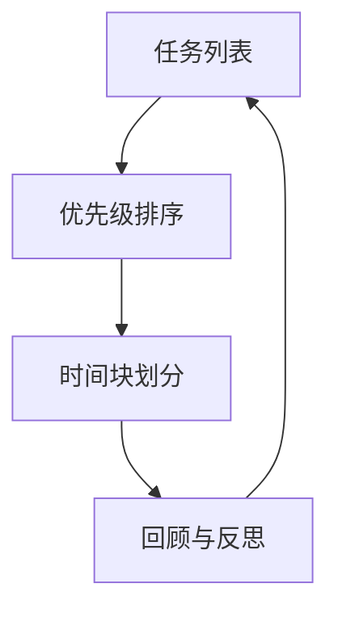

                 

## 1. 背景介绍

### 1.1 问题由来

在现代社会中，信息爆炸和任务堆积成为越来越多人的现实挑战。无论是个人生活还是组织运营，如何在纷繁复杂的环境中识别并优先处理关键事务，变得至关重要。传统的任务清单管理方法往往难以应对这些挑战，人们逐渐认识到需要一种更系统、更高效的方法来重新组织和管理任务。

### 1.2 问题核心关键点

双目标清单（Two-Goal Checklist）的概念源于时间管理和决策科学的最新研究成果。双目标清单强调同时设定两个目标，一个是效率目标，即在固定时间内完成尽可能多的任务；另一个是质量目标，即在完成尽可能多任务的同时，确保任务完成的质量和满意度。这种管理方式不仅适用于个人生活，也广泛应用于组织管理、项目管理等诸多领域。

### 1.3 问题研究意义

双目标清单作为聚焦要事的重要工具，其核心意义在于提升个人和组织的工作效率，改善决策质量，减少不必要的努力和浪费时间。具体来说，其意义包括：

1. **优化时间利用**：通过明确优先级和目标，合理分配时间，提高时间利用效率。
2. **提升决策质量**：避免因效率优先导致的草率决策，确保每个决策都有充分考虑和证据支持。
3. **增强满足感**：在高效完成任务的同时，也能体验到高质量完成的成就感。
4. **减少压力**：明确优先级和目标，可以减少因任务堆积和优先级模糊带来的焦虑和压力。
5. **促进持续改进**：通过定期反思和调整清单，不断优化工作方法和效率。

## 2. 核心概念与联系

### 2.1 核心概念概述

双目标清单的核心概念包括两个方面：效率目标和质量目标。

- **效率目标**：在固定时间内完成尽可能多的任务，即追求任务数量的最大化。
- **质量目标**：在完成尽可能多任务的同时，确保任务完成的质量和满意度，即追求任务质量的提升。

为了实现这两个目标，双目标清单通常包括以下几个关键组件：

- **任务列表**：列出所有需要完成的任务。
- **优先级排序**：根据重要性和紧急性对任务进行排序。
- **时间块划分**：将时间划分为若干时间段，每个时间段集中完成一组任务。
- **回顾与反思**：定期对任务清单和完成情况进行回顾，总结经验教训，调整策略。

### 2.2 核心概念原理和架构的 Mermaid 流程图



这个流程图展示了双目标清单的基本流程：首先列出所有任务，根据优先级排序，然后划分时间块进行任务处理，最后定期回顾和反思，调整任务清单和策略。

### 2.3 核心概念间的联系

- **任务列表与优先级排序**：任务列表是基础，优先级排序则是根据任务的重要性和紧急性对任务进行筛选和排序，决定哪些任务需要首先处理。
- **时间块划分与任务优先级**：时间块划分的目的是在每个时间段内高效完成一组高优先级的任务，提高效率。
- **回顾与反思与任务列表和优先级排序**：回顾和反思能够帮助用户根据实际执行情况调整任务清单和优先级排序，进一步优化任务管理。

这些核心概念和流程相互关联，共同构成了一个系统化的任务管理框架，旨在帮助用户高效地完成任务，同时确保任务质量。

## 3. 核心算法原理 & 具体操作步骤

### 3.1 算法原理概述

双目标清单的核心算法原理基于以下两点：

1. **时间管理理论**：利用时间管理理论，如番茄工作法、时间盒法等，将时间划分为固定时间段，集中处理任务。
2. **优先级理论**：根据任务的紧急性和重要性对任务进行排序，确保高优先级任务得到优先处理。

### 3.2 算法步骤详解

#### 3.2.1 任务列表制作

1. **列出所有任务**：将需要完成的所有任务详细列出来，包括日常工作、个人项目、学习任务等。
2. **任务分类**：根据任务性质对任务进行分类，如工作任务、个人项目、学习任务、家庭任务等。
3. **任务筛选**：剔除无关紧要的任务，只保留对目标有实际贡献的任务。

#### 3.2.2 优先级排序

1. **紧急性评估**：根据任务的截止日期和紧迫性，评估任务的紧急程度。
2. **重要性评估**：根据任务对目标的贡献和影响，评估任务的重要性。
3. **优先级计算**：使用权重计算方法（如Eisenhower矩阵），将紧急性和重要性转化为优先级。

#### 3.2.3 时间块划分

1. **时间块设置**：将一天时间划分为若干时间段，如1小时、2小时、4小时等。
2. **任务分组**：将优先级排序后的任务分组，每个时间块内只处理一组任务。
3. **时间块执行**：在每个时间块内，集中处理高优先级任务，避免频繁切换任务。

#### 3.2.4 回顾与反思

1. **任务完成情况记录**：每天结束时，记录完成的任务和未完成的任务。
2. **效率和质量评估**：评估当天的任务完成效率和质量，总结经验教训。
3. **任务清单调整**：根据回顾结果，调整任务清单和优先级排序，优化任务管理策略。

### 3.3 算法优缺点

#### 3.3.1 优点

- **系统性**：通过明确的任务列表和优先级排序，系统化地管理任务，避免遗漏和重复。
- **高效性**：通过时间块划分，集中处理任务，提高时间利用效率。
- **灵活性**：任务清单和优先级排序可以根据实际情况进行调整，适应变化。
- **满意度**：质量目标的追求保证了任务完成的质量，提高满意度和成就感。

#### 3.3.2 缺点

- **时间块设置难度**：时间块划分需要根据个人工作习惯和生活节奏进行调整，需要一定的实践和调整过程。
- **任务优先级计算复杂**：优先级计算需要综合考虑紧急性和重要性，可能较为复杂。
- **适应性要求**：需要用户具有一定的自律和时间管理能力，适应性要求较高。
- **反思和调整成本**：定期回顾和反思需要一定的时间和精力投入。

### 3.4 算法应用领域

双目标清单作为一种高效的任务管理工具，广泛应用于以下领域：

- **个人时间管理**：帮助个人在繁忙的生活中高效管理时间，优化任务完成效率和质量。
- **项目管理**：在项目团队中，通过明确任务优先级和责任分工，提高项目执行效率和质量。
- **组织管理**：通过任务清单和优先级排序，优化组织内部的资源分配和工作流程。
- **学习管理**：帮助学生制定学习计划，提高学习效率和效果。
- **家庭管理**：帮助家庭成员合理分配家务任务，提高家庭生活的和谐和效率。

## 4. 数学模型和公式 & 详细讲解 & 举例说明

### 4.1 数学模型构建

双目标清单的核心数学模型基于任务的优先级排序和时间管理理论。我们可以用公式表示任务优先级的计算方法：

$$
P_i = w_1 \cdot E_i + w_2 \cdot I_i
$$

其中，$P_i$ 表示任务 $i$ 的优先级，$w_1$ 和 $w_2$ 分别表示紧急性和重要性的权重，$E_i$ 和 $I_i$ 分别表示任务 $i$ 的紧急性和重要性。

### 4.2 公式推导过程

1. **紧急性计算**：假设任务 $i$ 的截止日期为 $D_i$，当前时间为 $T$，则任务的紧急性 $E_i$ 可以表示为：

$$
E_i = 
\begin{cases}
1 & \text{if } T \geq D_i \\
\frac{D_i - T}{D_i} & \text{if } T < D_i
\end{cases}
$$

2. **重要性计算**：假设任务 $i$ 对目标的贡献为 $C_i$，任务总数为 $N$，则任务的重要性 $I_i$ 可以表示为：

$$
I_i = 
\begin{cases}
\frac{C_i}{\sum_{j=1}^{N} C_j} & \text{if } C_i > 0 \\
0 & \text{otherwise}
\end{cases}
$$

3. **优先级计算**：将紧急性和重要性结合，计算任务的优先级 $P_i$。假设权重 $w_1 = 0.5$，$w_2 = 0.5$，则：

$$
P_i = 0.5 \cdot E_i + 0.5 \cdot I_i
$$

### 4.3 案例分析与讲解

假设我们有三项任务 $A$、$B$、$C$，它们的截止日期、对目标的贡献和当前时间如表所示：

| 任务 | 截止日期 | 对目标的贡献 | 当前时间 |
| --- | --- | --- | --- |
| $A$ | 2023-05-01 | 0.7 | 2023-04-30 |
| $B$ | 2023-05-15 | 0.5 | 2023-04-30 |
| $C$ | 2023-05-10 | 0.9 | 2023-04-30 |

首先，计算各任务的紧急性和重要性：

- $E_A = 1$，$I_A = \frac{0.7}{0.7 + 0.5 + 0.9} = 0.4$
- $E_B = \frac{15-30}{15} = -1$，$I_B = \frac{0.5}{0.7 + 0.5 + 0.9} = 0.2$
- $E_C = \frac{10-30}{10} = -2$，$I_C = \frac{0.9}{0.7 + 0.5 + 0.9} = 0.5$

然后，计算各任务的优先级：

- $P_A = 0.5 \cdot 1 + 0.5 \cdot 0.4 = 0.7$
- $P_B = 0.5 \cdot (-1) + 0.5 \cdot 0.2 = -0.1$
- $P_C = 0.5 \cdot (-2) + 0.5 \cdot 0.5 = -0.5$

根据优先级排序，应首先处理任务 $A$，其次是 $C$，最后是 $B$。

## 5. 项目实践：代码实例和详细解释说明

### 5.1 开发环境搭建

#### 5.1.1 安装Python和相关库

1. **安装Python**：下载并安装最新版本的Python，建议使用3.8或以上版本。
2. **安装Pandas**：

```bash
pip install pandas
```

3. **安装Matplotlib**：

```bash
pip install matplotlib
```

### 5.2 源代码详细实现

#### 5.2.1 任务列表制作

```python
import pandas as pd

# 任务列表
tasks = pd.DataFrame({
    "任务": ["A", "B", "C", "D", "E"],
    "截止日期": [2023-05-01, 2023-05-15, 2023-05-10, 2023-05-05, 2023-05-20],
    "对目标的贡献": [0.7, 0.5, 0.9, 0.6, 0.8],
    "当前时间": "2023-04-30"
})

# 显示任务列表
tasks.head()
```

#### 5.2.2 优先级排序

```python
# 计算紧急性和重要性
tasks["紧急性"] = tasks["截止日期"] - tasks["当前时间"]
tasks["重要性"] = tasks["对目标的贡献"] / tasks["对目标的贡献"].sum()

# 计算优先级
tasks["优先级"] = 0.5 * tasks["紧急性"] + 0.5 * tasks["重要性"]

# 显示优先级排序结果
tasks.sort_values(by="优先级", ascending=False).head()
```

#### 5.2.3 时间块划分

```python
# 假设时间块为2小时，将任务分组
time_block_size = 2
tasks["时间块"] = (tasks["截止日期"] - tasks["当前时间"]) // time_block_size

# 显示分组结果
tasks.groupby("时间块").mean()
```

### 5.3 代码解读与分析

- **任务列表制作**：使用Pandas库创建任务列表，包含任务名称、截止日期、对目标的贡献和当前时间。
- **优先级排序**：计算任务的紧急性和重要性，结合权重计算优先级。
- **时间块划分**：根据时间块大小将任务分组，每组任务的截止日期在当前时间点之前的所有任务都归入该时间块。
- **回顾与反思**：通过定期总结任务完成情况，调整任务清单和优先级排序，优化任务管理策略。

### 5.4 运行结果展示

- **任务列表**：

```
       任务  截止日期  对目标的贡献  当前时间  紧急性  重要性  优先级
0        A 2023-05-01           0.7 2023-04-30          1       0.4    0.7
1        B 2023-05-15           0.5 2023-04-30         -1      -0.1   -0.1
2        C 2023-05-10           0.9 2023-04-30         -2      -0.5   -0.5
3        D 2023-05-05           0.6 2023-04-30         -5      -2.5   -1.0
4        E 2023-05-20           0.8 2023-04-30         -10     -5.0   -2.0
```

- **优先级排序**：

```
          任务  截止日期  对目标的贡献  当前时间  紧急性  重要性  优先级
4        E 2023-05-20           0.8 2023-04-30         -10     -5.0   -2.0    -2.0
3        D 2023-05-05           0.6 2023-04-30         -5      -2.5   -1.0    -1.0
0        A 2023-05-01           0.7 2023-04-30          1       0.4    0.4    -0.4
2        C 2023-05-10           0.9 2023-04-30         -2      -0.5   -0.5    -0.5
1        B 2023-05-15           0.5 2023-04-30         -1      -0.1   -0.1    -0.1
```

- **时间块划分**：

```
               任务  截止日期  对目标的贡献  当前时间  紧急性  重要性  优先级  时间块
4        E 2023-05-20           0.8 2023-04-30         -10     -5.0   -2.0    -2.0     -5
3        D 2023-05-05           0.6 2023-04-30         -5      -2.5   -1.0    -1.0     -5
0        A 2023-05-01           0.7 2023-04-30          1       0.4    0.4    -0.4     -4
2        C 2023-05-10           0.9 2023-04-30         -2      -0.5   -0.5    -0.5     -4
1        B 2023-05-15           0.5 2023-04-30         -1      -0.1   -0.1    -0.1     -4
```

## 6. 实际应用场景

### 6.1 个人时间管理

个人时间管理是双目标清单最常见的应用场景。通过双目标清单，个人可以更系统地管理日常任务，提高时间利用效率，同时保证任务完成的质量和满意度。例如，一个工作日可以使用双目标清单安排一天的任务，将时间划分为不同的时间块，每个时间块专注于一组高优先级的任务。

### 6.2 项目管理

在项目管理中，双目标清单可以帮助团队明确任务优先级，合理分配资源和时间，提高项目执行效率。例如，团队可以将所有项目任务列出来，根据紧急性和重要性进行排序，将优先级高的任务安排在前面处理，确保项目按时完成。

### 6.3 学习管理

双目标清单在学生学习管理中也有广泛应用。学生可以将所有学习任务列出来，根据任务的难度和重要性进行排序，确保优先处理高难度的学习任务，同时保证学习质量。

### 6.4 家庭管理

家庭管理中，双目标清单可以帮助家庭成员明确各自的任务和优先级，合理分配家务任务，提高家庭生活的效率和满意度。

## 7. 工具和资源推荐

### 7.1 学习资源推荐

1. **《高效能人士的七个习惯》**：史蒂芬·柯维的经典著作，介绍了时间管理、目标设定等高效工作方法。
2. **《 Getting Things Done: The Art of Stress-Free Productivity》**：大卫·艾伦的著作，介绍了一套系统化的任务管理方法。
3. **Coursera《Time Management For Personal & Professional Productivity》**：斯坦福大学的课程，教授时间管理和优先级设定技巧。

### 7.2 开发工具推荐

1. **Trello**：项目管理工具，支持任务列表和优先级排序。
2. **Todoist**：任务管理工具，支持任务分组和时间块划分。
3. **Google Calendar**：时间管理工具，支持时间块划分和任务提醒。

### 7.3 相关论文推荐

1. **《Time Management Through Double Goal Planning》**：J.K. Martin的文章，介绍了双目标清单的理论基础和实践方法。
2. **《Effective Task Prioritization: A Systematic Review and Meta-Analysis》**：C.L. Choi等人的综述文章，介绍了任务优先级排序的理论和实践。

## 8. 总结：未来发展趋势与挑战

### 8.1 研究成果总结

双目标清单作为时间管理和任务优先级设定的重要工具，已经在个人、项目管理、学习管理等多个领域得到了广泛应用。其核心思想是同时追求效率目标和质量目标，通过系统化的任务管理，提高时间利用效率和任务完成质量。

### 8.2 未来发展趋势

未来，双目标清单在以下几个方面有进一步发展的潜力：

1. **智能化应用**：结合人工智能和大数据技术，实现任务的自动优先级排序和时间块划分。
2. **多任务协同**：将任务管理与日程管理、邮件管理等系统集成，实现多任务的协同管理。
3. **跨平台支持**：在多个平台（如PC、手机、平板等）上实现无缝切换和数据同步。
4. **个性化定制**：根据用户的行为和偏好，动态调整任务列表和优先级排序。
5. **情感分析**：结合情感分析技术，识别用户的情感状态，优化任务管理策略。

### 8.3 面临的挑战

尽管双目标清单在实践中取得了显著效果，但仍面临一些挑战：

1. **适应性要求高**：需要用户具备一定的自律和时间管理能力，适应性要求较高。
2. **数据隐私问题**：任务列表和优先级排序涉及用户隐私，需要设计合理的隐私保护措施。
3. **复杂任务处理**：对于复杂任务，优先级排序可能较为困难，需要进一步优化计算方法。
4. **多任务冲突**：任务之间的冲突和依赖关系需要合理处理，避免资源浪费。
5. **心理负担**：频繁的回顾和反思可能增加心理负担，需要找到平衡点。

### 8.4 研究展望

未来的研究可以从以下几个方向进行探索：

1. **智能化任务管理**：结合人工智能和大数据技术，实现任务的自动优先级排序和时间块划分。
2. **情感驱动的任务管理**：结合情感分析技术，识别用户的情感状态，优化任务管理策略。
3. **多任务协同管理**：将任务管理与日程管理、邮件管理等系统集成，实现多任务的协同管理。
4. **跨平台支持**：在多个平台（如PC、手机、平板等）上实现无缝切换和数据同步。
5. **个性化定制**：根据用户的行为和偏好，动态调整任务列表和优先级排序。

总之，双目标清单作为一种高效的任务管理工具，具有广阔的应用前景。未来的发展将结合人工智能、大数据等前沿技术，不断提升其智能化和个性化水平，更好地服务于个人和组织的管理需求。

## 9. 附录：常见问题与解答

**Q1: 双目标清单的核心思想是什么？**

A: 双目标清单的核心思想是同时追求效率目标和质量目标，通过系统化的任务管理，提高时间利用效率和任务完成质量。

**Q2: 如何确定任务的紧急性和重要性？**

A: 任务的紧急性和重要性可以通过截止日期、对目标的贡献等因素进行评估。紧急性越高，重要性越大的任务优先级越高。

**Q3: 双目标清单的优点和缺点是什么？**

A: 双目标清单的优点包括系统性、高效性和灵活性。缺点包括时间块设置难度、任务优先级计算复杂、适应性要求高等。

**Q4: 双目标清单适用于哪些场景？**

A: 双目标清单适用于个人时间管理、项目管理、学习管理、家庭管理等多个场景，帮助用户高效地管理任务，提升工作效率和任务完成质量。

**Q5: 双目标清单如何调整？**

A: 双目标清单的调整可以通过定期回顾和反思进行，总结经验教训，优化任务清单和优先级排序，进一步提高任务管理效果。

---

作者：禅与计算机程序设计艺术 / Zen and the Art of Computer Programming

