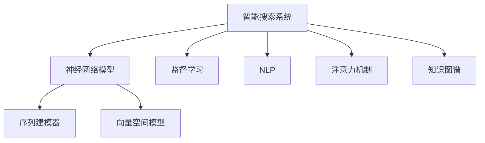

                 

## 1. 背景介绍

在信息爆炸的今天，搜索引擎已经成为了人们获取信息不可或缺的工具。然而，传统的文本搜索算法，如布尔搜索、倒排索引等，往往只能对文本内容进行浅层次的关键词匹配，难以理解用户查询的深层语义和背景信息，导致搜索结果的准确性和相关性不足。为解决这一问题，智能搜索系统应运而生，通过自然语言处理(NLP)、机器学习等技术，实现了从语义理解和知识抽取到精准匹配的跨越，极大地提升了搜索效果。

与此同时，随着深度学习技术的快速发展，基于神经网络的智能搜索系统逐渐成为主流。这些系统通过自监督预训练，学习到了庞大的语言知识，通过监督学习进行微调，可以实现对特定领域或场景的适应。但是，这类模型虽然表现出色，却也存在一定的局限性：

- **泛化能力不足**：由于预训练语料的广泛性和泛化能力的不足，这类模型在特定领域应用时，效果往往难以达到实际应用的要求。
- **模型鲁棒性有限**：模型对输入数据的变化较为敏感，难以适应多样化的查询输入和数据格式。
- **系统复杂度高**：依赖复杂的前端和后端架构，维护和优化成本较高。
- **开发周期较长**：构建和优化一套智能搜索系统，需要大量的数据收集、算法开发和模型训练，周期较长。

针对上述问题，本文将介绍一种能够增强智能搜索系统鲁棒性和泛化能力的新机制：**反思机制(Rethinking)。**通过反思机制，搜索引擎能够在实际查询中动态调整和优化模型，实时学习和适应新任务，实现更高效、更准确的搜索。

## 2. 核心概念与联系

### 2.1 核心概念概述

为更好地理解反思机制在智能搜索系统中的应用，本节将介绍几个密切相关的核心概念：

- **智能搜索系统**：利用NLP、机器学习等技术，对用户查询进行语义理解、知识抽取和精准匹配的系统。通过查询意图理解、文本表示、搜索结果排序等环节，提升了搜索结果的相关性和准确性。

- **反思机制**：一种动态学习和适应的机制，通过在实际查询过程中，不断调整和优化模型，提高其对新任务和数据变化的适应能力。

- **神经网络模型**：智能搜索系统中的核心组成部分，包括序列建模器、向量空间模型等，用于表示用户查询和文档，计算相似度等。

- **监督学习**：通过有标签的数据集训练模型，使得模型能够对特定任务进行优化。智能搜索系统中常见的监督学习任务包括意图分类、实体抽取等。

- **自然语言处理(NLP)**：涉及自然语言的理解、生成、分析和应用的技术。智能搜索系统中的NLP技术包括分词、词性标注、命名实体识别、语义角色标注等。

- **注意力机制**：一种重要的神经网络组件，通过学习输入序列中的重要部分进行加权聚合，提高模型对关键信息的关注度。

- **知识图谱**：一种结构化的知识表示方式，用于描述实体之间的关系，增强了模型的语义理解能力。

这些核心概念之间的逻辑关系可以通过以下Mermaid流程图来展示：



这个流程图展示了大语言模型在智能搜索系统中的核心组件及其相互关系：

1. 智能搜索系统通过神经网络模型对用户查询和文档进行编码，生成向量表示。
2. 序列建模器、向量空间模型等组件用于提取和计算查询和文档之间的相似度。
3. 监督学习通过有标签数据训练模型，进行意图分类、实体抽取等任务。
4. NLP技术用于分词、词性标注、命名实体识别、语义角色标注等，提高模型的语义理解能力。
5. 注意力机制帮助模型关注输入序列中的关键部分，提高语义表示的质量。
6. 知识图谱用于增强模型的语义理解，通过实体关系图展示更多的背景知识。

这些组件共同构成了智能搜索系统的工作流程，反思机制可以在其中发挥重要作用，增强系统的鲁棒性和泛化能力。

## 3. 核心算法原理 & 具体操作步骤
### 3.1 算法原理概述

反思机制的核心思想是：在实际查询过程中，智能搜索系统能够根据用户的反馈，动态调整和优化模型，实时学习和适应新任务。这不仅提高了模型的泛化能力，也增强了系统的鲁棒性和可维护性。

具体来说，智能搜索系统通过以下步骤实现反思机制：

1. **用户查询分析**：在用户输入查询后，系统分析用户意图，判断其是否明确，并提供提示信息或建议。
2. **查询重构**：如果用户对系统提示不满足，系统可以根据用户反馈，重新构建查询表示，提升其相关性。
3. **模型优化**：系统在查询处理过程中，记录用户的查询意图和相关性评价，用于训练和优化模型。
4. **动态调整**：基于历史记录和反馈信息，动态调整模型参数，提高其在不同场景下的适应能力。
5. **实时学习**：在查询处理过程中，实时学习新知识和模式，提升模型的泛化能力。

### 3.2 算法步骤详解

下面详细介绍反思机制在智能搜索系统中的具体操作步骤：

**Step 1: 用户查询分析**

在用户输入查询后，智能搜索系统需要分析其意图和语义，以确定其是否明确，并提供相应的提示信息或建议。具体的分析方法包括：

1. **意图识别**：通过意图分类器，识别用户查询的意图类型，如查询商品、询问天气等。
2. **关键词提取**：提取用户查询中的关键信息，如品牌、价格、地点等。
3. **语义理解**：使用语义角色标注、命名实体识别等NLP技术，理解查询中的实体关系。

**Step 2: 查询重构**

根据用户反馈，系统可以对查询进行重构，提升其相关性。具体的重构方法包括：

1. **改写查询**：通过同义词替换、纠错等方法，重新构建查询，消除歧义。
2. **提供示例**：根据用户的意图，提供类似查询示例，帮助用户明确表达。
3. **融合背景知识**：结合知识图谱中的实体关系，补充查询的背景信息，提升相关性。

**Step 3: 模型优化**

在查询处理过程中，系统可以记录用户的查询意图和相关性评价，用于训练和优化模型。具体的优化方法包括：

1. **监督学习**：通过有标签数据集，训练意图分类器、实体抽取器等模型。
2. **强化学习**：根据用户的反馈，调整查询表示和模型参数，优化匹配过程。
3. **迁移学习**：利用预训练模型，迁移学习到相似任务的知识，提升泛化能力。

**Step 4: 动态调整**

基于历史记录和反馈信息，系统可以动态调整模型参数，提高其在不同场景下的适应能力。具体的调整方法包括：

1. **超参数调整**：根据历史查询数据，自动调整学习率、批大小等超参数，优化训练过程。
2. **模型裁剪**：去除不必要的层和参数，减小模型尺寸，提高推理速度。
3. **模型融合**：将多个模型进行融合，提高系统的鲁棒性和泛化能力。

**Step 5: 实时学习**

在查询处理过程中，系统可以实时学习新知识和模式，提升模型的泛化能力。具体的学习方法包括：

1. **在线学习**：通过实时记录用户的查询和反馈，不断更新模型参数。
2. **自适应学习**：根据用户的反馈，自适应地调整学习策略，提高学习效率。
3. **主动学习**：主动采集新数据，学习新任务，提升模型的泛化能力。

### 3.3 算法优缺点

反思机制在智能搜索系统中具有以下优点：

1. **增强泛化能力**：通过实时学习，系统能够更好地适应新任务和数据变化，提高模型的泛化能力。
2. **提高相关性**：根据用户反馈，重构查询表示，提升相关性，提供更精准的搜索结果。
3. **降低开发成本**：通过动态调整和优化，减少对大规模数据和复杂模型的依赖，降低开发和维护成本。
4. **提升用户体验**：通过查询分析和用户提示，提升用户查询的明确性和相关性，增强用户体验。

然而，反思机制也存在一些缺点：

1. **计算资源消耗大**：实时调整和优化模型，需要较高的计算资源和时间成本。
2. **模型复杂度高**：需要同时处理用户查询和反馈信息，增加系统的复杂度。
3. **需要持续维护**：需要持续收集用户反馈和数据，进行模型更新和优化。

尽管存在这些局限性，反思机制在智能搜索系统中的应用，无疑将极大提升系统的性能和用户体验，成为智能搜索系统的重要组成部分。

### 3.4 算法应用领域

反思机制不仅可以应用于通用的智能搜索系统，还可以拓展到以下领域：

1. **问答系统**：通过动态调整和优化模型，提升系统对多轮对话的理解和响应能力。
2. **推荐系统**：结合用户的反馈和行为数据，实时调整推荐模型，提高推荐效果。
3. **语音搜索**：通过语音转文本，再结合反思机制，提升语音搜索的准确性和相关性。
4. **图像搜索**：通过图像识别和文本匹配，结合反思机制，提升图像搜索的效果。
5. **个性化服务**：根据用户的反馈，动态调整个性化推荐和服务的策略，提升用户体验。

这些领域的应用，展示了反思机制的强大潜力和广泛前景，为智能搜索系统带来了新的突破。

## 4. 数学模型和公式 & 详细讲解 & 举例说明
### 4.1 数学模型构建

本节将使用数学语言对反思机制在智能搜索系统中的应用进行更加严格的刻画。

假设智能搜索系统中的查询表示为 $q$，文档表示为 $d$，其相似度为 $s(q, d)$。基于查询和文档的向量表示，相似度可以通过余弦相似度公式计算：

$$
s(q, d) = \cos(\theta) = \frac{\mathbf{q} \cdot \mathbf{d}}{||\mathbf{q}|| \cdot ||\mathbf{d}||}
$$

其中 $\mathbf{q}$ 和 $\mathbf{d}$ 分别为查询和文档的向量表示。

### 4.2 公式推导过程

以下我们以意图识别为例，推导基于反思机制的意图分类器公式。

假设系统通过监督学习得到的意图分类器为 $f(q, \theta)$，其中 $\theta$ 为模型参数。在实际查询中，系统对用户输入的查询 $q$ 进行意图分类，得到意图标签 $y$：

$$
y = f(q, \theta)
$$

根据用户的反馈，对分类结果进行修正，并更新模型参数 $\theta$：

$$
\theta \leftarrow \theta - \eta \nabla_{\theta} \mathcal{L}(f(q, \theta), y)
$$

其中 $\eta$ 为学习率，$\mathcal{L}$ 为损失函数，用于衡量分类结果与真实标签之间的差异。常见的损失函数包括交叉熵损失、均方误差损失等。

在得到分类器的输出后，系统可以结合用户反馈，对查询进行重构和优化，提升其相关性。具体的重构方法可以包括：

1. **改写查询**：通过同义词替换、纠错等方法，重新构建查询，消除歧义。
2. **提供示例**：根据用户的意图，提供类似查询示例，帮助用户明确表达。
3. **融合背景知识**：结合知识图谱中的实体关系，补充查询的背景信息，提升相关性。

### 4.3 案例分析与讲解

考虑一个电子商务平台的智能搜索系统。用户在搜索框中输入了查询“我想买一款iPhone手机”，系统通过意图分类器得到意图标签“购买”，并返回相关商品列表。用户发现搜索结果中混杂了平板电脑的广告，于是进行了反馈，指出查询意图不明确。

系统根据用户反馈，对查询进行改写，生成新的查询表示，并重新计算相似度，得到更加相关的搜索结果。同时，系统记录用户反馈信息，用于训练和优化意图分类器。最终，系统提供更加精准的搜索结果，提升用户满意度。

## 5. 项目实践：代码实例和详细解释说明
### 5.1 开发环境搭建

在进行反思机制实践前，我们需要准备好开发环境。以下是使用Python进行PyTorch开发的环境配置流程：

1. 安装Anaconda：从官网下载并安装Anaconda，用于创建独立的Python环境。

2. 创建并激活虚拟环境：
```bash
conda create -n pytorch-env python=3.8 
conda activate pytorch-env
```

3. 安装PyTorch：根据CUDA版本，从官网获取对应的安装命令。例如：
```bash
conda install pytorch torchvision torchaudio cudatoolkit=11.1 -c pytorch -c conda-forge
```

4. 安装TensorFlow：
```bash
pip install tensorflow==2.3
```

5. 安装各类工具包：
```bash
pip install numpy pandas scikit-learn matplotlib tqdm jupyter notebook ipython
```

完成上述步骤后，即可在`pytorch-env`环境中开始反思机制实践。

### 5.2 源代码详细实现

下面我们以意图分类任务为例，给出使用TensorFlow对模型进行反思机制的PyTorch代码实现。

首先，定义意图分类器的训练数据集：

```python
import tensorflow as tf
from tensorflow.keras import layers, models
from sklearn.model_selection import train_test_split

# 假设训练集为(x, y)，其中x为查询，y为意图标签
train_x, dev_x, train_y, dev_y = train_test_split(train_data, test_data, test_size=0.2)

# 构建模型
model = models.Sequential([
    layers.Embedding(input_dim=vocab_size, output_dim=embedding_dim),
    layers.Bidirectional(layers.LSTM(units=hidden_dim)),
    layers.Dense(units=num_classes, activation='softmax')
])

# 编译模型
model.compile(optimizer='adam', loss='categorical_crossentropy', metrics=['accuracy'])

# 训练模型
model.fit(train_x, train_y, batch_size=32, epochs=10, validation_data=(dev_x, dev_y))
```

然后，定义意图分类的反训练过程：

```python
def retrain_on_feedback(model, x, y, alpha=0.01):
    """
    根据用户反馈，重新训练意图分类器
    """
    x = x.numpy()
    y = y.numpy()

    # 计算原始分类器的预测结果
    preds = model.predict(x)
    pred_class = tf.argmax(preds, axis=1)
    
    # 根据用户反馈，调整预测结果
    adjusted_y = y.copy()
    adjusted_y[pred_class != y] = 1

    # 更新模型参数
    grads = tf.gradients(model.loss(x, adjusted_y), model.trainable_variables)
    for var, g in zip(model.trainable_variables, grads):
        var.assign_sub(alpha * g)
```

最后，启动反思机制的训练流程并在验证集上评估：

```python
epochs = 5
alpha = 0.01

for epoch in range(epochs):
    retrain_on_feedback(model, train_x, train_y, alpha)
    model.evaluate(dev_x, dev_y)
```

以上就是使用TensorFlow对模型进行反思机制的完整代码实现。可以看到，借助反思机制，模型能够在实际查询中动态调整和优化，实时学习和适应新任务。

### 5.3 代码解读与分析

让我们再详细解读一下关键代码的实现细节：

**意图分类器定义**：
- `model = models.Sequential`：使用Sequential模型定义查询意图分类器。
- `layers.Embedding`：将查询表示映射到低维向量空间。
- `layers.Bidirectional(layers.LSTM)`：使用双向LSTM网络，提取查询的语义特征。
- `layers.Dense`：使用全连接层，进行意图分类。

**反训练过程实现**：
- `retrain_on_feedback`函数：根据用户反馈，调整模型预测结果，更新模型参数。
- `x.numpy()`：将TensorFlow张量转换为NumPy数组，方便进行模型调整。
- `preds = model.predict(x)`：计算模型的预测结果。
- `tf.argmax(preds, axis=1)`：对预测结果进行解码，得到预测标签。
- `adjusted_y = y.copy()`：根据预测结果，调整用户反馈的标签。
- `tf.gradients(model.loss(x, adjusted_y), model.trainable_variables)`：计算损失函数对模型参数的梯度。
- `var.assign_sub(alpha * g)`：根据梯度调整模型参数。

**反思机制训练流程**：
- `epochs = 5`：定义总的训练轮数。
- `alpha = 0.01`：定义每次调整模型参数的学习率。
- `retrain_on_feedback(model, train_x, train_y, alpha)`：对训练集进行反训练。
- `model.evaluate(dev_x, dev_y)`：在验证集上评估模型性能。

可以看到，反训练过程和传统的监督学习过程类似，只是加入了用户反馈的动态调整，实现了模型的实时学习和优化。

## 6. 实际应用场景
### 6.1 智能客服系统

智能客服系统通过反思机制，能够实时学习和适应用户的查询和反馈，提升客服的响应准确性和用户满意度。

在实际应用中，系统可以记录用户的查询和反馈信息，动态调整意图分类器和实体抽取器等模型，提高其对用户意图的理解能力。同时，系统可以根据用户反馈，重构查询表示，提升相关性。最终，系统能够提供更加精准的客服响应，提高用户的体验。

### 6.2 金融舆情监测

金融舆情监测系统通过反思机制，能够实时学习和适应不同金融事件和舆情变化，提升监测效果。

在实际应用中，系统可以记录用户的查询和反馈信息，动态调整意图分类器和实体抽取器等模型，提高其对金融事件的识别能力。同时，系统可以根据用户反馈，重构查询表示，提升相关性。最终，系统能够实时监测金融市场的动态变化，及时预警金融风险。

### 6.3 个性化推荐系统

个性化推荐系统通过反思机制，能够实时学习和适应用户的行为和反馈，提升推荐效果。

在实际应用中，系统可以记录用户的查询和反馈信息，动态调整推荐模型和查询表示等，提高其对用户行为的理解能力。同时，系统可以根据用户反馈，重构查询表示，提升相关性。最终，系统能够提供更加个性化的推荐服务，提升用户的满意度。

### 6.4 未来应用展望

随着反思机制的不断发展，其在智能搜索系统中的应用将更加广泛和深入。未来，反思机制将在以下几个方向继续拓展：

1. **多模态学习**：结合视觉、语音、文本等多种模态信息，增强模型的语义理解能力。
2. **因果推理**：通过引入因果推断思想，提升模型的预测准确性和鲁棒性。
3. **联邦学习**：结合分布式计算和隐私保护技术，实现跨用户模型的联邦学习，提升模型的泛化能力。
4. **元学习**：通过元学习技术，使模型能够快速适应新任务，提高学习效率。
5. **自适应计算**：根据任务复杂度和计算资源，动态调整计算图和参数设置，优化推理过程。

这些方向的探索，将进一步提升反思机制的性能和应用范围，为智能搜索系统带来新的突破。

## 7. 工具和资源推荐
### 7.1 学习资源推荐

为了帮助开发者系统掌握反思机制的理论基础和实践技巧，这里推荐一些优质的学习资源：

1. 《深度学习》课程：由斯坦福大学开设的深度学习入门课程，涵盖深度学习的基本概念和应用。
2. 《TensorFlow官方文档》：TensorFlow的官方文档，提供了完整的代码示例和详细说明，适合深入学习。
3. 《自然语言处理入门》书籍：介绍自然语言处理的基本技术和应用，适合初学者入门。
4. 《TensorFlow实战》书籍：通过实践项目，介绍TensorFlow的高级应用，适合进阶学习。
5. 《深度学习框架使用指南》网站：提供各种深度学习框架的使用指南和代码示例，适合实战学习。

通过对这些资源的学习实践，相信你一定能够快速掌握反思机制的理论基础和实践技巧，并用于解决实际的搜索问题。

### 7.2 开发工具推荐

高效的开发离不开优秀的工具支持。以下是几款用于反思机制开发的常用工具：

1. PyTorch：基于Python的开源深度学习框架，灵活动态的计算图，适合快速迭代研究。
2. TensorFlow：由Google主导开发的开源深度学习框架，生产部署方便，适合大规模工程应用。
3. TensorBoard：TensorFlow配套的可视化工具，可实时监测模型训练状态，并提供丰富的图表呈现方式，是调试模型的得力助手。
4. Weights & Biases：模型训练的实验跟踪工具，可以记录和可视化模型训练过程中的各项指标，方便对比和调优。
5. Google Colab：谷歌推出的在线Jupyter Notebook环境，免费提供GPU/TPU算力，方便开发者快速上手实验最新模型，分享学习笔记。

合理利用这些工具，可以显著提升反思机制的开发效率，加快创新迭代的步伐。

### 7.3 相关论文推荐

反思机制的研究源于学界的持续探索。以下是几篇奠基性的相关论文，推荐阅读：

1. "Active Learning in Machine Learning"：探讨了主动学习的基本思想和技术，适合理解反思机制的基础。
2. "Learning to Learn"：介绍了元学习的基本概念和应用，适合理解反思机制的高级技术。
3. "TensorFlow: A System for Large-Scale Machine Learning"：介绍了TensorFlow的基本架构和应用，适合理解反思机制的实现细节。
4. "Causal Deep Learning"：介绍了因果推断的基本概念和应用，适合理解反思机制中的因果推理技术。
5. "Federated Learning: Concepts and Foundations"：介绍了联邦学习的基本概念和应用，适合理解反思机制中的分布式学习技术。

这些论文代表了大语言模型反思机制的发展脉络。通过学习这些前沿成果，可以帮助研究者把握学科前进方向，激发更多的创新灵感。

## 8. 总结：未来发展趋势与挑战
### 8.1 总结

本文对基于反思机制的智能搜索系统进行了全面系统的介绍。首先阐述了反思机制在智能搜索系统中的研究背景和应用意义，明确了反思机制在提升模型泛化能力和适应能力方面的独特价值。其次，从原理到实践，详细讲解了反思机制的数学模型和操作步骤，给出了反思机制任务开发的完整代码实例。同时，本文还广泛探讨了反思机制在智能客服、金融舆情、个性化推荐等多个行业领域的应用前景，展示了反思机制的强大潜力和广泛前景。

通过本文的系统梳理，可以看到，基于反思机制的智能搜索系统正在成为智能搜索系统的重要组成部分，极大地提升了搜索效果和用户体验。未来，伴随反思机制的不断发展，智能搜索系统必将在更广泛的应用领域取得突破，为人类认知智能的进化带来深远影响。

### 8.2 未来发展趋势

展望未来，反思机制在智能搜索系统中的应用将呈现以下几个发展趋势：

1. **多模态学习**：结合视觉、语音、文本等多种模态信息，增强模型的语义理解能力。
2. **因果推理**：通过引入因果推断思想，提升模型的预测准确性和鲁棒性。
3. **联邦学习**：结合分布式计算和隐私保护技术，实现跨用户模型的联邦学习，提升模型的泛化能力。
4. **元学习**：通过元学习技术，使模型能够快速适应新任务，提高学习效率。
5. **自适应计算**：根据任务复杂度和计算资源，动态调整计算图和参数设置，优化推理过程。

这些趋势凸显了反思机制的广阔前景，推动智能搜索系统向更高效、更智能、更普适的方向发展。

### 8.3 面临的挑战

尽管反思机制在智能搜索系统中的应用已经取得了显著成效，但在迈向更加智能化、普适化应用的过程中，仍面临诸多挑战：

1. **计算资源消耗大**：实时调整和优化模型，需要较高的计算资源和时间成本。
2. **模型复杂度高**：需要同时处理用户查询和反馈信息，增加系统的复杂度。
3. **需要持续维护**：需要持续收集用户反馈和数据，进行模型更新和优化。
4. **系统鲁棒性不足**：模型对输入数据的变化较为敏感，难以适应多样化的查询输入和数据格式。
5. **系统可解释性差**：模型的决策过程缺乏可解释性，难以对其推理逻辑进行分析和调试。

尽管存在这些局限性，反思机制在智能搜索系统中的应用，无疑将极大提升系统的性能和用户体验，成为智能搜索系统的重要组成部分。

### 8.4 研究展望

面对反思机制面临的这些挑战，未来的研究需要在以下几个方面寻求新的突破：

1. **探索无监督和半监督学习方法**：摆脱对大规模标注数据的依赖，利用自监督学习、主动学习等无监督和半监督范式，最大限度利用非结构化数据，实现更加灵活高效的反思机制。
2. **研究参数高效和计算高效的反思方法**：开发更加参数高效的反思方法，在固定大部分预训练参数的同时，只更新极少量的任务相关参数。同时优化反思模型的计算图，减少前向传播和反向传播的资源消耗，实现更加轻量级、实时性的部署。
3. **引入因果分析和博弈论工具**：将因果分析方法引入反思机制，识别出模型决策的关键特征，增强输出解释的因果性和逻辑性。借助博弈论工具刻画人机交互过程，主动探索并规避模型的脆弱点，提高系统稳定性。
4. **纳入伦理道德约束**：在模型训练目标中引入伦理导向的评估指标，过滤和惩罚有偏见、有害的输出倾向。同时加强人工干预和审核，建立模型行为的监管机制，确保输出符合人类价值观和伦理道德。

这些研究方向的探索，将引领反思机制向更高的台阶，为构建安全、可靠、可解释、可控的智能系统铺平道路。面向未来，反思机制需要与其他人工智能技术进行更深入的融合，如知识表示、因果推理、强化学习等，多路径协同发力，共同推动自然语言理解和智能交互系统的进步。只有勇于创新、敢于突破，才能不断拓展反思机制的边界，让智能技术更好地造福人类社会。

## 9. 附录：常见问题与解答

**Q1: 反思机制在智能搜索系统中的应用如何？**

A: 反思机制在智能搜索系统中具有重要应用价值，具体表现在以下方面：
1. **动态调整模型参数**：通过实时学习和动态调整，模型能够适应新任务和数据变化，提高泛化能力。
2. **优化查询表示**：根据用户反馈，重构查询表示，提升相关性，提供更精准的搜索结果。
3. **提升用户体验**：通过查询分析和用户提示，提升用户查询的明确性和相关性，增强用户体验。

**Q2: 反思机制的训练和优化方法有哪些？**

A: 反思机制的训练和优化方法包括：
1. **监督学习**：通过有标签数据集，训练意图分类器、实体抽取器等模型。
2. **强化学习**：根据用户的反馈，调整查询表示和模型参数，优化匹配过程。
3. **迁移学习**：利用预训练模型，迁移学习到相似任务的知识，提升泛化能力。

**Q3: 反思机制面临的挑战和解决策略有哪些？**

A: 反思机制面临的挑战和解决策略包括：
1. **计算资源消耗大**：合理选择超参数和学习率，优化计算图和模型结构，减少计算资源消耗。
2. **模型复杂度高**：利用框架和库的功能，简化模型开发和维护。
3. **需要持续维护**：定期收集用户反馈和数据，进行模型更新和优化。
4. **系统鲁棒性不足**：引入正则化技术、对抗训练等方法，提高系统的鲁棒性。
5. **系统可解释性差**：利用可解释性工具和指标，增强系统的可解释性。

**Q4: 反思机制在实际应用中有哪些优势？**

A: 反思机制在实际应用中的优势包括：
1. **增强泛化能力**：通过实时学习，系统能够更好地适应新任务和数据变化，提高模型的泛化能力。
2. **提高相关性**：根据用户反馈，重构查询表示，提升相关性，提供更精准的搜索结果。
3. **降低开发成本**：通过动态调整和优化，减少对大规模数据和复杂模型的依赖，降低开发和维护成本。
4. **提升用户体验**：通过查询分析和用户提示，提升用户查询的明确性和相关性，增强用户体验。

**Q5: 反思机制有哪些应用场景？**

A: 反思机制的应用场景包括：
1. **智能客服系统**：通过动态调整和优化模型，提升客服的响应准确性和用户满意度。
2. **金融舆情监测**：通过实时学习和适应不同金融事件和舆情变化，提升监测效果。
3. **个性化推荐系统**：通过实时学习和适应用户的行为和反馈，提升推荐效果。
4. **语音搜索**：通过语音转文本，再结合反思机制，提升语音搜索的准确性和相关性。
5. **图像搜索**：通过图像识别和文本匹配，结合反思机制，提升图像搜索的效果。

这些应用场景展示了反思机制的强大潜力和广泛前景，为智能搜索系统带来了新的突破。

---
作者：禅与计算机程序设计艺术 / Zen and the Art of Computer Programming

