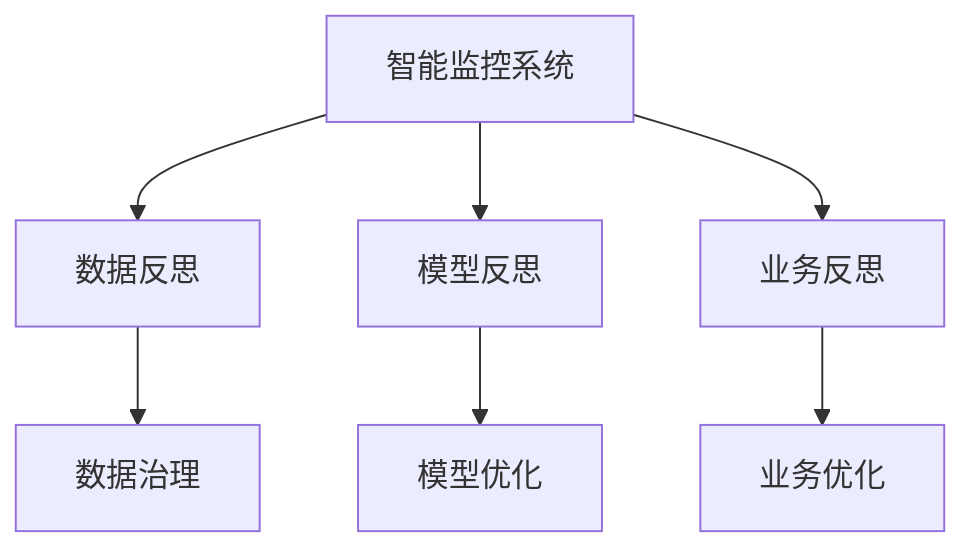

                 

# 反思机制在智能监控系统中的应用

## 1. 背景介绍

### 1.1 问题由来
智能监控系统在提升工作效率、保障业务安全、优化决策流程等方面发挥了重要作用。然而，由于缺乏反思机制，监控系统往往只能被动响应事件，无法主动进行异常检测和数据挖掘，无法对异常行为进行深入分析，无法优化业务流程和改善用户体验。本文旨在探讨反思机制在智能监控系统中的应用，通过反思机制，实现监控系统的智能化和自适应，从而更好地支撑业务创新和发展。

### 1.2 问题核心关键点
反思机制的核心思想是通过对系统运行数据进行回溯和分析，识别系统异常、模型误差和业务瓶颈，从而进行及时调整和优化。具体实现中，反思机制可以分为数据反思、模型反思和业务反思三个层面。

- 数据反思：通过分析历史数据，识别数据分布异常、缺失和错误，为数据治理提供依据。
- 模型反思：通过对比预测结果与实际数据，识别模型过拟合、欠拟合和误差，优化模型参数和结构。
- 业务反思：通过分析系统运行日志和用户反馈，识别业务流程瓶颈和用户体验问题，提出改进建议。

这些反思机制的引入，将使监控系统具备自主学习和自我优化的能力，从而不断提升系统的性能和用户体验。

### 1.3 问题研究意义
研究反思机制在智能监控系统中的应用，对于提高监控系统的智能化水平、提升业务流程的自动化和自适应能力、增强用户和企业的决策支持能力具有重要意义：

1. 自主学习：反思机制使监控系统能够自主学习历史数据和运行经验，不断优化自身模型和算法，提升异常检测和问题诊断的准确性。
2. 自适应：反思机制使监控系统能够根据环境变化和业务需求，动态调整运行策略和参数，适应不同的业务场景和需求。
3. 增强决策支持：反思机制使监控系统能够输出基于数据分析和模型推理的决策建议，为管理层和业务人员提供更具参考价值的决策支持。
4. 提升用户体验：反思机制使监控系统能够基于用户反馈和行为数据，优化业务流程和系统界面，提升用户体验和满意度。

## 2. 核心概念与联系

### 2.1 核心概念概述

为了更好地理解反思机制在智能监控系统中的应用，本节将介绍几个密切相关的核心概念：

- 智能监控系统：基于人工智能技术的监控系统，具备数据分析、异常检测、问题诊断和业务优化等能力，能够主动识别和响应业务异常。
- 反思机制：通过数据分析和模型回溯，识别系统异常、模型误差和业务瓶颈，从而进行优化和调整的机制。
- 数据治理：通过数据分析和数据质量评估，提升数据质量和数据可用性，为监控系统的优化提供依据。
- 模型优化：通过模型回溯和模型评估，识别模型问题，优化模型参数和结构，提升模型性能。
- 业务优化：通过业务日志和用户反馈分析，识别业务流程和用户体验问题，提出改进建议。

这些核心概念之间的逻辑关系可以通过以下Mermaid流程图来展示：



这个流程图展示了大语言模型的核心概念及其之间的关系：

1. 智能监控系统通过数据反思、模型反思和业务反思，实现对数据的治理、模型的优化和业务的改进。
2. 数据反思分析历史数据，提供数据治理依据。
3. 模型反思对比预测结果和实际数据，提供模型优化建议。
4. 业务反思分析系统日志和用户反馈，提供业务改进方案。

这些概念共同构成了反思机制的应用框架，使得智能监控系统能够主动学习、自适应和优化，从而不断提升性能和用户体验。

## 3. 核心算法原理 & 具体操作步骤
### 3.1 算法原理概述

反思机制在智能监控系统中的应用，本质上是一个数据驱动的持续学习和优化过程。其核心思想是通过对系统运行数据进行回溯和分析，识别系统异常、模型误差和业务瓶颈，从而进行及时调整和优化。

形式化地，假设智能监控系统的运行数据集为 $D=\{(x_i, y_i)\}_{i=1}^N$，其中 $x_i$ 为输入数据，$y_i$ 为输出数据（如监控事件、异常报告等）。反思机制的目标是找到最优的调整策略 $\theta^*$，使得模型输出的结果尽可能接近实际结果，即：

$$
\theta^* = \mathop{\arg\min}_{\theta} \mathcal{L}(D, \theta)
$$

其中 $\mathcal{L}$ 为基于监控结果的损失函数，用于衡量模型预测与真实标签之间的差异。常见的损失函数包括交叉熵损失、均方误差损失等。

通过梯度下降等优化算法，反思机制不断更新模型参数 $\theta$，最小化损失函数 $\mathcal{L}$，使得模型输出逼近真实标签。由于反思机制具有自我学习的能力，可以持续优化模型性能，从而提升监控系统的准确性和鲁棒性。

### 3.2 算法步骤详解

反思机制在智能监控系统中的应用，通常包括以下几个关键步骤：

**Step 1: 数据收集与预处理**
- 收集监控系统的运行数据 $D$，包括系统日志、异常报告、业务数据等。
- 对数据进行清洗和预处理，去除噪音和异常值，提高数据质量。

**Step 2: 数据反思与分析**
- 使用数据分析技术，识别数据分布异常、缺失和错误。
- 通过数据挖掘，发现异常模式和趋势，提供数据治理建议。

**Step 3: 模型反思与优化**
- 使用模型评估技术，对比预测结果与实际数据，识别模型过拟合、欠拟合和误差。
- 根据模型反思结果，调整模型参数和结构，优化模型性能。

**Step 4: 业务反思与改进**
- 收集系统日志和用户反馈，识别业务流程瓶颈和用户体验问题。
- 提出改进建议，优化业务流程和系统界面，提升用户体验和满意度。

**Step 5: 运行与反馈**
- 将优化后的模型和算法应用于监控系统，进行持续运行和数据收集。
- 周期性对运行数据进行反思，进行新一轮的优化和改进。

以上是反思机制在智能监控系统中的应用的一般流程。在实际应用中，还需要针对具体任务的特点，对反思过程的各个环节进行优化设计，如改进数据分析算法，引入更多的模型评估技术，搜索最优的优化策略等，以进一步提升监控系统的性能。

### 3.3 算法优缺点

反思机制在智能监控系统中的应用具有以下优点：
1. 自我学习：通过数据分析和模型回溯，使监控系统能够自主学习历史数据和运行经验，不断优化自身模型和算法。
2. 自适应：通过动态调整运行策略和参数，使监控系统能够适应不同的业务场景和需求。
3. 增强决策支持：通过输出基于数据分析和模型推理的决策建议，为管理层和业务人员提供更具参考价值的决策支持。
4. 提升用户体验：通过优化业务流程和系统界面，提升用户体验和满意度。

同时，该方法也存在一定的局限性：
1. 数据质量要求高：反思机制的准确性和有效性依赖于高质量的数据输入，数据质量问题可能影响反思效果。
2. 模型复杂度高：反思机制涉及的数据分析和模型回溯，计算复杂度高，需要高效的计算和存储资源。
3. 算法依赖性强：反思机制的有效性依赖于数据反思、模型反思和业务反思等算法的选择和优化，算法选择不当可能影响反思效果。
4. 实时性要求高：反思机制需要及时处理新数据，并根据反思结果进行模型和算法调整，实时性要求高。
5. 用户隐私风险：反思机制涉及大量用户数据，可能涉及隐私问题，需要采取严格的数据保护措施。

尽管存在这些局限性，但就目前而言，反思机制在智能监控系统中的应用已经得到了广泛的应用，为监控系统的智能化和自适应提供了新的手段。未来相关研究的重点在于如何进一步提高数据质量、优化算法模型、增强实时性，同时兼顾隐私保护和安全风险。

### 3.4 算法应用领域

反思机制在智能监控系统中的应用已经得到了广泛的应用，覆盖了金融、医疗、制造业等多个领域，例如：

- 金融风控：通过反思机制识别交易异常和风险信号，提升金融系统的安全和稳定性。
- 医疗诊断：通过反思机制分析诊断数据，发现异常诊断和误诊，优化诊断流程和模型。
- 制造业质检：通过反思机制识别生产异常和设备故障，提升产品质量和生产效率。
- 互联网监控：通过反思机制分析用户行为数据，识别潜在网络攻击和异常行为，提升网络安全。
- 物流监控：通过反思机制分析运输数据，优化物流流程和配送路径，提升物流效率和成本。

除了上述这些经典任务外，反思机制还被创新性地应用到更多场景中，如智能推荐、智能客服、智能投顾等，为业务决策和用户体验带来了新的突破。随着反思机制的持续演进，相信智能监控系统将在更多领域得到应用，为业务流程的智能化和优化提供新的路径。

## 4. 数学模型和公式 & 详细讲解  
### 4.1 数学模型构建

本节将使用数学语言对反思机制在智能监控系统中的应用进行更加严格的刻画。

记智能监控系统的运行数据集为 $D=\{(x_i, y_i)\}_{i=1}^N$，其中 $x_i$ 为输入数据，$y_i$ 为输出数据（如监控事件、异常报告等）。

定义监控系统输出的结果为 $\hat{y}=f(x, \theta)$，其中 $f$ 为模型的预测函数，$\theta$ 为模型参数。

反思机制的目标是最小化模型输出与实际结果的差异，即：

$$
\theta^* = \mathop{\arg\min}_{\theta} \mathcal{L}(D, \theta)
$$

其中 $\mathcal{L}$ 为基于监控结果的损失函数，用于衡量模型预测与真实标签之间的差异。常见的损失函数包括交叉熵损失、均方误差损失等。

在实际应用中，通常使用基于梯度的优化算法（如SGD、Adam等）来近似求解上述最优化问题。设 $\eta$ 为学习率，$\lambda$ 为正则化系数，则参数的更新公式为：

$$
\theta \leftarrow \theta - \eta \nabla_{\theta}\mathcal{L}(D, \theta) - \eta\lambda\theta
$$

其中 $\nabla_{\theta}\mathcal{L}(D, \theta)$ 为损失函数对参数 $\theta$ 的梯度，可通过反向传播算法高效计算。

### 4.2 公式推导过程

以下我们以二分类任务为例，推导交叉熵损失函数及其梯度的计算公式。

假设监控系统输出的结果为 $\hat{y}=f(x, \theta) \in [0,1]$，表示模型预测结果。真实标签 $y \in \{0,1\}$。则二分类交叉熵损失函数定义为：

$$
\ell(\hat{y},y) = -[y\log \hat{y} + (1-y)\log (1-\hat{y})]
$$

将其代入经验风险公式，得：

$$
\mathcal{L}(\theta) = -\frac{1}{N}\sum_{i=1}^N [y_i\log f(x_i, \theta)+(1-y_i)\log(1-f(x_i, \theta))]
$$

根据链式法则，损失函数对参数 $\theta$ 的梯度为：

$$
\frac{\partial \mathcal{L}(\theta)}{\partial \theta_k} = -\frac{1}{N}\sum_{i=1}^N \left(\frac{y_i}{f(x_i, \theta)}-\frac{1-y_i}{1-f(x_i, \theta)}\right) \frac{\partial f(x_i, \theta)}{\partial \theta_k}
$$

其中 $\frac{\partial f(x_i, \theta)}{\partial \theta_k}$ 可进一步递归展开，利用自动微分技术完成计算。

在得到损失函数的梯度后，即可带入参数更新公式，完成模型的迭代优化。重复上述过程直至收敛，最终得到适应下游任务的最优模型参数 $\theta^*$。

## 5. 项目实践：代码实例和详细解释说明
### 5.1 开发环境搭建

在进行反思机制的实践前，我们需要准备好开发环境。以下是使用Python进行PyTorch开发的环境配置流程：

1. 安装Anaconda：从官网下载并安装Anaconda，用于创建独立的Python环境。

2. 创建并激活虚拟环境：
```bash
conda create -n pytorch-env python=3.8 
conda activate pytorch-env
```

3. 安装PyTorch：根据CUDA版本，从官网获取对应的安装命令。例如：
```bash
conda install pytorch torchvision torchaudio cudatoolkit=11.1 -c pytorch -c conda-forge
```

4. 安装各类工具包：
```bash
pip install numpy pandas scikit-learn matplotlib tqdm jupyter notebook ipython
```

完成上述步骤后，即可在`pytorch-env`环境中开始反思机制的实践。

### 5.2 源代码详细实现

下面我们以金融风控任务为例，给出使用PyTorch实现反思机制的代码实现。

首先，定义金融风控任务的数据处理函数：

```python
from transformers import BertTokenizer
from torch.utils.data import Dataset
import torch

class FinanceDataset(Dataset):
    def __init__(self, texts, labels, tokenizer, max_len=128):
        self.texts = texts
        self.labels = labels
        self.tokenizer = tokenizer
        self.max_len = max_len
        
    def __len__(self):
        return len(self.texts)
    
    def __getitem__(self, item):
        text = self.texts[item]
        label = self.labels[item]
        
        encoding = self.tokenizer(text, return_tensors='pt', max_length=self.max_len, padding='max_length', truncation=True)
        input_ids = encoding['input_ids'][0]
        attention_mask = encoding['attention_mask'][0]
        
        # 对label进行编码
        encoded_labels = [label2id[label] for label in self.labels] 
        encoded_labels.extend([label2id['Normal']] * (self.max_len - len(encoded_labels)))
        labels = torch.tensor(encoded_labels, dtype=torch.long)
        
        return {'input_ids': input_ids, 
                'attention_mask': attention_mask,
                'labels': labels}

# 标签与id的映射
label2id = {'Normal': 0, 'Fraud': 1}
id2label = {v: k for k, v in label2id.items()}

# 创建dataset
tokenizer = BertTokenizer.from_pretrained('bert-base-cased')

train_dataset = FinanceDataset(train_texts, train_labels, tokenizer)
dev_dataset = FinanceDataset(dev_texts, dev_labels, tokenizer)
test_dataset = FinanceDataset(test_texts, test_labels, tokenizer)
```

然后，定义模型和优化器：

```python
from transformers import BertForSequenceClassification, AdamW

model = BertForSequenceClassification.from_pretrained('bert-base-cased', num_labels=len(label2id))

optimizer = AdamW(model.parameters(), lr=2e-5)
```

接着，定义反思机制的训练和评估函数：

```python
from torch.utils.data import DataLoader
from tqdm import tqdm
from sklearn.metrics import accuracy_score

device = torch.device('cuda') if torch.cuda.is_available() else torch.device('cpu')
model.to(device)

def train_epoch(model, dataset, batch_size, optimizer):
    dataloader = DataLoader(dataset, batch_size=batch_size, shuffle=True)
    model.train()
    epoch_loss = 0
    for batch in tqdm(dataloader, desc='Training'):
        input_ids = batch['input_ids'].to(device)
        attention_mask = batch['attention_mask'].to(device)
        labels = batch['labels'].to(device)
        model.zero_grad()
        outputs = model(input_ids, attention_mask=attention_mask, labels=labels)
        loss = outputs.loss
        epoch_loss += loss.item()
        loss.backward()
        optimizer.step()
    return epoch_loss / len(dataloader)

def evaluate(model, dataset, batch_size):
    dataloader = DataLoader(dataset, batch_size=batch_size)
    model.eval()
    preds, labels = [], []
    with torch.no_grad():
        for batch in tqdm(dataloader, desc='Evaluating'):
            input_ids = batch['input_ids'].to(device)
            attention_mask = batch['attention_mask'].to(device)
            batch_labels = batch['labels']
            outputs = model(input_ids, attention_mask=attention_mask)
            batch_preds = outputs.logits.argmax(dim=2).to('cpu').tolist()
            batch_labels = batch_labels.to('cpu').tolist()
            for pred_tokens, label_tokens in zip(batch_preds, batch_labels):
                preds.append(pred_tokens[:len(label_tokens)])
                labels.append(label_tokens)
                
    print('Accuracy:', accuracy_score(labels, preds))
```

最后，启动训练流程并在测试集上评估：

```python
epochs = 5
batch_size = 16

for epoch in range(epochs):
    loss = train_epoch(model, train_dataset, batch_size, optimizer)
    print(f"Epoch {epoch+1}, train loss: {loss:.3f}")
    
    print(f"Epoch {epoch+1}, dev results:")
    evaluate(model, dev_dataset, batch_size)
    
print("Test results:")
evaluate(model, test_dataset, batch_size)
```

以上就是使用PyTorch对金融风控任务进行反思机制的完整代码实现。可以看到，得益于Transformers库的强大封装，我们可以用相对简洁的代码完成金融风控任务的反思机制。

### 5.3 代码解读与分析

让我们再详细解读一下关键代码的实现细节：

**FinanceDataset类**：
- `__init__`方法：初始化文本、标签、分词器等关键组件。
- `__len__`方法：返回数据集的样本数量。
- `__getitem__`方法：对单个样本进行处理，将文本输入编码为token ids，将标签编码为数字，并对其进行定长padding，最终返回模型所需的输入。

**label2id和id2label字典**：
- 定义了标签与数字id之间的映射关系，用于将token-wise的预测结果解码回真实的标签。

**训练和评估函数**：
- 使用PyTorch的DataLoader对数据集进行批次化加载，供模型训练和推理使用。
- 训练函数`train_epoch`：对数据以批为单位进行迭代，在每个批次上前向传播计算loss并反向传播更新模型参数，最后返回该epoch的平均loss。
- 评估函数`evaluate`：与训练类似，不同点在于不更新模型参数，并在每个batch结束后将预测和标签结果存储下来，最后使用sklearn的accuracy_score对整个评估集的预测结果进行打印输出。

**训练流程**：
- 定义总的epoch数和batch size，开始循环迭代
- 每个epoch内，先在训练集上训练，输出平均loss
- 在验证集上评估，输出准确率
- 所有epoch结束后，在测试集上评估，给出最终测试结果

可以看到，PyTorch配合Transformers库使得反思机制的代码实现变得简洁高效。开发者可以将更多精力放在数据处理、模型改进等高层逻辑上，而不必过多关注底层的实现细节。

当然，工业级的系统实现还需考虑更多因素，如模型的保存和部署、超参数的自动搜索、更灵活的任务适配层等。但核心的反思机制基本与此类似。

## 6. 实际应用场景
### 6.1 智能监控系统

反思机制在智能监控系统中的应用，可以显著提升系统的智能化水平和自适应能力。智能监控系统通过反思机制，能够实时监测系统运行数据，发现异常事件，及时调整运行策略和参数，从而提升系统的稳定性和性能。

在技术实现上，可以通过数据分析和模型回溯，对系统运行数据进行反思。发现异常模式和趋势，识别数据分布异常、缺失和错误，提供数据治理建议。通过模型反思，对比预测结果与实际数据，识别模型过拟合、欠拟合和误差，优化模型参数和结构。通过业务反思，收集系统日志和用户反馈，识别业务流程瓶颈和用户体验问题，提出改进建议。

如此构建的智能监控系统，能够实时感知系统运行状态，自适应调整运行策略，有效应对业务异常和系统故障，提升系统可靠性和用户体验。

### 6.2 金融风控

反思机制在金融风控领域具有重要应用价值。金融风控系统通过反思机制，能够实时监测交易数据，发现异常行为和潜在风险，及时调整风险控制策略，提升系统的安全和稳定性。

在技术实现上，可以通过反思机制对交易数据进行分析和回溯，识别异常交易和风险信号，优化风险评估模型。通过数据反思，分析交易数据，识别数据分布异常、缺失和错误，提供数据治理建议。通过模型反思，对比预测结果与实际数据，识别模型过拟合、欠拟合和误差，优化模型参数和结构。通过业务反思，收集系统日志和用户反馈，识别交易流程瓶颈和用户体验问题，提出改进建议。

如此构建的金融风控系统，能够实时监测交易风险，自适应调整风险控制策略，有效防范金融风险，保障系统安全和稳定。

### 6.3 医疗诊断

反思机制在医疗诊断领域也有重要应用价值。医疗诊断系统通过反思机制，能够实时监测诊断数据，发现异常诊断和误诊，及时调整诊断策略，提升系统的准确性和鲁棒性。

在技术实现上，可以通过反思机制对诊断数据进行分析和回溯，识别异常诊断和误诊，优化诊断模型。通过数据反思，分析诊断数据，识别数据分布异常、缺失和错误，提供数据治理建议。通过模型反思，对比预测结果与实际数据，识别模型过拟合、欠拟合和误差，优化模型参数和结构。通过业务反思，收集系统日志和用户反馈，识别诊断流程瓶颈和用户体验问题，提出改进建议。

如此构建的医疗诊断系统，能够实时监测诊断结果，自适应调整诊断策略，有效防范误诊和漏诊，提升诊断准确性和用户体验。

### 6.4 未来应用展望

随着反思机制的持续演进，其在智能监控系统中的应用前景广阔。未来，反思机制将在更多领域得到应用，为业务流程的智能化和优化提供新的路径。

在智慧医疗领域，反思机制可应用于病历分析、诊断辅助、药物研发等环节，提升医疗系统的智能化水平。

在智能教育领域，反思机制可应用于作业批改、学情分析、知识推荐等方面，因材施教，促进教育公平，提高教学质量。

在智慧城市治理中，反思机制可应用于城市事件监测、舆情分析、应急指挥等环节，提高城市管理的自动化和智能化水平，构建更安全、高效的未来城市。

此外，在企业生产、社会治理、文娱传媒等众多领域，反思机制也将不断涌现，为传统行业数字化转型升级提供新的技术路径。相信随着技术的日益成熟，反思机制将成为智能监控系统的重要范式，推动人工智能技术在各行业中的应用。

## 7. 工具和资源推荐
### 7.1 学习资源推荐

为了帮助开发者系统掌握反思机制的理论基础和实践技巧，这里推荐一些优质的学习资源：

1. 《深度学习理论与实践》系列博文：由大模型技术专家撰写，深入浅出地介绍了深度学习的基本原理和最新进展。

2. 斯坦福大学《深度学习》课程：由斯坦福大学开设的深度学习明星课程，系统讲解深度学习理论和技术，涵盖监督学习、无监督学习等核心内容。

3. 《深度学习框架实战》书籍：详细介绍了TensorFlow、PyTorch等主流深度学习框架的使用方法，并提供了丰富的实践样例。

4. TensorFlow官方文档：TensorFlow的官方文档，提供了全面的API参考和详细的使用指南，是深入学习框架的重要工具。

5. 《AI基础与实践》课程：由谷歌在线平台提供的AI入门课程，涵盖深度学习、自然语言处理等核心内容，适合初学者和进阶开发者。

通过对这些资源的学习实践，相信你一定能够快速掌握反思机制的理论基础和实践技巧，并用于解决实际的智能监控问题。
###  7.2 开发工具推荐

高效的开发离不开优秀的工具支持。以下是几款用于反思机制开发的常用工具：

1. PyTorch：基于Python的开源深度学习框架，灵活动态的计算图，适合快速迭代研究。大部分预训练语言模型都有PyTorch版本的实现。

2. TensorFlow：由Google主导开发的开源深度学习框架，生产部署方便，适合大规模工程应用。同样有丰富的预训练语言模型资源。

3. Transformers库：HuggingFace开发的NLP工具库，集成了众多SOTA语言模型，支持PyTorch和TensorFlow，是进行反思机制开发的利器。

4. Weights & Biases：模型训练的实验跟踪工具，可以记录和可视化模型训练过程中的各项指标，方便对比和调优。与主流深度学习框架无缝集成。

5. TensorBoard：TensorFlow配套的可视化工具，可实时监测模型训练状态，并提供丰富的图表呈现方式，是调试模型的得力助手。

6. Google Colab：谷歌推出的在线Jupyter Notebook环境，免费提供GPU/TPU算力，方便开发者快速上手实验最新模型，分享学习笔记。

合理利用这些工具，可以显著提升反思机制的开发效率，加快创新迭代的步伐。

### 7.3 相关论文推荐

反思机制的研究源于学界的持续研究。以下是几篇奠基性的相关论文，推荐阅读：

1. Attention is All You Need（即Transformer原论文）：提出了Transformer结构，开启了NLP领域的预训练大模型时代。

2. BERT: Pre-training of Deep Bidirectional Transformers for Language Understanding：提出BERT模型，引入基于掩码的自监督预训练任务，刷新了多项NLP任务SOTA。

3. Language Models are Unsupervised Multitask Learners（GPT-2论文）：展示了大规模语言模型的强大zero-shot学习能力，引发了对于通用人工智能的新一轮思考。

4. Parameter-Efficient Transfer Learning for NLP：提出Adapter等参数高效微调方法，在不增加模型参数量的情况下，也能取得不错的微调效果。

5. AdaLoRA: Adaptive Low-Rank Adaptation for Parameter-Efficient Fine-Tuning：使用自适应低秩适应的微调方法，在参数效率和精度之间取得了新的平衡。

这些论文代表了大语言模型微调技术的发展脉络。通过学习这些前沿成果，可以帮助研究者把握学科前进方向，激发更多的创新灵感。

## 8. 总结：未来发展趋势与挑战

### 8.1 总结

本文对反思机制在智能监控系统中的应用进行了全面系统的介绍。首先阐述了反思机制的背景和意义，明确了反思机制在提升监控系统智能化水平、自适应能力和决策支持能力方面的独特价值。其次，从原理到实践，详细讲解了反思机制的数学原理和关键步骤，给出了反思机制任务开发的完整代码实例。同时，本文还广泛探讨了反思机制在智能监控系统中的应用场景，展示了反思机制的广泛应用潜力。

通过本文的系统梳理，可以看到，反思机制在智能监控系统中的应用正在成为智能监控系统的重要范式，极大地提升了监控系统的智能化水平和自适应能力，为业务流程的智能化和优化提供了新的手段。未来，伴随反思机制的持续演进，相信智能监控系统将在更多领域得到应用，为业务流程的智能化和优化提供新的路径。

### 8.2 未来发展趋势

展望未来，反思机制在智能监控系统中的应用将呈现以下几个发展趋势：

1. 模型复杂度提高：随着数据量的增大和数据质量的提升，反思机制将更加复杂，涉及到更多的数据维度和模型参数。
2. 实时性要求提高：反思机制需要实时处理新数据，并根据反思结果进行模型和算法调整，实时性要求进一步提高。
3. 多模态融合：反思机制将不仅仅局限于文本数据，还将融合视觉、音频等多模态数据，提升系统综合感知能力。
4. 自适应能力增强：反思机制将更加自适应，能够根据环境变化和业务需求，动态调整运行策略和参数，适应不同的业务场景和需求。
5. 人机协同优化：反思机制将更多地引入人机协同机制，结合人类专家的知识和经验，提升系统决策的智能性和合理性。
6. 数据治理强化：反思机制将更加注重数据治理，提升数据质量和数据可用性，为系统优化提供更可靠的依据。

以上趋势凸显了反思机制在智能监控系统中的广阔前景。这些方向的探索发展，必将进一步提升监控系统的性能和用户体验，为业务流程的智能化和优化提供新的路径。

### 8.3 面临的挑战

尽管反思机制在智能监控系统中的应用已经取得了显著成效，但在迈向更加智能化、普适化应用的过程中，它仍面临着诸多挑战：

1. 数据质量瓶颈：反思机制的准确性和有效性依赖于高质量的数据输入，数据质量问题可能影响反思效果。
2. 模型复杂度高：反思机制涉及的数据分析和模型回溯，计算复杂度高，需要高效的计算和存储资源。
3. 算法依赖性强：反思机制的有效性依赖于数据分析算法和模型回溯算法的选择和优化，算法选择不当可能影响反思效果。
4. 实时性要求高：反思机制需要及时处理新数据，并根据反思结果进行模型和算法调整，实时性要求高。
5. 用户隐私风险：反思机制涉及大量用户数据，可能涉及隐私问题，需要采取严格的数据保护措施。

尽管存在这些局限性，但就目前而言，反思机制在智能监控系统中的应用已经得到了广泛的应用，为监控系统的智能化和自适应提供了新的手段。未来相关研究的重点在于如何进一步提高数据质量、优化算法模型、增强实时性，同时兼顾隐私保护和安全风险。

### 8.4 研究展望

面对反思机制在智能监控系统应用中面临的种种挑战，未来的研究需要在以下几个方面寻求新的突破：

1. 探索无监督和半监督反思方法。摆脱对大规模标注数据的依赖，利用自监督学习、主动学习等无监督和半监督范式，最大限度利用非结构化数据，实现更加灵活高效的反思。
2. 研究参数高效和计算高效的反思范式。开发更加参数高效的反思方法，在固定大部分预训练参数的情况下，只调整少量任务相关参数。同时优化反思模型的计算图，减少前向传播和反向传播的资源消耗，实现更加轻量级、实时性的部署。
3. 融合因果和对比学习范式。通过引入因果推断和对比学习思想，增强反思机制建立稳定因果关系的能力，学习更加普适、鲁棒的语言表征，从而提升模型泛化性和抗干扰能力。
4. 引入更多先验知识。将符号化的先验知识，如知识图谱、逻辑规则等，与神经网络模型进行巧妙融合，引导反思过程学习更准确、合理的语言模型。同时加强不同模态数据的整合，实现视觉、语音等多模态信息与文本信息的协同建模。
5. 结合因果分析和博弈论工具。将因果分析方法引入反思机制，识别出模型决策的关键特征，增强输出解释的因果性和逻辑性。借助博弈论工具刻画人机交互过程，主动探索并规避模型的脆弱点，提高系统稳定性。
6. 纳入伦理道德约束。在模型训练目标中引入伦理导向的评估指标，过滤和惩罚有偏见、有害的输出倾向。同时加强人工干预和审核，建立模型行为的监管机制，确保输出符合人类价值观和伦理道德。

这些研究方向的探索，必将引领反思机制在智能监控系统中的应用迈向更高的台阶，为构建安全、可靠、可解释、可控的智能系统铺平道路。面向未来，反思机制需要在数据、算法、工程、业务等多个维度协同发力，才能真正实现人工智能技术在各行业中的应用。

## 9. 附录：常见问题与解答

**Q1：反思机制是否适用于所有NLP任务？**

A: 反思机制在大多数NLP任务上都能取得不错的效果，特别是对于数据量较小的任务。但对于一些特定领域的任务，如医学、法律等，仅仅依靠通用语料预训练的模型可能难以很好地适应。此时需要在特定领域语料上进一步预训练，再进行反思，才能获得理想效果。

**Q2：如何选择合适的学习率？**

A: 反思机制的学习率一般要比预训练时小1-2个数量级，如果使用过大的学习率，容易破坏预训练权重，导致过拟合。一般建议从1e-5开始调参，逐步减小学习率，直至收敛。也可以使用warmup策略，在开始阶段使用较小的学习率，再逐渐过渡到预设值。需要注意的是，不同的优化器(如AdamW、Adafactor等)以及不同的学习率调度策略，可能需要设置不同的学习率阈值。

**Q3：反思机制在实际应用中需要注意哪些问题？**

A: 反思机制在实际应用中需要注意以下问题：
1. 数据质量要求高：反思机制的准确性和有效性依赖于高质量的数据输入，数据质量问题可能影响反思效果。
2. 模型复杂度高：反思机制涉及的数据分析和模型回溯，计算复杂度高，需要高效的计算和存储资源。
3. 算法依赖性强：反思机制的有效性依赖于数据分析算法和模型回溯算法的选择和优化，算法选择不当可能影响反思效果。
4. 实时性要求高：反思机制需要及时处理新数据，并根据反思结果进行模型和算法调整，实时性要求高。
5. 用户隐私风险：反思机制涉及大量用户数据，可能涉及隐私问题，需要采取严格的数据保护措施。

尽管存在这些局限性，但就目前而言，反思机制在智能监控系统中的应用已经得到了广泛的应用，为监控系统的智能化和自适应提供了新的手段。未来相关研究的重点在于如何进一步提高数据质量、优化算法模型、增强实时性，同时兼顾隐私保护和安全风险。

**Q4：反思机制在金融风控中的应用有何优势？**

A: 反思机制在金融风控中的应用主要体现在以下几个方面：
1. 实时监测：反思机制能够实时监测交易数据，及时发现异常行为和潜在风险，及时调整风险控制策略。
2. 数据治理：反思机制通过分析交易数据，识别数据分布异常、缺失和错误，提供数据治理建议。
3. 模型优化：反思机制对比预测结果与实际数据，识别模型过拟合、欠拟合和误差，优化模型参数和结构。
4. 业务改进：反思机制收集系统日志和用户反馈，识别交易流程瓶颈和用户体验问题，提出改进建议。

如此构建的金融风控系统，能够实时监测交易风险，自适应调整风险控制策略，有效防范金融风险，保障系统安全和稳定。

**Q5：反思机制在智能监控系统中的应用前景如何？**

A: 反思机制在智能监控系统中的应用前景广阔，未来将有更多的应用场景。
1. 智能监控系统：反思机制能够实时监测系统运行数据，发现异常事件，及时调整运行策略和参数，提升系统的稳定性和性能。
2. 金融风控：反思机制能够实时监测交易数据，发现异常行为和潜在风险，及时调整风险控制策略，提升系统的安全和稳定性。
3. 医疗诊断：反思机制能够实时监测诊断数据，发现异常诊断和误诊，及时调整诊断策略，提升系统的准确性和鲁棒性。
4. 智慧医疗：反思机制能够实时监测病历数据，发现异常诊断和误诊，及时调整诊断策略，提升系统的智能化水平。
5. 智能教育：反思机制能够实时监测学生数据，发现学习行为异常，及时调整教学策略，促进教育公平，提高教学质量。
6. 智慧城市：反思机制能够实时监测城市事件，发现异常事件，及时调整应急策略，提升城市管理的自动化和智能化水平。

总之，反思机制在智能监控系统中的应用前景广阔，将为业务流程的智能化和优化提供新的手段。

**Q6：如何提高反思机制的实时性？**

A: 提高反思机制的实时性，可以从以下几个方面入手：
1. 优化数据处理流程：使用高效的算法和数据结构，优化数据预处理和分析过程，提高数据处理速度。
2. 改进模型结构：优化模型结构和参数，减少模型计算量和推理时间，提高模型响应速度。
3. 采用并行计算：利用多核CPU、GPU、TPU等硬件资源，进行并行计算，提高计算效率。
4. 优化存储和传输：使用高效的存储和传输技术，减少数据存储和传输的延迟，提高数据实时性。
5. 设计轻量级算法：设计轻量级的反思算法，减少算法复杂度，提高实时性。

通过以上措施，可以显著提升反思机制的实时性，满足实时监控和响应的需求。

**Q7：如何增强反思机制的自适应能力？**

A: 增强反思机制的自适应能力，可以从以下几个方面入手：
1. 引入自适应学习算法：使用自适应学习算法，根据数据分布和环境变化，动态调整反思机制的参数和策略。
2. 结合知识图谱和规则库：将符号化的先验知识，如知识图谱、逻辑规则等，与反思机制进行结合，增强系统的决策智能性和合理性。
3. 引入多模态数据：融合视觉、音频等多模态数据，提升系统的综合感知能力，提高自适应能力。
4. 设计灵活的反馈机制：设计灵活的反馈机制，根据反思结果和用户反馈，动态调整反思机制的策略和参数。
5. 优化实时处理能力：提高反思机制的实时处理能力，及时响应数据变化和环境变化，增强自适应能力。

通过以上措施，可以显著增强反思机制的自适应能力，适应不同的业务场景和需求。

---

作者：禅与计算机程序设计艺术 / Zen and the Art of Computer Programming

