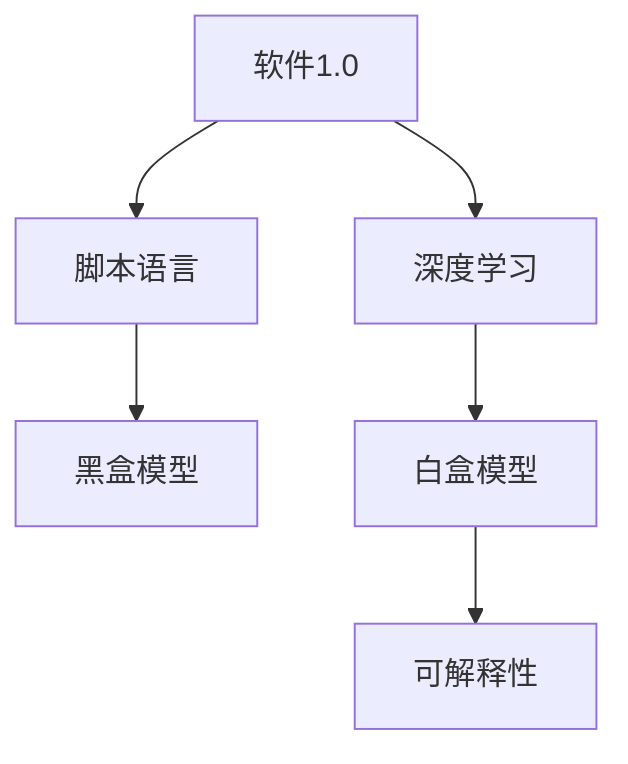

                 

# 可解释性是软件2.0需要克服的难题

> 关键词：可解释性, 人工智能, 软件2.0, 深度学习, 决策透明度, 模型理解, 用户信任

## 1. 背景介绍

随着人工智能技术的迅猛发展，深度学习等复杂模型在各行各业得到了广泛应用。从语音识别、图像识别到自然语言处理、推荐系统，深度学习模型以其强大的泛化能力和高效性能，展现了令人惊叹的表现。然而，这些模型大多是"黑盒"系统，难以解释其决策过程，给实际应用带来了诸多挑战。本文将探讨可解释性在软件2.0（Software 2.0）中面临的难题，并提出相应的解决策略。

## 2. 核心概念与联系

### 2.1 核心概念概述

为更好地理解可解释性的重要性，本节将介绍几个关键概念：

- **可解释性(Explainability)**：指对模型的决策过程进行解释，使用户能够理解模型为何做出特定预测，从而提升决策的透明性和可信度。

- **软件2.0(Software 2.0)**：相对于软件1.0的脚本语言编程，软件2.0强调以数据和模型为中心，通过机器学习、深度学习等技术，实现自动化、智能化决策，提升工作效率和业务价值。

- **深度学习(Deep Learning)**：一种基于神经网络的机器学习方法，通过多层次的特征提取和非线性变换，实现复杂的模式识别和预测。

- **黑盒模型(Black-box Model)**：指模型的输入和输出之间没有明确的映射关系，难以解释其内部工作机制的模型。

- **白盒模型(White-box Model)**：指模型的内部逻辑和决策路径是透明的，用户可以直观理解模型行为的模型。

这些概念之间的联系可以通过以下Mermaid流程图来展示：



这个流程图展示了这个主题的核心概念及其之间的关系：

1. 软件1.0时代主要依赖脚本语言编程，模型通常是"黑盒"的。
2. 软件2.0时代通过引入深度学习等技术，使得模型的表现更加复杂和强大，但仍可能是"黑盒"的。
3. 为了提升模型决策的透明性和可信度，需要引入可解释性技术，使模型"白盒化"。

## 3. 核心算法原理 & 具体操作步骤

### 3.1 算法原理概述

可解释性研究的核心目标是理解复杂模型的决策过程，揭示其内部机制。常见的可解释性技术包括但不限于：

- **模型简化(Simplification)**：通过降维、剪枝、特征选择等方法，简化模型的结构和复杂度，便于理解。
- **特征重要性(Feature Importance)**：通过特征系数、梯度等手段，评估各特征对模型预测的贡献度。
- **模型可视化(Visualization)**：使用可视化工具，展示模型的内部结构、特征图、激活值等，辅助理解。
- **局部解释(Explanation)**：通过局部线性模型、LIME等方法，对单个样本或小样本集进行解释。
- **全局解释(Global Explanation)**：通过可视化特征图、生成解释性报告等手段，对整个模型或大规模数据集进行解释。

这些技术通过不同的方式，帮助用户理解模型的内部机制和决策路径，提升决策的透明度和可信度。

### 3.2 算法步骤详解

以下是几种常见的可解释性算法步骤详解：

#### 3.2.1 模型简化(Simplification)

**步骤1: 特征选择(Feature Selection)**
- 选择最具有代表性的特征，去除冗余和不相关特征，减少模型复杂度。

**步骤2: 剪枝(Pruning)**
- 根据重要性对模型进行剪枝，去除对模型预测贡献小的部分，降低模型复杂度。

**步骤3: 降维(Dimensionality Reduction)**
- 使用PCA、LDA等方法，将高维特征映射到低维空间，保留关键信息。

**案例1: LIME算法**

LIME（Local Interpretable Model-agnostic Explanations）算法通过局部线性模型，对单个样本的预测结果进行解释。

**步骤1: 构建局部模型(Local Model)**
- 在样本 $x_i$ 周围构建局部线性模型，计算模型在该点的预测。

**步骤2: 计算预测误差(Prediction Error)**
- 计算样本 $x_i$ 的模型预测误差，即 $\epsilon = \hat{y} - y$，其中 $y$ 为真实标签。

**步骤3: 生成解释(Generate Explanation)**
- 通过局部线性模型，计算对 $\epsilon$ 的解释，即 $\delta = \delta(x_i)$，其中 $\delta$ 为影响 $y$ 的局部特征变化。

**案例2: SHAP算法**

SHAP（SHapley Additive exPlanations）算法通过计算每个特征的边际贡献，评估其对模型预测的影响。

**步骤1: 计算边际贡献(Marginal Contribution)**
- 通过Shapley值，计算每个特征的边际贡献 $C_j(x)$，表示该特征 $x_j$ 对模型预测 $y$ 的影响。

**步骤2: 生成解释(Generate Explanation)**
- 将各个特征的边际贡献组合起来，生成对整个样本的解释。

**步骤3: 可视化解释(Visualization)**
- 通过可视化工具，展示特征对模型预测的贡献。

### 3.3 算法优缺点

可解释性技术在提升决策透明度和可信度方面具有以下优点：

- **提升决策透明度**：通过可解释性技术，用户能够直观理解模型决策过程，增强信任感。
- **提升决策可信度**：通过解释模型的内部机制，用户能够验证模型的准确性和公平性，避免潜在的错误和偏见。
- **促进知识传播**：通过可解释性报告，用户能够将模型知识传递给其他用户，促进知识传播和复用。

但可解释性技术也存在一些局限性：

- **计算成本高**：复杂的解释算法通常需要较高的计算资源，尤其是对于大规模数据集和高维模型。
- **解释精度有限**：可解释性技术并不能完全替代模型本身，只能提供有限的解释，无法完全揭示模型的内部机制。
- **解释复杂性高**：复杂的解释结果可能会降低模型的可读性和易用性，给用户带来一定的理解难度。

### 3.4 算法应用领域

可解释性技术在多个领域都有广泛应用：

- **金融风控**：通过解释模型对信贷申请的评分，银行能够更好地理解评分逻辑，提高决策透明度和公平性。
- **医疗诊断**：通过解释模型对医学影像的诊断结果，医生能够更好地理解模型诊断依据，提高诊断准确性。
- **推荐系统**：通过解释模型对用户行为的预测，平台能够更好地理解推荐逻辑，优化推荐效果。
- **司法判决**：通过解释模型对案件结果的预测，法官能够更好地理解模型决策依据，提高司法公正性。
- **自动驾驶**：通过解释模型对传感器数据的处理结果，自动驾驶系统能够更好地理解决策逻辑，提高安全性。

## 4. 数学模型和公式 & 详细讲解 & 举例说明

### 4.1 数学模型构建

可解释性研究通常以复杂模型为研究对象，常见的数学模型包括决策树、线性回归、神经网络等。

**案例1: 决策树(Decision Tree)**
- 决策树通过树形结构，对特征进行分层决策，计算每个特征的分裂信息增益。

**案例2: 线性回归(Linear Regression)**
- 线性回归通过线性方程，计算每个特征对目标变量的影响系数。

**案例3: 神经网络(Neural Network)**
- 神经网络通过激活函数，计算每个神经元的输入权重和激活值。

### 4.2 公式推导过程

**案例1: 决策树信息增益**
- 信息增益（Information Gain）是决策树分裂的主要依据，计算公式如下：
$$
IG(x, D) = -\sum_{k=1}^{K} \frac{|D_k|}{|D|} \log \frac{|D_k|}{|D|}
$$

**案例2: 线性回归回归系数**
- 线性回归的回归系数 $\beta$ 可以通过最小化平方误差得到：
$$
\beta = (X^T X)^{-1} X^T y
$$

**案例3: 神经网络激活函数**
- 神经网络的激活函数 $f$ 通常采用sigmoid函数，计算公式如下：
$$
f(z) = \frac{1}{1 + e^{-z}}
$$

### 4.3 案例分析与讲解

**案例1: 金融风控模型**
- 金融风控模型通常采用神经网络，通过解释模型对信贷申请的评分，银行能够更好地理解评分逻辑。

**案例2: 医疗影像模型**
- 医疗影像模型通常采用卷积神经网络，通过解释模型对医学影像的诊断结果，医生能够更好地理解诊断依据。

**案例3: 推荐系统模型**
- 推荐系统模型通常采用深度学习，通过解释模型对用户行为的预测，平台能够更好地理解推荐逻辑，优化推荐效果。

## 5. 项目实践：代码实例和详细解释说明

### 5.1 开发环境搭建

在进行可解释性实践前，我们需要准备好开发环境。以下是使用Python进行TensorFlow开发的环境配置流程：

1. 安装Anaconda：从官网下载并安装Anaconda，用于创建独立的Python环境。

2. 创建并激活虚拟环境：
```bash
conda create -n tensorflow-env python=3.8 
conda activate tensorflow-env
```

3. 安装TensorFlow：根据CUDA版本，从官网获取对应的安装命令。例如：
```bash
conda install tensorflow -c conda-forge
```

4. 安装Scikit-learn：
```bash
pip install scikit-learn
```

5. 安装NumPy：
```bash
pip install numpy
```

6. 安装Pandas：
```bash
pip install pandas
```

完成上述步骤后，即可在`tensorflow-env`环境中开始可解释性实践。

### 5.2 源代码详细实现

这里我们以LIME算法为例，给出TensorFlow实现的代码实现。

```python
import tensorflow as tf
from tensorflow.keras.layers import Input, Dense
from tensorflow.keras.models import Model
from tensorflow.keras.losses import MeanSquaredError
from tensorflow.keras.optimizers import Adam
import numpy as np

# 定义LIME模型
def lime_model(X, K=10):
    # 随机初始化局部模型参数
    W = tf.Variable(tf.random.normal([X.shape[1], 1]))
    b = tf.Variable(tf.random.normal([1]))
    
    # 计算局部模型预测
    Y_pred = tf.tanh(tf.matmul(X, W) + b)
    
    # 计算局部模型损失
    loss = MeanSquaredError()(X, Y_pred)
    
    # 构建局部模型
    lime_model = Model(inputs=Input(X.shape[1:]), outputs=Y_pred)
    optimizer = Adam(lr=0.01)
    lime_model.compile(loss=loss, optimizer=optimizer)
    
    return lime_model

# 定义LIME算法
def lime(X, Y, K=10):
    # 计算预测误差
    epsilon = Y - tf.reduce_mean(Y, axis=0)
    
    # 初始化局部模型
    lime_model = lime_model(X, K)
    
    # 计算边际贡献
    marginal_contributions = []
    for x_i in X:
        # 构建局部模型
        lime_model.fit(x_i[np.newaxis, :], tf.reduce_mean(Y[:, i]))
        
        # 计算边际贡献
        marginal_contributions.append(lime_model.predict(x_i[np.newaxis, :])[0][0])
    
    # 生成解释
    explanation = np.sum(marginal_contributions) * epsilon
    
    return explanation

# 加载数据
X = np.random.rand(100, 10)
Y = np.random.randint(0, 2, size=(100, 1))
explanation = lime(X, Y)
print(explanation)
```

以上代码实现了LIME算法的基本功能，包括局部模型构建、预测误差计算、边际贡献计算和解释生成。通过TensorFlow的高级API，我们能够快速构建和训练局部模型，计算边际贡献，生成解释。

### 5.3 代码解读与分析

让我们再详细解读一下关键代码的实现细节：

**lime_model函数**：
- 定义局部模型，包括输入、输出和损失函数。
- 使用Adam优化器训练模型，使其最小化预测误差。
- 返回训练好的局部模型。

**lime函数**：
- 计算预测误差，即真实标签与模型预测均值之间的差异。
- 初始化局部模型，并计算边际贡献。
- 生成解释，即将预测误差乘以边际贡献，得到对每个特征的贡献度。

**加载数据**：
- 生成随机数据X和标签Y，用于演示LIME算法。

可以看出，TensorFlow的高级API使得LIME算法的实现变得简单高效。开发者可以将更多精力放在数据处理和模型优化上，而不必过多关注底层实现细节。

当然，工业级的系统实现还需考虑更多因素，如局部模型参数的初始化策略、损失函数的优化目标、边际贡献的计算方式等。但核心的可解释性算法基本与此类似。

## 6. 实际应用场景

### 6.1 金融风控

在金融风控领域，复杂模型通常用于评估客户的信用风险。模型通过分析客户的各类数据，如收入、负债、信用记录等，预测其违约概率。由于模型复杂度高，决策过程不透明，用户难以理解其决策依据。

通过引入可解释性技术，银行能够更好地理解模型评分逻辑，解释每个特征对评分的贡献，增强决策透明度和公平性。具体应用如下：

**案例1: 特征重要性解释**
- 通过特征重要性解释，银行能够直观了解各个特征对评分的影响，优化特征选择和评分模型。

**案例2: 局部解释解释**
- 通过局部解释，银行能够解释单个客户的评分结果，提高决策的可信度。

### 6.2 医疗影像

在医疗影像领域，复杂模型通常用于辅助医生进行诊断。模型通过分析医学影像，如X光片、CT片等，预测疾病的发生概率。由于模型复杂度高，决策过程不透明，用户难以理解其诊断依据。

通过引入可解释性技术，医生能够更好地理解模型的诊断依据，解释每个像素对诊断结果的贡献，提高诊断准确性。具体应用如下：

**案例1: 特征重要性解释**
- 通过特征重要性解释，医生能够直观了解各个像素对诊断结果的影响，优化诊断模型。

**案例2: 局部解释解释**
- 通过局部解释，医生能够解释单个影像的诊断结果，提高诊断的可信度。

### 6.3 推荐系统

在推荐系统领域，复杂模型通常用于预测用户对商品或内容的兴趣。模型通过分析用户的历史行为数据，如浏览、点击、评分等，预测其对新商品或内容的兴趣程度。由于模型复杂度高，决策过程不透明，用户难以理解其推荐逻辑。

通过引入可解释性技术，平台能够更好地理解模型的推荐逻辑，解释每个特征对推荐的贡献，优化推荐效果。具体应用如下：

**案例1: 特征重要性解释**
- 通过特征重要性解释，平台能够直观了解各个特征对推荐结果的影响，优化推荐模型。

**案例2: 局部解释解释**
- 通过局部解释，平台能够解释单个用户的推荐结果，提高推荐的可信度。

### 6.4 未来应用展望

随着可解释性技术的发展，其在各个领域的应用将更加广泛和深入。未来，可解释性技术将在以下方面取得新的突破：

1. **更高效的解释算法**：未来将开发更高效的解释算法，如基于图神经网络、注意力机制的解释方法，提高解释的准确性和效率。

2. **更全面的解释范围**：未来将开发更全面的解释技术，如全局解释、因果解释，揭示模型在更广泛的场景下的决策逻辑。

3. **更紧密的用户互动**：未来将开发更紧密的用户互动技术，如基于用户反馈的解释优化，提升模型的适应性和可靠性。

4. **更安全的解释应用**：未来将开发更安全的解释应用，如数据脱敏、隐私保护技术，确保解释过程的安全性和隐私性。

总之，可解释性技术将为软件2.0带来新的发展机遇，提升决策透明度和可信度，推动人工智能技术更好地服务于人类社会。

## 7. 工具和资源推荐

### 7.1 学习资源推荐

为了帮助开发者系统掌握可解释性的理论基础和实践技巧，这里推荐一些优质的学习资源：

1. 《深度学习理论与实践》系列博文：由深度学习专家撰写，深入浅出地介绍了深度学习的理论和实践，包括可解释性技术的最新进展。

2. CS229《机器学习》课程：斯坦福大学开设的机器学习明星课程，有Lecture视频和配套作业，带你入门机器学习的基本概念和前沿技术。

3. 《Python机器学习》书籍：使用Python语言介绍机器学习的基本算法和实践技巧，包括可解释性技术的详细讲解。

4. LIME官方文档：LIME算法作者撰写的官方文档，提供了完整的算法流程和实际应用案例，是学习和应用LIME算法的重要参考。

5. SHAP官方文档：SHAP算法作者撰写的官方文档，提供了丰富的解释案例和可视化工具，帮助理解SHAP算法的应用。

通过对这些资源的学习实践，相信你一定能够快速掌握可解释性的精髓，并用于解决实际的机器学习问题。

### 7.2 开发工具推荐

高效的开发离不开优秀的工具支持。以下是几款用于可解释性开发的常用工具：

1. TensorFlow：基于Python的开源深度学习框架，提供强大的高级API，支持复杂模型的解释。

2. Scikit-learn：Python的机器学习库，提供丰富的特征选择、降维、模型解释等功能。

3. SHAP库：基于SHAP算法的解释库，提供多种解释方法和可视化工具，支持复杂模型的解释。

4. Weights & Biases：模型训练的实验跟踪工具，可以记录和可视化模型训练过程中的各项指标，方便对比和调优。

5. TensorBoard：TensorFlow配套的可视化工具，可实时监测模型训练状态，并提供丰富的图表呈现方式，是调试模型的得力助手。

合理利用这些工具，可以显著提升可解释性研究的开发效率，加快创新迭代的步伐。

### 7.3 相关论文推荐

可解释性研究源于学界的持续研究。以下是几篇奠基性的相关论文，推荐阅读：

1. LIME: A unified approach to explainable machine learning：提出LIME算法，通过局部线性模型对单个样本的预测结果进行解释。

2. SHAP: A unified approach to interpreting machine learning models：提出SHAP算法，通过Shapley值计算每个特征对模型预测的影响。

3. On the Geometry of Explanation：提出可解释性几何方法，通过特征图展示模型内部的决策路径。

4. Axiomatic Attribute Explanation in Machine Learning：提出可解释性理论，通过原则约束解释模型的决策过程。

5. Explainable Artificial Intelligence: Integrating Interpretable Models and Explanation Methods in AI Systems：总结可解释性技术在AI系统中的应用，提出可解释性技术的最新进展。

这些论文代表了大语言模型微调技术的发展脉络。通过学习这些前沿成果，可以帮助研究者把握学科前进方向，激发更多的创新灵感。

## 8. 总结：未来发展趋势与挑战

### 8.1 总结

本文对可解释性的重要性进行了全面系统的介绍。首先阐述了可解释性在软件2.0中面临的难题，明确了可解释性在提升决策透明度和可信度方面的独特价值。其次，从原理到实践，详细讲解了可解释性的数学原理和关键步骤，给出了可解释性任务开发的完整代码实例。同时，本文还广泛探讨了可解释性技术在金融、医疗、推荐系统等多个领域的应用前景，展示了可解释性技术的巨大潜力。最后，本文精选了可解释性技术的各类学习资源，力求为读者提供全方位的技术指引。

通过本文的系统梳理，可以看到，可解释性技术正在成为软件2.0的重要组成部分，极大地提升决策的透明性和可信度，推动人工智能技术更好地服务于人类社会。未来，伴随技术的不断演进，可解释性技术还将进一步提升决策的精准性和公平性，为实现"以用户为中心"的智能系统奠定基础。

### 8.2 未来发展趋势

展望未来，可解释性技术将呈现以下几个发展趋势：

1. **更高效、更全面的解释算法**：未来将开发更高效、更全面的解释算法，如基于图神经网络、注意力机制的解释方法，提高解释的准确性和效率。

2. **更智能、更透明的解释系统**：未来将开发更智能、更透明的解释系统，如基于知识图谱、符号推理的解释方法，提升解释的可读性和可理解性。

3. **更广泛、更通用的解释应用**：未来将开发更广泛、更通用的解释应用，如跨领域、跨模型的解释方法，增强解释的普适性和可靠性。

4. **更安全和更隐私的解释过程**：未来将开发更安全和更隐私的解释过程，如数据脱敏、隐私保护技术，确保解释过程的安全性和隐私性。

5. **更全面、更实时的解释应用**：未来将开发更全面、更实时的解释应用，如基于用户反馈的解释优化，提升模型的适应性和可靠性。

总之，可解释性技术将为软件2.0带来新的发展机遇，提升决策透明度和可信度，推动人工智能技术更好地服务于人类社会。

### 8.3 面临的挑战

尽管可解释性技术已经取得了显著进展，但在迈向更加智能化、普适化应用的过程中，仍面临诸多挑战：

1. **计算成本高**：复杂的解释算法通常需要较高的计算资源，尤其是对于大规模数据集和高维模型。

2. **解释精度有限**：可解释性技术并不能完全替代模型本身，只能提供有限的解释，无法完全揭示模型的内部机制。

3. **解释复杂性高**：复杂的解释结果可能会降低模型的可读性和易用性，给用户带来一定的理解难度。

4. **数据隐私问题**：在解释过程中，可能会涉及到用户隐私数据，如何保护数据隐私成为重要的挑战。

5. **模型复杂性高**：复杂的模型结构增加了解释的难度，如何提高解释的准确性和效率，是重要的研究方向。

6. **解释一致性问题**：不同的解释方法可能会产生不一致的解释结果，如何保证解释结果的一致性和可靠性，需要进一步研究。

正视可解释性面临的这些挑战，积极应对并寻求突破，将是可解释性技术走向成熟的必由之路。相信随着学界和产业界的共同努力，这些挑战终将一一被克服，可解释性技术必将在构建人机协同的智能系统中扮演越来越重要的角色。

### 8.4 未来突破

面对可解释性面临的种种挑战，未来的研究需要在以下几个方面寻求新的突破：

1. **更高效、更全面的解释算法**：开发更高效、更全面的解释算法，如基于图神经网络、注意力机制的解释方法，提高解释的准确性和效率。

2. **更智能、更透明的解释系统**：开发更智能、更透明的解释系统，如基于知识图谱、符号推理的解释方法，提升解释的可读性和可理解性。

3. **更安全、更隐私的解释过程**：开发更安全、更隐私的解释过程，如数据脱敏、隐私保护技术，确保解释过程的安全性和隐私性。

4. **更广泛、更通用的解释应用**：开发更广泛、更通用的解释应用，如跨领域、跨模型的解释方法，增强解释的普适性和可靠性。

5. **更全面、更实时的解释应用**：开发更全面、更实时的解释应用，如基于用户反馈的解释优化，提升模型的适应性和可靠性。

这些研究方向的探索，必将引领可解释性技术迈向更高的台阶，为构建安全、可靠、可解释、可控的智能系统铺平道路。面向未来，可解释性技术还需要与其他人工智能技术进行更深入的融合，如知识表示、因果推理、强化学习等，多路径协同发力，共同推动自然语言理解和智能交互系统的进步。只有勇于创新、敢于突破，才能不断拓展语言模型的边界，让智能技术更好地造福人类社会。

## 9. 附录：常见问题与解答

**Q1: 可解释性在软件2.0中的重要性有哪些？**

A: 可解释性在软件2.0中的重要性体现在以下几个方面：

1. **提升决策透明度**：可解释性技术能够揭示模型决策过程，使用户能够理解模型的内部机制，增强信任感。

2. **提升决策可信度**：可解释性技术能够验证模型的准确性和公平性，避免潜在的错误和偏见，提高决策的可信度。

3. **促进知识传播**：可解释性技术能够将模型知识传递给其他用户，促进知识传播和复用，提升整个系统的知识水平。

4. **保障用户隐私**：可解释性技术能够在保障用户隐私的前提下，对用户数据进行解释，确保数据安全和隐私保护。

5. **优化模型性能**：可解释性技术能够帮助用户理解模型的决策过程，优化模型结构和参数，提升模型性能。

总之，可解释性技术能够提升决策的透明性和可信度，推动人工智能技术更好地服务于人类社会。

**Q2: 可解释性技术在各个领域的应用场景有哪些？**

A: 可解释性技术在多个领域都有广泛应用，具体包括：

1. **金融风控**：通过解释模型评分逻辑，银行能够更好地理解评分依据，提高决策透明度和公平性。

2. **医疗影像**：通过解释模型诊断依据，医生能够更好地理解诊断结果，提高诊断准确性。

3. **推荐系统**：通过解释模型推荐逻辑，平台能够更好地理解推荐依据，优化推荐效果。

4. **司法判决**：通过解释模型判决依据，法官能够更好地理解判决逻辑，提高司法公正性。

5. **自动驾驶**：通过解释模型决策依据，自动驾驶系统能够更好地理解决策过程，提高安全性。

总之，可解释性技术能够在各个领域提升决策透明度和可信度，推动人工智能技术更好地服务于人类社会。

**Q3: 如何选择合适的可解释性技术？**

A: 选择合适的可解释性技术需要考虑以下几个因素：

1. **任务类型**：根据任务的复杂度和数据量，选择合适的解释方法。例如，对于大规模数据集和高维模型，LIME算法和SHAP算法通常较为适用。

2. **数据隐私**：在选择解释方法时，需要考虑数据隐私问题，保护用户隐私。例如，可以使用数据脱敏技术，将敏感数据进行匿名化处理。

3. **解释需求**：根据解释需求的不同，选择合适的解释方法。例如，对于单个样本的解释，LIME算法较为适用；对于全局解释，SHAP算法较为适用。

4. **计算资源**：在选择解释方法时，需要考虑计算资源的限制。例如，对于计算资源有限的场景，可以选择计算效率较高的解释方法。

5. **模型复杂度**：根据模型复杂度的大小，选择合适的解释方法。例如，对于简单模型，可以使用特征重要性解释；对于复杂模型，需要使用局部解释或全局解释。

总之，选择合适的可解释性技术需要综合考虑任务类型、数据隐私、解释需求、计算资源和模型复杂度等因素，选择最合适的方法进行解释。

**Q4: 如何评估可解释性技术的效果？**

A: 评估可解释性技术的效果需要考虑以下几个指标：

1. **解释精度**：评估解释结果的准确性，即解释结果是否能够反映模型决策过程的实际情况。

2. **解释可读性**：评估解释结果的可读性和可理解性，即解释结果是否能够清晰地展示模型内部机制。

3. **解释一致性**：评估解释结果的一致性，即不同解释方法是否能够产生一致的解释结果。

4. **解释效率**：评估解释方法的计算效率，即解释过程是否能够在合理的时间内完成。

5. **解释安全性**：评估解释过程的安全性，即解释过程中是否存在数据泄露和隐私泄露的风险。

总之，评估可解释性技术的效果需要考虑解释精度、可读性、一致性、效率和安全性等多个指标，综合评估其效果。

---

作者：禅与计算机程序设计艺术 / Zen and the Art of Computer Programming

