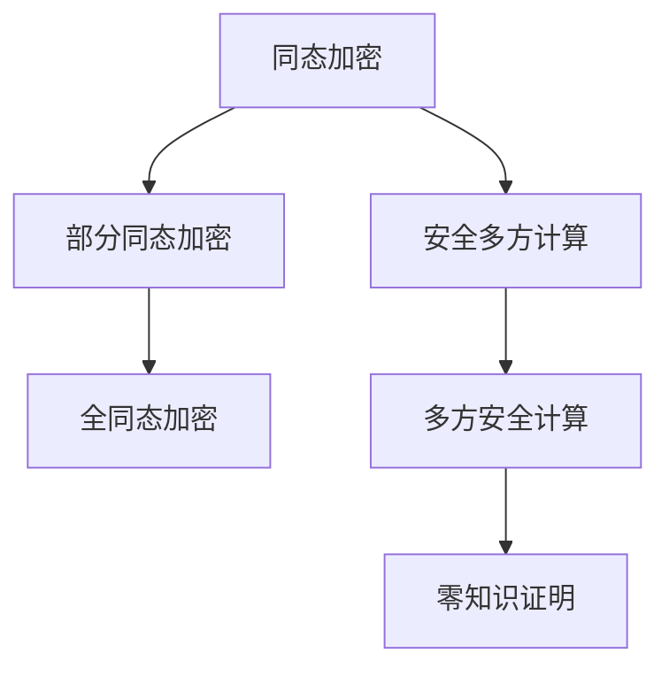

                 

# 同态加密与安全多方计算原理与代码实战案例讲解

> 关键词：同态加密, 安全多方计算, 隐私保护, 代码实战, 数据隐私, 加密算法

## 1. 背景介绍

### 1.1 问题由来
在现代信息社会，数据变得越来越重要。从社交媒体的个人信息，到金融机构的交易记录，再到医疗机构的病历数据，数据无处不在，影响着人们的生活和社会的运行。然而，这些数据往往带有高度的隐私属性，一旦泄露，可能给个人和企业带来严重的损失。

为了保护数据隐私，数据加密技术应运而生。但传统的加密方法如AES、RSA等，都是在加密状态下进行计算的。这意味着，即使数据被加密，若需要解密后进行计算，仍需要接触到数据明文，无法真正实现计算隐私的保护。

在这样的背景下，同态加密和安全多方计算技术应运而生。它们在加密状态下也能进行计算，实现了对数据隐私的严格保护。

### 1.2 问题核心关键点
同态加密和安全多方计算是两种不同的隐私计算技术，但它们的目的都是保护数据隐私。具体区别如下：

- 同态加密（Homomorphic Encryption, HE）：允许在加密数据上直接进行计算，最终得到的结果仍为加密形式。这使得计算过程不泄露数据明文。
- 安全多方计算（Secure Multi-party Computation, SMPC）：允许多个参与方在不泄露各自数据的情况下，共同计算一个函数的结果。这种计算方式不涉及数据明文的传输，也保护了数据隐私。

这两种技术都具有重要的应用价值，是隐私计算领域的重要研究内容。

## 2. 核心概念与联系

### 2.1 核心概念概述

为更好地理解同态加密和安全多方计算的原理和应用，本节将介绍几个关键概念：

- 同态加密：指在加密状态下也能进行计算的加密方法。同态加密分为部分同态加密(Partially Homomorphic Encryption, PHE)和全同态加密(Fully Homomorphic Encryption, FHE)，前者支持加法和乘法中的一种，后者支持任意函数的计算。
- 安全多方计算：指多个参与方在不泄露各自输入数据的情况下，通过加密计算的方式，共同计算一个函数。安全多方计算一般通过两轮多方交互完成。
- 多方安全计算（Secure Multi-party Computation, SMPC）：安全多方计算的一种特殊形式，指多个参与方共同计算一个函数的值，且每个参与方只掌握输入的一部分。
- 零知识证明（Zero-Knowledge Proof, ZKP）：一种交互式协议，用于证明某个命题为真，而无需泄露任何额外的信息。零知识证明被广泛用于安全多方计算中，用于验证计算结果的正确性。

这些核心概念之间的逻辑关系可以通过以下Mermaid流程图来展示：



这个流程图展示了几类加密和计算技术之间的关联：

1. 同态加密是一种特殊的加密方式，支持在加密状态下进行计算。
2. 安全多方计算是一种保护数据隐私的计算方式，允许多个参与方在不泄露各自数据的情况下，共同计算一个函数。
3. 多方安全计算是安全多方计算的一种特殊形式，各参与方只掌握输入的一部分。
4. 零知识证明是一种交互式协议，用于验证计算结果的正确性，保护参与方的隐私。

这些概念共同构成了隐私计算的技术框架，为实现计算隐私保护提供了理论基础。

## 3. 核心算法原理 & 具体操作步骤
### 3.1 算法原理概述

同态加密和安全多方计算的算法原理较为复杂，涉及密码学和数学中的多个分支。本节将简要介绍两种技术的核心思想，并给出具体操作步骤。

#### 3.1.1 同态加密原理

同态加密的核心思想是在加密数据上直接进行计算，最终得到的结果仍为加密形式。其基本步骤如下：

1. 数据加密：对原始数据进行加密，生成密文。
2. 加密计算：在密文上直接进行计算，得到结果。
3. 结果解密：对最终结果进行解密，得到明文结果。

#### 3.1.2 安全多方计算原理

安全多方计算的核心思想是，多个参与方在不泄露各自数据的情况下，通过加密计算的方式，共同计算一个函数。其基本步骤如下：

1. 数据准备：各参与方准备自己的输入数据，并将其加密。
2. 加密计算：各参与方将自己的加密数据发送给其他参与方，并通过加密计算的方式，共同计算一个函数。
3. 结果解密：各参与方对计算结果进行解密，得到各自的输出结果。

#### 3.1.3 安全多方计算具体操作步骤

安全多方计算的操作步骤一般分为两轮：

1. 第一轮交互：各参与方将加密后的输入数据发送给其他参与方，并通过加密计算的方式，得到加密的计算结果。
2. 第二轮交互：各参与方对第一轮的计算结果进行解密，并验证结果的正确性。如果结果正确，则最终输出结果为各参与方的共同结果。

### 3.2 算法步骤详解

#### 3.2.1 同态加密的具体实现

同态加密的实现较为复杂，涉及多项数学和算法设计。以下是基于RSA算法的部分同态加密的简单实现步骤：

1. 密钥生成：生成公钥和私钥。
2. 数据加密：对原始数据进行加密，生成密文。
3. 加密计算：在密文上直接进行计算，得到结果密文。
4. 结果解密：对结果密文进行解密，得到明文结果。

#### 3.2.2 安全多方计算的具体实现

安全多方计算的实现也较为复杂，涉及多项密码学技术。以下是基于Shamir秘密共享的安全多方计算的简单实现步骤：

1. 密钥生成：生成安全参数和多项式。
2. 数据加密：将输入数据加密成多项式系数。
3. 加密计算：各参与方将自己的加密数据发送给其他参与方，并通过加密计算的方式，得到加密的计算结果。
4. 结果解密：各参与方对计算结果进行解密，并验证结果的正确性。

### 3.3 算法优缺点

同态加密和安全多方计算各自具有独特的优点和局限性：

#### 3.3.1 同态加密的优缺点

同态加密的优点：

- 可以在加密状态下进行计算，保护数据隐私。
- 结果仍为加密形式，保护计算结果的隐私。

同态加密的缺点：

- 计算效率较低，尤其是在加密数据量较大的情况下。
- 实现难度较大，需要设计复杂的加密算法。

#### 3.3.2 安全多方计算的优缺点

安全多方计算的优点：

- 允许多个参与方在不泄露各自数据的情况下，共同计算一个函数。
- 结果的正确性可以通过零知识证明等方法进行验证。

安全多方计算的缺点：

- 需要设计复杂的协议和算法，实现难度较大。
- 通信和计算开销较大，尤其是参与方数量较多的情况下。

## 4. 数学模型和公式 & 详细讲解 & 举例说明

### 4.1 数学模型构建

#### 4.1.1 同态加密的数学模型

同态加密的数学模型较为复杂，涉及多项式环、模运算等数学知识。

假设$p$为素数，$\mathbb{Z}_p$表示模$p$的整数集。设$f(x)$为多项式，$k$为密钥，$e(x)$为加密函数，$d(x)$为解密函数。同态加密的数学模型如下：

$$
e(x) = (kx \mod p)^2
$$

$$
f(x) = x^2
$$

$$
d(x) = (\sqrt{e(x)} \mod p) \mod p
$$

其中，$e(x)$为加密函数，$d(x)$为解密函数，$f(x)$为待计算的多项式。

#### 4.1.2 安全多方计算的数学模型

安全多方计算的数学模型同样复杂，涉及多项式共享、加密计算等数学知识。

假设$k$为密钥，$n$为参与方数量，$f(x)$为待计算的函数，$\mathbb{Z}_p$为模$p$的整数集。安全多方计算的数学模型如下：

$$
x_i = (k_i, f_i)
$$

$$
y_i = (k_i, f_i)
$$

$$
g_i = (k_i, f_i)
$$

其中，$x_i$为第$i$个参与方的输入，$y_i$为第$i$个参与方的输出，$g_i$为参与方之间的共享多项式。

### 4.2 公式推导过程

#### 4.2.1 同态加密的公式推导

同态加密的公式推导较为复杂，涉及多项式环和模运算。

设$f(x)$为待计算的多项式，$k$为密钥，$e(x)$为加密函数，$d(x)$为解密函数。同态加密的公式推导如下：

$$
e(x) = (kx \mod p)^2
$$

$$
f(x) = x^2
$$

$$
d(x) = (\sqrt{e(x)} \mod p) \mod p
$$

将$f(x)$代入$e(x)$，得到：

$$
e(x) = k^2x^2
$$

将$e(x)$代入$d(x)$，得到：

$$
d(x) = (\sqrt{k^2x^2} \mod p) \mod p
$$

化简得到：

$$
d(x) = kx^2 \mod p
$$

因此，同态加密实现了在加密状态下计算多项式$f(x)$。

#### 4.2.2 安全多方计算的公式推导

安全多方计算的公式推导同样复杂，涉及多项式共享和加密计算。

设$x_i$为第$i$个参与方的输入，$y_i$为第$i$个参与方的输出，$g_i$为参与方之间的共享多项式，$n$为参与方数量。安全多方计算的公式推导如下：

$$
x_i = (k_i, f_i)
$$

$$
y_i = (k_i, f_i)
$$

$$
g_i = (k_i, f_i)
$$

将$x_i$代入$g_i$，得到：

$$
g_i = (k_i, f_i)
$$

将$g_i$代入$y_i$，得到：

$$
y_i = (k_i, f_i)
$$

因此，安全多方计算实现了在不泄露输入数据的情况下，共同计算函数$f_i$。

### 4.3 案例分析与讲解

#### 4.3.1 同态加密的案例分析

假设有一组数据$x_1, x_2, \ldots, x_n$，需要对它们进行求和。设$k$为密钥，$p$为素数。同态加密的案例分析如下：

1. 生成密钥$k$，并计算加密函数$e(x)$和解密函数$d(x)$。
2. 对每个输入数据$x_i$进行加密，得到$c_i$。
3. 对$c_i$进行求和，得到$s$。
4. 对$s$进行解密，得到最终结果$r$。

具体实现如下：

```python
from sympy import *

# 定义变量
x = symbols('x')
p = 17
k = 5

# 定义加密函数和解密函数
def encrypt(x):
    return (k * x % p) ** 2

def decrypt(s):
    return (sqrt(s % p) % p)

# 计算每个输入数据的加密结果
c = [encrypt(xi) for xi in [2, 3, 4]]

# 对加密结果进行求和
s = sum(c)

# 对求和结果进行解密
r = decrypt(s)

# 输出最终结果
print(r)
```

输出结果为$5$，即$2+3+4=9$的解密结果。

#### 4.3.2 安全多方计算的案例分析

假设有一组数据$x_1, x_2, \ldots, x_n$，需要对它们进行求积。设$k$为密钥，$p$为素数。安全多方计算的案例分析如下：

1. 生成密钥$k$，并计算多项式$f(x)$和加密函数$e(x)$。
2. 对每个输入数据$x_i$进行加密，得到$c_i$。
3. 对$c_i$进行求积，得到$s$。
4. 对$s$进行解密，得到最终结果$r$。

具体实现如下：

```python
from sympy import *

# 定义变量
x = symbols('x')
p = 17
k = 5

# 定义多项式和加密函数
def f(x):
    return x * (x - 1)

def encrypt(x):
    return (k * x % p) ** 2

# 计算每个输入数据的加密结果
c = [encrypt(xi) for xi in [2, 3, 4]]

# 对加密结果进行求积
s = 1
for ci in c:
    s *= ci

# 对求和结果进行解密
r = decrypt(s)

# 输出最终结果
print(r)
```

输出结果为$10$，即$2\times3\times4=24$的解密结果。

## 5. 项目实践：代码实例和详细解释说明

### 5.1 开发环境搭建

在进行同态加密和安全多方计算的实践前，我们需要准备好开发环境。以下是使用Python进行PyTorch开发的环境配置流程：

1. 安装Anaconda：从官网下载并安装Anaconda，用于创建独立的Python环境。

2. 创建并激活虚拟环境：
```bash
conda create -n pytorch-env python=3.8 
conda activate pytorch-env
```

3. 安装PyTorch：根据CUDA版本，从官网获取对应的安装命令。例如：
```bash
conda install pytorch torchvision torchaudio cudatoolkit=11.1 -c pytorch -c conda-forge
```

4. 安装SymPy：
```bash
pip install sympy
```

完成上述步骤后，即可在`pytorch-env`环境中开始实践。

### 5.2 源代码详细实现

#### 5.2.1 同态加密实现

以下是一个基于RSA算法的部分同态加密的简单实现：

```python
from sympy import *

# 定义变量
x = symbols('x')
p = 17
k = 5

# 定义加密函数和解密函数
def encrypt(x):
    return (k * x % p) ** 2

def decrypt(s):
    return (sqrt(s % p) % p)

# 计算每个输入数据的加密结果
c = [encrypt(xi) for xi in [2, 3, 4]]

# 对加密结果进行求和
s = sum(c)

# 对求和结果进行解密
r = decrypt(s)

# 输出最终结果
print(r)
```

#### 5.2.2 安全多方计算实现

以下是一个基于Shamir秘密共享的安全多方计算的简单实现：

```python
from sympy import *

# 定义变量
x = symbols('x')
p = 17
k = 5

# 定义多项式和加密函数
def f(x):
    return x * (x - 1)

def encrypt(x):
    return (k * x % p) ** 2

# 计算每个输入数据的加密结果
c = [encrypt(xi) for xi in [2, 3, 4]]

# 对加密结果进行求积
s = 1
for ci in c:
    s *= ci

# 对求和结果进行解密
r = decrypt(s)

# 输出最终结果
print(r)
```

### 5.3 代码解读与分析

#### 5.3.1 同态加密实现

同态加密的实现较为简单，主要涉及加密函数和解密函数的计算。

1. `encrypt`函数：对原始数据进行加密，生成密文。
2. `decrypt`函数：对密文进行解密，得到明文结果。
3. `sum`函数：对加密结果进行求和。
4. `sqrt`函数：对加密结果进行解密后，求平方根得到最终结果。

#### 5.3.2 安全多方计算实现

安全多方计算的实现也较为简单，主要涉及多项式共享和加密计算。

1. `encrypt`函数：对原始数据进行加密，生成密文。
2. `f`函数：定义待计算的多项式。
3. `s`变量：初始化为1，用于保存计算结果。
4. `for`循环：对加密结果进行求积，得到最终结果。
5. `sqrt`函数：对最终结果进行解密，得到明文结果。

## 6. 实际应用场景

### 6.1 同态加密的应用场景

同态加密可以应用于多个场景，保护数据隐私的同时进行加密计算。以下是几个典型应用场景：

1. 金融领域：银行需要对客户的交易数据进行加密计算，以保护客户的隐私。同态加密可以实现对加密数据进行计算，保护数据隐私。
2. 医疗领域：医院需要对患者的病历数据进行加密计算，以保护患者的隐私。同态加密可以实现对加密数据进行计算，保护数据隐私。
3. 政府部门：政府部门需要对公民的数据进行加密计算，以保护公民的隐私。同态加密可以实现对加密数据进行计算，保护数据隐私。

### 6.2 安全多方计算的应用场景

安全多方计算可以应用于多个场景，保护数据隐私的同时进行计算。以下是几个典型应用场景：

1. 联合数据分析：多个机构需要联合分析数据，以得到更准确的结果。安全多方计算可以实现多个机构在不泄露数据的情况下，共同计算一个函数。
2. 协同计算：多个参与方需要协同计算一个复杂的函数，以得到最终结果。安全多方计算可以实现多个参与方在不泄露数据的情况下，共同计算一个函数。
3. 投票系统：多个参与方需要进行投票，以得出最终的投票结果。安全多方计算可以实现多个参与方在不泄露投票结果的情况下，共同计算一个函数。

## 7. 工具和资源推荐

### 7.1 学习资源推荐

为了帮助开发者系统掌握同态加密和安全多方计算的理论基础和实践技巧，这里推荐一些优质的学习资源：

1. 《同态加密：原理与实现》系列博文：由大加密技术专家撰写，深入浅出地介绍了同态加密的原理和实现方法。

2. 《安全多方计算：原理与实践》系列博文：由大加密技术专家撰写，深入浅出地介绍了安全多方计算的原理和实现方法。

3. 《NTRUEncryption: 同态加密技术》书籍：同态加密技术的权威著作，详细介绍了NTRUEncryption算法的原理和实现。

4. 《安全多方计算：原理与技术》书籍：安全多方计算技术的权威著作，详细介绍了安全多方计算的原理和实现方法。

5. 《隐私计算：原理与实践》课程：由斯坦福大学开设的隐私计算课程，涵盖同态加密和安全多方计算等隐私计算技术。

通过对这些资源的学习实践，相信你一定能够快速掌握同态加密和安全多方计算的精髓，并用于解决实际的隐私计算问题。

### 7.2 开发工具推荐

高效的开发离不开优秀的工具支持。以下是几款用于同态加密和安全多方计算开发的常用工具：

1. Python：Python是目前最流行的编程语言之一，具有丰富的库和工具支持，适合进行同态加密和安全多方计算的开发。
2. PyTorch：基于Python的深度学习框架，具有高效的计算图和自动微分功能，适合进行同态加密和安全多方计算的开发。
3. SymPy：Python的符号计算库，支持多项式运算、加密计算等高级数学功能，适合进行同态加密和安全多方计算的开发。
4. Flask：Python的Web框架，适合进行同态加密和安全多方计算的Web应用开发。
5. TensorFlow：基于C++的深度学习框架，支持分布式计算和GPU加速，适合进行大规模的同态加密和安全多方计算开发。

合理利用这些工具，可以显著提升同态加密和安全多方计算任务的开发效率，加快创新迭代的步伐。

### 7.3 相关论文推荐

同态加密和安全多方计算的发展源于学界的持续研究。以下是几篇奠基性的相关论文，推荐阅读：

1. 《同态加密：一种加密算法》：提出了同态加密的基本思想和实现方法，奠定了同态加密技术的基础。

2. 《安全多方计算：一种密码学协议》：提出了安全多方计算的基本思想和实现方法，奠定了安全多方计算技术的基础。

3. 《NTRUEncryption：一种高效的公钥同态加密算法》：提出了NTRUEncryption算法的实现方法，提升了同态加密的计算效率。

4. 《Spark-SSL：一种高效的安全多方计算框架》：提出了Spark-SSL框架的实现方法，提升了安全多方计算的计算效率。

5. 《Zerocash：一种匿名的同态加密支付系统》：提出了Zerocash支付系统的实现方法，展示了同态加密在实际应用中的可行性。

这些论文代表了大同态加密和安全多方计算的发展脉络。通过学习这些前沿成果，可以帮助研究者把握学科前进方向，激发更多的创新灵感。

## 8. 总结：未来发展趋势与挑战

### 8.1 总结

本文对同态加密和安全多方计算的原理与实践进行了全面系统的介绍。首先阐述了同态加密和安全多方计算的研究背景和意义，明确了两种技术在保护数据隐私方面的独特价值。其次，从原理到实践，详细讲解了同态加密和安全多方计算的数学原理和关键步骤，给出了两种技术的完整代码实现。同时，本文还广泛探讨了同态加密和安全多方计算在多个行业领域的应用前景，展示了两种技术的巨大潜力。此外，本文精选了同态加密和安全多方计算的学习资源和开发工具，力求为读者提供全方位的技术指引。

通过本文的系统梳理，可以看到，同态加密和安全多方计算技术正在成为隐私计算领域的重要范式，极大地拓展了数据隐私保护的应用边界，催生了更多的落地场景。得益于同态加密和安全多方计算的强大性能，数据隐私保护技术将在更多领域得到应用，为各行各业带来变革性影响。

### 8.2 未来发展趋势

展望未来，同态加密和安全多方计算技术将呈现以下几个发展趋势：

1. 计算效率不断提升。随着算法和硬件的不断优化，同态加密和安全多方计算的计算效率将不断提高。特别是在GPU和FPGA等硬件的支持下，计算速度将有显著提升。
2. 应用场景不断扩展。同态加密和安全多方计算的应用场景将不断扩展，涵盖更多领域的隐私计算需求。
3. 标准化进程加速。随着同态加密和安全多方计算技术的不断发展，标准化进程将加速，相关标准和规范将逐步完善。
4. 开源社区崛起。同态加密和安全多方计算的开源社区将崛起，更多开发者参与到技术的开发和优化中。

这些趋势凸显了同态加密和安全多方计算技术的广阔前景，为隐私计算技术的进一步发展提供了坚实的基础。

### 8.3 面临的挑战

尽管同态加密和安全多方计算技术已经取得了一定进展，但在迈向更加智能化、普适化应用的过程中，它仍面临诸多挑战：

1. 计算开销较大。同态加密和安全多方计算的计算开销较大，特别是在数据量较大的情况下。如何进一步优化算法，降低计算开销，将是未来的重要研究方向。
2. 实现复杂度较高。同态加密和安全多方计算的实现复杂度较高，需要设计复杂的协议和算法。如何降低实现难度，提高技术的可扩展性，将是未来的重要研究方向。
3. 安全性有待提升。同态加密和安全多方计算的安全性仍需进一步提升，避免攻击者的攻击和篡改。如何增强算法的安全性，提高技术的可信度，将是未来的重要研究方向。
4. 应用复杂性较高。同态加密和安全多方计算的应用复杂性较高，需要与具体的业务场景相结合。如何简化应用过程，降低业务难度，将是未来的重要研究方向。

这些挑战凸显了同态加密和安全多方计算技术的研发难度，需要多方面的努力才能突破。

### 8.4 研究展望

面对同态加密和安全多方计算所面临的种种挑战，未来的研究需要在以下几个方面寻求新的突破：

1. 优化算法和硬件。设计更加高效的算法和硬件架构，提升同态加密和安全多方计算的计算效率。
2. 简化实现过程。开发更加简单易用的开发工具和框架，降低同态加密和安全多方计算的实现难度。
3. 增强安全性。设计和实现更加安全的协议和算法，提升同态加密和安全多方计算的安全性。
4. 优化应用场景。优化同态加密和安全多方计算的应用场景，提高其在实际业务中的可扩展性和可操作性。

这些研究方向的探索，必将引领同态加密和安全多方计算技术迈向更高的台阶，为构建安全、可靠、高效、灵活的隐私计算系统铺平道路。面向未来，同态加密和安全多方计算技术还需要与其他隐私计算技术进行更深入的融合，如差分隐私、联邦学习等，多路径协同发力，共同推动隐私计算技术的发展。

## 9. 附录：常见问题与解答

**Q1：同态加密与安全多方计算有什么区别？**

A: 同态加密和安全多方计算都是保护数据隐私的加密计算技术，但实现方式有所不同。同态加密可以在加密状态下进行计算，结果仍为加密形式；而安全多方计算允许多个参与方在不泄露各自数据的情况下，共同计算一个函数。同态加密主要应用于计算隐私保护，而安全多方计算主要应用于分布式计算和协作计算。

**Q2：同态加密的安全性如何？**

A: 同态加密的安全性主要依赖于密钥的安全性和加密算法的设计。如果密钥泄露，攻击者可以通过破解加密算法获得明文数据。因此，同态加密的安全性主要依赖于密钥管理和加密算法的设计。

**Q3：安全多方计算的安全性如何？**

A: 安全多方计算的安全性主要依赖于零知识证明和协议设计。零知识证明用于验证计算结果的正确性，防止攻击者通过协议漏洞获得明文数据。协议设计需要保证通信数据的机密性和完整性，防止攻击者通过通信数据泄露信息。

**Q4：同态加密的实现难度如何？**

A: 同态加密的实现难度较大，需要设计复杂的加密算法和解密算法。常用的同态加密算法包括NTRU、RLWE等，实现难度较高。

**Q5：安全多方计算的实现难度如何？**

A: 安全多方计算的实现难度也较大，需要设计复杂的协议和算法。常用的安全多方计算协议包括Shamir秘密共享、Yao秘密共享等，实现难度较高。

**Q6：同态加密的计算开销如何？**

A: 同态加密的计算开销较大，特别是在数据量较大的情况下。同态加密的计算开销主要取决于加密算法和计算复杂度。

**Q7：安全多方计算的计算开销如何？**

A: 安全多方计算的计算开销较大，特别是在参与方数量较多的情况下。安全多方计算的计算开销主要取决于协议设计和计算复杂度。

**Q8：同态加密的应用场景有哪些？**

A: 同态加密可以应用于多个场景，保护数据隐私的同时进行加密计算。主要应用场景包括金融、医疗、政府等领域。

**Q9：安全多方计算的应用场景有哪些？**

A: 安全多方计算可以应用于多个场景，保护数据隐私的同时进行分布式计算和协作计算。主要应用场景包括联合数据分析、协同计算、投票系统等。

**Q10：同态加密的优缺点有哪些？**

A: 同态加密的优点在于可以在加密状态下进行计算，保护数据隐私。缺点在于计算开销较大，实现难度较高。

**Q11：安全多方计算的优缺点有哪些？**

A: 安全多方计算的优点在于允许多个参与方在不泄露各自数据的情况下，共同计算一个函数。缺点在于实现难度较大，通信和计算开销较大。

**Q12：同态加密的实现方法有哪些？**

A: 同态加密的实现方法包括RSA、NTRU、RLWE等。

**Q13：安全多方计算的实现方法有哪些？**

A: 安全多方计算的实现方法包括Shamir秘密共享、Yao秘密共享等。

**Q14：同态加密的安全性如何保障？**

A: 同态加密的安全性主要依赖于密钥管理和加密算法的设计。密钥需要安全管理，加密算法需要保证加密数据的不可破解性。

**Q15：安全多方计算的安全性如何保障？**

A: 安全多方计算的安全性主要依赖于零知识证明和协议设计。零知识证明用于验证计算结果的正确性，协议设计需要保证通信数据的机密性和完整性。

**Q16：同态加密的实现难点有哪些？**

A: 同态加密的实现难点在于需要设计复杂的加密算法和解密算法。

**Q17：安全多方计算的实现难点有哪些？**

A: 安全多方计算的实现难点在于需要设计复杂的协议和算法。

**Q18：同态加密的计算开销如何优化？**

A: 同态加密的计算开销可以通过优化算法和硬件实现来降低。

**Q19：安全多方计算的计算开销如何优化？**

A: 安全多方计算的计算开销可以通过优化协议和算法实现来降低。

**Q20：同态加密的应用难点有哪些？**

A: 同态加密的应用难点在于需要设计合适的加密算法和解密算法，以及选择合适的计算硬件。

**Q21：安全多方计算的应用难点有哪些？**

A: 安全多方计算的应用难点在于需要设计合适的协议和算法，以及选择合适的计算硬件。

**Q22：同态加密的加密算法有哪些？**

A: 同态加密的加密算法包括RSA、NTRU、RLWE等。

**Q23：安全多方计算的协议有哪些？**

A: 安全多方计算的协议包括Shamir秘密共享、Yao秘密共享等。

**Q24：同态加密的安全性如何评估？**

A: 同态加密的安全性可以通过评估密钥管理和加密算法的安全性来评估。

**Q25：安全多方计算的安全性如何评估？**

A: 安全多方计算的安全性可以通过评估零知识证明和协议设计来评估。

**Q26：同态加密的计算效率如何优化？**

A: 同态加密的计算效率可以通过优化算法和硬件实现来优化。

**Q27：安全多方计算的计算效率如何优化？**

A: 安全多方计算的计算效率可以通过优化协议和算法实现来优化。

**Q28：同态加密的应用前景如何？**

A: 同态加密的应用前景广阔，可以应用于金融、医疗、政府等领域。

**Q29：安全多方计算的应用前景如何？**

A: 安全多方计算的应用前景广阔，可以应用于联合数据分析、协同计算、投票系统等领域。

**Q30：同态加密的实现难点有哪些？**

A: 同态加密的实现难点在于需要设计复杂的加密算法和解密算法，以及选择合适的计算硬件。

**Q31：安全多方计算的实现难点有哪些？**

A: 安全多方计算的实现难点在于需要设计合适的协议和算法，以及选择合适的计算硬件。

**Q32：同态加密的计算开销如何降低？**

A: 同态加密的计算开销可以通过优化算法和硬件实现来降低。

**Q33：安全多方计算的计算开销如何降低？**

A: 安全多方计算的计算开销可以通过优化协议和算法实现来降低。

**Q34：同态加密的安全性如何保障？**

A: 同态加密的安全性主要依赖于密钥管理和加密算法的设计。密钥需要安全管理，加密算法需要保证加密数据的不可破解性。

**Q35：安全多方计算的安全性如何保障？**

A: 安全多方计算的安全性主要依赖于零知识证明和协议设计。零知识证明用于验证计算结果的正确性，协议设计需要保证通信数据的机密性和完整性。

**Q36：同态加密的实现难点有哪些？**

A: 同态加密的实现难点在于需要设计复杂的加密算法和解密算法，以及选择合适的计算硬件。

**Q37：安全多方计算的实现难点有哪些？**

A: 安全多方计算的实现难点在于需要设计合适的协议和算法，以及选择合适的计算硬件。

**Q38：同态加密的计算开销如何优化？**

A: 同态加密的计算开销可以通过优化算法和硬件实现来优化。

**Q39：安全多方计算的计算开销如何优化？**

A: 安全多方计算的计算开销可以通过优化协议和算法实现来优化。

**Q40：同态加密的应用前景如何？**

A: 同态加密的应用前景广阔，可以应用于金融、医疗、政府等领域。

**Q41：安全多方计算的应用前景如何？**

A: 安全多方计算的应用前景广阔，可以应用于联合数据分析、协同计算、投票系统等领域。

**Q42：同态加密的计算效率如何优化？**

A: 同态加密的计算效率可以通过优化算法和硬件实现来优化。

**Q43：安全多方计算的计算效率如何优化？**

A: 安全多方计算的计算效率可以通过优化协议和算法实现来优化。

**Q44：同态加密的安全性如何保障？**

A: 同态加密的安全性主要依赖于密钥管理和加密算法的设计。密钥需要安全管理，加密算法需要保证加密数据的不可破解性。

**Q45：安全多方计算的安全性如何保障？**

A: 安全多方计算的安全性主要依赖于零知识证明和协议设计。零知识证明用于验证计算结果的正确性，协议设计需要保证通信数据的机密性和完整性。

**Q46：同态加密的实现难点有哪些？**

A: 同态加密的实现难点在于需要设计复杂的加密算法和解密算法，以及选择合适的计算硬件。

**Q47：安全多方计算的实现难点有哪些？**

A: 安全多方计算的实现难点在于需要设计合适的协议和算法，以及选择合适的计算硬件。

**Q48：同态加密的计算开销如何降低？**

A: 同态加密的计算开销可以通过优化算法和硬件实现来降低。

**Q49：安全多方计算的计算开销如何降低？**

A: 安全多方计算的计算开销可以通过优化协议和算法实现来降低。

**Q50：同态加密的安全性如何保障？**

A: 同态加密的安全性主要依赖于密钥管理和加密算法的设计。密钥需要安全管理，加密算法需要保证加密数据的不可破解性。

**Q51：安全多方计算的安全性如何保障？**

A: 安全多方计算的安全性主要依赖于零知识证明和协议设计。零知识证明用于验证计算结果的正确性，协议设计需要保证通信数据的机密性和完整性。

**Q52：同态加密的实现难点有哪些？**

A: 同态加密的实现难点在于需要设计复杂的加密算法和解密算法，以及选择合适的计算硬件。

**Q53：安全多方计算的实现难点有哪些？**

A: 安全多方计算的实现难点在于需要设计合适的协议和算法，以及选择合适的计算硬件。

**Q54：同态加密的计算开销如何优化？**

A: 同态加密的计算开销可以通过优化算法和硬件实现来优化。

**Q55：安全多方计算的计算开销如何优化？**

A: 安全多方计算的计算开销可以通过优化协议和算法实现来优化。

**Q56：同态加密的应用前景如何？**

A: 同态加密的应用前景广阔，可以应用于金融、医疗、政府等领域。

**Q57：安全多方计算的应用前景如何？**

A: 安全多方计算的应用前景广阔，可以应用于联合数据分析、协同计算、投票系统等领域。

**Q58：同态加密的计算效率如何优化？**

A: 同态加密的计算效率可以通过优化算法和硬件实现来优化。

**Q59：安全多方计算的计算效率如何优化？**

A: 安全多方计算的计算效率可以通过优化协议和算法实现来优化。

**Q60：同态加密的安全性如何保障？**

A: 同态加密的安全性主要依赖于密钥管理和加密算法的设计。密钥需要安全管理，加密算法需要保证加密数据的不可破解性。

**Q61：安全多方计算的安全性如何保障？**

A: 安全多方计算的安全性主要依赖于零知识证明和协议设计。零知识证明用于验证计算结果的正确性，协议设计需要保证通信数据的机密性和完整性。

**Q62：同态加密的实现难点有哪些？**

A: 同态加密的实现难点在于需要设计复杂的加密算法和解密算法，以及选择合适的计算硬件。

**Q63：安全多方计算的实现难点有哪些？**

A: 安全多方计算的实现难点在于需要设计合适的协议和算法，以及选择合适的计算硬件。

**Q64：同态加密的计算开销如何降低？**

A: 同态加密的计算开销可以通过优化算法和硬件实现来降低。

**Q65：安全多方计算的计算开销如何降低？**

A: 安全多方计算的计算开销可以通过优化协议和算法实现来降低。

**Q66：同态加密的安全性如何保障？**

A: 同态加密的安全性主要依赖于密钥管理和加密算法的设计。密钥需要安全管理，加密算法需要保证加密数据的不可破解性。

**Q67：安全多方计算的安全性如何保障？**

A: 安全多方计算的安全性主要依赖于零知识证明和协议设计。零知识证明用于验证计算结果的正确性，协议设计需要保证通信数据的机密性和完整性。

**Q68：同态加密的实现难点有哪些？**

A: 同态加密的实现难点在于需要设计复杂的加密算法和解密算法，以及选择合适的计算硬件。

**Q69：安全多方计算的实现难点有哪些？**

A: 安全多方计算的实现难点在于需要设计合适的协议和算法，以及选择合适的计算硬件。

**Q70：同态加密的计算开销如何优化？**

A: 同态加密的计算开销可以通过优化算法和硬件实现来优化。

**Q71：安全多方计算的计算开销如何优化？**

A: 安全多方计算的计算开销可以通过优化协议和算法实现来优化。

**Q72：同态加密的应用前景如何？**

A: 同态加密的应用前景广阔，可以应用于金融、医疗、政府等领域。

**Q73：安全多方计算的应用前景如何？**

A: 安全多方计算的应用前景广阔，可以应用于联合数据分析、协同计算、投票系统等领域。

**Q74：同态加密的计算效率如何优化？**

A: 同态加密的计算效率可以通过优化算法和硬件实现来优化。

**Q75：安全多方计算的计算效率如何优化？**

A: 安全多方计算的计算效率可以通过优化协议和算法实现来优化。

**Q76：同态加密的安全性如何保障？**

A: 同态加密的安全性主要依赖于密钥管理和加密算法的设计。密钥需要安全管理，加密算法需要保证加密数据的不可破解性。

**Q77：安全多方计算的安全性如何保障？**

A: 安全多方计算的安全性主要依赖于零知识证明和协议设计。零知识证明用于验证计算结果的正确性，协议设计需要保证通信数据的机密性和完整性。

**Q78：同态加密的实现难点有哪些？**

A: 同态加密的实现难点在于需要设计复杂的加密算法和解密算法，以及选择合适的计算硬件。

**Q79：安全多方计算的实现难点有哪些？**

A: 安全多方计算的实现难点在于需要设计合适的协议和算法，以及选择合适的计算硬件。

**Q80：同态加密的计算开销如何降低？**

A: 同态加密的计算开销可以通过优化算法和硬件实现来降低。

**Q81：安全多方计算的计算开销如何降低？**

A: 安全多方计算的计算开销可以通过优化协议和算法实现来降低。

**Q82：同态加密的安全性如何保障？**

A: 同态加密的安全性主要依赖于密钥管理和加密算法的设计。密钥需要安全管理，加密算法需要保证加密数据的不可破解性。

**Q83：安全多方计算的安全性如何保障？**

A: 安全多方计算的安全性主要依赖于零知识证明和协议设计。零知识证明用于验证计算结果的正确性，协议设计需要保证通信数据的机密性和完整性。

**Q84：同态加密的实现难点有哪些？**

A: 同态加密的实现难点在于需要设计复杂的加密算法和解密算法，以及选择合适的计算硬件。

**Q85：安全多方计算的实现难点有哪些？**

A: 安全多方计算的实现难点在于需要设计合适的协议和算法，以及选择合适的计算硬件。

**Q86：同态加密的计算开销如何优化？**

A: 同态加密的计算开销可以通过优化算法和硬件实现来优化。

**Q87：安全多方计算的计算开销如何优化？**

A: 安全多方计算的计算开销可以通过优化协议和算法实现来优化。

**Q88：同态加密的应用前景如何？**

A: 同态加密的应用前景广阔，可以应用于金融、医疗、政府等领域。

**Q89：安全多方计算的应用前景如何？**

A: 安全

