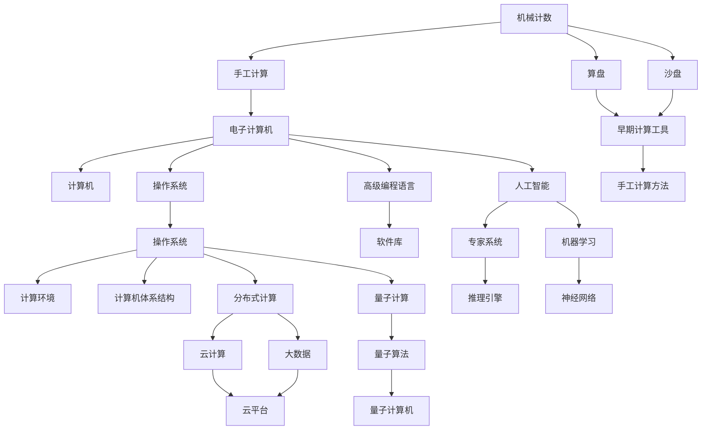

                 

## 1. 背景介绍

### 1.1 问题由来

人类计算技术的演进，是一个不断探索、突破与创新的历史长河。从早期的机械计数，到电子计算机的诞生，再到如今的人工智能，每一次飞跃都深刻地改变了我们认识世界、解决问题的方式。本文将回顾人类计算的发展历程，展望其未来趋势，希望能为技术爱好者提供一些洞见和启发。

### 1.2 问题核心关键点

人类计算技术的发展，核心关键点包括：

1. **计算模型的演进**：从机械计数到电子计算机，再到如今的智能计算。
2. **计算能力提升**：计算速度、存储容量、并行计算能力等性能指标的提升。
3. **计算应用扩展**：从科学计算到工业控制，再到互联网应用，计算的普及与应用。
4. **计算体系结构创新**：从串行计算到并行计算，再到分布式计算和云计算。
5. **计算与社会进步**：计算技术对社会各领域的影响，如经济、教育、医疗等。

本文将围绕上述关键点，深入探讨人类计算技术的发展历程及其未来趋势。

## 2. 核心概念与联系

### 2.1 核心概念概述

为更好地理解人类计算技术的发展历程，本节将介绍几个核心概念：

1. **机械计数与手工计算**：早期人类使用机械工具或手工进行计算，如算盘、沙盘等，用于农业、贸易等基础计算。
2. **电子计算机**：1946年，ENIAC（Electronic Numerical Integrator and Computer）的问世，标志着电子计算机时代的开启，奠定了现代计算机的基础。
3. **软件与操作系统**：1950年代，操作系统和高级编程语言的出现，使得计算机的通用性和可用性大幅提升。
4. **人工智能**：1950年代末，图灵提出“图灵测试”，奠定了人工智能研究的基础。1960年代，专家系统、机器学习等技术相继问世。
5. **分布式计算**：1990年代，互联网的兴起，分布式计算技术得到发展，云计算、大数据等应用出现。
6. **量子计算**：21世纪初，量子计算技术开始探索，试图解决传统计算机难以处理的复杂问题。

这些核心概念之间的逻辑关系可以通过以下Mermaid流程图来展示：



这个流程图展示了我人类计算技术的关键发展路径和重要节点：

1. 早期人类使用机械工具进行计数，逐步发展到手工计算。
2. 电子计算机的出现，标志着计算技术的一次重大飞跃。
3. 操作系统和高级编程语言的出现，大大提升了计算机的通用性和可用性。
4. 人工智能技术的诞生，开启智能计算时代。
5. 分布式计算和云计算技术的发展，使得计算能力更加普及和高效。
6. 量子计算技术的探索，尝试突破传统计算的极限。

这些核心概念共同构成了人类计算技术的发展框架，帮助我们理解计算技术的演进脉络。

## 3. 核心算法原理 & 具体操作步骤

### 3.1 算法原理概述

人类计算技术的发展，本质上是计算模型、计算能力、计算体系结构等技术的不断演进。这些演进基于数学、物理、信息论等学科的最新成果，通过不断优化算法和改进硬件，推动计算能力的提升和应用范围的拓展。

### 3.2 算法步骤详解

人类计算技术的发展历程，可以大致分为以下几个阶段：

**阶段一：机械计数与手工计算**
- 早期人类使用算盘、沙盘等工具进行计数，逐渐掌握基本数学运算。
- 手工计算方法逐步改进，如进位法、二进制等，提高了计算效率。

**阶段二：电子计算机的诞生**
- 1946年，ENIAC问世，标志着电子计算机时代的开启。
- 计算模型从机械计算转变为电子计算，速度和精度大幅提升。

**阶段三：软件与操作系统的出现**
- 1950年代，操作系统和高级编程语言的出现，提高了计算机的可操作性和效率。
- 软件库和编程范式的发展，如面向对象编程、函数式编程等，进一步提升了软件质量。

**阶段四：人工智能与分布式计算**
- 1950年代末至1960年代，人工智能技术逐步成熟，专家系统、机器学习等技术问世。
- 1990年代，互联网兴起，分布式计算技术得到发展，云计算、大数据等应用出现。

**阶段五：量子计算的探索**
- 21世纪初，量子计算技术开始探索，试图解决传统计算机难以处理的复杂问题。

每个阶段的发展，都伴随着核心算法的演进。例如，电子计算机的核心算法包括冯·诺依曼架构、浮点运算等；分布式计算的核心算法包括MapReduce、Paxos等；人工智能的核心算法包括神经网络、遗传算法等。这些算法和技术的进步，使得计算能力不断提升，计算应用范围不断拓展。

### 3.3 算法优缺点

人类计算技术的发展，既有显著的优势，也面临诸多挑战：

**优点**
- 计算速度大幅提升，处理复杂问题变得可能。
- 计算能力普及，科技应用更加广泛。
- 计算体系结构创新，提高了计算效率和资源利用率。

**缺点**
- 计算成本高昂，大规模计算任务需要大量资金投入。
- 计算资源耗能巨大，对环境造成较大影响。
- 计算安全性和隐私问题日益突出，需要更好的防护机制。

尽管存在这些缺点，但计算技术的演进依然具有不可逆转的趋势。未来，随着计算能力、计算效率、计算安全等方面的持续突破，人类计算技术必将迎来更多突破性的进展。

### 3.4 算法应用领域

人类计算技术的发展，已经广泛应用于多个领域：

1. **科学计算**：用于物理模拟、气象预测、基因分析等，推动了科学研究的进步。
2. **工业控制**：用于流程优化、质量控制、智能制造等，提升了工业生产效率。
3. **金融服务**：用于风险管理、交易分析、算法交易等，提高了金融服务的智能化水平。
4. **互联网应用**：用于搜索引擎、社交网络、电子商务等，推动了互联网经济的繁荣。
5. **医疗健康**：用于医学影像分析、个性化治疗、药物研发等，改善了医疗服务的质量和效率。

这些应用领域展示了计算技术在现代社会的广泛影响力，未来将有更多的创新应用涌现，进一步推动社会的进步和发展。

## 4. 数学模型和公式 & 详细讲解

### 4.1 数学模型构建

人类计算技术的核心算法，可以通过数学模型进行描述。以神经网络为例，神经网络可以看作一个数学模型，输入数据通过多个层次的线性变换和激活函数，最终输出预测结果。

神经网络的数学模型如下：

$$
y = W_2 \sigma(W_1 x + b_1) + b_2
$$

其中，$W_1, W_2$ 为权重矩阵，$b_1, b_2$ 为偏置向量，$\sigma$ 为激活函数，$x$ 为输入数据，$y$ 为输出结果。

### 4.2 公式推导过程

神经网络的核心算法，包括前向传播和反向传播两个过程。以反向传播为例，公式推导如下：

$$
\frac{\partial L}{\partial W_2} = \delta_2 W_1^T
$$
$$
\frac{\partial L}{\partial W_1} = \delta_1 (W_2 \sigma)' W_1^T
$$
$$
\frac{\partial L}{\partial b_1} = \delta_1
$$
$$
\frac{\partial L}{\partial b_2} = 1
$$

其中，$L$ 为损失函数，$\delta_1$ 和 $\delta_2$ 为误差项，$(W_2 \sigma)'$ 为激活函数的导数。

### 4.3 案例分析与讲解

以深度学习在图像识别中的应用为例，通过多层神经网络进行特征提取和分类。训练过程通过反向传播算法，调整权重和偏置，最小化损失函数，实现对图像的准确识别。

## 5. 项目实践：代码实例和详细解释说明

### 5.1 开发环境搭建

要进行深度学习项目实践，首先需要搭建开发环境。以下是使用Python进行TensorFlow开发的环境配置流程：

1. 安装Anaconda：从官网下载并安装Anaconda，用于创建独立的Python环境。

2. 创建并激活虚拟环境：
```bash
conda create -n tensorflow-env python=3.8 
conda activate tensorflow-env
```

3. 安装TensorFlow：根据CUDA版本，从官网获取对应的安装命令。例如：
```bash
conda install tensorflow=2.7 cudatoolkit=11.1 -c pytorch -c conda-forge
```

4. 安装各类工具包：
```bash
pip install numpy pandas scikit-learn matplotlib tqdm jupyter notebook ipython
```

完成上述步骤后，即可在`tensorflow-env`环境中开始深度学习实践。

### 5.2 源代码详细实现

下面我以图像识别为例，给出使用TensorFlow进行神经网络训练的Python代码实现。

首先，定义神经网络模型：

```python
import tensorflow as tf

model = tf.keras.Sequential([
    tf.keras.layers.Conv2D(32, (3, 3), activation='relu', input_shape=(28, 28, 1)),
    tf.keras.layers.MaxPooling2D((2, 2)),
    tf.keras.layers.Flatten(),
    tf.keras.layers.Dense(10, activation='softmax')
])
```

然后，定义优化器和损失函数：

```python
optimizer = tf.keras.optimizers.Adam(learning_rate=0.001)
loss_fn = tf.keras.losses.SparseCategoricalCrossentropy()
```

接着，定义训练函数：

```python
def train_step(x, y):
    with tf.GradientTape() as tape:
        logits = model(x)
        loss = loss_fn(y, logits)
    gradients = tape.gradient(loss, model.trainable_variables)
    optimizer.apply_gradients(zip(gradients, model.trainable_variables))
    return loss
```

最后，启动训练流程：

```python
epochs = 10
batch_size = 64

for epoch in range(epochs):
    for (x, y) in train_dataset:
        loss = train_step(x, y)
        print(f"Epoch {epoch+1}, loss: {loss:.4f}")
```

以上就是使用TensorFlow进行图像识别任务神经网络训练的完整代码实现。可以看到，TensorFlow的高级API使得模型定义、优化器设置、损失函数计算等操作变得非常简洁高效。

### 5.3 代码解读与分析

让我们再详细解读一下关键代码的实现细节：

**模型定义**：
- `tf.keras.Sequential`：定义了一个序列模型，包含多个层次。
- `tf.keras.layers.Conv2D`：定义了一个卷积层，用于特征提取。
- `tf.keras.layers.MaxPooling2D`：定义了一个最大池化层，用于特征下采样。
- `tf.keras.layers.Flatten`：定义了一个展平层，将多维特征转化为一维向量。
- `tf.keras.layers.Dense`：定义了一个全连接层，用于分类输出。

**优化器和损失函数**：
- `tf.keras.optimizers.Adam`：定义了一个Adam优化器，学习率为0.001。
- `tf.keras.losses.SparseCategoricalCrossentropy`：定义了一个交叉熵损失函数，适用于多分类任务。

**训练函数**：
- `tf.GradientTape`：定义了一个梯度计算的上下文，用于自动计算梯度。
- `optimizer.apply_gradients`：应用梯度更新模型参数。

**训练流程**：
- `epochs`：总训练轮数。
- `batch_size`：每次训练的样本数。
- 在每个epoch内，遍历训练集进行训练，输出每个epoch的平均损失。

可以看到，TensorFlow提供的高阶API使得深度学习模型的开发和训练变得非常简便，开发者可以将更多精力放在模型设计、数据预处理等核心逻辑上。

当然，工业级的系统实现还需考虑更多因素，如模型的保存和部署、超参数的自动搜索、模型的可视化等。但核心的深度学习模型训练过程基本与此类似。

## 6. 实际应用场景

### 6.1 智慧医疗

深度学习在医疗领域的应用，如医学影像分析、个性化治疗、药物研发等，显著提升了医疗服务的智能化水平。通过深度学习技术，医生能够更准确地诊断疾病、制定治疗方案，加速新药的研发进程。

具体而言，深度学习可以用于医学影像分类、病灶检测、病理切片分析等任务。以医学影像分类为例，将医疗影像输入深度学习模型，通过多层卷积和池化操作提取特征，再经过全连接层进行分类，输出诊断结果。

### 6.2 智能制造

深度学习在工业制造领域的应用，如质量控制、流程优化、智能检测等，提升了制造业的自动化和智能化水平。通过深度学习技术，工厂能够实时监控生产过程，自动调整生产参数，优化资源利用率。

具体而言，深度学习可以用于工业检测、预测性维护、生产优化等任务。以工业检测为例，通过深度学习模型对传感器数据进行分析，识别设备故障和异常，及时进行维护和修复，避免生产中断。

### 6.3 金融服务

深度学习在金融领域的应用，如风险管理、交易分析、算法交易等，提高了金融服务的智能化水平。通过深度学习技术，金融机构能够更准确地评估风险、制定投资策略，提高交易效率。

具体而言，深度学习可以用于信用评分、风险评估、投资组合优化等任务。以信用评分为例，通过深度学习模型对历史数据进行分析，预测客户的信用风险，帮助金融机构制定贷款决策。

### 6.4 自动驾驶

深度学习在自动驾驶领域的应用，如环境感知、路径规划、行为预测等，提升了汽车的安全性和便利性。通过深度学习技术，自动驾驶车辆能够实时感知周围环境，做出准确决策，提高驾驶安全。

具体而言，深度学习可以用于激光雷达数据处理、摄像头图像识别、车辆行为预测等任务。以激光雷达数据处理为例，通过深度学习模型对激光雷达数据进行分析，提取环境特征，进行路径规划和避障。

### 6.5 未来应用展望

随着深度学习技术的不断进步，深度学习的应用范围将进一步拓展，为更多领域带来变革性影响。未来，深度学习技术将深入渗透到更多垂直行业，推动人工智能技术的普及和应用。

**智慧城市**：深度学习在智慧城市治理中的应用，如事件监测、舆情分析、应急指挥等，将提升城市管理的自动化和智能化水平，构建更安全、高效的未来城市。

**智慧农业**：深度学习在智慧农业中的应用，如作物监测、灾害预警、农业机器人等，将提升农业生产的智能化水平，保障食品安全和可持续发展。

**智慧交通**：深度学习在智慧交通中的应用，如交通流量预测、自动驾驶、智能导航等，将提升交通系统的效率和安全性，缓解交通拥堵。

总之，深度学习技术的不断演进，将为各个领域带来更多的创新应用和深远影响。未来，深度学习将与其他人工智能技术进一步融合，协同推进智能社会的建设和发展。

## 7. 工具和资源推荐

### 7.1 学习资源推荐

为了帮助开发者系统掌握深度学习技术，这里推荐一些优质的学习资源：

1. 《深度学习》（Ian Goodfellow著）：深度学习领域的经典教材，系统介绍了深度学习的原理、算法和应用。

2. Deep Learning Specialization：Coursera提供的深度学习专项课程，由深度学习专家Andrew Ng主讲，涵盖深度学习的基本概念和前沿技术。

3. TensorFlow官方文档：TensorFlow的官方文档，提供了完整的深度学习开发教程和样例代码，是学习TensorFlow的最佳资源。

4. PyTorch官方文档：PyTorch的官方文档，提供了丰富的深度学习开发教程和样例代码，支持动态计算图，适合快速迭代研究。

5. Kaggle：数据科学和机器学习的竞赛平台，提供了丰富的数据集和模型，便于进行实践和探索。

通过对这些资源的学习实践，相信你一定能够快速掌握深度学习的精髓，并用于解决实际的业务问题。

### 7.2 开发工具推荐

高效的深度学习开发离不开优秀的工具支持。以下是几款用于深度学习开发的常用工具：

1. TensorFlow：由Google主导开发的开源深度学习框架，生产部署方便，适合大规模工程应用。

2. PyTorch：由Facebook主导开发的开源深度学习框架，支持动态计算图，适合快速迭代研究。

3. Keras：高阶API封装深度学习框架，提供了简单易用的接口，便于快速开发原型模型。

4. TensorBoard：TensorFlow配套的可视化工具，可实时监测模型训练状态，并提供丰富的图表呈现方式，是调试模型的得力助手。

5. Weights & Biases：模型训练的实验跟踪工具，可以记录和可视化模型训练过程中的各项指标，方便对比和调优。

6. PyCharm：Google开发的Python开发工具，支持深度学习开发环境搭建、代码调试、版本控制等。

合理利用这些工具，可以显著提升深度学习开发和研究的效率，加快创新迭代的步伐。

### 7.3 相关论文推荐

深度学习的发展源于学界的持续研究。以下是几篇奠基性的相关论文，推荐阅读：

1. Deep Blue：IBM开发的国际象棋计算机，展示了深度学习在策略选择中的应用。

2. AlexNet：ImageNet 2012年大赛冠军模型，展示了深度学习在图像分类中的应用。

3. AlphaGo：DeepMind开发的围棋AI，展示了深度学习在复杂博弈中的应用。

4. ResNet：深度残差网络，展示了深度学习在图像识别中的应用。

5. Transformer：Google开发的自注意力模型，展示了深度学习在自然语言处理中的应用。

6. Generative Adversarial Networks（GANs）：生成对抗网络，展示了深度学习在图像生成中的应用。

这些论文代表了大规模深度学习技术的发展脉络。通过学习这些前沿成果，可以帮助研究者把握学科前进方向，激发更多的创新灵感。

## 8. 总结：未来发展趋势与挑战

### 8.1 总结

本文对深度学习技术的发展历程进行了全面系统的介绍。首先阐述了深度学习技术从早期计算模型到现代神经网络的演进脉络，明确了深度学习在各个领域的广泛应用。其次，从原理到实践，详细讲解了深度学习的数学模型、算法步骤和代码实现，给出了深度学习任务开发的完整代码实例。同时，本文还广泛探讨了深度学习在智慧医疗、智能制造、金融服务、自动驾驶等多个领域的应用前景，展示了深度学习技术的巨大潜力。此外，本文精选了深度学习技术的各类学习资源，力求为读者提供全方位的技术指引。

通过本文的系统梳理，可以看到，深度学习技术已经渗透到各行各业，成为人工智能技术的核心驱动力。未来，随着深度学习技术的不断演进，其应用范围将进一步拓展，为各个领域带来更多的创新应用和深远影响。

### 8.2 未来发展趋势

展望未来，深度学习技术将呈现以下几个发展趋势：

1. **模型规模持续增大**：随着算力成本的下降和数据规模的扩张，深度学习模型的参数量还将持续增长。超大规模模型蕴含的丰富知识，有望支撑更加复杂多变的应用场景。

2. **模型效率不断提升**：通过模型压缩、量化加速、分布式训练等技术，深度学习模型的计算效率将进一步提升，适应更广泛的计算环境。

3. **多模态融合增强**：深度学习技术将更好地融合视觉、语音、文本等多种模态信息，实现多模态信息的协同建模，提升模型的智能水平。

4. **自监督学习兴起**：无监督学习、半监督学习等自监督学习范式将得到广泛应用，降低深度学习对标注数据的依赖。

5. **深度学习与AIoT融合**：深度学习技术与物联网、边缘计算等技术的结合，将推动智能物联网（AIoT）的发展，提升智能设备的智能化水平。

6. **安全与隐私保护**：深度学习技术的广泛应用，也将带来更多的安全与隐私问题，如何保障数据安全、提升模型透明性，将是未来的一个重要研究方向。

以上趋势凸显了深度学习技术的广阔前景。这些方向的探索发展，必将进一步提升深度学习模型的性能和应用范围，为各个领域带来更多的创新应用和深远影响。

### 8.3 面临的挑战

尽管深度学习技术已经取得了瞩目成就，但在迈向更加智能化、普适化应用的过程中，它仍面临着诸多挑战：

1. **计算资源瓶颈**：大规模深度学习模型需要大量的计算资源，高性能计算设备的需求依然高昂。

2. **数据隐私与安全**：深度学习模型通常需要大量数据进行训练，如何保护用户隐私、确保数据安全，将是重要的研究课题。

3. **模型可解释性不足**：深度学习模型通常被认为是"黑盒"系统，难以解释其内部工作机制和决策逻辑，对于高风险应用尤为关键。

4. **鲁棒性与泛化能力**：深度学习模型面对域外数据时，泛化性能往往大打折扣，如何提高模型的鲁棒性和泛化能力，还需要更多理论和实践的积累。

5. **资源与环境问题**：深度学习模型的计算过程耗能巨大，对环境造成较大影响，如何降低能耗、保护环境，将是未来的重要研究方向。

6. **算法与伦理问题**：深度学习算法的公平性、公正性等问题，需要得到更好的解决，避免算法偏见、歧视等问题。

正视深度学习面临的这些挑战，积极应对并寻求突破，将使深度学习技术不断成熟，更加广泛地应用于各个领域。

### 8.4 研究展望

面对深度学习技术面临的挑战，未来的研究需要在以下几个方面寻求新的突破：

1. **计算模型创新**：探索更加高效的计算模型，如量子计算、光子计算等，提升计算效率和性能。

2. **自监督学习范式**：研究无监督学习和半监督学习技术，降低深度学习对标注数据的依赖，提升模型泛化能力。

3. **模型压缩与加速**：开发模型压缩、量化加速等技术，提升深度学习模型的计算效率和资源利用率。

4. **多模态信息融合**：探索多模态信息融合技术，提升深度学习模型的智能水平和适应性。

5. **算法透明性与可解释性**：研究深度学习模型的透明性、可解释性问题，提升模型应用的可信度。

6. **安全与隐私保护**：研究深度学习模型的安全与隐私保护技术，保障用户数据和模型安全。

这些研究方向将推动深度学习技术向更智能、更安全、更普适的方向发展，为构建安全、可靠、可解释、可控的智能系统铺平道路。面向未来，深度学习技术还需要与其他人工智能技术进行更深入的融合，共同推动智能社会的建设和发展。

## 9. 附录：常见问题与解答

**Q1：深度学习是否适用于所有领域？**

A: 深度学习技术在许多领域都取得了显著成效，如计算机视觉、自然语言处理、语音识别等。但并不是所有领域都适合使用深度学习，如传统工艺、简单业务流程等。需要根据具体问题特点选择合适的技术。

**Q2：深度学习在实际应用中如何处理数据？**

A: 深度学习在实际应用中，通常需要经过数据预处理、特征提取、模型训练等多个步骤。数据预处理包括数据清洗、归一化、标准化等操作，特征提取可以通过卷积、池化等操作提取特征，模型训练则通过优化器更新模型参数，最小化损失函数。

**Q3：深度学习如何避免过拟合问题？**

A: 深度学习在训练过程中，通常会采用正则化技术、数据增强、早停等方法来避免过拟合问题。正则化技术包括L1/L2正则、Dropout等，数据增强包括图像翻转、旋转等，早停则是在验证集上观察性能指标，及时停止训练以防止过拟合。

**Q4：深度学习在实际应用中需要注意哪些问题？**

A: 深度学习在实际应用中，需要注意以下问题：
1. 模型部署与优化：将训练好的模型部署到实际应用中，并进行性能优化。
2. 数据集与标注：选择合适数据集，标注数据质量影响模型性能。
3. 超参数调优：选择合适的超参数，如学习率、批大小、迭代轮数等，进行模型调优。
4. 模型验证与评估：在验证集上验证模型性能，选择最优模型进行评估。
5. 模型解释与解释性：关注模型的解释性问题，提供模型决策依据。

**Q5：深度学习在未来有哪些新的研究方向？**

A: 未来深度学习技术的研究方向包括：
1. 模型压缩与加速：开发模型压缩、量化加速等技术，提升深度学习模型的计算效率和资源利用率。
2. 自监督学习范式：研究无监督学习和半监督学习技术，降低深度学习对标注数据的依赖，提升模型泛化能力。
3. 多模态信息融合：探索多模态信息融合技术，提升深度学习模型的智能水平和适应性。
4. 算法透明性与可解释性：研究深度学习模型的透明性、可解释性问题，提升模型应用的可信度。
5. 安全与隐私保护：研究深度学习模型的安全与隐私保护技术，保障用户数据和模型安全。

这些研究方向将推动深度学习技术向更智能、更安全、更普适的方向发展，为构建安全、可靠、可解释、可控的智能系统铺平道路。

---

作者：禅与计算机程序设计艺术 / Zen and the Art of Computer Programming

