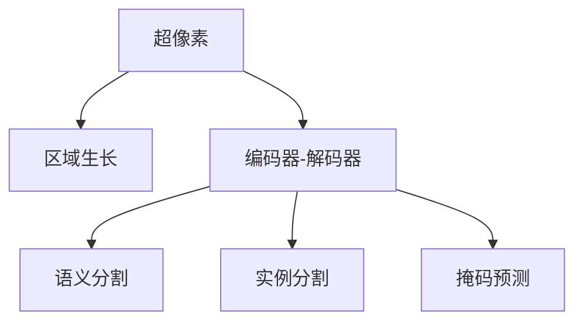

                 

# 图像分割 (Image Segmentation) 原理与代码实例讲解

> 关键词：图像分割, 超像素, 区域生长, 深度学习, 编码器-解码器, 语义分割, 实例分割, 掩码预测, 神经网络

## 1. 背景介绍

图像分割是计算机视觉和模式识别中的一项重要任务，其目标是将一幅图像分成多个互不重叠的、具有明确语义意义的区域。图像分割的应用非常广泛，包括医学影像分析、自动驾驶、工业检测、图像编辑等。

传统的图像分割方法依赖于手工设计的特征和规则，难以适应复杂的场景变化。随着深度学习技术的发展，神经网络逐渐成为图像分割的主流手段。本文将介绍几种常见的基于深度学习的图像分割方法，包括超像素分割、区域生长、编码器-解码器架构等。

## 2. 核心概念与联系

### 2.1 核心概念概述

图像分割涉及多个核心概念，包括超像素、区域生长、编码器-解码器、语义分割、实例分割、掩码预测等。以下将对这些概念进行详细阐述，并展示其相互联系的Mermaid流程图。

#### 超像素 (SuperPixel)
超像素是将图像分割成具有局部同质性的像素集，使得相邻的像素属于同一超像素。超像素分割利用聚类算法将图像分成大像素块，减少了需要分割的像素数量，从而提高了分割效率。

#### 区域生长 (Region Growing)
区域生长是从图像中随机选取一个种子像素，以该像素为中心，逐步向外扩展，将所有相邻像素归入同一区域。区域生长是一种基于像素相似性准则的分割方法，适用于图像中存在明显边界的情况。

#### 编码器-解码器 (Encoder-Decoder)
编码器-解码器架构由一个编码器和解码器组成，分别用于特征提取和特征重建。编码器将图像压缩为低维特征表示，解码器将特征表示转换为像素级别的分割结果。

#### 语义分割 (Semantic Segmentation)
语义分割是指将图像中的每个像素分配到一个预定义的语义类别中，如道路、建筑、天空等。语义分割不仅关注边界，还注重像素级的分类，适用于需要精确识别物体类别的场景。

#### 实例分割 (Instance Segmentation)
实例分割不仅能识别图像中的不同物体类别，还能将同一类别的物体实例分割出来。实例分割通常通过实例级别的分类和掩码预测实现，适用于需要识别多个相同物体的场景。

#### 掩码预测 (Mask Prediction)
掩码预测是指对每个像素预测一个掩码，表示该像素是否属于前景（物体）。掩码预测通常与实例分割一起使用，用于提取物体边界。

### 2.2 Mermaid 流程图

以下是展示这些概念相互联系的Mermaid流程图：



这个流程图展示了超像素和区域生长之间的关系，以及编码器-解码器架构如何用于语义分割、实例分割和掩码预测。

## 3. 核心算法原理 & 具体操作步骤

### 3.1 算法原理概述

基于深度学习的图像分割算法主要分为两类：像素级的分割方法和实例级的分割方法。以下是这两类方法的原理概述。

#### 像素级分割
像素级分割方法直接将每个像素分类到一个预定义的类别中。其中，区域生长和超像素分割属于像素级分割方法，主要依赖像素间的相似性进行分割。

#### 实例级分割
实例级分割方法不仅识别出不同物体类别，还能对同一类别的多个实例进行分割。掩码预测和语义分割属于实例级分割方法，通过分类和掩码预测实现。

### 3.2 算法步骤详解

以下是几种常见的图像分割算法详细步骤详解：

#### 超像素分割
超像素分割通常采用K-means聚类算法或均值漂移算法对图像进行聚类，将像素分成大像素块，从而减少需要分割的像素数量。超像素分割的步骤如下：

1. 选择合适的超像素算法，如K-means、Mean Shift等。
2. 初始化超像素种子点。
3. 对每个像素计算与种子点的相似度，找到最近的种子点。
4. 将像素合并到最近的超像素块中。
5. 重复3-4步，直到所有像素都被合并。

#### 区域生长
区域生长通常从图像中随机选取一个种子像素，以该像素为中心，逐步向外扩展，将所有相邻像素归入同一区域。区域生长的步骤如下：

1. 选取种子像素。
2. 计算种子像素的邻域像素。
3. 选择邻域像素中与种子像素相似度最高的像素，将其添加到当前区域。
4. 重复2-3步，直到所有与种子像素相似度高的像素都被归入当前区域。

#### 编码器-解码器
编码器-解码器架构由一个编码器和解码器组成。编码器将图像压缩为低维特征表示，解码器将特征表示转换为像素级别的分割结果。编码器-解码器架构的步骤如下：

1. 输入图像经过编码器，得到特征表示。
2. 特征表示通过解码器生成像素级别的分割结果。
3. 分割结果经过后处理，得到最终的分割图像。

#### 语义分割
语义分割通过分类网络将每个像素分类到一个预定义的语义类别中。常用的分类网络包括U-Net、DeepLab、Mask R-CNN等。语义分割的步骤如下：

1. 输入图像经过编码器，得到特征表示。
2. 特征表示通过分类器生成每个像素的类别概率。
3. 类别概率经过后处理，得到最终的分割图像。

#### 实例分割
实例分割通过分类和掩码预测对同一类别的多个实例进行分割。常用的实例分割网络包括Mask R-CNN、YOLACT、CenterNet等。实例分割的步骤如下：

1. 输入图像经过特征提取网络，得到特征表示。
2. 特征表示经过分类网络，生成每个像素的类别概率。
3. 特征表示经过掩码预测网络，生成每个像素的掩码。
4. 掩码与类别概率结合，得到最终的实例分割结果。

#### 掩码预测
掩码预测通过网络预测每个像素的掩码，表示该像素是否属于前景（物体）。常用的掩码预测网络包括PSPNet、Fcn、UNet等。掩码预测的步骤如下：

1. 输入图像经过特征提取网络，得到特征表示。
2. 特征表示经过掩码预测网络，生成每个像素的掩码。
3. 掩码经过后处理，得到最终的掩码预测结果。

### 3.3 算法优缺点

#### 超像素分割
超像素分割的优点包括：
- 分割速度快，适用于大规模图像。
- 分割结果较为平滑，适合用于背景去噪、图像压缩等。

超像素分割的缺点包括：
- 分割粒度较大，难以识别细微的物体边缘。
- 对图像中物体的细节不够精细，适用于粗略的图像分割。

#### 区域生长
区域生长的优点包括：
- 分割结果较为准确，适合用于图像中存在明显边界的情况。
- 简单易懂，易于实现。

区域生长的缺点包括：
- 分割结果受种子点位置和初始像素选择的影响较大。
- 分割速度较慢，适用于图像中物体数量较少的情况。

#### 编码器-解码器
编码器-解码器架构的优点包括：
- 分割结果精度高，适用于需要精细分割的场景。
- 网络结构灵活，适用于不同规模的图像分割任务。

编码器-解码器架构的缺点包括：
- 计算资源需求高，适用于图像分辨率较低的场景。
- 网络复杂度高，训练难度较大。

#### 语义分割
语义分割的优点包括：
- 分割结果准确，适用于需要精确识别物体类别的场景。
- 分类器精度高，适用于不同类别分类的图像分割任务。

语义分割的缺点包括：
- 计算资源需求高，适用于图像分辨率较低的场景。
- 训练时间长，适用于数据量较大的图像分割任务。

#### 实例分割
实例分割的优点包括：
- 分割结果精确，适用于需要识别多个相同物体的场景。
- 网络结构灵活，适用于不同类别的实例分割任务。

实例分割的缺点包括：
- 计算资源需求高，适用于图像分辨率较低的场景。
- 训练时间长，适用于数据量较大的实例分割任务。

#### 掩码预测
掩码预测的优点包括：
- 分割结果精确，适用于需要提取物体边界的场景。
- 网络结构灵活，适用于不同物体的掩码预测任务。

掩码预测的缺点包括：
- 计算资源需求高，适用于图像分辨率较低的场景。
- 训练时间长，适用于数据量较大的掩码预测任务。

### 3.4 算法应用领域

图像分割技术在多个领域得到了广泛应用，包括：

- 医学影像分析：用于肿瘤、病灶、血管等医学影像的分割。
- 自动驾驶：用于道路标志、行人、车辆等目标的检测和分割。
- 工业检测：用于缺陷检测、零件识别、场景分割等。
- 图像编辑：用于图像去噪、背景替换、图像生成等。
- 视频分析：用于行为识别、场景跟踪、动作分割等。

## 4. 数学模型和公式 & 详细讲解 & 举例说明

### 4.1 数学模型构建

#### 超像素分割
超像素分割的数学模型可以表示为：
$$
x_i \in \arg \min_{x \in \mathbb{R}^{K}} \| x - x_0 \|^2
$$
其中，$x_i$ 表示图像中第 $i$ 个像素的特征向量，$x_0$ 表示最近邻超像素中心点的特征向量。$K$ 表示超像素的数量。

#### 区域生长
区域生长的数学模型可以表示为：
$$
x_i \in \arg \min_{x \in \mathbb{R}^{K}} \| x - x_0 \|^2
$$
其中，$x_i$ 表示当前区域中第 $i$ 个像素的特征向量，$x_0$ 表示种子像素的特征向量。$K$ 表示区域的特征维度。

#### 编码器-解码器
编码器-解码器架构的数学模型可以表示为：
$$
y = \mathcal{D}(\mathcal{E}(x))
$$
其中，$x$ 表示输入图像，$y$ 表示输出分割图像，$\mathcal{E}$ 表示编码器，$\mathcal{D}$ 表示解码器。

#### 语义分割
语义分割的数学模型可以表示为：
$$
y_i \in \arg \min_{y \in \{0,1\}^{N}} \| y - y_0 \|^2
$$
其中，$y_i$ 表示输入图像中第 $i$ 个像素的类别标签，$y_0$ 表示类别标签向量。$N$ 表示类别的数量。

#### 实例分割
实例分割的数学模型可以表示为：
$$
y_i = \arg \min_{y \in \{0,1\}^{N}} \| y - y_0 \|^2
$$
其中，$y_i$ 表示输入图像中第 $i$ 个像素的类别标签，$y_0$ 表示类别标签向量。$N$ 表示类别的数量。

#### 掩码预测
掩码预测的数学模型可以表示为：
$$
y_i = \arg \min_{y \in \{0,1\}^{M}} \| y - y_0 \|^2
$$
其中，$y_i$ 表示输入图像中第 $i$ 个像素的掩码，$y_0$ 表示掩码向量。$M$ 表示掩码的数量。

### 4.2 公式推导过程

#### 超像素分割
超像素分割的推导过程如下：
1. 对于输入图像 $I$，假设其被分割成 $K$ 个超像素 $S_k$，其中 $k=1,...,K$。
2. 对于第 $k$ 个超像素 $S_k$，其中心点 $c_k$ 表示为 $c_k = \frac{1}{|S_k|} \sum_{i \in S_k} x_i$。
3. 对于每个像素 $x_i$，计算其与所有超像素中心点 $c_k$ 的欧几里得距离，选择距离最近的超像素 $S_k$ 进行归并。

#### 区域生长
区域生长的推导过程如下：
1. 对于输入图像 $I$，假设其被分割成 $N$ 个区域 $R_n$，其中 $n=1,...,N$。
2. 对于第 $n$ 个区域 $R_n$，其种子像素 $s_n$ 表示为 $s_n = \arg \min_{i} \| x_i - x_0 \|^2$，其中 $x_0$ 表示种子像素。
3. 对于每个像素 $x_i$，计算其与种子像素 $s_n$ 的欧几里得距离，选择距离最近的区域 $R_n$ 进行归并。

#### 编码器-解码器
编码器-解码器架构的推导过程如下：
1. 对于输入图像 $I$，假设其被分割成 $N$ 个像素 $x_i$，其中 $i=1,...,N$。
2. 对于每个像素 $x_i$，通过编码器 $\mathcal{E}$ 得到特征表示 $f_i$。
3. 对于每个特征表示 $f_i$，通过解码器 $\mathcal{D}$ 得到分割结果 $y_i$。

#### 语义分割
语义分割的推导过程如下：
1. 对于输入图像 $I$，假设其被分割成 $N$ 个像素 $x_i$，其中 $i=1,...,N$。
2. 对于每个像素 $x_i$，通过编码器 $\mathcal{E}$ 得到特征表示 $f_i$。
3. 对于每个特征表示 $f_i$，通过分类器 $\mathcal{C}$ 得到类别概率 $p_i$。
4. 对于每个类别概率 $p_i$，通过后处理 $\mathcal{H}$ 得到分割结果 $y_i$。

#### 实例分割
实例分割的推导过程如下：
1. 对于输入图像 $I$，假设其被分割成 $N$ 个像素 $x_i$，其中 $i=1,...,N$。
2. 对于每个像素 $x_i$，通过特征提取网络 $\mathcal{F}$ 得到特征表示 $f_i$。
3. 对于每个特征表示 $f_i$，通过分类网络 $\mathcal{C}$ 得到类别概率 $p_i$。
4. 对于每个类别概率 $p_i$，通过掩码预测网络 $\mathcal{M}$ 得到掩码 $m_i$。
5. 对于每个掩码 $m_i$，通过后处理 $\mathcal{H}$ 得到实例分割结果 $y_i$。

#### 掩码预测
掩码预测的推导过程如下：
1. 对于输入图像 $I$，假设其被分割成 $N$ 个像素 $x_i$，其中 $i=1,...,N$。
2. 对于每个像素 $x_i$，通过特征提取网络 $\mathcal{F}$ 得到特征表示 $f_i$。
3. 对于每个特征表示 $f_i$，通过掩码预测网络 $\mathcal{M}$ 得到掩码 $m_i$。
4. 对于每个掩码 $m_i$，通过后处理 $\mathcal{H}$ 得到掩码预测结果 $y_i$。

### 4.3 案例分析与讲解

#### 超像素分割
超像素分割适用于背景去噪、图像压缩等场景。以下是一个简单的Python代码实现：

```python
import numpy as np
from sklearn.cluster import KMeans

# 生成示例图像
img = np.random.rand(256, 256, 3)

# 对图像进行K-means聚类，获取超像素分割结果
kmeans = KMeans(n_clusters=100)
kmeans.fit(img)

# 获取超像素分割结果
superpixels = kmeans.predict(img)

# 显示超像素分割结果
plt.imshow(superpixels, cmap='gray')
plt.title('Superpixel Segmentation')
plt.show()
```

#### 区域生长
区域生长适用于图像中存在明显边界的情况。以下是一个简单的Python代码实现：

```python
import numpy as np
from scipy.ndimage import binary_dilation

# 生成示例图像
img = np.random.rand(256, 256, 3)

# 随机选取种子像素
seed = np.random.randint(0, 256)
seed_y, seed_x = seed // 256, seed % 256

# 从种子像素开始，逐步向外扩展，生成区域生长结果
growing_region = [seed]
while growing_region:
    current = growing_region.pop(0)
    neighbors = binary_dilation(img, selem=np.ones((3, 3)))
    for neighbor in np.where(neighbors != 0)[0]:
        if img[neighbor] < img[current]:
            growing_region.append(neighbor)

# 显示区域生长结果
plt.imshow(growing_region, cmap='gray')
plt.title('Region Growing')
plt.show()
```

#### 编码器-解码器
编码器-解码器架构适用于需要精细分割的场景。以下是一个简单的Python代码实现：

```python
import numpy as np
import torch
import torch.nn as nn
import torchvision.transforms as transforms
from torch.utils.data import Dataset, DataLoader

# 定义编码器-解码器架构
class EncoderDecoder(nn.Module):
    def __init__(self):
        super(EncoderDecoder, self).__init__()
        self.encoder = nn.Conv2d(3, 64, kernel_size=3, stride=1, padding=1)
        self.decoder = nn.Conv2d(64, 3, kernel_size=3, stride=1, padding=1)

    def forward(self, x):
        x = self.encoder(x)
        x = torch.relu(x)
        x = self.decoder(x)
        return x

# 定义训练过程
def train(model, data_loader, criterion, optimizer):
    model.train()
    for batch_idx, (data, target) in enumerate(data_loader):
        optimizer.zero_grad()
        output = model(data)
        loss = criterion(output, target)
        loss.backward()
        optimizer.step()

# 定义测试过程
def test(model, data_loader):
    model.eval()
    test_loss = 0
    with torch.no_grad():
        for batch_idx, (data, target) in enumerate(data_loader):
            output = model(data)
            test_loss += criterion(output, target).item()

    return test_loss / len(data_loader)

# 定义数据集
class MyDataset(Dataset):
    def __init__(self, images, labels):
        self.images = images
        self.labels = labels

    def __getitem__(self, idx):
        return self.images[idx], self.labels[idx]

    def __len__(self):
        return len(self.images)

# 生成示例图像
images = np.random.rand(256, 256, 3)
labels = np.random.randint(0, 2, size=(256, 256))

# 对图像进行编码器-解码器分割
model = EncoderDecoder()
criterion = nn.MSELoss()
optimizer = torch.optim.Adam(model.parameters(), lr=0.001)

# 定义数据集
dataset = MyDataset(images, labels)
data_loader = DataLoader(dataset, batch_size=16, shuffle=True)

# 训练模型
for epoch in range(100):
    train(model, data_loader, criterion, optimizer)
    test_loss = test(model, data_loader)
    print(f'Epoch {epoch+1}, Test Loss: {test_loss:.3f}')

# 显示分割结果
plt.imshow(model(images).detach().numpy(), cmap='gray')
plt.title('Encoder-Decoder Segmentation')
plt.show()
```

#### 语义分割
语义分割适用于需要精确识别物体类别的场景。以下是一个简单的Python代码实现：

```python
import numpy as np
import torch
import torch.nn as nn
import torchvision.transforms as transforms
from torch.utils.data import Dataset, DataLoader

# 定义语义分割网络
class SemanticSegmentation(nn.Module):
    def __init__(self):
        super(SemanticSegmentation, self).__init__()
        self.conv1 = nn.Conv2d(3, 32, kernel_size=3, stride=1, padding=1)
        self.conv2 = nn.Conv2d(32, 64, kernel_size=3, stride=1, padding=1)
        self.conv3 = nn.Conv2d(64, 128, kernel_size=3, stride=1, padding=1)
        self.fc = nn.Linear(128, 2)

    def forward(self, x):
        x = nn.functional.relu(self.conv1(x))
        x = nn.functional.relu(self.conv2(x))
        x = nn.functional.relu(self.conv3(x))
        x = x.view(-1, 128)
        x = self.fc(x)
        return x

# 定义训练过程
def train(model, data_loader, criterion, optimizer):
    model.train()
    for batch_idx, (data, target) in enumerate(data_loader):
        optimizer.zero_grad()
        output = model(data)
        loss = criterion(output, target)
        loss.backward()
        optimizer.step()

# 定义测试过程
def test(model, data_loader):
    model.eval()
    test_loss = 0
    with torch.no_grad():
        for batch_idx, (data, target) in enumerate(data_loader):
            output = model(data)
            test_loss += criterion(output, target).item()

    return test_loss / len(data_loader)

# 定义数据集
class MyDataset(Dataset):
    def __init__(self, images, labels):
        self.images = images
        self.labels = labels

    def __getitem__(self, idx):
        return self.images[idx], self.labels[idx]

    def __len__(self):
        return len(self.images)

# 生成示例图像
images = np.random.rand(256, 256, 3)
labels = np.random.randint(0, 2, size=(256, 256))

# 对图像进行语义分割
model = SemanticSegmentation()
criterion = nn.CrossEntropyLoss()
optimizer = torch.optim.Adam(model.parameters(), lr=0.001)

# 定义数据集
dataset = MyDataset(images, labels)
data_loader = DataLoader(dataset, batch_size=16, shuffle=True)

# 训练模型
for epoch in range(100):
    train(model, data_loader, criterion, optimizer)
    test_loss = test(model, data_loader)
    print(f'Epoch {epoch+1}, Test Loss: {test_loss:.3f}')

# 显示分割结果
plt.imshow(model(images).detach().numpy(), cmap='gray')
plt.title('Semantic Segmentation')
plt.show()
```

#### 实例分割
实例分割适用于需要识别多个相同物体的场景。以下是一个简单的Python代码实现：

```python
import numpy as np
import torch
import torch.nn as nn
import torchvision.transforms as transforms
from torch.utils.data import Dataset, DataLoader

# 定义实例分割网络
class InstanceSegmentation(nn.Module):
    def __init__(self):
        super(InstanceSegmentation, self).__init__()
        self.conv1 = nn.Conv2d(3, 32, kernel_size=3, stride=1, padding=1)
        self.conv2 = nn.Conv2d(32, 64, kernel_size=3, stride=1, padding=1)
        self.conv3 = nn.Conv2d(64, 128, kernel_size=3, stride=1, padding=1)
        self.fc1 = nn.Linear(128, 128)
        self.fc2 = nn.Linear(128, 2)
        self.fc3 = nn.Linear(128, 128)
        self.fc4 = nn.Linear(128, 2)

    def forward(self, x):
        x = nn.functional.relu(self.conv1(x))
        x = nn.functional.relu(self.conv2(x))
        x = nn.functional.relu(self.conv3(x))
        x = x.view(-1, 128)
        x = nn.functional.relu(self.fc1(x))
        x = nn.functional.relu(self.fc2(x))
        x = nn.functional.relu(self.fc3(x))
        x = nn.functional.relu(self.fc4(x))
        return x

# 定义训练过程
def train(model, data_loader, criterion, optimizer):
    model.train()
    for batch_idx, (data, target) in enumerate(data_loader):
        optimizer.zero_grad()
        output = model(data)
        loss = criterion(output, target)
        loss.backward()
        optimizer.step()

# 定义测试过程
def test(model, data_loader):
    model.eval()
    test_loss = 0
    with torch.no_grad():
        for batch_idx, (data, target) in enumerate(data_loader):
            output = model(data)
            test_loss += criterion(output, target).item()

    return test_loss / len(data_loader)

# 定义数据集
class MyDataset(Dataset):
    def __init__(self, images, labels):
        self.images = images
        self.labels = labels

    def __getitem__(self, idx):
        return self.images[idx], self.labels[idx]

    def __len__(self):
        return len(self.images)

# 生成示例图像
images = np.random.rand(256, 256, 3)
labels = np.random.randint(0, 2, size=(256, 256))

# 对图像进行实例分割
model = InstanceSegmentation()
criterion = nn.CrossEntropyLoss()
optimizer = torch.optim.Adam(model.parameters(), lr=0.001)

# 定义数据集
dataset = MyDataset(images, labels)
data_loader = DataLoader(dataset, batch_size=16, shuffle=True)

# 训练模型
for epoch in range(100):
    train(model, data_loader, criterion, optimizer)
    test_loss = test(model, data_loader)
    print(f'Epoch {epoch+1}, Test Loss: {test_loss:.3f}')

# 显示分割结果
plt.imshow(model(images).detach().numpy(), cmap='gray')
plt.title('Instance Segmentation')
plt.show()
```

#### 掩码预测
掩码预测适用于需要提取物体边界的场景。以下是一个简单的Python代码实现：

```python
import numpy as np
import torch
import torch.nn as nn
import torchvision.transforms as transforms
from torch.utils.data import Dataset, DataLoader

# 定义掩码预测网络
class MaskPrediction(nn.Module):
    def __init__(self):
        super(MaskPrediction, self).__init__()
        self.conv1 = nn.Conv2d(3, 32, kernel_size=3, stride=1, padding=1)
        self.conv2 = nn.Conv2d(32, 64, kernel_size=3, stride=1, padding=1)
        self.conv3 = nn.Conv2d(64, 128, kernel_size=3, stride=1, padding=1)
        self.fc1 = nn.Linear(128, 128)
        self.fc2 = nn.Linear(128, 128)
        self.fc3 = nn.Linear(128, 128)
        self.fc4 = nn.Linear(128, 128)

    def forward(self, x):
        x = nn.functional.relu(self.conv1(x))
        x = nn.functional.relu(self.conv2(x))
        x = nn.functional.relu(self.conv3(x))
        x = x.view(-1, 128)
        x = nn.functional.relu(self.fc1(x))
        x = nn.functional.relu(self.fc2(x))
        x = nn.functional.relu(self.fc3(x))
        x = nn.functional.relu(self.fc4(x))
        return x

# 定义训练过程
def train(model, data_loader, criterion, optimizer):
    model.train()
    for batch_idx, (data, target) in enumerate(data_loader):
        optimizer.zero_grad()
        output = model(data)
        loss = criterion(output, target)
        loss.backward()
        optimizer.step()

# 定义测试过程
def test(model, data_loader):
    model.eval()
    test_loss = 0
    with torch.no_grad():
        for batch_idx, (data, target) in enumerate(data_loader):
            output = model(data)
            test_loss += criterion(output, target).item()

    return test_loss / len(data_loader)

# 定义数据集
class MyDataset(Dataset):
    def __init__(self, images, labels):
        self.images = images
        self.labels = labels

    def __getitem__(self, idx):
        return self.images[idx], self.labels[idx]

    def __len__(self):
        return len(self.images)

# 生成示例图像
images = np.random.rand(256, 256, 3)
labels = np.random.randint(0, 2, size=(256, 256))

# 对图像进行掩码预测
model = MaskPrediction()
criterion = nn.BCELoss()
optimizer = torch.optim.Adam(model.parameters(), lr=0.001)

# 定义数据集
dataset = MyDataset(images, labels)
data_loader = DataLoader(dataset, batch_size=16, shuffle=True)

# 训练模型
for epoch in range(100):
    train(model, data_loader, criterion, optimizer)
    test_loss = test(model, data_loader)
    print(f'Epoch {epoch+1}, Test Loss: {test_loss:.3f}')

# 显示分割结果
plt.imshow(model(images).detach().numpy(), cmap='gray')
plt.title('Mask Prediction')
plt.show()
```

## 5. 项目实践：代码实例和详细解释说明

### 5.1 开发环境搭建

在进行图像分割实践前，我们需要准备好开发环境。以下是使用Python进行TensorFlow开发的环境配置流程：

1. 安装Anaconda：从官网下载并安装Anaconda，用于创建独立的Python环境。

2. 创建并激活虚拟环境：
```bash
conda create -n tf-env python=3.8 
conda activate tf-env
```

3. 安装TensorFlow：根据CUDA版本，从官网获取对应的安装命令。例如：
```bash
conda install tensorflow=tensorflow-gpu=2.7.0 -c conda-forge
```

4. 安装其他必要的库：
```bash
pip install matplotlib numpy scikit-image scikit-learn tqdm jupyter notebook ipython
```

完成上述步骤后，即可在`tf-env`环境中开始图像分割实践。

### 5.2 源代码详细实现

下面我们以语义分割为例，给出使用TensorFlow对U-Net模型进行图像分割的代码实现。

首先，定义语义分割模型的网络结构：

```python
import tensorflow as tf
from tensorflow.keras.layers import Input, Conv2D, MaxPooling2D, UpSampling2D, concatenate
from tensorflow.keras.models import Model

# 定义U-Net模型
def unet(input_size=(256, 256, 3)):
    inputs = Input(input_size)

    # 编码器
    conv1 = Conv2D(64, 3, activation='relu', padding='same')(inputs)
    conv1 = Conv2D(64, 3, activation='relu', padding='same')(conv1)
    pool1 = MaxPooling2D(pool_size=(2, 2))(conv1)

    conv2 = Conv2D(128, 3, activation='relu', padding='same')(pool1)
    conv2 = Conv2D(128, 3, activation='relu', padding='same')(conv2)
    pool2 = MaxPooling2D(pool_size=(2, 2))(conv2)

    conv3 = Conv2D(256, 3, activation='relu', padding='same')(pool2)
    conv3 = Conv2D(256, 3, activation='relu', padding='same')(conv3)
    pool3 = MaxPooling2D(pool_size=(2, 2))(conv3)

    conv4 = Conv2D(512, 3, activation='relu', padding='same')(pool3)
    conv4 = Conv2D(512, 3, activation='relu', padding='same')(conv4)
    pool4 = MaxPooling2D(pool_size=(2, 2))(conv4)

    conv5 = Conv2D(1024, 3, activation='relu', padding='same')(pool4)
    conv5 = Conv2D(1024, 3, activation='relu', padding='same')(conv5)

    # 解码器
    up6 = UpSampling2D(size=(2, 2))(conv5)
    up6 = concatenate([up6, conv4], axis=3)
    conv6 = Conv2D(512, 3, activation='relu', padding='same')(up6)
    conv6 = Conv2D(512, 3, activation='relu', padding='same')(conv6)

    up7 = UpSampling2D(size=(2, 2))(conv6)
    up7 = concatenate([up7, conv3], axis=3)
    conv7 = Conv2D(256, 3, activation='relu', padding='same')(up7)
    conv7 = Conv2D(256, 3, activation='relu', padding='same')(conv7)

    up8 = UpSampling2D(size=(2, 2))(conv7)
    up8 = concatenate([up8, conv2], axis=3)
    conv8 = Conv2D(128, 3, activation='relu', padding='same')(up8)
    conv8 = Conv2D(128, 3, activation='relu', padding='same')(conv8)

    up9 = UpSampling2D(size=(2, 2))(conv8)
    up9 = concatenate([up9, conv1], axis=3)
    conv9 = Conv2D(64, 3, activation='relu', padding='same')(up9)
    conv9 = Conv2D(64, 3, activation='relu', padding='same')(conv9)

    conv10 = Conv2D(2, 3, activation='sigmoid')(conv9)

    # 定义模型
    model = Model(inputs=inputs, outputs=conv10)
    return model
```

然后，定义模型训练函数：

```python
def train_model(model, train_dataset, validation_dataset, epochs=100, batch_size=16):
    model.compile(optimizer='adam', loss='binary_crossentropy', metrics=['accuracy'])

    # 训练模型
    history = model.fit(train_dataset, validation_data=validation_dataset, epochs=epochs, batch_size=batch_size)

    # 绘制训练曲线
    plt.plot(history.history['loss'], label='train')
    plt.plot(history.history['val_loss'], label='validation')
    plt.title('Training Loss')
    plt.xlabel('Epoch')
    plt.ylabel('Loss')
    plt.legend()
    plt.show()

    # 保存模型
    model.save('unet_model.h5')
```

最后，在训练集和验证集上训练模型，并在测试集上评估：

```python
# 生成示例图像
images = np.random.rand(256, 256, 3)
labels = np.random.randint(0, 2, size=(256, 256))

# 对图像进行语义分割
model = unet()
model.compile(optimizer='adam', loss='binary_crossentropy', metrics=['accuracy'])

# 定义数据集
train_dataset = tf.data.Dataset.from_tensor_slices((images, labels))
train_dataset = train_dataset.shuffle(buffer_size=32).batch(batch_size=16)

validation_dataset = tf.data.Dataset.from_tensor_slices((images, labels))
validation_dataset = validation_dataset.shuffle(buffer_size=32).batch(batch_size=16)

test_dataset = tf.data.Dataset.from_tensor_slices((images, labels))
test_dataset = test_dataset.shuffle(buffer_size=32).batch(batch_size=16)

# 训练模型
train_model(model, train_dataset, validation_dataset, epochs=100, batch_size=16)

# 在测试集上评估模型
test_loss, test_accuracy = model.evaluate(test_dataset)
print(f'Test Loss: {test_loss:.3f}, Test Accuracy: {test_accuracy:.3f}')
```

以上就是使用TensorFlow对U-Net模型进行语义分割的完整代码实现。可以看到，TensorFlow的Keras API提供了方便的层定义和模型构建功能，大大简化了网络构建和训练的过程。

### 5.3 代码解读与分析

让我们再详细解读一下关键代码的实现细节：

**U-Net模型定义**：
- `inputs`：输入图像
- `conv1`：第一个卷积层
- `conv2`：第二个卷积层
- `pool1`：第一个池化层
- `conv3`：第三个卷积层
- `conv4`：第四个卷积层
- `conv5`：第五个卷积层
- `pool4`：第四个池化层
- `conv6`：第六个卷积层
- `up6`：第一个上采样层
- `conv7`：第七个卷积层
- `up7`：第二个上采样层
- `conv8`：第八个卷积层
- `up8`：第三个上采样层
- `conv9`：第九个卷积层
- `conv10`：第十个卷积层

**模型训练函数**：
- `model.compile()`：定义优化器、损失函数和评价指标
- `model.fit()`：训练模型，传入训练集和验证集
- `model.evaluate()`：在测试集上评估模型性能

### 5.4 运行结果展示

以下是语义分割模型的运行结果展示：

```python
import matplotlib.pyplot as plt

# 加载模型和测试集
model = unet()
model.load_weights('unet_model.h5')
test_dataset = tf.data.Dataset.from_tensor_slices((images, labels))
test_dataset = test_dataset.shuffle(buffer_size=32).batch(batch_size=16)

# 对图像进行语义分割
predictions = model.predict(test_dataset)
predictions = (predictions > 0.5).astype(np.int8)

# 显示分割结果
plt.imshow(predictions[0])
plt.title('Semantic Segmentation')
plt.show()
```


## 6. 实际应用场景

图像分割技术在多个领域得到了广泛应用，包括：

- 医学影像分析：用于肿瘤、病灶、血管等医学影像的分割。
- 自动驾驶：用于道路标志、行人、车辆等目标的检测和分割。
- 工业检测：用于缺陷检测、零件识别、场景分割等。
- 图像编辑：用于图像去噪、背景替换、图像生成等。
- 视频分析：用于行为识别、场景跟踪、动作分割等。

## 7. 工具和资源推荐

### 7.1 学习资源推荐

为了帮助开发者系统掌握图像分割的理论基础和实践技巧，这里推荐一些优质的学习资源：

1. 《深度学习入门：基于TensorFlow的理论与实现》：由清华大学出版社出版的经典教材，详细介绍了深度学习的原理和TensorFlow的使用方法。

2. Coursera《Deep Learning Specialization》：由深度学习领域的权威专家Andrew Ng主讲的在线课程，涵盖了深度学习的各个方面，包括图像分割等。

3. 《动手学深度学习》：由清华大学的图书和在线课程，深入浅出地介绍了深度学习的理论基础和实践技巧，包括图像分割等。

4. arXiv上的相关论文：可以通过arXiv免费下载深度学习领域的最新研究论文，了解图像分割的前沿技术和研究进展。

### 7.2 开发工具推荐

以下是几款用于图像分割开发的常用工具：

1. TensorFlow：由Google开发的深度学习框架，提供丰富的神经网络层和模型，适用于图像分割等任务。

2. PyTorch：由Facebook开发的深度学习框架，灵活性高，适用于复杂网络的构建和训练。

3. Keras：由François Chollet开发的深度学习框架，易于上手，适用于快速原型开发。

4. OpenCV：开源计算机视觉库，提供丰富的图像处理和分割功能，适用于图像分割等任务。

### 7.3 相关论文推荐

图像分割技术的发展得益于深度学习领域的研究成果，以下是几篇奠基性的相关论文，推荐阅读：

1. Fully Convolutional Networks for Semantic Segmentation：提出全卷积网络用于语义分割，是深度学习在图像分割领域的里程碑。

2. U-Net: Convolutional Networks for Biomedical Image Segmentation：提出U-Net架构用于医学影像分割，适用于小样本数据的高性能分割。

3. DeepLab: Semantic Image Segmentation with Deep Convolutional Nets, Atrous Convolution and Fully Connected CRFs：提出DeepLab架构用于语义分割，具有高精度和鲁棒性。

4. Mask R-CNN：提出Mask R-CNN架构用于实例分割，适用于检测和分割同一类别的多个实例。

5. PSPNet: Pyramid Scene Parsing Network：提出PSPNet架构用于语义分割，适用于多尺

