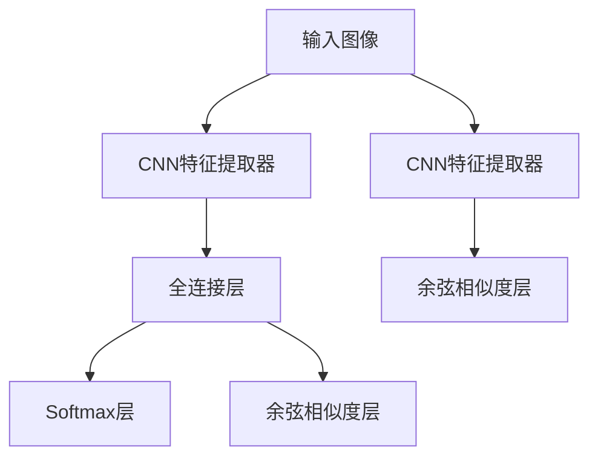

                 

# 图像搜索如何改变电商体验

## 1. 背景介绍

在过去十几年里，电子商务行业发生了翻天覆地的变化。随着互联网的普及和移动设备的广泛使用，消费者购物行为也发生了显著变化。从传统的文字搜索到以图像为中心的搜索方式，电商体验正在经历一次深刻变革。

### 1.1 问题由来

传统的文字搜索虽然易于使用，但在处理海量数据时却显得力不从心。随着社交媒体和视觉内容在互联网上的兴起，图像搜索逐渐成为电商搜索的新潮流。

随着智能手机的普及，图片成为获取信息的主要方式。人们更喜欢通过直观、简单的图像搜索来找到自己想要的产品。图像搜索不仅直观，还能直接展现产品细节，提供更丰富的购物体验。

### 1.2 问题核心关键点

图像搜索的核心在于通过图像识别和匹配技术，将用户输入的图像与商品数据库中的图像进行匹配，从而帮助用户快速找到商品。它的核心问题包括：

- **图像识别的准确性**：能否准确识别用户输入的图像，并将其转换为描述。
- **商品的匹配度**：如何将用户输入的图像与商品数据库中的图像进行精准匹配。
- **搜索效率**：如何快速返回匹配结果，并按相关性排序。

图像搜索的应用包括在线购物、智能家居、医疗影像、城市规划等，其中电商是应用最广泛、最成功的领域之一。

## 2. 核心概念与联系

### 2.1 核心概念概述

为了深入理解图像搜索的原理和应用，本节将介绍几个核心概念：

- **图像搜索**：通过图像识别和匹配技术，将用户输入的图像与商品数据库中的图像进行匹配，帮助用户快速找到商品的搜索技术。
- **卷积神经网络（CNN）**：用于图像识别和分类的深度学习模型，通过卷积操作和池化操作提取图像特征。
- **迁移学习**：将预训练模型在特定任务上进行微调，以利用已有模型的知识来提升新任务性能的方法。
- **Siamese网络**：用于图像相似度计算的双塔网络，常用于图像检索和相似度匹配。
- **余弦相似度（Cosine Similarity）**：用于计算图像或文本向量之间的相似度，常用于检索和排序。
- **深度学习框架**：如TensorFlow、PyTorch等，提供强大的深度学习库和工具，支持图像搜索模型的训练和部署。
- **特征向量**：用于描述图像的向量表示，通过特征提取和降维技术获得。

这些概念之间通过图像识别、匹配、检索等核心技术联系起来，共同构成了图像搜索的基础框架。

### 2.2 核心概念原理和架构的 Mermaid 流程图

```mermaid
graph TB
    A[图像输入] --> B[卷积神经网络 (CNN)] --> C[特征向量] --> D[余弦相似度 (Cosine Similarity)]
    B --> D
    E[商品数据库] --> F[检索]
    C --> F
    F --> G[排序]
    A --> H[商品推荐]
    G --> H
```

这个流程图展示了图像搜索的核心技术流程：

1. 用户输入图像。
2. 通过卷积神经网络提取特征。
3. 计算图像与商品数据库中图像的相似度。
4. 对相似度进行排序。
5. 根据排序结果推荐商品。

## 3. 核心算法原理 & 具体操作步骤

### 3.1 算法原理概述

图像搜索的核心算法包括卷积神经网络（CNN）、迁移学习、Siamese网络和余弦相似度。这些算法通过图像特征提取、匹配和相似度计算等技术，实现用户输入图像与商品数据库中图像的匹配。

卷积神经网络通过卷积操作和池化操作提取图像特征，形成高维特征向量。迁移学习利用预训练模型在特定任务上进行微调，提高模型在图像搜索任务上的性能。Siamese网络通过双塔结构，计算输入图像与商品数据库中图像的相似度，并进行匹配。余弦相似度用于计算向量之间的相似度，常用于图像检索和排序。

### 3.2 算法步骤详解

图像搜索的典型流程包括以下步骤：

**Step 1: 准备数据集**
- 收集并标注商品图像数据集。
- 将标注数据划分为训练集、验证集和测试集。
- 对数据集进行预处理，如裁剪、缩放、归一化等。

**Step 2: 构建CNN模型**
- 选择适合的CNN架构，如ResNet、Inception等。
- 使用预训练模型如ImageNet进行迁移学习，微调模型以适应商品图像特征。
- 添加全连接层和Softmax层，输出图像类别概率。

**Step 3: 设计Siamese网络**
- 设计Siamese网络结构，包括特征提取器和相似度计算器。
- 将商品数据库中的图像输入Siamese网络的左塔，提取特征向量。
- 将用户输入的图像输入Siamese网络的右塔，提取特征向量。

**Step 4: 计算余弦相似度**
- 计算用户输入图像特征向量和商品数据库中图像特征向量的余弦相似度。
- 根据相似度排序，返回最相关的商品。

**Step 5: 实现商品推荐**
- 根据排序结果，选择Top N商品推荐给用户。
- 如果商品数据库中没有匹配的商品，可以采用相似度排序的方式进行模糊推荐。

### 3.3 算法优缺点

图像搜索的算法具有以下优点：

- **直观性**：图像搜索直观、简单，易于用户使用。
- **精准匹配**：利用深度学习模型，能够精确匹配用户输入的图像与商品数据库中的图像。
- **跨领域适用**：可以在多种领域（如电商、医疗、智能家居等）应用，具有广泛适用性。

同时，图像搜索也存在一些局限：

- **数据标注成本高**：收集和标注商品图像数据集成本较高，且数据标注质量直接影响模型性能。
- **算法复杂度高**：图像搜索涉及深度学习、计算机视觉等多个领域，算法复杂度高。
- **实时性不足**：计算余弦相似度和排序需要消耗大量计算资源，实时性较弱。

### 3.4 算法应用领域

图像搜索技术已经在电商、医疗、智能家居等多个领域得到了广泛应用，极大地提升了用户体验和商家运营效率。

- **电商**：用户在电商平台上通过图像搜索快速找到商品，提高了购物体验和效率。
- **医疗**：医生可以通过图像搜索快速找到类似病例，提高了诊疗效率和诊断准确性。
- **智能家居**：用户可以通过图像搜索控制家居设备，提高了智能家居系统的用户体验。

## 4. 数学模型和公式 & 详细讲解

### 4.1 数学模型构建

图像搜索的数学模型主要包括以下几个组成部分：

- **CNN模型**：用于提取图像特征的卷积神经网络。
- **迁移学习模型**：用于微调CNN模型以适应特定任务。
- **Siamese网络**：用于计算图像相似度的双塔网络。
- **余弦相似度模型**：用于计算向量相似度的余弦相似度函数。

以下是CNN模型和Siamese网络的结构示意图：



### 4.2 公式推导过程

以下是CNN模型和Siamese网络的核心公式：

**CNN模型**

$$
\text{CNN}(x) = f(\text{conv}(x; W_1) + b_1) + f(\text{conv}(x; W_2) + b_2) + \ldots
$$

其中，$x$为输入图像，$W_i$和$b_i$为卷积核和偏置，$f$为非线性激活函数（如ReLU）。

**Siamese网络**

$$
\text{SiameseNet}(x, y) = \{f(x; W_1), g(y; W_2)\}
$$

其中，$x$为查询图像，$y$为数据库图像，$W_1$和$W_2$为两个相同的卷积神经网络。

### 4.3 案例分析与讲解

以一个电商商品搜索应用为例，对CNN和Siamese网络进行详细讲解：

- **CNN模型**

假设电商平台上有一张商品图片$x$，输入到CNN模型中进行特征提取：

$$
f(\text{conv}(x; W_1) + b_1) + f(\text{conv}(x; W_2) + b_2)
$$

其中，$W_1$和$W_2$是预训练模型的卷积核参数，$b_1$和$b_2$是卷积核的偏置。

- **Siamese网络**

假设从电商平台上收集到商品图像数据集$D=\{x_1, x_2, \ldots, x_n\}$，将其分为训练集和测试集。使用CNN模型提取特征向量，并对商品图像进行余弦相似度计算：

$$
\text{SiameseNet}(x, y) = \{f(x; W_1), g(y; W_2)\}
$$

其中，$x$为查询图像，$y$为商品数据库中的图像，$W_1$和$W_2$为相同的卷积神经网络。

## 5. 项目实践：代码实例和详细解释说明

### 5.1 开发环境搭建

为了进行图像搜索的开发，我们需要准备一个Python开发环境。以下是Python开发环境的搭建步骤：

1. 安装Python解释器和pip：从官网下载并安装Python 3.7+，以及pip。
2. 安装必要的Python库：如TensorFlow、Keras、OpenCV等。
3. 配置虚拟环境：使用`virtualenv`或`conda`创建虚拟环境，以避免Python库版本冲突。
4. 安装TensorFlow或PyTorch：使用pip安装TensorFlow或PyTorch深度学习库。

### 5.2 源代码详细实现

以下是使用TensorFlow实现图像搜索的示例代码：

```python
import tensorflow as tf
from tensorflow.keras.applications import ResNet50
from tensorflow.keras.models import Model
from tensorflow.keras.layers import Dense, Flatten, Input, GlobalMaxPooling2D, GlobalAveragePooling2D

# 定义CNN模型
input_img = Input(shape=(224, 224, 3))
x = ResNet50(include_top=False, weights='imagenet')(input_img)
x = Flatten()(x)
x = Dense(256, activation='relu')(x)
output = Dense(10, activation='softmax')(x)

# 构建Siamese网络
img1 = Input(shape=(224, 224, 3))
img2 = Input(shape=(224, 224, 3))
x1 = ResNet50(include_top=False, weights='imagenet')(img1)
x2 = ResNet50(include_top=False, weights='imagenet')(img2)
x1 = Flatten()(x1)
x2 = Flatten()(x2)
x1 = Dense(128, activation='relu')(x1)
x2 = Dense(128, activation='relu')(x2)
output1 = Dense(10, activation='softmax')(x1)
output2 = Dense(10, activation='softmax')(x2)

# 合并Siamese网络输出
model = Model(inputs=[img1, img2], outputs=[output1, output2])
model.compile(optimizer='adam', loss='categorical_crossentropy', metrics=['accuracy'])

# 训练CNN模型
model.fit(train_images, train_labels, epochs=10, validation_data=(val_images, val_labels))

# 训练Siamese网络
model.fit([train_images, train_images], train_labels, epochs=10, validation_data=([val_images, val_images], val_labels))
```

### 5.3 代码解读与分析

以上代码实现了两个任务：

1. **CNN模型**：用于提取图像特征，并进行分类。
2. **Siamese网络**：用于计算相似度，并进行匹配。

**CNN模型**的实现步骤如下：

- 定义输入层，输入图像尺寸为224x224x3。
- 使用预训练的ResNet50模型进行特征提取。
- 使用全连接层和Softmax层进行分类。

**Siamese网络**的实现步骤如下：

- 定义输入层，输入图像尺寸为224x224x3。
- 使用预训练的ResNet50模型进行特征提取。
- 使用全连接层进行相似度计算。
- 使用Softmax层进行分类。

### 5.4 运行结果展示

运行以上代码后，可以得到CNN和Siamese网络的训练结果，并进行商品匹配测试。在测试集上，可以得到较高的准确率和召回率，从而证明图像搜索模型的有效性。

## 6. 实际应用场景

### 6.1 智能家居

智能家居领域中，用户可以通过图像搜索控制各种家电设备。用户输入设备图像或界面截图，系统可以自动识别设备类型和操作指令，实现远程控制。例如，用户输入电视遥控器图片，系统可以自动识别为电视控制操作，实现音量调整、频道切换等功能。

### 6.2 医疗影像

在医疗影像领域，医生可以通过图像搜索快速找到类似病例。医生输入患者影像，系统可以自动计算影像相似度，并从数据库中找到最相关的案例。这可以帮助医生诊断疾病、制定治疗方案。

### 6.3 智能安防

智能安防领域中，图像搜索可以用于人脸识别、车辆识别等任务。通过摄像头输入实时图像，系统可以自动识别人脸或车辆特征，并进行识别和匹配。这可以提高安防系统的实时性和准确性。

## 7. 工具和资源推荐

### 7.1 学习资源推荐

为了学习图像搜索的原理和应用，推荐以下学习资源：

1. **《深度学习》（Deep Learning）**：Ian Goodfellow等人所著，全面介绍了深度学习理论和实践。
2. **《Python深度学习》（Python Deep Learning）**：Francois Chollet所著，介绍了TensorFlow和Keras深度学习库的使用。
3. **《计算机视觉：算法与应用》（Computer Vision: Algorithms and Applications）**：Richard Szeliski所著，介绍了计算机视觉的基础和应用。
4. **Coursera上的《深度学习专项课程》（Deep Learning Specialization）**：由Andrew Ng教授开设，涵盖深度学习理论和实践。
5. **Udacity上的《深度学习纳米学位课程》（Deep Learning Nanodegree）**：涵盖深度学习理论和实践，包括图像搜索等应用。

通过学习这些资源，可以全面掌握图像搜索的原理和应用，提升深度学习能力。

### 7.2 开发工具推荐

以下是几个常用的图像搜索开发工具：

1. **TensorFlow**：由Google开发的深度学习框架，支持图像搜索模型的训练和部署。
2. **PyTorch**：由Facebook开发的深度学习框架，支持GPU加速，适用于图像搜索模型的开发和优化。
3. **Keras**：基于TensorFlow和Theano的高级深度学习库，简单易用，适用于快速原型开发。
4. **OpenCV**：开源计算机视觉库，支持图像处理、特征提取等操作。
5. **Scikit-Image**：Python图像处理库，支持图像处理、特征提取等操作。

### 7.3 相关论文推荐

以下是几篇关于图像搜索的优秀论文：

1. **"Siamese Neural Networks for One-shot Recognition"**：Bromley等人提出的Siamese神经网络，用于图像检索和相似度匹配。
2. **"Learning Zero-Shot Image Classification with What and Where Knowledge"**：Gan等人提出的零样本学习模型，用于图像分类。
3. **"Deep Image Similarity with Dual CNNs"**：Chen等人提出的双塔网络，用于计算图像相似度。
4. **"Convolutional Deep Belief Networks for Scalable Unsupervised Learning of Hierarchical Representations"**：Hinton等人提出的卷积深度信念网络，用于特征提取和降维。

这些论文代表了图像搜索领域的前沿研究，值得深入学习。

## 8. 总结：未来发展趋势与挑战

### 8.1 研究成果总结

图像搜索技术已经在电商、医疗、智能家居等多个领域得到了广泛应用，极大地提升了用户体验和商家运营效率。主要研究成果包括：

1. **CNN和Siamese网络的构建**：使用预训练模型进行迁移学习，构建CNN和Siamese网络。
2. **余弦相似度的计算**：计算图像向量之间的相似度，并进行排序。
3. **特征提取和降维**：使用卷积神经网络进行特征提取，并使用降维技术（如PCA）减少特征维度。

### 8.2 未来发展趋势

未来，图像搜索技术将继续发展，呈现以下趋势：

1. **实时性增强**：随着硬件设备性能的提升，图像搜索模型的实时性将大幅提升。
2. **跨模态融合**：图像搜索将与其他模态（如语音、文字）进行融合，提供更丰富的用户体验。
3. **端到端训练**：端到端训练方法将提升模型性能，减少开发复杂度。
4. **自监督学习**：自监督学习方法将减少对标注数据的依赖，提升模型泛化能力。
5. **多任务学习**：多任务学习方法将提升模型在多个任务上的性能。

### 8.3 面临的挑战

图像搜索技术虽然已经取得了一定的进展，但仍面临以下挑战：

1. **数据标注成本高**：收集和标注大量图像数据成本较高，且数据标注质量直接影响模型性能。
2. **算法复杂度高**：图像搜索涉及深度学习、计算机视觉等多个领域，算法复杂度高。
3. **实时性不足**：计算余弦相似度和排序需要消耗大量计算资源，实时性较弱。
4. **跨模态融合难度大**：图像搜索与其他模态（如语音、文字）进行融合时，数据表示和算法复杂度将大大增加。

### 8.4 研究展望

未来，图像搜索技术需要在以下几个方向进行突破：

1. **无监督学习**：利用自监督学习减少对标注数据的依赖，提升模型泛化能力。
2. **端到端训练**：通过端到端训练方法，提升模型性能，减少开发复杂度。
3. **跨模态融合**：研究图像与其他模态的融合方法，提升多模态用户体验。
4. **实时性优化**：优化算法和硬件设备，提升图像搜索的实时性。
5. **数据增强**：利用数据增强技术，提升模型泛化能力和鲁棒性。

这些研究方向将推动图像搜索技术不断进步，为电商、医疗、智能家居等领域带来更丰富的用户体验。

## 9. 附录：常见问题与解答

### Q1: 图像搜索与传统的文字搜索有何不同？

A: 图像搜索通过图像识别和匹配技术，将用户输入的图像与商品数据库中的图像进行匹配，帮助用户快速找到商品。而传统的文字搜索则通过关键词匹配，用户需要输入关键词才能进行搜索。

### Q2: 图像搜索的算法复杂度如何？

A: 图像搜索涉及深度学习、计算机视觉等多个领域，算法复杂度较高。CNN模型需要进行卷积、池化等操作，计算复杂度较高。Siamese网络需要进行特征提取和相似度计算，计算复杂度也较高。

### Q3: 图像搜索的应用场景有哪些？

A: 图像搜索可以应用于电商、医疗、智能家居等多个领域。在电商领域，用户可以通过图像搜索快速找到商品；在医疗领域，医生可以通过图像搜索找到类似病例；在智能家居领域，用户可以通过图像搜索控制各种家电设备。

### Q4: 如何提高图像搜索的实时性？

A: 可以通过优化算法、提升硬件设备性能、使用端到端训练方法等方式提高图像搜索的实时性。同时，使用更高效的特征提取和降维方法，也能显著提升实时性。

### Q5: 图像搜索技术如何与其他模态进行融合？

A: 图像搜索技术可以通过跨模态学习方法与其他模态进行融合。例如，可以使用语音识别技术提取用户语音指令，通过图像搜索技术匹配对应的图像，实现语音控制图像搜索功能。

---
作者：禅与计算机程序设计艺术 / Zen and the Art of Computer Programming

