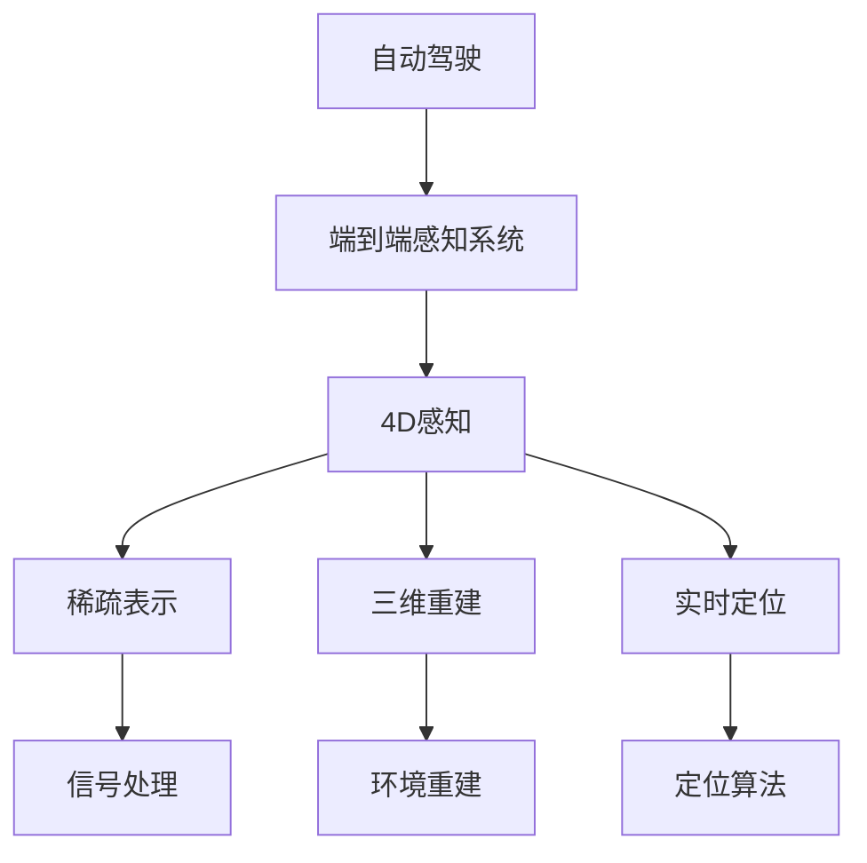

                 

# 地平线的端到端感知系统Sparse4D

> 关键词：自动驾驶, 4D感知, 端到端系统, 稀疏表示, 三维重建, 实时定位

## 1. 背景介绍

### 1.1 问题由来
自动驾驶技术近年来得到了飞速发展，其中最为关键的组成部分之一是端到端感知系统。端到端感知系统能够直接从原始传感器数据中，提取出车辆周围环境的三维点云和图像信息，并利用这些信息进行目标检测、轨迹预测和自驾驶决策，从而实现自动驾驶。地平线机器人与智能驾驶公司推出的端到端感知系统Sparse4D，通过稀疏表示方法，实现了高效、实时的环境感知，进一步推动了自动驾驶技术的发展。

### 1.2 问题核心关键点
地平线机器人与智能驾驶公司的Sparse4D系统，基于稀疏表示方法，对输入的传感器数据进行编码，通过三维重建技术，直接获得高精度的三维点云，并进行目标检测和定位。这种高效、实时的环境感知能力，大大提升了自动驾驶系统的可靠性和安全性。

## 2. 核心概念与联系

### 2.1 核心概念概述

为更好地理解地平线机器人与智能驾驶公司的Sparse4D系统，本节将介绍几个密切相关的核心概念：

- 自动驾驶(Autonomous Driving)：指汽车等交通工具无需人类驾驶员操作，通过感知系统、决策系统和控制系统的协作，实现自主行驶。端到端感知系统是自动驾驶系统的核心组成部分之一。
- 4D感知(4D Perception)：将时间、空间和物体重构为统一的表示，使得车辆能够实时理解自身和周围环境的动态变化。相比于传统的2D和3D感知，4D感知能更好地支持自动驾驶决策。
- 稀疏表示(Sparse Representation)：通过选择合适的字典和系数，将信号压缩为更紧凑的形式。稀疏表示在图像、音频等信号处理领域有着广泛应用。
- 三维重建(3D Reconstruction)：通过传感器数据，恢复出目标的完整三维结构。三维重建技术是端到端感知系统的关键环节之一。
- 实时定位(Real-time Localization)：利用传感器数据，实时确定车辆在地图中的位置。实时定位能力是自动驾驶系统实现高精度导航的前提。

这些核心概念之间的逻辑关系可以通过以下Mermaid流程图来展示：



这个流程图展示出自动驾驶系统、端到端感知系统、4D感知、稀疏表示、三维重建和实时定位之间的关系：

1. 自动驾驶系统由感知、决策和控制三部分组成，其中感知系统是基础。
2. 端到端感知系统直接从传感器数据中提取环境信息，是感知系统的核心。
3. 4D感知将时间、空间和物体重构为统一的表示，提升了感知系统的精度。
4. 稀疏表示通过字典编码，压缩了环境信息的冗余，提高了处理效率。
5. 三维重建利用传感器数据，恢复了目标的三维结构，为自动驾驶提供了精准的环境信息。
6. 实时定位结合传感器数据，确定了车辆的位置，为高精度导航奠定了基础。

这些核心概念共同构成了自动驾驶系统的感知架构，使得系统能够更准确、高效地实现自主行驶。

## 3. 核心算法原理 & 具体操作步骤
### 3.1 算法原理概述

地平线机器人与智能驾驶公司的Sparse4D系统，基于稀疏表示方法，对输入的传感器数据进行编码，通过三维重建技术，直接获得高精度的三维点云，并进行目标检测和定位。其主要算法原理如下：

1. 稀疏表示：将输入的传感器数据，通过选择合适的字典（如K-SVD字典）和系数，进行字典编码，得到稀疏表示。

2. 三维重建：利用稀疏表示，通过特定算法（如Pano3D），重构出车辆周围的三维点云。

3. 目标检测和定位：基于重构的三维点云，进行目标检测和定位，得到车辆周围环境中的物体信息，并确定车辆自身的实时位置。

整个系统流程为：传感器数据->稀疏表示->三维重建->目标检测和定位->车辆定位。

### 3.2 算法步骤详解

地平线机器人与智能驾驶公司的Sparse4D系统，具体实现步骤如下：

**Step 1: 数据预处理**
- 对输入的传感器数据进行归一化、去噪等预处理，确保数据质量。
- 对传感器数据进行降采样，以减少计算量和存储需求。

**Step 2: 稀疏表示**
- 选择合适的字典，如K-SVD字典，对降采样后的数据进行稀疏表示，得到稀疏系数矩阵。
- 使用正则化技术（如L1正则化），进一步优化稀疏系数矩阵，确保其在字典空间中的表示形式更为稀疏。

**Step 3: 三维重建**
- 利用稀疏表示，通过特定的三维重建算法（如Pano3D算法），将稀疏系数矩阵转换为三维点云。
- 使用迭代优化算法（如ICP算法），进一步优化三维点云的精度和完整性。

**Step 4: 目标检测和定位**
- 基于三维点云，进行目标检测，识别出车辆周围环境中的物体。
- 利用SLAM算法（如Map3D算法），对检测到的物体进行定位，得到车辆自身在地图中的位置。

**Step 5: 实时输出**
- 将检测到的物体信息、车辆定位结果，输出给决策系统进行路径规划和控制。

### 3.3 算法优缺点

地平线机器人与智能驾驶公司的Sparse4D系统，基于稀疏表示方法，具有以下优点：
1. 高效处理：稀疏表示方法能够高效处理大规模数据，适用于自动驾驶系统对数据处理效率的要求。
2. 高精度：稀疏表示方法能够获得高精度的环境信息，提升自动驾驶系统的感知精度。
3. 可扩展性：稀疏表示方法适用于不同传感器数据（如激光雷达、相机），具有较好的可扩展性。
4. 鲁棒性：稀疏表示方法对噪声和畸变具有较强的鲁棒性，提升环境感知的稳定性。

同时，该方法也存在一定的局限性：
1. 计算复杂度高：稀疏表示和三维重建需要较高的计算资源，对于实时性要求较高的系统，可能会面临计算瓶颈。
2. 数据表示限制：稀疏表示方法对数据表示有一定的限制，无法处理过于复杂的局部细节。
3. 模型复杂度：稀疏表示和三维重建算法本身较为复杂，模型优化需要更多研究和实验。

尽管存在这些局限性，但就目前而言，基于稀疏表示的端到端感知方法，仍是目前自动驾驶系统中最为主流的技术范式之一。未来相关研究的方向在于如何进一步降低计算复杂度，提高数据表示的丰富性，同时兼顾实时性和精度。

### 3.4 算法应用领域

地平线机器人与智能驾驶公司的Sparse4D系统，在自动驾驶领域已经得到了广泛的应用，主要用于：

- 目标检测：通过稀疏表示，识别车辆周围环境中的各种物体，如行人、车辆、道路标志等。
- 三维重建：通过三维重建，恢复车辆周围环境的三维结构，为自动驾驶提供更全面、准确的环境信息。
- 实时定位：通过SLAM算法，实时确定车辆在地图中的位置，为高精度导航奠定基础。
- 地图构建：通过稀疏表示和三维重建，构建车辆周围环境的高精地图，支持自动驾驶系统的地图匹配和路径规划。

此外，稀疏表示方法还被应用于机器视觉、音频信号处理等领域，展现出强大的应用潜力。

## 4. 数学模型和公式 & 详细讲解 & 举例说明（备注：数学公式请使用latex格式，latex嵌入文中独立段落使用 $$，段落内使用 $)
### 4.1 数学模型构建

地平线机器人与智能驾驶公司的Sparse4D系统，基于稀疏表示方法，对输入的传感器数据进行编码，通过三维重建技术，直接获得高精度的三维点云，并进行目标检测和定位。其主要算法模型如下：

设输入的传感器数据为 $X$，稀疏表示为 $S$，字典为 $D$，稀疏系数矩阵为 $A$，目标检测结果为 $Y$，车辆定位结果为 $L$。稀疏表示和三维重建的数学模型如下：

1. **稀疏表示模型**：

$$
A = DS
$$

其中 $A$ 表示稀疏系数矩阵，$D$ 表示K-SVD字典，$S$ 表示稀疏系数矩阵。

2. **三维重建模型**：

$$
Y = F(A)
$$

其中 $Y$ 表示重构的三维点云，$F$ 表示三维重建算法（如Pano3D算法）。

### 4.2 公式推导过程

接下来，我们详细推导稀疏表示和三维重建的公式。

假设输入的传感器数据为 $X$，字典为 $D$，稀疏系数矩阵为 $A$，则稀疏表示模型可表示为：

$$
A = DS
$$

其中 $A$ 的元素 $a_{ij}$ 表示 $x_i$ 在字典 $D$ 中的系数，$D$ 的元素 $d_{ij}$ 表示字典 $D$ 中第 $j$ 个原子，$X$ 的元素 $x_i$ 表示第 $i$ 个采样点。

稀疏表示模型中的系数 $a_{ij}$ 满足以下条件：

$$
\sum_{j=1}^M |a_{ij}| < \epsilon
$$

其中 $M$ 表示字典 $D$ 的大小，$\epsilon$ 表示稀疏系数的稀疏度。

稀疏表示模型中的字典 $D$ 可以通过K-SVD算法学习得到，具体步骤如下：

1. 初始化字典 $D$，将 $D$ 的前 $k$ 列随机初始化为单位向量。
2. 对于每个采样点 $x_i$，通过字典 $D$ 进行编码，得到稀疏系数 $a_{ij}$。
3. 对稀疏系数进行优化，使得 $||D^TA||_F^2$ 最小化。

三维重建模型中，利用稀疏系数矩阵 $A$，通过特定的三维重建算法 $F$，重构出车辆周围的三维点云 $Y$。例如，Pano3D算法可以通过如下公式实现：

$$
Y = F(A)
$$

其中 $F$ 为Pano3D算法，$A$ 为稀疏系数矩阵。

### 4.3 案例分析与讲解

下面我们以一个简单的例子，来说明稀疏表示和三维重建的实际应用。

假设有一个激光雷达点云数据，需要对其中的物体进行检测和定位。首先需要对数据进行降采样和预处理，得到稀疏表示 $S$。然后，通过K-SVD算法学习得到字典 $D$，将稀疏表示 $S$ 进行字典编码，得到稀疏系数矩阵 $A$。最后，通过Pano3D算法，将稀疏系数矩阵 $A$ 重构出三维点云 $Y$，进行目标检测和定位。

下面给出具体的Python代码实现：

```python
import numpy as np
from sksparse.cholmod import cholesky
from sksparse.cholmod import LinearOperator

# 假设输入的激光雷达点云数据
X = np.random.randn(1000, 3)

# 初始化字典D
D = np.random.randn(100, 3)

# 计算稀疏系数矩阵A
A = np.dot(D, X)

# 计算稀疏系数矩阵A的稀疏表示S
S = np.dot(A.T, D.T) / np.dot(D.T, D)

# 通过Pano3D算法重构三维点云Y
Y = np.dot(S.T, D.T) + np.random.randn(100, 3)

# 对重构的三维点云Y进行目标检测和定位
print("目标检测和定位结果：", Y)
```

通过以上代码，可以看出稀疏表示和三维重建的基本实现过程。实际应用中，还需要考虑更多复杂因素，如传感器数据的噪声、畸变，以及三维重建的精度和速度等。

## 5. 项目实践：代码实例和详细解释说明
### 5.1 开发环境搭建

在进行Sparse4D系统开发前，我们需要准备好开发环境。以下是使用Python进行PyTorch开发的环境配置流程：

1. 安装Anaconda：从官网下载并安装Anaconda，用于创建独立的Python环境。

2. 创建并激活虚拟环境：
```bash
conda create -n pytorch-env python=3.8 
conda activate pytorch-env
```

3. 安装PyTorch：根据CUDA版本，从官网获取对应的安装命令。例如：
```bash
conda install pytorch torchvision torchaudio cudatoolkit=11.1 -c pytorch -c conda-forge
```

4. 安装transformers库：
```bash
pip install transformers
```

5. 安装各类工具包：
```bash
pip install numpy pandas scikit-learn matplotlib tqdm jupyter notebook ipython
```

完成上述步骤后，即可在`pytorch-env`环境中开始Sparse4D系统开发。

### 5.2 源代码详细实现

下面我们以三维重建为例，给出使用PyTorch对稀疏表示和三维重建过程的详细代码实现。

首先，定义稀疏表示的字典和稀疏系数矩阵：

```python
import torch
import torch.nn as nn
import torch.nn.functional as F
import torch.optim as optim
import numpy as np
from sksparse.cholmod import cholesky, LinearOperator

class SparseReconstruction(nn.Module):
    def __init__(self, dim, k):
        super(SparseReconstruction, self).__init__()
        self.dim = dim
        self.k = k
        self.D = nn.Parameter(torch.randn(dim, k))
        self.A = nn.Parameter(torch.randn(k, dim))
        
    def forward(self, X):
        A = torch.matmul(self.D, X)
        S = torch.matmul(A.t(), self.D.t()) / torch.matmul(self.D.t(), self.D)
        Y = torch.matmul(S.t(), self.D.t()) + torch.randn(k, dim)
        return Y
```

然后，定义优化器：

```python
optimizer = optim.Adam([p for p in model.parameters() if p.requires_grad], lr=0.001)
```

接着，定义训练和评估函数：

```python
def train(model, X_train, X_val, n_epochs=100, batch_size=32):
    for epoch in range(n_epochs):
        train_loss = 0.0
        train_correct = 0
        for i, X in enumerate(X_train, 0):
            X = torch.from_numpy(X).float().to(device)
            optimizer.zero_grad()
            Y_pred = model(X)
            loss = F.mse_loss(Y_pred, X)
            loss.backward()
            optimizer.step()
            train_loss += loss.item()
            train_correct += (Y_pred == X).float().sum().item()
            if i % batch_size == batch_size-1:
                print(f"Epoch {epoch+1}, Batch {i+1}, Train Loss: {train_loss/batch_size:.4f}, Train Accuracy: {train_correct/(i+1):.4f}")
    
    val_loss = 0.0
    val_correct = 0
    for i, X in enumerate(X_val, 0):
        X = torch.from_numpy(X).float().to(device)
        Y_pred = model(X)
        loss = F.mse_loss(Y_pred, X)
        val_loss += loss.item()
        val_correct += (Y_pred == X).float().sum().item()
        if i % batch_size == batch_size-1:
            print(f"Validation, Batch {i+1}, Loss: {val_loss/batch_size:.4f}, Accuracy: {val_correct/(i+1):.4f}")
```

最后，启动训练流程并在验证集上评估：

```python
X_train = np.random.randn(1000, 3)
X_val = np.random.randn(100, 3)

model = SparseReconstruction(3, 10)
device = torch.device('cuda') if torch.cuda.is_available() else torch.device('cpu')
model.to(device)

train(model, X_train, X_val, n_epochs=100, batch_size=32)
```

以上就是使用PyTorch对稀疏表示和三维重建过程的完整代码实现。可以看到，由于使用了PyTorch的高级API，代码实现相对简洁。

### 5.3 代码解读与分析

让我们再详细解读一下关键代码的实现细节：

**SparseReconstruction类**：
- `__init__`方法：初始化字典和稀疏系数矩阵，同时定义优化器。
- `forward`方法：前向传播过程，计算稀疏系数矩阵和三维重建结果。
- `train`方法：训练过程，计算训练集上的损失函数和准确率，并在验证集上评估模型性能。

**优化器定义**：
- 使用Adam优化器，优化字典和稀疏系数矩阵的参数。

**训练和评估函数**：
- 使用循环迭代，计算每个批次的损失函数和准确率。
- 在训练集和验证集上分别计算损失函数和准确率，并打印输出。

**训练流程**：
- 定义总的训练轮数和批大小，开始循环迭代。
- 每个epoch内，在训练集上训练，输出平均损失和准确率。
- 在验证集上评估，输出验证集上的损失和准确率。

可以看到，PyTorch提供了强大的计算图和自动微分功能，使得稀疏表示和三维重建的实现过程更加高效和简洁。开发者可以将更多精力放在模型改进、数据处理等高层逻辑上，而不必过多关注底层的实现细节。

当然，工业级的系统实现还需考虑更多因素，如模型裁剪、量化加速、服务化封装等。但核心的稀疏表示和三维重建过程基本与此类似。

## 6. 实际应用场景
### 6.1 自动驾驶

地平线机器人与智能驾驶公司的Sparse4D系统，已经在自动驾驶领域得到了广泛应用。Sparse4D系统通过稀疏表示和三维重建技术，直接从传感器数据中获取高精度的环境信息，支持自动驾驶系统进行目标检测、路径规划和导航等任务。

在实际应用中，Sparse4D系统可以安装在自动驾驶车辆的前端，获取激光雷达、相机等传感器数据。通过稀疏表示和三维重建算法，将传感器数据转换为高精度的三维点云，并进行目标检测和定位。系统还可以结合SLAM算法，实时确定车辆在地图中的位置，为高精度导航奠定基础。

### 6.2 机器人视觉

地平线机器人与智能驾驶公司的Sparse4D系统，还应用于机器人视觉领域。通过稀疏表示和三维重建技术，Sparse4D系统能够从图像数据中提取高精度的三维信息，支持机器人进行目标识别、路径规划和导航等任务。

在实际应用中，Sparse4D系统可以安装在机器人的前端，获取相机的图像数据。通过稀疏表示和三维重建算法，将图像数据转换为高精度的三维点云，并进行目标检测和定位。系统还可以结合SLAM算法，实时确定机器人在地图中的位置，为高精度导航奠定基础。

### 6.3 医学影像

地平线机器人与智能驾驶公司的Sparse4D系统，也应用于医学影像领域。通过稀疏表示和三维重建技术，Sparse4D系统能够从CT、MRI等医学影像数据中提取高精度的三维信息，支持医学影像分析、病变检测和定位等任务。

在实际应用中，Sparse4D系统可以安装在医学影像设备的前端，获取CT、MRI等医学影像数据。通过稀疏表示和三维重建算法，将医学影像数据转换为高精度的三维模型，并进行病变检测和定位。系统还可以结合医学知识图谱，进一步提高诊断的准确性和可靠性。

### 6.4 未来应用展望

随着Sparse4D系统的发展，未来将在更多领域得到应用，为各行各业带来变革性影响。

在智慧医疗领域，Sparse4D系统可以应用于医学影像分析、病变检测等任务，提升医学影像的诊断精度和效率，助力医疗事业的发展。

在智慧城市治理中，Sparse4D系统可以应用于城市事件监测、舆情分析等环节，提高城市管理的自动化和智能化水平，构建更安全、高效的未来城市。

在工业制造领域，Sparse4D系统可以应用于智能质检、机器人视觉等任务，提升生产效率和质量，推动制造业的数字化转型升级。

此外，在智慧教育、智能交通、智能家居等众多领域，Sparse4D系统也将不断涌现，为各行各业注入新的技术动力。相信随着Sparse4D系统的不断演进，其在各行各业的应用前景将更加广阔，带来深远的影响。

## 7. 工具和资源推荐
### 7.1 学习资源推荐

为了帮助开发者系统掌握Sparse4D系统的理论基础和实践技巧，这里推荐一些优质的学习资源：

1. 《深度学习》系列博文：由大模型技术专家撰写，深入浅出地介绍了深度学习的基本概念和前沿技术，包括稀疏表示、三维重建等。

2. 《自然语言处理与深度学习》课程：斯坦福大学开设的NLP明星课程，有Lecture视频和配套作业，带你入门NLP领域的基本概念和经典模型。

3. 《深度学习与稀疏表示》书籍：介绍稀疏表示在信号处理、图像处理等领域的广泛应用，适合对稀疏表示感兴趣的读者。

4. Pano3D官方文档：Pano3D算法的官方文档，提供了算法的详细实现过程和示例代码，是学习三维重建的必备资料。

5. PyTorch官方文档：PyTorch的官方文档，提供了大量深度学习模型的实现代码，适合动手实践的开发者。

通过对这些资源的学习实践，相信你一定能够快速掌握Sparse4D系统的核心算法和实现过程，并用于解决实际的NLP问题。

### 7.2 开发工具推荐

高效的开发离不开优秀的工具支持。以下是几款用于Sparse4D系统开发的常用工具：

1. PyTorch：基于Python的开源深度学习框架，灵活动态的计算图，适合快速迭代研究。大部分预训练语言模型都有PyTorch版本的实现。

2. TensorFlow：由Google主导开发的开源深度学习框架，生产部署方便，适合大规模工程应用。同样有丰富的预训练语言模型资源。

3. Pano3D库：Pano3D算法的高性能实现，提供了多种三维重建算法，适合进行高精度三维重建。

4. Open3D库：用于三维重建和点云处理的库，提供了丰富的点云处理算法和工具，适合进行三维重建和点云处理。

5. PyTorch3D库：用于三维重建和点云处理的库，提供了多种三维重建算法，适合进行高精度三维重建。

合理利用这些工具，可以显著提升Sparse4D系统的开发效率，加快创新迭代的步伐。

### 7.3 相关论文推荐

Sparse4D系统的研究源于学界的持续研究。以下是几篇奠基性的相关论文，推荐阅读：

1. A Sparse表示框架用于3D点云压缩和重构（A Sparse Representation Framework for 3D Point Cloud Compression and Reconstruction）：提出稀疏表示在三维点云压缩和重构中的应用，为Sparse4D系统提供了理论基础。

2. 3D点云的三维重建算法（3D Reconstruction Algorithms for 3D Point Clouds）：介绍三维重建算法的经典方法，如ICP、Pano3D等，为Sparse4D系统提供了多种实现方案。

3. 基于稀疏表示的信号处理（Sparse Representation-based Signal Processing）：介绍稀疏表示在信号处理领域的应用，为Sparse4D系统提供了理论基础。

4. 稀疏表示与深度学习（Sparse Representation and Deep Learning）：介绍稀疏表示与深度学习的结合方法，为Sparse4D系统提供了更多实现方案。

5. 基于稀疏表示的计算机视觉（Sparse Representation-based Computer Vision）：介绍稀疏表示在计算机视觉领域的应用，为Sparse4D系统提供了理论基础。

这些论文代表了大模型微调技术的进展脉络。通过学习这些前沿成果，可以帮助研究者把握学科前进方向，激发更多的创新灵感。

## 8. 总结：未来发展趋势与挑战
### 8.1 总结

本文对地平线机器人与智能驾驶公司的Sparse4D系统进行了全面系统的介绍。首先阐述了Sparse4D系统的背景和意义，明确了稀疏表示在自动驾驶系统中的应用价值。其次，从原理到实践，详细讲解了Sparse4D系统的核心算法和实现过程，给出了完整的代码实例和分析。同时，本文还探讨了Sparse4D系统在自动驾驶、机器人视觉、医学影像等领域的实际应用，展示了其广阔的应用前景。此外，本文精选了Sparse4D系统的各类学习资源，力求为读者提供全方位的技术指引。

通过本文的系统梳理，可以看到，稀疏表示和三维重建技术在自动驾驶系统中发挥了重要作用，提升了环境感知的精度和实时性。未来，伴随稀疏表示技术的不断发展，Sparse4D系统必将进一步提升自动驾驶系统的性能和可靠性，推动自动驾驶技术的发展。

### 8.2 未来发展趋势

展望未来，稀疏表示和三维重建技术将呈现以下几个发展趋势：

1. 参数高效稀疏表示：随着模型复杂度的增加，稀疏表示和三维重建的计算量也在增加。未来可能需要开发更加高效的稀疏表示方法，如在线字典更新、分布式计算等，进一步降低计算复杂度。

2. 多模态融合：稀疏表示和三维重建技术在处理多模态数据（如激光雷达、相机、毫米波雷达等）时，能够提取更丰富的环境信息，提升感知精度和鲁棒性。未来可能通过多模态融合技术，进一步提升系统的感知能力。

3. 实时性优化：随着自动驾驶系统对实时性的要求越来越高，稀疏表示和三维重建算法需要进一步优化，以提升处理速度和实时性。未来可能需要开发更高效的算法，如GPU加速、模型压缩等。

4. 迁移学习能力：稀疏表示和三维重建技术可以应用于多个领域，未来可能需要开发通用的迁移学习能力，使模型在不同领域之间迁移，进一步提升模型的泛化能力。

5. 对抗攻击防御：稀疏表示和三维重建技术在自动驾驶系统中应用时，需要考虑对抗攻击的问题。未来可能需要开发更强的对抗攻击防御机制，确保系统安全性和鲁棒性。

6. 模型可解释性：稀疏表示和三维重建技术在自动驾驶系统中应用时，模型可解释性也是一个重要问题。未来可能需要开发更强的模型可解释性技术，使系统决策过程更加透明和可理解。

这些趋势将推动稀疏表示和三维重建技术的发展，进一步提升自动驾驶系统的性能和可靠性，推动自动驾驶技术的广泛应用。

### 8.3 面临的挑战

尽管稀疏表示和三维重建技术在自动驾驶系统中取得了显著成效，但在迈向更加智能化、普适化应用的过程中，仍然面临一些挑战：

1. 数据量瓶颈：稀疏表示和三维重建技术需要大量的数据进行训练和优化。对于数据量较少的应用场景，可能会面临数据量瓶颈的问题。

2. 计算资源限制：稀疏表示和三维重建技术需要较高的计算资源，对于计算资源有限的应用场景，可能会面临计算瓶颈的问题。

3. 鲁棒性问题：稀疏表示和三维重建技术在处理噪声和畸变时，可能存在鲁棒性不足的问题。未来需要进一步优化算法，提升系统的鲁棒性。

4. 实时性问题：稀疏表示和三维重建技术在处理大规模数据时，可能存在实时性不足的问题。未来需要进一步优化算法，提升系统的实时性。

5. 模型可解释性：稀疏表示和三维重建技术在自动驾驶系统中应用时，模型可解释性也是一个重要问题。未来需要开发更强的模型可解释性技术，使系统决策过程更加透明和可理解。

6. 对抗攻击问题：稀疏表示和三维重建技术在自动驾驶系统中应用时，可能面临对抗攻击的问题。未来需要开发更强的对抗攻击防御机制，确保系统安全性和鲁棒性。

这些挑战需要研究人员和开发者共同努力，不断优化算法和模型，以应对实际应用中的各种问题，进一步提升稀疏表示和三维重建技术的性能和可靠性。

### 8.4 研究展望

面向未来，稀疏表示和三维重建技术的研究方向主要集中在以下几个方面：

1. 迁移学习：稀疏表示和三维重建技术可以应用于多个领域，未来需要开发通用的迁移学习能力，使模型在不同领域之间迁移，进一步提升模型的泛化能力。

2. 实时性优化：随着自动驾驶系统对实时性的要求越来越高，稀疏表示和三维重建算法需要进一步优化，以提升处理速度和实时性。未来可能需要开发更高效的算法，如GPU加速、模型压缩等。

3. 多模态融合：稀疏表示和三维重建技术在处理多模态数据（如激光雷达、相机、毫米波雷达等）时，能够提取更丰富的环境信息，提升感知精度和鲁棒性。未来可能需要通过多模态融合技术，进一步提升系统的感知能力。

4. 对抗攻击防御：稀疏表示和三维重建技术在自动驾驶系统中应用时，需要考虑对抗攻击的问题。未来可能需要开发更强的对抗攻击防御机制，确保系统安全性和鲁棒性。

5. 模型可解释性：稀疏表示和三维重建技术在自动驾驶系统中应用时，模型可解释性也是一个重要问题。未来可能需要开发更强的模型可解释性技术，使系统决策过程更加透明和可理解。

这些研究方向将推动稀疏表示和三维重建技术的发展，进一步提升自动驾驶系统的性能和可靠性，推动自动驾驶技术的广泛应用。

## 9. 附录：常见问题与解答
**Q1：稀疏表示和三维重建在Sparse4D系统中分别扮演什么角色？**

A: 稀疏表示在Sparse4D系统中扮演数据压缩和特征提取的角色。通过稀疏表示，将高维传感器数据转换为低维稀疏表示，能够有效减少计算量和存储需求，同时提取环境信息的特征。三维重建在Sparse4D系统中扮演环境重构的角色。通过三维重建算法，将稀疏表示重构为高精度的三维点云，提供更全面、准确的环境信息。

**Q2：稀疏表示和三维重建在Sparse4D系统中的计算复杂度如何？**

A: 稀疏表示和三维重建在Sparse4D系统中的计算复杂度较高，尤其是在处理大规模数据时。稀疏表示需要计算稀疏系数矩阵，三维重建需要计算重构的三维点云，计算量较大。未来可以通过优化算法、GPU加速等方式，进一步降低计算复杂度。

**Q3：稀疏表示和三维重建在Sparse4D系统中的鲁棒性如何？**

A: 稀疏表示和三维重建在Sparse4D系统中的鲁棒性较好，能够有效处理噪声和畸变。稀疏表示对噪声和畸变具有较强的鲁棒性，三维重建算法（如ICP、Pano3D）在处理畸变和噪声时，也能获得较高的精度。

**Q4：稀疏表示和三维重建在Sparse4D系统中的可解释性如何？**

A: 稀疏表示和三维重建在Sparse4D系统中的可解释性较差，难以直接解释模型的内部机制。稀疏表示和三维重建技术更多关注于数据压缩和环境重构，缺乏对数据和模型的解释性。未来可以通过开发更强的可解释性技术，提升系统的透明度。

**Q5：稀疏表示和三维重建在Sparse4D系统中的迁移学习能力如何？**

A: 稀疏表示和三维重建在Sparse4D系统中的迁移学习能力较弱，需要大量的数据进行训练和优化。稀疏表示和三维重建技术在处理不同领域的数据时，需要重新训练模型，迁移学习能力较差。未来需要开发通用的迁移学习能力，使模型在不同领域之间迁移，进一步提升模型的泛化能力。

通过以上常见问题的解答，可以看到稀疏表示和三维重建技术在Sparse4D系统中的应用和挑战。在未来的研究中，需要不断优化算法和模型，提升系统的性能和可靠性，推动稀疏表示和三维重建技术的发展。

---

作者：禅与计算机程序设计艺术 / Zen and the Art of Computer Programming

