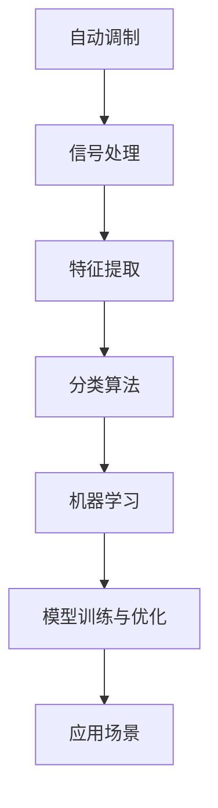

                 

# 基于AI的自动调制分类

> 关键词：自动调制,机器学习,信号处理,通信系统,分类,信号特征,应用场景

## 1. 背景介绍

### 1.1 问题由来

在现代通信系统中，信号的自动调制是一个核心问题。信号的调制方式直接影响着传输效率、抗干扰能力以及信号的质量。传统的信号分类方法主要依赖于人工经验，存在主观性强、效率低等缺点。随着人工智能的兴起，通过机器学习算法对信号进行分类已成为一种新的趋势。

### 1.2 问题核心关键点

基于AI的自动调制分类主要围绕以下几个关键点展开：

1. **信号特征提取**：将原始信号转换成机器学习算法可以处理的特征。特征提取的准确性和完备性直接影响分类的结果。
2. **分类算法选择**：选择合适的分类算法，以提高分类的准确性和效率。
3. **模型训练与优化**：使用机器学习模型对特征进行训练和优化，以获得更好的分类效果。
4. **应用场景**：将分类算法应用到具体的通信系统中，提升通信系统的性能和可靠性。

### 1.3 问题研究意义

基于AI的自动调制分类技术，能够有效提升通信系统的智能化水平，降低人工干预的依赖，增强系统的自动化和灵活性。该技术在实际应用中具有以下重要意义：

1. **提高传输效率**：通过智能分类，可以优化调制方式，提高信号的传输效率。
2. **增强抗干扰能力**：智能分类算法能够识别和剔除干扰信号，提高信号的抗干扰能力。
3. **提升信号质量**：通过智能分类，可以更精确地控制信号的调制参数，提升信号质量。
4. **减少人工干预**：机器学习算法能够自动分类信号，减少人工操作，降低成本。
5. **适应性更强**：基于AI的分类算法可以适应各种信号类型和环境条件，提升系统的通用性。

## 2. 核心概念与联系

### 2.1 核心概念概述

为更好地理解基于AI的自动调制分类方法，本节将介绍几个密切相关的核心概念：

1. **自动调制(Automatic Modulation)**：在通信系统中，自动调制指的是根据信号的特征自动选择最佳的调制方式。传统的自动调制方法依赖于经验，而基于AI的自动调制分类技术则通过机器学习算法进行自动分类，以提升调制效率和准确性。
2. **信号处理(Signal Processing)**：信号处理是指对信号进行滤波、调制、解调、特征提取等操作，以获取有意义的信号信息。信号处理是自动调制分类的重要基础。
3. **机器学习(Machine Learning)**：机器学习是指通过算法使计算机系统从数据中学习，从而能够自动进行分类、预测等任务。机器学习算法是实现自动调制分类的核心技术。
4. **分类(Classification)**：分类是指将样本数据分成不同的类别。在自动调制分类中，需要识别信号的不同调制方式，并将其分类。
5. **特征提取(Feature Extraction)**：特征提取是指从原始信号中提取出可以用于分类的特征。特征提取的准确性和完备性直接影响分类的结果。

这些核心概念之间的逻辑关系可以通过以下Mermaid流程图来展示：



这个流程图展示了他的核心概念及其之间的关系：

1. 自动调制依赖于信号处理和特征提取。
2. 特征提取和分类算法共同构成机器学习的基础。
3. 机器学习模型通过训练与优化，实现分类的自动化。
4. 分类的结果应用于具体的应用场景，提升通信系统的性能。

## 3. 核心算法原理 & 具体操作步骤
### 3.1 算法原理概述

基于AI的自动调制分类，本质上是利用机器学习算法对信号进行分类。其核心思想是：通过训练一个分类模型，将不同调制方式的信号作为训练样本，将信号的特征作为特征向量，通过学习这些特征向量与调制方式之间的关系，实现信号的自动分类。

### 3.2 算法步骤详解

基于AI的自动调制分类主要包括以下几个关键步骤：

**Step 1: 数据准备与特征提取**
- 收集不同调制方式的信号数据，将信号转换为特征向量。常见的特征包括频率、振幅、相位等。
- 对特征向量进行归一化、降维等预处理操作。

**Step 2: 选择分类算法**
- 根据数据特点和应用场景，选择合适的分类算法。常用的算法包括支持向量机(SVM)、决策树、随机森林、神经网络等。
- 对选择的分类算法进行调参，以优化分类效果。

**Step 3: 训练模型**
- 将特征向量作为输入，将调制方式作为标签，训练分类模型。
- 使用交叉验证等方法评估模型性能，优化模型参数。

**Step 4: 模型优化与验证**
- 使用验证集对模型进行验证，检查模型的泛化能力。
- 对模型进行优化，如添加正则化、调整学习率等。

**Step 5: 应用场景验证**
- 将训练好的模型应用于实际通信系统中，进行信号分类和自动调制。
- 对分类结果进行评估，检查分类准确性和系统性能。

### 3.3 算法优缺点

基于AI的自动调制分类方法具有以下优点：

1. **自动化程度高**：基于机器学习算法的分类方法能够自动进行分类，减少人工干预。
2. **分类准确性高**：机器学习算法通过大量数据训练，能够提高分类的准确性和效率。
3. **适应性强**：分类算法能够适应各种信号类型和环境条件，提高系统的通用性。
4. **可扩展性高**：机器学习模型可以通过增加数据和算法参数进行优化，具有较强的可扩展性。

同时，该方法也存在以下局限性：

1. **依赖数据质量**：分类效果高度依赖于特征提取的质量和数据的完备性，特征提取不当会导致分类错误。
2. **计算资源消耗大**：训练机器学习模型需要大量的计算资源，特别是在高维数据情况下。
3. **模型解释性差**：机器学习模型通常是黑盒模型，难以解释其内部工作机制和决策逻辑。

尽管存在这些局限性，但基于AI的自动调制分类方法在实际应用中已经展现出巨大的潜力，成为通信系统智能化升级的重要方向。

### 3.4 算法应用领域

基于AI的自动调制分类方法在通信系统中具有广泛的应用，覆盖了各种信号分类和自动调制场景，例如：

- **卫星通信**：卫星通信中信号复杂多变，自动调制分类可以优化信号调制方式，提高传输效率和信号质量。
- **移动通信**：移动通信中信号干扰多变，自动调制分类可以有效识别和滤除干扰信号，提高信号抗干扰能力。
- **物联网(IoT)**：物联网设备种类繁多，自动调制分类可以分类不同类型设备的通信信号，提高系统的稳定性和可靠性。
- **智能交通**：智能交通中自动调制分类可以优化车辆间的通信信号，提高交通管理的智能化水平。

除了上述这些经典应用外，自动调制分类技术还在军事通信、航空通信、医疗诊断等领域得到广泛应用，为各行业的智能化发展提供了新的技术手段。

## 4. 数学模型和公式 & 详细讲解 & 举例说明

### 4.1 数学模型构建

基于AI的自动调制分类通常使用监督学习算法，其数学模型可以表示为：

$$
P(y|x) = \frac{e^{f(y; \theta) \cdot x}}{\sum_{y} e^{f(y; \theta) \cdot x}}
$$

其中，$x$ 表示特征向量，$y$ 表示分类标签，$f$ 表示分类模型的参数化函数，$\theta$ 表示模型参数。

### 4.2 公式推导过程

以常用的支持向量机(SVM)算法为例，推导其分类模型。

假设训练样本集为 $\{(x_i, y_i)\}_{i=1}^N$，其中 $x_i$ 表示特征向量，$y_i \in \{-1, 1\}$ 表示分类标签。

SVM的分类函数可以表示为：

$$
f(x) = \max_{y \in \{-1, 1\}} (y \cdot w \cdot x - b)
$$

其中 $w$ 表示分类器的权重向量，$b$ 表示分类器的偏置项。

SVM的目标是最小化分类误差，即找到最优的权重向量 $w$ 和偏置项 $b$：

$$
\min_{w, b} \frac{1}{2} \|w\|^2 + C \sum_{i=1}^N [1 - y_i \cdot (w \cdot x_i - b)]_+
$$

其中，$C$ 表示正则化参数。

通过求解上述优化问题，可以得到最优的分类函数 $f(x)$，从而实现对信号的自动分类。

### 4.3 案例分析与讲解

以下以一个具体的案例来说明基于AI的自动调制分类方法的实际应用。

假设在卫星通信系统中，需要自动分类不同调制方式的信号。将不同调制方式的信号数据作为训练集，提取频率、振幅、相位等特征，训练支持向量机模型。模型训练完成后，将未知的信号数据作为测试集，使用模型进行分类，得到调制方式的预测结果。

具体步骤如下：

1. **数据准备与特征提取**：收集不同调制方式的信号数据，提取频率、振幅、相位等特征，进行归一化、降维等预处理操作。
2. **选择分类算法**：选择支持向量机(SVM)作为分类算法。
3. **训练模型**：使用提取的特征向量作为输入，将调制方式作为标签，训练支持向量机模型。
4. **模型优化与验证**：使用验证集对模型进行验证，调整模型参数，优化模型性能。
5. **应用场景验证**：将训练好的模型应用于实际通信系统中，对未知信号进行分类，得到调制方式的预测结果。
6. **效果评估**：对分类结果进行评估，检查分类准确性和系统性能。

## 5. 项目实践：代码实例和详细解释说明
### 5.1 开发环境搭建

在进行自动调制分类实践前，我们需要准备好开发环境。以下是使用Python进行Scikit-learn开发的Python环境配置流程：

1. 安装Anaconda：从官网下载并安装Anaconda，用于创建独立的Python环境。
2. 创建并激活虚拟环境：
```bash
conda create -n sklearn-env python=3.8 
conda activate sklearn-env
```

3. 安装Scikit-learn：
```bash
conda install scikit-learn
```

4. 安装其他必要的库：
```bash
pip install numpy pandas matplotlib seaborn
```

完成上述步骤后，即可在`sklearn-env`环境中开始自动调制分类实践。

### 5.2 源代码详细实现

下面以支持向量机(SVM)分类为例，给出使用Scikit-learn库对信号进行分类的Python代码实现。

首先，定义数据处理函数：

```python
import numpy as np
from sklearn.model_selection import train_test_split
from sklearn import svm
from sklearn.metrics import accuracy_score

def load_data():
    # 加载数据
    x_train, x_test, y_train, y_test = train_test_split(x_train, y_train, test_size=0.2, random_state=42)
    
    return x_train, x_test, y_train, y_test

def train_model(X, y):
    # 训练模型
    model = svm.SVC(kernel='linear', C=1.0, gamma='scale')
    model.fit(X, y)
    
    return model

def evaluate_model(model, X, y):
    # 评估模型
    y_pred = model.predict(X)
    accuracy = accuracy_score(y, y_pred)
    print("Accuracy:", accuracy)
```

然后，定义主函数：

```python
if __name__ == '__main__':
    # 数据准备
    x_train, x_test, y_train, y_test = load_data()
    
    # 训练模型
    model = train_model(x_train, y_train)
    
    # 应用场景验证
    evaluate_model(model, x_test, y_test)
```

以上就是使用Scikit-learn库对信号进行自动调制的Python代码实现。可以看到，Scikit-learn库提供了丰富的机器学习算法和工具函数，使得自动调制分类的实现变得简洁高效。

### 5.3 代码解读与分析

让我们再详细解读一下关键代码的实现细节：

**load_data函数**：
- 加载数据集，并使用train_test_split函数将数据划分为训练集和测试集。

**train_model函数**：
- 定义支持向量机模型，使用fit函数训练模型。

**evaluate_model函数**：
- 使用训练好的模型对测试集进行预测，计算模型的准确性。

**主函数**：
- 加载数据集，训练模型，对测试集进行验证，输出分类结果。

可以看到，Scikit-learn库使得自动调制分类的代码实现变得简洁高效。开发者可以将更多精力放在数据处理、模型选择等高层逻辑上，而不必过多关注底层的实现细节。

当然，工业级的系统实现还需考虑更多因素，如模型的保存和部署、超参数的自动搜索、更灵活的任务适配层等。但核心的自动调制分类范式基本与此类似。

## 6. 实际应用场景
### 6.1 卫星通信

基于AI的自动调制分类技术在卫星通信中具有广泛的应用。卫星通信中信号复杂多变，自动调制分类可以有效识别和分类不同调制方式的信号，优化信号调制方式，提高传输效率和信号质量。

在技术实现上，可以收集不同调制方式的信号数据，提取频率、振幅、相位等特征，训练分类模型。微调模型对新信号进行分类，指导卫星自动选择最佳的调制方式。

### 6.2 移动通信

移动通信中信号干扰多变，自动调制分类可以有效识别和滤除干扰信号，提高信号抗干扰能力。

在技术实现上，可以收集移动通信中的各种信号数据，提取特征，训练分类模型。模型对新信号进行分类，自动识别干扰信号，指导移动通信系统进行信号优化。

### 6.3 物联网(IoT)

物联网设备种类繁多，自动调制分类可以有效分类不同类型设备的通信信号，提高系统的稳定性和可靠性。

在技术实现上，可以收集各种物联网设备的通信信号数据，提取特征，训练分类模型。模型对新信号进行分类，指导物联网系统进行信号优化，提升系统的运行效率和稳定性。

### 6.4 智能交通

智能交通中自动调制分类可以优化车辆间的通信信号，提高交通管理的智能化水平。

在技术实现上，可以收集智能交通中的各种通信信号数据，提取特征，训练分类模型。模型对新信号进行分类，指导交通系统进行信号优化，提升交通管理的智能化水平。

### 6.5 未来应用展望

随着自动调制分类技术的不断发展，基于AI的自动调制分类技术将在更多领域得到应用，为各行业的智能化发展提供新的技术手段。

在智慧医疗领域，基于自动调制分类的医疗信号分析，可以帮助医生更准确地判断病情，提高诊断的精确性。

在智能教育领域，基于自动调制分类的学生行为分析，可以更准确地了解学生的学习情况，提供个性化的教学方案。

在智慧城市治理中，基于自动调制分类的城市事件监测，可以更准确地识别和应对各种城市事件，提高城市管理的智能化水平。

此外，在企业生产、社会治理、文娱传媒等众多领域，基于AI的自动调制分类技术也将不断涌现，为经济社会发展注入新的动力。相信随着技术的日益成熟，自动调制分类技术将成为各行业的智能化升级的重要方向。

## 7. 工具和资源推荐
### 7.1 学习资源推荐

为了帮助开发者系统掌握自动调制分类的理论基础和实践技巧，这里推荐一些优质的学习资源：

1. **《机器学习》系列书籍**：由机器学习领域的权威人士撰写，全面介绍了机器学习的基本概念和常用算法。
2. **Coursera《机器学习》课程**：斯坦福大学开设的机器学习课程，提供丰富的理论讲解和实践项目。
3. **Kaggle竞赛**：通过参加机器学习竞赛，实践自动调制分类的实际应用，提升实战能力。
4. **Scikit-learn官方文档**：Scikit-learn库的官方文档，提供详细的API文档和示例代码。
5. **GitHub开源项目**：通过阅读开源项目，了解自动调制分类的最新进展和应用案例。

通过对这些资源的学习实践，相信你一定能够快速掌握自动调制分类的精髓，并用于解决实际的通信问题。

### 7.2 开发工具推荐

高效的开发离不开优秀的工具支持。以下是几款用于自动调制分类开发的常用工具：

1. **Jupyter Notebook**：一个交互式的数据科学环境，支持Python代码的编写和执行，便于调试和演示。
2. **TensorBoard**：一个可视化工具，可以实时监测模型训练状态，并提供丰富的图表呈现方式。
3. **Weights & Biases**：一个模型训练的实验跟踪工具，可以记录和可视化模型训练过程中的各项指标，方便对比和调优。
4. **Scikit-learn**：一个强大的机器学习库，提供丰富的分类算法和工具函数。
5. **Keras**：一个高层次的深度学习库，易于上手，支持多种神经网络模型的构建和训练。

合理利用这些工具，可以显著提升自动调制分类的开发效率，加快创新迭代的步伐。

### 7.3 相关论文推荐

自动调制分类技术的发展源于学界的持续研究。以下是几篇奠基性的相关论文，推荐阅读：

1. **Support Vector Machines**：由Vapnik等人提出的经典分类算法，在自动调制分类中也有广泛应用。
2. **Random Forests**：一种基于决策树的集成学习算法，在自动调制分类中也取得了不错的效果。
3. **Deep Learning for Signal Processing**：利用深度学习对信号进行分类和处理，已经成为自动调制分类的重要研究方向。
4. **Recurrent Neural Networks**：一种循环神经网络，在处理时间序列数据时具有优势，被应用于自动调制分类中。
5. **Convolutional Neural Networks**：一种卷积神经网络，在图像处理中广泛应用，在自动调制分类中也取得了不错的效果。

这些论文代表了大语言模型微调技术的发展脉络。通过学习这些前沿成果，可以帮助研究者把握学科前进方向，激发更多的创新灵感。

## 8. 总结：未来发展趋势与挑战
### 8.1 总结

本文对基于AI的自动调制分类方法进行了全面系统的介绍。首先阐述了自动调制分类的研究背景和意义，明确了自动调制分类在通信系统智能化升级中的重要价值。其次，从原理到实践，详细讲解了自动调制分类的数学原理和关键步骤，给出了自动调制分类任务开发的完整代码实例。同时，本文还广泛探讨了自动调制分类在卫星通信、移动通信、物联网、智能交通等多个行业领域的应用前景，展示了自动调制分类的巨大潜力。此外，本文精选了自动调制分类的各类学习资源，力求为读者提供全方位的技术指引。

通过本文的系统梳理，可以看到，基于AI的自动调制分类技术正在成为通信系统智能化升级的重要方向，极大地拓展了通信系统的应用边界，催生了更多的落地场景。受益于机器学习算法的强大能力，自动调制分类有望在通信领域取得更多突破，为通信技术的进步提供新的动力。

### 8.2 未来发展趋势

展望未来，自动调制分类技术将呈现以下几个发展趋势：

1. **自动化程度更高**：随着机器学习算法的发展，自动调制分类的自动化程度将进一步提高，减少人工干预。
2. **分类精度更高**：通过深度学习等先进算法，自动调制分类的精度将进一步提升，达到更高的标准。
3. **适用性更强**：自动调制分类算法将更适用于各种信号类型和环境条件，提高系统的通用性。
4. **实时性更强**：自动调制分类算法将更注重实时性，提高通信系统的响应速度。
5. **可扩展性更强**：自动调制分类算法将更易于扩展，适应大规模数据处理和复杂系统需求。

以上趋势凸显了自动调制分类技术的广阔前景。这些方向的探索发展，必将进一步提升通信系统的智能化水平，为通信技术的进步提供新的动力。

### 8.3 面临的挑战

尽管自动调制分类技术已经取得了瞩目成就，但在迈向更加智能化、普适化应用的过程中，它仍面临着诸多挑战：

1. **数据依赖性强**：自动调制分类高度依赖于数据质量，数据的获取和预处理对分类效果有很大影响。
2. **计算资源消耗大**：机器学习算法需要大量的计算资源，特别是在高维数据情况下。
3. **模型解释性差**：机器学习模型通常是黑盒模型，难以解释其内部工作机制和决策逻辑。
4. **鲁棒性不足**：自动调制分类算法对数据分布的假设较强，容易受到数据变化的影响。

尽管存在这些挑战，但自动调制分类技术在实际应用中已经展现出巨大的潜力，成为通信系统智能化升级的重要方向。相信随着学界和产业界的共同努力，这些挑战终将一一被克服，自动调制分类技术必将在通信领域取得更多的突破，为通信技术的进步提供新的动力。

### 8.4 未来突破

面对自动调制分类所面临的种种挑战，未来的研究需要在以下几个方面寻求新的突破：

1. **改进数据采集和预处理**：提升数据采集的自动化程度，优化数据预处理方法，提高数据的质量和完备性。
2. **开发新的机器学习算法**：开发更加高效、鲁棒的机器学习算法，提升分类的精度和实时性。
3. **增强模型的可解释性**：开发可解释的机器学习模型，增强模型的透明性和可理解性。
4. **研究多模态信号分类**：将自动调制分类技术扩展到多模态信号分类，提升系统的综合处理能力。
5. **结合其他通信技术**：将自动调制分类技术与其他通信技术相结合，提升系统的综合性能。

这些研究方向的探索，必将引领自动调制分类技术迈向更高的台阶，为通信技术的进步提供新的动力。相信随着技术的不断进步，自动调制分类技术将在通信领域发挥更大的作用，推动通信技术的进步。

## 9. 附录：常见问题与解答
### Q1: 自动调制分类的准确性受哪些因素影响？

A: 自动调制分类的准确性受以下因素影响：

1. **数据质量**：数据的噪音、缺失、不均衡等因素会影响分类效果。
2. **特征提取质量**：特征提取的准确性和完备性直接影响分类结果。
3. **模型选择**：不同的分类算法和模型具有不同的性能和适用性。
4. **超参数调优**：模型的参数选择和超参数设置对分类效果有很大影响。
5. **过拟合和欠拟合**：过拟合和欠拟合会导致分类效果下降。

通过优化数据质量、特征提取、模型选择和调优等环节，可以提升自动调制分类的准确性。

### Q2: 如何优化自动调制分类的模型性能？

A: 优化自动调制分类的模型性能需要从以下几个方面入手：

1. **数据增强**：通过数据增强技术，扩充训练数据集，减少过拟合。
2. **正则化**：使用正则化技术，限制模型的复杂度，防止过拟合。
3. **模型选择**：选择合适的分类算法和模型，根据数据特点和任务需求进行调整。
4. **超参数调优**：通过网格搜索、贝叶斯优化等方法，找到最优的超参数组合。
5. **集成学习**：通过集成多个模型，提升分类的稳定性和准确性。

通过上述方法，可以显著提升自动调制分类的模型性能。

### Q3: 自动调制分类在实际应用中需要注意哪些问题？

A: 自动调制分类在实际应用中需要注意以下问题：

1. **数据采集和预处理**：数据的获取和预处理对分类效果有很大影响。
2. **模型选择和调优**：选择合适的分类算法和模型，并进行超参数调优。
3. **模型部署和优化**：在实际部署中，需要考虑模型的大小、性能和计算资源等因素。
4. **模型监控和更新**：对模型进行实时监控和更新，确保其稳定性和可靠性。
5. **模型解释性**：自动调制分类模型通常是黑盒模型，难以解释其内部工作机制和决策逻辑。

通过优化数据采集和预处理、选择和调优模型、优化模型部署和更新，可以提升自动调制分类的实际应用效果。

### Q4: 自动调制分类的未来发展方向有哪些？

A: 自动调制分类的未来发展方向包括：

1. **深度学习**：利用深度学习等先进算法，提升分类精度和效率。
2. **多模态分类**：将自动调制分类技术扩展到多模态信号分类，提升系统的综合处理能力。
3. **自动化**：通过自动化算法和工具，进一步减少人工干预，提高分类效率。
4. **可解释性**：开发可解释的自动调制分类模型，增强模型的透明性和可理解性。
5. **实时性**：提升分类算法的实时性，适应高实时性的通信需求。

通过上述方向的研究和探索，自动调制分类技术将在通信领域取得更多的突破，推动通信技术的进步。

### Q5: 自动调制分类的应用场景有哪些？

A: 自动调制分类的应用场景包括：

1. **卫星通信**：卫星通信中信号复杂多变，自动调制分类可以有效识别和分类不同调制方式的信号。
2. **移动通信**：移动通信中信号干扰多变，自动调制分类可以有效识别和滤除干扰信号，提高信号抗干扰能力。
3. **物联网(IoT)**：物联网设备种类繁多，自动调制分类可以有效分类不同类型设备的通信信号，提高系统的稳定性和可靠性。
4. **智能交通**：智能交通中自动调制分类可以优化车辆间的通信信号，提高交通管理的智能化水平。
5. **智慧医疗**：基于自动调制分类的医疗信号分析，可以帮助医生更准确地判断病情，提高诊断的精确性。

通过这些应用场景的探索，自动调制分类技术将在各个领域取得更多的突破，推动智能化升级的进程。

---

作者：禅与计算机程序设计艺术 / Zen and the Art of Computer Programming

