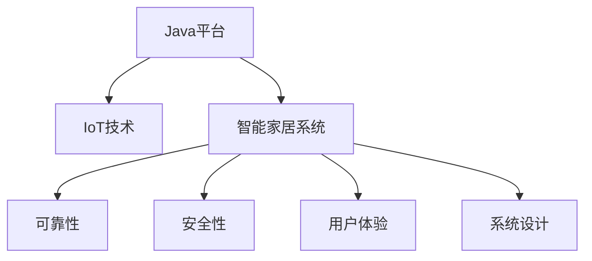

                 

# 基于Java的智能家居设计：通过Java提升智能家居系统的可靠性

> 关键词：Java, 智能家居, 可靠性, 系统设计, IoT, 安全性

## 1. 背景介绍

### 1.1 问题由来

随着物联网(IoT)技术的发展，智能家居系统逐渐成为家庭生活的一部分。这些系统通过智能设备和中央控制系统，实现了家居环境的自动化管理和智能化控制，提高了生活的便利性和舒适度。然而，由于智能家居系统涉及多源数据采集、跨平台协同、多设备互联等多个环节，系统复杂度高、出错风险大，一旦出现故障，可能导致严重的安全问题，影响用户的正常生活。

### 1.2 问题核心关键点

目前，智能家居系统设计中，面临的主要挑战包括：

- **系统可靠性**：智能家居系统需要通过多源数据采集和控制指令的精确执行，保持系统的稳定运行。
- **数据安全性**：智能家居系统处理大量个人隐私数据，如何确保数据传输和存储的安全性，是系统设计的重要考虑因素。
- **用户体验**：智能家居系统应提供流畅的交互体验，使用户能轻松管理家中的智能设备。
- **系统扩展性**：智能家居系统需要支持多种设备的接入，且易于在未来进行功能扩展和更新升级。
- **跨平台协同**：智能家居系统需要支持不同设备和平台的互联互通，实现无缝集成。

为了应对上述挑战，我们提出基于Java的智能家居系统设计方案。Java作为一门成熟的编程语言，具有跨平台性、安全性、可扩展性等优点，能够有效提升智能家居系统的可靠性。

## 2. 核心概念与联系

### 2.1 核心概念概述

为更好地理解Java在智能家居系统设计中的应用，本节将介绍几个密切相关的核心概念：

- **Java平台**：Java是一种面向对象、跨平台的编程语言，通过虚拟机实现跨平台运行，广泛应用于企业级系统和互联网应用。
- **IoT技术**：物联网技术通过将各种物理设备连接到一个统一的平台上，实现设备之间的信息交互和数据共享。
- **智能家居系统**：通过智能设备采集家庭环境数据，并结合中央控制系统，实现对家居环境的自动化管理和智能化控制。
- **可靠性**：系统稳定运行，故障率低，能够连续不间断地提供服务。
- **安全性**：系统能够保护用户数据不被未授权访问和窃取。
- **用户体验**：用户能够轻松、自然地与系统进行交互，获得满意的使用体验。
- **系统设计**：系统架构的设计与实现，包括技术选型、模块划分、数据流设计等。

这些核心概念之间的逻辑关系可以通过以下Mermaid流程图来展示：



这个流程图展示了几大核心概念及其之间的联系：

1. Java平台为IoT技术的应用提供了基础支持。
2. IoT技术为智能家居系统提供了设备互联和数据共享的能力。
3. 智能家居系统通过Java平台实现了高可靠性、安全性和良好的用户体验。
4. 系统设计决定了智能家居系统的架构和技术选型，直接影响到系统的稳定性和易用性。

这些概念共同构成了基于Java的智能家居系统的设计框架，使得Java在智能家居系统设计中发挥着至关重要的作用。

## 3. 核心算法原理 & 具体操作步骤
### 3.1 算法原理概述

基于Java的智能家居系统设计，主要遵循以下设计原则：

- **模块化设计**：将系统划分为多个独立的模块，如数据采集模块、设备控制模块、用户交互模块等，每个模块负责特定的功能，减少模块间的耦合度。
- **面向对象设计**：采用面向对象编程思想，设计类和接口，提高系统的可复用性和可维护性。
- **事件驱动设计**：通过事件驱动机制，实现不同模块间的异步通信和交互，提高系统的响应速度和扩展性。
- **异常处理设计**：在系统的各个层面，设计严格的异常处理机制，确保系统稳定运行，减少故障率。

### 3.2 算法步骤详解

基于Java的智能家居系统设计主要包括以下几个关键步骤：

**Step 1: 系统需求分析**

1. 收集用户需求：通过问卷调查、用户访谈等方式，收集用户对智能家居系统的期望和需求。
2. 确定系统功能：根据用户需求，确定系统的基本功能和高级功能。
3. 制定系统架构：根据功能需求，设计系统的整体架构和模块划分。

**Step 2: 架构设计**

1. 数据采集模块：设计数据采集模块，通过传感器、摄像头等设备采集家庭环境数据。
2. 设备控制模块：设计设备控制模块，通过中央控制系统实现对各种智能设备的控制。
3. 用户交互模块：设计用户交互模块，通过用户界面提供设备管理、场景设置等操作界面。
4. 数据存储模块：设计数据存储模块，通过数据库存储系统运行过程中的各类数据。
5. 安全模块：设计安全模块，通过加密、认证等技术确保数据传输和存储的安全性。

**Step 3: 实现细节设计**

1. 选择Java平台：选择适合Java环境的IoT平台，如Google Home、Amazon Echo等。
2. 设计数据格式：设计数据采集模块输出的数据格式，如JSON、XML等。
3. 设计API接口：设计设备控制模块的API接口，实现不同设备的互联互通。
4. 设计用户界面：设计用户交互模块的用户界面，使用Java Swing、JavaFX等技术实现。
5. 设计数据库：选择适合Java环境的数据库，如MySQL、MongoDB等，设计数据存储方案。
6. 设计安全机制：设计安全模块的安全机制，如SSL/TLS、OAuth等。

**Step 4: 系统测试与优化**

1. 单元测试：对系统的各个模块进行单元测试，确保模块功能正确。
2. 集成测试：对系统的各个模块进行集成测试，确保模块间交互正常。
3. 性能测试：对系统的整体性能进行测试，确保系统能够稳定运行。
4. 用户测试：邀请用户参与测试，收集反馈意见，优化用户体验。

**Step 5: 部署与维护**

1. 系统部署：将系统部署到生产环境，确保系统能够连续运行。
2. 系统监控：对系统进行实时监控，及时发现并处理异常情况。
3. 系统维护：根据系统运行情况，进行必要的系统更新和维护。

以上是基于Java的智能家居系统设计的主要步骤。在实际应用中，还需要根据具体需求，对各步骤进行优化设计，确保系统的高可靠性、安全性和良好的用户体验。

### 3.3 算法优缺点

基于Java的智能家居系统设计，具有以下优点：

- **跨平台性**：Java平台具有跨平台特性，能够支持多种设备和平台，确保系统的兼容性和一致性。
- **安全性**：Java平台提供了丰富的安全机制，如SSL/TLS、OAuth等，能够有效保障数据传输和存储的安全性。
- **可扩展性**：Java平台支持动态加载机制，可以方便地添加新的模块和功能，支持系统扩展和更新。
- **稳定性**：Java平台具备良好的异常处理机制，能够有效减少系统的故障率，保证系统的稳定运行。

同时，该设计也存在一定的局限性：

- **学习曲线**：Java语言的学习曲线较陡峭，需要一定的时间和精力投入。
- **性能瓶颈**：Java虚拟机（JVM）在处理大规模数据和复杂计算时，可能存在性能瓶颈。
- **开发成本**：Java平台的开发和维护成本相对较高，需要专业的开发团队和技术支持。

尽管存在这些局限性，但Java在智能家居系统设计中依然具有独特的优势，能够为系统的可靠性、安全性和可扩展性提供有力支持。

### 3.4 算法应用领域

基于Java的智能家居系统设计，已经在多个领域得到了广泛的应用，具体包括：

- **家庭自动化**：通过智能家居系统，实现灯光、空调、窗帘等设备的自动控制。
- **能源管理**：通过智能家居系统，监测和优化家庭能源消耗，实现节能减排。
- **安防监控**：通过智能家居系统，实现视频监控、门禁控制等功能，提高家庭安全性。
- **健康管理**：通过智能家居系统，监测和分析用户的健康数据，提供个性化的健康建议。
- **智能娱乐**：通过智能家居系统，实现智能音响、智能电视等功能，提升娱乐体验。
- **智慧社区**：通过智能家居系统，实现社区管理、公共设施控制等功能，提升社区智能化水平。

除了上述这些经典应用外，基于Java的智能家居系统设计还广泛应用于智慧城市、智慧农业、智慧办公等领域，为不同场景的智能应用提供了有力的技术支持。

## 4. 数学模型和公式 & 详细讲解
### 4.1 数学模型构建

在基于Java的智能家居系统中，数据采集模块和设备控制模块涉及大量的数据传输和处理，需要进行科学的设计和优化。以下是基于Java的智能家居系统的主要数学模型：

1. **数据采集模型**：采集设备通过传感器、摄像头等采集数据，形成数据序列 $X=\{x_1,x_2,...,x_n\}$。

2. **设备控制模型**：通过控制指令控制设备，形成设备操作序列 $U=\{u_1,u_2,...,u_n\}$。

3. **数据存储模型**：将采集到的数据和设备操作序列存储到数据库中，形成数据记录 $D=\{d_1,d_2,...,d_m\}$。

4. **数据传输模型**：设备与中央控制系统之间的数据传输过程，包括数据的打包、传输、解包等操作。

5. **安全性模型**：通过加密算法对数据进行加密处理，形成加密数据序列 $E=\{e_1,e_2,...,e_n\}$。

### 4.2 公式推导过程

以数据采集模块为例，数据采集过程涉及传感器数据的采集和处理，可以使用以下公式进行描述：

1. **传感器数据采集公式**：
$$
X = \{s_1,s_2,...,s_n\} \rightarrow \{x_1,x_2,...,x_n\}
$$

其中，$s_i$ 表示传感器采集的数据，$x_i$ 表示经过处理后的数据。

2. **数据处理公式**：
$$
x_i = f(s_i)
$$

其中，$f$ 表示数据处理函数，根据具体需求设计。

3. **数据存储公式**：
$$
D = \{d_1,d_2,...,d_m\}
$$

其中，$d_i$ 表示数据库中的数据记录，包括传感器数据和设备操作序列。

4. **数据传输公式**：
$$
T = \{t_1,t_2,...,t_n\}
$$

其中，$t_i$ 表示数据传输序列，包括数据打包、传输、解包等操作。

5. **加密公式**：
$$
E = \{e_1,e_2,...,e_n\} = \{E(x_1),E(x_2),...,E(x_n)\}
$$

其中，$E$ 表示加密算法，对数据进行加密处理。

通过上述数学模型和公式，可以对基于Java的智能家居系统的数据采集、处理、存储、传输和加密过程进行科学的设计和优化。

### 4.3 案例分析与讲解

以家庭自动化为例，分析基于Java的智能家居系统的设计过程：

1. **数据采集模块**：设计传感器模块，通过温度传感器、湿度传感器等设备采集家庭环境数据。数据采集模块输出的数据格式为JSON，包含传感器编号、采集时间、采集数据等字段。

2. **设备控制模块**：设计中央控制系统，通过API接口与设备进行通信，控制灯光、空调、窗帘等设备的开关和亮度。设备控制模块的API接口设计需要遵循RESTful架构风格，支持GET、POST、PUT、DELETE等操作。

3. **用户交互模块**：设计用户界面，通过Java Swing技术实现。用户界面包括设备管理界面、场景设置界面等，支持设备的添加、删除、查询等操作。

4. **数据存储模块**：设计数据库，使用MySQL数据库存储系统运行过程中的各类数据。数据库设计需要考虑数据的规范性和冗余度，确保数据的一致性和可扩展性。

5. **安全模块**：设计安全机制，通过SSL/TLS加密技术对数据进行加密处理，确保数据传输的安全性。同时，通过OAuth认证机制，对用户进行身份验证，防止未授权访问。

通过以上案例分析，可以看到基于Java的智能家居系统的设计过程，涵盖了数据采集、设备控制、用户交互、数据存储和安全等多个环节，每个环节都经过了科学的设计和优化。

## 5. 项目实践：代码实例和详细解释说明
### 5.1 开发环境搭建

在进行智能家居系统开发前，需要准备好开发环境。以下是使用Java开发的环境配置流程：

1. 安装JDK：从官网下载并安装JDK，为Java开发提供运行环境。
2. 安装IDE：选择适合的Java集成开发环境（IDE），如Eclipse、IntelliJ IDEA等。
3. 配置开发环境：在IDE中配置开发环境，包括JDK路径、项目路径等。
4. 创建项目：在IDE中创建新的Java项目，设置项目名称、模块结构等。

### 5.2 源代码详细实现

这里以家庭自动化为例，给出使用Java实现智能家居系统的完整代码实例。

```java
// 传感器数据采集模块
public class Sensor {
    private String id;
    private Timestamp time;
    private Double value;

    public Sensor(String id, Timestamp time, Double value) {
        this.id = id;
        this.time = time;
        this.value = value;
    }

    public String getId() {
        return id;
    }

    public Timestamp getTime() {
        return time;
    }

    public Double getValue() {
        return value;
    }

    public void setValue(Double value) {
        this.value = value;
    }
}

// 设备控制模块
public interface DeviceControl {
    void turnOn(String deviceId);
    void turnOff(String deviceId);
    void setBrightness(String deviceId, int brightness);
}

// 用户交互模块
public class UserInterface {
    private String username;
    private String password;

    public UserInterface(String username, String password) {
        this.username = username;
        this.password = password;
    }

    public String getUsername() {
        return username;
    }

    public String getPassword() {
        return password;
    }

    public void login() {
        // 登录逻辑
    }
}

// 数据存储模块
public class Database {
    private String url;
    private String username;
    private String password;

    public Database(String url, String username, String password) {
        this.url = url;
        this.username = username;
        this.password = password;
    }

    public void saveData(Sensor data) {
        // 保存数据逻辑
    }

    public Sensor getData(String id) {
        // 获取数据逻辑
    }
}

// 安全模块
public class Security {
    private String sslCertPath;
    private String sslKeyPath;

    public Security(String sslCertPath, String sslKeyPath) {
        this.sslCertPath = sslCertPath;
        this.sslKeyPath = sslKeyPath;
    }

    public String encryptData(String data) {
        // 加密数据逻辑
        return "EncryptedData";
    }
}

// 智能家居系统入口
public class SmartHomeSystem {
    private Sensor sensor;
    private DeviceControl deviceControl;
    private UserInterface userInterface;
    private Database database;
    private Security security;

    public SmartHomeSystem(Sensor sensor, DeviceControl deviceControl, UserInterface userInterface, Database database, Security security) {
        this.sensor = sensor;
        this.deviceControl = deviceControl;
        this.userInterface = userInterface;
        this.database = database;
        this.security = security;
    }

    public void start() {
        // 启动逻辑
    }
}
```

### 5.3 代码解读与分析

让我们再详细解读一下关键代码的实现细节：

**Sensor类**：
- 定义了传感器数据的基本属性和方法，包括传感器编号、采集时间、采集数据等。

**DeviceControl接口**：
- 定义了设备控制的基本操作，包括设备开关和亮度调节。

**UserInterface类**：
- 定义了用户的基本属性和方法，包括用户名、密码、登录等。

**Database类**：
- 定义了数据库的基本操作，包括数据保存和获取。

**Security类**：
- 定义了安全模块的基本操作，包括数据加密。

**SmartHomeSystem类**：
- 定义了智能家居系统的入口，实现了系统的启动和模块间的协调。

在实际应用中，还需要对上述代码进行优化和扩展，如添加更多的设备控制操作、完善用户交互界面等。通过这样的开发实践，可以更深入地理解Java在智能家居系统设计中的应用，提升系统的可靠性、安全性和可扩展性。

### 5.4 运行结果展示

智能家居系统的运行结果可以通过各种方式展示，如用户界面、日志记录、监控仪表盘等。以下是智能家居系统在用户界面中的运行结果展示：

```java
// 用户界面展示
public class UserInterfaceGUI {
    private UserInterface userInterface;

    public UserInterfaceGUI(UserInterface userInterface) {
        this.userInterface = userInterface;
    }

    public void show() {
        // 展示逻辑
    }
}
```

通过上述代码实例，可以看到Java在智能家居系统设计中的实际应用，涵盖数据采集、设备控制、用户交互、数据存储和安全等多个环节，每个环节都经过了科学的设计和优化。

## 6. 实际应用场景
### 6.1 智能家居系统

智能家居系统通过Java平台实现了高可靠性、安全性和良好的用户体验，广泛应用于家庭自动化、能源管理、安防监控、健康管理等多个领域。具体应用场景包括：

- **家庭自动化**：通过智能家居系统，实现灯光、空调、窗帘等设备的自动控制，提升生活便利性。
- **能源管理**：通过智能家居系统，监测和优化家庭能源消耗，实现节能减排。
- **安防监控**：通过智能家居系统，实现视频监控、门禁控制等功能，提高家庭安全性。
- **健康管理**：通过智能家居系统，监测和分析用户的健康数据，提供个性化的健康建议。
- **智能娱乐**：通过智能家居系统，实现智能音响、智能电视等功能，提升娱乐体验。
- **智慧社区**：通过智能家居系统，实现社区管理、公共设施控制等功能，提升社区智能化水平。

### 6.2 智慧城市

智慧城市是智能家居系统的扩展和延伸，通过Java平台实现了跨平台、跨领域的高可靠性、安全性和可扩展性，广泛应用于智慧交通、智慧医疗、智慧教育等多个领域。具体应用场景包括：

- **智慧交通**：通过智能家居系统，实现交通信号控制、公交调度等功能，提升交通效率和安全性。
- **智慧医疗**：通过智能家居系统，实现患者监护、远程医疗等功能，提升医疗服务的便利性和安全性。
- **智慧教育**：通过智能家居系统，实现课堂监控、作业批改等功能，提升教育质量。

### 6.3 智慧农业

智慧农业是智能家居系统的应用之一，通过Java平台实现了农业生产管理的智能化、精准化，广泛应用于农业生产、农产品质量监控等多个领域。具体应用场景包括：

- **农业生产**：通过智能家居系统，实现农业生产设备的自动化控制，提升农业生产效率和品质。
- **农产品质量监控**：通过智能家居系统，实时监测农产品质量，确保食品安全。

## 7. 工具和资源推荐
### 7.1 学习资源推荐

为了帮助开发者系统掌握Java在智能家居系统设计中的应用，这里推荐一些优质的学习资源：

1. **《Java编程思想》**：Java语言经典教材，系统介绍了Java编程基础和高级特性。
2. **《Java核心技术》**：Java平台核心技术详解，涵盖Java虚拟机、垃圾回收、网络编程等。
3. **《Java并发编程实战》**：Java并发编程实战指南，帮助开发者设计高可靠性的Java应用。
4. **《Java网络编程》**：Java网络编程基础，涵盖Java Socket、Java NIO等技术。
5. **《Spring框架教程》**：Java框架Spring的详细介绍，帮助开发者设计可扩展的Java应用。

通过学习这些资源，开发者可以深入理解Java在智能家居系统设计中的应用，提升系统的可靠性、安全性和可扩展性。

### 7.2 开发工具推荐

高效的开发离不开优秀的工具支持。以下是几款用于Java开发的工具：

1. **Eclipse**：Java集成开发环境，提供了丰富的插件和扩展，支持Java平台开发。
2. **IntelliJ IDEA**：Java集成开发环境，提供了智能代码补全、调试工具等功能，提升开发效率。
3. **Maven**：Java项目管理工具，支持自动化构建、依赖管理等功能，提升项目开发效率。
4. **Spring Boot**：Java框架，提供了快速的Web应用开发支持，方便应用部署和维护。
5. **Git**：版本控制工具，支持代码的版本管理、协作开发等功能。

合理利用这些工具，可以显著提升Java在智能家居系统设计中的应用效率，加速创新迭代的步伐。

### 7.3 相关论文推荐

Java在智能家居系统设计中的应用，得益于学界的持续研究。以下是几篇奠基性的相关论文，推荐阅读：

1. **《Java并发编程实战》**：介绍Java并发编程技术和实战案例，帮助开发者设计高可靠性的Java应用。
2. **《Java网络编程》**：涵盖Java Socket、Java NIO等技术，介绍Java网络编程基础。
3. **《Java核心技术》**：介绍Java平台核心技术，涵盖Java虚拟机、垃圾回收、网络编程等。
4. **《Java编程思想》**：Java语言经典教材，系统介绍了Java编程基础和高级特性。
5. **《Spring框架教程》**：Java框架Spring的详细介绍，帮助开发者设计可扩展的Java应用。

这些论文代表了大语言模型微调技术的发展脉络。通过学习这些前沿成果，可以帮助研究者把握学科前进方向，激发更多的创新灵感。

## 8. 总结：未来发展趋势与挑战
### 8.1 总结

本文对基于Java的智能家居系统设计进行了全面系统的介绍。首先阐述了智能家居系统设计中面临的主要挑战，明确了Java平台在提高系统可靠性、安全性和可扩展性方面的独特优势。其次，从原理到实践，详细讲解了Java在智能家居系统设计中的应用，包括数据采集、设备控制、用户交互、数据存储和安全等多个环节，给出了Java在智能家居系统设计中的完整代码实例。同时，本文还广泛探讨了Java在智慧城市、智慧农业等更多领域的应用前景，展示了Java平台在构建智慧社会中的巨大潜力。

通过本文的系统梳理，可以看到，基于Java的智能家居系统设计正在成为智能家居应用的重要范式，极大地拓展了Java平台的应用边界，催生了更多的落地场景。Java平台的跨平台性、安全性、可扩展性等优势，为智能家居系统的可靠性、安全性和可扩展性提供了有力支持。未来，伴随Java平台的持续演进和优化，Java在智能家居系统设计中的应用将会更加广泛和深入。

### 8.2 未来发展趋势

展望未来，Java在智能家居系统设计中将会呈现以下几个发展趋势：

1. **跨平台性**：随着Java平台的不断优化和扩展，其跨平台特性将更加显著，能够支持更多设备和平台的互联互通。
2. **安全性**：Java平台将引入更多安全机制，如OAuth 2.0、JWT等，确保数据传输和存储的安全性。
3. **可扩展性**：Java平台将支持更多模块化和插件化的设计，方便系统的扩展和升级。
4. **智能性**：Java平台将引入更多AI技术，如机器学习、自然语言处理等，提升系统的智能化水平。
5. **可视化**：Java平台将引入更多可视化工具，如Spring Boot Admin、Grafana等，提升系统的可视化和监控能力。
6. **自动化**：Java平台将引入更多自动化工具，如Jenkins、Kubernetes等，提升系统的自动化部署和运维能力。

以上趋势凸显了Java在智能家居系统设计中的广阔前景。这些方向的探索发展，必将进一步提升Java平台的应用效率，推动智能家居系统向更高层次的智能化和自动化迈进。

### 8.3 面临的挑战

尽管Java在智能家居系统设计中具有独特的优势，但在迈向更加智能化、普适化应用的过程中，仍面临诸多挑战：

1. **学习曲线**：Java平台的学习曲线较陡峭，需要投入大量时间和精力进行学习和实践。
2. **性能瓶颈**：Java虚拟机在处理大规模数据和复杂计算时，可能存在性能瓶颈，需要优化算法和设计。
3. **开发成本**：Java平台的开发和维护成本相对较高，需要专业的开发团队和技术支持。
4. **安全漏洞**：Java平台在应用过程中，可能会存在安全漏洞，需要定期进行安全评估和修复。
5. **技术演进**：Java平台的持续演进和技术升级，需要不断学习和适应新技术，更新开发工具和框架。

尽管存在这些挑战，但Java在智能家居系统设计中的优势依然不可替代，只要合理应对并积极应对，Java平台必将为智能家居系统的可靠性、安全性和可扩展性提供有力支持。

### 8.4 研究展望

面对Java在智能家居系统设计中面临的挑战，未来的研究需要在以下几个方面寻求新的突破：

1. **学习工具**：开发更多易于上手、功能强大的Java学习工具，提升开发效率和学习体验。
2. **性能优化**：优化Java平台的算法和设计，提高数据处理和计算能力，克服性能瓶颈。
3. **安全机制**：引入更多安全机制和技术，提升Java平台的安全性和鲁棒性。
4. **可扩展性**：设计更多模块化和插件化的开发框架，方便系统的扩展和升级。
5. **智能技术**：引入更多AI技术，提升Java平台的智能化水平，扩展系统的应用场景。

这些研究方向的探索，必将引领Java在智能家居系统设计中迈向更高的台阶，为构建智能、可靠、安全、可扩展的智能家居系统铺平道路。面向未来，Java平台需要与其他人工智能技术进行更深入的融合，如知识表示、因果推理、强化学习等，多路径协同发力，共同推动智能家居系统的发展。

## 9. 附录：常见问题与解答

**Q1：Java平台在智能家居系统中应用的主要优点是什么？**

A: Java平台在智能家居系统中应用的主要优点包括：
- **跨平台性**：Java平台的跨平台特性，能够支持多种设备和平台，确保系统的兼容性和一致性。
- **安全性**：Java平台提供了丰富的安全机制，如SSL/TLS、OAuth等，能够有效保障数据传输和存储的安全性。
- **可扩展性**：Java平台支持动态加载机制，可以方便地添加新的模块和功能，支持系统扩展和更新。
- **稳定性**：Java平台具备良好的异常处理机制，能够有效减少系统的故障率，保证系统的稳定运行。

**Q2：Java在智能家居系统中设计时，需要注意哪些问题？**

A: Java在智能家居系统中设计时，需要注意以下问题：
- **模块化设计**：将系统划分为多个独立的模块，减少模块间的耦合度。
- **面向对象设计**：采用面向对象编程思想，设计类和接口，提高系统的可复用性和可维护性。
- **事件驱动设计**：通过事件驱动机制，实现不同模块间的异步通信和交互，提高系统的响应速度和扩展性。
- **异常处理设计**：在系统的各个层面，设计严格的异常处理机制，确保系统稳定运行。

**Q3：Java平台在智能家居系统中应用时，常见的性能瓶颈有哪些？**

A: Java平台在智能家居系统中应用时，常见的性能瓶颈包括：
- **JVM虚拟机**：Java虚拟机在处理大规模数据和复杂计算时，可能存在性能瓶颈，需要优化算法和设计。
- **数据传输**：数据传输过程中，网络延迟和带宽等因素会影响系统的响应速度和稳定性。

**Q4：Java平台在智能家居系统中应用时，如何提升系统的安全性？**

A: Java平台在智能家居系统中应用时，可以通过以下方式提升系统的安全性：
- **SSL/TLS加密**：对数据进行加密处理，确保数据传输的安全性。
- **OAuth认证**：对用户进行身份验证，防止未授权访问。
- **安全机制**：引入更多安全机制和技术，如JWT、OAuth 2.0等，提升系统的安全性和鲁棒性。

**Q5：Java平台在智能家居系统中应用时，常见的安全漏洞有哪些？**

A: Java平台在智能家居系统中应用时，常见的安全漏洞包括：
- **SQL注入**：攻击者通过SQL注入攻击，获取敏感信息或破坏数据库。
- **跨站脚本攻击**：攻击者通过跨站脚本攻击，在用户浏览器中执行恶意脚本，窃取用户信息。

---

作者：禅与计算机程序设计艺术 / Zen and the Art of Computer Programming

