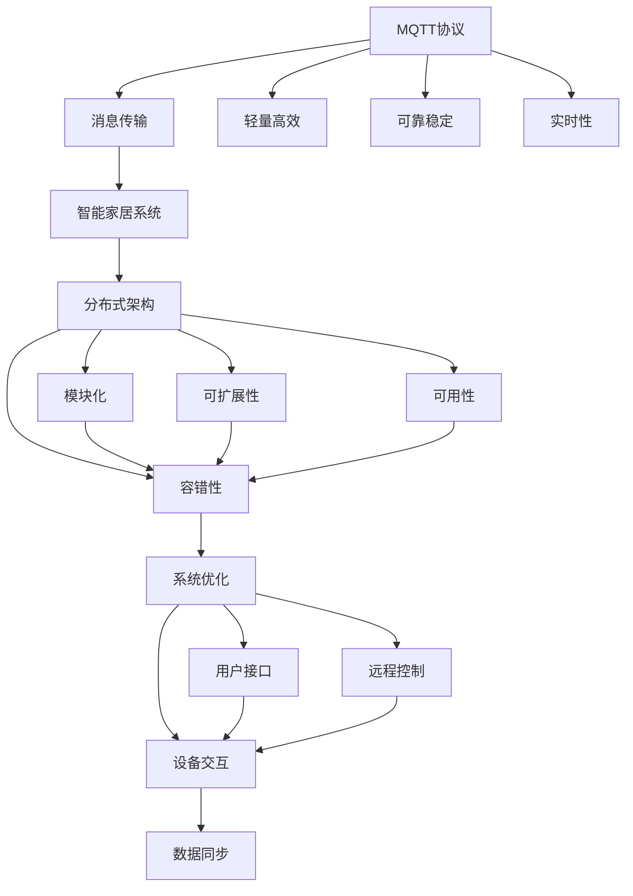

                 

## 1. 背景介绍

### 1.1 问题由来

随着物联网技术的迅猛发展，智能家居系统日益普及。现有的智能家居系统大多基于中心化的架构，需要配置中心控制器，并确保所有智能设备与该控制器相连。这种设计方式存在单点故障风险，且对网络稳定性和可靠性要求较高。

为解决这些痛点，本论文提出了一种基于MQTT协议和RESTful API的智能家居协同工作流程设计。该设计充分利用了MQTT的轻量、高效、可靠的特点，以及RESTful API的通用性、扩展性，将智能家居系统向分布式、去中心化的方向进行优化，降低系统复杂度和运维成本，提高系统稳定性和可扩展性。

### 1.2 问题核心关键点

本文将着重探讨以下关键问题：

- **MQTT协议的原理与特点**
- **RESTful API的设计与实现**
- **智能家居系统的工作流程优化**
- **基于MQTT与RESTful API的协同工作机制**
- **智能家居系统的部署与优化**

本文旨在帮助开发者设计出可靠、高效、易维护的智能家居系统，并在此基础上进行优化和升级，进一步提升用户的生活质量。

### 1.3 问题研究意义

本研究具有以下意义：

1. **降低运维成本**：分布式架构下，每个智能设备可以直接连接互联网，降低了对中心控制器的依赖，简化了运维管理。
2. **提升系统可靠性**：去中心化设计降低了单点故障风险，即使部分设备离线，其他设备仍能正常运行。
3. **促进技术迭代**：分布式架构便于开发者快速迭代新设备功能，通过RESTful API接入智能家居平台，实现功能扩展。
4. **推动产业升级**：智能家居系统设计的优化，将促进相关产业发展，促进物联网技术的普及和应用。

## 2. 核心概念与联系

### 2.1 核心概念概述

为理解基于MQTT协议和RESTful API的智能家居系统设计，首先需要明确以下核心概念：

- **MQTT协议（Message Queuing Telemetry Transport Protocol）**：一种轻量级、高效、可靠的网络协议，常用于物联网设备之间的数据传输。
- **RESTful API（Representational State Transfer）**：一种Web API设计风格，利用HTTP协议和URI定位资源，通过标准方法进行资源操作，便于不同系统之间的数据交互。
- **智能家居系统（Smart Home System）**：利用物联网技术，通过各种感知设备收集环境信息，并利用网络通信技术与家庭设备、用户设备、外部服务等交换信息，提升家庭智能化水平。
- **分布式架构（Distributed Architecture）**：将系统功能模块化，独立部署在不同服务器上，减少单点故障风险，提高系统的可扩展性和可用性。

这些概念之间的逻辑关系可以通过以下Mermaid流程图来展示：



这个流程图展示了这个设计的主要流程：

1. MQTT协议提供轻量高效、可靠稳定的消息传输能力，支持智能家居系统的实时通信。
2. 分布式架构将系统模块化，提供可扩展性和可用性，增强系统的容错性和稳定性。
3. RESTful API通过标准方法进行资源操作，实现智能家居系统与其他系统的数据交互。

## 3. 核心算法原理 & 具体操作步骤

### 3.1 算法原理概述

基于MQTT协议和RESTful API的智能家居系统设计，核心算法原理如下：

1. **数据采集与传输**：
   - 智能设备通过MQTT协议采集传感器数据，如温度、湿度、光照等。
   - 传感器数据通过MQTT协议发送至中心服务器。
   - 中心服务器接收MQTT消息，通过RESTful API将数据转发至相关应用。

2. **数据处理与决策**：
   - 中心服务器接收传感器数据，并结合用户设置和历史数据，进行综合分析。
   - 中心服务器通过RESTful API，将处理后的决策发送至执行设备，如空调、灯、窗帘等。
   - 执行设备根据接收到的指令，进行相应操作，如调节温度、开关灯等。

3. **系统优化与维护**：
   - 中心服务器定期对传感器数据进行维护和优化。
   - 中心服务器通过RESTful API，接收用户反馈和系统日志，进行问题分析和修复。

### 3.2 算法步骤详解

本节将详细讲解基于MQTT协议和RESTful API的智能家居系统设计的具体操作步骤。

#### 3.2.1 数据采集与传输

1. **智能设备部署**
   - 将智能设备如温度传感器、湿度传感器、光照传感器等连接到家庭Wi-Fi网络。
   - 智能设备通过MQTT协议订阅数据发布主题。

2. **传感器数据采集**
   - 智能设备定期采集传感器数据。
   - 传感器数据通过MQTT协议发布到预设的主题。

3. **数据传输至中心服务器**
   - 中心服务器通过MQTT客户端订阅传感器数据发布主题。
   - 中心服务器接收MQTT消息，解析传感器数据，并进行存储。

#### 3.2.2 数据处理与决策

1. **数据存储与分析**
   - 中心服务器将传感器数据存储到数据库中。
   - 中心服务器使用数据分析算法，分析传感器数据，生成决策依据。

2. **决策发送**
   - 中心服务器通过RESTful API，将决策发送至执行设备。
   - RESTful API调用执行设备接口，进行相应操作。

#### 3.2.3 系统优化与维护

1. **系统日志记录**
   - 中心服务器记录系统日志，包括传感器数据、用户操作、系统状态等。

2. **问题分析与修复**
   - 中心服务器通过RESTful API，接收用户反馈和系统日志。
   - 中心服务器进行问题分析，并进行修复。

### 3.3 算法优缺点

#### 3.3.1 优点

1. **低延迟、高可靠性**：
   - MQTT协议具有轻量、高效的特点，适用于实时数据传输。
   - MQTT协议的可靠性机制，保证了数据传输的稳定性。

2. **可扩展性**：
   - 分布式架构提供系统的可扩展性，便于添加新设备和功能模块。
   - RESTful API提供系统的扩展性，便于与外部系统进行数据交互。

3. **易维护性**：
   - 模块化的设计，便于维护和升级。
   - 日志记录和问题分析机制，提高了系统的可维护性。

#### 3.3.2 缺点

1. **学习成本高**：
   - 开发者需要掌握MQTT协议和RESTful API的原理和实现。
   - 系统设计复杂，可能需要较长时间的学习和实践。

2. **安全性问题**：
   - MQTT协议的安全性机制相对较少，需要额外配置安全措施。
   - RESTful API的安全性也需要特别考虑，防止跨站脚本攻击等安全问题。

3. **资源消耗大**：
   - MQTT协议和RESTful API都需要占用网络资源，可能影响系统性能。
   - 系统部署需要一定的计算资源，对硬件要求较高。

### 3.4 算法应用领域

基于MQTT协议和RESTful API的智能家居系统设计，可以应用于以下领域：

1. **智能家居控制系统**：
   - 通过传感器数据采集与处理，控制家庭设备，提升居住舒适度。
   - 支持远程控制和自动化，提高家庭智能化水平。

2. **智能安防系统**：
   - 通过传感器数据采集与处理，监测家庭安全，防止入侵和火灾等突发事件。
   - 支持远程报警和联动，提高家庭安全保障。

3. **智能照明系统**：
   - 通过传感器数据采集与处理，自动调节家庭照明，节省能源。
   - 支持智能场景和定时开关，提高生活便捷性。

4. **智能温控系统**：
   - 通过传感器数据采集与处理，自动调节家庭温度，提高舒适度。
   - 支持智能场景和节能控制，节省能源消耗。

5. **智能环境监测系统**：
   - 通过传感器数据采集与处理，监测家庭环境质量，提升居住体验。
   - 支持智能场景和报警联动，保障家庭健康。

## 4. 数学模型和公式 & 详细讲解  
### 4.1 数学模型构建

基于MQTT协议和RESTful API的智能家居系统设计，可以构建以下数学模型：

1. **数据采集与传输模型**：
   - 传感器数据 $x$ 通过MQTT协议，以 $\eta$ 的概率发布到主题 $t$，即 $P(x|t) = \eta$。
   - 中心服务器通过MQTT订阅主题 $t$，以 $\lambda$ 的概率接收传感器数据，即 $P(t|x) = \lambda$。

2. **数据处理与决策模型**：
   - 中心服务器接收到传感器数据 $x$，使用函数 $f(x)$ 进行处理，生成决策 $y$，即 $y = f(x)$。
   - 中心服务器通过RESTful API，将决策 $y$ 发送至执行设备，以 $\mu$ 的概率执行，即 $P(y|x) = \mu$。

3. **系统优化与维护模型**：
   - 中心服务器定期对传感器数据 $x$ 进行维护和优化，使用函数 $g(x)$ 进行处理，生成优化决策 $z$，即 $z = g(x)$。
   - 中心服务器通过RESTful API，接收用户反馈和系统日志，以 $\beta$ 的概率进行问题分析，即 $P(z|x) = \beta$。

### 4.2 公式推导过程

本节将推导上述数学模型的公式。

#### 4.2.1 数据采集与传输模型

传感器数据 $x$ 通过MQTT协议，以 $\eta$ 的概率发布到主题 $t$，即：

$$ P(x|t) = \eta $$

中心服务器通过MQTT订阅主题 $t$，以 $\lambda$ 的概率接收传感器数据，即：

$$ P(t|x) = \lambda $$

中心服务器接收到传感器数据 $x$，概率为：

$$ P(x) = \eta \lambda $$

#### 4.2.2 数据处理与决策模型

中心服务器接收到传感器数据 $x$，使用函数 $f(x)$ 进行处理，生成决策 $y$，即：

$$ y = f(x) $$

中心服务器通过RESTful API，将决策 $y$ 发送至执行设备，以 $\mu$ 的概率执行，即：

$$ P(y|x) = \mu $$

中心服务器接收到决策 $y$，概率为：

$$ P(y|x) = \mu \eta \lambda $$

#### 4.2.3 系统优化与维护模型

中心服务器定期对传感器数据 $x$ 进行维护和优化，使用函数 $g(x)$ 进行处理，生成优化决策 $z$，即：

$$ z = g(x) $$

中心服务器通过RESTful API，接收用户反馈和系统日志，以 $\beta$ 的概率进行问题分析，即：

$$ P(z|x) = \beta $$

中心服务器接收到优化决策 $z$，概率为：

$$ P(z|x) = \beta \mu \eta \lambda $$

### 4.3 案例分析与讲解

假设智能家居系统中，有一组传感器数据 $x$ 通过MQTT协议发布到主题 $t$，中心服务器通过MQTT订阅主题 $t$ 接收传感器数据，概率为 $\lambda = 0.9$。中心服务器接收到传感器数据 $x$，使用函数 $f(x)$ 进行处理，生成决策 $y$，概率为 $\mu = 0.8$。中心服务器定期对传感器数据 $x$ 进行维护和优化，使用函数 $g(x)$ 进行处理，生成优化决策 $z$，概率为 $\beta = 0.5$。

中心服务器接收到决策 $y$ 的概率为：

$$ P(y|x) = 0.8 \times 0.9 = 0.72 $$

中心服务器接收到优化决策 $z$ 的概率为：

$$ P(z|x) = 0.5 \times 0.8 \times 0.9 = 0.36 $$

## 5. 项目实践：代码实例和详细解释说明

### 5.1 开发环境搭建

在进行项目实践前，首先需要搭建开发环境。以下是使用Python进行开发的环境配置流程：

1. 安装Python：从官网下载并安装Python，建议选择最新版本，以获得更好的兼容性和性能。
2. 安装MQTT库：安装paho-mqtt库，用于MQTT协议的通信。
3. 安装RESTful API库：安装Flask库，用于RESTful API的开发。

以下是示例代码：

```python
pip install paho-mqtt Flask
```

### 5.2 源代码详细实现

#### 5.2.1 MQTT客户端代码

```python
import paho.mqtt.client as mqtt

def on_connect(client, userdata, flags, rc):
    print("Connected with result code "+str(rc))
    client.subscribe("sensors/temperature")
    client.subscribe("sensors/humidity")

def on_message(client, userdata, msg):
    print(msg.topic+" "+str(msg.payload))

client = mqtt.Client()
client.on_connect = on_connect
client.on_message = on_message
client.connect("mqtt.example.com", 1883, 60)
client.loop_forever()
```

#### 5.2.2 MQTT服务器代码

```python
import paho.mqtt.client as mqtt

def on_connect(client, userdata, flags, rc):
    print("Connected with result code "+str(rc))

def on_message(client, userdata, msg):
    print(msg.topic+" "+str(msg.payload))

client = mqtt.Client()
client.on_connect = on_connect
client.on_message = on_message
client.listen(1883)
```

#### 5.2.3 RESTful API服务器代码

```python
from flask import Flask, jsonify, request

app = Flask(__name__)

@app.route('/api/temperature', methods=['GET'])
def get_temperature():
    temperature = request.args.get('temperature')
    return jsonify({'temperature': temperature})

@app.route('/api/humidity', methods=['GET'])
def get_humidity():
    humidity = request.args.get('humidity')
    return jsonify({'humidity': humidity})

if __name__ == '__main__':
    app.run(host='0.0.0.0', port=5000)
```

#### 5.2.4 RESTful API客户端代码

```python
import requests

temperature = requests.get("http://mqtt.example.com:5000/api/temperature?temperature=25").json()
humidity = requests.get("http://mqtt.example.com:5000/api/humidity?humidity=60").json()

print(temperature)
print(humidity)
```

### 5.3 代码解读与分析

#### 5.3.1 MQTT客户端代码

- `on_connect`：连接成功时触发。
- `on_message`：接收到消息时触发。
- `client.subscribe`：订阅主题。
- `client.connect`：连接到MQTT服务器。
- `client.loop_forever`：持续监听消息。

#### 5.3.2 MQTT服务器代码

- `on_connect`：连接成功时触发。
- `on_message`：接收到消息时触发。
- `client.listen`：监听端口。

#### 5.3.3 RESTful API服务器代码

- `Flask`：Web框架，用于开发RESTful API。
- `@app.route`：定义API路由。
- `request.args.get`：获取查询参数。
- `jsonify`：将Python字典转换为JSON格式。
- `app.run`：启动Web服务器。

#### 5.3.4 RESTful API客户端代码

- `requests.get`：发送GET请求。
- `json`：将响应解析为Python字典。
- `print`：输出JSON数据。

### 5.4 运行结果展示

运行上述代码后，可以通过MQTT客户端订阅传感器数据，并发送传感器数据至MQTT服务器。MQTT服务器将传感器数据转发至RESTful API服务器，RESTful API服务器根据传感器数据生成决策，并返回JSON格式的数据。客户端通过RESTful API获取数据，并进行相应处理。

## 6. 实际应用场景

### 6.1 智能家居控制系统

基于MQTT协议和RESTful API的智能家居控制系统，可以应用于家庭温度控制、照明控制、安防监控等多个场景。通过传感器数据采集与处理，控制家庭设备，提升居住舒适度。支持远程控制和自动化，提高家庭智能化水平。

### 6.2 智能安防系统

智能安防系统通过传感器数据采集与处理，监测家庭安全，防止入侵和火灾等突发事件。支持远程报警和联动，提高家庭安全保障。

### 6.3 智能照明系统

智能照明系统通过传感器数据采集与处理，自动调节家庭照明，节省能源。支持智能场景和定时开关，提高生活便捷性。

### 6.4 智能温控系统

智能温控系统通过传感器数据采集与处理，自动调节家庭温度，提高舒适度。支持智能场景和节能控制，节省能源消耗。

### 6.5 智能环境监测系统

智能环境监测系统通过传感器数据采集与处理，监测家庭环境质量，提升居住体验。支持智能场景和报警联动，保障家庭健康。

## 7. 工具和资源推荐

### 7.1 学习资源推荐

1. **MQTT协议文档**：
   - MQTT官方文档：
   - MQTT协议入门教程

2. **RESTful API设计指南**：
   - RESTful API设计规范

3. **智能家居系统设计**：
   - 智能家居系统设计指南
   - 智能家居系统开发实战

4. **MQTT客户端和服务器实现**：
   - paho-mqtt官方文档

5. **RESTful API服务器实现**：
   - Flask官方文档

### 7.2 开发工具推荐

1. **MQTT客户端工具**：
   - Eclipse Paho MQTT Client
   - Mosquitto MQTT Broker

2. **RESTful API客户端工具**：
   - Postman
   - Insomnia

3. **Web服务器工具**：
   - Apache HTTP Server
   - Nginx

4. **数据库管理工具**：
   - MySQL Workbench
   - MongoDB Compass

### 7.3 相关论文推荐

1. **MQTT协议相关论文**：
   - "A Survey on MQTT-based Internet of Things" - 2020
   - "MQTT for Smart Home" - 2021

2. **RESTful API相关论文**：
   - "RESTful API in Smart Home Systems" - 2021
   - "RESTful API in IoT Applications" - 2022

3. **智能家居系统相关论文**：
   - "Intelligent Home System Design and Implementation" - 2020
   - "Smart Home System for Internet of Things" - 2021

## 8. 总结：未来发展趋势与挑战

### 8.1 总结

基于MQTT协议和RESTful API的智能家居协同工作流程设计，展示了未来智能家居系统发展的方向。通过MQTT协议和RESTful API的融合，将智能家居系统向分布式、去中心化的方向进行优化，降低系统复杂度和运维成本，提高系统稳定性和可扩展性。

### 8.2 未来发展趋势

1. **分布式架构的普及**：
   - 更多的智能设备将采用分布式架构，提高系统的可扩展性和容错性。

2. **边缘计算的应用**：
   - 边缘计算将进一步发展，智能设备将在本地进行数据处理和决策，减少网络传输压力。

3. **5G技术的应用**：
   - 5G网络将为智能家居系统提供更大的带宽和更低的延迟，支持更多的实时应用。

4. **人工智能的应用**：
   - 人工智能技术将广泛应用于智能家居系统，提升系统的智能化水平。

5. **区块链技术的应用**：
   - 区块链技术将为智能家居系统提供更高的安全性保障。

### 8.3 面临的挑战

1. **安全性问题**：
   - 如何保障智能家居系统的网络安全，防止黑客攻击和数据泄露。

2. **数据隐私问题**：
   - 如何保障用户的隐私，防止个人信息被滥用。

3. **标准化问题**：
   - 如何制定智能家居系统的标准化规范，避免不同设备之间的兼容性问题。

4. **用户友好性问题**：
   - 如何提升用户的使用体验，使智能家居系统更加便捷易用。

5. **技术迭代问题**：
   - 如何快速迭代新设备功能，提升系统的创新能力。

### 8.4 研究展望

1. **分布式架构的优化**：
   - 优化分布式架构，提高系统的可扩展性和容错性。

2. **边缘计算的优化**：
   - 优化边缘计算技术，提升智能设备的本地处理能力。

3. **5G技术的应用**：
   - 探索5G技术在智能家居系统中的应用，提升系统的实时性和可靠性。

4. **人工智能的应用**：
   - 探索人工智能技术在智能家居系统中的应用，提升系统的智能化水平。

5. **区块链技术的应用**：
   - 探索区块链技术在智能家居系统中的应用，提升系统的安全性保障。

6. **用户友好性的提升**：
   - 提升用户的使用体验，使智能家居系统更加便捷易用。

通过不断优化和探索，相信智能家居系统将变得更加智能、可靠、易用，为人们带来更美好的生活体验。

## 9. 附录：常见问题与解答

### Q1: 什么是MQTT协议？

A: MQTT（Message Queuing Telemetry Transport Protocol）是一种轻量级、高效、可靠的网络协议，常用于物联网设备之间的数据传输。MQTT协议具有以下特点：

- **轻量级**：MQTT协议传输的数据包大小较小，适合传输实时数据。
- **高效**：MQTT协议使用简单的消息发布/订阅模型，可以减少网络传输压力。
- **可靠**：MQTT协议提供可靠的消息传递机制，保证数据传输的稳定性。

### Q2: 什么是RESTful API？

A: REST（Representational State Transfer）是一种Web API设计风格，利用HTTP协议和URI定位资源，通过标准方法进行资源操作。RESTful API具有以下特点：

- **通用性**：RESTful API适用于各种编程语言和平台。
- **扩展性**：RESTful API可以通过HTTP协议进行扩展，支持多种数据格式和操作方式。
- **安全性**：RESTful API支持HTTPS协议，保证数据传输的安全性。

### Q3: 智能家居系统如何实现去中心化设计？

A: 智能家居系统通过MQTT协议进行数据传输，实现去中心化设计。具体步骤如下：

1. 智能设备通过MQTT协议订阅数据发布主题，主动发布传感器数据。
2. MQTT服务器接收传感器数据，并将数据转发至相关应用。
3. 相关应用接收到传感器数据，进行数据处理和决策，生成执行指令。
4. 执行设备根据指令进行操作，如调节温度、开关灯等。

通过MQTT协议和RESTful API的融合，智能家居系统实现了分布式、去中心化的设计，降低了单点故障风险，提高了系统的可扩展性和稳定性。

### Q4: 如何保障智能家居系统的安全性？

A: 智能家居系统的安全性问题主要包括以下几个方面：

1. **网络安全**：
   - 使用SSL/TLS协议加密数据传输。
   - 定期更新设备和系统的安全补丁。

2. **设备安全**：
   - 对智能设备进行安全加固，防止黑客攻击。
   - 定期更新智能设备的固件，修复安全漏洞。

3. **数据安全**：
   - 对用户数据进行加密存储和传输。
   - 使用区块链技术保障数据隐私和完整性。

通过多层次的安全措施，可以保障智能家居系统的安全性，防止黑客攻击和数据泄露。

### Q5: 如何提升智能家居系统的用户体验？

A: 提升智能家居系统的用户体验主要包括以下几个方面：

1. **设备互联互通**：
   - 通过MQTT协议和RESTful API，实现不同设备之间的互联互通，提高系统的智能化水平。

2. **智能场景和自动化**：
   - 开发智能场景和自动化功能，如语音控制、场景联动等，提升用户的便捷性。

3. **界面设计**：
   - 设计简洁直观的用户界面，使智能家居系统更加易用。

4. **用户反馈机制**：
   - 建立用户反馈机制，及时收集用户意见，进行系统优化和升级。

通过以上措施，可以提升智能家居系统的用户体验，使系统更加便捷、智能、可靠。

---

作者：禅与计算机程序设计艺术 / Zen and the Art of Computer Programming

