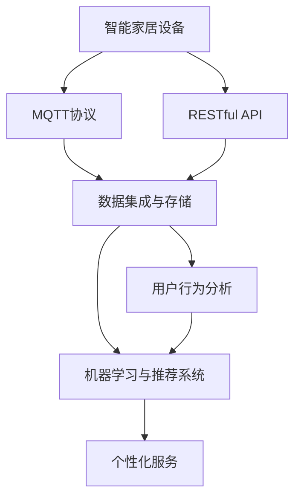

                 

## 1. 背景介绍

### 1.1 问题由来

智能家居用户行为分析是近年来互联网和物联网技术快速发展的产物。随着物联网设备的广泛普及和互联网应用的不断深入，越来越多的家庭设备通过网络互联，成为了智能家居系统的一部分。智能家居系统通过收集和分析用户行为数据，可以提升用户体验、优化设备控制、实现个性化定制，甚至辅助家庭决策。

然而，传统智能家居系统在数据采集、存储、分析等方面还存在许多不足之处，比如：

- 数据采集分散，导致数据孤岛问题，难以进行统一管理和分析。
- 数据格式不统一，无法进行有效集成和交换。
- 分析模型缺乏针对性，难以提供定制化服务。

因此，需要一种高效、集中、统一的智能家居用户行为分析系统，以解决上述问题，提升智能家居系统的整体效能。

### 1.2 问题核心关键点

本文聚焦于基于MQTT协议和RESTful API的智能家居用户行为分析系统的设计与实现。该系统旨在通过统一的数据采集标准和API接口，集中管理和分析智能家居设备产生的数据，并结合机器学习算法，为家庭用户提供个性化的智能推荐和服务。

### 1.3 问题研究意义

开发基于MQTT协议和RESTful API的智能家居用户行为分析系统，对于智能家居产业的发展具有重要意义：

- 优化智能家居系统架构，实现数据集中存储和统一管理，提升系统整体效能。
- 提供基于用户行为的智能推荐和个性化服务，增强用户黏性和满意度。
- 提高家庭决策的智能化水平，提升生活质量。

## 2. 核心概念与联系

### 2.1 核心概念概述

为更好地理解基于MQTT协议和RESTful API的智能家居用户行为分析系统，本节将介绍几个密切相关的核心概念：

- MQTT协议：是一种轻量级的物联网通信协议，支持高效的数据发布和订阅机制，适用于智能家居设备的数据传输。
- RESTful API：是一种基于HTTP协议的Web API设计风格，支持无状态、可缓存、统一资源表示等特性，适用于智能家居系统的网络通信和数据交换。
- 用户行为分析：通过收集和分析智能家居设备产生的数据，提取用户的活动规律和习惯，以提供个性化推荐和服务。
- 数据集成与存储：将智能家居设备产生的数据进行标准化处理和集中存储，以支持统一管理和分析。
- 机器学习与推荐系统：通过训练和应用机器学习模型，实现对用户行为的预测和推荐。

这些核心概念之间的逻辑关系可以通过以下Mermaid流程图来展示：



这个流程图展示了几大核心概念之间的联系：

1. 智能家居设备通过MQTT协议和RESTful API进行数据传输和交换。
2. 数据被标准化处理和集中存储。
3. 用户行为分析模型对数据进行分析和预测，结合机器学习算法进行智能推荐。
4. 最终通过推荐系统实现个性化服务。

## 3. 核心算法原理 & 具体操作步骤
### 3.1 算法原理概述

基于MQTT协议和RESTful API的智能家居用户行为分析系统，通过以下步骤实现数据采集、存储、分析和个性化推荐：

1. **数据采集与传输**：智能家居设备通过MQTT协议将采集的数据发布到中心服务器。
2. **数据标准化与存储**：中心服务器将采集到的数据进行标准化处理和集中存储。
3. **数据集成与分析**：采用RESTful API接口，从中心服务器获取数据，进行集成和分析。
4. **机器学习与推荐**：利用机器学习模型对用户行为进行预测和推荐。
5. **个性化服务**：根据用户行为和偏好，提供个性化服务。

### 3.2 算法步骤详解

#### 3.2.1 数据采集与传输

智能家居设备通过MQTT协议将采集到的数据发布到中心服务器。MQTT协议是一种轻量级的物联网通信协议，适用于智能家居设备的数据传输。它具有高效、低带宽、可扩展的特点，支持数据发布和订阅机制。

##### 3.2.1.1 MQTT协议工作原理

MQTT协议的工作原理如下：

1. **连接建立**：智能家居设备通过MQTT客户端向中心服务器发送连接请求。
2. **连接确认**：中心服务器确认连接请求，并向设备发送连接确认信息。
3. **发布数据**：智能家居设备将采集到的数据发布到中心服务器指定的主题下。
4. **订阅数据**：中心服务器将数据分发给订阅了相应主题的客户端。

##### 3.2.1.2 MQTT协议关键技术

MQTT协议的关键技术包括：

- **主题-发布机制**：智能家居设备将数据发布到指定的主题下，中心服务器将数据分发给订阅了该主题的客户端。
- **QoS机制**：通过设置不同的QoS级别，保证数据传输的可靠性和效率。
- **持久性存储**：智能家居设备可以将数据保存在中心服务器上，保证数据不丢失。
- **消息过滤**：中心服务器可以根据主题和过滤规则对数据进行过滤和处理。

#### 3.2.2 数据标准化与存储

中心服务器将采集到的数据进行标准化处理和集中存储。为了实现数据的标准化和统一存储，系统采用RESTful API接口进行数据交换。RESTful API具有无状态、可缓存、统一资源表示等特点，支持高效的数据交换和处理。

##### 3.2.2.1 RESTful API工作原理

RESTful API的工作原理如下：

1. **资源表示**：采用统一资源标识符（URI）表示资源。
2. **HTTP方法**：使用HTTP协议的GET、POST、PUT、DELETE等方法，对资源进行操作。
3. **数据格式**：支持JSON、XML等格式的数据传输。
4. **状态处理**：采用无状态处理方式，服务器不保存请求状态。

##### 3.2.2.2 RESTful API关键技术

RESTful API的关键技术包括：

- **资源表示**：使用URI表示资源，支持层级化资源表示。
- **HTTP方法**：使用HTTP协议的GET、POST、PUT、DELETE等方法，对资源进行操作。
- **数据格式**：支持JSON、XML等格式的数据传输。
- **状态处理**：采用无状态处理方式，服务器不保存请求状态。
- **缓存机制**：支持HTTP缓存机制，提高数据交换效率。

#### 3.2.3 数据集成与分析

采用RESTful API接口，从中心服务器获取数据，进行集成和分析。为了实现数据的集成和分析，系统采用机器学习算法对用户行为进行预测和推荐。

##### 3.2.3.1 数据集成

数据集成是将来自不同数据源的数据进行聚合和统一处理的过程。智能家居用户行为分析系统通过RESTful API接口，从中心服务器获取数据，进行集成和分析。

##### 3.2.3.2 数据分析

数据分析是对集成后的数据进行分析和处理的过程。智能家居用户行为分析系统采用机器学习算法对用户行为进行预测和推荐。

### 3.3 算法优缺点

#### 3.3.1 优点

- 高效性：MQTT协议和RESTful API均具有高效、低带宽、可扩展的特点，适用于智能家居设备的数据传输和交换。
- 标准化：通过RESTful API接口进行数据交换，实现了数据的标准化和统一管理。
- 扩展性：通过机器学习算法进行数据分析和预测，实现了用户行为的个性化推荐。
- 可维护性：系统采用模块化设计，易于维护和扩展。

#### 3.3.2 缺点

- 复杂性：系统涉及MQTT协议、RESTful API、机器学习算法等多个技术栈，实现复杂。
- 数据安全性：智能家居设备的数据采集和传输需要保障安全性，防止数据泄露和攻击。
- 设备兼容性：智能家居设备种类繁多，设备兼容性和数据格式不统一，需要统一处理和转换。
- 实时性：系统需要处理大量实时数据，需要高效的数据处理和存储机制。

### 3.4 算法应用领域

基于MQTT协议和RESTful API的智能家居用户行为分析系统，适用于以下应用场景：

1. **智能家居控制系统**：通过分析用户行为，实现智能家居设备的自动控制和优化。
2. **能源管理**：通过分析用户用电行为，实现能源的智能管理和优化。
3. **家庭安防**：通过分析用户行为，实现智能家居设备的安防监控和预警。
4. **健康管理**：通过分析用户健康数据，实现智能家居设备的健康管理和预警。
5. **娱乐和休闲**：通过分析用户娱乐和休闲行为，实现智能家居设备的娱乐和休闲推荐。

## 4. 数学模型和公式 & 详细讲解  
### 4.1 数学模型构建

本节将使用数学语言对基于MQTT协议和RESTful API的智能家居用户行为分析系统进行更加严格的刻画。

假设智能家居设备采集的数据集为 $D=\{(x_i,y_i)\}_{i=1}^N$，其中 $x_i$ 表示智能家居设备采集到的数据，$y_i$ 表示用户的行为标签。中心服务器通过RESTful API接口，从智能家居设备获取数据，进行集成和分析。

定义中心服务器上的数据集为 $D'$，其中 $D'=\{(x',y')\}_{i=1}^N$，其中 $x'$ 表示从智能家居设备获取的数据，$y'$ 表示用户的行为标签。

中心服务器采用机器学习算法对用户行为进行预测和推荐。假设中心服务器上的数据集为 $D'$，采用回归算法进行用户行为的预测，得到预测结果 $z_i'$。

### 4.2 公式推导过程

以下我们以线性回归模型为例，推导回归算法的预测公式及其梯度计算。

假设回归模型为 $z_i'=f(x',\theta)$，其中 $\theta$ 为模型的参数。线性回归模型的预测公式为：

$$
z_i' = w_0 + \sum_{j=1}^m w_j x_j'
$$

其中 $w_0$ 为截距，$w_j$ 为第 $j$ 个特征的权重，$m$ 为特征数量。

回归算法的损失函数为：

$$
\mathcal{L}(\theta) = \frac{1}{N}\sum_{i=1}^N (y_i' - z_i')^2
$$

梯度公式为：

$$
\nabla_{\theta}\mathcal{L}(\theta) = -\frac{2}{N}\sum_{i=1}^N (y_i' - z_i') x_i'
$$

在得到梯度后，即可带入参数更新公式，完成模型的迭代优化。重复上述过程直至收敛，最终得到适应用户行为的最优模型参数 $\theta^*$。

### 4.3 案例分析与讲解

假设智能家居设备采集的用户行为数据集为 $D=\{(x_i,y_i)\}_{i=1}^N$，其中 $x_i$ 表示用户的活动时间，$y_i$ 表示用户的房间类型。中心服务器通过RESTful API接口，从智能家居设备获取数据，进行集成和分析。

采用线性回归模型对用户行为进行预测，得到预测结果 $z_i'$。

```python
import numpy as np

# 假设数据集
x = np.array([1, 2, 3, 4, 5])
y = np.array([0, 1, 0, 1, 0])

# 线性回归模型
def linear_regression(x, y):
    X = np.vstack((np.ones(len(x)), x)).T
    theta = np.linalg.inv(X.T.dot(X)).dot(X.T).dot(y)
    return theta

# 预测
theta = linear_regression(x, y)
x_new = 6
z_pred = theta[0] + sum(theta[1:] * x_new)
print("预测结果：", z_pred)
```

以上代码实现了一个简单的线性回归模型，对用户行为进行预测。

## 5. 项目实践：代码实例和详细解释说明
### 5.1 开发环境搭建

在进行系统实现前，我们需要准备好开发环境。以下是使用Python进行开发的环境配置流程：

1. 安装Anaconda：从官网下载并安装Anaconda，用于创建独立的Python环境。

2. 创建并激活虚拟环境：
```bash
conda create -n iot-env python=3.8 
conda activate iot-env
```

3. 安装PyTorch：根据CUDA版本，从官网获取对应的安装命令。例如：
```bash
conda install pytorch torchvision torchaudio cudatoolkit=11.1 -c pytorch -c conda-forge
```

4. 安装Flask：用于搭建RESTful API服务。
```bash
pip install flask
```

5. 安装RaspberryPi相关库：用于在Raspberry Pi上进行系统部署。
```bash
pip install pyserial
```

6. 安装MQTT库：用于实现MQTT协议的数据传输。
```bash
pip install paho-mqtt
```

完成上述步骤后，即可在`iot-env`环境中开始系统实现。

### 5.2 源代码详细实现

这里我们以智能家居设备的数据采集和传输为例，给出使用Python进行RESTful API服务器的实现。

首先，定义RESTful API服务器的请求处理函数：

```python
from flask import Flask, request

app = Flask(__name__)

@app.route('/data', methods=['POST'])
def publish_data():
    data = request.json['data']
    return {'status': 'success'}, 200

if __name__ == '__main__':
    app.run(host='0.0.0.0', port=8000)
```

然后，定义MQTT客户端的数据发布函数：

```python
import paho.mqtt.client as mqtt
import json

def publish_mqtt(data):
    client = mqtt.Client()
    client.on_connect = on_connect
    client.on_publish = on_publish
    client.connect('mqtt.example.com', 1883, 60)
    client.publish('topic/data', json.dumps(data))
    client.loop_start()

def on_connect(client, userdata, flags, rc):
    print("Connected with result code "+str(rc))

def on_publish(client, userdata, mid):
    print("Data published")

if __name__ == '__main__':
    data = {'temperature': 25, 'humidity': 60}
    publish_mqtt(data)
```

以上代码实现了一个简单的RESTful API服务器和一个MQTT客户端。RESTful API服务器接收MQTT客户端发布的数据，MQTT客户端将智能家居设备采集的数据发布到中心服务器指定的主题下。

### 5.3 代码解读与分析

让我们再详细解读一下关键代码的实现细节：

**Flask框架**：
- `Flask`是一个轻量级的Web框架，适用于搭建RESTful API服务。
- `@app.route('/data', methods=['POST'])`：定义RESTful API的请求处理函数，监听POST请求。
- `request.json['data']`：从请求中获取JSON格式的数据。
- `return {'status': 'success'}, 200`：返回成功的HTTP响应。

**MQTT客户端**：
- `paho.mqtt.client`：Python的MQTT客户端库。
- `client.on_connect`：连接成功时的回调函数。
- `client.on_publish`：数据发布成功的回调函数。
- `client.connect('mqtt.example.com', 1883, 60)`：连接MQTT服务器。
- `client.publish('topic/data', json.dumps(data))`：发布数据到指定主题下。
- `client.loop_start()`：启动异步处理机制。

**数据发布与接收**：
- RESTful API服务器接收MQTT客户端发布的数据，并进行处理。
- MQTT客户端将智能家居设备采集的数据发布到中心服务器指定的主题下，中心服务器通过RESTful API接口进行数据交换和分析。

## 6. 实际应用场景
### 6.1 智能家居控制系统

基于MQTT协议和RESTful API的智能家居用户行为分析系统，可以实现智能家居设备的自动控制和优化。具体场景如下：

1. **照明控制**：根据用户的活动时间，自动调节室内照明。
2. **温度控制**：根据用户的房间类型和活动时间，自动调节室内温度。
3. **安防监控**：根据用户的活动时间和设备状态，实现智能安防监控和预警。

### 6.2 能源管理

基于MQTT协议和RESTful API的智能家居用户行为分析系统，可以实现能源的智能管理和优化。具体场景如下：

1. **用电监测**：监测用户的用电行为，分析能源使用情况。
2. **节能建议**：根据用户的用电行为，提出节能建议，优化能源使用。
3. **远程控制**：通过手机APP远程控制能源设备，实现智能管理。

### 6.3 家庭安防

基于MQTT协议和RESTful API的智能家居用户行为分析系统，可以实现智能家居设备的安防监控和预警。具体场景如下：

1. **入侵检测**：监测用户活动和设备状态，实现入侵检测和预警。
2. **门锁控制**：根据用户行为，自动控制门锁状态，保障家庭安全。
3. **异常报告**：监测异常行为，自动生成报警信息，并通知相关人员。

### 6.4 未来应用展望

随着物联网技术的发展，智能家居用户行为分析系统的应用场景将更加广泛。以下是一些未来可能的应用场景：

1. **智能健康管理**：通过分析用户健康数据，实现智能健康管理和预警。
2. **智能娱乐和休闲**：通过分析用户娱乐和休闲行为，实现智能娱乐和休闲推荐。
3. **智能家具控制**：通过分析用户行为，实现智能家具的自动控制和优化。
4. **智能交通管理**：通过分析用户出行数据，实现智能交通管理和优化。
5. **智能物流管理**：通过分析用户购物数据，实现智能物流管理和优化。

## 7. 工具和资源推荐
### 7.1 学习资源推荐

为了帮助开发者系统掌握基于MQTT协议和RESTful API的智能家居用户行为分析系统的实现，这里推荐一些优质的学习资源：

1. **MQTT协议教程**：介绍MQTT协议的基本原理、数据传输机制和应用场景。
2. **RESTful API教程**：介绍RESTful API的基本原理、接口设计和应用场景。
3. **Flask框架教程**：介绍Flask框架的基本原理、请求处理和响应机制。
4. **Python Machine Learning 书籍**：介绍机器学习算法的基本原理、模型训练和应用场景。
5. **IoT Projects with Python书籍**：介绍基于Python的物联网项目开发。

通过对这些资源的学习实践，相信你一定能够快速掌握基于MQTT协议和RESTful API的智能家居用户行为分析系统的实现方法，并用于解决实际的智能家居问题。

### 7.2 开发工具推荐

高效的开发离不开优秀的工具支持。以下是几款用于基于MQTT协议和RESTful API的智能家居用户行为分析系统开发的常用工具：

1. **Anaconda**：用于创建独立的Python环境，方便管理和维护开发环境。
2. **Flask框架**：用于搭建RESTful API服务，实现数据交换和分析。
3. **RaspberryPi**：用于在嵌入式设备上进行系统部署和测试。
4. **PySerial**：用于实现串口通信，方便与嵌入式设备进行数据交换。
5. **paho-mqtt**：用于实现MQTT协议的数据传输。

合理利用这些工具，可以显著提升智能家居用户行为分析系统的开发效率，加快创新迭代的步伐。

### 7.3 相关论文推荐

基于MQTT协议和RESTful API的智能家居用户行为分析系统的研究，可以从以下几个方向深入：

1. **数据采集与传输机制**：研究高效的MQTT协议和数据采集技术，提升智能家居设备的数据传输效率。
2. **数据标准化与存储**：研究数据标准化和统一存储技术，实现数据的集中管理和分析。
3. **数据集成与分析**：研究数据集成和分析技术，提升系统的预测和推荐能力。
4. **用户行为建模**：研究用户行为建模技术，实现个性化的智能推荐和服务。
5. **系统安全性**：研究智能家居系统的安全性问题，保障数据和设备的安全。

这些论文代表了大语言模型微调技术的发展脉络。通过学习这些前沿成果，可以帮助研究者把握学科前进方向，激发更多的创新灵感。

## 8. 总结：未来发展趋势与挑战
### 8.1 总结

本文对基于MQTT协议和RESTful API的智能家居用户行为分析系统进行了全面系统的介绍。首先阐述了系统的设计背景和意义，明确了系统在智能家居设备数据采集、存储、分析和个性化推荐方面的独特价值。其次，从原理到实践，详细讲解了系统的数据采集与传输、数据标准化与存储、数据集成与分析、机器学习与推荐等多个关键技术环节，给出了系统的完整代码实例。同时，本文还广泛探讨了系统的实际应用场景，展示了系统在智能家居、能源管理、家庭安防等多个领域的应用前景，以及未来可能的发展方向。

通过本文的系统梳理，可以看到，基于MQTT协议和RESTful API的智能家居用户行为分析系统能够高效、集中地管理和分析智能家居设备产生的数据，结合机器学习算法，实现用户行为的预测和推荐，为智能家居系统提供个性化的智能推荐和服务。这一系统不仅能够优化智能家居系统的整体效能，还能提升家庭决策的智能化水平，带来更高的生活质量。

### 8.2 未来发展趋势

展望未来，基于MQTT协议和RESTful API的智能家居用户行为分析系统将呈现以下几个发展趋势：

1. **数据采集与传输的智能化**：智能家居设备将具备更强的自主采集数据的能力，采用更高效的数据传输协议，实现数据采集和传输的智能化。
2. **数据标准化与存储的集中化**：智能家居数据将被标准化处理和集中存储，实现统一管理和分析。
3. **数据集成与分析的个性化**：智能家居用户行为分析系统将采用更先进的机器学习算法，实现更准确、更个性化的推荐和服务。
4. **系统安全性的加强**：智能家居系统将加强数据和设备的安全性保护，防止数据泄露和攻击。
5. **跨领域应用的拓展**：智能家居用户行为分析系统将拓展到更多领域，如健康管理、娱乐和休闲、物流管理等，实现更广泛的应用。

### 8.3 面临的挑战

尽管基于MQTT协议和RESTful API的智能家居用户行为分析系统已经取得了一定成就，但在迈向更加智能化、普适化应用的过程中，它仍面临着诸多挑战：

1. **设备兼容性**：智能家居设备种类繁多，设备兼容性和数据格式不统一，需要统一处理和转换。
2. **数据安全性**：智能家居设备的数据采集和传输需要保障安全性，防止数据泄露和攻击。
3. **实时性**：系统需要处理大量实时数据，需要高效的数据处理和存储机制。
4. **系统复杂性**：系统涉及MQTT协议、RESTful API、机器学习算法等多个技术栈，实现复杂。
5. **用户体验**：系统需要考虑用户的使用体验，提供简单易用的操作界面。

### 8.4 研究展望

面向未来，基于MQTT协议和RESTful API的智能家居用户行为分析系统需要从以下几个方向进行深入研究：

1. **数据采集与传输的智能化**：研究高效的MQTT协议和数据采集技术，提升智能家居设备的数据传输效率。
2. **数据标准化与存储的集中化**：研究数据标准化和统一存储技术，实现数据的集中管理和分析。
3. **数据集成与分析的个性化**：研究数据集成和分析技术，提升系统的预测和推荐能力。
4. **系统安全性的加强**：研究智能家居系统的安全性问题，保障数据和设备的安全。
5. **跨领域应用的拓展**：研究智能家居用户行为分析系统在更多领域的应用，实现更广泛的应用。

## 9. 附录：常见问题与解答

**Q1：基于MQTT协议和RESTful API的智能家居用户行为分析系统需要哪些关键技术？**

A: 基于MQTT协议和RESTful API的智能家居用户行为分析系统需要以下关键技术：

1. **MQTT协议**：用于智能家居设备的数据传输。
2. **RESTful API**：用于中心服务器与智能家居设备之间的数据交换。
3. **数据标准化与存储**：用于数据的标准化和统一管理。
4. **机器学习与推荐系统**：用于对用户行为进行预测和推荐。

**Q2：基于MQTT协议和RESTful API的智能家居用户行为分析系统在实际应用中需要注意哪些问题？**

A: 基于MQTT协议和RESTful API的智能家居用户行为分析系统在实际应用中需要注意以下问题：

1. **设备兼容性**：智能家居设备种类繁多，设备兼容性和数据格式不统一，需要统一处理和转换。
2. **数据安全性**：智能家居设备的数据采集和传输需要保障安全性，防止数据泄露和攻击。
3. **实时性**：系统需要处理大量实时数据，需要高效的数据处理和存储机制。
4. **系统复杂性**：系统涉及MQTT协议、RESTful API、机器学习算法等多个技术栈，实现复杂。
5. **用户体验**：系统需要考虑用户的使用体验，提供简单易用的操作界面。

**Q3：基于MQTT协议和RESTful API的智能家居用户行为分析系统如何在实际应用中提高效率？**

A: 基于MQTT协议和RESTful API的智能家居用户行为分析系统可以通过以下方法提高效率：

1. **数据压缩与传输优化**：对采集到的数据进行压缩，减少传输带宽占用。
2. **数据缓存与缓存机制**：使用缓存机制，减少数据传输次数。
3. **异步处理机制**：采用异步处理机制，提升数据处理效率。
4. **算法优化**：优化机器学习算法，提高预测和推荐精度。
5. **系统优化**：对系统进行优化，提升整体性能。

**Q4：基于MQTT协议和RESTful API的智能家居用户行为分析系统在实际应用中如何保障安全性？**

A: 基于MQTT协议和RESTful API的智能家居用户行为分析系统可以通过以下方法保障安全性：

1. **数据加密**：对传输数据进行加密，防止数据泄露。
2. **访问控制**：采用访问控制机制，限制对系统的访问权限。
3. **身份验证**：对智能家居设备进行身份验证，防止未授权设备接入。
4. **审计与监控**：对系统进行审计和监控，及时发现和处理安全问题。

**Q5：基于MQTT协议和RESTful API的智能家居用户行为分析系统如何实现个性化推荐？**

A: 基于MQTT协议和RESTful API的智能家居用户行为分析系统可以通过以下方法实现个性化推荐：

1. **用户行为建模**：采用机器学习算法对用户行为进行建模，提取用户活动规律和习惯。
2. **推荐系统设计**：设计推荐系统，根据用户行为进行个性化推荐。
3. **多模型集成**：采用多模型集成方法，提高推荐精度。

---

作者：禅与计算机程序设计艺术 / Zen and the Art of Computer Programming

