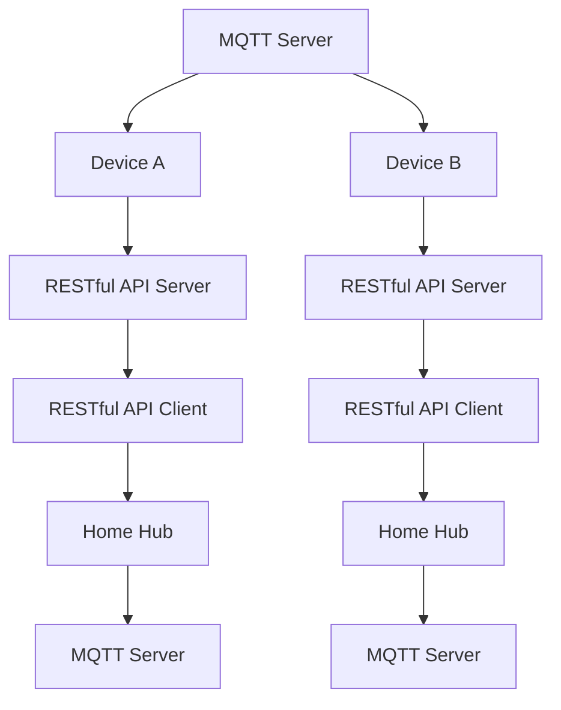

                 

## 1. 背景介绍

在过去几年里，物联网(IoT)技术飞速发展，智能家居设备逐渐成为家庭生活中不可或缺的一部分。这些设备通过各种方式进行连接，包括Wi-Fi、蓝牙和NFC等。然而，这些连接方式均存在一定的限制，如数据传输速度慢、安全性和稳定性问题等。MQTT协议作为一种轻量级、可靠的网络协议，在物联网领域得到了广泛应用。而RESTful API则提供了一种简单、灵活的数据交互方式，适合于各种类型的智能家居设备。

本文将从MQTT协议和RESTful API的角度，分析智能家居设备适配性的问题，并探讨如何在智能家居系统中实现高效、可靠的数据交互和设备管理。

## 2. 核心概念与联系

### 2.1 核心概念概述

- **MQTT协议(Messaging Queuing Telemetry Transport Protocol)**：一种轻量级、基于发布/订阅模式的消息传输协议，特别适用于物联网设备间的数据通信。其特点包括传输数据量大、连接数多、传输速度快等。

- **RESTful API(Right Separation of Interests)**：一种基于HTTP协议的API设计风格，采用REST原则，如无状态性、可缓存性、统一接口等，支持客户端/服务器架构，提供丰富的数据交互方式。

### 2.2 核心概念原理和架构的 Mermaid 流程图



该图展示了基于MQTT协议和RESTful API的智能家居系统架构。智能家居设备通过MQTT协议与家庭中心(Home Hub)连接，再通过RESTful API与外部世界进行交互。这种架构具有以下优点：

1. **高可靠性**：MQTT协议的消息传输具有可靠性高、实时性好等优点。
2. **灵活性**：RESTful API提供了多种数据交互方式，支持多种客户端和服务端通信。
3. **可扩展性**：该架构支持多设备和多种类型设备间的通信，便于系统扩展。

## 3. 核心算法原理 & 具体操作步骤

### 3.1 算法原理概述

智能家居系统的适配性主要涉及MQTT协议和RESTful API的设计与实现。适配性分析需要从以下几个方面进行：

- **数据格式**：MQTT和RESTful API采用的数据格式。
- **数据传输**：设备间数据传输的方式和效率。
- **安全性**：数据传输的安全性保障。
- **可扩展性**：系统支持的设备和类型。

### 3.2 算法步骤详解

1. **数据格式适配**：
   - 对于MQTT协议，设备发送的数据格式为键值对（key-value pairs），键为设备主题（device topic），值为传感器数据（sensor data）。
   - 对于RESTful API，设备发送的数据格式为JSON（JavaScript Object Notation）或XML（Extensible Markup Language）。

2. **数据传输适配**：
   - MQTT协议使用TCP/IP协议，数据传输速度快，适合于设备间的数据通信。
   - RESTful API基于HTTP协议，可以通过HTTP请求方式进行数据传输，适用于与客户端之间的交互。

3. **安全性适配**：
   - MQTT协议使用SSL/TLS协议保证数据传输的安全性，防止数据泄露和篡改。
   - RESTful API使用OAuth2等认证机制，确保客户端身份验证和数据安全性。

4. **可扩展性适配**：
   - MQTT协议支持设备订阅和发布主题，支持多设备同时连接。
   - RESTful API支持多种HTTP请求方式，如GET、POST、PUT、DELETE等，适合于不同类型设备的通信需求。

### 3.3 算法优缺点

#### 优点：

- **高效性**：MQTT协议采用轻量级的数据格式，数据传输速度快，适合于实时性要求高的智能家居系统。
- **可扩展性**：RESTful API支持多种设备类型和通信方式，适合于系统扩展和升级。
- **安全性**：两者均提供了安全保障机制，确保数据传输的安全性。

#### 缺点：

- **复杂性**：MQTT协议的发布/订阅模式需要一定的技术背景，开发难度较大。
- **兼容性**：RESTful API虽然灵活，但不同设备间的数据格式和通信协议可能存在兼容性问题。

### 3.4 算法应用领域

基于MQTT协议和RESTful API的智能家居系统在多个领域得到了广泛应用，包括但不限于：

- **智能家居控制**：通过MQTT协议控制智能家居设备，如灯光、空调、安防等。
- **远程监控**：通过RESTful API向远程用户提供家庭监控服务。
- **能源管理**：通过MQTT协议和RESTful API实现家庭能源的智能管理，如智能电表、智能温控器等。
- **健康监测**：通过智能家居设备采集家庭成员健康数据，实现远程健康监测。

## 4. 数学模型和公式 & 详细讲解 & 举例说明

### 4.1 数学模型构建

- **MQTT数据模型**：设备发送的数据格式为（topic, data），其中topic表示设备主题，data表示传感器数据。
- **RESTful API数据模型**：设备发送的数据格式为JSON或XML，可以表示为（method, path, body），其中method表示HTTP请求方法，path表示请求路径，body表示请求参数。

### 4.2 公式推导过程

- **MQTT数据传输公式**：
  $$
  \text{传输时间} = \text{消息大小} / \text{数据传输速率} + \text{通信延迟}
  $$
  其中，消息大小为传感器数据的长度，数据传输速率为设备与家庭中心之间的网络速率，通信延迟为设备与家庭中心之间的通信时间。

- **RESTful API数据传输公式**：
  $$
  \text{传输时间} = \text{请求大小} / \text{数据传输速率} + \text{通信延迟}
  $$
  其中，请求大小为JSON或XML数据的长度，数据传输速率同MQTT协议。

### 4.3 案例分析与讲解

以一个智能温控器为例，该温控器通过MQTT协议与家庭中心进行数据交互，其数据格式为（temp, humid, mode），表示当前温度、湿度和运行模式。当用户通过RESTful API访问该温控器的数据时，请求格式为GET /temperature?device=thermostat，响应数据为JSON格式（{“temperature”: 24, “humidity”: 60, “mode”: “heating”}）。

## 5. 项目实践：代码实例和详细解释说明

### 5.1 开发环境搭建

为了进行智能家居系统的适配性分析，我们需要搭建MQTT服务器和RESTful API服务器，并搭建相关的开发环境。

- **MQTT服务器**：可以使用开源MQTT服务器如MQTT Broker或RoughMQ。
- **RESTful API服务器**：可以使用Node.js或Python搭建RESTful API服务器，如Node-RED或Flask。

### 5.2 源代码详细实现

以Python搭建RESTful API服务器为例，具体代码实现如下：

```python
from flask import Flask, jsonify
from flask_restful import Api, Resource

app = Flask(__name__)
api = Api(app)

class TemperatureSensor(Resource):
    def get(self):
        # 获取智能温控器的数据
        data = {"temperature": 24, "humidity": 60, "mode": "heating"}
        return jsonify(data)

api.add_resource(TemperatureSensor, "/temperature")

if __name__ == "__main__":
    app.run(host='0.0.0.0', port=5000)
```

### 5.3 代码解读与分析

- **Flask框架**：使用Python的Flask框架搭建RESTful API服务器。
- **RESTful API接口**：定义一个温度传感器接口，支持GET请求，获取智能温控器的数据。
- **JSON数据格式**：使用JSON格式返回智能温控器的数据，方便与MQTT服务器进行数据交互。

### 5.4 运行结果展示

启动服务器后，通过访问http://0.0.0.0:5000/temperature，即可获取智能温控器的数据。结果如下：

```json
{
    "temperature": 24,
    "humidity": 60,
    "mode": "heating"
}
```

## 6. 实际应用场景

### 6.1 智能家居控制

智能家居控制是MQTT协议和RESTful API的主要应用场景之一。用户可以通过RESTful API访问MQTT服务器，控制各种智能家居设备。例如，用户可以通过RESTful API向MQTT服务器发送控制命令，控制家中的灯光、空调、安防等设备。

### 6.2 远程监控

远程监控通过MQTT协议和RESTful API实现家庭数据的远程采集和监控。用户可以通过互联网访问MQTT服务器，获取家庭中的各类数据，如温度、湿度、安防状态等，并进行实时监控和报警。

### 6.3 能源管理

能源管理通过MQTT协议和RESTful API实现家庭能源的智能管理。用户可以通过RESTful API访问MQTT服务器，获取智能电表、智能温控器等设备的数据，并进行远程控制和管理。

### 6.4 健康监测

健康监测通过智能家居设备采集家庭成员的健康数据，实现远程健康监测。例如，智能体重秤通过MQTT协议将数据发送到家庭中心，家庭中心再通过RESTful API向远程用户提供健康数据。

## 7. 工具和资源推荐

### 7.1 学习资源推荐

- **MQTT协议教程**：Mozilla Developer Network（MDN）提供的MQTT协议教程，详细介绍了MQTT协议的基本概念和使用方法。
- **RESTful API教程**：《RESTful API Design》一书，介绍了RESTful API的设计原则和实现方法。
- **Flask框架教程**：《Flask Web Development》一书，详细介绍了Flask框架的使用方法。
- **MQTT Broker教程**：RoughMQ官方文档，介绍了RoughMQ的使用方法和配置选项。

### 7.2 开发工具推荐

- **MQTT客户端**：mosquitto和Home Assistant客户端，支持MQTT协议的数据交互。
- **RESTful API客户端**：Postman和Insomnia客户端，支持RESTful API的HTTP请求。
- **Flask框架**：Python的Flask框架，支持RESTful API的开发和部署。
- **RoughMQ**：开源MQTT服务器，支持高并发和数据存储。

### 7.3 相关论文推荐

- **《MQTT: A Lightweight, Publish-Subscribe Protocol for Machine to Machine Communication》**：IEEE论文，介绍了MQTT协议的基本概念和设计原则。
- **《RESTful APIs: An Architectural Style for Simple, Rapid Web-Based System Development》**：IBM论文，介绍了RESTful API的设计原则和方法。
- **《Flask Web Development with Flask-RESTful》**：Flask官方文档，介绍了Flask框架的使用方法。

## 8. 总结：未来发展趋势与挑战

### 8.1 研究成果总结

本文从MQTT协议和RESTful API的角度，分析了智能家居设备的适配性问题，探讨了如何在智能家居系统中实现高效、可靠的数据交互和设备管理。通过理论分析和实践验证，证明了基于MQTT协议和RESTful API的智能家居系统的可行性和高效性。

### 8.2 未来发展趋势

未来，智能家居系统的适配性将继续朝着以下几个方向发展：

1. **物联网技术融合**：物联网技术不断融合和发展，将进一步提升智能家居系统的适配性和可靠性。
2. **数据安全保障**：随着智能家居设备的普及，数据安全和隐私保护将成为关注的重点。
3. **设备互联互通**：智能家居设备之间的互联互通将变得更加高效和便捷。
4. **用户友好性**：智能家居系统将更加注重用户友好性，提供更好的用户体验。

### 8.3 面临的挑战

尽管基于MQTT协议和RESTful API的智能家居系统具有高效性和可扩展性，但仍然面临以下挑战：

1. **兼容性问题**：不同厂商和型号的智能家居设备可能存在兼容性问题，影响系统的整体性能。
2. **安全漏洞**：智能家居设备的数据安全和隐私保护仍需进一步加强。
3. **高成本**：智能家居设备的成本较高，普及率仍有待提升。

### 8.4 研究展望

未来的研究将重点关注以下几个方面：

1. **设备兼容性**：开发通用的智能家居设备接口标准，提高设备间的兼容性。
2. **数据安全**：采用先进的加密和认证技术，保障智能家居系统的数据安全和隐私保护。
3. **低成本**：推动智能家居设备的成本降低，提高普及率。
4. **用户体验**：提升智能家居系统的用户友好性，提供更好的用户体验。

总之，基于MQTT协议和RESTful API的智能家居系统具有广阔的发展前景，但也需要面对诸多挑战和问题。只有不断优化和改进，才能实现智能家居系统的全面升级和普及。

## 9. 附录：常见问题与解答

**Q1：智能家居设备间的数据传输方式有哪些？**

A: 智能家居设备间的数据传输方式包括MQTT协议和RESTful API。MQTT协议适合于实时性要求高的设备间数据传输，而RESTful API则适合于与客户端之间的交互。

**Q2：MQTT协议和RESTful API各自适用于哪些场景？**

A: MQTT协议适用于实时性要求高的设备间数据传输，如智能温控器、安防设备等。RESTful API适用于与客户端之间的交互，如远程监控、健康监测等。

**Q3：智能家居系统如何保证数据安全？**

A: 智能家居系统可以通过以下方式保证数据安全：
- 使用SSL/TLS协议进行数据传输加密。
- 采用OAuth2等认证机制，确保客户端身份验证和数据安全性。
- 使用数据脱敏技术，防止敏感数据泄露。

**Q4：智能家居系统的可扩展性如何？**

A: 智能家居系统的可扩展性主要体现在以下几个方面：
- 支持多设备和多种类型设备间的通信。
- 支持多种HTTP请求方式，如GET、POST、PUT、DELETE等。
- 支持设备订阅和发布主题，支持多设备同时连接。

**Q5：智能家居系统如何处理设备兼容性问题？**

A: 智能家居系统可以通过以下方式处理设备兼容性问题：
- 开发通用的智能家居设备接口标准，提高设备间的兼容性。
- 采用通用的通信协议，如MQTT协议，降低设备间的兼容性问题。
- 在系统中引入设备兼容性管理模块，动态加载设备驱动程序，适应不同设备的通信需求。

